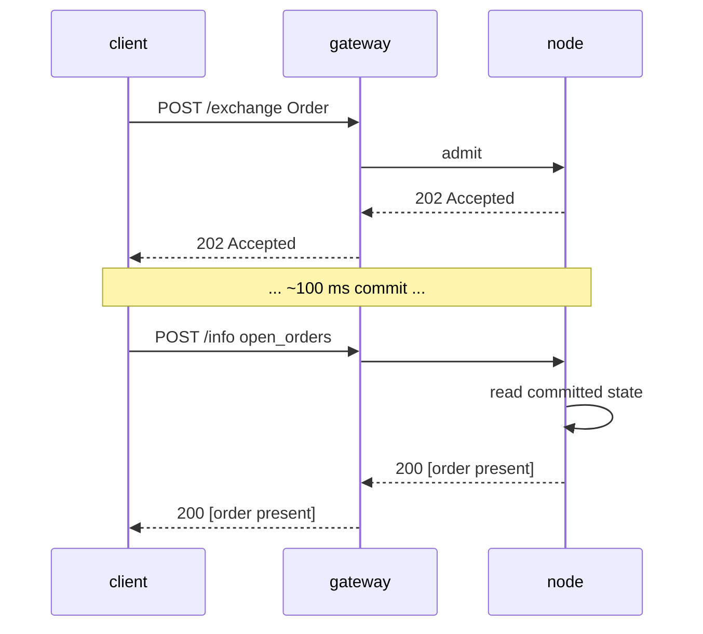

# `POST /info` — endpoint de lectura y consulta

:::info
**Estado.** Estructura **estable**. Los tipos de consulta se añaden con el tiempo; el sobre está consolidado.
:::

## TL;DR

Un único endpoint, múltiples tipos. Despacha según el campo `type` del cuerpo de la solicitud. Solo lectura — nunca muta estado, nunca requiere firma.

:::tip
**Dividido por producto.** Las consultas de lectura de mercados de contratos perpetuos están en [consultas de perpetuos](./info/perpetuals.md); las consultas de lectura de spot, margen spot y Earn están en [consultas spot y margen](./info/spot.md). Esta página cubre el sobre, las convenciones, las lecturas de cuenta/gobernanza/vault/validador, y la tabla de alias de compatibilidad HL.
:::

## URL

```
POST  https://<net>-gateway.mtf.exchange/info
```

| Ruta | Forma en wire |
|------|-----------|
| `POST /info` (gateway por defecto) | Nativo MTF (este documento) |
| `POST /hl/info` (gateway, bajo `/hl`) | **Compatible con HL** — ver [hl-compat.md](./hl-compat.md) |

MTF nativo es la ruta por defecto del gateway; el modo compatible con HL está bajo el espacio de nombres `/hl/*`.
Si ejecuta el nodo usted mismo, el mismo `/info` nativo se sirve directamente en
`http://localhost:8080`.

## Sobre

Solicitud:

```json
{ "type": "<query_type>", /* args específicos del tipo */ }
```

Respuesta:

```json
{ "type": "<query_type>", "data": { /* específico del tipo */ } }
```

Ante un `type` desconocido: `400 Bad Request` con `{"error":"unknown info type: <X>"}`.
Ante un recurso desconocido (p. ej. id de vault desconocido): `404 Not Found` con `{"error":"<resource> not found"}`.

## Tipos de consulta

### `node_info`

Identidad estática del nodo + versión de protocolo. Sin parámetros.

```json
{ "type": "node_info" }
```

Respuesta:

```json
{
  "type": "node_info",
  "data": {
    "network":           "testnet",
    "chain_id":          114514,
    "protocol_version":  "1.0.0",
    "validator_index":   null,
    "build_commit":      "unknown",
    "version":           "0.0.1",
    "freeze_halt_supported": true,
    "uptime_seconds":    0
  }
}
```

| Campo | Tipo | Descripción |
|-------|------|-------------|
| `network` | `"devnet" \| "testnet" \| "mainnet"` | Variante de red, derivada del `chain_id` (`31337`=devnet, `114514`=testnet, `8964`=mainnet) |
| `chain_id` | uint64 | Id de cadena EIP-712 — el MISMO valor que debe usar el dominio de firma de `/exchange` |
| `protocol_version` | semver string | Versión del protocolo wire |
| `validator_index` | uint32 \| null | Índice de este nodo en el conjunto de validadores activos; **PENDIENTE:** `null` hasta que el runtime llame a `set_validator_index` |
| `build_commit` | hex string | Identificador de compilación publicado por el operador; **PENDIENTE:** `"unknown"` hasta que se publique |
| `version` | semver string | Versión de lanzamiento del software del nodo, incorporada en tiempo de compilación. Un lanzamiento comparte un único `version` entre sus binarios — `build_commit` es el diferenciador por compilación |
| `freeze_halt_supported` | bool | Siempre `true` para este binario — indicador de capacidad: el nodo respeta [`exchange_status.scheduled_freeze_height`](#exchange_status), deteniéndose limpiamente con código de salida `77` una vez que la altura de congelación se confirma, para que un supervisor de nodo pueda cargar la siguiente versión |
| `uptime_seconds` | uint64 | Tiempo de actividad del proceso; **PENDIENTE:** `0` hasta que el runtime llame a `set_uptime_seconds` |

Estos son campos **por nodo** (identidad del nodo / runtime), NO estado de consenso, por lo que pueden diferir legítimamente entre nodos.

### `account_state`

Instantánea por cuenta.

```json
{ "type": "account_state", "address": "0x<addr>" }
```

| Arg | Tipo | Requerido |
|-----|------|----------|
| `address` | hex address | sí |

Una **dirección desconocida** (nunca vista en cadena) devuelve **200** con un
registro completamente en cero (`account_value:"0"`, `positions` / `balances.spot` vacíos), NO un `404`.

Respuesta (cuenta financiada por faucet, sin posiciones):

```json
{
  "type": "account_state",
  "data": {
    "address":         "0x00000000000000000000000000000000000ca11e",
    "account_value":   "3000",
    "free_collateral": "3000",
    "maint_margin":    "0",
    "init_margin":     "0",
    "health":          "3000",
    "tier":            "Safe",
    "mode":            "Cross",
    "pm_enabled":      false,
    "positions": [],
    "balances": {
      "usdc": "3000",
      "spot": { "MTF": { "total": "10", "hold": "0" } }
    }
  }
}
```

Cada token en `balances.spot` es un objeto `{total, hold}` (paridad con HL): `hold` es
el monto bloqueado detrás de una orden spot en reposo (garantía en custodia), `total` es el saldo
completo; el monto disponible para gastar es `total − hold`. Un token que está enteramente
bloqueado igualmente aparece en la lista. Para una lectura
**ligera** únicamente de los escalares de margen (sin recorrer `positions`, sin escanear balances
— la llamada adecuada para un sondeo de salud de liquidación), use
[`margin_summary`](#margin_summary).

Una cuenta con posiciones añade entradas bajo `positions`:

```json
{
  "asset":             0,
  "size":              "100000000",
  "entry":             "67000.00",
  "upnl":              "5.00",
  "isolated":          false,
  "lev":               10,
  "liq":               "61000.00",
  "roe":               "0.0075",
  "funding":           "-0.12",
  "margin":            "201.00",
  "notional":          "6705.00"
}
```

| Campo | Tipo | Descripción |
|-------|------|-------------|
| `account_value` | Decimal string | Patrimonio incluyendo PnL liquidado, **plano USDC entero** (`"3000"` = 3000 USDC, NO unidades base) |
| `free_collateral` | Decimal string | Patrimonio menos el margen inicial retenido por posiciones abiertas |
| `maint_margin` | Decimal string | Σ margen de mantenimiento utilizado por activo |
| `init_margin` | Decimal string | Requisito de margen inicial retenido |
| `health` | Decimal string | `account_value − maint_margin` (con signo; puede ser negativo) |
| `tier` | enum | `"Safe"`, `"T0"`, `"T1"`, `"T2"`, `"T3"` (banda BOLE de `account_value / maint_margin`; `"Safe"` cuando no hay margen de mantenimiento) — ver [liquidación por niveles](../../concepts/tiered-liquidation.md) |
| `mode` | enum | `"Cross"`, `"Isolated"`, `"StrictIso"` (derivado de las posiciones abiertas de la cuenta) |
| `pm_enabled` | bool | Estado de adhesión al margen de cartera |
| `positions[*].asset` | uint32 | Id del activo |
| `positions[*].size` | i128 string | Tamaño de posición con signo en **lotes brutos** — `size / 10^sz_decimals` = unidades enteras (`sz_decimals` es la precisión de tamaño del mercado, p. ej. 5 para BTC). Este es el plano de TAMAÑO, ortogonal al plano de precio 1e8. |
| `positions[*].entry` | Decimal string | Precio de entrada por unidad entera = `\|entry_notional\| / \|real size\|`, **plano USDC entero** |
| `positions[*].upnl` | Decimal string | PnL marcado a mercado = `real size × mark − signed entry_notional`, **plano USDC entero** (con signo) |
| `positions[*].isolated` | bool | `true` salvo que la posición tenga margen cruzado |
| `positions[*].lev` | uint8 | Apalancamiento máximo de la posición |
| `positions[*].liq` | Decimal string | Precio (USDC entero) al que esta posición por sí sola llevaría la cuenta al mantenimiento — aproximación cruzada de posición única; `"0"` cuando el tamaño o el apalancamiento es cero (sin precio de liquidación finito) |
| `positions[*].roe` | Decimal string | `upnl / initial_margin` como fracción decimal (`initial_margin = \|entry_notional\| / leverage`); `"0"` con apalancamiento / nocional cero |
| `positions[*].funding` | Decimal string | Financiamiento acumulado pero no liquidado para el tramo, **USDC entero** (con signo); `real_size × (cumulative_funding − funding_entry)` — la misma forma que paga la liquidación de financiamiento |
| `positions[*].margin` | Decimal string | Margen de mantenimiento que aporta el tramo, **USDC entero**: `\|entry_notional\| × maint_margin_ratio` |
| `positions[*].notional` | Decimal string | Nocional de la posición al precio de marcación, **USDC entero** (con signo): `real_size × mark_px` |
| `positions[*].side` | enum \| absent | **Solo en [modo cobertura](../../concepts/hedge-mode.md)** — `"long"` / `"short"`, el tramo que reporta este objeto. **Omitido en una cuenta unidireccional** (una única posición *neta* cuyo `size` puede ser negativo). Una cuenta en modo cobertura que tiene ambos tramos en un activo devuelve **dos** objetos, uno por lado. |
| `balances.usdc` | Decimal string | **Refleja `account_value`** (el colateral USDC cruzado), NO un saldo USDC spot independiente |
| `balances.spot` | object | Saldos de tokens spot distintos de USDC, indexados por **nombre del token** (p. ej. `"MTF"`); cada valor es un objeto `{total, hold}` (`hold` = garantía en custodia bloqueada detrás de órdenes spot en reposo; disponible para gastar = `total − hold`); vacío si no hay ninguno |

### `margin_summary`

**Solo los escalares de margen** — `account_state` sin el recorrido de `positions[]` ni el
escaneo de balances spot. La llamada adecuada para un sondeo frecuente de salud de liquidación (un
bot de vigilancia de riesgo, un reabastecimiento automático de margen) cuando no se necesita el detalle
de posiciones/balances. Requerido: `address` (hex con prefijo 0x).

```json
{ "type": "margin_summary", "address": "0x<addr>" }
```

Respuesta (`data`): `address`, `account_value`, `free_collateral`,
`maint_margin`, `init_margin`, `health`, `tier`, `mode`, `pm_enabled` —
semántica de campos idéntica a los campos homónimos de
[`account_state`](#account_state) (calculados por el mismo helper compartido, por lo que los dos
nunca discrepan).

### `vault_state`

Instantánea por vault.

```json
{ "type": "vault_state", "vault": "0x<vault_addr>" }
```

Respuesta:

```json
{
  "type": "vault_state",
  "data": {
    "vault":              "0x<addr>",
    "name":               "MFlux Conservative",
    "tvl":             "10000000000",
    "share_price":     "10500000",
    "depositor_count":    142,
    "high_water_mark": "10500000",
    "performance_fee_bps":1000,
    "lock_period_ms":     86400000,
    "strategy":           "MarketNeutral"
  }
}
```

### `staking_state`

```json
{ "type": "staking_state", "address": "0x<addr>" }
```

Respuesta:

```json
{
  "type": "staking_state",
  "data": {
    "address":         "0x<addr>",
    "total_staked": "1000000000",
    "delegations": [
      {
        "validator":         "0x<val_addr>",
        "amount":         "500000000",
        "since_ts":          1735000000000,
        "pending_rewards":"1000000"
      }
    ],
    "pending_unstakes": [
      { "amount": "200000000", "matures_at_ts": 1735780000000 }
    ]
  }
}
```

### `fee_schedule`

```json
{ "type": "fee_schedule" }
```

Respuesta:

```json
{
  "type": "fee_schedule",
  "data": {
    "tiers": [
      { "volume_30d": "0",         "maker_bps": "2.0", "taker_bps": "5.0" },
      { "volume_30d": "100000000", "maker_bps": "1.5", "taker_bps": "4.5" },
      { "volume_30d": "1000000000","maker_bps": "1.0", "taker_bps": "4.0" }
    ],
    "builder_rebate_bps": "0.2",
    "burn_ratio":         "0.30",
    "referrer_share_bps": "1.0"
  }
}
```

Las tasas de comisión son **puntos básicos** decimales como cadenas (`"2.0"` = 2 bps = 0,02%). `burn_ratio` es una fracción decimal (`"0.30"` = 30% de las comisiones quemadas). Ver [comisiones](../../concepts/fees.md).

### `open_orders`

Órdenes en reposo abiertas de la cuenta en todos los libros de contratos perpetuos.

```json
{ "type": "open_orders", "account_id": 42 }
```

| Arg | Tipo | Requerido |
|-----|------|----------|
| `account_id` | uint64 | uno de `account_id` / `address` |
| `address` | hex address | uno de `account_id` / `address` |

`account_id` (u64) o `address` (hex con prefijo 0x) identifican la cuenta. Cuando la
solicitud incluye `account_id`, este se devuelve en `data.account_id`.

Respuesta:

```json
{
  "type": "open_orders",
  "data": {
    "address":    "0x<addr>",
    "account_id": 42,
    "orders": [
      {
        "oid":          12345,
        "market_id":    0,
        "side":         "bid",
        "px":        "99000",
        "size":      "700",
        "cloid":        "0x000000000000000000000000cafef00d",
        "inserted_at_ms": 1700000000000
      }
    ]
  }
}
```

| Campo | Tipo | Descripción |
|-------|------|-------------|
| `address` | hex address | Dirección de cuenta resuelta |
| `account_id` | uint64 | Devuelto solo cuando la solicitud usó `account_id` |
| `orders[*].oid` | uint64 | Id de orden del servidor |
| `orders[*].market_id` | uint32 | Id del activo / mercado en que reposa la orden |
| `orders[*].side` | `"bid"` / `"ask"` | Lado de la orden |
| `orders[*].px` | i128 string | Precio en reposo, cadena decimal de punto fijo |
| `orders[*].size` | u128 string | Tamaño restante, cadena decimal de punto fijo |
| `orders[*].cloid` | hex string \| null | Id de orden del cliente con el que se colocó la orden (`0x` + 32 caracteres hex); `null` si la orden no especificó ninguno |
| `orders[*].inserted_at_ms` | uint64 | Marca de tiempo de colocación / inserción (ms de consenso) |

### `user_fills`

Historial de ejecuciones de la cuenta, servido directamente desde el estado comprometido en el nodo (un
anillo de ejecuciones acotado por cuenta plegado en el AppHash — sin indexador externo).

```json
{ "type": "user_fills", "account_id": 42 }
```

| Arg | Tipo | Requerido | Descripción |
|-----|------|----------|-------------|
| `account_id` | uint64 | uno de `account_id` / `address` | Id interno de cuenta |
| `address` | hex address | uno de `account_id` / `address` | Dirección de cuenta |
| `limit` | uint32 | no | Limita el número de registros **más recientes** devueltos; ausente / `0` ⇒ el anillo completo |

`account_id` (u64) o `address` (hex con prefijo 0x) identifican la cuenta. Cuando la
solicitud incluye `account_id`, este se devuelve en `data.account_id`.

Respuesta:

```json
{
  "type": "user_fills",
  "data": {
    "address":    "0x<addr>",
    "account_id": 42,
    "fills": [
      {
        "coin":           0,
        "side":           "B",
        "px":             "67042.50",
        "sz":             "0.125",
        "time":           1700000000555,
        "oid":            12345,
        "tid":            90123,
        "fee":            "4.19",
        "closed_pnl":     "0",
        "dir":            "Open Long",
        "start_position": "0",
        "block":          562,
        "hash":           "0x2315b79b9e82c2deb279a59448bf7841f3767d30d874e5b544d75bb9fd1e9b0c"
      }
    ]
  }
}
```

Los registros están ordenados del más antiguo al más reciente (el más nuevo al final). El anillo está acotado, por lo que representa
una ventana reciente, no el historial completo. Una cuenta sin ejecuciones devuelve
`"fills": []`.

| Campo | Tipo | Descripción |
|-------|------|-------------|
| `address` | hex address | Dirección de cuenta resuelta |
| `account_id` | uint64 | Devuelto solo cuando la solicitud usó `account_id` |
| `fills[*].coin` | uint32 | Id del activo / mercado en que se ejecutó la operación |
| `fills[*].side` | `"B"` / `"A"` | Token del lado de este tramo — `"B"` = compra/bid, `"A"` = venta/ask |
| `fills[*].px` | Decimal string | Precio de ejecución, **USDC decimal** (legible por humanos) |
| `fills[*].sz` | Decimal string | Tamaño ejecutado, **unidades base** (unidad entera) |
| `fills[*].time` | uint64 | Marca de tiempo de la ejecución (ms de consenso) |
| `fills[*].oid` | uint64 | Id de orden de esta parte |
| `fills[*].tid` | uint64 | Id de operación determinista (compartido por ambos tramos del cruce) |
| `fills[*].fee` | Decimal string | Comisión pagada por esta parte, **USDC decimal** |
| `fills[*].closed_pnl` | Decimal string | PnL realizado en la porción cerrada, **USDC decimal** (con signo) |
| `fills[*].dir` | string | Etiqueta de dirección, p. ej. `"Open Long"`, `"Close Short"`, `"Open Short"`, `"Close Long"` |
| `fills[*].start_position` | Decimal string | Tamaño del tramo con signo ANTES de la ejecución, **unidades base** (unidad entera, con signo) |
| `fills[*].block` | uint64 | Altura de bloque comprometida en que se liquidó la ejecución (localizador en cadena) |
| `fills[*].hash` | hex string | Hash de la transacción de la orden originadora, hex con prefijo `0x` — permite rastrear la ejecución en cadena |

### `user_fills_by_time`

Como [`user_fills`](#user_fills), pero filtrado a una ventana temporal sobre el campo
`time` de consenso de cada registro. Mismo esquema de registro de ejecución.

```json
{ "type": "user_fills_by_time", "address": "0x<addr>", "start_time": 1700000000000, "end_time": 1700003600000 }
```

| Arg | Type | Required | Description |
|-----|------|----------|-------------|
| `account_id` | uint64 | one of `account_id` / `address` | ID de cuenta interna |
| `address` | hex address | one of `account_id` / `address` | Dirección de la cuenta |
| `start_time` | uint64 | no | Inicio de la ventana (ms, inclusive); filtra por el campo `time` de la ejecución. Ausente ⇒ límite inferior abierto |
| `end_time` | uint64 | no | Fin de la ventana (ms, inclusive). Ausente ⇒ límite superior abierto |

Respuesta:

```json
{
  "type": "user_fills_by_time",
  "data": {
    "address":    "0x<addr>",
    "account_id": 42,
    "start_time": 1700000000000,
    "end_time":   1700003600000,
    "fills": [ /* same record shape as user_fills */ ]
  }
}
```

| Field | Type | Description |
|-------|------|-------------|
| `address` | hex address | Dirección de cuenta resuelta |
| `account_id` | uint64 | Devuelto en el eco solo cuando la solicitud usó `account_id` |
| `start_time` | uint64 \| null | Inicio de ventana en el eco (`null` si se omitió) |
| `end_time` | uint64 \| null | Fin de ventana en el eco (`null` si se omitió) |
| `fills` | array | Registros de ejecución dentro de la ventana (mismo esquema por ejecución que [`user_fills`](#user_fills)), del más antiguo al más reciente |

### `order_status`

Consulta del ciclo de vida de una orden individual por `oid` (ID de orden del servidor) **o** `cloid` (ID
de orden del cliente). Lee los libros en vivo, el registro de disparadores y el anillo de ejecuciones confirmadas
— todo en estado confirmado del nodo.

```json
{ "type": "order_status", "oid": 12345 }
```

O por ID de orden del cliente:

```json
{ "type": "order_status", "cloid": "0x000000000000000000000000cafef00d" }
```

| Arg | Type | Required | Description |
|-----|------|----------|-------------|
| `oid` | uint64 | one of `oid` / `cloid` | ID de orden del servidor |
| `cloid` | hex string | one of `oid` / `cloid` | ID de orden del cliente — `0x` + 32 caracteres hexadecimales |

Si ninguno está presente → `400 {"error":"missing field oid or cloid"}`. Un `cloid`
malformado → `400`. La resolución se detiene en el primer resultado encontrado, en este orden: orden activa en reposo
→ disparador en espera → ejecución terminal → desconocida.

El campo `data.status` discrimina la rama:

`"resting"` — una orden activa abierta en un libro de contratos perpetuos o al contado:

```json
{
  "type": "order_status",
  "data": {
    "status": "resting",
    "order": {
      "oid":            12345,
      "market_id":      0,
      "side":           "bid",
      "px":             "67000",
      "size":           "700",
      "inserted_at_ms": 1700000000000,
      "cloid":          "0x000000000000000000000000cafef00d"
    }
  }
}
```

`"triggered"` — una orden TP/SL/stop en espera pendiente del cruce de precio mark:

```json
{
  "type": "order_status",
  "data": {
    "status": "triggered",
    "trigger": {
      "oid":              12345,
      "market_id":        0,
      "side":             "ask",
      "trigger_px":       "66000",
      "trigger_above":    false,
      "size":             "700",
      "registered_at_ms": 1700000000000,
      "fired":            false
    }
  }
}
```

`"filled"` — la ejecución coincidente más reciente en el anillo por cuenta (el objeto `fill`
tiene el mismo esquema que un registro de [`user_fills`](#user_fills)):

```json
{
  "type": "order_status",
  "data": {
    "status": "filled",
    "fill": { /* same shape as a user_fills fill record */ }
  }
}
```

`"unknown"` — nunca vista, o eliminada del anillo acotado (una consulta solo por `cloid`
que no coincide con ninguna orden activa o disparada también se resuelve aquí, ya que el registro
de disparadores y el anillo de ejecuciones están indexados por `oid`):

```json
{ "type": "order_status", "data": { "status": "unknown" } }
```

| Field | Type | Description |
|-------|------|-------------|
| `status` | `"resting" \| "triggered" \| "filled" \| "unknown"` | Estado de ciclo de vida resuelto |
| `order` | object | Presente en `"resting"` — `oid`, `market_id`, `side` (`"bid"`/`"ask"`), `px` / `size` (cadenas decimales de punto fijo), `inserted_at_ms`, `cloid` (hex \| null) |
| `trigger` | object | Presente en `"triggered"` — `oid`, `market_id`, `side`, `trigger_px` / `size` (cadenas decimales de punto fijo), `trigger_above` (bool: disparar cuando el precio mark cruza hacia arriba), `registered_at_ms`, `fired` (bool) |
| `fill` | object | Presente en `"filled"` — el registro de ejecución coincidente (ver [`user_fills`](#user_fills)) |

### `block_info`

Metadatos del bloque confirmado. No requiere argumentos (`height` se acepta pero se ignora —
el estado de lectura conserva únicamente el contexto confirmado más reciente).

```json
{ "type": "block_info" }
```

Respuesta:

```json
{
  "type": "block_info",
  "data": {
    "height":       562,
    "round":        562,
    "epoch":        0,
    "timestamp_ms": 1780475491562,
    "block_hash":   "0x2315b79b9e82c2deb279a59448bf7841f3767d30d874e5b544d75bb9fd1e9b0c"
  }
}
```

| Field | Type | Description |
|-------|------|-------------|
| `height` | uint64 | Altura del último bloque confirmado |
| `round` | uint64 | Ronda de consenso de ese bloque |
| `epoch` | uint64 | Epoch actual |
| `timestamp_ms` | uint64 | Marca de tiempo del bloque (ms de consenso) |
| `block_hash` | hex string (32 bytes) | Hash de bloque confirmado real (ahora integrado en el estado de lectura — ya no es el marcador de posición de ceros) |

### `agents`

Agentes aprobados / billeteras API para una cuenta.

```json
{ "type": "agents", "account_id": 42 }
```

| Arg | Type | Required |
|-----|------|----------|
| `account_id` | uint64 | one of `account_id` / `address` |
| `address` | hex address | one of `account_id` / `address` |

Respuesta:

```json
{
  "type": "agents",
  "data": {
    "address":    "0x<master>",
    "account_id": 42,
    "agents": [
      { "agent": "0x<agent_addr>", "name": "trading-bot", "expires_at_ms": 1700000500000 }
    ]
  }
}
```

| Field | Type | Description |
|-------|------|-------------|
| `address` | hex address | Dirección maestra resuelta |
| `account_id` | uint64 | Devuelto en el eco solo cuando la solicitud usó `account_id` |
| `agents[*].agent` | hex address | Dirección de la billetera del agente aprobado |
| `agents[*].name` | string \| null | Etiqueta del agente definida al momento de la aprobación; `null` si no se estableció |
| `agents[*].expires_at_ms` | uint64 \| null | Vencimiento de la aprobación del agente (ms de consenso); `null` para una aprobación sin fecha de vencimiento |

### `sub_accounts`

Sub-cuentas de una cuenta.

```json
{ "type": "sub_accounts", "account_id": 42 }
```

| Arg | Type | Required |
|-----|------|----------|
| `account_id` | uint64 | one of `account_id` / `address` |
| `address` | hex address | one of `account_id` / `address` |

Respuesta:

```json
{
  "type": "sub_accounts",
  "data": {
    "address":    "0x<parent>",
    "account_id": 42,
    "sub_accounts": [
      { "index": 0, "address": "0x<sub_addr>" }
    ]
  }
}
```

| Field | Type | Description |
|-------|------|-------------|
| `address` | hex address | Dirección del padre resuelta |
| `account_id` | uint64 | Devuelto en el eco solo cuando la solicitud usó `account_id` |
| `sub_accounts[*].index` | uint32 | Índice de la sub-cuenta bajo el padre |
| `sub_accounts[*].address` | hex address | Dirección de la sub-cuenta |

### `protocol_metrics`

Acumuladores y contadores confirmados a nivel de protocolo. Sin parámetros. Todos los campos se
leen directamente del estado `Exchange` confirmado (contadores, pools de comisiones, reservas BOLE,
staking) — nada se calcula desde el motor de coincidencia ni el oráculo, por lo que una reproducción
lo replica exactamente.

```json
{ "type": "protocol_metrics" }
```

Respuesta:

```json
{
  "type": "protocol_metrics",
  "data": {
    "counters": {
      "total_orders":               1000,
      "total_fills":                750,
      "total_liquidations":         3,
      "total_deposits":             40,
      "total_withdrawals":          12,
      "total_vault_transfers":      0,
      "total_sub_account_transfers":0
    },
    "fee_pools": {
      "burned":         "8000",
      "mflux_vault":    "0",
      "validator_pool": "1000",
      "treasury":       "1000",
      "burned_mtf":     "55"
    },
    "insurance_fund_total":    "750",
    "treasury_backstop_total": "9000",
    "bole_pool": {
      "total_deposits":  "20000",
      "shortfall_total": "7"
    },
    "open_interest_total_1e8": "1500000",
    "staking": {
      "total_stake":   "100",
      "n_validators":  1,
      "n_active":      1,
      "n_jailed":      0,
      "current_epoch": 4
    },
    "counts": {
      "n_markets":             1,
      "n_spot_pairs":          5,
      "n_user_vaults":         0,
      "n_accounts_with_state": 12
    }
  }
}
```

| Field | Type | Description |
|-------|------|-------------|
| `counters.total_orders` | uint64 | Órdenes admitidas a lo largo de toda la vida del protocolo |
| `counters.total_fills` | uint64 | Ejecuciones acumuladas en toda la vida del protocolo (la única señal de operación detallada — es un **conteo**, no un nocional) |
| `counters.total_liquidations` | uint64 | Liquidaciones acumuladas en toda la vida del protocolo |
| `counters.total_deposits` / `total_withdrawals` | uint64 | Conteo acumulado de depósitos / retiros en toda la vida del protocolo |
| `counters.total_vault_transfers` | uint64 | Transferencias de depósito/retiro de vault acumuladas en toda la vida del protocolo |
| `counters.total_sub_account_transfers` | uint64 | Transferencias de sub-cuenta acumuladas en toda la vida del protocolo |
| `fee_pools.burned` | Decimal string | USDC acumulado destinado a recompra y quema (USDC entero) |
| `fee_pools.mflux_vault` | Decimal string | Acumulación de comisiones del vault MFlux (`"0"` — participación del vault en cero) |
| `fee_pools.validator_pool` | Decimal string | Acumulación de comisiones del pool de validadores (USDC entero) |
| `fee_pools.treasury` | Decimal string | Acumulación de comisiones del tesoro (USDC entero) |
| `fee_pools.burned_mtf` | Decimal string | MTF retirado acumulado por el ejecutor de recompras |
| `insurance_fund_total` | Decimal string | Σ reservas `bole_pool.insurance_fund` por activo (USDC entero) |
| `treasury_backstop_total` | Decimal string | Σ reservas `bole_pool.treasury_backstop` por activo (USDC entero) |
| `bole_pool.total_deposits` | Decimal string | Total de depósitos en el pool de préstamos BOLE (USDC entero) |
| `bole_pool.shortfall_total` | Decimal string | Σ deuda incobrable residual pendiente tras la cascada ADL → seguro → tesoro |
| `open_interest_total_1e8` | u128 string | Σ interés abierto por mercado, **plano de libro 1e8** (etiquetado `_1e8`, NO USDC entero) |
| `staking.total_stake` | Decimal string | MTF total en staking (MTF entero) |
| `staking.n_validators` | uint64 | Validadores en el conjunto confirmado |
| `staking.n_active` | uint64 | Validadores activos en este epoch |
| `staking.n_jailed` | uint64 | Validadores actualmente encarcelados |
| `staking.current_epoch` | uint64 | Epoch de staking actual |
| `counts.n_markets` | uint64 | Mercados de contratos perpetuos MIP-3 registrados (`mip3_market_specs`) |
| `counts.n_spot_pairs` | uint64 | Pares al contado registrados (`mip3_spot_pair_specs`) |
| `counts.n_user_vaults` | uint64 | Vaults de usuario registrados |
| `counts.n_accounts_with_state` | uint64 | Cuentas con estado de usuario confirmado |

:::info
**Sin cifra acumulada de nocional operado.** El motor rastrea el **volumen de comisiones a 30 días**
por usuario (ver [`user_fees`](#user_fees)) y un **conteo** acumulado de ejecuciones en toda la vida
(`counters.total_fills`) — **no existe ningún acumulador continuo de USD operado a nivel de protocolo
confirmado**, por lo que esta lectura lo omite intencionalmente en lugar de sugerir que existe un total
de volumen. Los contadores son registros de actividad monotónicos, no cantidades monetarias.
:::

Fuente de estado: `locus.{counters, fee_tracker.fee_distribution, bole_pool}` + `c_staking` + tamaños de registro.

### `user_fees`

Comisión por cuenta / nivel de volumen. Requerido: `account_id` (u64) **O** `address` (0x hex).

```json
{ "type": "user_fees", "account_id": 42 }
```

| Arg | Type | Required |
|-----|------|----------|
| `account_id` | uint64 | one of `account_id` / `address` |
| `address` | hex address | one of `account_id` / `address` |

Si ninguno está presente → `400`. Una cuenta sin estado de comisiones devuelve un **200** con
volúmenes en cero y los bps del nivel base — el patrón estándar de ceros establecido.

Respuesta:

```json
{
  "type": "user_fees",
  "data": {
    "address":          "0x<addr>",
    "account_id":       42,
    "taker_volume_30d": "1250000",
    "maker_volume_30d": "800000",
    "vip_tier":         2,
    "mm_tier":          1,
    "referrer":         "0x<referrer>",
    "referrer_credit":  "420",
    "maker_bps":        1,
    "taker_bps":        3
  }
}
```

| Field | Type | Description |
|-------|------|-------------|
| `address` | hex address | Dirección de cuenta resuelta |
| `account_id` | uint64 | Devuelto en el eco solo cuando la solicitud usó `account_id` |
| `taker_volume_30d` | Decimal string | Volumen tomador en los últimos 30 días (USDC entero) |
| `maker_volume_30d` | Decimal string | Volumen creador en los últimos 30 días (USDC entero) |
| `vip_tier` | uint | Índice de nivel VIP confirmado por usuario; `0` cuando no se rastrea |
| `mm_tier` | uint | Índice de nivel de creador de mercado confirmado por usuario; `0` cuando no se rastrea |
| `referrer` | hex address \| null | Referidor de esta cuenta si está definido, en caso contrario `null` |
| `referrer_credit` | Decimal string | Σ reembolso acumulado *hacia* esta dirección en su rol de referidor (USDC entero) |
| `maker_bps` | uint | Comisión creadora **efectiva** en bps, resuelta a partir de la escala de niveles por volumen confirmada de [`fee_schedule`](#fee_schedule) según el volumen creador a 30 días de esta cuenta |
| `taker_bps` | uint | Comisión tomadora **efectiva** en bps, resuelta a partir de la escala confirmada según el volumen tomador a 30 días de esta cuenta |

Los valores efectivos de `maker_bps` / `taker_bps` se resuelven por lado a partir de la escala de niveles
por volumen confirmada ([`fee_schedule`](#fee_schedule)) — la tasa creadora según el volumen creador de la
cuenta, y la tasa tomadora según su volumen tomador — usando la misma rutina que aplica la ruta de liquidación,
de modo que los bps reportados coinciden con lo que se cobra a la cuenta. Un ajuste por especificación de mercado
MIP-3 **no** se refleja aquí: esta es la tasa base entre mercados. Los valores `vip_tier` / `mm_tier` siguen
siendo los índices de nivel confirmados por usuario y constituyen una señal independiente, presentada junto con
los bps efectivos.

Fuente de estado: `locus.fee_tracker.{user_to_taker_volume_30d, user_to_maker_volume_30d, user_to_vip_tier, user_to_mm_tier, referee_to_referrer, referrer_credit}` + la escala de niveles por volumen confirmada.

### `staking_apr`

Tasa de emisión de staking anual efectiva y sus parámetros comprometidos. Sin parámetros.

```json
{ "type": "staking_apr" }
```

Respuesta:

```json
{
  "type": "staking_apr",
  "data": {
    "total_stake":             "1000000",
    "effective_apr":           "0.08",
    "effective_apr_bps":       "800",
    "governance_rate_bps":     800,
    "emission_floor_stake":    "50000000",
    "n_active_validators":     1,
    "current_epoch":           2,
    "is_gross_pre_commission": true
  }
}
```

| Campo | Tipo | Descripción |
|-------|------|-------------|
| `total_stake` | Cadena decimal | Total de MTF en staking (unidades enteras de MTF) |
| `effective_apr` | Cadena decimal | Tasa de emisión anual que aplica efectivamente el efecto de recompensa al inicio de bloque (fracción) |
| `effective_apr_bps` | Cadena decimal | `effective_apr × 10_000`, truncado |
| `governance_rate_bps` | uint | `reward_rate_bps` fijado por gobernanza (comprometido) — ver indicador |
| `emission_floor_stake` | Cadena uint | Stake mínimo (`50M` MTF) por debajo del cual la tasa es plana |
| `n_active_validators` | uint64 | Validadores activos en esta época |
| `current_epoch` | uint64 | Época de staking actual |
| `is_gross_pre_commission` | bool | Siempre `true` — el APR es bruto, antes de la comisión por validador |

`effective_apr` es la curva de la que deriva el efecto de recompensa al inicio de bloque:

```text
effective_apr = 0.08 × √( 50M / max(total_stake, 50M) )
```

es decir, un **8% plano** con 50M MTF en staking o por debajo, decayendo ∝ 1/√stake por encima (p.ej.,
stake total = 200M ⇒ 4× el mínimo ⇒ ratio 1/4 ⇒ √ = 1/2 ⇒ 4% / 400 bps).

:::warning
**`governance_rate_bps` está comprometido pero NO es consumido por el efecto de recompensa.** El
efecto de recompensa deriva la tasa de pago a partir de la **curva de stake** indicada arriba, no de
`reward_rate_bps`. Ambos se exponen para que la divergencia sea observable en lugar de
oculta — el APR de pago efectivo es `effective_apr`, no `governance_rate_bps`.
Y `effective_apr` es una tasa de **emisión bruta** (`is_gross_pre_commission: true`):
el APR neto de un delegador individual es `effective_apr × (1 − commission)`.
:::

Fuente de estado: `c_staking.{total_stake, reward_rate_bps, current_epoch, validators}` + la curva de emisión.

### `oracle_sources`

El subconjunto de fuentes de oráculo comprometido por mercado. Resuelve el mercado por `asset_id`
(u32) **O** `coin` (símbolo).

```json
{ "type": "oracle_sources", "asset_id": 0 }
```

O por nombre:

```json
{ "type": "oracle_sources", "coin": "BTC" }
```

| Argumento | Tipo | Requerido |
|-----|------|----------|
| `asset_id` | uint32 | uno de `asset_id` / `coin` |
| `coin` | symbol | uno de `asset_id` / `coin` |

Si faltan ambos → `400`; mercado desconocido → `404 {"error":"market not found"}`.

Respuesta:

```json
{
  "type": "oracle_sources",
  "data": {
    "asset_id":          0,
    "name":              "BTC",
    "oracle_set":        true,
    "source_count":      3,
    "num_sources":       10,
    "enabled_sources":   [0, 2, 5],
    "subset_mask":       37,
    "weights_committed": false
  }
}
```

| Campo | Tipo | Descripción |
|-------|------|-------------|
| `asset_id` | uint32 | Id de activo devuelto/resuelto |
| `name` | string | Símbolo del mercado |
| `oracle_set` | bool | Si el desplegador confirmó explícitamente el subconjunto mediante `SetOracle` |
| `source_count` | uint64 | Número de fuentes habilitadas (popcount de la máscara) |
| `num_sources` | uint8 | Número total de ranuras de fuentes (`NUM_ORACLE_SOURCES = 10`) |
| `enabled_sources` | uint8[] | Índices de bits activos de la máscara de subconjunto (ranuras de fuentes habilitadas) |
| `subset_mask` | uint16 | `oracle_source_subset_mask` de 10 bits comprometida (bit `i` activo ⇒ la fuente `i` alimenta la mediana) |
| `weights_committed` | bool | Siempre `false` — los pesos por fuente NO están comprometidos (ver indicador) |

:::warning
**Solo la máscara de bits numérica está en cadena — los NOMBRES y PESOS de los proveedores NO están
comprometidos** (`weights_committed: false`). Las 10 identidades de fuente son
fijas en el protocolo de forma off-chain y sus pesos son
fijos en el protocolo, por lo que el estado comprometido solo contiene la máscara de bits del subconjunto. Esta consulta
expone `enabled_sources` como **índices de bit**, no como proveedores con nombre, y no emite
lista de pesos por proveedor en lugar de fabricar una.
:::

Fuente de estado: `mip3_market_specs[asset].{oracle_source_subset_mask, oracle_set}`.

## Tipos de consulta de gobernanza

La superficie de gobernanza en cadena: la maquinaria de votación activa (`gov_state`), la
vista de propuestas pendientes entre categorías con distancia al quórum (`gov_proposals`), y
el historial de auditoría de parámetros promulgados (`gov_history`). Todos leen el estado
comprometido de `Exchange`; mismo envelope `{type, data}`. El quórum de stake es ⅔
(ponderado por stake); los validadores **inhabilitados** (jailed) quedan excluidos del denominador
de stake activo y de cada recuento, en consonancia con la verificación de promulgación en cadena.

### `gov_state`

La superficie de gobernanza en vivo — contexto de quórum por stake, rondas `voteGlobal` pendientes,
propuestas `govPropose` abiertas y el valor ACTUAL de cada parámetro gobernado.
Sin parámetros.

```json
{ "type": "gov_state" }
```

Respuesta:

```json
{
  "type": "gov_state",
  "data": {
    "total_stake":  "150000",
    "quorum_bps":   6667,
    "quorum_stake": "100005",
    "pending_vote_global": [
      {
        "kind":          "set_reward_rate_bps",
        "kind_id":       3,
        "votes": [
          { "validator": "0x<val>", "value": "900", "stake": "60000", "submitted_at_ms": 1700000000000 }
        ],
        "leading_stake": "60000"
      }
    ],
    "open_proposals": [
      { "proposal_id": 5, "voters": 2, "aye_stake": "90000", "nay_stake": "30000" }
    ],
    "params": {
      "reward_rate_bps":   800,
      "default_taker_bps": 5,
      "default_maker_bps": 2,
      "burn_bps":          8000
    },
    "oracle_weight_overrides": [
      { "asset_id": 0, "weights": [1000, 1000, 1000] }
    ]
  }
}
```

| Campo | Tipo | Descripción |
|-------|------|-------------|
| `total_stake` | Cadena decimal | Σ stake de todos los validadores |
| `quorum_bps` | uint | Umbral de quórum ⅔ en bps (`6667`) |
| `quorum_stake` | Cadena decimal | Stake necesario para promulgar (`total_stake × quorum_bps / 10000`) |
| `pending_vote_global[*].kind` | string | Nombre del parámetro gobernado (snake_case), p.ej. `"set_reward_rate_bps"` |
| `pending_vote_global[*].kind_id` | uint | Id numérico del tipo |
| `pending_vote_global[*].votes[*].validator` | Dirección hex | Validador que vota |
| `pending_vote_global[*].votes[*].value` | Cadena decimal | Valor propuesto decodificado (hex `0x…` si el payload es opaco) |
| `pending_vote_global[*].votes[*].stake` | Cadena decimal | Stake del votante |
| `pending_vote_global[*].votes[*].submitted_at_ms` | uint64 | Marca de tiempo de envío del voto (ms de consenso) |
| `pending_vote_global[*].leading_stake` | Cadena decimal | Mayor stake acumulado detrás de un único payload en esta ronda |
| `open_proposals[*].proposal_id` | uint64 | Id de ronda govPropose |
| `open_proposals[*].voters` | uint64 | Número de votos emitidos |
| `open_proposals[*].aye_stake` / `nay_stake` | Cadena decimal | Stake votando a favor / en contra |
| `params` | object | Valor actual de cada parámetro gobernado (cada uno como escalar comprometido) |
| `oracle_weight_overrides[*].asset_id` | uint32 | Activo con una anulación de peso de oráculo por activo |
| `oracle_weight_overrides[*].weights` | uint[] | Pesos comprometidos por fuente para el activo |

El objeto `params` contiene el conjunto completo de parámetros gobernados que la maquinaria de
votación puede modificar (distribución de comisiones, parámetros de staking, límites MIP-3, topes de riesgo,
indicadores de spot / EVM / bridge, …); cada uno es el valor comprometido en vigor.

### `gov_proposals`

Todas las propuestas de gobernanza ACTIVAS en TODAS las categorías de voto (no solo
`voteGlobal`), cada una con su recuento de stake por payload en vivo y distancia al quórum ⅔.
Vista transversal de categorías de "qué se está votando ahora mismo y a qué distancia está".
Sin parámetros.

```json
{ "type": "gov_proposals" }
```

Respuesta:

```json
{
  "type": "gov_proposals",
  "data": {
    "total_active_stake":  "120000",
    "quorum_bps":          6667,
    "quorum_needed_stake": "80004",
    "proposals": [
      {
        "round":         1000003,
        "category":      "vote_global",
        "sub_id":        3,
        "proposer":      "0x<val>",
        "created_at_ms": 1700000000000,
        "voter_count":   1,
        "leading_stake": "60000",
        "meets_quorum":  false,
        "payloads": [
          { "payload_hex": "0392…", "stake": "60000", "meets_quorum": false }
        ],
        "proposal": {
          "kind":         3,
          "kind_name":    "set_reward_rate_bps",
          "value":        "900",
          "title":        "Raise staking rewards",
          "proposer":     "0x<val>",
          "opened_at_ms": 1700000000000
        }
      }
    ]
  }
}
```

| Campo | Tipo | Descripción |
|-------|------|-------------|
| `total_active_stake` | Cadena decimal | Σ stake de validadores no inhabilitados (el denominador del quórum) |
| `quorum_bps` | uint | Umbral de quórum ⅔ en bps (`6667`) |
| `quorum_needed_stake` | Cadena decimal | Stake que debe alcanzar un único payload para ser promulgado |
| `proposals[*].round` | uint64 | Id sintético de ronda de votación |
| `proposals[*].category` | string | Categoría de votación, p.ej. `"gov_propose"`, `"vote_global"`, `"dynamic_risk"`, `"treasury"`, `"metaliquidity"`, `"oracle_weights"`, `"funding_formula"`, `"spot_margin"` |
| `proposals[*].sub_id` | uint64 | Id relativo a la categoría (la ronda menos la base del rango de la categoría) |
| `proposals[*].proposer` | Dirección hex \| null | Primer votante (proxy del proponente) |
| `proposals[*].created_at_ms` | uint64 | Marca de tiempo del primer voto (ms de consenso) |
| `proposals[*].voter_count` | uint64 | Número de votos emitidos en la ronda |
| `proposals[*].leading_stake` | Cadena decimal | Mayor stake acumulado detrás de un payload |
| `proposals[*].meets_quorum` | bool | Si el stake del payload líder alcanza el quórum ⅔ |
| `proposals[*].payloads[*].payload_hex` | Cadena hex | Un payload votado distinto (sin prefijo `0x`) |
| `proposals[*].payloads[*].stake` | Cadena decimal | Stake activo acumulado detrás de ese payload |
| `proposals[*].payloads[*].meets_quorum` | bool | Si este payload por sí solo alcanza el quórum |
| `proposals[*].proposal` | object \| null | El registro govPropose tipado cuando la ronda se abrió mediante `govPropose`, de lo contrario `null` |
| `proposals[*].proposal.kind` | uint | Id de tipo de parámetro gobernado |
| `proposals[*].proposal.kind_name` | string \| null | Nombre de tipo decodificado (snake_case), `null` si se desconoce |
| `proposals[*].proposal.value` | Cadena decimal | Valor propuesto |
| `proposals[*].proposal.title` | string | Título de la propuesta legible por humanos |
| `proposals[*].proposal.proposer` | Dirección hex | Cuenta que abrió la propuesta |
| `proposals[*].proposal.opened_at_ms` | uint64 | Marca de tiempo de apertura de la propuesta (ms de consenso) |

### `gov_history`

El historial de auditoría de gobernanza promulgada (anillo acotado, del más antiguo al más reciente) — cada entrada
demuestra que un parámetro FUE MODIFICADO por gobernanza en cadena respecto a su valor génesis. Sin
parámetros. Complementa `gov_proposals` (el lado PENDIENTE).

```json
{ "type": "gov_history" }
```

Respuesta:

```json
{
  "type": "gov_history",
  "data": {
    "count": 1,
    "enacted": [
      {
        "round":         1000003,
        "kind":          3,
        "kind_name":     "set_reward_rate_bps",
        "value":         "900",
        "via":           "vote_global",
        "enacted_at_ms": 1700000900000,
        "description":   "reward_rate_bps -> 900"
      }
    ]
  }
}
```

| Campo | Tipo | Descripción |
|-------|------|-------------|
| `count` | uint | Número de entradas en el anillo |
| `enacted[*].round` | uint64 | Ronda de votación sintética que promulgó |
| `enacted[*].kind` | uint | Id de tipo de parámetro gobernado |
| `enacted[*].kind_name` | string \| null | Nombre de tipo decodificado (snake_case), `null` si se desconoce |
| `enacted[*].value` | Cadena decimal | Valor promulgado |
| `enacted[*].via` | `"proposal" \| "vote_global" \| "other"` | Vía de origen — `govPropose`/`govVote` vs `voteGlobal` directo |
| `enacted[*].enacted_at_ms` | uint64 | Marca de tiempo de promulgación (ms de consenso) |
| `enacted[*].description` | string | Resumen legible del cambio |

El anillo tiene un límite según la cota del registro promulgado en cadena, por lo que representa una ventana reciente, no todo el historial.

## Tipos de consulta avanzados (RFQ / FBA / margen de cartera)

Estos leen el estado en vivo de los motores de RFQ, FBA y margen de cartera — complementan
los indicadores `market_info.fba_enabled` / `account_state.pm_enabled` con el estado
propio del motor. Mismo envelope `{type, data}` y convenciones nativas de MTF. **Plano de precios:**
los precios y tamaños de RFQ + FBA son cadenas de enteros en **punto fijo 1e8** sin procesar (el
plano de libro/órdenes, idéntico al de [`open_orders`](#open_orders) / [`l2_book`](./info/perpetuals.md#l2_book)),
**no** USDC enteros; las magnitudes de margen de cartera son cadenas de enteros en **centavos de USD**.

### `rfq_open`

Todas las solicitudes RFQ abiertas con sus cotizaciones de maker. Sin parámetros. Consulte el [concepto RFQ](../../concepts/rfq.md).

```json
{ "type": "rfq_open" }
```

Respuesta:

```json
{
  "type": "rfq_open",
  "data": {
    "rfqs": [
      {
        "rfq_id":              1,
        "market_id":           7,
        "side":                "bid",
        "size":                "1000",
        "requester":           "0x<addr>",
        "requester_stp_group": 42,
        "expiry_ms":           5000,
        "limit_px":            "105",
        "created_at_ms":       10,
        "quotes": [
          {
            "maker":           "0x<addr>",
            "maker_stp_group": null,
            "price":           "104",
            "max_size":        "800",
            "valid_until_ms":  4000,
            "submitted_at_ms": 20
          }
        ]
      }
    ]
  }
}
```

`rfqs` itera de forma determinista por `rfq_id`. Un motor vacío devuelve `"rfqs": []`.

| Campo | Tipo | Descripción |
|-------|------|-------------|
| `rfqs[*].rfq_id` | uint64 | Id de solicitud RFQ |
| `rfqs[*].market_id` | uint32 | Id de activo/mercado al que corresponde el RFQ |
| `rfqs[*].side` | `"bid"` / `"ask"` | Lado que el solicitante quiere tomar |
| `rfqs[*].size` | Cadena u128 | Tamaño solicitado, punto fijo 1e8 |
| `rfqs[*].requester` | Dirección hex | Cuenta solicitante |
| `rfqs[*].requester_stp_group` | uint \| null | Grupo de prevención de auto-negociación del solicitante; `null` si no está configurado |
| `rfqs[*].expiry_ms` | uint64 | Marca de tiempo de expiración del RFQ (ms de consenso) |
| `rfqs[*].limit_px` | Cadena i128 \| null | Precio límite del solicitante, punto fijo 1e8; `null` si no está configurado |
| `rfqs[*].created_at_ms` | uint64 | Marca de tiempo de creación (ms de consenso) |
| `rfqs[*].quotes[*].maker` | Dirección hex | Maker que cotiza |
| `rfqs[*].quotes[*].maker_stp_group` | uint \| null | Grupo STP del maker; `null` si no está configurado |
| `rfqs[*].quotes[*].price` | Cadena i128 | Precio de cotización, punto fijo 1e8 |
| `rfqs[*].quotes[*].max_size` | Cadena u128 | Tamaño máximo que el maker ejecutará, punto fijo 1e8 |
| `rfqs[*].quotes[*].valid_until_ms` | uint64 | Plazo de validez de la cotización (ms de consenso) |
| `rfqs[*].quotes[*].submitted_at_ms` | uint64 | Marca de tiempo de envío de la cotización (ms de consenso) |

### `rfq_user`

RFQs en los que una cuenta participa — divididos entre los que ella misma abrió y aquellos en los que cotizó. Consulte el [concepto de RFQ](../../concepts/rfq.md).

```json
{ "type": "rfq_user", "account_id": 42 }
```

| Arg | Type | Required |
|-----|------|----------|
| `account_id` | uint64 | uno de `account_id` / `address` |
| `address` | hex address | uno de `account_id` / `address` |

`account_id` (u64) o `address` (hex 0x) identifican la cuenta; cuando la solicitud
proporciona `account_id`, este se repite en `data.account_id`. Si no se proporciona
ninguno → `400`; `address` con formato incorrecto → `400 {"error":"invalid hex"}`.

Respuesta:

```json
{
  "type": "rfq_user",
  "data": {
    "address":    "0x<addr>",
    "account_id": 42,
    "requested": [ /* <rfq>, misma estructura por RFQ que rfq_open */ ],
    "quoted":    [ /* <rfq> */ ]
  }
}
```

| Field | Type | Description |
|-------|------|-------------|
| `address` | hex address | Dirección de cuenta resuelta |
| `account_id` | uint64 | Devuelto solo cuando la solicitud usó `account_id` |
| `requested` | array&lt;rfq&gt; | RFQs que esta cuenta abrió (solicitante); misma estructura por RFQ que [`rfq_open`](#rfq_open) |
| `quoted` | array&lt;rfq&gt; | RFQs en los que esta cuenta cotizó (aparece como `maker`); misma estructura por RFQ |

Cada lista itera de forma determinista por `rfq_id`. Una cuenta que no participa en
ningún RFQ devuelve un **200** con ambas listas vacías (el idioma canónico de campos
en cero).

### `fba_batch_state`

Pool FBA activo más la liquidación indicativa para un mercado. Consulte el [concepto de FBA](../../concepts/fba.md).

```json
{ "type": "fba_batch_state", "market_id": 3 }
```

| Arg | Type | Required |
|-----|------|----------|
| `market_id` | uint32 | sí |

`market_id` ausente → `400`. **No existe 404** para un mercado no registrado: FBA es
opt-in por mercado, por lo que un mercado sin pool devuelve un **200** con campos en
cero (`enabled:false`, `period_ms:0`, `orders` vacío, `indicative:null`).

Respuesta:

```json
{
  "type": "fba_batch_state",
  "data": {
    "market_id":      3,
    "enabled":        true,
    "period_ms":      200,
    "min_lot":        "1",
    "last_settle_ms": 500,
    "next_settle_ms": 700,
    "order_count":    2,
    "bid_count":      1,
    "ask_count":      1,
    "bid_size":       "10",
    "ask_size":       "6",
    "orders": [
      {
        "oid":             1,
        "owner":           "0x<addr>",
        "side":            "bid",
        "price":           "105",
        "size":            "10",
        "stp_group":       null,
        "submitted_at_ms": 1
      }
    ],
    "indicative": { "clearing_px": "100", "matched_size": "6" }
  }
}
```

| Field | Type | Description |
|-------|------|-------------|
| `market_id` | uint32 | Id de mercado repetido |
| `enabled` | bool | Indica si FBA está activo para este mercado |
| `period_ms` | uint32 | Período del lote |
| `min_lot` | u128 string | Tamaño mínimo de lote, punto fijo 1e8 |
| `last_settle_ms` | uint64 | Marca de tiempo del último batch-settle (ms de consenso) |
| `next_settle_ms` | uint64 | **Derivado** `last_settle_ms + period_ms` — el próximo límite que utiliza la verificación `is_due` del begin-block (no almacenado explícitamente); `0` cuando `period_ms == 0` |
| `order_count` | uint64 | Órdenes en la ventana actual |
| `bid_count` / `ask_count` | uint64 | Recuento de órdenes por lado en la ventana |
| `bid_size` / `ask_size` | u128 string | Tamaño acumulado por lado, punto fijo 1e8 |
| `orders[*].oid` | uint64 | Id de orden del servidor |
| `orders[*].owner` | hex address | Propietario de la orden |
| `orders[*].side` | `"bid"` / `"ask"` | Lado de la orden |
| `orders[*].price` | i128 string | Precio de la orden, punto fijo 1e8 |
| `orders[*].size` | u128 string | Tamaño de la orden, punto fijo 1e8 |
| `orders[*].stp_group` | uint \| null | Grupo de prevención de auto-cruce; `null` si no está configurado |
| `orders[*].submitted_at_ms` | uint64 | Marca de tiempo de envío de la orden (ms de consenso) |
| `indicative` | object \| null | El precio uniforme que maximiza el volumen + el tamaño emparejado que el **próximo** lote *liquidaría* dada la ventana actual — calculado en modo solo lectura, **aún no liquidado / confirmado**. `null` cuando no hay cruce (ventana unilateral o vacía) |
| `indicative.clearing_px` | i128 string | Precio de liquidación uniforme indicativo, punto fijo 1e8 |
| `indicative.matched_size` | u128 string | Tamaño que se liquidaría a `clearing_px`, punto fijo 1e8 |

### `pm_summary`

Inscripción en margen de cartera + últimas cifras de escenario calculadas para una cuenta. Consulte [Margen de cartera](../../concepts/portfolio-margin.md).

```json
{ "type": "pm_summary", "account_id": 42 }
```

| Arg | Type | Required |
|-----|------|----------|
| `account_id` | uint64 | uno de `account_id` / `address` |
| `address` | hex address | uno de `account_id` / `address` |

`account_id` (u64) o `address` (hex 0x); si no se proporciona ninguno → `400`. Una
cuenta no inscrita devuelve un **200** con `enrolled:false` y cifras en cero.

Respuesta:

```json
{
  "type": "pm_summary",
  "data": {
    "address":                     "0x<addr>",
    "account_id":                  42,
    "enrolled":                    true,
    "enrolled_at_ms":              1000,
    "last_computed_block":         77,
    "pm_maint_margin_cents":       "250000",
    "net_value_cents":             "9000000",
    "concentration_penalty_cents": "1500"
  }
}
```

| Field | Type | Description |
|-------|------|-------------|
| `address` | hex address | Dirección de cuenta resuelta |
| `account_id` | uint64 | Devuelto solo cuando la solicitud usó `account_id` |
| `enrolled` | bool | Indica si la cuenta está inscrita en margen de cartera |
| `enrolled_at_ms` | uint64 | Marca de tiempo de inscripción (ms de consenso); `0` si no está inscrita |
| `last_computed_block` | uint64 | Altura de bloque del último cálculo de escenario PM |
| `pm_maint_margin_cents` | u128 string | Requisito de mantenimiento PM calculado por última vez, **centavos USD** |
| `net_value_cents` | i128 string | Valor neto de cuenta calculado por última vez, **centavos USD** |
| `concentration_penalty_cents` | u128 string | Penalización por concentración calculada por última vez, **centavos USD** |

La pérdida en el peor escenario se omite intencionalmente: no se persiste en el
estado confirmado, y recalcularla requeriría volver a ejecutar el barrido de
escenarios, lo cual no es una operación de solo lectura.

## Tipos de consulta de instantánea de nodo

Los siguientes tipos de consulta exponen la superficie de instantánea del estado confirmado del nodo. Cada uno lee el `core_state::Exchange` confirmado y utiliza el mismo sobre `{type, data}` y las convenciones nativas de MTF (valores monetarios en cadena decimal, direcciones hex `0x`, ids de activos `u32`, orden `BTreeMap`). Búsquedas indexadas por clave (por dirección / activo), no escaneos O(N), salvo cuando el conjunto es inherentemente pequeño (mercados / vaults / validadores) o ya está indexado (`liquidatable` mediante el índice BOLE). Las lecturas de instantáneas de spot / margen-spot / Earn tienen su propia página ([consultas de spot y margen](./info/spot.md)); las lecturas de mercados de contratos perpetuos están en la página de [consultas de perpetuos](./info/perpetuals.md). Las lecturas de instantáneas generales (transversales) se detallan a continuación.

## Tipos de consulta de instantánea de nodo generales

Lecturas de instantánea de nodo que no son específicas de un producto de trading — estado del exchange, helpers de frontend / órdenes abiertas, liquidación, límites de tasa, vaults, validadores, multi-firma y el `web_data2` agregado.

### `exchange_status`

Estado global del trading. Sin parámetros.

```json
{ "type": "exchange_status" }
```

Respuesta:

```json
{
  "type": "exchange_status",
  "data": {
    "spot_disabled": false,
    "post_only_until_time_ms": 0,
    "post_only_until_height": 0,
    "scheduled_freeze_height": null,
    "mip3_enabled": true
  }
}
```

| Field | Type | Description |
|-------|------|-------------|
| `spot_disabled` | bool | Trading spot deshabilitado globalmente |
| `post_only_until_time_ms` | uint64 | Fin de la ventana post-only (ms de consenso); `0` = ninguna |
| `post_only_until_height` | uint64 | Fin de la ventana post-only (altura); `0` = ninguna |
| `scheduled_freeze_height` | uint64 \| null | Altura de halt de actualización programada; `null` si no hay ninguna |
| `mip3_enabled` | bool | `true` una vez que se registra cualquier especificación de mercado/par MIP-3 |

Fuente de estado: `spot_disabled`, `post_only_until_*`, `scheduled_freeze_height`, `mip3_market_specs` / `mip3_spot_pair_specs`.

### `frontend_open_orders`

Similar a `open_orders`, pero incluye el detalle `tif` / `cloid` / `trigger` de cada orden. Requerido: `address` (hex 0x).

```json
{ "type": "frontend_open_orders", "address": "0x<addr>" }
```

Respuesta:

```json
{
  "type": "frontend_open_orders",
  "data": {
    "address": "0x<addr>",
    "orders": [
      {
        "oid": 7, "market_id": 0, "side": "bid", "px": "50000", "size": "20000",
        "tif": "gtc", "cloid": "0x000…cafe",
        "trigger": { "trigger_px": "49000", "trigger_above": false },
        "inserted_at_ms": 1700000000000
      }
    ]
  }
}
```

| Field | Type | Description |
|-------|------|-------------|
| `orders[*].oid` | uint64 | Id de orden en cadena |
| `orders[*].market_id` | uint32 | Id de activo |
| `orders[*].side` | `"bid" \| "ask"` | Lado de la orden |
| `orders[*].px` / `size` | decimal string | Precio en libro / tamaño restante |
| `orders[*].tif` | `"alo" \| "ioc" \| "gtc"` | Tiempo en vigor |
| `orders[*].cloid` | hex string \| null | Id de orden del cliente; `null` si no hay ninguno |
| `orders[*].trigger` | object \| null | `{trigger_px, trigger_above}` si hay un disparador registrado para el oid; de lo contrario `null` |
| `orders[*].inserted_at_ms` | uint64 | Marca de tiempo de inserción (ms de consenso) |

Fuente de estado: órdenes en libro por mercado + `Exchange.trigger_registry`.

### `vault_summaries`

Resumen de todos los vaults. Sin parámetros.

```json
{ "type": "vault_summaries" }
```

Respuesta:

```json
{
  "type": "vault_summaries",
  "data": {
    "vaults": [
      { "id": 7, "address": "0x<vault>", "leader": "0x<leader>", "tvl": "10000000000", "follower_count": 2, "kind": "user" }
    ]
  }
}
```

| Field | Type | Description |
|-------|------|-------------|
| `vaults[*].id` | uint64 | Id del vault |
| `vaults[*].address` / `leader` | hex address | Dirección en cadena del vault / líder |
| `vaults[*].tvl` | decimal string | Proxy del NAV (marca de máximo histórico, centavos USD) |
| `vaults[*].follower_count` | uint64 | Número de tenedores de participaciones |
| `vaults[*].kind` | `"user" \| "metaliquidity"` | Tipo de vault |

Fuente de estado: `Exchange.user_vaults`.

> **MARCADO.** `tvl` utiliza la marca de máximo histórico como proxy del NAV; el NAV completo requiere el motor de emparejamiento + el oráculo.

### `user_vault_equities`

Vaults en los que un usuario ha depositado + participación / patrimonio. Requerido: `address` (hex 0x).

```json
{ "type": "user_vault_equities", "address": "0x<addr>" }
```

Respuesta:

```json
{
  "type": "user_vault_equities",
  "data": {
    "address": "0x<addr>",
    "equities": [ { "vault_id": 7, "vault_address": "0x<vault>", "shares": "1000000000000000000", "equity": "5000000000" } ]
  }
}
```

| Field | Type | Description |
|-------|------|-------------|
| `equities[*].vault_id` | uint64 | Id del vault |
| `equities[*].vault_address` | hex address | Dirección del vault |
| `equities[*].shares` | decimal string | Cantidad de participaciones del solicitante (18 decimales) |
| `equities[*].equity` | decimal string | `shares × share_price(high_water_mark)`, truncado |

Fuente de estado: `user_vaults[*].follower_shares[addr]` (indexado por vault).

### `leading_vaults`

Vaults liderados por el usuario. Requerido: `address` (hex 0x). Devuelve la misma estructura de fila que `vault_summaries`.

```json
{ "type": "leading_vaults", "address": "0x<addr>" }
```

Respuesta:

```json
{ "type": "leading_vaults", "data": { "address": "0x<addr>", "vaults": [ /* <vault_summaries row> */ ] } }
```

Fuente de estado: `Exchange.user_vaults` filtrado por `leader == addr`.

### `user_rate_limit`

Estadísticas de acciones / presupuesto de límite de tasa de un usuario. Requerido: `address` (hex 0x).

```json
{ "type": "user_rate_limit", "address": "0x<addr>" }
```

Respuesta:

```json
{
  "type": "user_rate_limit",
  "data": { "address": "0x<addr>", "last_nonce": 9, "pending_count": 2, "lifetime_count": 123 }
}
```

| Field | Type | Description |
|-------|------|-------------|
| `last_nonce` | uint64 | Último nonce de acción aceptado |
| `pending_count` | uint32 | Recuento de acciones pendientes (en vuelo) |
| `lifetime_count` | uint64 | Total de acciones enviadas en toda la vida útil |

Fuente de estado: `locus.user_action_registry[addr]` (`UserActionStats`); cuenta ausente → ceros.

### `delegator_summary`

Resumen de staking para una dirección. Requerido: `address` (hex 0x).

```json
{ "type": "delegator_summary", "address": "0x<addr>" }
```

Respuesta:

```json
{
  "type": "delegator_summary",
  "data": {
    "address": "0x<addr>", "total_delegated": "500", "pending_withdrawal": "50",
    "claimable_rewards": "7", "n_delegations": 2
  }
}
```

| Field | Type | Description |
|-------|------|-------------|
| `total_delegated` | decimal string | Suma de delegaciones activas |
| `pending_withdrawal` | decimal string | Suma de undelegaciones pendientes |
| `claimable_rewards` | decimal string | Recompensas acumuladas del delegador |
| `n_delegations` | uint64 | Número de delegaciones activas |

Fuente de estado: `c_staking.{delegations, pending_undelegations, delegator_rewards}`.

### `max_builder_fee`

Techo de comisión de constructor aprobado para `(address, builder)`. Requerido: `address` (hex 0x) + `builder` (hex 0x).

```json
{ "type": "max_builder_fee", "address": "0x<addr>", "builder": "0x<builder>" }
```

Respuesta:

```json
{
  "type": "max_builder_fee",
  "data": { "address": "0x<addr>", "builder": "0x<builder>", "max_fee_bps": 8, "approved": true }
}
```

| Field | Type | Description |
|-------|------|-------------|
| `max_fee_bps` | uint32 | Techo en bps aprobado; `0` si no está aprobado |
| `approved` | bool | Indica si `(address, builder)` es un par aprobado |

Fuente de estado: `locus.fee_tracker.approved_builders[addr][builder]` (indexado).

### `user_to_multi_sig_signers`

Configuración multifirma para una dirección. Requerido: `address` (hex 0x).

```json
{ "type": "user_to_multi_sig_signers", "address": "0x<addr>" }
```

Respuesta:

```json
{
  "type": "user_to_multi_sig_signers",
  "data": { "address": "0x<addr>", "is_multi_sig": true, "threshold": 2, "signers": ["0x…", "0x…"] }
}
```

| Campo | Tipo | Descripción |
|-------|------|-------------|
| `is_multi_sig` | bool | Indica si la cuenta es multifirma |
| `threshold` | uint32 | Umbral M-de-N; `0` si no es multifirma |
| `signers` | hex address[] | Conjunto de firmantes; vacío si no es multifirma |

Fuente de estado: `multi_sig_tracker.configs[addr]` (`MultiSigConfig`).

### `user_role`

Rol derivado de la cuenta. Requerido: `address` (hex 0x).

```json
{ "type": "user_role", "address": "0x<addr>" }
```

Respuesta:

```json
{ "type": "user_role", "data": { "address": "0x<addr>", "role": "user" } }
```

| Campo | Tipo | Descripción |
|-------|------|-------------|
| `role` | `"missing" \| "user" \| "agent" \| "vault" \| "sub_account"` | Rol derivado |

Precedencia: `vault` (una `user_vaults[*].vault_address`) → `sub_account` (`sub_account_tracker.sub_to_parent`) → `agent` (agente aprobado de algún maestro) → `user` (tiene estado de usuario / config / entrada spot) → `missing`.

### `validator_l1_votes`

Votos L1 actuales del validador. Sin parámetros.

```json
{ "type": "validator_l1_votes" }
```

Respuesta:

```json
{
  "type": "validator_l1_votes",
  "data": {
    "latest_round": 5,
    "votes": [ { "round": 5, "validator": "0x<validator>", "submitted_at_ms": 1700000000000 } ]
  }
}
```

| Campo | Tipo | Descripción |
|-------|------|-------------|
| `latest_round` | uint64 | Última ronda de votación aceptada |
| `votes[*].round` | uint64 | Ronda de votación |
| `votes[*].validator` | hex address | Validador que emite el voto |
| `votes[*].submitted_at_ms` | uint64 | Marca de tiempo de envío (ms de consenso) |

Fuente de estado: `validator_l1_vote_tracker.round_to_votes`. El contenido del voto son bytes opacos de oráculo (decodificados por el Módulo H) — la interfaz de lectura expone metadatos, no el contenido sin procesar.

### `validator_summaries`

Instantánea por validador (HL `validatorSummaries`). Sin parámetros. Lista todos los validadores en `c_staking.validators` confirmado (un conjunto pequeño y acotado) en el orden `BTreeMap` confirmado.

```json
{ "type": "validator_summaries" }
```

Respuesta:

```json
{
  "type": "validator_summaries",
  "data": {
    "epoch": 3,
    "total_stake": "1400",
    "n_active": 1,
    "validators": [
      {
        "validator": "0x1111…", "signer": "0xa1a1…", "validator_index": 0,
        "stake": "1000", "self_stake": "100", "commission_bps": 500,
        "is_active": true, "is_jailed": false, "jailed_at_ms": null,
        "unjail_at_ms": null, "first_active_epoch": 2
      }
    ]
  }
}
```

| Campo | Tipo | Descripción |
|-------|------|-------------|
| `epoch` | uint64 | Época de staking actual (`c_staking.current_epoch`) |
| `total_stake` | decimal string | Σ stake de todos los validadores |
| `n_active` | uint64 | Tamaño del conjunto activo |
| `validators[*].validator` | 0x address | Dirección principal del validador |
| `validators[*].signer` | 0x address | Firmante operativo (clave en caliente) |
| `validators[*].validator_index` | uint32 | Índice de consenso |
| `validators[*].stake` | decimal string | Stake delegado total |
| `validators[*].self_stake` | decimal string | Contribución propia del validador |
| `validators[*].commission_bps` | uint32 | Comisión (puntos básicos) |
| `validators[*].is_active` | bool | Pertenece al conjunto activo esta época |
| `validators[*].is_jailed` | bool | Actualmente encarcelado |
| `validators[*].jailed_at_ms` | uint64 \| null | Marca de tiempo de inicio del encarcelamiento (null si no está encarcelado) |
| `validators[*].unjail_at_ms` | uint64 \| null | Marca de tiempo más temprana para liberar (null si no está encarcelado) |
| `validators[*].first_active_epoch` | uint64 | Primera época en que el validador estuvo activo |

Fuente de estado: `c_staking.{validators, jailed, validator_index, active_set, current_epoch, total_stake}`. `name` / `n_recent_blocks` no se rastrean en cadena — se omiten en lugar de fabricarse.

### `gossip_root_ips`

Endpoints de pares raíz/semilla de gossip configurados (HL `gossipRootIps`). Sin parámetros. Topología de red, **no** estado confirmado: en el arranque, el tiempo de ejecución publica los endpoints `network.peers[].gossip` de este nodo en la capa de lectura. Un nodo en solitario no tiene pares → vacío de forma honesta.

```json
{ "type": "gossip_root_ips" }
```

Respuesta:

```json
{ "type": "gossip_root_ips", "data": { "root_ips": ["seed-a.example:4001", "seed-b.example:4001"] } }
```

| Campo | Tipo | Descripción |
|-------|------|-------------|
| `root_ips` | string[] | Endpoints de pares gossip configurados (`host:port`); vacío en un nodo en solitario |

Fuente de estado: configuración del nodo `network.peers[].gossip` (publicada en `NodeReadState` al arrancar; NO es estado confirmado, NO se incorpora al AppHash).

### `web_data2`

Instantánea compuesta de "todo para el frontend" para una dirección. Requerido: `address` (hex 0x). Se compone a partir de los demás lectores para que las estructuras nunca diverjan.

```json
{ "type": "web_data2", "address": "0x<addr>" }
```

Respuesta:

```json
{
  "type": "web_data2",
  "data": {
    "address": "0x<addr>",
    "clearinghouse": {
      "account_value": "1000000", "margin_used": "100000",
      "positions": [ { "asset": 0, "size": "50", "entry_ntl": "2500", "mode": "cross", "lev": 10 } ]
    },
    "spot_balances": [ /* <spot_clearinghouse_state.balances> */ ],
    "open_orders": [ /* <frontend_open_orders.orders> */ ],
    "vault_equities": [ /* <user_vault_equities.equities> */ ],
    "exchange_status": { /* <exchange_status.data> */ }
  }
}
```

| Campo | Tipo | Descripción |
|-------|------|-------------|
| `clearinghouse.account_value` | decimal string | Valor de la cuenta cruzada |
| `clearinghouse.margin_used` | decimal string | Σ margen utilizado por activo |
| `clearinghouse.positions` | object[] | Posiciones abiertas por activo |
| `spot_balances` | object[] | Reutiliza `spot_clearinghouse_state.balances` |
| `open_orders` | object[] | Reutiliza `frontend_open_orders.orders` |
| `vault_equities` | object[] | Reutiliza `user_vault_equities.equities` |
| `exchange_status` | object | Reutiliza `exchange_status.data` |

Fuente de estado: composición sobre los lectores anteriores.

## Alias hl-compat → tipo nativo MTF (tabla de paridad)

La interfaz [hl-compat](./hl-compat.md) del gateway expone cada tipo de instantánea de nodo bajo un alias camelCase para clientes de reemplazo directo. La columna izquierda es ese alias; la del medio es el tipo de nodo nativo MTF al que apunta; ✅ = servido, ⚠️ = servido con un proxy marcado (sin respaldo exacto en el estado confirmado).

| Alias hl-compat | Tipo nativo MTF | Estado | Notas |
|----------------------------|------------------------------|--------|-------|
| `meta` | `markets` | ✅ | ya servido |
| `spotMeta` | `spot_meta` | ✅ | `mip3_spot_pair_specs` + `mip3_spot_token_specs` |
| `clearinghouseState` | `account_state` | ✅ | ya servido |
| `spotClearinghouseState` | `spot_clearinghouse_state` | ✅ | indexado por `(owner, asset)` |
| `exchangeStatus` | `exchange_status` | ✅ | indicadores escalares |
| `openOrders` | `open_orders` | ✅ | ya servido |
| `frontendOpenOrders` | `frontend_open_orders` | ✅ | + trigger / tif / cloid |
| `liquidatable` | `liquidatable` | ✅ | índice BOLE (⚠️ vacío hasta el primer pase BOLE) |
| `activeAssetData` | `active_asset_data` | ✅ | posición / config / mercado |
| `maxMarketOrderNtls` | `max_market_order_ntls` | ⚠️ | proxy de techo de tamaño basado en límite OI |
| `vaultSummaries` | `vault_summaries` | ✅ | ⚠️ `tvl` = proxy NAV de marca de agua máxima |
| `userVaultEquities` | `user_vault_equities` | ✅ | indexado por vault |
| `leadingVaults` | `leading_vaults` | ✅ | filtrado por líder |
| `userRateLimit` | `user_rate_limit` | ✅ | `UserActionStats` |
| `spotDeployState` | `spot_deploy_state` | ✅ | subasta de gas spot |
| `delegatorSummary` | `delegator_summary` | ✅ | agregado de staking |
| `maxBuilderFee` | `max_builder_fee` | ✅ | `approved_builders` |
| `userToMultiSigSigners` | `user_to_multi_sig_signers` | ✅ | `MultiSigConfig` |
| `userRole` | `user_role` | ✅ | derivado de los registros |
| `perpsAtOpenInterestCap` | `perps_at_open_interest_cap` | ✅ | OI vs `oi_cap` |
| `validatorL1Votes` | `validator_l1_votes` | ✅ | metadatos (contenido opaco) |
| `validatorSummaries` | `validator_summaries` | ✅ | stake / comisión / indicadores activo+encarcelado |
| `gossipRootIps` | `gossip_root_ips` | ✅ | endpoints de pares configurados (vacío en solitario) |
| `marginTable` | `margin_table` | ⚠️ | un nivel efectivo por mercado (sin escalera multifila) |
| `perpDexs` | `perp_dexs` | ✅ | índice + recuento de activos |
| `webData2` | `web_data2` | ✅ | compuesto |
| `userFees` | `fee_schedule` | ✅ | ya servido |
| `delegations` | `staking_state` | ✅ | ya servido |
| `perpDeployAuctionStatus` | `mip3_active_bids` | ✅ | ya servido |
| `subAccounts` | `sub_accounts` | ✅ | ya servido |

## Errores

| HTTP | Cuerpo | Causa |
|------|------|-------|
| 200 | respuesta normal | éxito (una **dirección desconocida** en `account_state` etc. devuelve **200** con un registro en cero, NO un 404) |
| 400 | `{"error":"missing field \`type\`"}` | Sin discriminador `type` |
| 400 | `{"error":"unknown info type: <X>"}` | `type` mal escrito o no soportado |
| 400 | `{"error":"missing field: address"}` / `{"error":"missing field market_id"}` | Argumento requerido específico del tipo omitido (las mayúsculas varían según el lector) |
| 400 | `{"error":"invalid hex"}` | Argumento de dirección malformado |
| 404 | `{"error":"market not found"}` | ID de activo / nombre de moneda desconocido (solo `market_info`) |
| 404 | `{"error":"vault not found"}` | Dirección de vault desconocida (solo `vault_state`) |
| 405 | (sin cuerpo) | No es POST |
| 429 | `{"error":"rate limit exceeded","retry_after_ms":N}` | Ver [límites de velocidad](../rate-limits.md) |

:::warning
**No existe** el error `account not found`: los lectores con clave de cuenta (`account_state`,
`open_orders`, `user_rate_limit`, `staking_state`, …) devuelven un registro en cero con **200**
para una dirección que nunca ha aparecido en cadena — nunca devuelven 404.
:::

## Consistencia de lectura tras escritura

`/info` lee desde el bloque confirmado más reciente. Un `POST /exchange` admitido en el tiempo `T` no es visible en `/info` hasta que el líder confirma el bloque que lo contiene (normalmente <200 ms con el tick predeterminado).

Para semántica de lectura de lo que uno mismo escribe, suscríbase al [canal WS `userEvents`](../ws/subscriptions.md#userevents); los eventos admitidos y luego confirmados llegan en orden, eliminando la necesidad de hacer polling.

## Secuencia — consultar una cuenta, ver tu propia orden



## Véase también

- [`POST /exchange`](./exchange.md) — ruta de escritura
- [`POST /faucet`](./faucet.md) — fondos de prueba en devnet/testnet (USDC + MTF)
- [HL-compat `/info`](./hl-compat.md) — estructura camelCase, tipos de consulta adicionales
- [Suscripciones WS](../ws/subscriptions.md) — equivalentes push

## Preguntas frecuentes

<details>
<summary>Mostrar preguntas frecuentes</summary>

**P: ¿Por qué se aceptan tanto `asset_id` como `coin` en `market_info`?**
R: `asset_id` es el canónico; `coin` es una comodidad para los llamantes humanos. Ambos resuelven al mismo registro.

**P: ¿Necesitan `user_fills` / `recent_trades` un indexador externo?**
R: No. Ambos leen una cinta confirmada en el nodo (un anillo de llenados acotado por cuenta y un anillo de operaciones acotado por mercado, incorporados al AppHash), por lo que cualquier nodo sirve registros reales directamente — no se necesita ningún indexador externo. Los anillos son acotados, por lo que conservan una ventana reciente; para una alimentación en vivo ininterrumpida, suscríbase a los [canales WS](../ws/subscriptions.md).

**P: ¿Es la respuesta determinista entre nodos?**
R: Sí. Cualquier nodo honesto devuelve respuestas idénticas para la misma consulta a la misma altura confirmada. Los nodos con diferentes alturas de confirmación pueden diferir. Los campos de identidad por nodo (`node_info.validator_index` / `uptime_seconds`, `gossip_root_ips`) NO son estado de consenso y legítimamente difieren. Use [`block_info`](#block_info) para ver la altura a la que un nodo ha confirmado.

</details>
