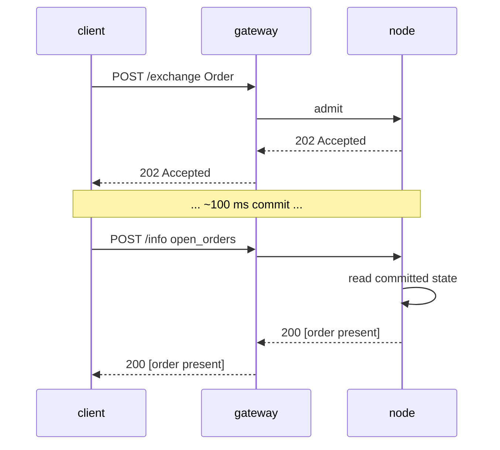

# `POST /info` — ruta de lectura (nativa MTF)

:::info
**Estado.** Forma **estable**. Se añaden tipos de consulta con el tiempo; el envelope está comprometido.
:::

## TL;DR

Un único endpoint, múltiples tipos. Despacha según el campo `type` del cuerpo de la solicitud. Solo lectura — nunca muta el estado, nunca requiere firma.

## URL

```
POST  https://<net>-gateway.mtf.exchange/info
```

| Ruta | Formato de cable |
|------|-----------|
| `POST /info` (gateway por defecto) | Nativo MTF (este documento) |
| `POST /hl/info` (gateway, bajo `/hl`) | **Compatible con HL** — véase [hl-compat.md](./hl-compat.md) |

El nativo MTF es la ruta predeterminada del gateway; el modo compatible con HL se encuentra bajo el espacio de nombres `/hl/*`.
Si ejecutas el nodo tú mismo, el mismo `/info` nativo se sirve directamente en
`http://localhost:8080`.

## Envelope

Solicitud:

```json
{ "type": "<query_type>", /* args específicos del tipo */ }
```

Respuesta:

```json
{ "type": "<query_type>", "data": { /* específico del tipo */ } }
```

Ante un `type` desconocido: `400 Bad Request` con `{"error":"unknown info type: <X>"}`.
Ante un recurso desconocido (p. ej. id de vault desconocido): `404 Not Found` con `{"error":"<resource> not found"}`.

## Tipos de consulta

### `node_info`

Identidad estática del nodo + versión de protocolo. Sin parámetros.

```json
{ "type": "node_info" }
```

Respuesta:

```json
{
  "type": "node_info",
  "data": {
    "network":           "testnet",
    "chain_id":          114514,
    "protocol_version":  "1.0.0",
    "validator_index":   null,
    "build_commit":      "unknown",
    "version":           "0.0.1",
    "freeze_halt_supported": true,
    "uptime_seconds":    0
  }
}
```

| Campo | Tipo | Descripción |
|-------|------|-------------|
| `network` | `"devnet" \| "testnet" \| "mainnet"` | Variante de red, derivada del `chain_id` (`31337`=devnet, `114514`=testnet, `8964`=mainnet) |
| `chain_id` | uint64 | Id de cadena EIP-712 — el MISMO valor que debe usar el dominio de firma de `/exchange` |
| `protocol_version` | string semver | Versión del protocolo de cable |
| `validator_index` | uint32 \| null | Índice de este nodo en el conjunto de validadores activos; **PENDIENTE:** `null` hasta que el runtime llame a `set_validator_index` |
| `build_commit` | hex string | Identificador de compilación publicado por el operador; **PENDIENTE:** `"unknown"` hasta que sea publicado |
| `version` | string semver | Versión de lanzamiento del software del nodo, fijada en tiempo de compilación. Un lanzamiento comparte un único `version` entre sus binarios — `build_commit` es el diferenciador por compilación |
| `freeze_halt_supported` | bool | Siempre `true` para este binario — indicador de capacidad: el nodo respeta [`exchange_status.scheduled_freeze_height`](#exchange_status), deteniéndose limpiamente con código de salida `77` una vez que la altura de congelamiento se confirma, para que un supervisor del nodo pueda cargar la próxima versión |
| `uptime_seconds` | uint64 | Tiempo de actividad del proceso; **PENDIENTE:** `0` hasta que el runtime llame a `set_uptime_seconds` |

Estos son campos **por nodo** (identidad del nodo / runtime), NO estado de consenso, por lo que pueden diferir legítimamente entre nodos.

### `account_state`

Snapshot por cuenta.

```json
{ "type": "account_state", "address": "0x<addr>" }
```

| Arg | Tipo | Requerido |
|-----|------|----------|
| `address` | hex address | sí |

Una **dirección desconocida** (nunca vista en cadena) devuelve **200** con un registro completamente en cero
(`account_value:"0"`, `positions` / `balances.spot` vacíos), NO un `404`.

Respuesta (cuenta financiada por faucet, sin posiciones):

```json
{
  "type": "account_state",
  "data": {
    "address":         "0x00000000000000000000000000000000000ca11e",
    "account_value":   "3000",
    "free_collateral": "3000",
    "maint_margin":    "0",
    "init_margin":     "0",
    "health":          "3000",
    "tier":            "Safe",
    "mode":            "Cross",
    "pm_enabled":      false,
    "positions": [],
    "balances": {
      "usdc": "3000",
      "spot": { "MTF": { "total": "10", "hold": "0" } }
    }
  }
}
```

Cada token en `balances.spot` es un objeto `{total, hold}` (paridad HL): `hold` es
la cantidad bloqueada detrás de una orden spot en reposo (custodia), `total` es el saldo
completo; el monto disponible para gastar es `total − hold`. Un token que está completamente
retenido sigue apareciendo. Para una lectura
**ligera** de solo los escalares de margen (sin recorrer `positions[]`, sin escanear balances
— la llamada correcta para un sondeo de salud de liquidación), usa
[`margin_summary`](#margin_summary).

Una cuenta con posiciones añade entradas bajo `positions`:

```json
{
  "asset":             0,
  "size":              "100000000",
  "entry":             "67000.00",
  "upnl":              "5.00",
  "isolated":          false,
  "lev":               10,
  "liq":               "61000.00",
  "roe":               "0.0075",
  "funding":           "-0.12",
  "margin":            "201.00",
  "notional":          "6705.00"
}
```

| Campo | Tipo | Descripción |
|-------|------|-------------|
| `account_value` | Decimal string | Patrimonio incl. PnL liquidado, **plano USDC entero** (`"3000"` = 3000 USDC, NO unidades base) |
| `free_collateral` | Decimal string | Patrimonio menos el margen inicial retenido por posiciones abiertas |
| `maint_margin` | Decimal string | Σ margen usado por activo (mantenimiento) |
| `init_margin` | Decimal string | Requisito de margen inicial retenido |
| `health` | Decimal string | `account_value − maint_margin` (con signo; puede ser negativo) |
| `tier` | enum | `"Safe"`, `"T0"`, `"T1"`, `"T2"`, `"T3"` (banda BOLE de `account_value / maint_margin`; `"Safe"` cuando no hay margen de mantenimiento) — véase [liquidación escalonada](../../concepts/tiered-liquidation.md) |
| `mode` | enum | `"Cross"`, `"Isolated"`, `"StrictIso"` (derivado de las posiciones abiertas de la cuenta) |
| `pm_enabled` | bool | Estado de adhesión al margen de cartera |
| `positions[*].asset` | uint32 | Id del activo |
| `positions[*].size` | i128 string | Tamaño de posición con signo en **lotes brutos** — `size / 10^sz_decimals` = unidades enteras (`sz_decimals` es la precisión de tamaño del mercado, p. ej. 5 para BTC). Este es el plano de TAMAÑO, ortogonal al plano de precio 1e8. |
| `positions[*].entry` | Decimal string | Precio de entrada por unidad entera = `\|entry_notional\| / \|tamaño real\|`, **plano USDC entero** |
| `positions[*].upnl` | Decimal string | PnL marcado a mercado = `tamaño real × mark − entry_notional con signo`, **plano USDC entero** (con signo) |
| `positions[*].isolated` | bool | `true` a menos que la posición tenga margen cruzado |
| `positions[*].lev` | uint8 | Apalancamiento máximo de la posición |
| `positions[*].liq` | Decimal string | Precio (USDC entero) al que esta posición por sí sola llevaría la cuenta al mantenimiento — aproximación cruzada de posición única; `"0"` cuando el tamaño / apalancamiento es cero (sin precio de liquidación finito) |
| `positions[*].roe` | Decimal string | `upnl / initial_margin` como fracción decimal (`initial_margin = \|entry_notional\| / leverage`); `"0"` con apalancamiento / nocional cero |
| `positions[*].funding` | Decimal string | Financiamiento acumulado pero no liquidado para el tramo, **USDC entero** (con signo); `real_size × (cumulative_funding − funding_entry)` — la misma forma que paga la liquidación de financiamiento |
| `positions[*].margin` | Decimal string | Margen de mantenimiento que aporta el tramo, **USDC entero**: `\|entry_notional\| × maint_margin_ratio` |
| `positions[*].notional` | Decimal string | Nocional de la posición al mark, **USDC entero** (con signo): `real_size × mark_px` |
| `positions[*].side` | enum \| ausente | **Solo en [modo cobertura](../../concepts/hedge-mode.md)** — `"long"` / `"short"`, el tramo que reporta este objeto. **Omitido en una cuenta unidireccional** (una única posición *neta* cuyo `size` puede ser negativo). Una cuenta de cobertura con ambos tramos en un mismo activo devuelve **dos** objetos, uno por lado. |
| `balances.usdc` | Decimal string | **Refleja `account_value`** (el colateral USDC cruzado), NO un saldo USDC spot separado |
| `balances.spot` | object | Saldos de tokens spot distintos de USDC, indexados por **nombre de token** (p. ej. `"MTF"`); cada valor es un objeto `{total, hold}` (`hold` = custodia bloqueada detrás de órdenes spot en reposo; disponible = `total − hold`); vacío si no hay ninguno |

### `margin_summary`

**Solo los escalares de margen** — `account_state` sin el recorrido de `positions[]` ni el
escaneo de balance spot. La llamada adecuada para un sondeo frecuente de salud de liquidación (un
bot supervisor de riesgo, un sistema automatizado de recarga de margen) donde el detalle de
posición/balance no es necesario. Requerido: `address` (hex 0x).

```json
{ "type": "margin_summary", "address": "0x<addr>" }
```

Respuesta (`data`): `address`, `account_value`, `free_collateral`,
`maint_margin`, `init_margin`, `health`, `tier`, `mode`, `pm_enabled` —
semántica de campos idéntica a los campos homónimos de
[`account_state`](#account_state) (calculados por el mismo helper compartido, por lo que los dos
nunca difieren).

### `market_info`

Metadatos por mercado.

```json
{ "type": "market_info", "asset_id": 0 }
```

O por nombre:

```json
{ "type": "market_info", "coin": "BTC" }
```

Respuesta:

```json
{
  "type": "market_info",
  "data": {
    "asset_id":        0,
    "name":            "BTC",
    "kind":            "perp",
    "sz_decimals":     5,
    "mark_px":         "67079.265",
    "oracle_px":       "67073.35",
    "mid_px":          "67079.27",
    "premium":         "0.0015",
    "tick_size":       "1000000",
    "step_size":       "1",
    "min_order":       "1",
    "max_leverage":    50,
    "maint_margin_ratio": "300",
    "init_margin_ratio":  "200",
    "funding": {
      "rate_per_hr":  "0",
      "cap_per_hr":   "400",
      "interval_ms":     3600000,
      "next_payment_ts": 0
    },
    "mark_source": "MedianOfOraclesAndMid",
    "fba_enabled": false,
    "open_interest": "0"
  }
}
```

:::info
**Plano de reporte de precios.** En esta lectura tanto `mark_px` como `oracle_px` están en el
**plano Decimal de USDC entero** (dólares legibles — `"67079.265"` / `"67073.35"`), la
misma unidad que el mark de las posiciones de la cuenta. `mark_px` es el mark del libro escalado
desde la representación interna de punto fijo 1e8 del motor, con fallback al px del oráculo cuando
el libro aún no tiene mark; `oracle_px` es el último precio de índice confirmado.
Cualquiera de los dos es `"0"` cuando no está definido. Nótese que el **plano de envío de órdenes/libro
permanece en punto fijo 1e8** — los niveles de precio en `l2_book` y el `limit_px` de las órdenes
NO son USDC entero; MTF mantiene esos dos planos de escala diferenciados, y solo las lecturas
orientadas al usuario (`market_info`, `markets`, posiciones) reportan precios en USDC entero.
La semántica de los demás campos del registro está en la tabla de [`markets`](#markets) más abajo.
:::

:::info
**Precisión de precio vs `sz_decimals`.** `mark_px` y `oracle_px` están **ajustados al tick de precio
del mercado** (`tick_size`, truncado hacia cero), de modo que una lectura nunca
muestra ruido sub-tick — con un tick de `$0.01` (`tick_size: "1000000"` en el plano 1e8)
`66735.255` se reporta como `"66735.25"`. Nótese que `sz_decimals` es la precisión de **TAMAÑO**
(granularidad de la cantidad de orden — `5` ⇒ `0.00001` unidades), **no** rige los
decimales de precio; el tick de precio sí lo hace. Los dos son ejes independientes (la misma
separación que usa HL).
:::

### `markets`

Todos los mercados perp registrados bajo MIP-3, en una sola llamada. Sin parámetros.

```json
{ "type": "markets" }
```

El payload `data` es un **array** del mismo registro detallado por mercado que
[`market_info`](#market_info) devuelve para un único activo. Los registros están ordenados
de forma determinista por `asset_id` ascendente (el nodo itera el
`BTreeMap` de `mip3_market_specs`). Un universo vacío devuelve `"data": []`.

Respuesta:

```json
{
  "type": "markets",
  "data": [
    {
      "asset_id":        0,
      "name":            "BTC",
      "kind":            "perp",
      "sz_decimals":     5,
      "mark_px":         "67042.335",
      "oracle_px":       "67042.335",
      "mid_px":          "67042.33",
      "premium":         "0.0015",
      "tick_size":       "1000000",
      "step_size":       "1",
      "min_order":       "1",
      "max_leverage":    50,
      "maint_margin_ratio": "300",
      "init_margin_ratio":  "200",
      "funding": {
        "rate_per_hr":  "0",
        "cap_per_hr":   "400",
        "interval_ms":     3600000,
        "next_payment_ts": 0
      },
      "mark_source": "MedianOfOraclesAndMid",
      "fba_enabled": false,
      "open_interest": "0"
    }
  ]
}
```

| Campo | Tipo | Descripción |
|-------|------|-------------|
| `asset_id` | uint32 | Id canónico del activo (clave de ordenamiento) |
| `name` | string | Símbolo del mercado, p. ej. `"BTC"` |
| `kind` | `"perp"` | Tipo de mercado (en minúsculas) |
| `sz_decimals` | uint8 | Decimales de visualización de tamaño (del registro de tokens spot subyacente; `0` si no hay especificación de token) |
| `mark_px` | Decimal string | Mark del libro, **plano USDC entero** (mark del libro escalado desde 1e8, fallback al oráculo; `"0"` si no está definido) |
| `oracle_px` | Decimal string | Precio de índice, **plano USDC entero** (`"0"` si no está definido) |
| `mid_px` | Decimal string \| null | Mid real del libro de órdenes `(mejor_compra + mejor_venta) / 2`, **plano USDC entero** (ajustado al tick); `null` cuando el libro es unilateral o está vacío |
| `premium` | Decimal string \| null | Última muestra de prima de financiamiento confirmada (con signo); `null` cuando no existe muestra |
| `tick_size` | i128 string | Incremento mínimo de precio, **punto fijo 1e8** (plano de envío de órdenes/libro) |
| `step_size` | u128 string | Incremento mínimo de tamaño (tamaño de lote), punto fijo |
| `min_order` | u128 string | Tamaño mínimo de orden |
| `max_leverage` | uint8 | Apalancamiento máximo |
| `maint_margin_ratio` | bps string | Ratio de margen de mantenimiento, bps decimales |
| `init_margin_ratio` | bps string | Ratio de margen inicial (`1 / max_leverage`), bps decimales |
| `funding.rate_per_hr` | bps string | Última muestra de prima de financiamiento, bps decimales |
| `funding.cap_per_hr` | bps string | Tasa de financiamiento máxima por hora, bps decimales |
| `funding.interval_ms` | uint64 | Cadencia de financiamiento (1h = `3600000`) |
| `funding.next_payment_ts` | uint64 | Ts del próximo pago de financiamiento (`0` hasta que exista una muestra) |
| `mark_source` | string | Descriptor del precio mark (`"MedianOfOraclesAndMid"`) |
| `fba_enabled` | bool | Subasta por lotes frecuentes habilitada para este mercado |
| `open_interest` | u128 string | Interés abierto actual, punto fijo |

Cada elemento es byte a byte idéntico al `data` de la respuesta `market_info` del activo
correspondiente — ambos se construyen desde el mismo builder de registro por mercado, por lo que
las formas individual y masiva nunca divergen. Véase [`market_info`](#market_info) para
la semántica a nivel de campo y las notas de proxies PENDIENTES (`mark_source`,
`next_payment_ts`).

### `vault_state`

Snapshot por vault.

```json
{ "type": "vault_state", "vault": "0x<vault_addr>" }
```

Respuesta:

```json
{
  "type": "vault_state",
  "data": {
    "vault":              "0x<addr>",
    "name":               "MFlux Conservative",
    "tvl":             "10000000000",
    "share_price":     "10500000",
    "depositor_count":    142,
    "high_water_mark": "10500000",
    "performance_fee_bps":1000,
    "lock_period_ms":     86400000,
    "strategy":           "MarketNeutral"
  }
}
```

### `staking_state`

```json
{ "type": "staking_state", "address": "0x<addr>" }
```

Respuesta:

```json
{
  "type": "staking_state",
  "data": {
    "address":         "0x<addr>",
    "total_staked": "1000000000",
    "delegations": [
      {
        "validator":         "0x<val_addr>",
        "amount":         "500000000",
        "since_ts":          1735000000000,
        "pending_rewards":"1000000"
      }
    ],
    "pending_unstakes": [
      { "amount": "200000000", "matures_at_ts": 1735780000000 }
    ]
  }
}
```

### `fee_schedule`

```json
{ "type": "fee_schedule" }
```

Respuesta:

```json
{
  "type": "fee_schedule",
  "data": {
    "tiers": [
      { "volume_30d": "0",         "maker_bps": "2.0", "taker_bps": "5.0" },
      { "volume_30d": "100000000", "maker_bps": "1.5", "taker_bps": "4.5" },
      { "volume_30d": "1000000000","maker_bps": "1.0", "taker_bps": "4.0" }
    ],
    "builder_rebate_bps": "0.2",
    "burn_ratio":         "0.30",
    "referrer_share_bps": "1.0"
  }
}
```

Las tarifas se expresan en **puntos básicos** decimales como cadenas de texto (`"2.0"` = 2 bps = 0,02%). `burn_ratio` es una fracción decimal (`"0.30"` = 30% de las comisiones quemadas). Consulte [comisiones](../../concepts/fees.md).

### `open_orders`

Órdenes pendientes de la cuenta en todos los libros de perpetuos.

```json
{ "type": "open_orders", "account_id": 42 }
```

| Arg | Type | Required |
|-----|------|----------|
| `account_id` | uint64 | uno de `account_id` / `address` |
| `address` | hex address | uno de `account_id` / `address` |

Tanto `account_id` (u64) como `address` (hex con 0x) identifican la cuenta. Cuando la
solicitud incluye `account_id`, este se devuelve en `data.account_id`.

Respuesta:

```json
{
  "type": "open_orders",
  "data": {
    "address":    "0x<addr>",
    "account_id": 42,
    "orders": [
      {
        "oid":          12345,
        "market_id":    0,
        "side":         "bid",
        "px":        "99000",
        "size":      "700",
        "cloid":        "0x000000000000000000000000cafef00d",
        "inserted_at_ms": 1700000000000
      }
    ]
  }
}
```

| Field | Type | Description |
|-------|------|-------------|
| `address` | hex address | Dirección de cuenta resuelta |
| `account_id` | uint64 | Devuelto solo cuando la solicitud usó `account_id` |
| `orders[*].oid` | uint64 | Id de orden del servidor |
| `orders[*].market_id` | uint32 | Id de activo / mercado donde reposa la orden |
| `orders[*].side` | `"bid"` / `"ask"` | Lado de la orden |
| `orders[*].px` | i128 string | Precio de reposo, cadena decimal de punto fijo |
| `orders[*].size` | u128 string | Tamaño restante, cadena decimal de punto fijo |
| `orders[*].cloid` | hex string \| null | Id de orden del cliente con el que se colocó la orden (`0x` + 32 caracteres hex); `null` si la orden no definió ninguno |
| `orders[*].inserted_at_ms` | uint64 | Marca de tiempo de colocación / inserción (ms de consenso) |

### `l2_book`

Niveles agregados de oferta/demanda para un mercado específico.

```json
{ "type": "l2_book", "market_id": 0 }
```

| Arg | Type | Required |
|-----|------|----------|
| `market_id` | uint32 | sí |

Respuesta:

```json
{
  "type": "l2_book",
  "data": {
    "market_id": 0,
    "bids": [ { "px": "99000", "size": "700", "n_orders": 1 } ],
    "asks": [ { "px": "101000", "size": "750", "n_orders": 2 } ]
  }
}
```

Las ofertas se ordenan del mejor al peor (precio descendente), y las demandas de forma ascendente. Cada nivel agrega
el `size` total y el conteo `n_orders` de órdenes en reposo. Un mercado
desconocido o vacío devuelve arreglos `bids` / `asks` vacíos.

| Field | Type | Description |
|-------|------|-------------|
| `market_id` | uint32 | Id de mercado devuelto |
| `bids[*].px` / `asks[*].px` | i128 string | Precio del nivel, cadena decimal de punto fijo |
| `bids[*].size` / `asks[*].size` | u128 string | Tamaño agregado en el nivel |
| `bids[*].n_orders` / `asks[*].n_orders` | uint64 | Órdenes en reposo en el nivel |

### `recent_trades`

Cinta pública de operaciones para un mercado, servida directamente desde el estado comprometido del nodo
(un anillo de operaciones por mercado, acotado y plegado en el AppHash — sin indexador externo).

```json
{ "type": "recent_trades", "market_id": 0 }
```

| Arg | Type | Required | Description |
|-----|------|----------|-------------|
| `market_id` | uint32 | sí | Id de activo / mercado |
| `limit` | uint32 | no | Limita el número de registros **más recientes** devueltos; ausente / `0` ⇒ el anillo completo |

Respuesta:

```json
{
  "type": "recent_trades",
  "data": {
    "market_id":      0,
    "last_trade_ms":  1700000000555,
    "trades": [
      {
        "coin":  0,
        "side":  "B",
        "px":    "67042.50",
        "sz":    "0.125",
        "time":  1700000000555,
        "tid":   90123,
        "block": 562,
        "hash":  "0x2315b79b9e82c2deb279a59448bf7841f3767d30d874e5b544d75bb9fd1e9b0c"
      }
    ]
  }
}
```

Los registros se ordenan del más antiguo al más reciente. El anillo es acotado, por lo que
corresponde a una ventana reciente, no al historial completo. Un mercado desconocido o que nunca
ha operado devuelve `"trades": []` y `last_trade_ms: 0`.

| Field | Type | Description |
|-------|------|-------------|
| `market_id` | uint32 | Id de mercado devuelto |
| `last_trade_ms` | uint64 | Marca de tiempo de la última operación (`0` si no hay ninguna) |
| `trades[*].coin` | uint32 | Id de activo / mercado en el que se ejecutó la operación |
| `trades[*].side` | `"B"` / `"A"` | Token del lado tomador (agresor) — `"B"` = compra, `"A"` = venta |
| `trades[*].px` | Decimal string | Precio de ejecución, **USDC decimal** (legible por humanos) |
| `trades[*].sz` | Decimal string | Tamaño ejecutado, **unidades base** (unidad completa) |
| `trades[*].time` | uint64 | Marca de tiempo de la operación (ms de consenso) |
| `trades[*].tid` | uint64 | Id de operación determinista (compartido por ambas partes de la ejecución) |
| `trades[*].block` | uint64 | Altura de bloque comprometida en la que se liquidó la operación (localizador en cadena) |
| `trades[*].hash` | hex string | Hash de transacción de la orden originadora, hex con prefijo `0x` — permite rastrear la ejecución en cadena |

### `candle`

Barras OHLCV históricas para `(coin, interval)` en una ventana de tiempo. El
complemento REST del canal WS en vivo [`candles`](../ws/subscriptions.md#candles) —
el WS envía la barra en formación a medida que llegan operaciones, mientras que este endpoint devuelve el
historial de barras cerradas.

```json
{ "type": "candle", "coin": "BTC", "interval": "1m" }
```

| Arg | Type | Required | Description |
|-----|------|----------|-------------|
| `coin` | string | sí | Símbolo de mercado, p. ej. `"BTC"` |
| `interval` | string | sí | Token de intervalo — uno de `1m`, `5m`, `15m`, `1h`, `4h`, `1d` |
| `start_time` | uint64 | no | Inicio de la ventana (ms); filtra por apertura de barra. Por defecto `0` |
| `end_time` | uint64 | no | Fin de la ventana (ms); filtra por apertura de barra. Por defecto sin límite |

Los argumentos pueden pasarse de forma plana (como arriba) o anidados bajo un objeto `req`; `start_time` /
`end_time` también aceptan la notación camelCase `startTime` / `endTime`. Si falta
`coin` o `interval` → `400 {"error":"missing field <name>"}`.

Respuesta:

```json
{
  "type": "candle",
  "data": [
    {
      "t": 1700000040000,
      "T": 1700000099999,
      "s": "BTC",
      "i": "1m",
      "o": "67000.00",
      "c": "67042.50",
      "h": "67080.00",
      "l": "66990.00",
      "v": "12.5",
      "q": "837843.75",
      "n": 37
    }
  ]
}
```

Las barras se ordenan de la más antigua a la más reciente según `t` (hora de apertura); el elemento más reciente es la
barra en formación. Un arreglo vacío es la respuesta honesta cuando el token de
`interval` no está soportado, el mercado no tiene operaciones indexadas, o el despliegue no tiene
indexador configurado.

| Field | Type | Description |
|-------|------|-------------|
| `t` | uint64 | Marca de tiempo de **apertura** de la barra (ms, alineada al intervalo) |
| `T` | uint64 | Marca de tiempo de **cierre** de la barra (ms) — `t + interval − 1` |
| `s` | string | Símbolo de moneda / mercado |
| `i` | string | Token de intervalo |
| `o` / `c` / `h` / `l` | Decimal string | Precio de **a**pertura / **c**ierre / **m**áximo / **m**ínimo, **USDC decimal** (dólares legibles, p. ej. `"67042.50"`) |
| `v` | Decimal string | **Volumen en activo base** — Σ tamaño operado en la barra (tamaño en moneda, NO nocional) |
| `q` | Decimal string | **Volumen en cotización (USD)** — `Σ precio × tamaño` sobre las ejecuciones de la barra |
| `n` | uint64 | Número de operaciones (ejecuciones) en la barra |

:::info
**La serie no tiene huecos.** Un intervalo **sin operaciones** igualmente emite una barra plana
que toma el cierre de la barra anterior: `o = h = l = c = cierre anterior`, y
`v = q = 0`, `n = 0`. Los consumidores reciben una serie continua de una barra por intervalo sin
huecos que interpolar. **No se emite ninguna barra antes de la primera operación del mercado** — la
serie comienza en el intervalo de la primera ejecución, por lo que un arreglo vacío significa que el mercado
nunca ha operado (o no hay historial disponible), no que se descartaron intervalos anteriores.
:::

:::info
**Este tipo es servido por el gateway, no por el nodo.** Las velas son datos de
visualización derivados del flujo público de operaciones — **no** son estado comprometido en
cadena, nunca tocan el app-hash y no cuentan con garantía de consenso. El
gateway responde `candle` desde su propio almacén rotativo; un nodo sin gateway consultado
directamente devuelve `unknown info type: candle`. Respuesta honesta vacía (`"data": []`) cuando
el gateway aún no tiene historial de operaciones para ese mercado.
:::

### `user_fills`

Historial de ejecuciones de la cuenta, servido directamente desde el estado comprometido del nodo (un
anillo de ejecuciones por cuenta, acotado y plegado en el AppHash — sin indexador externo).

```json
{ "type": "user_fills", "account_id": 42 }
```

| Arg | Type | Required | Description |
|-----|------|----------|-------------|
| `account_id` | uint64 | uno de `account_id` / `address` | Id de cuenta interno |
| `address` | hex address | uno de `account_id` / `address` | Dirección de cuenta |
| `limit` | uint32 | no | Limita el número de registros **más recientes** devueltos; ausente / `0` ⇒ el anillo completo |

Tanto `account_id` (u64) como `address` (hex con 0x) identifican la cuenta. Cuando la
solicitud incluye `account_id`, este se devuelve en `data.account_id`.

Respuesta:

```json
{
  "type": "user_fills",
  "data": {
    "address":    "0x<addr>",
    "account_id": 42,
    "fills": [
      {
        "coin":           0,
        "side":           "B",
        "px":             "67042.50",
        "sz":             "0.125",
        "time":           1700000000555,
        "oid":            12345,
        "tid":            90123,
        "fee":            "4.19",
        "closed_pnl":     "0",
        "dir":            "Open Long",
        "start_position": "0",
        "block":          562,
        "hash":           "0x2315b79b9e82c2deb279a59448bf7841f3767d30d874e5b544d75bb9fd1e9b0c"
      }
    ]
  }
}
```

Los registros se ordenan del más antiguo al más reciente. El anillo es acotado, por lo que
corresponde a una ventana reciente, no al historial completo. Una cuenta sin ejecuciones devuelve
`"fills": []`.

| Field | Type | Description |
|-------|------|-------------|
| `address` | hex address | Dirección de cuenta resuelta |
| `account_id` | uint64 | Devuelto solo cuando la solicitud usó `account_id` |
| `fills[*].coin` | uint32 | Id de activo / mercado en el que se ejecutó la operación |
| `fills[*].side` | `"B"` / `"A"` | Token del lado de esta pata — `"B"` = compra/oferta, `"A"` = venta/demanda |
| `fills[*].px` | Decimal string | Precio de ejecución, **USDC decimal** (legible por humanos) |
| `fills[*].sz` | Decimal string | Tamaño ejecutado, **unidades base** (unidad completa) |
| `fills[*].time` | uint64 | Marca de tiempo de la ejecución (ms de consenso) |
| `fills[*].oid` | uint64 | Id de orden de esta parte |
| `fills[*].tid` | uint64 | Id de operación determinista (compartido por ambas partes de la ejecución) |
| `fills[*].fee` | Decimal string | Comisión pagada por esta parte, **USDC decimal** |
| `fills[*].closed_pnl` | Decimal string | PnL realizado en la porción cerrada, **USDC decimal** (con signo) |
| `fills[*].dir` | string | Etiqueta de dirección, p. ej. `"Open Long"`, `"Close Short"`, `"Open Short"`, `"Close Long"` |
| `fills[*].start_position` | Decimal string | Tamaño firmado de la pata ANTES de la ejecución, **unidades base** (unidad completa, con signo) |
| `fills[*].block` | uint64 | Altura de bloque comprometida en la que se liquidó la ejecución (localizador en cadena) |
| `fills[*].hash` | hex string | Hash de transacción de la orden originadora, hex con prefijo `0x` — permite rastrear la ejecución en cadena |

### `user_fills_by_time`

Similar a [`user_fills`](#user_fills), pero filtrado a una ventana de tiempo sobre el
`time` de consenso de cada registro. La forma de los registros de ejecución es la misma.

```json
{ "type": "user_fills_by_time", "address": "0x<addr>", "start_time": 1700000000000, "end_time": 1700003600000 }
```

| Arg | Type | Required | Description |
|-----|------|----------|-------------|
| `account_id` | uint64 | uno de `account_id` / `address` | Id de cuenta interno |
| `address` | hex address | uno de `account_id` / `address` | Dirección de cuenta |
| `start_time` | uint64 | no | Inicio de la ventana (ms, inclusivo); filtra por `time` de la ejecución. Ausente ⇒ límite inferior abierto |
| `end_time` | uint64 | no | Fin de la ventana (ms, inclusivo). Ausente ⇒ límite superior abierto |

Respuesta:

```json
{
  "type": "user_fills_by_time",
  "data": {
    "address":    "0x<addr>",
    "account_id": 42,
    "start_time": 1700000000000,
    "end_time":   1700003600000,
    "fills": [ /* misma forma de registro que user_fills */ ]
  }
}
```

| Field | Type | Description |
|-------|------|-------------|
| `address` | hex address | Dirección de cuenta resuelta |
| `account_id` | uint64 | Devuelto solo cuando la solicitud usó `account_id` |
| `start_time` | uint64 \| null | Inicio de ventana devuelto (`null` si se omitió) |
| `end_time` | uint64 \| null | Fin de ventana devuelto (`null` si se omitió) |
| `fills` | array | Registros de ejecución dentro de la ventana (misma forma por ejecución que [`user_fills`](#user_fills)), del más antiguo al más reciente |

### `order_status`

Consulta del ciclo de vida de una orden individual por `oid` (id de orden del servidor) **o** `cloid` (id
de orden del cliente). Consulta los libros en vivo, el registro de triggers y el anillo de ejecuciones comprometido —
todo estado comprometido en el nodo.

```json
{ "type": "order_status", "oid": 12345 }
```

O por id de orden del cliente:

```json
{ "type": "order_status", "cloid": "0x000000000000000000000000cafef00d" }
```

| Arg | Type | Required | Description |
|-----|------|----------|-------------|
| `oid` | uint64 | uno de `oid` / `cloid` | Id de orden del servidor |
| `cloid` | hex string | uno de `oid` / `cloid` | Id de orden del cliente — `0x` + 32 caracteres hex |

Si no se proporciona ninguno → `400 {"error":"missing field oid or cloid"}`. Un
`cloid` malformado → `400`. La resolución se detiene en el primer resultado encontrado, en este orden: orden activa en reposo
→ trigger aparcado → ejecución terminal → desconocido.

`data.status` discrimina la rama:

`"resting"` — una orden activa abierta en un libro de perpetuos o spot:

```json
{
  "type": "order_status",
  "data": {
    "status": "resting",
    "order": {
      "oid":            12345,
      "market_id":      0,
      "side":           "bid",
      "px":             "67000",
      "size":           "700",
      "inserted_at_ms": 1700000000000,
      "cloid":          "0x000000000000000000000000cafef00d"
    }
  }
}
```

`"triggered"` — un TP/SL/stop de entrada aparcado a la espera de que el precio de marca lo cruce:

```json
{
  "type": "order_status",
  "data": {
    "status": "triggered",
    "trigger": {
      "oid":              12345,
      "market_id":        0,
      "side":             "ask",
      "trigger_px":       "66000",
      "trigger_above":    false,
      "size":             "700",
      "registered_at_ms": 1700000000000,
      "fired":            false
    }
  }
}
```

`"filled"` — la ejecución más reciente coincidente en el anillo por cuenta (el objeto `fill`
tiene la misma forma que un registro de [`user_fills`](#user_fills)):

```json
{
  "type": "order_status",
  "data": {
    "status": "filled",
    "fill": { /* misma forma que un registro de ejecución de user_fills */ }
  }
}
```

`"unknown"` — nunca visto, o eliminado del anillo acotado (una consulta solo por `cloid`
que no coincide con ninguna orden activa o trigger también se resuelve aquí, ya que el registro de triggers
y el anillo de ejecuciones están indexados por `oid`):

```json
{ "type": "order_status", "data": { "status": "unknown" } }
```

| Field | Type | Description |
|-------|------|-------------|
| `status` | `"resting" \| "triggered" \| "filled" \| "unknown"` | Estado del ciclo de vida resuelto |
| `order` | object | Presente en `"resting"` — `oid`, `market_id`, `side` (`"bid"`/`"ask"`), `px` / `size` (cadenas decimales de punto fijo), `inserted_at_ms`, `cloid` (hex \| null) |
| `trigger` | object | Presente en `"triggered"` — `oid`, `market_id`, `side`, `trigger_px` / `size` (cadenas decimales de punto fijo), `trigger_above` (bool: disparar cuando el precio de marca cruce al alza), `registered_at_ms`, `fired` (bool) |
| `fill` | object | Presente en `"filled"` — el registro de ejecución coincidente (ver [`user_fills`](#user_fills)) |

### `funding_history`

Muestras de prima de financiación con ámbito de mercado.

```json
{ "type": "funding_history", "market_id": 0 }
```

| Arg | Type | Required |
|-----|------|----------|
| `market_id` | uint32 | yes |

Response:

```json
{
  "type": "funding_history",
  "data": {
    "market_id": 0,
    "samples": [
      { "ts_ms": 1700000000000, "premium": "0.0015", "funding_rate": "0.0015" },
      { "ts_ms": 1700000008000, "premium": "-0.0007", "funding_rate": "-0.0007" }
    ]
  }
}
```

Las muestras son el anillo ordenado de instantáneas de prima del rastreador de financiación.
`premium` es el `Decimal` exacto previo al límite renderizado como cadena (con signo, precisión
completa); `funding_rate` es esa prima procesada a través del límite de financiación por activo
(`±funding_rate_cap`, la anulación de riesgo dinámico o la base de `0.04`/hr)
— es decir, la tasa realizada que se cobraría efectivamente. Cuando la prima se
encuentra dentro del límite, `funding_rate == premium`; si lo supera, `funding_rate` se recorta al
límite con signo. Un mercado desconocido o vacío devuelve `"samples": []`.

| Field | Type | Description |
|-------|------|-------------|
| `market_id` | uint32 | Id de mercado reflejado |
| `samples[*].ts_ms` | uint64 | Marca de tiempo de la muestra (ms de consenso) |
| `samples[*].premium` | decimal string | Muestra de prima de financiación sin procesar, previa al límite (con signo) |
| `samples[*].funding_rate` | decimal string | Tasa realizada = `premium` recortada al límite por activo (con signo) |

### `predicted_fundings`

Tasa de financiación prevista por mercado y próxima hora de pago, para todos los
mercados de contratos perpetuos registrados. Sin parámetros.

```json
{ "type": "predicted_fundings" }
```

El payload `data` es un **array**, ordenado de forma determinista por `asset` ascendente
(el nodo itera el `BTreeMap` de especificaciones de mercado). Un universo vacío devuelve
`"data": []`.

Response:

```json
{
  "type": "predicted_fundings",
  "data": [
    { "asset": 0, "predicted_rate": "0.0015", "next_funding_time": 1700003600000 }
  ]
}
```

`predicted_rate` es la última muestra de prima (el proxy de tasa por hora, cadena
decimal) — `"0"` antes de la primera muestra. `next_funding_time` es la marca de
tiempo del próximo pago derivada (`last_sample_ts + 1h`), `0` antes de la primera muestra.

| Field | Type | Description |
|-------|------|-------------|
| `asset` | uint32 | Id de activo / mercado |
| `predicted_rate` | decimal string | Última muestra de prima (proxy de tasa por hora); `"0"` antes de la primera muestra |
| `next_funding_time` | uint64 | Marca de tiempo del próximo pago de financiación (ms de consenso); `0` antes de la primera muestra |

### `block_info`

Metadatos del bloque confirmado. Sin argumentos obligatorios (`height` se acepta pero se ignora —
el estado de lectura conserva únicamente el último contexto confirmado).

```json
{ "type": "block_info" }
```

Response:

```json
{
  "type": "block_info",
  "data": {
    "height":       562,
    "round":        562,
    "epoch":        0,
    "timestamp_ms": 1780475491562,
    "block_hash":   "0x2315b79b9e82c2deb279a59448bf7841f3767d30d874e5b544d75bb9fd1e9b0c"
  }
}
```

| Field | Type | Description |
|-------|------|-------------|
| `height` | uint64 | Altura del último bloque confirmado |
| `round` | uint64 | Ronda de consenso de ese bloque |
| `epoch` | uint64 | Época actual |
| `timestamp_ms` | uint64 | Marca de tiempo del bloque (ms de consenso) |
| `block_hash` | hex string (32 bytes) | Hash real del bloque confirmado (ahora integrado en el estado de lectura — ya no es el marcador de posición de ceros) |

### `agents`

Agentes / billeteras de API aprobados para una cuenta.

```json
{ "type": "agents", "account_id": 42 }
```

| Arg | Type | Required |
|-----|------|----------|
| `account_id` | uint64 | one of `account_id` / `address` |
| `address` | hex address | one of `account_id` / `address` |

Response:

```json
{
  "type": "agents",
  "data": {
    "address":    "0x<master>",
    "account_id": 42,
    "agents": [
      { "agent": "0x<agent_addr>", "name": "trading-bot", "expires_at_ms": 1700000500000 }
    ]
  }
}
```

| Field | Type | Description |
|-------|------|-------------|
| `address` | hex address | Dirección maestra resuelta |
| `account_id` | uint64 | Reflejado solo cuando la solicitud utilizó `account_id` |
| `agents[*].agent` | hex address | Dirección de billetera del agente aprobado |
| `agents[*].name` | string \| null | Etiqueta del agente establecida en el momento de la aprobación; `null` si no se definió |
| `agents[*].expires_at_ms` | uint64 \| null | Vencimiento de la aprobación del agente (ms de consenso); `null` para una aprobación sin fecha de expiración |

### `sub_accounts`

Sub-cuentas de una cuenta.

```json
{ "type": "sub_accounts", "account_id": 42 }
```

| Arg | Type | Required |
|-----|------|----------|
| `account_id` | uint64 | one of `account_id` / `address` |
| `address` | hex address | one of `account_id` / `address` |

Response:

```json
{
  "type": "sub_accounts",
  "data": {
    "address":    "0x<parent>",
    "account_id": 42,
    "sub_accounts": [
      { "index": 0, "address": "0x<sub_addr>" }
    ]
  }
}
```

| Field | Type | Description |
|-------|------|-------------|
| `address` | hex address | Dirección del padre resuelta |
| `account_id` | uint64 | Reflejado solo cuando la solicitud utilizó `account_id` |
| `sub_accounts[*].index` | uint32 | Índice de sub-cuenta bajo el padre |
| `sub_accounts[*].address` | hex address | Dirección de la sub-cuenta |

### `mip3_active_bids`

Instantánea de la subasta de gas para despliegue de contratos perpetuos sin permisos de MIP-3. Sin parámetros.

```json
{ "type": "mip3_active_bids" }
```

Response:

```json
{
  "type": "mip3_active_bids",
  "data": {
    "auction_round":   2,
    "current_bid":     "12345",
    "current_winner":  "0x<bidder>",
    "auction_end_ms":  1700086400000,
    "started_at_ms":   1700000000000,
    "bids": [
      {
        "bidder":          "0x<bidder>",
        "amount":          "12345",
        "submitted_at_ms": 1700000000500,
        "tag":             "ETH-PERP"
      }
    ]
  }
}
```

| Field | Type | Description |
|-------|------|-------------|
| `auction_round` | uint64 | Ronda de subasta actual |
| `current_bid` | decimal string | Monto de la oferta líder |
| `current_winner` | hex address \| null | Postor ganador actual, `null` si no hay ninguno |
| `auction_end_ms` | uint64 | Marca de tiempo de cierre de la subasta (ms de consenso) |
| `started_at_ms` | uint64 | Marca de tiempo de inicio de la subasta (ms de consenso) |
| `bids[*].bidder` | hex address | Dirección del postor |
| `bids[*].amount` | decimal string | Monto de la oferta |
| `bids[*].submitted_at_ms` | uint64 | Marca de tiempo de envío de la oferta (ms de consenso) |
| `bids[*].tag` | string | Etiqueta de la oferta (p. ej., el nombre propuesto del mercado) |

### `protocol_metrics`

Acumuladores / contadores confirmados a nivel de protocolo. Sin parámetros. Cada campo se
lee directamente del estado `Exchange` confirmado (contadores, fondos de comisiones, reservas BOLE,
staking) — no se calcula a partir del motor de coincidencias ni del oráculo, por lo que una
repetición lo reproduce exactamente.

```json
{ "type": "protocol_metrics" }
```

Response:

```json
{
  "type": "protocol_metrics",
  "data": {
    "counters": {
      "total_orders":               1000,
      "total_fills":                750,
      "total_liquidations":         3,
      "total_deposits":             40,
      "total_withdrawals":          12,
      "total_vault_transfers":      0,
      "total_sub_account_transfers":0
    },
    "fee_pools": {
      "burned":         "8000",
      "mflux_vault":    "0",
      "validator_pool": "1000",
      "treasury":       "1000",
      "burned_mtf":     "55"
    },
    "insurance_fund_total":    "750",
    "treasury_backstop_total": "9000",
    "bole_pool": {
      "total_deposits":  "20000",
      "shortfall_total": "7"
    },
    "open_interest_total_1e8": "1500000",
    "staking": {
      "total_stake":   "100",
      "n_validators":  1,
      "n_active":      1,
      "n_jailed":      0,
      "current_epoch": 4
    },
    "counts": {
      "n_markets":             1,
      "n_spot_pairs":          5,
      "n_user_vaults":         0,
      "n_accounts_with_state": 12
    }
  }
}
```

| Field | Type | Description |
|-------|------|-------------|
| `counters.total_orders` | uint64 | Órdenes admitidas de por vida |
| `counters.total_fills` | uint64 | Ejecuciones de por vida (la única señal de operación desglosada — un **recuento**, no un nocional) |
| `counters.total_liquidations` | uint64 | Liquidaciones de por vida |
| `counters.total_deposits` / `total_withdrawals` | uint64 | Recuentos de depósitos / retiros de por vida |
| `counters.total_vault_transfers` | uint64 | Transferencias de depósito/retiro de vault de por vida |
| `counters.total_sub_account_transfers` | uint64 | Transferencias entre sub-cuentas de por vida |
| `fee_pools.burned` | Decimal string | USDC acumulado destinado a recompra y quema (USDC entero) |
| `fee_pools.mflux_vault` | Decimal string | Acumulación de comisiones del vault MFlux (`"0"` — cuota del vault en cero) |
| `fee_pools.validator_pool` | Decimal string | Acumulación de comisiones del fondo de validadores (USDC entero) |
| `fee_pools.treasury` | Decimal string | Acumulación de comisiones del tesoro (USDC entero) |
| `fee_pools.burned_mtf` | Decimal string | MTF retirado acumulado por el ejecutor de recompras |
| `insurance_fund_total` | Decimal string | Σ reservas `bole_pool.insurance_fund` por activo (USDC entero) |
| `treasury_backstop_total` | Decimal string | Σ reservas `bole_pool.treasury_backstop` por activo (USDC entero) |
| `bole_pool.total_deposits` | Decimal string | Total de depósitos en el fondo de préstamos BOLE (USDC entero) |
| `bole_pool.shortfall_total` | Decimal string | Σ deuda incobrable residual registrada tras la cascada ADL → seguro → tesoro |
| `open_interest_total_1e8` | u128 string | Σ interés abierto por mercado, **plano 1e8** (etiquetado `_1e8`, NO USDC entero) |
| `staking.total_stake` | Decimal string | MTF total en staking (MTF entero) |
| `staking.n_validators` | uint64 | Validadores en el conjunto confirmado |
| `staking.n_active` | uint64 | Validadores activos en esta época |
| `staking.n_jailed` | uint64 | Validadores actualmente encarcelados |
| `staking.current_epoch` | uint64 | Época de staking actual |
| `counts.n_markets` | uint64 | Mercados de contratos perpetuos MIP-3 registrados (`mip3_market_specs`) |
| `counts.n_spot_pairs` | uint64 | Pares spot registrados (`mip3_spot_pair_specs`) |
| `counts.n_user_vaults` | uint64 | Vaults de usuario registrados |
| `counts.n_accounts_with_state` | uint64 | Cuentas con estado de usuario confirmado |

:::info
**Sin cifra de nocional negociado acumulado.** El motor rastrea el **volumen de comisiones a 30 días** por usuario (véase [`user_fees`](#user_fees)) y un **recuento** de ejecuciones de por vida
(`counters.total_fills`) — no existe ningún acumulador de USD negociado a nivel de protocolo comprometido,
por lo que esta lectura lo omite intencionalmente en lugar de insinuar que existe un total de volumen. Los contadores son recuentos de actividad monótonos, no dinero.
:::

State source: `locus.{counters, fee_tracker.fee_distribution, bole_pool}` + `c_staking` + registry sizes.

### `user_fees`

Comisión / nivel de volumen por cuenta. Obligatorio: `account_id` (u64) **O** `address` (hex 0x).

```json
{ "type": "user_fees", "account_id": 42 }
```

| Arg | Type | Required |
|-----|------|----------|
| `account_id` | uint64 | one of `account_id` / `address` |
| `address` | hex address | one of `account_id` / `address` |

Si no se proporciona ninguno → `400`. Una cuenta sin estado de comisiones devuelve un **200** con
volúmenes en cero y los bps del nivel base — el idioma de cero establecido.

Response:

```json
{
  "type": "user_fees",
  "data": {
    "address":          "0x<addr>",
    "account_id":       42,
    "taker_volume_30d": "1250000",
    "maker_volume_30d": "800000",
    "vip_tier":         2,
    "mm_tier":          1,
    "referrer":         "0x<referrer>",
    "referrer_credit":  "420",
    "maker_bps":        1,
    "taker_bps":        3
  }
}
```

| Field | Type | Description |
|-------|------|-------------|
| `address` | hex address | Dirección de cuenta resuelta |
| `account_id` | uint64 | Reflejado solo cuando la solicitud utilizó `account_id` |
| `taker_volume_30d` | Decimal string | Volumen como tomador en los últimos 30 días (USDC entero) |
| `maker_volume_30d` | Decimal string | Volumen como proveedor en los últimos 30 días (USDC entero) |
| `vip_tier` | uint | Índice de nivel VIP por usuario confirmado; `0` cuando no se rastrea |
| `mm_tier` | uint | Índice de nivel de creador de mercado por usuario confirmado; `0` cuando no se rastrea |
| `referrer` | hex address \| null | Referidor de esta cuenta si está definido, si no `null` |
| `referrer_credit` | Decimal string | Σ reembolso acumulado *para* esta dirección actuando como referidor (USDC entero) |
| `maker_bps` | uint | Bps de comisión de proveedor **efectivos**, resueltos a partir del escalón de volumen [`fee_schedule`](#fee_schedule) confirmado según el volumen de proveedor a 30 días de esta cuenta |
| `taker_bps` | uint | Bps de comisión de tomador **efectivos**, resueltos a partir del escalón confirmado según el volumen de tomador a 30 días de esta cuenta |

Los `maker_bps` / `taker_bps` efectivos se resuelven por lado a partir del escalón de
volumen confirmado ([`fee_schedule`](#fee_schedule)) — la tasa de proveedor según el volumen de
proveedor de la cuenta, la tasa de tomador según su volumen de tomador — usando la misma
rutina con la que la ruta de liquidación cobra, de modo que los bps reportados coincidan con
lo que se factura a la cuenta. Una anulación de especificación por mercado MIP-3 **no** se refleja aquí:
esta es la tasa base entre mercados. `vip_tier` / `mm_tier` siguen siendo los índices de nivel
confirmados por usuario y son una señal independiente, expuesta junto con los bps efectivos.

State source: `locus.fee_tracker.{user_to_taker_volume_30d, user_to_maker_volume_30d, user_to_vip_tier, user_to_mm_tier, referee_to_referrer, referrer_credit}` + the committed volume-tier ladder.

### `staking_apr`

Tasa de emisión de staking anual efectiva y sus valores de entrada confirmados. Sin parámetros.

```json
{ "type": "staking_apr" }
```

Response:

```json
{
  "type": "staking_apr",
  "data": {
    "total_stake":             "1000000",
    "effective_apr":           "0.08",
    "effective_apr_bps":       "800",
    "governance_rate_bps":     800,
    "emission_floor_stake":    "50000000",
    "n_active_validators":     1,
    "current_epoch":           2,
    "is_gross_pre_commission": true
  }
}
```

| Field | Type | Description |
|-------|------|-------------|
| `total_stake` | Decimal string | MTF total en staking (MTF entero) |
| `effective_apr` | Decimal string | Tasa de emisión anual que aplica efectivamente el efecto de recompensa de inicio de bloque (fracción) |
| `effective_apr_bps` | Decimal string | `effective_apr × 10_000`, truncado |
| `governance_rate_bps` | uint | `reward_rate_bps` establecido por gobernanza (confirmado) — véase indicador |
| `emission_floor_stake` | uint string | Stake mínimo (`50M` MTF) por debajo del cual la tasa es fija |
| `n_active_validators` | uint64 | Validadores activos en esta época |
| `current_epoch` | uint64 | Época de staking actual |
| `is_gross_pre_commission` | bool | Siempre `true` — el APR es bruto, antes de la comisión por validador |

`effective_apr` es la curva que deriva el efecto de recompensa de inicio de bloque:

```text
effective_apr = 0.08 × √( 50M / max(total_stake, 50M) )
```

es decir, un **8% fijo** con 50M MTF en staking o menos, decayendo ∝ 1/√stake por encima (p. ej.,
stake total = 200M ⇒ 4× el mínimo ⇒ ratio 1/4 ⇒ √ = 1/2 ⇒ 4% / 400 bps).

:::warning
**`governance_rate_bps` está confirmado pero el efecto de recompensa NO lo consume.** El
efecto de recompensa deriva la tasa de pago a partir de la **curva de stake** anterior, no de
`reward_rate_bps`. Ambos se exponen para que la divergencia sea observable y no quede oculta —
el APR de pago efectivo es `effective_apr`, no `governance_rate_bps`.
Además, `effective_apr` es una tasa de **emisión bruta** (`is_gross_pre_commission: true`):
el APR neto de un delegador individual es `effective_apr × (1 − commission)`.
:::

State source: `c_staking.{total_stake, reward_rate_bps, current_epoch, validators}` + the emission curve.

### `oracle_sources`

El subconjunto de fuentes de oráculo por mercado comprometido en la cadena. Resuelve el mercado por `asset_id`
(u32) **O** `coin` (símbolo).

```json
{ "type": "oracle_sources", "asset_id": 0 }
```

O por nombre:

```json
{ "type": "oracle_sources", "coin": "BTC" }
```

| Arg | Type | Required |
|-----|------|----------|
| `asset_id` | uint32 | uno de `asset_id` / `coin` |
| `coin` | symbol | uno de `asset_id` / `coin` |

Si faltan ambos → `400`; mercado desconocido → `404 {"error":"market not found"}`.

Respuesta:

```json
{
  "type": "oracle_sources",
  "data": {
    "asset_id":          0,
    "name":              "BTC",
    "oracle_set":        true,
    "source_count":      3,
    "num_sources":       10,
    "enabled_sources":   [0, 2, 5],
    "subset_mask":       37,
    "weights_committed": false
  }
}
```

| Field | Type | Description |
|-------|------|-------------|
| `asset_id` | uint32 | Id de activo resuelto o reflejado |
| `name` | string | Símbolo del mercado |
| `oracle_set` | bool | Indica si el desplegador confirmó explícitamente el subconjunto mediante `SetOracle` |
| `source_count` | uint64 | Número de fuentes habilitadas (popcount de la máscara) |
| `num_sources` | uint8 | Total de ranuras de fuente (`NUM_ORACLE_SOURCES = 10`) |
| `enabled_sources` | uint8[] | Índices de bits activos en la máscara del subconjunto (las ranuras de fuente habilitadas) |
| `subset_mask` | uint16 | `oracle_source_subset_mask` de 10 bits comprometido (bit `i` activo ⇒ la fuente `i` alimenta la mediana) |
| `weights_committed` | bool | Siempre `false` — los pesos por fuente NO están comprometidos (ver indicador) |

:::warning
**Solo la máscara de bits numérica está en la cadena — los NOMBRES de los venues y los PESOS NO están
comprometidos** (`weights_committed: false`). Las 10 identidades de fuente son
fijas por protocolo fuera de la cadena y sus pesos son
fijos por protocolo, por lo que el estado comprometido solo contiene la máscara de bits del subconjunto. Esta consulta
expone `enabled_sources` como **índices de bits**, no como nombres de venues, y no emite
ninguna lista de pesos por venue en lugar de fabricar una.
:::

Fuente de estado: `mip3_market_specs[asset].{oracle_source_subset_mask, oracle_set}`.

## Tipos de consulta de gobernanza

La superficie de gobernanza en cadena: la maquinaria de votación activa (`gov_state`), la
vista de propuestas pendientes entre categorías con distancia al quórum (`gov_proposals`), y
el registro de auditoría de parámetros promulgados (`gov_history`). Todas leen el estado
comprometido de `Exchange`; mismo sobre `{type, data}`. El quórum de participación es ⅔
(ponderado por participación); los validadores **penalizados** quedan excluidos del denominador
de participación activa y de cada recuento, en consonancia con la verificación de promulgación en cadena.

### `gov_state`

La superficie de gobernanza activa — contexto de quórum de participación, rondas `voteGlobal` pendientes,
propuestas `govPropose` abiertas y el valor ACTUAL de cada parámetro gobernado.
Sin parámetros.

```json
{ "type": "gov_state" }
```

Respuesta:

```json
{
  "type": "gov_state",
  "data": {
    "total_stake":  "150000",
    "quorum_bps":   6667,
    "quorum_stake": "100005",
    "pending_vote_global": [
      {
        "kind":          "set_reward_rate_bps",
        "kind_id":       3,
        "votes": [
          { "validator": "0x<val>", "value": "900", "stake": "60000", "submitted_at_ms": 1700000000000 }
        ],
        "leading_stake": "60000"
      }
    ],
    "open_proposals": [
      { "proposal_id": 5, "voters": 2, "aye_stake": "90000", "nay_stake": "30000" }
    ],
    "params": {
      "reward_rate_bps":   800,
      "default_taker_bps": 5,
      "default_maker_bps": 2,
      "burn_bps":          8000
    },
    "oracle_weight_overrides": [
      { "asset_id": 0, "weights": [1000, 1000, 1000] }
    ]
  }
}
```

| Field | Type | Description |
|-------|------|-------------|
| `total_stake` | decimal string | Σ participación de todos los validadores |
| `quorum_bps` | uint | Umbral de quórum ⅔ en bps (`6667`) |
| `quorum_stake` | decimal string | Participación necesaria para promulgar (`total_stake × quorum_bps / 10000`) |
| `pending_vote_global[*].kind` | string | Nombre del parámetro gobernado (snake_case), p. ej. `"set_reward_rate_bps"` |
| `pending_vote_global[*].kind_id` | uint | Id numérico del tipo |
| `pending_vote_global[*].votes[*].validator` | hex address | Validador que vota |
| `pending_vote_global[*].votes[*].value` | decimal string | Valor propuesto decodificado (hex `0x…` si la carga útil es opaca) |
| `pending_vote_global[*].votes[*].stake` | decimal string | Participación del votante |
| `pending_vote_global[*].votes[*].submitted_at_ms` | uint64 | Marca de tiempo de envío del voto (ms de consenso) |
| `pending_vote_global[*].leading_stake` | decimal string | Mayor participación agrupada detrás de una única carga útil en esta ronda |
| `open_proposals[*].proposal_id` | uint64 | Id de ronda govPropose |
| `open_proposals[*].voters` | uint64 | Número de votos emitidos |
| `open_proposals[*].aye_stake` / `nay_stake` | decimal string | Participación que vota a favor / en contra |
| `params` | object | Valor actual de cada parámetro gobernado (cada uno es un escalar comprometido) |
| `oracle_weight_overrides[*].asset_id` | uint32 | Activo con una anulación de pesos de oráculo por activo |
| `oracle_weight_overrides[*].weights` | uint[] | Pesos por fuente comprometidos para el activo |

El objeto `params` contiene el conjunto completo de parámetros gobernados que la maquinaria de votación
puede modificar (distribución de comisiones, configuración de participación, límites MIP-3, límites de riesgo, indicadores de spot /
EVM / puente, …); cada uno es el valor comprometido vigente.

### `gov_proposals`

Todas las propuestas de gobernanza ACTIVAS en TODAS las categorías de voto (no solo
`voteGlobal`), cada una con su recuento de participación por carga útil y distancia al quórum ⅔.
La vista transversal "qué se está votando ahora y cuán cerca está". Sin parámetros.

```json
{ "type": "gov_proposals" }
```

Respuesta:

```json
{
  "type": "gov_proposals",
  "data": {
    "total_active_stake":  "120000",
    "quorum_bps":          6667,
    "quorum_needed_stake": "80004",
    "proposals": [
      {
        "round":         1000003,
        "category":      "vote_global",
        "sub_id":        3,
        "proposer":      "0x<val>",
        "created_at_ms": 1700000000000,
        "voter_count":   1,
        "leading_stake": "60000",
        "meets_quorum":  false,
        "payloads": [
          { "payload_hex": "0392…", "stake": "60000", "meets_quorum": false }
        ],
        "proposal": {
          "kind":         3,
          "kind_name":    "set_reward_rate_bps",
          "value":        "900",
          "title":        "Raise staking rewards",
          "proposer":     "0x<val>",
          "opened_at_ms": 1700000000000
        }
      }
    ]
  }
}
```

| Field | Type | Description |
|-------|------|-------------|
| `total_active_stake` | decimal string | Σ participación de los validadores no penalizados (denominador del quórum) |
| `quorum_bps` | uint | Umbral de quórum ⅔ en bps (`6667`) |
| `quorum_needed_stake` | decimal string | Participación que una sola carga útil debe alcanzar para promulgarse |
| `proposals[*].round` | uint64 | Id sintético de ronda de votación |
| `proposals[*].category` | string | Categoría de voto, p. ej. `"gov_propose"`, `"vote_global"`, `"dynamic_risk"`, `"treasury"`, `"metaliquidity"`, `"oracle_weights"`, `"funding_formula"`, `"spot_margin"` |
| `proposals[*].sub_id` | uint64 | Id relativo a la categoría (la ronda menos la base de rango de la categoría) |
| `proposals[*].proposer` | hex address \| null | Primer votante (proxy del proponente) |
| `proposals[*].created_at_ms` | uint64 | Marca de tiempo del voto más antiguo (ms de consenso) |
| `proposals[*].voter_count` | uint64 | Número de votos emitidos en la ronda |
| `proposals[*].leading_stake` | decimal string | Mayor participación agrupada detrás de una carga útil |
| `proposals[*].meets_quorum` | bool | Indica si la participación de la carga útil líder alcanza el quórum ⅔ |
| `proposals[*].payloads[*].payload_hex` | hex string | Una carga útil votada distinta (sin prefijo `0x`) |
| `proposals[*].payloads[*].stake` | decimal string | Participación activa agrupada detrás de esa carga útil |
| `proposals[*].payloads[*].meets_quorum` | bool | Indica si esta carga útil por sí sola alcanza el quórum |
| `proposals[*].proposal` | object \| null | El registro govPropose tipado cuando la ronda se abrió mediante `govPropose`, de lo contrario `null` |
| `proposals[*].proposal.kind` | uint | Id de tipo de parámetro gobernado |
| `proposals[*].proposal.kind_name` | string \| null | Nombre de tipo decodificado (snake_case), `null` si se desconoce |
| `proposals[*].proposal.value` | decimal string | Valor propuesto |
| `proposals[*].proposal.title` | string | Título legible de la propuesta |
| `proposals[*].proposal.proposer` | hex address | Cuenta que abrió la propuesta |
| `proposals[*].proposal.opened_at_ms` | uint64 | Marca de tiempo de apertura de la propuesta (ms de consenso) |

### `gov_history`

El registro de auditoría de gobernanza promulgada (anillo acotado, del más antiguo al más reciente) — cada entrada
demuestra que un parámetro CAMBIÓ mediante gobernanza en cadena respecto a su valor génesis. Sin
parámetros. Complementa `gov_proposals` (el lado PENDIENTE).

```json
{ "type": "gov_history" }
```

Respuesta:

```json
{
  "type": "gov_history",
  "data": {
    "count": 1,
    "enacted": [
      {
        "round":         1000003,
        "kind":          3,
        "kind_name":     "set_reward_rate_bps",
        "value":         "900",
        "via":           "vote_global",
        "enacted_at_ms": 1700000900000,
        "description":   "reward_rate_bps -> 900"
      }
    ]
  }
}
```

| Field | Type | Description |
|-------|------|-------------|
| `count` | uint | Número de entradas en el anillo |
| `enacted[*].round` | uint64 | Ronda de votación sintética que promulgó |
| `enacted[*].kind` | uint | Id de tipo de parámetro gobernado |
| `enacted[*].kind_name` | string \| null | Nombre de tipo decodificado (snake_case), `null` si se desconoce |
| `enacted[*].value` | decimal string | Valor promulgado |
| `enacted[*].via` | `"proposal" \| "vote_global" \| "other"` | Vía de origen — `govPropose`/`govVote` frente a `voteGlobal` directo |
| `enacted[*].enacted_at_ms` | uint64 | Marca de tiempo de promulgación (ms de consenso) |
| `enacted[*].description` | string | Resumen legible del cambio |

El anillo tiene un límite máximo dado por la cota del registro de promulgaciones en cadena, por lo que esta es una ventana reciente, no el historial completo.

## Tipos de consulta diferenciadora (RFQ / FBA / margen de cartera)

Estas consultas leen el estado activo detrás de los motores diferenciadores de MTF — complementan
los indicadores `market_info.fba_enabled` / `account_state.pm_enabled` con el estado del propio motor.
Mismo sobre `{type, data}` y convenciones nativas de MTF. **Plano de precios:**
los precios y tamaños de RFQ + FBA son cadenas de enteros en **punto fijo 1e8** sin procesar (el
plano de libro/órdenes, idéntico al de [`open_orders`](#open_orders) / [`l2_book`](#l2_book)),
**no** USDC enteros; las magnitudes de margen de cartera son cadenas de enteros en **céntimos de USD**.

### `rfq_open`

Todas las solicitudes de RFQ abiertas junto con las cotizaciones de los creadores. Sin parámetros. Consulta el [concepto RFQ](../../concepts/rfq.md).

```json
{ "type": "rfq_open" }
```

Respuesta:

```json
{
  "type": "rfq_open",
  "data": {
    "rfqs": [
      {
        "rfq_id":              1,
        "market_id":           7,
        "side":                "bid",
        "size":                "1000",
        "requester":           "0x<addr>",
        "requester_stp_group": 42,
        "expiry_ms":           5000,
        "limit_px":            "105",
        "created_at_ms":       10,
        "quotes": [
          {
            "maker":           "0x<addr>",
            "maker_stp_group": null,
            "price":           "104",
            "max_size":        "800",
            "valid_until_ms":  4000,
            "submitted_at_ms": 20
          }
        ]
      }
    ]
  }
}
```

`rfqs` itera de forma determinista por `rfq_id`. Un motor vacío devuelve `"rfqs": []`.

| Field | Type | Description |
|-------|------|-------------|
| `rfqs[*].rfq_id` | uint64 | Id de solicitud de RFQ |
| `rfqs[*].market_id` | uint32 | Id de activo/mercado al que pertenece la RFQ |
| `rfqs[*].side` | `"bid"` / `"ask"` | Lado que el solicitante desea tomar |
| `rfqs[*].size` | u128 string | Tamaño solicitado, punto fijo 1e8 |
| `rfqs[*].requester` | hex address | Cuenta solicitante |
| `rfqs[*].requester_stp_group` | uint \| null | Grupo de prevención de auto-negociación del solicitante; `null` si no está definido |
| `rfqs[*].expiry_ms` | uint64 | Marca de tiempo de expiración de la RFQ (ms de consenso) |
| `rfqs[*].limit_px` | i128 string \| null | Precio límite del solicitante, punto fijo 1e8; `null` si no está definido |
| `rfqs[*].created_at_ms` | uint64 | Marca de tiempo de creación (ms de consenso) |
| `rfqs[*].quotes[*].maker` | hex address | Creador que cotiza |
| `rfqs[*].quotes[*].maker_stp_group` | uint \| null | Grupo STP del creador; `null` si no está definido |
| `rfqs[*].quotes[*].price` | i128 string | Precio de la cotización, punto fijo 1e8 |
| `rfqs[*].quotes[*].max_size` | u128 string | Tamaño máximo que el creador ejecutará, punto fijo 1e8 |
| `rfqs[*].quotes[*].valid_until_ms` | uint64 | Fecha límite de validez de la cotización (ms de consenso) |
| `rfqs[*].quotes[*].submitted_at_ms` | uint64 | Marca de tiempo de envío de la cotización (ms de consenso) |

### `rfq_user`

Las RFQ en las que una cuenta participa — divididas entre las que abrió y las que cotizó. Consulta el [concepto RFQ](../../concepts/rfq.md).

```json
{ "type": "rfq_user", "account_id": 42 }
```

| Arg | Type | Required |
|-----|------|----------|
| `account_id` | uint64 | uno de `account_id` / `address` |
| `address` | hex address | uno de `account_id` / `address` |

Se identifica la cuenta mediante `account_id` (u64) o `address` (hex con 0x); cuando la
solicitud incluye `account_id`, este se refleja en `data.account_id`. Si no se proporciona ninguno → `400`; `address` malformada → `400 {"error":"invalid hex"}`.

Respuesta:

```json
{
  "type": "rfq_user",
  "data": {
    "address":    "0x<addr>",
    "account_id": 42,
    "requested": [ /* <rfq>, misma forma por RFQ que rfq_open */ ],
    "quoted":    [ /* <rfq> */ ]
  }
}
```

| Field | Type | Description |
|-------|------|-------------|
| `address` | hex address | Dirección de cuenta resuelta |
| `account_id` | uint64 | Reflejado solo cuando la solicitud usó `account_id` |
| `requested` | array&lt;rfq&gt; | RFQs que esta cuenta abrió (solicitante); misma forma por RFQ que [`rfq_open`](#rfq_open) |
| `quoted` | array&lt;rfq&gt; | RFQs en las que esta cuenta cotizó (aparece como `maker`); misma forma por RFQ |

Cada lista itera de forma determinista por `rfq_id`. Una cuenta sin participación alguna
devuelve un **200** con ambas listas vacías (el idioma de ceros establecido).

### `fba_batch_state`

El pool FBA activo más la liquidación indicativa para un mercado. Consulta el [concepto FBA](../../concepts/fba.md).

```json
{ "type": "fba_batch_state", "market_id": 3 }
```

| Arg | Type | Required |
|-----|------|----------|
| `market_id` | uint32 | sí |

Si falta `market_id` → `400`. No existe el **404** para un mercado no registrado: FBA
se habilita por mercado de forma opcional, por lo que un mercado sin pool devuelve un **200** con campos
en cero (`enabled:false`, `period_ms:0`, `orders` vacío, `indicative:null`).

Respuesta:

```json
{
  "type": "fba_batch_state",
  "data": {
    "market_id":      3,
    "enabled":        true,
    "period_ms":      200,
    "min_lot":        "1",
    "last_settle_ms": 500,
    "next_settle_ms": 700,
    "order_count":    2,
    "bid_count":      1,
    "ask_count":      1,
    "bid_size":       "10",
    "ask_size":       "6",
    "orders": [
      {
        "oid":             1,
        "owner":           "0x<addr>",
        "side":            "bid",
        "price":           "105",
        "size":            "10",
        "stp_group":       null,
        "submitted_at_ms": 1
      }
    ],
    "indicative": { "clearing_px": "100", "matched_size": "6" }
  }
}
```

| Field | Type | Description |
|-------|------|-------------|
| `market_id` | uint32 | Id de mercado reflejado |
| `enabled` | bool | Indica si FBA está activo para este mercado |
| `period_ms` | uint32 | Período del lote |
| `min_lot` | u128 string | Tamaño mínimo de lote, punto fijo 1e8 |
| `last_settle_ms` | uint64 | Marca de tiempo del último cierre de lote (ms de consenso) |
| `next_settle_ms` | uint64 | **Derivado** `last_settle_ms + period_ms` — el próximo límite que usa la verificación `is_due` de begin-block (no se almacena explícitamente); `0` cuando `period_ms == 0` |
| `order_count` | uint64 | Órdenes en la ventana actual |
| `bid_count` / `ask_count` | uint64 | Conteos de órdenes por lado en la ventana |
| `bid_size` / `ask_size` | u128 string | Tamaño total sumado por lado, punto fijo 1e8 |
| `orders[*].oid` | uint64 | Id de orden del servidor |
| `orders[*].owner` | hex address | Propietario de la orden |
| `orders[*].side` | `"bid"` / `"ask"` | Lado de la orden |
| `orders[*].price` | i128 string | Precio de la orden, punto fijo 1e8 |
| `orders[*].size` | u128 string | Tamaño de la orden, punto fijo 1e8 |
| `orders[*].stp_group` | uint \| null | Grupo de prevención de auto-negociación; `null` si no está definido |
| `orders[*].submitted_at_ms` | uint64 | Marca de tiempo de envío de la orden (ms de consenso) |
| `indicative` | object \| null | El precio uniforme que maximiza el volumen y el tamaño emparejado que liquidaría el **próximo** lote dado la ventana actual — calculado de solo lectura, **aún no liquidado ni comprometido**. `null` cuando no hay cruce (ventana unilateral o vacía) |
| `indicative.clearing_px` | i128 string | Precio de liquidación uniforme indicativo, punto fijo 1e8 |
| `indicative.matched_size` | u128 string | Tamaño que se liquidaría al `clearing_px`, punto fijo 1e8 |

### `pm_summary`

Inscripción en margen de cartera + cifras del último escenario calculado para una cuenta. Consulte [Margen de cartera](../../concepts/portfolio-margin.md).

```json
{ "type": "pm_summary", "account_id": 42 }
```

| Arg | Type | Required |
|-----|------|----------|
| `account_id` | uint64 | uno de `account_id` / `address` |
| `address` | hex address | uno de `account_id` / `address` |

Se requiere `account_id` (u64) o `address` (hex 0x); si ninguno está presente → `400`. Una
cuenta no inscrita devuelve un **200** con `enrolled:false` y cifras en cero.

Respuesta:

```json
{
  "type": "pm_summary",
  "data": {
    "address":                     "0x<addr>",
    "account_id":                  42,
    "enrolled":                    true,
    "enrolled_at_ms":              1000,
    "last_computed_block":         77,
    "pm_maint_margin_cents":       "250000",
    "net_value_cents":             "9000000",
    "concentration_penalty_cents": "1500"
  }
}
```

| Field | Type | Description |
|-------|------|-------------|
| `address` | hex address | Dirección de cuenta resuelta |
| `account_id` | uint64 | Devuelto sólo cuando la solicitud utilizó `account_id` |
| `enrolled` | bool | Si la cuenta está inscrita en margen de cartera |
| `enrolled_at_ms` | uint64 | Marca de tiempo de inscripción (ms de consenso); `0` si no está inscrita |
| `last_computed_block` | uint64 | Altura de bloque del último cálculo de escenario PM |
| `pm_maint_margin_cents` | u128 string | Último requisito de mantenimiento de margen PM calculado, en **centavos de USD** |
| `net_value_cents` | i128 string | Último valor neto de cuenta calculado, en **centavos de USD** |
| `concentration_penalty_cents` | u128 string | Última penalización por concentración calculada, en **centavos de USD** |

La pérdida en el peor escenario posible se omite intencionalmente: no se persiste en el
estado comprometido, y recalcularla requeriría volver a ejecutar el barrido de escenarios,
lo cual no es una operación de solo lectura.

## Tipos de consulta de instantánea del nodo

Los siguientes tipos de consulta exponen la superficie de instantánea del estado comprometido del nodo. Cada uno lee el `core_state::Exchange` comprometido y usa el mismo sobre `{type, data}` y las convenciones nativas de MTF (dinero en cadenas decimales, direcciones hex `0x`, ids de activo `u32`, orden `BTreeMap`). Las búsquedas son por clave (por dirección / activo), no escaneos O(N), excepto cuando el conjunto es inherentemente pequeño (mercados / bóvedas / validadores) o ya está indexado (`liquidatable` mediante el índice BOLE). Se dividen por tipo de negociación a continuación: primero las lecturas de [spot / margen spot / Earn](#spot-spot-margin--earn-query-types), luego las lecturas de instantánea [generales](#general-node-snapshot-query-types) (perpetuos y transversales). Las lecturas de mercados perpetuos se encuentran en la sección principal de [Tipos de consulta](#query-types) más arriba, donde los perpetuos son el valor predeterminado.

## Tipos de consulta de spot, margen spot y Earn

Superficie de lectura para mercados [spot](../../products/spot.md), [margen
spot](../../products/spot-margin.md) apalancado, y el grupo de préstamos
[Earn](../../concepts/earn.md).

### `spot_meta`

Universo de pares spot + registro por token. Sin parámetros.

```json
{ "type": "spot_meta" }
```

Respuesta:

```json
{
  "type": "spot_meta",
  "data": {
    "pairs": [
      { "id": 100, "name": "USDC", "base": 100, "quote": 100, "taker_fee_bps": 0, "min_notional": "0", "active": true },
      { "id": 101, "name": "BTC",  "base": 101, "quote": 101, "taker_fee_bps": 0, "min_notional": "0", "active": false },
      { "id": 104, "name": "MTF",  "base": 104, "quote": 104, "taker_fee_bps": 0, "min_notional": "0", "active": false },
      { "id": 110, "name": "BTC/USDC", "base": 101, "quote": 100, "taker_fee_bps": 5, "min_notional": "100", "active": true },
      { "id": 113, "name": "MTF/USDC", "base": 104, "quote": 100, "taker_fee_bps": 5, "min_notional": "100", "active": true }
    ],
    "tokens": [
      { "id": 100, "name": "USDC", "sz_decimals": 2, "wei_decimals": 6 },
      { "id": 101, "name": "BTC",  "sz_decimals": 5, "wei_decimals": 8 },
      { "id": 102, "name": "ETH",  "sz_decimals": 4, "wei_decimals": 18 },
      { "id": 103, "name": "SOL",  "sz_decimals": 2, "wei_decimals": 9 },
      { "id": 104, "name": "MTF",  "sz_decimals": 2, "wei_decimals": 8 }
    ]
  }
}
```

:::info
**`pairs` contiene dos tipos de entradas.** Los "pares propios" por token (`id` =
id del token, `base == quote`, p. ej. `100`/USDC, `101`/BTC, …, `104`/MTF) son el
registro de tokens proyectado como pares; los **pares negociables reales** tienen ids `110+`
(`BTC/USDC`=110, `ETH/USDC`=111, `SOL/USDC`=112, `MTF/USDC`=113) con
`base`/`quote` distintos y `active:true`. El campo `active` de un par propio refleja si el
libro independiente de ese token está activo (sólo USDC lo está, en devnet).
:::

| Field | Type | Description |
|-------|------|-------------|
| `pairs[*].id` | uint32 | Id del par (`SpotPairSpec.pair_id`); `110+` = pares `BASE/USDC` reales |
| `pairs[*].name` | string | Nombre del par (p. ej. `"BTC/USDC"`) |
| `pairs[*].base` / `quote` | uint32 | Id de activo base / cotización (iguales en pares propios) |
| `pairs[*].taker_fee_bps` | uint16 | Comisión de taker (bps); `0` si no está configurada |
| `pairs[*].min_notional` | decimal string | Nocional mínimo (centavos de USDC); `"0"` si no está configurado |
| `pairs[*].active` | bool | Si el par está activo para negociar |
| `tokens[*].id` | uint32 | Id de activo spot del token (`100`=USDC, `101`=BTC, `102`=ETH, `103`=SOL, `104`=MTF) |
| `tokens[*].name` | string | Nombre del token (p. ej. `"USDC"`, `"MTF"`) |
| `tokens[*].sz_decimals` | uint8 | Precisión de visualización / tamaño |
| `tokens[*].wei_decimals` | uint8 | Decimales nativos del token (estilo ERC-20) (USDC=6, BTC=8, ETH=18, SOL=9, MTF=8) |

`tokens` y `pairs` se presentan en el orden `BTreeMap` comprometido (por id de activo / par).

Fuente de estado: `Exchange.mip3_spot_pair_specs` (pares) + `Exchange.mip3_spot_token_specs` (tokens).

### `spot_clearinghouse_state`

Saldos de tokens spot por cuenta. Requerido: `address` (hex 0x).

```json
{ "type": "spot_clearinghouse_state", "address": "0x<addr>" }
```

Respuesta:

```json
{
  "type": "spot_clearinghouse_state",
  "data": {
    "address": "0x<addr>",
    "balances": [ { "asset": 104, "name": "MTF", "total": "10", "hold": "0" } ]
  }
}
```

| Field | Type | Description |
|-------|------|-------------|
| `balances[*].asset` | uint32 | Id de activo spot (`104` = MTF) |
| `balances[*].name` | string | Nombre del token / par, o bien `asset:<id>` |
| `balances[*].total` | decimal string | Saldo completo, truncado hacia cero |
| `balances[*].hold` | decimal string | Bloqueado en órdenes spot en reposo (depósito en garantía); disponible = `total − hold` |

El conjunto de tokens es la unión de las claves de saldo y depósito en garantía (`reserved`) de la cuenta —
un token completamente retenido con saldo disponible cero también aparece. Se escanea por rango
por cuenta (no un recorrido de tabla completa). Fuente de estado:
`locus.spot_clearinghouse.{balances, reserved}` (ambos indexados por `(owner, asset)`).

### `spot_margin_state`

:::info
**Disponible en devnet (vista previa).** Superficie de lectura para [margen spot](../../products/spot-margin.md) apalancado; consulte la página de conceptos para las advertencias de la vista previa.
:::

Todas las posiciones de margen spot mantenidas por una cuenta. Requerido: `user` (hex 0x).

```json
{ "type": "spot_margin_state", "user": "0x<addr>" }
```

Respuesta:

```json
{
  "type": "spot_margin_state",
  "data": {
    "user": "0x<addr>",
    "accounts": [
      {
        "pair": 200,
        "collateral": "5",
        "borrowed": "20",
        "borrow_index_snapshot": "1",
        "base_held": "9.99",
        "current_debt": "22",
        "params": { "init_bps": 2000, "maint_bps": 1000 }
      }
    ]
  }
}
```

| Field | Type | Description |
|-------|------|-------------|
| `accounts[*].pair` | uint32 | Id del par spot sobre el que está la posición |
| `accounts[*].collateral` | decimal string | Garantía cotizada aportada (reserva de pérdidas) |
| `accounts[*].borrowed` | decimal string | **Principal** del préstamo pendiente (al índice de la instantánea) |
| `accounts[*].borrow_index_snapshot` | decimal string | Índice de préstamo del grupo capturado al abrir (base de acumulación de deuda) |
| `accounts[*].base_held` | decimal string | Base segregada comprada con apalancamiento (no en saldos disponibles) |
| `accounts[*].current_debt` | decimal string | Deuda acumulada hasta ahora: `borrowed × (pool_index / snapshot)` |
| `accounts[*].params` | object \| null | `{ init_bps, maint_bps }` por par; `null` = margen no habilitado / sin calibrar para el par |

Las posiciones se listan en orden de id de par. Una cuenta sin posiciones devuelve un array `accounts` vacío.

### `earn_state`

:::info
**Disponible en devnet (vista previa).** Superficie de lectura para los grupos de préstamos de [Earn](../../concepts/earn.md); consulte la página de conceptos para las advertencias de la vista previa.
:::

Todos los grupos de préstamos de Earn, más la participación de una cuenta cuando se proporciona `user`. Opcional: `user` (hex 0x).

```json
{ "type": "earn_state", "user": "0x<addr>" }
```

Respuesta:

```json
{
  "type": "earn_state",
  "data": {
    "pools": [
      {
        "asset": 100,
        "total_supplied": "1000",
        "total_borrowed": "20",
        "idle": "980",
        "shares_total": "1000",
        "share_value": "1",
        "borrow_index": "1",
        "reserve_factor_bps": 1000,
        "borrow_rate_bps_annual": 0,
        "reserve_accrued": "0",
        "user_shares": "100",
        "user_value": "100"
      }
    ]
  }
}
```

| Field | Type | Description |
|-------|------|-------------|
| `pools[*].asset` | uint32 | Id del activo cotizado prestable (clave del grupo) |
| `pools[*].total_supplied` | decimal string | NAV del grupo — principal aportado más intereses repagados incorporados |
| `pools[*].total_borrowed` | decimal string | Cotización actualmente prestada a prestatarios de margen spot |
| `pools[*].idle` | decimal string | `total_supplied − total_borrowed` — límite retirable de inmediato |
| `pools[*].shares_total` | decimal string | Total de participaciones en circulación |
| `pools[*].share_value` | decimal string | `total_supplied / shares_total` (`0` cuando no hay participaciones) |
| `pools[*].borrow_index` | decimal string | Índice acumulado de préstamos (base de acumulación de deuda) |
| `pools[*].reserve_factor_bps` | uint16 | Porción del protocolo sobre los intereses de préstamo (bps) |
| `pools[*].borrow_rate_bps_annual` | uint32 | Tasa de préstamo anualizada (bps) |
| `pools[*].reserve_accrued` | decimal string | Reserva del protocolo acumulada de intereses |
| `pools[*].user_shares` | decimal string | **Sólo con `user`** — participaciones que la cuenta posee en el grupo |
| `pools[*].user_value` | decimal string | **Sólo con `user`** — `user_shares × share_value` |

Los grupos se listan en orden de id de activo. Omitir `user` elimina los campos `user_shares` / `user_value`.

## Tipos de consulta de instantánea de nodo generales

Lecturas de instantánea de nodo que no son específicas de un producto de negociación — estado del exchange,
ayudantes de frontend / órdenes abiertas, liquidación, límites de frecuencia, bóvedas, validadores,
multifirma y el agregado `web_data2`.

### `exchange_status`

Estado de negociación global. Sin parámetros.

```json
{ "type": "exchange_status" }
```

Respuesta:

```json
{
  "type": "exchange_status",
  "data": {
    "spot_disabled": false,
    "post_only_until_time_ms": 0,
    "post_only_until_height": 0,
    "scheduled_freeze_height": null,
    "mip3_enabled": true
  }
}
```

| Field | Type | Description |
|-------|------|-------------|
| `spot_disabled` | bool | Negociación spot deshabilitada globalmente |
| `post_only_until_time_ms` | uint64 | Fin de la ventana de solo publicación (ms de consenso); `0` = ninguna |
| `post_only_until_height` | uint64 | Fin de la ventana de solo publicación (altura); `0` = ninguna |
| `scheduled_freeze_height` | uint64 \| null | Altura de parada programada para actualización; `null` si no hay ninguna |
| `mip3_enabled` | bool | `true` una vez registrada alguna especificación de mercado/par MIP-3 |

Fuente de estado: `spot_disabled`, `post_only_until_*`, `scheduled_freeze_height`, `mip3_market_specs` / `mip3_spot_pair_specs`.

### `frontend_open_orders`

Como `open_orders`, más el detalle `tif` / `cloid` / `trigger` de cada orden. Requerido: `address` (hex 0x).

```json
{ "type": "frontend_open_orders", "address": "0x<addr>" }
```

Respuesta:

```json
{
  "type": "frontend_open_orders",
  "data": {
    "address": "0x<addr>",
    "orders": [
      {
        "oid": 7, "market_id": 0, "side": "bid", "px": "50000", "size": "20000",
        "tif": "gtc", "cloid": "0x000…cafe",
        "trigger": { "trigger_px": "49000", "trigger_above": false },
        "inserted_at_ms": 1700000000000
      }
    ]
  }
}
```

| Field | Type | Description |
|-------|------|-------------|
| `orders[*].oid` | uint64 | Id de orden en cadena |
| `orders[*].market_id` | uint32 | Id de activo |
| `orders[*].side` | `"bid" \| "ask"` | Lado de la orden |
| `orders[*].px` / `size` | decimal string | Precio en reposo / tamaño restante |
| `orders[*].tif` | `"alo" \| "ioc" \| "gtc"` | Tiempo de vigencia |
| `orders[*].cloid` | hex string \| null | Id de orden del cliente; `null` si no hay ninguno |
| `orders[*].trigger` | object \| null | `{trigger_px, trigger_above}` si hay un disparador registrado para el oid; si no, `null` |
| `orders[*].inserted_at_ms` | uint64 | Marca de tiempo de inserción (ms de consenso) |

Fuente de estado: órdenes en reposo por libro + `Exchange.trigger_registry`.

### `liquidatable`

Cuentas actualmente marcadas para liquidación. Sin parámetros.

```json
{ "type": "liquidatable" }
```

Respuesta:

```json
{
  "type": "liquidatable",
  "data": { "accounts": [ { "address": "0x<addr>", "tier": "PartialMarket50" } ] }
}
```

| Field | Type | Description |
|-------|------|-------------|
| `accounts[*].address` | hex address | Cuenta que requiere acción |
| `accounts[*].tier` | `"YellowCard" \| "PartialMarket50" \| "FullMarket" \| "BackstopTakeover"` | Nivel BOLE |

Fuente de estado: `Exchange.bole_index.tier` (el índice de acción requerida de BOLE — **no** un análisis completo de cuentas).

> **AVISO.** `bole_index` es estado no canónico derivado con `#[serde(skip)]`, reconstruido mediante un análisis completo en el primer uso / tras la carga de una instantánea. En una instantánea recién publicada estará vacío hasta que el entorno de ejecución haya ejecutado el paso BOLE al menos una vez.

### `active_asset_data`

Apalancamiento / modo de margen / tamaño máximo de operación por activo de un usuario. Requerido: `address` (hex 0x) + `asset_id` (u32).

```json
{ "type": "active_asset_data", "address": "0x<addr>", "asset_id": 0 }
```

Respuesta:

```json
{
  "type": "active_asset_data",
  "data": {
    "address": "0x<addr>", "asset_id": 0, "leverage": 7,
    "margin_mode": "isolated", "max_trade_size": "5000000000", "has_position": true
  }
}
```

| Field | Type | Description |
|-------|------|-------------|
| `leverage` | uint32 | Apalancamiento de la posición si está abierta; si no, el predeterminado de la cuenta; si no, el máximo del mercado |
| `margin_mode` | `"cross" \| "isolated" \| "strict_iso"` | Modo de margen efectivo |
| `max_trade_size` | decimal string | Límite máximo de orden por activo (véase `max_market_order_ntls`) |
| `has_position` | bool | Si el usuario tiene una posición no nula en este activo |

Fuente de estado: `locus.clearinghouses[asset].positions[addr]`, `locus.user_account_configs[addr]`, especificación de mercado / riesgo dinámico.

### `max_market_order_ntls`

Nocional máximo de órdenes de mercado por activo. Sin parámetros.

```json
{ "type": "max_market_order_ntls" }
```

Respuesta:

```json
{
  "type": "max_market_order_ntls",
  "data": { "ntls": [ { "asset_id": 0, "max_market_order_ntl": "5000000000" } ] }
}
```

| Campo | Tipo | Descripción |
|-------|------|-------------|
| `ntls[*].asset_id` | uint32 | Id del activo |
| `ntls[*].max_market_order_ntl` | decimal string | Límite de tamaño derivado del techo de OI |

Fuente de estado: `PerpAnnotation.oi_cap` por mercado; en su defecto, `default_mip3_limits.max_oi_per_market`.

> **MARCADO.** No existe un campo dedicado de "nocional máximo de orden de mercado" por activo en el estado confirmado; el techo de OI es el límite de riesgo confirmado más próximo, expresado en unidades de **tamaño** (la capa de matching lo convierte a nocional al precio mark vigente).

### `vault_summaries`

Resumen de todos los vaults. Sin parámetros.

```json
{ "type": "vault_summaries" }
```

Respuesta:

```json
{
  "type": "vault_summaries",
  "data": {
    "vaults": [
      { "id": 7, "address": "0x<vault>", "leader": "0x<leader>", "tvl": "10000000000", "follower_count": 2, "kind": "user" }
    ]
  }
}
```

| Campo | Tipo | Descripción |
|-------|------|-------------|
| `vaults[*].id` | uint64 | Id del vault |
| `vaults[*].address` / `leader` | hex address | Dirección on-chain del vault / líder |
| `vaults[*].tvl` | decimal string | Proxy de NAV (marca de máximo, centavos USD) |
| `vaults[*].follower_count` | uint64 | Número de tenedores de participaciones |
| `vaults[*].kind` | `"user" \| "metaliquidity"` | Tipo de vault |

Fuente de estado: `Exchange.user_vaults`.

> **MARCADO.** `tvl` usa la marca de máximo como proxy de NAV; el NAV completo requiere el motor de matching y el oráculo.

### `user_vault_equities`

Vaults en los que un usuario ha depositado + participación / patrimonio. Requerido: `address` (hex 0x).

```json
{ "type": "user_vault_equities", "address": "0x<addr>" }
```

Respuesta:

```json
{
  "type": "user_vault_equities",
  "data": {
    "address": "0x<addr>",
    "equities": [ { "vault_id": 7, "vault_address": "0x<vault>", "shares": "1000000000000000000", "equity": "5000000000" } ]
  }
}
```

| Campo | Tipo | Descripción |
|-------|------|-------------|
| `equities[*].vault_id` | uint64 | Id del vault |
| `equities[*].vault_address` | hex address | Dirección del vault |
| `equities[*].shares` | decimal string | Número de participaciones del solicitante (18 decimales) |
| `equities[*].equity` | decimal string | `shares × share_price(high_water_mark)`, truncado |

Fuente de estado: `user_vaults[*].follower_shares[addr]` (indexado por vault).

### `leading_vaults`

Vaults liderados por el usuario. Requerido: `address` (hex 0x). Devuelve la misma estructura de filas que `vault_summaries`.

```json
{ "type": "leading_vaults", "address": "0x<addr>" }
```

Respuesta:

```json
{ "type": "leading_vaults", "data": { "address": "0x<addr>", "vaults": [ /* <vault_summaries row> */ ] } }
```

Fuente de estado: `Exchange.user_vaults` filtrado por `leader == addr`.

### `user_rate_limit`

Estadísticas de acciones de un usuario / presupuesto de límite de tasa. Requerido: `address` (hex 0x).

```json
{ "type": "user_rate_limit", "address": "0x<addr>" }
```

Respuesta:

```json
{
  "type": "user_rate_limit",
  "data": { "address": "0x<addr>", "last_nonce": 9, "pending_count": 2, "lifetime_count": 123 }
}
```

| Campo | Tipo | Descripción |
|-------|------|-------------|
| `last_nonce` | uint64 | Último nonce de acción aceptado |
| `pending_count` | uint32 | Número de acciones pendientes (en vuelo) |
| `lifetime_count` | uint64 | Total acumulado de acciones enviadas |

Fuente de estado: `locus.user_action_registry[addr]` (`UserActionStats`); cuenta ausente → valores en cero.

### `spot_deploy_state`

Estado de la subasta de gas para despliegue de pares spot MIP-1. Sin parámetros.

```json
{ "type": "spot_deploy_state" }
```

Respuesta:

```json
{
  "type": "spot_deploy_state",
  "data": {
    "auction_round": 3, "current_bid": "999", "current_winner": "0x<bidder>",
    "auction_end_ms": 0, "started_at_ms": 0, "total_burned": "4200", "deposit": "0"
  }
}
```

| Campo | Tipo | Descripción |
|-------|------|-------------|
| `auction_round` | uint64 | Ronda actual |
| `current_bid` | decimal string | Oferta líder |
| `current_winner` | hex address \| null | Mejor postor actual |
| `auction_end_ms` / `started_at_ms` | uint64 | Ventana de subasta (ms de consenso) |
| `total_burned` | decimal string | Nocional acumulado de ofertas ganadoras quemadas |
| `deposit` | decimal string | Total de depósito en custodia (unidades base) |

Fuente de estado: `Exchange.spot_pair_deploy_gas_auction`.

### `delegator_summary`

Resumen de staking para una dirección. Requerido: `address` (hex 0x).

```json
{ "type": "delegator_summary", "address": "0x<addr>" }
```

Respuesta:

```json
{
  "type": "delegator_summary",
  "data": {
    "address": "0x<addr>", "total_delegated": "500", "pending_withdrawal": "50",
    "claimable_rewards": "7", "n_delegations": 2
  }
}
```

| Campo | Tipo | Descripción |
|-------|------|-------------|
| `total_delegated` | decimal string | Suma de delegaciones activas |
| `pending_withdrawal` | decimal string | Suma de undelegaciones pendientes |
| `claimable_rewards` | decimal string | Recompensas acumuladas del delegador |
| `n_delegations` | uint64 | Número de delegaciones activas |

Fuente de estado: `c_staking.{delegations, pending_undelegations, delegator_rewards}`.

### `max_builder_fee`

Techo de comisión de builder aprobado para `(address, builder)`. Requerido: `address` (hex 0x) + `builder` (hex 0x).

```json
{ "type": "max_builder_fee", "address": "0x<addr>", "builder": "0x<builder>" }
```

Respuesta:

```json
{
  "type": "max_builder_fee",
  "data": { "address": "0x<addr>", "builder": "0x<builder>", "max_fee_bps": 8, "approved": true }
}
```

| Campo | Tipo | Descripción |
|-------|------|-------------|
| `max_fee_bps` | uint32 | Techo aprobado en bps; `0` si no está aprobado |
| `approved` | bool | Si `(address, builder)` es un par aprobado |

Fuente de estado: `locus.fee_tracker.approved_builders[addr][builder]` (indexado).

### `user_to_multi_sig_signers`

Configuración multifirma para una dirección. Requerido: `address` (hex 0x).

```json
{ "type": "user_to_multi_sig_signers", "address": "0x<addr>" }
```

Respuesta:

```json
{
  "type": "user_to_multi_sig_signers",
  "data": { "address": "0x<addr>", "is_multi_sig": true, "threshold": 2, "signers": ["0x…", "0x…"] }
}
```

| Campo | Tipo | Descripción |
|-------|------|-------------|
| `is_multi_sig` | bool | Si la cuenta es multifirma |
| `threshold` | uint32 | Umbral M-de-N; `0` si no es multifirma |
| `signers` | hex address[] | Conjunto de firmantes; vacío si no es multifirma |

Fuente de estado: `multi_sig_tracker.configs[addr]` (`MultiSigConfig`).

### `user_role`

Rol derivado de la cuenta. Requerido: `address` (hex 0x).

```json
{ "type": "user_role", "address": "0x<addr>" }
```

Respuesta:

```json
{ "type": "user_role", "data": { "address": "0x<addr>", "role": "user" } }
```

| Campo | Tipo | Descripción |
|-------|------|-------------|
| `role` | `"missing" \| "user" \| "agent" \| "vault" \| "sub_account"` | Rol derivado |

Precedencia: `vault` (un `user_vaults[*].vault_address`) → `sub_account` (`sub_account_tracker.sub_to_parent`) → `agent` (agente aprobado de algún master) → `user` (tiene estado de usuario / configuración / entrada spot) → `missing`.

### `perps_at_open_interest_cap`

Activos cuyo interés abierto ha alcanzado o superado el techo. Sin parámetros.

```json
{ "type": "perps_at_open_interest_cap" }
```

Respuesta:

```json
{ "type": "perps_at_open_interest_cap", "data": { "assets": [0] } }
```

| Campo | Tipo | Descripción |
|-------|------|-------------|
| `assets` | uint32[] | Ids de activos en o por encima de su `oi_cap`, en orden ascendente |

Fuente de estado: `open_interest` por libro frente a `PerpAnnotation.oi_cap` (se omiten los libros sin techo positivo).

### `validator_l1_votes`

Votos L1 actuales de los validadores. Sin parámetros.

```json
{ "type": "validator_l1_votes" }
```

Respuesta:

```json
{
  "type": "validator_l1_votes",
  "data": {
    "latest_round": 5,
    "votes": [ { "round": 5, "validator": "0x<validator>", "submitted_at_ms": 1700000000000 } ]
  }
}
```

| Campo | Tipo | Descripción |
|-------|------|-------------|
| `latest_round` | uint64 | Última ronda de voto aceptada |
| `votes[*].round` | uint64 | Ronda del voto |
| `votes[*].validator` | hex address | Validador que emite el voto |
| `votes[*].submitted_at_ms` | uint64 | Marca de tiempo de envío (ms de consenso) |

Fuente de estado: `validator_l1_vote_tracker.round_to_votes`. El payload del voto son bytes de oráculo opacos (decodificados por el Módulo H) — la interfaz de lectura expone metadatos, no el payload en bruto.

### `margin_table`

Tabla de tramos de margen (apalancamiento → ratios de mantenimiento / inicial). Sin parámetros.

```json
{ "type": "margin_table" }
```

Respuesta:

```json
{
  "type": "margin_table",
  "data": { "tiers": [ { "asset_id": 0, "max_leverage": 50, "maint_margin_ratio": "300", "init_margin_ratio": "200" } ] }
}
```

| Campo | Tipo | Descripción |
|-------|------|-------------|
| `tiers[*].asset_id` | uint32 | Id del activo |
| `tiers[*].max_leverage` | uint8 | Apalancamiento máximo efectivo (anulación o valor estático) |
| `tiers[*].maint_margin_ratio` | bps string | Ratio de margen de mantenimiento (anulación o suelo estático del 3%) |
| `tiers[*].init_margin_ratio` | bps string | `1 / max_leverage` |

Fuente de estado: `dynamic_risk_overrides[asset]`; en su defecto, la línea base estática.

> **MARCADO.** El estado confirmado almacena un único tramo de riesgo efectivo por mercado (anulación o estático), no la escalera multifila de apalancamiento que sirve HL. El proxy es un tramo por mercado: el que el motor aplica actualmente.

### `perp_dexs`

Lista los DEX(es) de perpetuos. Sin parámetros.

```json
{ "type": "perp_dexs" }
```

Respuesta:

```json
{ "type": "perp_dexs", "data": { "dexs": [ { "index": 0, "n_assets": 1, "assets": [0] } ] } }
```

| Campo | Tipo | Descripción |
|-------|------|-------------|
| `dexs[*].index` | uint64 | Índice del DEX en `Exchange.perp_dexs` |
| `dexs[*].n_assets` | uint64 | Número de libros de activos en el DEX |
| `dexs[*].assets` | uint32[] | Ids de activos en el DEX |

Fuente de estado: `Exchange.perp_dexs`.

### `validator_summaries`

Instantánea por validador (HL `validatorSummaries`). Sin parámetros. Lista cada validador en `c_staking.validators` confirmado (un conjunto pequeño y acotado) en el orden del `BTreeMap` confirmado.

```json
{ "type": "validator_summaries" }
```

Respuesta:

```json
{
  "type": "validator_summaries",
  "data": {
    "epoch": 3,
    "total_stake": "1400",
    "n_active": 1,
    "validators": [
      {
        "validator": "0x1111…", "signer": "0xa1a1…", "validator_index": 0,
        "stake": "1000", "self_stake": "100", "commission_bps": 500,
        "is_active": true, "is_jailed": false, "jailed_at_ms": null,
        "unjail_at_ms": null, "first_active_epoch": 2
      }
    ]
  }
}
```

| Campo | Tipo | Descripción |
|-------|------|-------------|
| `epoch` | uint64 | Época de staking actual (`c_staking.current_epoch`) |
| `total_stake` | decimal string | Σ stake de todos los validadores |
| `n_active` | uint64 | Tamaño del conjunto activo |
| `validators[*].validator` | 0x address | Dirección principal del validador |
| `validators[*].signer` | 0x address | Firmante operativo (clave caliente) |
| `validators[*].validator_index` | uint32 | Índice de consenso |
| `validators[*].stake` | decimal string | Stake delegado total |
| `validators[*].self_stake` | decimal string | Contribución propia del validador |
| `validators[*].commission_bps` | uint32 | Comisión (puntos básicos) |
| `validators[*].is_active` | bool | En el conjunto activo esta época |
| `validators[*].is_jailed` | bool | Actualmente en prisión (jailed) |
| `validators[*].jailed_at_ms` | uint64 \| null | Marca de tiempo de inicio de prisión (null si no está en prisión) |
| `validators[*].unjail_at_ms` | uint64 \| null | Marca de tiempo mínima de liberación (null si no está en prisión) |
| `validators[*].first_active_epoch` | uint64 | Primera época en que el validador estuvo activo |

Fuente de estado: `c_staking.{validators, jailed, validator_index, active_set, current_epoch, total_stake}`. `name` / `n_recent_blocks` no se rastrean on-chain y se omiten en lugar de fabricarse.

### `gossip_root_ips`

Endpoints de pares raíz/semilla del gossip configurados (HL `gossipRootIps`). Sin parámetros. Topología de red, **no** estado comprometido: en el arranque, el runtime publica los endpoints `network.peers[].gossip` de este nodo en la capa de lectura. Un nodo en solitario no tiene pares → vacío legítimo.

```json
{ "type": "gossip_root_ips" }
```

Respuesta:

```json
{ "type": "gossip_root_ips", "data": { "root_ips": ["seed-a.example:4001", "seed-b.example:4001"] } }
```

| Campo | Tipo | Descripción |
|-------|------|-------------|
| `root_ips` | string[] | Endpoints de pares gossip configurados (`host:port`); vacío en un nodo en solitario |

Fuente de estado: configuración de nodo `network.peers[].gossip` (publicada en `NodeReadState` al arranque; NO es estado comprometido, NO se integra en AppHash).

### `web_data2`

Instantánea compuesta "todo para el frontend" para una dirección. Requerido: `address` (hex 0x). Se compone a partir de los demás lectores para que las formas nunca diverjan.

```json
{ "type": "web_data2", "address": "0x<addr>" }
```

Respuesta:

```json
{
  "type": "web_data2",
  "data": {
    "address": "0x<addr>",
    "clearinghouse": {
      "account_value": "1000000", "margin_used": "100000",
      "positions": [ { "asset": 0, "size": "50", "entry_ntl": "2500", "mode": "cross", "lev": 10 } ]
    },
    "spot_balances": [ /* <spot_clearinghouse_state.balances> */ ],
    "open_orders": [ /* <frontend_open_orders.orders> */ ],
    "vault_equities": [ /* <user_vault_equities.equities> */ ],
    "exchange_status": { /* <exchange_status.data> */ }
  }
}
```

| Campo | Tipo | Descripción |
|-------|------|-------------|
| `clearinghouse.account_value` | cadena decimal | Valor de la cuenta cruzada |
| `clearinghouse.margin_used` | cadena decimal | Σ margen utilizado por activo |
| `clearinghouse.positions` | object[] | Posiciones abiertas por activo |
| `spot_balances` | object[] | Reutiliza `spot_clearinghouse_state.balances` |
| `open_orders` | object[] | Reutiliza `frontend_open_orders.orders` |
| `vault_equities` | object[] | Reutiliza `user_vault_equities.equities` |
| `exchange_status` | object | Reutiliza `exchange_status.data` |

Fuente de estado: composición sobre los lectores anteriores.

## Alias hl-compat → tipo nativo MTF (tabla de paridad)

La superficie [hl-compat](./hl-compat.md) del gateway expone cada tipo de instantánea de nodo bajo un alias en camelCase para clientes de integración directa. La columna izquierda es ese alias; la del medio es el tipo nativo MTF al que apunta; ✅ = servido, ⚠️ = servido con un proxy marcado (sin respaldo exacto en el estado comprometido).

| Alias hl-compat | Tipo nativo MTF | Estado | Notas |
|----------------------------|------------------------------|--------|-------|
| `meta` | `markets` | ✅ | ya servido (S6) |
| `spotMeta` | `spot_meta` | ✅ | `mip3_spot_pair_specs` + `mip3_spot_token_specs` |
| `clearinghouseState` | `account_state` | ✅ | ya servido (S6) |
| `spotClearinghouseState` | `spot_clearinghouse_state` | ✅ | indexado por `(owner, asset)` |
| `exchangeStatus` | `exchange_status` | ✅ | indicadores escalares |
| `openOrders` | `open_orders` | ✅ | ya servido (S6) |
| `frontendOpenOrders` | `frontend_open_orders` | ✅ | + trigger / tif / cloid |
| `liquidatable` | `liquidatable` | ✅ | índice BOLE (⚠️ vacío hasta el primer pase BOLE) |
| `activeAssetData` | `active_asset_data` | ✅ | posición / configuración / mercado |
| `maxMarketOrderNtls` | `max_market_order_ntls` | ⚠️ | límite de OI como techo de tamaño aproximado |
| `vaultSummaries` | `vault_summaries` | ✅ | ⚠️ `tvl` = proxy NAV de marca de agua alta |
| `userVaultEquities` | `user_vault_equities` | ✅ | indexado por bóveda |
| `leadingVaults` | `leading_vaults` | ✅ | filtrado por líder |
| `userRateLimit` | `user_rate_limit` | ✅ | `UserActionStats` |
| `spotDeployState` | `spot_deploy_state` | ✅ | subasta de gas spot |
| `delegatorSummary` | `delegator_summary` | ✅ | agregado de staking |
| `maxBuilderFee` | `max_builder_fee` | ✅ | `approved_builders` |
| `userToMultiSigSigners` | `user_to_multi_sig_signers` | ✅ | `MultiSigConfig` |
| `userRole` | `user_role` | ✅ | derivado de los registros |
| `perpsAtOpenInterestCap` | `perps_at_open_interest_cap` | ✅ | OI vs `oi_cap` |
| `validatorL1Votes` | `validator_l1_votes` | ✅ | metadatos (payload opaco) |
| `validatorSummaries` | `validator_summaries` | ✅ | stake / comisión / indicadores activo+penalizado |
| `gossipRootIps` | `gossip_root_ips` | ✅ | endpoints de pares configurados (vacío en solitario) |
| `marginTable` | `margin_table` | ⚠️ | un nivel efectivo por mercado (sin escalera de múltiples filas) |
| `perpDexs` | `perp_dexs` | ✅ | índice + recuento de activos |
| `webData2` | `web_data2` | ✅ | compuesto |
| `userFees` | `fee_schedule` | ✅ | ya servido (S6) |
| `delegations` | `staking_state` | ✅ | ya servido (S6) |
| `perpDeployAuctionStatus` | `mip3_active_bids` | ✅ | ya servido (S6) |
| `subAccounts` | `sub_accounts` | ✅ | ya servido (S6) |

## Errores

| HTTP | Cuerpo | Causa |
|------|------|-------|
| 200 | respuesta normal | éxito (una **dirección desconocida** en `account_state` etc. devuelve un **200** con un registro en cero, NO un 404) |
| 400 | `{"error":"missing field \`type\`"}` | Sin discriminador `type` |
| 400 | `{"error":"unknown info type: <X>"}` | `type` mal escrito o no compatible |
| 400 | `{"error":"missing field: address"}` / `{"error":"missing field market_id"}` | Argumento requerido específico del tipo omitido (las mayúsculas varían según el lector) |
| 400 | `{"error":"invalid hex"}` | Argumento de dirección con formato incorrecto |
| 404 | `{"error":"market not found"}` | Id de activo / nombre de moneda desconocido (solo `market_info`) |
| 404 | `{"error":"vault not found"}` | Dirección de bóveda desconocida (solo `vault_state`) |
| 405 | (sin cuerpo) | No es POST |
| 429 | `{"error":"rate limit exceeded","retry_after_ms":N}` | Ver [límites de tasa](../rate-limits.md) |

:::warning
**No existe** el error `account not found`: los lectores indexados por cuenta (`account_state`,
`open_orders`, `user_rate_limit`, `staking_state`, …) devuelven un **200** con un registro
en cero para una dirección que nunca ha aparecido en la cadena — nunca devuelven 404.
:::

## Consistencia de lectura tras escritura

`/info` lee desde el bloque comprometido más reciente. Un `POST /exchange` admitido en el tiempo `T` no es visible en `/info` hasta que el líder compromete el bloque que lo contiene (típicamente <200 ms con el tick por defecto).

Para semántica de lectura-de-lo-propio-escrito, suscríbase al [canal WS `userEvents`](../ws/subscriptions.md#userevents); los eventos admitidos y luego comprometidos llegan en orden, eliminando la necesidad de hacer polling.

## Secuencia — consultar una cuenta, ver su propia orden



## Véase también

- [`POST /exchange`](./exchange.md) — ruta de escritura
- [`POST /faucet`](./faucet.md) — concesión de fondos de prueba en devnet/testnet (USDC + MTF)
- [HL-compat `/info`](./hl-compat.md) — forma camelCase, tipos de consulta adicionales
- [Suscripciones WS](../ws/subscriptions.md) — equivalentes push

## Preguntas frecuentes

<details>
<summary>Mostrar preguntas frecuentes</summary>

**P: ¿Por qué se aceptan tanto `asset_id` como `coin` en `market_info`?**
R: `asset_id` es canónico; `coin` es una comodidad para usuarios humanos. Ambos resuelven al mismo registro.

**P: ¿Necesitan `user_fills` / `recent_trades` un indexador externo?**
R: No. Ambos leen una cinta comprometida en el nodo (un anillo de llenados por cuenta acotado y un anillo de operaciones por mercado acotado, integrados en el AppHash), por lo que cualquier nodo sirve registros reales directamente — no se requiere indexador externo. Los anillos son acotados, por lo que conservan una ventana reciente; para un feed en vivo ininterrumpido, suscríbase a los [canales WS](../ws/subscriptions.md).

**P: ¿Es la respuesta determinista entre nodos?**
R: Sí. Cualquier nodo honesto devuelve respuestas idénticas para la misma consulta a la misma altura comprometida. Los nodos con diferentes alturas de compromiso pueden diferir. Los campos de identidad por nodo (`node_info.validator_index` / `uptime_seconds`, `gossip_root_ips`) NO son estado de consenso y legítimamente difieren. Use [`block_info`](#block_info) para ver la altura a la que un nodo ha comprometido.

</details>
