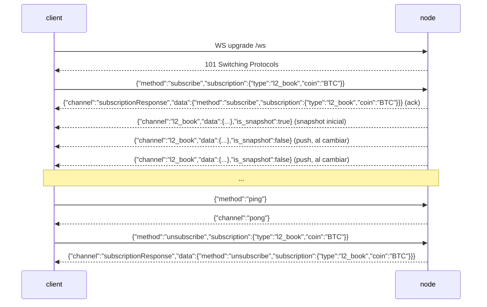

# WebSocket API

:::info
**Estado.** Activo en el nodo para `l2_book`, `bbo` (libro/mejor precio), `trades`, `active_asset_ctx` (mark/oracle/financiación/interés abierto por mercado), `all_mids`, `fills`, `user_events` y `candles` (barras OHLCV en tiempo real, por `(coin, interval)`) — todos emiten datos confirmados en tiempo real, orientados a cambios (un canal emite un frame solo cuando su estado cambió desde el último commit) — además de `post` (solicitud/respuesta sobre WS) y `ping`/`pong`. Consulte [suscripciones](./subscriptions.md) para ver las estructuras por canal.
:::

:::info
**Los nombres de canal usan snake_case (nativo de MTF).** La interfaz `/ws` del nodo es nativa de MTF, por lo que los nombres de canal en el wire son snake_case: `l2_book`, `bbo`, `trades`, `active_asset_ctx`, `fills`, `candles`, `user_events`. El gateway sirve este mismo WS nativo en `api.<net>.mtf.exchange/ws`.
:::

## Resumen rápido

Una única conexión WS multiplexa suscripciones a múltiples canales. El protocolo de frames refleja el de HL (`{"method":"subscribe","subscription":{"type":...}}`), pero los **nombres de canal son snake_case nativo de MTF** (`l2_book`, `user_events`, …): se envía una suscripción, el servidor responde con un ack `subscriptionResponse` seguido de un snapshot inicial, y luego envía frames `{"channel":...,"data":...}` por cada commit de estado. Los canales de libro (`l2_book`, `bbo`) son **por mercado** y requieren un `coin`. Lea esta página para el ciclo de vida de la conexión; consulte [suscripciones](./subscriptions.md) para el catálogo de canales.

## URL

```
wss://api.<net>.mtf.exchange/ws
```

El WS nativo de MTF (canales snake_case) lo sirve el gateway en `/ws`. La puerta de entrada del gateway termina TLS (`wss://`). Si ejecuta el nodo usted mismo, el mismo WS nativo se sirve en texto plano en `ws://localhost:8080/ws` — el protocolo de frames es idéntico en ambos casos.

## Ciclo de vida de la conexión



## Frames

Todos los frames son frames de texto JSON. Los frames binarios son rechazados con un frame de error (la conexión permanece abierta). Los frames entrantes se identifican por `method`; los frames salientes se identifican por `channel`.

### `subscribe`

```json
{
  "method": "subscribe",
  "subscription": { "type": "<channel>", "coin": "<coin>" }
}
```

- `subscription.type` (obligatorio) — el nombre del canal (snake_case, p. ej. `l2_book`). Los nombres desconocidos producen un frame de error.
- `subscription.coin` (obligatorio para los canales por mercado `l2_book` / `bbo` / `trades` / `active_asset_ctx`; omitido para `user_events`) — consulte [Parámetro coin](#parámetro-coin).

El servidor responde con **dos** frames, en orden:

1. El ack:

```json
{
  "channel": "subscriptionResponse",
  "data": { "method": "subscribe", "subscription": { "type": "l2_book", "coin": "BTC" } }
}
```

2. Un frame de snapshot inicial en el canal suscrito (consulte cada canal en [suscripciones](./subscriptions.md)). Para `l2_book` / `bbo` es un snapshot real del libro más reciente confirmado; para canales sin fuente activa aún, es un cuerpo vacío pero válido.

Una suscripción duplicada al mismo `(type, coin)` se **ignora silenciosamente** (sin segundo ack, sin error) — comportamiento idéntico al de HL.

### `unsubscribe`

```json
{ "method": "unsubscribe", "subscription": { "type": "l2_book", "coin": "BTC" } }
```

Ack (refleja el ack de suscripción con `method: "unsubscribe"`):

```json
{
  "channel": "subscriptionResponse",
  "data": { "method": "unsubscribe", "subscription": { "type": "l2_book", "coin": "BTC" } }
}
```

Tras el ack no llegan más frames para ese `(type, coin)` hasta que vuelva a suscribirse. Cancelar la suscripción de un `(type, coin)` al que nunca se suscribió es una operación sin efecto (aún así recibirá el ack).

### `ping` / `pong`

```json
{ "method": "ping" }
```

```json
{ "channel": "pong" }
```

Un `{"method":"ping"}` simple (sin `subscription`) es el latido de la aplicación; el servidor responde con `{"channel":"pong"}`. El nodo también responde automáticamente a los pings de control WebSocket a bajo nivel (RFC 6455 `Ping`) con un `Pong`, por lo que ambos mecanismos de latido funcionan.

### Frame de error

Cualquier frame entrante malformado o no reconocido produce un frame de error **sin cerrar la conexión**:

```json
{ "channel": "error", "data": { "error": "<razón>" } }
```

Las causas incluyen: JSON malformado, `method` ausente, `subscription` / `subscription.type` ausente, nombre de canal desconocido (`"unknown channel: <name>"`), frame binario, o método desconocido. El cliente puede corregir y reintentar en el mismo socket.

### Mensajes push

Los frames de datos en vivo comparten un mismo envelope:

```json
{ "channel": "<channel>", "data": { /* específico del canal */ }, "is_snapshot": false }
```

- `is_snapshot` es un booleano: `true` en el frame inicial al suscribirse (el snapshot completo), `false` en los pushes posteriores orientados a cambios. **Cada cuerpo de frame es un snapshot completo independientemente** (p. ej. `l2_book` contiene los 20 niveles superiores completos, `all_mids` el mapa completo, `account_state` el estado completo de la cuenta) — `is_snapshot` es informativo, no indica "esto es un diff". Un cliente que simplemente reemplaza su estado local en cada frame se mantiene consistente y puede ignorar el campo.
- **No** existe campo `seq`, `ts` ni `sub_id` en el frame. Desmultiplexe por `channel` (y, para canales por mercado, por el `coin` dentro de `data`).

Las actualizaciones son **orientadas a cambios**: tras cada commit, el nodo publica un frame para un canal suscrito **solo cuando el estado confirmado de ese canal cambió efectivamente** desde el commit anterior. Un commit que no modifica un canal vigilado no emite nada para él — por lo tanto recibirá menos frames que bloques, sin re-envíos redundantes de datos sin cambios (consulte [Push por suscriptor](#push-por-suscriptor)).

### `post` (solicitud/respuesta sobre WS)

Un `post` permite realizar una llamada de solicitud/respuesta puntual sobre el mismo socket en lugar de abrir una conexión REST. El cuerpo de `request` es el mismo envelope `{type, payload}` que aceptan las rutas REST y se despacha a través de los **mismos handlers exactos** que `POST /info` y `POST /exchange` — incluida la verificación de firma en las acciones.

Solicitud:

```json
{
  "method": "post",
  "id": 42,
  "request": { "type": "info", "payload": { "type": "node_info" } }
}
```

Respuesta (correlacione por `id`):

```json
{
  "channel": "post",
  "data": {
    "id": 42,
    "response": { "type": "info", "payload": { /* mismo cuerpo que POST /info */ } }
  }
}
```

- `request.type` es `"info"` o `"action"`.
- Para `"action"`, `payload` debe ser un envelope de intercambio firmado completo (`signature` / `nonce` / `action`), idéntico al de [`POST /exchange`](../rest/exchange.md). La acción se firma sobre la **serialización compacta `serde_json` del objeto `action`** — la forma canónica determinista que fija el SDK.
- Los errores se devuelven como un frame `post` normal con `response.type: "error"` y un `payload` de tipo string (nunca como cierre de conexión):

```json
{ "channel": "post", "data": { "id": 42, "response": { "type": "error", "payload": "<mensaje>" } } }
```

Una acción con formato correcto pero fallida (p. ej. firma incorrecta) se devuelve como una respuesta `action` normal con `payload.accepted: false` y un string `error`, no como una respuesta de tipo `error`.

## Parámetro coin

El hub de distribución está indexado por `(channel, coin)`. Para los canales por mercado `l2_book` y `bbo` esto implica:

- **`coin` es obligatorio.** Sin él, aterrizará en el bucket `(channel, None)` sin coin, al que el publicador del libro por mercado nunca escribe — solo recibirá el snapshot inicial vacío y ninguna actualización en vivo.
- **Un suscriptor de `BTC` solo recibe frames de `BTC`.** Los commits de ETH nunca llegan a una suscripción de BTC, y viceversa.

`coin` se canonicaliza a una **cadena de id de activo** antes de la indexación, por lo que dos formas resuelven al mismo bucket:

- Un **id de activo numérico** — p. ej. `"0"`, `"7"` — se mapea directamente a ese mercado (la clave canónica nativa de MTF).
- Un **símbolo** — p. ej. `"BTC"` — se resuelve contra el universo confirmado (`mip3_market_specs`, comparando por `symbol` o `asset_name`) hacia su id de activo.

Por tanto, un suscriptor indexado por `"BTC"` y otro indexado por el id numérico `"0"` (si BTC es el activo 0) comparten el **mismo** bucket de enrutamiento en la publicación por commit. Un coin que no es numérico ni un símbolo de universo conocido se mantiene textualmente como su propio bucket — recibirá el ack más el snapshot vacío, pero nunca frames en vivo (comportamiento honesto de "mercado desconocido" en lugar de un mapeo fabricado).

## Push por suscriptor

Los pushes son **filtrados por suscriptor, por mercado y orientados a cambios**. Tras cada bloque confirmado, el nodo verifica por cada mercado `has_receivers(channel, coin)` — una búsqueda O(1) — y solo entonces agrega el libro de ese mercado y lo transmite **únicamente si cambió** desde el commit anterior. Consecuencias:

- Un mercado que nadie está observando tiene solo el coste de la verificación O(1); no se construye ningún libro.
- Un suscriptor de `BTC` nunca desencadena la construcción del libro de `ETH`.
- Un mercado cuyo libro no cambia en un commit no emite nada para ese commit — sin re-envíos redundantes.
- Los frames se entregan a **todos** los suscriptores actuales de ese bucket `(channel, coin)`.

## Contrapresión y retraso

Cada suscripción está respaldada por un buffer circular de transmisión acotado (capacidad de **256** frames). Un consumidor que se retrase más de 256 frames es **desconectado**: el servidor envía un frame de error final que describe el retraso y deja de reenviar en esa suscripción.

```json
{ "channel": "error", "data": { "error": "lagged behind broadcast by <n> messages" } }
```

Ante esta señal, vuelva a suscribirse (recibirá un snapshot fresco). El nodo **no** avanza silenciosamente — en una cadena de derivados, una brecha en el estado del libro es peor que una desconexión explícita.

## Autenticación

Los canales de mercado públicos (`l2_book`, `bbo`, `trades`, `all_mids`) **no requieren autenticación**.

Los canales por cuenta (`fills`, `user_events`) están activos y se enrutan por dirección `user` en formato 0x, pero **aún no existe control de acceso** — cualquier conexión puede suscribirse al feed de cualquier dirección (los datos son los mismos fills públicos confirmados, indexados por cuenta). Un envelope de autenticación al suscribirse (para que una conexión solo vea su propia cuenta) está en la hoja de ruta. Para lecturas/escrituras autenticadas hoy, use el canal `post` (lecturas de información y acciones firmadas mediante la misma verificación EIP-712 que `POST /exchange`). Consulte [suscripciones](./subscriptions.md).

## Multiplexación

Una única conexión puede mantener múltiples suscripciones; cada una se desmultiplexa por su `(channel, coin)`. Cada suscripción tiene su propio receptor de broadcast y tarea de reenvío; la conexión intercala sus frames en el mismo socket. Enrute los frames entrantes por `channel` más el `coin` dentro de `data`.

```
l2_book  coin "0" (BTC)
l2_book  coin "1" (ETH)
bbo      coin "0" (BTC)
```

## Comportamiento al cerrar

- Un frame de cierre del cliente (o EOF) destruye la conexión y aborta todas las tareas de reenvío.
- Un error de lectura registra el error y cierra.
- Una suscripción con retraso se elimina individualmente (frame de error), pero la **conexión permanece abierta** — las demás suscripciones siguen fluyendo.

No existe tabla de códigos de cierre personalizada hoy en día; se aplican los códigos de cierre estándar de WebSocket.

## Estrategia de reconexión

1. Al desconectarse, reconecte con retroceso exponencial (sugerido: base 200 ms, máximo 30 s, jitter ±20%).
2. Vuelva a suscribirse a cada `(type, coin)` desde cero. El primer frame tras cada suscripción es un snapshot fresco, por lo que no hay token de reanudación que gestionar — descarte el estado local del libro y reconstruya desde el snapshot.
3. Ante un frame de error `lagged`, trátelo igual que una desconexión para esa suscripción y vuelva a suscribirse.

:::warning
**No** existe mecanismo de `seq` / `resume` / `resume_token` hoy en día. Cada (re)suscripción comienza desde un snapshot fresco. Los buffers de reanudación están en la hoja de ruta, no implementados.
:::

## Véase también

- [Catálogo de suscripciones WS](./subscriptions.md)
- [`POST /exchange`](../rest/exchange.md) — el mismo envelope EIP-712 utilizado por el path de acción `post`
- [`POST /info`](../rest/info.md) — equivalentes REST para lecturas puntuales (también accesibles vía `post`)
