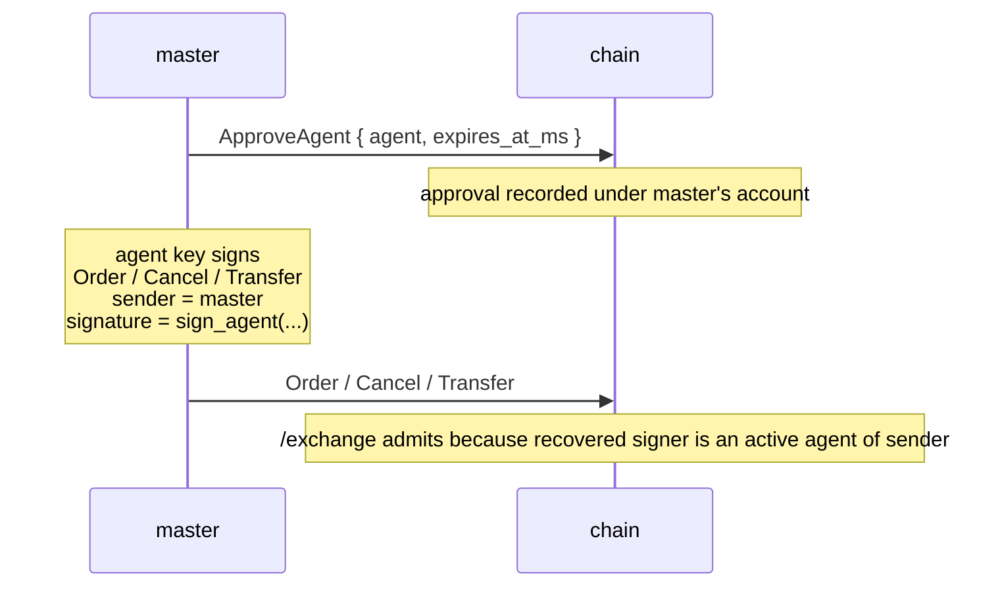

# Wallets de agente

:::tip
**Estable.**
:::

Una **wallet de agente** (también conocida como "wallet de API") es una clave que firma acciones de trading en nombre de una cuenta maestra sin tener nunca autoridad de retiro. Así es como operan en la práctica todos los creadores de mercado serios: la clave maestra se guarda en almacenamiento en frío y una clave en caliente ejecuta los bots.

La misma primitiva que usan las wallets de API del DEX de contratos perpetuos on-chain dominante. Compatible de forma directa a nivel de protocolo.

## Por qué usarlas

- **Cuenta maestra en almacenamiento en frío.** Aprueba una sola vez desde el almacenamiento en frío y no vuelves a firmar desde la clave de alto valor.
- **Alcance por bot.** Distintos agentes por estrategia o por máquina; revoca el que se vea comprometido sin afectar a los demás.
- **Caducidad.** Aprueba con una marca de tiempo de expiración; la clave se invalida sola aunque olvides revocarla.
- **Auditoría.** Cada acción es firmada por un agente específico, por lo que el registro en cadena es forense y limpio.

## El ciclo de vida



La cuenta maestra firma `ApproveAgent` una sola vez. Una vez confirmado ese bloque, el agente puede firmar cualquier acción con `sender = master_addr` y la cadena la trata como si la hubiese firmado la cuenta maestra. Las aprobaciones pueden llevar una caducidad explícita, de modo que las claves en caliente se retiran solas aunque nunca se revoquen de forma explícita.

## La verificación de autorización

Cada solicitud a [`POST /exchange`](../api/rest/exchange.md) lleva tres elementos:

```
sender    = "0x<claimed master address>"
signature = secp256k1 ECDSA over the EIP-712 envelope
action    = the state-mutating action
```

La cadena ejecuta esta verificación en cada admisión:

```
recovered_addr = ecrecover(eip712_envelope(action), signature)

if recovered_addr == sender:
    admit                                # master signed
else if recovered_addr is an active agent of sender (not expired):
    admit                                # an active agent of sender signed
else:
    return 401
```

Dos consecuencias que vale la pena destacar:

1. **Sin tokens de portador ni claves de API.** La firma en sí misma ES la autenticación. Poseer la clave privada de un agente es lo que acredita la autoridad; nada en la URL de la solicitud ni en las cabeceras otorga acceso.
2. **`sender` solo es confiable para el servidor gracias a la firma.** Declarar `sender = anyone` no prueba nada hasta que el firmante recuperado coincide con el conjunto aprobado de esa cuenta.

## El sobre EIP-712, en detalle

El payload firmado para cualquier acción es:

```
message_hash  = keccak256( msgpack(action) )
signed_hash   = keccak256( 0x1901 ‖ domain_separator ‖ message_hash )
signature     = secp256k1_sign( signed_hash, agent_private_key )
```

donde:

```
domain_separator = keccak256(
    keccak256("EIP712Domain(string name,string version,uint256 chainId,address verifyingContract)") ‖
    keccak256("MetaFlux") ‖
    keccak256("1") ‖
    chain_id_as_uint256_be ‖
    address(0).padded_to_32
)
```

Esta composición sigue la semántica del sobre estándar EIP-712; los clientes del stack EVM que ya hablan EIP-712 (MetaMask, Rabby, Ledger, WalletConnect) pueden apuntar a este dominio sin modificaciones.

`action` se firma como **datos estructurados y tipados EIP-712** — un tipo primario por variante de acción (`MetaFluxTransaction:<Action>`), de modo que las wallets renderizan cada campo por nombre. Consulta [firma de datos tipados](../integration/typed-data-signing.md) para los strings de tipo por acción. La recuperación de firma y la compatibilidad EVM no cambian independientemente de si firma la cuenta maestra o un agente aprobado.

## Lo que almacena la cadena

Por cada cuenta maestra, un conjunto de agentes aprobados:

```
approval = {
  agent          : address (20 bytes),
  approved_at_ms : u64 (block time at approval),
  expires_at_ms  : u64 or null (null = no expiry),
  name           : optional label for bookkeeping
}
```

Todos los campos de tiempo se derivan del tiempo de bloque de consenso, no del reloj del sistema. Determinismo: todos los validadores coinciden en el estado del agente a la misma altura de bloque.

## Aprobar un agente

La cuenta maestra envía una acción `ApproveAgent` mediante [`POST /exchange`](../api/rest/exchange.md):

```json
{
  "sender":    "0x<master_addr>",
  "signature": "0x<master_signature>",
  "action": {
    "type": "ApproveAgent",
    "params": {
      "agent":          "0x<agent_addr>",
      "expires_at_ms":  1735689600000,
      "name":           "trading-bot-1"
    }
  }
}
```

`expires_at_ms`:
- `null` → sin caducidad (persiste hasta que se retire explícitamente)
- un entero positivo → unix ms tras el cual la cadena rechaza las solicitudes firmadas por el agente

`name` es únicamente una etiqueta para tu propio registro contable — se devuelve en las consultas de información de `userState` / `subAccounts`.

## Operar desde el agente

Una vez confirmado el bloque de aprobación, firma cualquier acción con la clave del **agente** pero envíala con la dirección del **maestro** como `sender`. Tu SDK gestiona el sobre EIP-712 y envía el paquete firmado. La cadena recupera la dirección del agente a partir de la firma, detecta la discrepancia con `sender`, comprueba el conjunto de aprobaciones y admite la solicitud.

## Retardo de propagación

Después de que `ApproveAgent` se confirma en el bloque de altura `H`:
- las solicitudes en el bloque `H+1` y posteriores ya ven la nueva aprobación

En la práctica esto significa: espera un tick de consenso tras enviar `ApproveAgent` antes de iniciar el tráfico firmado por el agente. La política de reintentos del SDK con retroceso lineal gestiona este límite limpiamente.

Reducir la caducidad (lo que equivale a retirar un agente) sigue el mismo retardo de un bloque.

## Rotación y caducidad

Dos formas en que un agente deja de ser efectivo:

- **La caducidad** se establece en el momento de la aprobación y se ejecuta sola — en cuanto `now > expires_at_ms`, las solicitudes fallan. No es necesario enviar nada más.
- **La reaprobación** con una caducidad reducida. Enviar un nuevo `ApproveAgent` para la misma dirección de agente sobreescribe el registro anterior; establecer `expires_at_ms` en el pasado retira la clave de forma efectiva.

Para la rotación rutinaria, se recomienda usar la caducidad. Los SDKs gestionan el ciclo de renovación de forma transparente.

## Protección contra repetición

La cadena aplica nonces por usuario:

- Cada acción lleva un `nonce`
- Reutilizar un nonce para el mismo usuario se rechaza aunque la firma sea válida en todos los demás aspectos

Implicación práctica: el mismo agente puede enviar acciones concurrentes de forma segura siempre que cada una lleve un nonce único. Los SDKs suelen usar unix-ms con jitter.

Para las solicitudes firmadas por el agente, el espacio de nonces está vinculado al **maestro** (`sender`), no al agente. Dos agentes distintos del mismo maestro comparten el espacio de nonces.

## Lista de verificación para producción

Patrones probados en batalla para operar una flota de claves de agente en producción:

| Elemento | Por qué |
|------|-----|
| Cuenta maestra en almacenamiento en frío (hardware wallet / HSM) | La cuenta maestra solo firma `ApproveAgent` (y `WithdrawUsdc` en los retiros) — eventos poco frecuentes |
| Un agente por host / contenedor | Si un host se ve comprometido, solo queda expuesta la autoridad de ese agente; revócalo sin afectar a los demás |
| `expires_at_ms` establecido a ≤ 30 días desde la aprobación | Impone un ciclo de renovación; los renovaciones omitidas equivalen a una revocación automática |
| El nombre del agente incluye el host y la hora de inicio | Hace que la forensia de auditoría sea trivial: `mm-host-3 / 2026-Q2` |
| Script de rotación: pre-registrar el nuevo agente antes de que caduque el antiguo | Envía `ApproveAgent` para la nueva clave 24h antes de la caducidad de la antigua; cambia el tráfico; deja que la antigua caduque |
| Simulacro de compromiso: runbook de revocación y rotación probado trimestralmente | Cuando una clave realmente se filtra, la ejecución mecánica es crucial |
| Monitorear `userEvents` para eventos `agentApproved` / `agentExpired` | Confirma que el estado en cadena coincide con lo esperado |
| Usar un agente distinto para cancelar solo vs. trading completo | Las claves de solo cancelación son más seguras en entornos semifiables |

### Patrón de rotación

```
day -1   submit ApproveAgent { agent: new_key, expires_at_ms: NOW + 30d }
          wait 1 block (consensus tick); confirm via /info agents
day 0    flip traffic in your bot: stop using old_key, start using new_key
day 0    submit ApproveAgent { agent: old_key, expires_at_ms: NOW + 1h }
          to bound the old key's remaining authority window
day +1h  old_key expires automatically
```

El pre-registro evita cualquier ventana en la que ambas claves pudieran usarse en paralelo
(lo cual tampoco sería un problema — los agentes concurrentes comparten el espacio de nonces del maestro).

## Lo que un agente no puede hacer

Por diseño, los agentes **no tienen autoridad de retiro**. Cualquier operación que mueva fondos fuera de la cuenta maestra (retiros a cadenas externas, transferencias a otras direcciones) debe ser firmada por la clave maestra. La gestión de agentes en sí (crear o extender aprobaciones) también es exclusiva del maestro — no existe recursión agente-de-agente.

Los agentes *sí pueden* operar, cancelar, modificar el modo de margen dentro de los límites, colocar / cancelar TWAP y realizar la mayoría de los flujos de trading ordinarios.

## Casos de fallo

| Síntoma | Causa | Solución |
|---------|-------|-----|
| `401` en cada solicitud firmada por el agente | La aprobación aún no se ha confirmado | Espera un bloque después de `ApproveAgent` |
| `401` tras un período de funcionamiento correcto | El agente ha caducado | Aprueba de nuevo (nueva caducidad) o rota a un agente nuevo |
| `401` solo en acciones de retiro | Los agentes no pueden retirar (por diseño) | Firma con la clave maestra para los retiros |
| `401` inmediato en un maestro recién creado | `sender` declarado como maestro pero el firmante era otro y no existe aprobación | Verifica que estás firmando con la clave correcta |

## Véase también

- [`POST /exchange`](../api/rest/exchange.md) — la ruta de admisión
- [Tutorial de firma](../integration/signing.md) — ejemplo EIP-712 concreto de extremo a extremo
- [Migrar desde HL](../integration/migrating-from-hl.md) — patrones de migración directa para bots de HL
