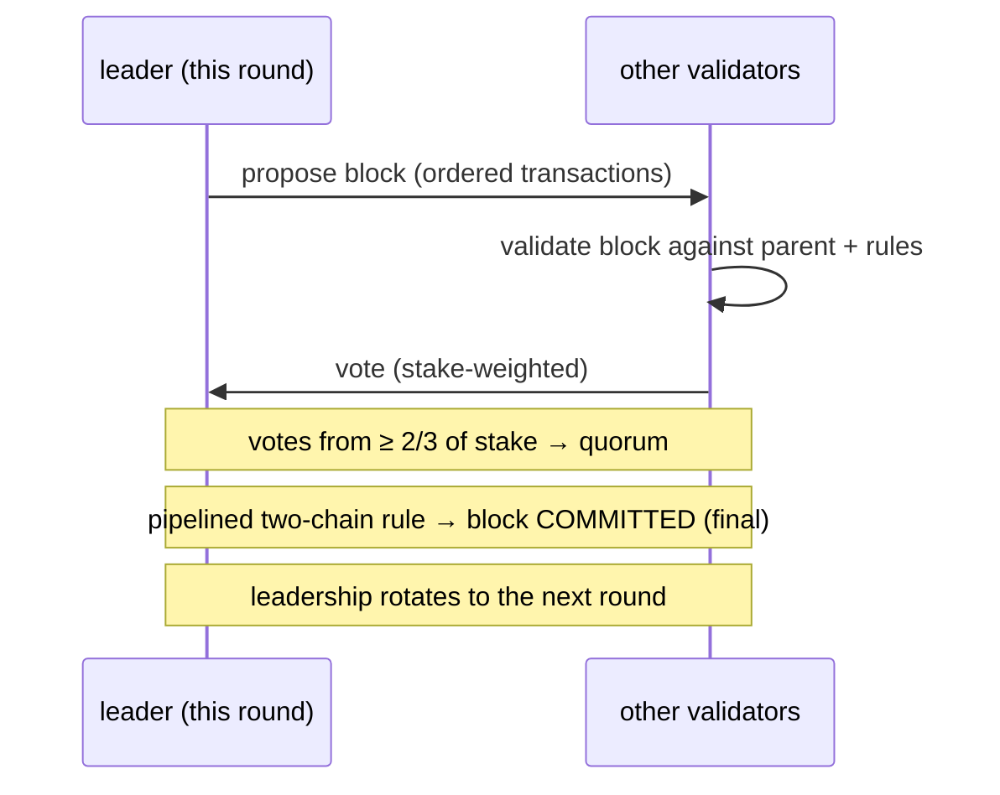
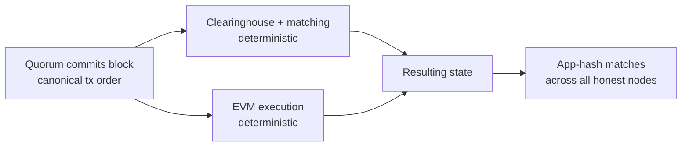

# Consenso (MetaFluxBFT)

:::info
**En producción.** MetaFluxBFT es el motor de consenso en producción que asegura la
L1 de MetaFlux. Ordena cada transacción — órdenes, cancelaciones, liquidaciones, transferencias,
llamadas EVM — en una sola cadena canónica con finalidad determinista e instantánea.
:::

## Resumen

**MetaFluxBFT** es el motor de consenso de Prueba de Participación (PoS) tolerante a fallos
bizantinos (BFT) de MetaFlux. Un conjunto de validadores ponderado por participación llega a un
acuerdo, bloque a bloque, sobre un orden canónico único de cada transacción. Una vez que un bloque
es confirmado por un quórum, es **definitivo de inmediato** — sin confirmaciones probabilísticas,
sin esperar N bloques, sin reorganizaciones. Ese orden total e instantáneo es precisamente lo que
permite a MetaFlux operar un libro de órdenes y una cámara de compensación totalmente en cadena:
cada emparejamiento, ejecución, pago de financiación y liquidación se liquida contra una orden sobre
la cual toda la red ya está de acuerdo.

## Por qué una bolsa necesita esto

Un mercado de negociación solo es justo si todos ven el mismo libro en el mismo orden.
MetaFluxBFT proporciona dos propiedades que importan directamente a los operadores y
desarrolladores:

| Propiedad | Qué significa para ti |
|-----------|------------------------|
| **Orden total** | Cada transacción ocupa una posición acordada y única en la secuencia. El motor de emparejamiento procesa las órdenes exactamente en ese orden — no existe un canal privilegiado que pueda reordenar las transacciones alrededor de las tuyas. |
| **Finalidad instantánea** | Un bloque confirmado no puede revertirse. Una ejecución o liquidación queda completada en el momento en que el bloque se confirma — nunca hay que descontar la posibilidad de una reorganización. |

Juntas, estas propiedades ofrecen **emparejamiento resistente al front-running** y **liquidación
inmediata**: la misma secuencia canónica que asegura la cadena es la secuencia contra la que
el libro de órdenes realiza el emparejamiento.

## Linaje de diseño

MetaFluxBFT es una implementación **nativa de MetaFlux** dentro del linaje académico de la
familia de protocolos BFT segmentados **HotStuff / Jolteon** (la línea de investigación que
también incluye DiemBFT). Esta familia se caracteriza por:

- **Basada en líder** — en cada ronda, un validador propone el siguiente bloque y
  los demás votan sobre él.
- **Parcialmente síncrona** — permanece *segura* (nunca produce historiales finalizados
  contradictorios) en todo momento, y avanza una vez que la red entrega mensajes de forma
  oportuna.
- **Confirmación de dos cadenas** — la finalidad se alcanza mediante una cadena corta y
  segmentada de votos en lugar de una ronda de todo-o-nada, lo que mantiene baja la latencia
  de confirmación sin sacrificar la seguridad BFT.

MetaFlux construye su propio motor sobre estos fundamentos de investigación pública en lugar de
bifurcar una base de código existente, de modo que el protocolo pueda ajustarse a las necesidades
de una bolsa en cadena (ejecución determinista, EVM integrada, conjunto de validadores derivado
del stake).

## Validadores y staking

El conjunto de validadores se deriva directamente del **stake en cadena** — MetaFluxBFT es un
protocolo de Prueba de Participación. Cualquier persona que cumpla los requisitos de participación
puede ejecutar un validador; los delegadores respaldan a los validadores con MTF (véase
[Staking](./staking.md)).

- **Votación ponderada por stake.** La influencia de un validador sobre el consenso es
  proporcional al stake que lo respalda, no un voto por nodo.
- **Quórum = dos tercios del stake.** Un bloque se confirma únicamente cuando los validadores
  que representan **al menos dos tercios del poder de voto total en stake** votan a su favor.
  Este quórum de dos tercios es el núcleo de la garantía BFT.
- **Rotación de liderazgo.** El derecho a proponer rota entre el conjunto de validadores, de
  modo que ningún validador único controla la producción de bloques.

### Épocas

El conjunto de validadores es fijo dentro de una **época** y solo puede cambiar en los límites
de época. Mantener el conjunto estable durante la duración de una época hace que el consenso sea
determinista y predecible, a la vez que permite que el conjunto evolucione con el tiempo a medida
que el stake se redistribuye, los validadores se incorporan o los validadores se retiran. Cuando
una época finaliza, el protocolo adopta el nuevo conjunto derivado del stake para la siguiente época.

## Seguridad y vivacidad

Dos garantías definen lo que MetaFluxBFT promete, en el sentido clásico de BFT:

:::tip Seguridad
**La cadena nunca finaliza dos historiales contradictorios**, siempre que **más de dos tercios**
del poder de voto en stake sea honesto. Equivalentemente, MetaFluxBFT tolera hasta **un tercio**
del poder de voto siendo Bizantino (con fallos arbitrarios) sin confirmar nunca bloques
contradictorios. La seguridad se mantiene incluso cuando la red es lenta o los mensajes se retrasan.
:::

:::tip Vivacidad
**La cadena sigue avanzando** — confirmando nuevos bloques — una vez que la red es suficientemente
síncrona para entregar mensajes de forma oportuna. Gracias a la rotación de liderazgo, un líder
bloqueado o que no responde no puede detener la cadena: el protocolo transfiere el liderazgo y
continúa.
:::

Esta es la separación estándar en BFT parcialmente síncrono: *seguridad siempre*,
*vivacidad bajo sincronía*.

## Finalidad y ejecución determinista

La finalidad en MetaFluxBFT es **inmediata y absoluta**. En el momento en que un quórum confirma
un bloque, ese bloque — y el orden exacto de transacciones que contiene — es permanente. No hay
período de liquidación probabilístico ni riesgo de reorganización.

La ejecución se superpone a ese orden confirmado y es **completamente determinista**:

1. El consenso fija el orden canónico de las transacciones en un bloque.
2. Cada nodo ejecuta la **misma** transición de estado sobre ese orden — la cámara de
   compensación y el motor de emparejamiento para las operaciones de trading, y la EVM para las
   transacciones de contratos inteligentes.
3. Dado que las entradas (transacciones ordenadas) y la función de transición son idénticas,
   cada nodo honesto llega de forma independiente al **estado resultante idéntico**.

Los nodos confirman que están de acuerdo comparando una huella compacta del estado resultante
(un "app-hash"). El orden idéntico más la ejecución determinista significa que el app-hash de
cada nodo honesto coincide — la red mantiene un acuerdo exacto sin tener que confiar en el
cómputo de ningún nodo individual.

## Responsabilidad

Los validadores son económicamente responsables de cómo participan. Un validador que
**demuestre comportamiento indebido** puede ser **encarcelado** (eliminado de la participación
activa) y **recortado** (perder una porción del stake). La indisponibilidad prolongada también
puede llevar al encarcelamiento. Esto vincula la posición económica de un validador a una
operación honesta y respalda las garantías de consenso con stake real en riesgo. Los delegadores
deben evaluar el historial operativo de un validador; véase [Staking](./staking.md) para conocer
cómo el recorte y el encarcelamiento afectan al stake delegado.

## Cómo encaja todo

MetaFluxBFT es el fundamento sobre el que descansa el resto del protocolo:

- El **libro de órdenes y la cámara de compensación** emparejan y liquidan contra el orden
  canónico único — eso es lo que hace que el emparejamiento en cadena sea justo.
- Las **liquidaciones** y el **financiamiento** se aplican en puntos derivados del consenso
  dentro de ese mismo orden, de modo que cada nodo liquida y financia de forma idéntica.
- La **cadena lateral EVM** también ejecuta sobre el orden confirmado, compartiendo la misma
  finalidad.
- El **staking** y la **gobernanza** retroalimentan el consenso: el stake determina el conjunto
  de validadores, y los parámetros establecidos por la gobernanza se confirman a través de la cadena.

## Ver también

- [Staking](./staking.md) — delega MTF, respalda validadores, obtén recompensas, y conoce las
  reglas de recorte y encarcelamiento que aseguran el consenso
- [Precios de marca](./mark-prices.md) — precios derivados del consenso que determinan el margen
  y la liquidación
- [Liquidación escalonada](./tiered-liquidation.md) — cómo se aplican las liquidaciones sobre
  el orden confirmado
- [Modelo de ejecución EVM](../evm/execution-model.md) — cómo la EVM ejecuta sobre el orden
  de bloques confirmado

## Preguntas frecuentes

Mostrar preguntas frecuentes

**P: ¿Cuántas confirmaciones debo esperar?**
R: Ninguna. La finalidad es instantánea — una vez que un bloque se confirma, es definitivo y no
puede ser reorganizado. Una ejecución queda liquidada en el momento en que su bloque se confirma.

**P: ¿Puede la cadena revertir una operación?**
R: No. No existen reorganizaciones. El historial confirmado es permanente.

**P: ¿Qué ocurre si el líder actual se desconecta?**
R: El liderazgo rota. Un líder bloqueado no puede detener la cadena; el protocolo transfiere el
liderazgo y continúa confirmando bloques una vez que la red entrega mensajes de forma oportuna.

**P: ¿Cuánto stake defectuoso puede tolerar la red?**
R: Hasta un tercio del poder de voto total en stake puede ser Bizantino sin que la cadena confirme
nunca historiales contradictorios. La seguridad exige que más de dos tercios del poder de voto sea
honesto.

**P: ¿Es esto Prueba de Trabajo?**
R: No. MetaFluxBFT es Prueba de Participación — el conjunto de validadores y el poder de voto
se derivan del stake de MTF en cadena, no de la minería.

