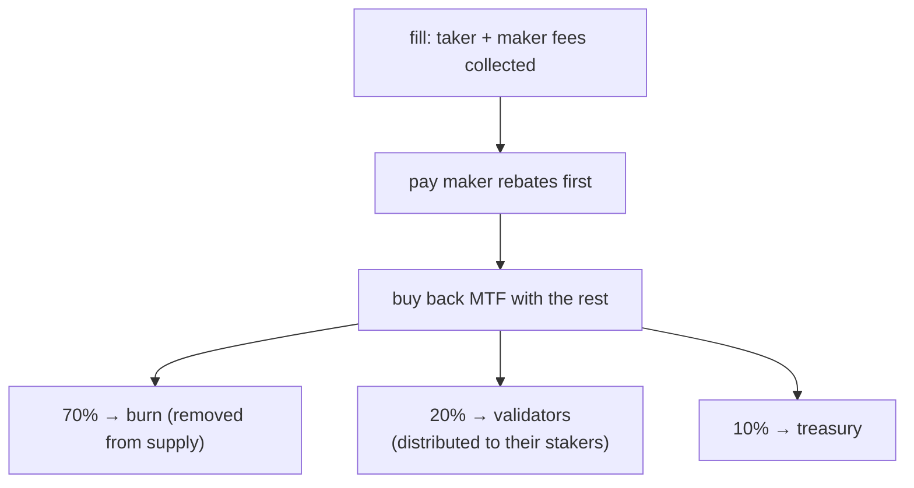

# Comisiones

:::info
**Página de conceptos.** Esta página explica cómo se calcula la comisión de trading por cada ejecución (fill), los créditos de constructor y referidor, las comisiones de spot y de liquidación, y el destino de las comisiones recaudadas. Para las tarifas actuales — niveles de comisión por volumen, niveles de rebate para makers y niveles de descuento por staking — consulta el [Esquema de comisiones](./fee-schedule.md). Los valores de comisión son parámetros de red y pueden actualizarse mediante gobernanza.
:::

## Resumen rápido

Cada ejecución cobra una comisión de maker y una de taker, definidas por el [Esquema de comisiones](./fee-schedule.md). Un crédito de constructor puede derivar una parte al originador del flujo de órdenes, y un crédito de referidor puede derivar una parte de la comisión de taker a un referidor. Tras pagar los rebates a los makers, el protocolo usa el resto de los ingresos por comisiones para **recomprar MTF**, y luego divide el MTF recomprado **70% quema / 20% validadores / 10% tesorería**. Las comisiones se deducen de tu saldo en el momento de la ejecución y se muestran en [`userFills`](../api/rest/info.md#user_fills).

## Cómo se calcula una comisión

Las comisiones se liquidan en el plano de USDC entero: el nocional es el producto precio por tamaño, truncado hacia cero.

### Por ejecución

```text
notional    = |price × size|
taker_fee   = notional × taker_rate
maker_fee   = notional × maker_rate
builder_fee = notional × builder_rate    # additive, taker-only, capped
```

Las tasas de taker y maker provienen de tu nivel en el [Esquema de comisiones](./fee-schedule.md): tu tasa base según el volumen de los últimos 30 días, un rebate adicional de maker según tu cuota de volumen como maker, y un descuento de taker según la cantidad de MTF que tienes en staking. Una tasa efectiva de maker negativa es un rebate pagado **al** maker, financiado con las comisiones de taker recaudadas en el mismo flujo — el protocolo nunca paga más de lo que ingresa.

La comisión por ejecución aparece en cada entrada de [`userFills`](../api/rest/info.md#user_fills) como `fee` (unidades base de USDC; positivo = pagado, negativo = rebate recibido).

## Crédito de constructor

Un originador de flujo de órdenes puede reclamar una parte de la comisión de taker configurando una dirección de constructor en la orden. El crédito se paga por ejecución a esa dirección. Usos habituales:

- un frontend o agregador que enrutó el flujo,
- una API de datos de mercado que incluye ejecución,
- un servicio automatizado de gestión de riesgo que colocó órdenes de protección.

El constructor debe ser una dirección registrada (ver [`approve_builder_fee`](../api/rest/exchange.md#approve_builder_fee)). Los constructores no registrados se ignoran silenciosamente. El crédito de constructor es aditivo y exclusivo del taker, con un límite por orden; no afecta al lado del maker.

## Crédito de referidor

Cuando una cuenta tiene un referidor asignado, una parte de su **comisión de taker** se deriva al referidor **antes** de distribuir el resto — sale de la parte del protocolo, no como un cargo adicional al taker. La comisión de maker no lleva crédito de referidor.

Las referencias son de un solo nivel (sin cadena multinivel — anti-Ponzi). Un referidor se establece una sola vez con [`set_referrer`](../api/rest/exchange.md#set_referrer) y es inmutable a partir de entonces; establecerse a uno mismo como propio referidor es rechazado.

Un crédito de constructor y un crédito de referidor pueden aplicarse a la misma ejecución — se pagan de forma independiente.

## Destino de las comisiones

Las comisiones recaudadas fluyen a través de un único proceso de acumulación de valor:



1. **Primero se pagan los rebates a los makers.** Las tasas netas de maker negativas (ver el [Esquema de comisiones](./fee-schedule.md)) se liquidan con las comisiones recaudadas en el mismo flujo.
2. **El resto recompra MTF.** Todos los ingresos por comisiones que quedan tras los rebates se usan para comprar MTF a precio de mercado al precio de referencia del protocolo. Esto genera presión compradora y convierte los ingresos por comisiones en MTF antes de distribuirlos.
3. **El MTF recomprado se divide en 70 / 20 / 10:**
   - **El 70% se quema** — se elimina permanentemente de la circulación (deflacionario).
   - **El 20% va a los validadores**, quienes lo distribuyen a sus stakers. Este es el **dividendo de staking** — los ingresos por comisiones llegan a los stakers a través de la cuota de su validador.
   - **El 10% va a la tesorería** (y absorbe el redondeo residual para que la división no tenga pérdidas).

Los totales acumulados de los pools (MTF recomprado y quemado, pool de validadores, tesorería) se registran en el estado confirmado y se exponen en la ruta de lectura mediante [`protocol_metrics`](../api/rest/info.md#protocol_metrics):

```bash
curl -X POST https://devnet-gateway.mtf.exchange/info -d '{"type":"protocol_metrics"}'
```

Dado que el dividendo de staking se entrega a través de la cuota de los validadores, haz staking de más MTF (o delega a un validador) para recibir una porción mayor — consulta [Staking](./staking.md).

## Comisiones en spot

La misma estructura de maker/taker se aplica a las ejecuciones de spot, pero las comisiones de spot se cargan en una **cuenta de comisiones separada** de la de los contratos perpetuos, y se toman **del activo que recibe cada parte** — no siempre del saldo en la moneda de cotización:

- la comisión del **taker** se toma del activo que recibe el taker,
- la comisión del **maker** se toma del activo que recibe el maker.

Por tanto, un **comprador** en spot (que recibe el activo base) paga su comisión en **base**, y un **vendedor** (que recibe la cotización) paga su comisión en **cotización**. Cada par de spot puede definir su propia tasa de maker/taker; cuando un par no las establece, se aplica el valor predeterminado global de spot. Consulta los niveles de spot en la respuesta de [`/info fee_schedule`](../api/rest/info.md#fee_schedule), y [trading en spot](../products/spot.md#matching-fills-and-fees) para el modelo de liquidación.

## Comisiones en ejecuciones de liquidación

Las cierres por liquidación siguen el proceso estándar de comisión de taker descrito anteriormente. Una comisión de liquidación discreta — un cargo adicional repartido entre el pool de seguros y la tesorería para mantener la solvencia del seguro y compensar a los makers que absorben el flujo forzado — es una intención de diseño que aún no está activa. Cuando entre en vigor, las cuentas liquidadas la pagarán como parte de la pérdida liquidada al cierre, marcada en las ejecuciones de liquidación en [`userFills`](../api/rest/info.md#user_fills). Consulta [liquidación por niveles](./tiered-liquidation.md) para conocer la mecánica de cierre.

## Consultas

```bash
# tier overview (MTF-native — gateway default path; running the node yourself: localhost:8080)
curl -X POST https://devnet-gateway.mtf.exchange/info -d '{"type":"fee_schedule"}'

# your personal tier and recent volume — MTF-native
curl -X POST https://devnet-gateway.mtf.exchange/info \
  -d '{"type":"user_fees","address":"0x<addr>"}'
```

## Casos extremos

<details>
<summary>Mostrar casos extremos</summary>

- **Volumen entre subcuentas.** Una cuenta principal y todas sus subcuentas comparten un mismo nivel de volumen. Un equipo que ejecuta muchas estrategias bajo una misma cuenta principal obtiene el nivel agregado.
- **Cadencia de evaluación del nivel.** Los niveles se reevalúan de forma continua en la ventana de 30 días en curso — no hay instantánea periódica. Una operación que te lleva a un nuevo nivel se aplica en la siguiente ejecución.
- **Crédito de constructor ≠ crédito de referidor.** Ambos pueden aplicarse a la misma ejecución — la cuenta del usuario tiene un referidor y la orden de esa ejecución especificó un constructor. Ambas rutas se pagan de forma independiente.
- **Nivel de maker con comisión negativa.** Cuando la tasa neta de maker está por debajo de cero, el maker recibe un pago de las comisiones de taker recaudadas en el mismo flujo (y en todas las ejecuciones del mismo bloque); el protocolo nunca paga más de lo que ingresa.

</details>

## Ver también

- [Esquema de comisiones](./fee-schedule.md) — la tabla de tarifas: niveles de comisión por volumen, niveles de rebate para makers y niveles de descuento por staking, y cómo se combinan los tres
- [Staking](./staking.md) — haz staking de MTF para el dividendo de la cuota de validadores y el descuento de taker
- [`POST /info fee_schedule`](../api/rest/info.md#fee_schedule)
- [`POST /info user_fees`](../api/rest/info.md#user_fees) — nivel por usuario nativo de MTF / volumen de 30 días
- [`POST /info protocol_metrics`](../api/rest/info.md#protocol_metrics) — pools de comisiones acumuladas (quema / tesorería / validadores)
- [Liquidación por niveles](./tiered-liquidation.md) — mecánica de liquidación

## Preguntas frecuentes

<details>
<summary>Mostrar preguntas frecuentes</summary>

**P: ¿Las comisiones se aplican por ejecución o por orden?**
R: Por ejecución. Una orden parcialmente ejecutada acumula comisión en proporción al tamaño ejecutado en cada evento de ejecución.

**P: ¿Las comisiones se pagan en USDC o en MTF?**
R: Pagas en la moneda de la ejecución (USDC para contratos perpetuos; el activo recibido para spot). Luego, el protocolo usa los ingresos por comisiones para recomprar MTF, y es el MTF recomprado el que se quema y distribuye.

**P: ¿Hay un mínimo de comisión?**
R: No hay mínimo. Una ejecución pequeña genera una comisión inferior a un centavo (redondeada hacia abajo en la visualización, cobrada con precisión completa internamente).

**P: ¿Cada porción de TWAP paga comisión de taker?**
R: Sí — cada porción es un IOC a discreción del protocolo. La comisión total del TWAP equivale a la suma de las comisiones de cada porción.

**P: ¿Puede el crédito de constructor ser cero?**
R: Sí. Si no estableces un constructor en una orden, no se asigna ningún crédito; la parte completa del protocolo fluye hacia el proceso de recompra y distribución.

**P: ¿Cómo ganan los stakers con las comisiones?**
R: A través de la cuota de los validadores. Tras la recompra, el 20% del MTF recomprado va a los validadores, quienes lo distribuyen a sus stakers — por lo que hacer staking (o delegar) te otorga una porción de los ingresos por comisiones. Consulta [Staking](./staking.md).

</details>
