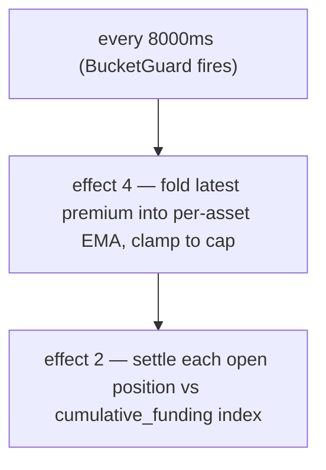

# Tasas de financiación

:::tip
**Estable.**
:::

## Resumen

Las posiciones en contratos perpetuos acumulan un pago de financiación continuo (liquidado cada **8 s** en cadena) proporcional a la **prima del perpetuo sobre el oráculo** — medida a partir del **precio de impacto** ponderado por profundidad, no de una sola operación — más un pequeño término de **interés** base. Los largos pagan a los cortos cuando el perpetuo cotiza por encima del oráculo; los cortos pagan a los largos cuando cotiza por debajo. El resultado está limitado a un máximo por mercado de **`±4% / hora`** de forma predeterminada, y se liquida contra el **oráculo**.

## Por qué existe la financiación

Los perpetuos no tienen fecha de vencimiento, por lo que no existe una fuerza de arbitraje que los ancle al activo subyacente. La financiación cumple esa función: cuando el precio del perpetuo se desvía por encima del spot, los largos pagan, lo que incentiva las posiciones cortas y desincentiva las largas hasta que el perpetuo vuelve a converger. El protocolo nunca toma ninguno de los dos lados — es de usuario a usuario.

## Fórmula

> El resumen anterior es el modelo conceptual. Los números a continuación son los valores **implementados**. En caso de discrepancia entre la documentación y el código, el código prevalece; las diferencias se indican en el texto.

### Cómo se calcula

La financiación se rige por una **EMA determinista** de la prima (precio de impacto − oráculo), liquidada cada **8 segundos**, no por hora. El límite es de **4% / hora**, no del 0,05%.

Dos efectos de inicio de bloque ejecutan el ciclo, cada uno protegido por un `BucketGuard` de 8000 ms:

- **efecto 4 `update_funding_rates`** — incorpora la última muestra de prima a la EMA por activo y aplica el límite.
- **efecto 2 `distribute_funding`** — liquida cada posición abierta contra el índice de financiación acumulado.

#### 0. Base de la prima — el precio de impacto (no la última operación)

La **muestra de prima por bloque** es la diferencia entre el **precio de impacto** del perpetuo y el oráculo:

```
premium = (impact_mid − oracle) / oracle
impact_mid = mid( impact_bid, impact_ask )
impact_bid/ask = VWAP de recorrer el libro comprometido para llenar un nocional fijo (predeterminado ~$10k)
```

Utilizar el precio de *impacto* — el precio ponderado por volumen para llenar un clip real — en lugar de la última operación o la mejor cotización significa que una sola operación, o una orden de un lote a un precio absurdo, **no puede** mover la financiación: hay que mover profundidad real. Esto sigue el diseño de referencia de los perpetuos. (Un modo heredado por mercado muestrea en su lugar `premium = (mark − oracle)/oracle`; los mercados nuevos y migrados usan la base de impacto descrita arriba.)

#### 1. EMA del índice de prima (por mercado)

La prima se suaviza mediante una **EMA determinista** (el *índice de prima*). El acumulador almacena una fracción de punto fijo `(num, denom)` — sin flotantes, aritmética exacta `rust_decimal::Decimal` para que el estado sea bit a bit idéntico entre nodos. Cada muestra se incorpora así:

```
num'   = num   * decay + sample
denom' = denom * decay + 1
value  = num / denom
```

- `sample` = última prima del activo × el `funding_rate_multiplier` por activo (predeterminado `1.0`; ajustado automáticamente por el motor de riesgo dinámico).
- `decay = 0.5` (valor predeterminado propuesto → ≈ 7 s de semivida con una cadencia de muestra de 5 s). Limitado a `[0, 1]` en el momento de la actualización.
- Cadencia de muestreo: **5 s**; cadencia de incorporación a la EMA + liquidación: **8000 ms** (`funding_update_guard` / `funding_distribute_guard`).

> **Estado:** el ciclo de financiación completo está **activo** de extremo a extremo. Cada período de 8 s el controlador de tasa muestrea la prima del estado comprometido (la prima impacto-vs-oráculo descrita arriba, una muestra por mercado de perpetuos), la incorpora a la EMA del índice de prima por activo, deriva la tasa (interés + límite), aplica el techo, y luego la liquidación avanza el índice de financiación acumulado y mueve `size × Δindex` entre los saldos de los propietarios de posiciones (suma cero: los largos pagan a los cortos o viceversa, sin emisión/quema) — todo desde el estado de mercado comprometido, sin alimentador externo de prima. Se verificó mediante fuzzing de conservación y determinismo, con una red de 4 nodos que demuestra el flujo divergencia → prima → EMA → índice → transferencia de saldo.

#### 2. Tasa a partir del índice de prima (interés + límite)

La tasa de financiación **no** es el índice de prima en bruto. El índice suavizado `premium_idx` se combina con un término de **interés** base mediante un límite por paso:

```
interest = 0.0000125 / h        # = 0.01% / 8h — el carry base
clamp    = ±0.0005              # límite por paso

funding = premium_idx + clamp( interest − premium_idx, −clamp, +clamp )
```

Cuando el índice de prima es pequeño, la financiación se desplaza hacia la línea base de `interest`; cuando la prima es grande, el término `premium_idx` domina y el límite controla con qué fuerza el interés retrocede en cada paso. Tanto `interest` como `clamp` son parámetros por activo configurables mediante gobernanza. (El modo heredado por mercado en su lugar lee el valor de la EMA directamente como tasa, sin la transformación interés/límite.)

#### 3. Techo externo

`funding` se limita finalmente al techo por hora:

```
cap_per_hour = 0.04          # 4 %/h predeterminado
funding = clamp(funding, −cap_per_hour, +cap_per_hour)
```

El techo es un parámetro de gobernanza por mercado: un `dynamic_risk_overrides[asset].funding_rate_cap` reemplaza el valor predeterminado `0.04` cuando está configurado.

#### 4. Pago (por posición, por liquidación)

La financiación se acumula en un índice por mercado (`clearinghouse.cumulative_funding`); cada posición lleva su último índice liquidado (`funding_entry`). En la liquidación:

```
payment = size_signed * oracle_px * (cum_global - funding_entry) * funding_rate_multiplier[asset]
funding_entry := cum_global      # avanzar el registro
```

(La aritmética está implementada y bloqueada por determinismo; la transferencia de saldo real se ejecuta con la liquidación BOLE completa.)

| Símbolo | Significado / plano |
|--------|-----------------|
| `size_signed` | Tamaño de posición con signo; `i128`. Largo > 0, corto < 0. |
| `oracle_px` | Precio del oráculo compuesto — plano `Decimal` en USDC entero (ver [precios de marca](./mark-prices.md)). |
| `cum_global − funding_entry` | Financiación acumulada para este mercado desde la última liquidación de la posición. |
| `decay` | Decaimiento de la EMA 0.5. |
| `cap_per_hour` | Predeterminado `0.04` (4 %/h); anulación por mercado vía riesgo dinámico. |
| `funding_rate_multiplier` | Multiplicador por activo, predeterminado `1.0`, ajustado automáticamente por riesgo dinámico. |

`funding_rate` (el valor de la EMA) tiene signo: positivo → los largos pagan a los cortos; negativo → los cortos pagan a los largos.

**Interés base:** `0.0000125/h` (= `0.01%/8h`) — el carry base al que se añade la EMA de la prima.

> ⚠️ **Corrección respecto al texto anterior.** La documentación antigua decía "cada hora", "ventana EMA de 60 minutos" y "techo de 0,05 %/hora". La implementación liquida cada **8 s**, el `decay` de la EMA es **0,5** (≈ 7 s de semivida), y el techo es **4 %/hora**. El modelo mental por hora es válido para cálculos de carry a grandes rasgos, pero la cadencia y el techo en cadena son los descritos arriba.

## Cadencia de pagos

La financiación se liquida **cada 8 segundos** (el intervalo de `funding_distribute_guard`), impulsada por marcas de tiempo de bloque derivadas del consenso — no por horas de reloj de pared. Las posiciones se liquidan contra el índice de financiación acumulado, por lo que una posición abierta a mitad de intervalo solo paga por la acumulación desde que se abrió (sin paso de "instantánea en la hora").



Los pagos se liquidan como ajustes de saldo — sin operación en cadena, sin comisión. Aparecen en el historial del usuario con `kind: "funding"`.

## Bloqueo cuando el oráculo no es de confianza

La financiación **se liquida contra el oráculo**, por lo que un precio en el que el protocolo no confía no debe impulsar un pago. En cada período la muestra de prima se *bloquea*: se omite (se muestrea como **0**) cuando:

- el **oráculo está ausente o es ≤ 0** para el mercado, o
- el **oráculo está desactualizado** más allá de `funding_oracle_staleness_ms` (predeterminado **60 s**), o
- el **libro es demasiado delgado** para llenar el nocional de impacto en ambos lados (sin precio de impacto).

Una muestra omitida se incorpora como 0, por lo que la EMA del índice de prima **decae hacia 0** y la tasa de financiación se desvanece en lugar de liquidarse sobre una base desactualizada o manipulable. (Ver también [casos extremos](#casos-extremos).)

:::info
**Por esto puede verse una gran diferencia marca↔oráculo con financiación ≈ 0.** Si el feed de oráculo de un mercado está roto o no es de confianza, la financiación se bloquea y decae a 0 — incluso mientras la [marca](./mark-prices.md#mark-vs-oracle--why-they-diverge) (que se construye a partir del libro y los perpetuos externos) está lejos del último oráculo válido. Una brecha amplia con financiación ~0 es el protocolo *rechazando cobrar financiación sobre un oráculo defectuoso*, no un error de financiación.
:::

## Ejemplo ilustrativo

Mercado: perpetuo BTC, estado actual (plano de oráculo en USDC entero):

```
mark         = 100.50
oracle       = 100.00
premium      = mark - oracle = 0.50
EMA(premium) settles toward 0.50 with decay 0.5 over a few 5s samples
funding cap  = 4% / hour (default)
```

Supongamos que el valor de la EMA resulta en una tasa de financiación de `+0.0005` (0,05%) para el intervalo (muy por debajo del techo de 4%/h). Posiciones de cuenta:

```
long 1 BTC      → pays funding
short 0.5 BTC   → receives funding
```

```
funding_rate = clamp(ema_value, -0.04, +0.04) = +0.0005   (not capped — far below 4%/h)

long 1 BTC:
  payment = +1   * oracle_px * Δcum  ≈ +1   * 100.00 * 0.0005 = +0.0500 USDC  (long pays)

short 0.5 BTC:
  payment = -0.5 * oracle_px * Δcum  ≈ -0.5 * 100.00 * 0.0005 = -0.0250 USDC  (short receives 0.0250)
```

(El pago usa `size_signed * oracle_px * (cum_global - funding_entry)`; aquí `Δcum` es la financiación acumulada desde la última liquidación de la posición.) Al liquidarse cada 8 s, la magnitud por intervalo es mínima; el techo solo importa cuando hay un desequilibrio sostenido unilateral, donde 4%/h es el máximo.

## Techos de financiación y límites dinámicos

| Parámetro | Predeterminado | Fuente / anulación |
|-----------|---------|-------------------|
| techo de financiación (por hora) | `0.04` (`4 %/h`) | `dynamic_risk_overrides[asset].funding_rate_cap` (votación de gobernanza) |
| `decay` de la EMA | `0.5` (≈ 7 s de semivida) | Propuesto; la calibración puede reajustarse a 0,3/0,7 |
| cadencia de muestreo | `5 s` | fijada por el protocolo |
| intervalo de liquidación / actualización | `8000 ms` | BucketGuards `funding_distribute_guard` / `funding_update_guard` |
| interés base | `0.0000125/h` (`0.01 %/8h`) | fijado por el protocolo |
| `funding_rate_multiplier` | `1.0` | por activo, ajustado automáticamente por riesgo dinámico |

El `funding_rate_multiplier` por activo es la diferenciación de MTF respecto al valor estático de gobernanza de HL: se ajusta automáticamente a partir de la volatilidad realizada de 30 días mediante el motor de riesgo dinámico, escalando la muestra de prima antes de que entre en la EMA.

## Historial de financiación

Historial por cuenta vía [`POST /info userFills`](../api/rest/info.md) o [HL-compat `userFills`](../api/rest/hl-compat.md) — los pagos de financiación aparecen con `kind: "funding"` y el activo correspondiente.

Historial por mercado:

```bash
curl -X POST https://devnet-gateway.mtf.exchange/info \
  -H 'content-type: application/json' \
  -d '{"type":"funding_history","market_id":0}'
```

Devuelve el anillo ordenado de muestras `(ts_ms, premium)` (ver
[`funding_history`](../api/rest/info.md#funding_history)):

```json
{
  "type": "funding_history",
  "data": {
    "market_id": 0,
    "samples": [
      { "ts_ms": 1700000000000, "premium": "0.0015" },
      { "ts_ms": 1700000008000, "premium": "-0.0007" }
    ]
  }
}
```

Un canal WS dedicado `fundingTicks` está en la [hoja de ruta de WS](../api/ws/subscriptions.md#roadmap--not-yet-available); mientras tanto, consulte [`funding_history`](../api/rest/info.md#funding_history).

## Lo que la financiación no hace

- **No tiene relación con las comisiones.** La financiación es de usuario a usuario; las comisiones son reembolsos de maker/taker para la plataforma. Ver [comisiones](./fees.md).
- **No hay intereses sobre el colateral.** El saldo en USDC no acumula intereses por financiación. La financiación tiene como único propósito cerrar la brecha marca-oráculo.
- **No es predecible en ventanas largas.** La financiación puede cambiar de signo hora a hora. No la modele como un carry constante.

## Casos extremos

<details>
<summary>Mostrar casos extremos</summary>

- **La posición se abre a mitad de intervalo.** No existe **instantánea por hora** — la financiación se acumula en un índice continuo, y una posición solo paga por el movimiento del índice desde su última liquidación. Abrir justo después de una liquidación significa pagar casi nada en ese período; no hay un acantilado de "dentro/fuera de la instantánea".
- **La posición se cierra a mitad de intervalo.** Igual — la posición liquida su acumulación hasta la fecha al cerrarse; tampoco hay redondeo de período parcial en ningún sentido.
- **Régimen negativo.** Un mercado donde el perpetuo cotiza persistentemente por debajo del oráculo (los cortos pagan a los largos) muestra `funding_rate` negativa durante períodos prolongados; los largos reciben financiación.
- **Oráculo desactualizado / libro delgado.** La muestra de prima se bloquea en 0 y la tasa decae hacia 0 — ver [Bloqueo](#bloqueo-cuando-el-oráculo-no-es-de-confianza). La financiación no se liquida sobre un oráculo no confiable.

</details>

## Ver también

- [Precios de marca](./mark-prices.md) — cómo se deriva el `oracle`
- [Liquidación escalonada](./tiered-liquidation.md) — los pagos de financiación ajustan `account_value`, lo que mueve `health`
- [Canal WS `fundingTicks` (hoja de ruta)](../api/ws/subscriptions.md#roadmap--not-yet-available)
- [Comisiones](./fees.md) — separadas de la financiación

## Preguntas frecuentes

<details>
<summary>Mostrar preguntas frecuentes</summary>

**P: ¿La financiación es igual que en un CEX?**
R: El modelo mental es el mismo. La mayoría de los CEX pagan cada 8 horas; MetaFlux liquida cada 8 segundos (el intervalo de `funding_distribute_guard`), por lo que el impacto por pago es mínimo y el carry es más estable. El techo de 4%/h es lo que limita una tasa unilateral sostenida.

**P: ¿Puede la financiación forzar mi liquidación?**
R: Sí — un pago de financiación reduce `account_value`. Las liquidaciones son cada 8 s en incrementos pequeños (sin gran débito horario), pero una tasa unilateral sostenida cerca del techo sigue erosionando `account_value` con el tiempo y puede empujarlo de la banda T0 a T1. Vigile `health` si su posición es grande y la tasa va persistentemente en su contra.

**P: ¿La financiación se aplica a posiciones spot?**
R: No. La financiación es un mecanismo exclusivo de los perpetuos. Las posiciones spot no acumulan carry.

**P: ¿Los ingresos por financiación son tributables?**
R: Eso no es una pregunta de protocolo. Consulte a los asesores fiscales de su jurisdicción.

</details>
