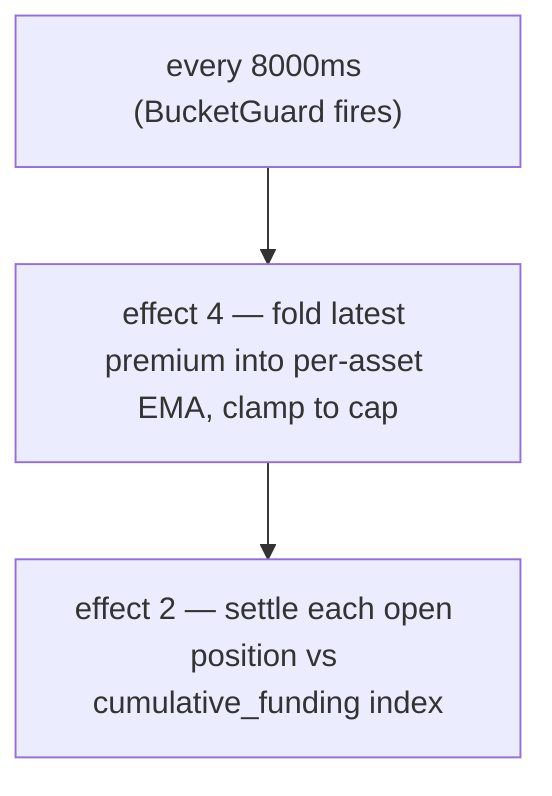

# Tasas de financiamiento

:::tip
**Estable.**
:::

## Resumen

Las posiciones en contratos perpetuos acumulan un pago de financiamiento continuo (liquidado cada **8 s** en cadena) proporcional a la **prima del perpetuo sobre el oráculo** — medida desde el **precio de impacto** ponderado por profundidad, no desde una sola operación — más un pequeño término de **interés** base. Los largos pagan a los cortos cuando el perpetuo cotiza por encima del oráculo; los cortos pagan a los largos cuando cotiza por debajo. El resultado está limitado a un máximo predeterminado por mercado de **`±4% / hora`**, y se liquida contra el **oráculo**.

## Por qué existe el financiamiento

Los perpetuos no tienen vencimiento, por lo que no existe una fuerza de arbitraje que los ancle al subyacente. El financiamiento cumple esa función: cuando el precio del perpetuo se desvía por encima del precio al contado, los largos pagan, lo que incentiva posiciones cortas y desincentiva las largas hasta que el perpetuo vuelve a converger. El protocolo nunca toma ninguno de los dos lados — es entre usuarios.

## Fórmula

> El resumen anterior es el modelo conceptual. Los números a continuación son los valores **implementados**. Cuando el texto y el código difieren, el código tiene preferencia; las diferencias se señalan en línea.

### Cómo se calcula

El financiamiento está impulsado por una **EMA determinista** de la prima (precio de impacto − oráculo), liquidada cada **8 segundos**, no por hora. El límite es del **4% / hora**, no del 0,05%.

Dos efectos de inicio de bloque ejecutan el ciclo, cada uno protegido por un `BucketGuard` de 8000 ms:

- **efecto 4 `update_funding_rates`** — incorpora la última muestra de prima a la EMA por activo y aplica el límite.
- **efecto 2 `distribute_funding`** — liquida cada posición abierta contra el índice de financiamiento acumulado.

#### 0. Base de la prima — el precio de impacto (no la última operación)

La **muestra de prima por bloque** es la diferencia entre el **precio de impacto** del perpetuo y el oráculo:

```
premium = (impact_mid − oracle) / oracle
impact_mid = mid( impact_bid, impact_ask )
impact_bid/ask = VWAP de recorrer el libro comprometido para ejecutar un nocional fijo (predeterminado ~$10k)
```

Usar el precio de *impacto* — el precio ponderado por volumen para ejecutar una orden real — en lugar de la última operación o la mejor cotización significa que una sola ejecución, o una orden mínima a un precio absurdo, **no puede** mover el financiamiento: es necesario mover profundidad genuina. Esto refleja el diseño de referencia de los perpetuos. (Un modo heredado por mercado en su lugar muestrea `premium = (mark − oracle)/oracle`; los mercados nuevos y migrados usan la base de impacto anterior.)

#### 1. EMA del índice de prima (por mercado)

La prima se suaviza mediante una **EMA determinista** (el *índice de prima*). El acumulador almacena una fracción de punto fijo `(num, denom)` — sin números flotantes, aritmética exacta `rust_decimal::Decimal` para que el estado entre nodos sea bit a bit idéntico. Cada muestra se incorpora así:

```
num'   = num   * decay + sample
denom' = denom * decay + 1
value  = num / denom
```

- `sample` = última prima del activo × el `funding_rate_multiplier` por activo (predeterminado `1.0`; controlado automáticamente por el motor de riesgo dinámico).
- `decay = 0.5` (valor predeterminado propuesto → ≈ 7 s de vida media a la cadencia de muestra de 5 s). Limitado a `[0, 1]` en el momento de actualización.
- Cadencia de muestreo: **5 s**; cadencia de incorporación a EMA y liquidación: **8000 ms** (`funding_update_guard` / `funding_distribute_guard`).

> **Estado:** el ciclo completo de financiamiento está **activo** de extremo a extremo. Cada período de 8 s el controlador de tasa muestrea la prima del estado comprometido (la prima de impacto versus oráculo anterior, una muestra por mercado de perpetuos), la incorpora a la EMA del índice de prima por activo, deriva la tasa (interés + límite), la limita, y luego la liquidación avanza el índice de financiamiento acumulado y mueve `size × Δindex` entre los saldos de los titulares de posiciones (suma cero: los largos pagan a los cortos o viceversa, sin emisión/quema) — todo desde el estado de mercado comprometido, sin alimentador de prima externo. Con pruebas de conservación y determinismo mediante fuzzing, y un entorno de 4 nodos de extremo a extremo que verifica divergencia → prima → EMA → índice → transferencia de saldo.

#### 2. Tasa a partir del índice de prima (interés + límite)

La tasa de financiamiento **no** es el índice de prima sin procesar. El índice suavizado `premium_idx` se combina con un término de **interés** base mediante un límite por paso:

```
interest = 0.0000125 / h        # = 0.01% / 8h — el carry base
clamp    = ±0.0005              # límite por paso

funding = premium_idx + clamp( interest − premium_idx, −clamp, +clamp )
```

Cuando el índice de prima es pequeño, el financiamiento se acerca a la línea base de `interest`; cuando la prima es grande, el término `premium_idx` domina y el límite controla con qué fuerza el interés lo corrige en cada paso. Tanto `interest` como `clamp` son parámetros que la gobernanza puede modificar por activo. (El modo heredado por mercado en su lugar lee el valor de la EMA directamente como la tasa, sin transformación de interés/límite.)

#### 3. Límite exterior

`funding` se limita finalmente al máximo por hora:

```
cap_per_hour = 0.04          # 4 %/h predeterminado
funding = clamp(funding, −cap_per_hour, +cap_per_hour)
```

El límite es un parámetro de gobernanza por mercado: un `dynamic_risk_overrides[asset].funding_rate_cap` reemplaza el valor predeterminado `0.04` cuando está configurado.

#### 4. Pago (por posición, por liquidación)

El financiamiento se acumula en un índice acumulado por mercado (`clearinghouse.cumulative_funding`); cada posición lleva su último índice liquidado (`funding_entry`). En la liquidación:

```
payment = size_signed * oracle_px * (cum_global - funding_entry) * funding_rate_multiplier[asset]
funding_entry := cum_global      # avanzar
```

(La aritmética está cableada y bloqueada por determinismo; la transferencia de saldo real se procesa con la liquidación BOLE completa.)

| Símbolo | Significado / plano |
|--------|-----------------|
| `size_signed` | Tamaño de posición con signo; `i128`. Largo > 0, corto < 0. |
| `oracle_px` | Precio del oráculo compuesto — plano `Decimal` de USDC entero (ver [precios mark](./mark-prices.md)). |
| `cum_global − funding_entry` | Financiamiento acumulado para este mercado desde la última liquidación de la posición. |
| `decay` | Decaimiento de la EMA 0.5. |
| `cap_per_hour` | Predeterminado `0.04` (4 %/h); anulación por mercado mediante riesgo dinámico. |
| `funding_rate_multiplier` | Multiplicador por activo, predeterminado `1.0`, controlado automáticamente por riesgo dinámico. |

`funding_rate` (el valor de la EMA) tiene signo: positivo → los largos pagan a los cortos; negativo → los cortos pagan a los largos.

**Interés base:** `0.0000125/h` (= `0.01%/8h`) — el carry base al que se suma la EMA de la prima.

> ⚠️ **Corrección respecto al texto anterior.** El texto antiguo decía "cada hora", "ventana EMA de 60 minutos" y "límite 0,05 %/hora". La implementación liquida cada **8 s**, el `decay` de la EMA es **0,5** (≈ 7 s de vida media) y el límite es **4 %/hora**. El modelo mental por hora es válido para cálculos aproximados de carry, pero la cadencia en cadena y el límite son los indicados anteriormente.

## Cadencia de pago

El financiamiento se liquida **cada 8 segundos** (el intervalo `funding_distribute_guard`), impulsado por marcas de tiempo de bloque derivadas por consenso — no por horas de reloj de pared. Las posiciones se liquidan contra el índice de financiamiento acumulado, por lo que una posición abierta a mediados de un intervalo solo paga la acumulación desde que se abrió (sin paso de "instantánea a la hora").



Los pagos se liquidan como ajustes de saldo — sin operación en cadena, sin comisión. Aparecen en el historial del usuario con `kind: "funding"`.

## Bloqueo cuando el oráculo no es de confianza

El financiamiento **se liquida contra el oráculo**, por lo que un precio en el que el protocolo no confía no debe generar un pago. Cada período la muestra de prima está *bloqueada*: se omite (se muestrea como **0**) cuando:

- el **oráculo falta o es ≤ 0** para el mercado, o
- el **oráculo está desactualizado** más allá de `funding_oracle_staleness_ms` (predeterminado **60 s**), o
- el **libro es demasiado delgado** para ejecutar el nocional de impacto en ambos lados (sin precio de impacto).

Una muestra omitida se incorpora como 0, por lo que la EMA del índice de prima **decae hacia 0** y la tasa de financiamiento se desvanece en lugar de liquidarse sobre una base desactualizada o manipulable. (Ver también [casos límite](#casos-límite).)

:::info
**Por eso puede verse una gran brecha mark↔oráculo con financiamiento ≈ 0.** Si el feed del oráculo de un mercado está roto o no es de confianza, el financiamiento se bloquea y decae a 0 — incluso mientras el [mark](./mark-prices.md#mark-vs-oracle--why-they-diverge) (que se construye a partir del libro y de perpetuos externos) se encuentra lejos del último oráculo válido. Una brecha amplia con financiamiento ~0 es el protocolo *negándose a cobrar financiamiento sobre un oráculo defectuoso*, no un error de financiamiento.
:::

## Ejemplo práctico

Mercado: perpetuo BTC, estado actual (plano del oráculo en USDC entero):

```
mark         = 100.50
oracle       = 100.00
premium      = mark - oracle = 0.50
EMA(premium) settles toward 0.50 with decay 0.5 over a few 5s samples
funding cap  = 4% / hour (default)
```

Supongamos que el valor de la EMA resulta en una tasa de financiamiento de `+0.0005` (0,05%) para el intervalo (muy por debajo del límite de 4%/h). Posiciones de la cuenta:

```
long 1 BTC      → pays funding
short 0.5 BTC   → receives funding
```

```
funding_rate = clamp(ema_value, -0.04, +0.04) = +0.0005   (not capped — far below 4%/h)

long 1 BTC:
  payment = +1   * oracle_px * Δcum  ≈ +1   * 100.00 * 0.0005 = +0.0500 USDC  (long pays)

short 0.5 BTC:
  payment = -0.5 * oracle_px * Δcum  ≈ -0.5 * 100.00 * 0.0005 = -0.0250 USDC  (short receives 0.0250)
```

(El pago utiliza `size_signed * oracle_px * (cum_global - funding_entry)`; aquí `Δcum` es el financiamiento acumulado desde la última liquidación de la posición.) Liquidado cada 8 s, la magnitud por intervalo es mínima; el límite solo importa para un desequilibrio unilateral sostenido, donde 4%/h es el techo.

## Límites de financiamiento y límites dinámicos

| Parámetro | Predeterminado | Fuente / anulación |
|-----------|---------|-------------------|
| límite de financiamiento (por hora) | `0.04` (`4 %/h`) | `dynamic_risk_overrides[asset].funding_rate_cap` (votación de gobernanza) |
| `decay` de la EMA | `0.5` (≈ 7 s de vida media) | Propuesto; la calibración puede ajustarse a 0.3/0.7 |
| cadencia de muestreo | `5 s` | fijado por protocolo |
| intervalo de liquidación / actualización | `8000 ms` | `funding_distribute_guard` / `funding_update_guard` BucketGuards |
| interés base | `0.0000125/h` (`0.01 %/8h`) | fijado por protocolo |
| `funding_rate_multiplier` | `1.0` | por activo, controlado automáticamente por riesgo dinámico |

El `funding_rate_multiplier` por activo es la mejora de MTF sobre el valor estático de gobernanza de HL: se controla automáticamente a partir de la volatilidad realizada en 30 días por el motor de riesgo dinámico, escalando la muestra de prima antes de que entre en la EMA.

## Historial de financiamiento

Historial por cuenta mediante [`POST /info user_fills`](../api/rest/info.md) — los pagos de financiamiento aparecen con `kind: "funding"` y el activo correspondiente.

Historial por mercado:

```bash
curl -X POST https://api.devnet.mtf.exchange/info \
  -H 'content-type: application/json' \
  -d '{"type":"funding_history","market_id":0}'
```

Devuelve el anillo ordenado de muestras `(ts_ms, premium)` (ver
[`funding_history`](../api/rest/info/perpetuals.md#funding_history)):

```json
{
  "type": "funding_history",
  "data": {
    "market_id": 0,
    "samples": [
      { "ts_ms": 1700000000000, "premium": "0.0015" },
      { "ts_ms": 1700000008000, "premium": "-0.0007" }
    ]
  }
}
```

Un canal WS dedicado `fundingTicks` está en el [roadmap de WS](../api/ws/subscriptions.md#roadmap--not-yet-available); mientras tanto, consulte [`funding_history`](../api/rest/info/perpetuals.md#funding_history) mediante polling.

## Lo que el financiamiento no hace

- **Sin relación con las comisiones.** El financiamiento es entre usuarios; las comisiones son reembolsos de maker/taker al venue. Ver [comisiones](./fees.md).
- **Sin interés sobre el colateral.** El saldo en USDC no genera intereses por financiamiento. El financiamiento tiene como único propósito cerrar la brecha mark-oráculo.
- **No predecible en ventanas largas.** El financiamiento puede cambiar de signo hora a hora. No lo modele como un carry constante.

## Casos límite

<details>
<summary>Mostrar casos límite</summary>

- **La posición se abre a mitad de intervalo.** No existe **instantánea por hora** — el financiamiento se acumula en un índice continuo, y una posición solo paga el movimiento del índice desde su última liquidación. Abrir justo después de una liquidación significa pagar casi nada en ese período; no hay un acantilado de "dentro/fuera de la instantánea".
- **La posición se cierra a mitad de intervalo.** Lo mismo — la posición liquida su acumulación a la fecha al cerrarse; sin redondeo de período parcial en ningún sentido.
- **Régimen negativo.** Un mercado con el perpetuo persistentemente por debajo del oráculo (los cortos pagan a los largos) tiene `funding_rate` negativo durante períodos sostenidos; los largos reciben financiamiento.
- **Oráculo desactualizado / libro delgado.** La muestra de prima se bloquea en 0 y la tasa decae hacia 0 — ver [Bloqueo](#bloqueo-cuando-el-oráculo-no-es-de-confianza). El financiamiento no se liquida sobre un oráculo no confiable.

</details>

## Ver también

- [Precios mark](./mark-prices.md) — cómo se deriva el `oracle`
- [Liquidación escalonada](./tiered-liquidation.md) — los pagos de financiamiento ajustan `account_value`, lo que afecta `health`
- [Canal WS `fundingTicks` (roadmap)](../api/ws/subscriptions.md#roadmap--not-yet-available)
- [Comisiones](./fees.md) — separadas del financiamiento

## Preguntas frecuentes

<details>
<summary>Mostrar preguntas frecuentes</summary>

**P: ¿El financiamiento es igual que en un CEX?**
R: El modelo mental es el mismo. La mayoría de los CEX pagan cada 8 horas; MetaFlux liquida cada 8 segundos (el intervalo `funding_distribute_guard`), por lo que el impacto por pago es mínimo y el carry es más estable. El límite de 4%/h es lo que acota una tasa unilateral sostenida.

**P: ¿Puede el financiamiento forzar mi liquidación?**
R: Sí — un pago de financiamiento reduce `account_value`. Las liquidaciones son cada 8 s en incrementos mínimos (sin gran débito por hora), pero una tasa unilateral sostenida cerca del límite igual erosiona `account_value` con el tiempo y puede empujarlo desde la banda T0 a T1. Vigile `health` si su posición es grande y la tasa persiste en su contra.

**P: ¿El financiamiento aplica a posiciones al contado?**
R: No. El financiamiento es un mecanismo exclusivo de los contratos perpetuos. Las posiciones al contado no acumulan carry.

**P: ¿Los ingresos por financiamiento son gravables?**
R: Esa no es una pregunta del protocolo. Consulte a los asesores fiscales de su jurisdicción.

</details>
