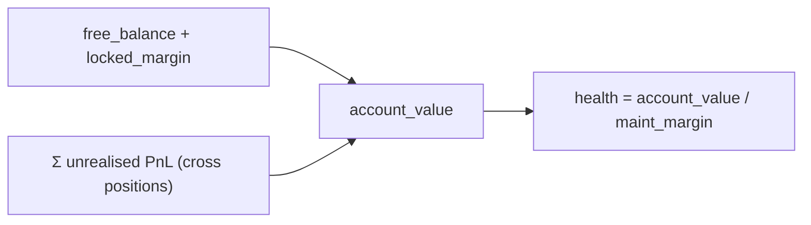
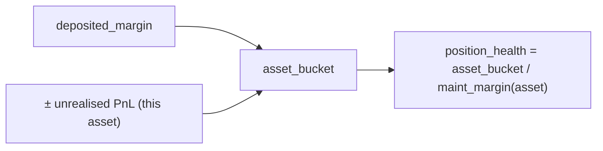
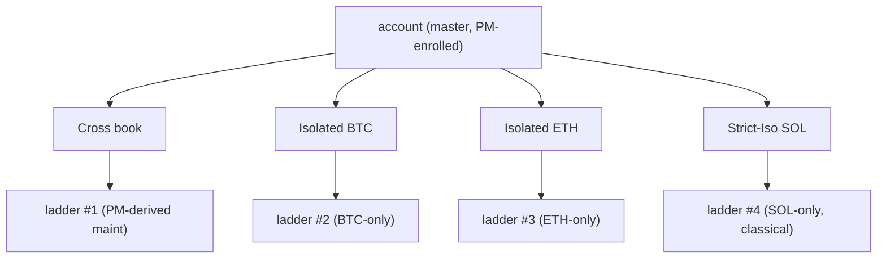
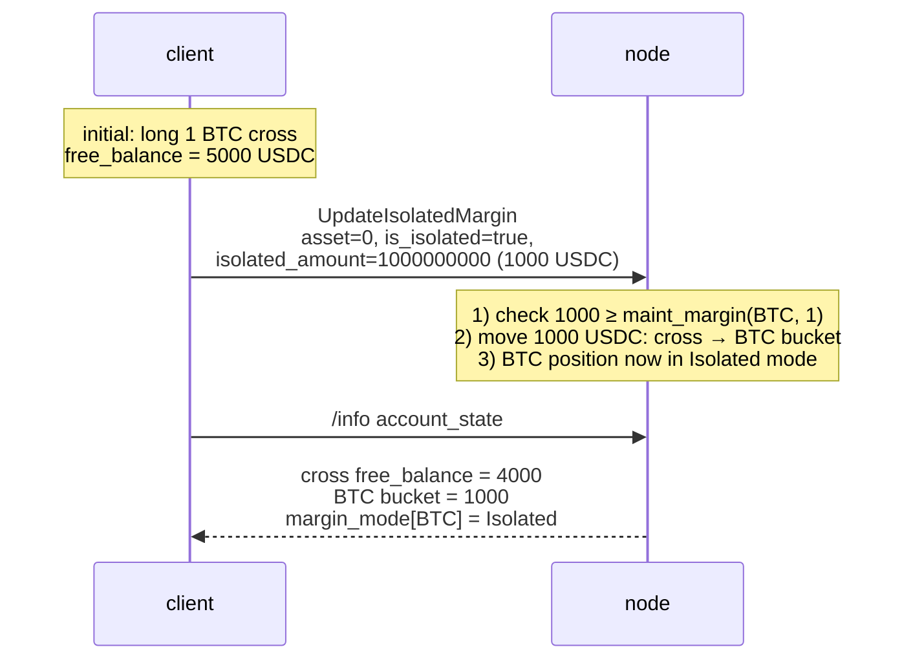

# Modos de margen

:::tip
**Estable.**
:::

## TL;DR

Tres modos por activo: **Cross**, **Isolated**, **Strict-Iso**. Cross agrupa el colateral en todas tus posiciones; Isolated aísla el margen por activo; Strict-Iso excluye adicionalmente ese activo de cualquier compensación de [margen de cartera](./portfolio-margin.md).

## Comparación

| Modo | Fuente de colateral | Las pérdidas pueden afectar | Elegible para PM | Aislamiento de liquidación |
|------|---------------------|-----------------------------|------------------|---------------------------|
| **Cross** | Saldo libre, a nivel de cuenta | Otras posiciones | Sí | Escalera de cuenta completa |
| **Isolated** | Depósito reservado por activo | Solo ese depósito | No | Escalera por activo; pérdida máxima = depósito |
| **Strict-Iso** | Depósito reservado por activo | Solo ese depósito | No (excluido incluso cuando el maestro está inscrito en PM) | Escalera por activo |

En Cross, las posiciones rentables pueden sostener a las menos saludables — tu saldo libre es fungible en toda la cuenta. En Isolated, el colapso de un activo queda contenido en el depósito de ese activo.

## Cómo se calcula el margen

> Todos los importes están en el **plano `Decimal` de USDC entero** (nocional, colateral, margen), no en el plano del libro 1e8 — consulta [precios de marca: dos planos de precios](./mark-prices.md#two-price-planes-read-this-before-reading-any-number).

### Margen inicial (control previo a la operación)

Una orden que abre nueva exposición debe depositar margen inicial:

```
notional        = |px × size|                         # raw integer product, Decimal scale-0
effective_lev   = dynamic_risk_override.max_leverage   # if set, else position cap, else MAX_LEVERAGE_CAP (50)
required_init    = ceil( notional / effective_lev )    # rounded UP — conservative
free_collateral  = cross_account_value − Σ held_initial_margin
reject  iff  required_init > free_collateral            # InsufficientMargin
```

Por tanto, `init_margin = notional / max_leverage` — la ratio clásica `1 / max_leverage`. `effective_lev` es `max(1, …)`; el límite global es `MAX_LEVERAGE_CAP = 50`, con un techo duro `UpdateLeverage` de **100×** y anulaciones de riesgo dinámico por activo que pueden restringirlo. El redondeo es **hacia arriba** (`Decimal::ceil`), de modo que cualquier resto siempre endurece el control. Las órdenes `reduce_only` omiten este control (solo reducen la exposición).

`held_initial_margin` suma `ceil(|entry_notional| / effective_lev(asset))` sobre cada posición abierta en modo **cross** (las posiciones aisladas se excluyen — su colateral es el depósito reservado por separado).

### Margen de mantenimiento y salud

```
health = account_value / maint_margin
```

- `account_value` = `cross_account_value` (saldo libre ± PnL no realizado), con signo `i128`.
- `maint_margin` = la suma sobre cada tramo de posición abierta de `|entry_notional| × maint_margin_ratio` (derivado en tiempo real de las posiciones) **o** el número de PM cuando el [margen de cartera](./portfolio-margin.md) está activo (`last_computed_pm_cents / 100`).

La ratio de mantenimiento por activo es la anulación de riesgo dinámico del mercado cuando el gobierno ha establecido una, o de lo contrario la línea base del protocolo de **300 bps = 3 %**. El umbral de deslizamiento por cierre forzado derivado es la mitad de la ratio efectiva (1,5 % para un mercado de línea base), salvo que se anule explícitamente.

El mantenimiento está por debajo del requerimiento inicial (`notional / max_leverage`), de modo que una posición puede abrirse y descender hasta el umbral de mantenimiento antes de ser liquidada. Salud < 1,0 entra en la [escalera de liquidación](./tiered-liquidation.md) en los niveles de banda (1,1 / 1,0 / 0,8 / 0,667).

> La aritmética usa `Decimal` / `i128` en todo momento (sin punto flotante); la decisión de nivel incluso desplaza a la derecha ambos operandos por una cantidad común antes de la división `Decimal` cuando un valor de cuenta superaría `Decimal::MAX`, preservando la ratio de salud para que la decisión de nivel no se vea afectada.

## Cross — el modo predeterminado



`maint_margin` es la suma de los requerimientos de mantenimiento por posición (o el número de PM si el [margen de cartera](./portfolio-margin.md) está activo).

Implicación: un movimiento adverso del 10 % en BTC reduce la salud global de la cuenta, aunque tu posición en ETH esté bien. Puedes sostener la posición en BTC cerrando la ganadora en ETH.

## Isolated

:::warning
**Brecha de implementación.** El modelo conceptual que se describe a continuación es el **comportamiento objetivo**.
El control de margen previo a la operación actualmente implementa **solo la ruta Cross / colateral agrupado** — la ruta de negociación abre todas las posiciones en cross. El campo `margin_mode` de la posición (0 = cross, 1 = isolated) ya se lee para *excluir* las posiciones aisladas de la suma de margen retenido en cross, pero aún no está implementada la puerta de margen pre-operación dedicada al modo isolated (que verificaría el `isolated_margin` publicado de la orden frente a su nocional).
:::

Cuando activas `is_isolated: true` para un activo, el protocolo mueve `isolated_amount` USDC del saldo cross a un depósito por posición. La ganancia/pérdida de esa posición se liquida únicamente en el depósito:



Si `position_health` cae en un nivel de liquidación, se activa la escalera **por posición**. El resto de la cuenta no se ve afectado.

Puedes depositar o retirar del depósito mientras la posición está abierta:

```json
// add 500 USDC to the isolated bucket on asset 0
{ "type":"UpdateIsolatedMargin", "params": {
  "asset": 0, "is_isolated": true, "isolated_amount": "500000000"
}}
```

`isolated_amount` puede ser **positivo** (mover de cross → depósito) o **negativo** (retirar depósito → cross). Se rechaza cualquier retiro que empujaría la posición a un nivel menos favorable.

## Strict-Iso

Mismo aislamiento que Isolated, más una exclusión explícita del motor de escenarios de PM. Incluso si tu maestro está inscrito en margen de cartera, una posición Strict-Iso:

- NO contribuye al motor de escenarios cross
- NO recibe crédito de compensación
- Se margina bajo el modelo **clásico** (línea base por activo)

Usa Strict-Iso para:
- Activos nuevos / ilíquidos donde los supuestos de correlación de PM no aplican
- Presupuesto especulativo que quieres aislar de tu libro central cubierto
- Listados (MIP-3) donde la ratio de mantenimiento es conservadora hasta que la liquidez madure

## Cuándo usar cada modo

| Objetivo | Modo |
|----------|------|
| Maximizar la eficiencia del capital en un libro coherente | Cross (+ PM) |
| Ejecutar varias estrategias no correlacionadas bajo una misma cuenta | Isolated por estrategia, O subcuentas |
| Contener una posición de riesgo para que no amenace el resto | Isolated o Strict-Iso |
| Cubrir entre activos y obtener crédito de compensación | Cross + PM |
| Operar un listado de cola larga con régimen de volatilidad desconocido | Strict-Iso |

Para el aislamiento de múltiples estrategias, las [subcuentas](./sub-accounts.md) suelen ser una mejor opción que Isolated — las subcuentas aíslan la cuenta completa, incluidas las claves de agente y el espacio de órdenes, no solo el margen.

## Transiciones

Para cambiar de modo se utiliza la acción [`update_isolated_margin`](../api/rest/exchange.md#update_isolated_margin) (la flag `is_isolated` — no existe una acción separada para el modo de margen), y solo se permite cuando:

| De → A | Permitido cuando |
|--------|-----------------|
| Cross → Isolated | Especificas `isolated_amount` que cubre al menos el margen de mantenimiento |
| Isolated → Cross | El depósito se fusiona con el saldo cross; permitido en cualquier momento en que la cuenta fusionada permanezca en el nivel `Safe` |
| Isolated → Strict-Iso | Siempre (sin movimiento de margen) |
| Strict-Iso → Isolated | Siempre |
| Strict-Iso/Isolated → Cross (bajo maestro inscrito en PM) | Requiere que la posición encaje en el conjunto de escenarios de PM |

Cambiar de modo con una posición abierta **no** implica cerrar y reabrir — la posición permanece, solo cambia la contabilidad del margen.

## Comportamiento en la liquidación

La escalera de [liquidación por niveles](./tiered-liquidation.md) se aplica de forma independiente por alcance:

- **Cross**: una escalera para toda la cuenta
- **Isolated**: una escalera por activo aislado
- **Strict-Iso**: una escalera por activo en Strict-Iso

Un nivel T1 Cross cierra posiciones del libro cross de forma proporcional a su contribución al mantenimiento. Un nivel T1 Isolated cierra únicamente la posición aislada. El respaldo T3 y el ADL T4 son por alcance — un colapso aislado no recupera de los ganadores cross.



## Secuencia — cambio de cross → isolated



## Casos límite

<details>
<summary>Mostrar casos límite</summary>

- **Depósito automático al agregar margen.** Las posiciones Isolated cubren el déficit de mantenimiento únicamente con el depósito — cuando el depósito se agota, la posición se liquida. Cross NO cubre automáticamente un depósito Isolated; debes usar `UpdateIsolatedMargin` manualmente con `isolated_amount` positivo para recargar el depósito.
- **Cerrar una posición Isolated.** Al cerrar la posición completa, el depósito se libera de vuelta al saldo cross.
- **Modo de un activo nuevo.** Las nuevas posiciones tienen Cross como valor predeterminado, a menos que la flag `meta` del activo `onlyIsolated: true` fuerce el modo Isolated (configurado por mercado en el momento del despliegue mediante [MIP-3](../mip/mip-3.md)).
- **Isolated bajo maestro PM.** El crédito de compensación de PM aplica solo a las posiciones Cross. Las posiciones Isolated se suman de forma clásica. Un maestro inscrito en PM con una posición Isolated grande y un libro Cross pequeño obtiene casi ningún beneficio de PM.

</details>

## Ver también

- [Margen de cartera](./portfolio-margin.md) — matemáticas de PM frente al modelo clásico
- [Liquidación por niveles](./tiered-liquidation.md) — escaleras por alcance
- [Subcuentas](./sub-accounts.md) — aislamiento completo a nivel de cuenta
- [`update_isolated_margin`](../api/rest/exchange.md#update_isolated_margin) — el modo de margen es la flag `is_isolated` aquí; no existe una acción separada para el modo de margen

## Preguntas frecuentes

<details>
<summary>Mostrar preguntas frecuentes</summary>

**P: ¿Puede un activo tener depósitos tanto Isolated como Strict-Iso?**
R: No. El modo es por activo y de valor único: `Cross | Isolated | StrictIso`.

**P: ¿Cambiar de modo tiene algún coste en forma de operación?**
R: Sin comisiones ni ejecuciones. Es una transición de estado pura.

**P: ¿Qué ocurre si agoto un depósito Isolated por debajo del mantenimiento?**
R: Se activa la escalera de liquidación de ese activo. El resto de tu cuenta no se ve afectado.

**P: ¿El desapalancamiento automático (ADL) es por alcance o para toda la cuenta?**
R: Por alcance. El ADL en una posición Isolated solo recupera de las contrapartes de *ese* activo, no de tu libro Cross ni de otras posiciones Isolated.

</details>
