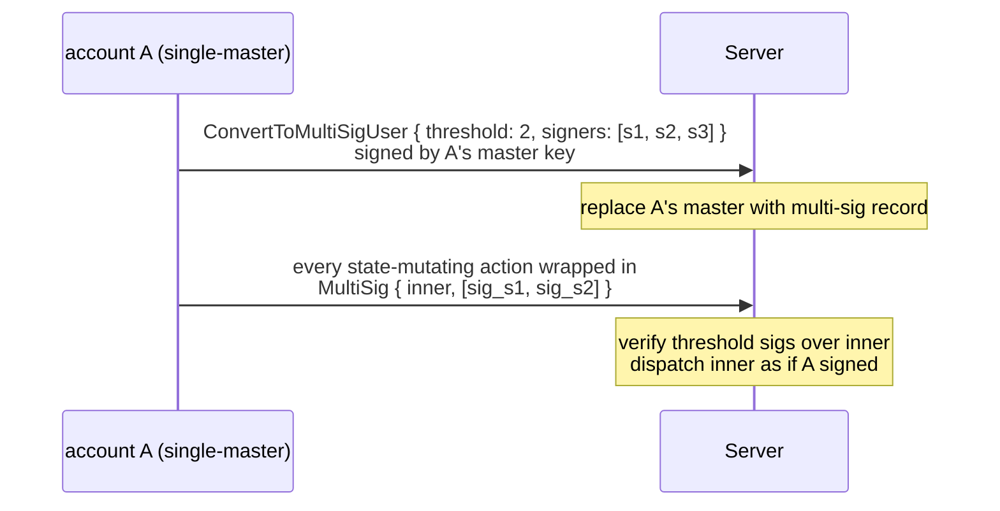
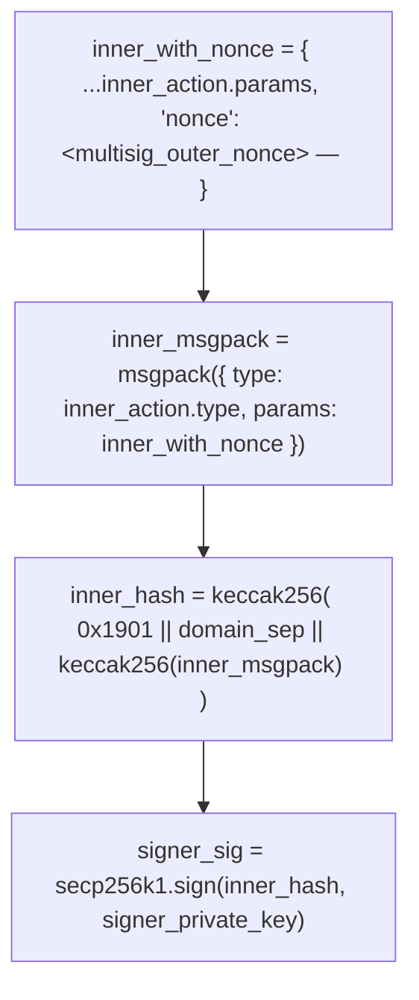

# Cuentas multi-firma

:::info
**Vista previa.**
:::

## Resumen

Convierte una cuenta regular en una multi-firma M-de-N: la clave maestra se reemplaza por un conjunto de firmantes, toda acción que modifique el estado debe reunir `threshold` firmas de `signers`, y la conversión es **irreversible**. Diseñada para custodia institucional, tesorerías de DAO y mesas de trading de control compartido.

## Por qué usar multi-firma

Las cuentas regulares tienen una única clave maestra. Perderla equivale a perderlo todo. La multi-firma distribuye el riesgo de custodia entre los firmantes:

- 2-de-3: cualquiera de los dos de los tres firmantes puede actuar; se puede perder uno sin bloquear la cuenta.
- 3-de-5: se requieren 3 firmas; se toleran hasta 2 claves perdidas; hasta 2 claves comprometidas no pueden mover fondos.

Este es el mismo primitivo que sustenta cada configuración de Gnosis Safe / autocustodia institucional, implementado de forma nativa en la capa de protocolo en lugar de a través de un contrato inteligente.

## Ciclo de vida



## Conversión

```json
{
  "type": "ConvertToMultiSigUser",
  "params": {
    "threshold": 2,
    "signers": [ "0x...s1", "0x...s2", "0x...s3" ]
  }
}
```

Firmado por la clave maestra **actual** (firma individual, la última firma en solitario que realiza esta cuenta).

| Restricción | Valor |
|------------|-------|
| `threshold` | `[1, len(signers)]` |
| `len(signers)` | `[2, 16]` |
| `signers[*]` | direcciones distintas |

Tras la confirmación:
- Se almacenan `is_multisig: true` y `multisig_set: { threshold, signers }` en la cuenta.
- Las acciones directas posteriores (no envueltas) firmadas por cualquiera (incluida la antigua clave maestra) son rechazadas con `{"error":"account is multisig"}`.

**Irreversible**: no existe `RevertFromMultiSig`. El conjunto de firmantes puede **actualizarse** mediante un `UpdateMultiSig` envuelto en multi-firma (ver más abajo), pero no es posible volver a la clave maestra única.

## Operar como multi-firma

Envuelve cada acción en `MultiSig`:

```json
{
  "sender":    "0x<multisig_addr>",
  "signature": "0x<any_signer_sig>",   ← outer envelope signed by any one signer
  "action": {
    "type": "MultiSig",
    "params": {
      "inner_action": {
        "type": "Order",
        "params": { ... }
      },
      "signatures": [
        { "signer": "0x...s1", "signature": "0x<sig over inner>" },
        { "signer": "0x...s2", "signature": "0x<sig over inner>" }
      ],
      "nonce": 1735689600099
    }
  }
}
```

Verificaciones del servidor:

1. La firma del sobre externo se recupera como uno de los `signers` (cualquier firma individual del conjunto).
2. Cada `signatures[*].signature` se recupera como `signatures[*].signer`.
3. Los firmantes recuperados pertenecen todos a `signers`, son distintos y su número es ≥ `threshold`.
4. Cada firma interna cubre el **msgpack canónico de `inner_action` con el `nonce` del envoltorio**, encapsulada en el sobre EIP-712 idéntico al de una acción regular.

Si alguna verificación falla: `{"error":"multisig threshold not met"}` o `{"error":"multisig duplicate signer"}` o `{"error":"signer not in set"}`.

Si todas las verificaciones pasan: la acción interna se despacha como si `sender` la hubiera firmado directamente.

### Firmar la acción interna

Cada firmante calcula:



El paquete envoltorio se construye fuera de la cadena (un coordinador reúne las firmas) y lo envía cualquier firmante.

## Actualizar el conjunto de firmantes

```json
{
  "type": "UpdateMultiSig",
  "params": {
    "threshold": 3,
    "signers":   [ "0x...s1", "0x...s2", "0x...s4", "0x...s5", "0x...s6" ]
  }
}
```

Envuelto en `MultiSig`, requiere `threshold` firmas del conjunto **actual**. Entra en vigor en el siguiente bloque; a partir de entonces el nuevo conjunto es el vigente.

Úsalo para:
- Rotar claves comprometidas
- Agregar o eliminar firmantes
- Cambiar `threshold` (p. ej., pasar de 2-de-3 a 3-de-5 a medida que la mesa crece)

## Coordinación fuera de la cadena

El protocolo no incluye el flujo multi-firma — los firmantes necesitan un canal fuera de banda para compartir el mensaje a firmar y reunir las firmas. Patrones habituales:

| Patrón | Mecanismo |
|---------|-----------|
| Servicio coordinador interno | La cartera de cada firmante consulta una bandeja de entrada compartida; serializa la acción interna; firma; sube la firma; el coordinador envía cuando se alcanza el umbral |
| Canal privado compartido | Chat de grupo cifrado / correo electrónico; cada firmante pega su firma; un firmante las agrega y envía |
| SDK multi-firma (planificado) | El SDK oficial incluirá un flujo de recopilación de firmas que oculta la capa de coordinación |

Hasta que el SDK esté disponible, los integradores deben implementar su propio coordinador. La parte en cadena no cambia — solo importan las firmas.

## Compatibilidad con subcuentas y agentes

| Pregunta | Respuesta |
|----------|--------|
| ¿Una cuenta multi-firma puede tener subcuentas? | Sí. `CreateSubAccount` es en sí misma una acción envuelta en multi-firma. Cada subcuenta hereda el requisito de firma multi-firma. |
| ¿Una cuenta multi-firma puede aprobar carteras de agente? | Sí. `ApproveAgent` se envuelve en multi-firma. Una vez aprobado, el agente puede firmar con normalidad **sin** requerir más recopilación de firmas multi-firma — la firma del agente por sí sola es suficiente para las acciones que tiene permitido realizar. Esta es la configuración institucional típica: la multi-firma gestiona la autoridad de retirada y la administración de agentes; un agente ejecuta el flujo de trading diario. |
| ¿Puede la propia cuenta multi-firma actuar como agente para otra cuenta? | Sí — las cuentas multi-firma pueden aprobarse como agentes. Las otras cuentas que las aprueban llaman a `ApproveAgent { agent: <multisig_addr> }`. El conjunto de firmantes de la multi-firma firma según sea necesario. |

## Casos extremos

<details>
<summary>Mostrar casos extremos</summary>

- **Claves perdidas**: M-de-N tolera hasta `N - M` pérdidas. Planifica la custodia de claves para distribuir la superficie de pérdida (diferentes jurisdicciones, diferentes HSM, diferentes personas).
- **Clave comprometida**: M-de-N tolera hasta `M - 1` compromisos antes de que los fondos puedan moverse. Detéctalo pronto — configura alertas de monitoreo de tasas en `userEvents` para la cuenta multi-firma.
- **Colisiones de nonce**: el nonce de la multi-firma es por cuenta, monótono, igual que en la firma individual. Si dos esfuerzos de firma paralelos eligen el mismo nonce, solo uno se confirma; el otro devuelve `{"error":"nonce_too_small"}`. El coordinador debe asignar los nonces.
- **Caducidad de firmas**: las firmas no caducan por sí solas — una firma recopilada hoy es válida hasta que se envíe el paquete. Algunos integradores añaden su propio TTL fuera de la cadena.

</details>

## Consulta

```bash
curl -X POST https://devnet-gateway.mtf.exchange/info \
  -d '{"type":"user_to_multi_sig_signers","user":"0x<multisig>"}'
```

```json
{
  "type": "user_to_multi_sig_signers",
  "data": {
    "address":      "0x<multisig>",
    "is_multi_sig": true,
    "threshold":    2,
    "signers":      ["0x...", "0x...", "0x..."]
  }
}
```

`is_multi_sig` es `false` (y `signers` está vacío) para una cuenta ordinaria. El conjunto
de firmantes y el umbral provienen directamente de la configuración confirmada en `multi_sig_tracker`.

## Secuencia — orden multi-firma

```mermaid
sequenceDiagram
    participant S1 as signer s1
    participant S2 as signer s2
    participant C as coordinator
    participant Chain as chain
    Note over S1: T-1 prepares inner_action = Order{...}<br/>computes inner_hash — signs → sig_s1
    S1->>C: sends inner_action + sig_s1 to coordinator
    Note over S2: T-2 receives inner_action via coordinator<br/>verifies inner_hash — signs → sig_s2
    S2->>C: sends sig_s2 to coordinator
    Note over C: T-3 coordinator (any signer or service):<br/>assembles MultiSig{ inner_action, signatures: [sig_s1, sig_s2], nonce }<br/>wraps in outer envelope — signs outer with own key
    C->>Chain: POST /exchange
    Note over Chain: T-4 chain admits:<br/>verify outer sig<br/>verify both inner sigs ≥ threshold(2)<br/>dispatch Order → admit to mempool
    Chain-->>C: return 202
    Note over Chain: T+commit inner Order applied — orderEvents fires;<br/>multi-sig account now has the new resting order
```

## Véase también

- [`POST /exchange convert_to_multi_sig_user`](../api/rest/exchange.md#convert_to_multi_sig_user)
- [Semántica de firma en `/exchange`](../api/rest/exchange.md#signed-by-semantics) — sobre envoltorio multi-firma
- [Carteras de agente](./agent-wallets.md) — combina multi-firma con delegación de agentes
- [Subcuentas](./sub-accounts.md) — las cuentas multi-firma pueden tener subcuentas

## Preguntas frecuentes

<details>
<summary>Mostrar preguntas frecuentes</summary>

**P: ¿Puedo usar 1-de-N (firma "cualquiera")?**
R: Sí — `threshold: 1`. Útil para redundancia sin coordinación. Funcionalmente equivalente a tener N cuentas separadas con autoridad de retirada compartida, pero más económico en cadena.

**P: ¿Se pueden reutilizar las firmas de la acción interna en distintas acciones internas?**
R: No. Cada firma cubre una acción interna específica y un nonce concreto. Intentar reutilizar una firma en una acción interna diferente devuelve `{"error":"multisig threshold not met"}`.

**P: ¿El envoltorio multi-firma es recursivo?**
R: No. `MultiSig { inner_action: MultiSig { ... } }` es rechazado. Solo se permite una capa.

**P: ¿Puede una multi-firma envolver a otra `MultiSig`? (Meta-pregunta.)**
R: Igual que arriba — la recursión está bloqueada. Para actuar como multi-firma en nombre de otra multi-firma, la cuenta exterior aprueba la multi-firma interior como agente.

</details>
