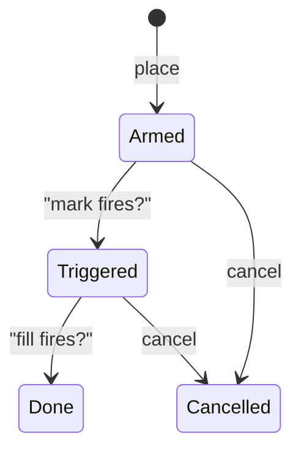
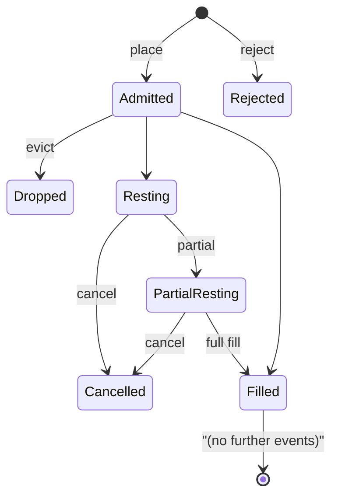

# Tipos de orden

:::tip
**Estable.**
:::

## Resumen

MetaFlux admite una gama completa de órdenes primitivas — límite, IOC, ALO, FOK, mercado, stop-loss, take-profit, límites con disparador, TWAP, escalonadas y reduce-only — además de modos de prevención de autooperación (STP) que controlan el emparejamiento contra tus propias órdenes. Cada variante utiliza la estructura `POST /exchange { type: "Order", ... }`; los flujos especializados como TWAP y Scale emplean sus propias variantes de acción.

## Validez temporal (Time-in-Force)

| TIF | Comportamiento | Cuándo usarla |
|-----|----------------|---------------|
| `Gtc` | Good-till-cancelled (vigente hasta cancelación). Permanece en el libro hasta ser ejecutada o cancelada. | Por defecto; creación pasiva de liquidez, cotización persistente |
| `Ioc` | Immediate-or-cancel (inmediata o cancelada). Ejecuta lo disponible y cancela el resto sin ejecutar. | Tomar liquidez al instante; no deseas quedar en el libro |
| `Alo` | Add-limit-only ("solo publicar"). Si alguna parte cruzaría el libro, la orden completa se cancela. | Maker estricto; garantiza no pagar nunca la comisión de taker |
| `Fok` | Fill-or-kill (ejecutar o cancelar). Ejecuta la totalidad del tamaño de inmediato o cancela todo. | Ejecución atómica en un único nivel de precio |

```
Buy 1 BTC @ 100.5 Gtc      →  rests on book, fills as ask reaches 100.5 or lower
Buy 1 BTC @ 100.5 Ioc      →  immediately matches asks ≤ 100.5; cancels rest
Buy 1 BTC @ 100.5 Alo      →  IF any ask ≤ 100.5  THEN reject  ELSE rest
Buy 1 BTC @ 100.5 Fok      →  IF total ≥ 1.0 @ ≤ 100.5  THEN fill  ELSE reject
```

## Reduce-only

`reduce_only: true` rechaza la orden en la admisión si ejecutarla **aumentaría** el tamaño absoluto de la posición. Es útil para salidas de protección — un stop-loss reduce-only no puede invertir accidentalmente una posición larga a corta.

```
position: long 1 BTC
sell 0.5 reduce_only=true   →  ok (closes 0.5 of long)
sell 2.0 reduce_only=true   →  rejected: would flip to short 1
buy  0.5 reduce_only=true   →  rejected: would grow long to 1.5
```

La validación reduce-only se evalúa **en la confirmación**, no en la admisión, leyendo la posición desde el estado confirmado más reciente. Un llenado concurrente que cierre tu posición entre la admisión y el despacho puede generar un error de confirmación `reduce_only_violation_post_admit` (consulta [errores](../api/errors.md#commit-time-errors-not-http-in-event-stream)).

## Prevención de autooperación (STP)

Si una nueva orden coincidiría con una orden existente del mismo `sender`, se activa el mecanismo STP.

| Modo STP | Cuando la nueva cruza la antigua | Cuando ambas están al mismo precio |
|----------|----------------------------------|-------------------------------------|
| `None` | Operación permitida | Ambas permanecen en el libro |
| `CancelNewest` | Se cancela la nueva | Se cancela la nueva |
| `CancelOldest` | Se cancela la antigua; la nueva puede emparejarse en otro punto | Se cancela la antigua; la nueva permanece |
| `CancelBoth` | Ambas canceladas | Ambas canceladas |
| `DecrementAndCancel` | Empareja por `min(nueva, antigua)`; cancela la menor; la mayor conserva el resto | Igual — empareja y luego cancela la menor |

Ejemplo práctico — `DecrementAndCancel`:

```
your resting bid:  buy 1 BTC @ 100.5  (oid 1)
you place sell:    sell 0.4 BTC @ 100.5  (oid 2)  with stp=DecrementAndCancel

result:
  - oid 1 is decremented to 0.6 BTC remaining
  - oid 2 is cancelled (smaller order)
  - no trade fires (no fee, no fill event)
  - your position is unchanged
```

El STP se aplica en el paso de emparejamiento, por lo que funciona entre lados del activo, precio y tiempo. Solo considera órdenes firmadas por el mismo `sender` — las órdenes de agentes bajo el mismo master también cuentan.

## Disparadores (Triggers)

Una **orden con disparador** es una condición en espera que, al cumplirse, lanza una orden interior al libro.

| Tipo de disparador | Se activa cuando | Orden interior |
|--------------------|-----------------|----------------|
| `StopLoss` | El precio mark cruza `trigger_px` en dirección "segura" → "pérdida" | Mercado o límite; reduce-only habitual |
| `TakeProfit` | El precio mark cruza `trigger_px` en dirección "pérdida" → "beneficio" | Mercado o límite; reduce-only habitual |
| `StopLimit` | Igual que `StopLoss` | Solo orden límite interior |
| `TakeProfitLimit` | Igual que `TakeProfit` | Solo orden límite interior |

Para una posición larga:
- `StopLoss` se activa cuando `mark ≤ trigger_px` (la caída del precio recorta la posición larga)
- `TakeProfit` se activa cuando `mark ≥ trigger_px` (la subida del precio materializa el beneficio)

Para una posición corta, las desigualdades se invierten.

`limit_px`:
- `null` → lanza una orden de mercado (`Ioc`) en el momento del disparo
- presente → lanza una orden límite en `limit_px`

Máquina de estados del disparador:



Los disparadores se evalúan en cada actualización del precio mark (en cada confirmación). Persisten entre bloques y tras reinicios.

## Agrupación

`Order { grouping: ... }` agrupa tramos en una familia.

| Agrupación | Significado |
|------------|-------------|
| `Na` | Órdenes independientes |
| `NormalTpsl` | Dos órdenes: una entrada + una de {StopLoss, TakeProfit}. Ejecutar una cancela la otra (OCO). |
| `PositionTpsl` | Dos órdenes con disparador vinculadas a la **posición**, no a la orden de entrada. Sobreviven a cambios en la posición (p. ej., promediado) y solo se cancelan cuando la posición se cierra. |

Usa `PositionTpsl` para "quiero siempre un stop en mi posición neta" — el mismo TPSL permanece activo mientras añades o reduces la posición.

## Órdenes escalonadas (Scale Orders)

`ScaleOrder` coloca una escalera de órdenes límite.

```json
{
  "type": "ScaleOrder",
  "params": {
    "asset": 0, "side": "Buy",
    "total_size": "1000000000",
    "start_price": "9900000000",
    "end_price":   "9800000000",
    "n_levels": 10,
    "shape": "Flat"
  }
}
```

Formas:

| Forma | Distribución del tamaño entre tramos |
|-------|--------------------------------------|
| `Flat` | Igual por tramo |
| `Linear` | Rampa lineal de un extremo al otro |
| `Geometric` | Rampa geométrica (menor cerca del spread, mayor lejos) |

Cada tramo recibe un `cloid` asignado automáticamente derivado de `cloid_prefix + leg_index`. Cancela toda la escalera cancelando cada tramo, o usa [`cancel_by_cloid`](../api/rest/exchange.md#cancel_by_cloid) con la expansión del prefijo.

## TWAP

`TwapOrder` programa fracciones durante `duration_ms`.

```
duration = 1 hour = 3,600,000 ms
slices   = duration / SLICE_INTERVAL  (default 60s slice; 60 slices per hour)
sz_per_slice = size / slices

slice  1: send IOC near mid at t = randomize(0, SLICE_INTERVAL * (1 + jitter%))
slice  2: send IOC at t = slice_1_t + SLICE_INTERVAL * (1 + jitter%)
...
slice 60: send last IOC just before t = duration
```

`randomize_pct` ∈ `[0, 50]` aleatorizan los tiempos de cada fracción en ±`randomize_pct/100 × slice_interval`. Un valor mayor dificulta la detección; un valor menor proporciona mayor control temporal.

Las fracciones las envía el protocolo; el cliente no debe hacer nada tras enviar el `TwapOrder`. Los eventos de fracción se transmiten por el [canal WS `userEvents`](../api/ws/subscriptions.md#userevents) (un canal `twap*` dedicado está en la hoja de ruta).

El TWAP se puede cancelar a mitad de ejecución mediante `TwapCancel`; las fracciones ya ejecutadas permanecen, y las futuras se detienen.

## Órdenes de mercado

No existe una acción de "mercado" diferenciada — una "orden de mercado" es una orden `Ioc` límite a un precio extremo (`MAX_PRICE` para compras, `0` para ventas). Los SDK hacen esto por ti cuando llamas a `marketBuy(...)`. El libro empareja contra la liquidez disponible; el resto sin cruzar se cancela.

Advertencia: TODAS las órdenes de mercado están sujetas a la **banda de precio mark** — si la mejor oferta de venta está un 5% por encima del mark, tu orden de compra de mercado ejecutará la liquidez disponible hasta `mark × (1 + band_pct)` y cancelará el resto. Consulta [precios mark](./mark-prices.md).

## Máquina de estados del ciclo de vida de una orden



Cada transición de estado emite el evento correspondiente en [`userEvents`](../api/ws/subscriptions.md#userevents) (los eventos del ciclo de vida de órdenes se transmiten por este canal).

## Casos límite

<details>
<summary>Mostrar casos límite</summary>

- **Carrera reduce-only con llenado.** El stop es reduce-only; un llenado cierra la posición; el stop se dispara; la verificación en la confirmación falla con `reduce_only_violation_post_admit`. Solución: conecta los eventos `userFills` a tu bot para cancelar los brackets al cerrar completamente.
- **STP en admisión vs. en emparejamiento.** El STP solo se aplica en el paso de emparejamiento. Dos órdenes de lados opuestos que no se crucen permanecerán en el libro. El STP solo se activa cuando realmente fueran a operar.
- **TWAP en alta volatilidad.** Cada fracción es una IOC cerca del mid — si la liquidez desaparece entre fracciones, estas pueden quedar sin ejecutar completamente. Monitoriza los eventos de fracción.
- **ALO + libro cruzado.** Una ALO que cruzaría *cualquier* nivel es rechazada íntegramente, no parcialmente. Para entrar en el libro a un precio ajustado, usa una orden límite sin cruce un tick peor que el mejor opuesto.
- **Disparador y TIF.** Un `StopLoss` con `limit_px` definido descansa en el libro como orden Gtc límite al dispararse. Añade manualmente un spray similar a TWAP si quieres una salida fraccionada.

</details>

## Ejemplos — TypeScript

```typescript
// limit buy, GTC, post-only
await client.order({
  asset: 0, side: 'Buy', priceE8: '10050000000', sizeE8: '100000000',
  tif: 'Alo', reduceOnly: false, stpMode: 'CancelNewest'
});

// stop-loss attached to a long position
await client.trigger({
  asset: 0, side: 'Sell', sizeE8: '100000000',
  triggerPxE8: '9500000000', limitPxE8: null,
  triggerKind: 'StopLoss', reduceOnly: true
});

// 1-hour TWAP buy
await client.twap({
  asset: 0, side: 'Buy', sizeE8: '1000000000',
  durationMs: 3_600_000, randomizePct: 20, reduceOnly: false
});

// 10-level scale buy
await client.scale({
  asset: 0, side: 'Buy',
  totalSizeE8: '1000000000',
  startPriceE8: '9900000000',
  endPriceE8: '9800000000',
  nLevels: 10, shape: 'Linear'
});
```

## Véase también

- [`POST /exchange`](../api/rest/exchange.md) — esquemas completos por variante
- [Modos de margen](./margin-modes.md)
- [Precios mark](./mark-prices.md) — cómo se activan los disparadores
- [Liquidación por tramos](./tiered-liquidation.md) — gestión de posiciones bajo estrés

## Preguntas frecuentes

<details>
<summary>Mostrar preguntas frecuentes</summary>

**P: ¿Una orden ALO paga alguna vez la comisión de taker?**
R: Nunca. Si fuera a cruzar, la orden completa se rechaza en la admisión — no hay taker parcial.

**P: ¿Puede una única acción `Order` mezclar TIFs?**
R: Sí. `orders: []` es heterogéneo; cada entrada tiene su propio `tif`.

**P: ¿Cómo desempata el motor de emparejamiento a igual precio?**
R: FIFO estricto — gana el `oid` más antiguo. Las órdenes ALO obtienen prioridad al estar primero en el libro; esa es su ventaja natural de rebate de comisión.

**P: ¿Las fracciones de TWAP cuentan contra mi límite de tasa?**
R: No — las envía internamente el protocolo, no tu cliente. Enviar el `TwapOrder` supone un único cargo de límite de tasa.

</details>
