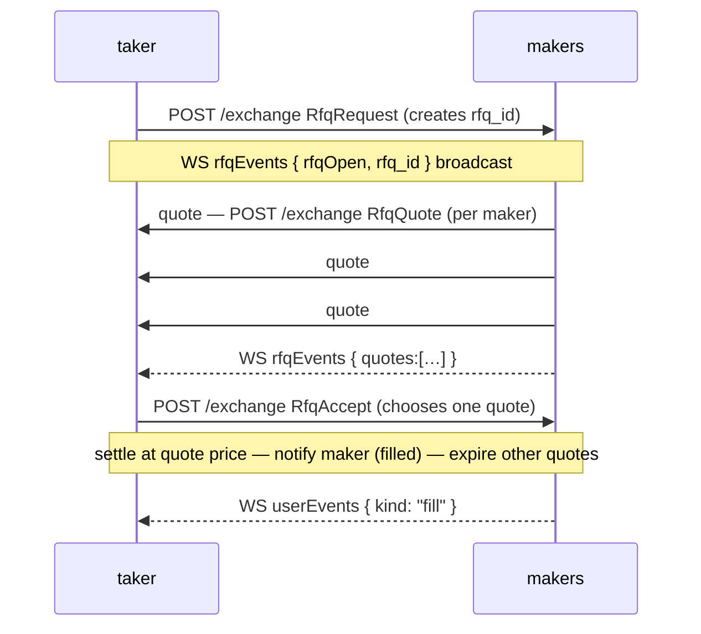
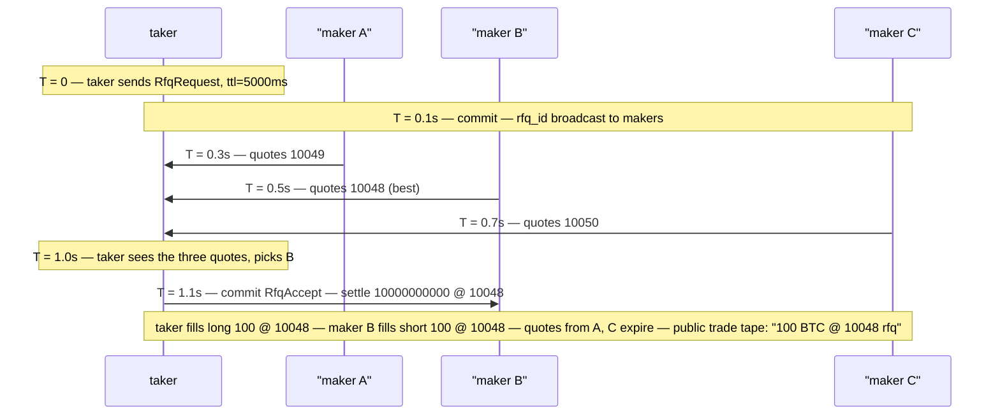

# Solicitud de cotización (RFQ)

:::info
**Vista previa.**
:::

## Resumen

RFQ permite que un tomador solicite una cotización privada para un tamaño específico a un conjunto de creadores de mercado registrados, acepte la mejor oferta y liquide a ese precio — sin exponer el tamaño en el libro público primero. Es útil para órdenes de gran tamaño que moverían el libro visible.

## Por qué usar RFQ

La ejecución en el CLOB público revela la intención. Una orden de $5 M en un activo con poca liquidez lo señala todo antes de que se complete el primer llenado. RFQ invierte el modelo:

- El **tomador** publica un RFQ con activo, dirección, tamaño y precio de referencia opcional.
- Los **creadores** (registrados y activos para el activo) responden con cotizaciones dentro de una ventana (típicamente 1–5 segundos).
- El **tomador** acepta la mejor cotización → liquidación atómica a ese precio; el resto de las cotizaciones expiran.

Las cotizaciones son visibles únicamente para el tomador (no en el libro público). Los demás participantes ven la operación ex-post en el [feed WS `trades`](../api/ws/subscriptions.md#trades) con la etiqueta `kind: "rfq"`.

## Ciclo de vida



## Flujo de acciones

### Tomador — solicitar un RFQ

`RfqRequest` (variante de acción; estructura análoga a [`submit_order`](../api/rest/exchange.md#submit_order)):

```json
{
  "type": "RfqRequest",
  "params": {
    "asset":          0,
    "side":           "Buy",
    "size":        "10000000000",
    "reference_px":"10050000000",
    "max_slippage_bps": 50,
    "ttl_ms":         5000
  }
}
```

| Campo | Significado |
|-------|-------------|
| `reference_px` | Precio de referencia del tomador (habitualmente el precio de marca público); los creadores lo usan para anclar sus cotizaciones |
| `max_slippage_bps` | Límite superior de desviación de precio respecto a la referencia; las cotizaciones fuera del rango son descartadas |
| `ttl_ms` | Tiempo que el RFQ permanece abierto antes de expirar automáticamente |

Respuesta:

```json
{ "accepted": true, "rfq_id": "0x<16 bytes>" }
```

El RFQ se difunde a los creadores activos a través del [canal WS `userEvents`](../api/ws/subscriptions.md#userevents) (un stream dedicado `rfq*` está en la hoja de ruta).

### Creador — enviar una cotización

`RfqQuote`:

```json
{
  "type": "RfqQuote",
  "params": {
    "rfq_id":       "0x<...>",
    "px":     "10049000000",
    "size":      "10000000000",
    "expires_at_ms":1735690000000
  }
}
```

Un creador puede enviar múltiples cotizaciones (por ejemplo, llenados parciales a distintos precios) durante la vigencia del RFQ. Cada `RfqQuote` es una acción independiente y recibe su propio `quote_id`.

### Tomador — aceptar

`RfqAccept`:

```json
{
  "type": "RfqAccept",
  "params": { "rfq_id": "0x<...>", "quote_id": "0x<...>" }
}
```

La liquidación es atómica en el siguiente bloque:
- La posición del tomador aumenta en `size` al precio `px`.
- La posición del creador aumenta en `size` en la dirección contraria al mismo precio.
- Las demás cotizaciones para este `rfq_id` expiran.
- Estructura de comisiones: mismos niveles de creador/tomador que un llenado en el libro público ([comisiones](./fees.md)).

### Expiración automática

Cuando `ttl_ms` transcurre sin una aceptación:

```json
{ "kind": "rfqExpired", "rfq_id": "0x<...>" }
```

Sin cargo; todas las cotizaciones enviadas son descartadas.

## Registro de creadores

Para poder cotizar en un activo, un creador se registra mediante `RfqRegister`:

```json
{
  "type": "RfqRegister",
  "params": { "asset": 0, "active": true, "min_size": "1000000000" }
}
```

`min_size` permite a los creadores ignorar RFQs de tamaño pequeño que no deseen recibir. Para darse de baja, usar `active: false`.

Los creadores registrados reciben las difusiones de RFQ en `rfqEvents`. No están **obligados** a cotizar — la participación es voluntaria por cada RFQ.

## Semántica de liquidación

| Propiedad | Llenado por RFQ |
|-----------|----------------|
| Precio | `px` de la cotización, independientemente del libro público |
| Contraparte | Un único creador (el firmante de la cotización elegida) |
| Impacto en el libro | Ninguno — la operación no cruza contra órdenes en reposo |
| Visibilidad pública | La cinta de operaciones muestra el llenado ex-post, etiquetado como `rfq` |
| Comisiones | Creador/tomador estándar según el baremo de comisiones |
| Margen | Igual que un llenado regular (`init_margin` debitado en ambas partes) |
| Liquidación | Igual — la posición se convierte en una posición regular tras la liquidación |

## Qué no hace el RFQ

- **No omite el margen.** El tomador debe tener margen suficiente para la posición; la falta de margen devuelve un `422` estándar.
- **No oculta la operación ex-post.** La operación se publica en el feed público de operaciones tras la liquidación, con la etiqueta `rfq`.
- **No es una subasta holandesa.** Las cotizaciones no decaen; los creadores envían cotizaciones a precio fijo y el tomador elige una.
- **No es un llenado multi-creador.** Una aceptación de RFQ cruza con la cotización de un único creador en su totalidad. Para dividir entre creadores, enviar múltiples RFQs.

## Consultar RFQs abiertos

El estado del motor RFQ se expone en la ruta de lectura `/info` del nodo mediante dos tipos de consulta — véase [`rfq_open`](../api/rest/info.md#rfq_open) y [`rfq_user`](../api/rest/info.md#rfq_user) para los esquemas de respuesta completos y las tablas de campos. `size` / `price` / `max_size` / `limit_px` son cadenas de enteros en **punto fijo 1e8** (el plano de libro/órdenes).

`rfq_open` no requiere **parámetros** y devuelve todos los RFQs abiertos junto con sus cotizaciones de creadores:

```bash
curl -X POST https://devnet-gateway.mtf.exchange/info \
  -H 'content-type: application/json' \
  -d '{"type":"rfq_open"}'
```

Para los RFQs en los que una cuenta específica participa, `rfq_user` acepta `account_id` (u64) o `address` (hex 0x) y divide el resultado en `requested` (RFQs abiertos por la cuenta) y `quoted` (RFQs en los que cotizó):

```bash
curl -X POST https://devnet-gateway.mtf.exchange/info \
  -H 'content-type: application/json' \
  -d '{"type":"rfq_user","address":"0x..."}'
```

Una cuenta que no participa en ningún RFQ devuelve un 200 con ambas listas vacías.

## Casos límite

<details>
<summary>Mostrar casos límite</summary>

- **Múltiples cotizaciones del mismo creador.** Permitido; el tomador elige la mejor.
- **La cotización del creador llega después de que el tomador acepta.** La cotización se descarta silenciosamente; sin error.
- **El RFQ expira mientras el tomador está firmando la aceptación.** La aceptación devuelve `{"error":"rfq expired"}`. Reintentar con un nuevo `RfqRequest`.
- **La cuenta del tomador no es elegible en el momento de la aceptación.** Si la cuenta del tomador pasa a T1+ entre la solicitud y la aceptación, esta se rechaza. El creador conserva el derecho a cotizar en futuros RFQs.
- **Margen insuficiente del creador en el momento de la aceptación.** La aceptación es rechazada con `{"error":"maker margin"}`. El tomador puede intentar otra cotización del mismo RFQ.

</details>

## Secuencia — RFQ aceptado



## Véase también

- [Tipos de órdenes](./order-types.md) — alternativas en el libro público
- [Catálogo de acciones `/exchange`](../api/rest/exchange.md#action-catalog) — `RfqQuote` / `RfqAccept` (stubs actualmente reconocidos pero sin mapeo)
- [WS `userEvents`](../api/ws/subscriptions.md#userevents) — los eventos RFQ circulan por este canal
- [Comisiones](./fees.md) — los llenados por RFQ tributan al nivel estándar

## Preguntas frecuentes

<details>
<summary>Mostrar preguntas frecuentes</summary>

**P: ¿Por qué no colocar simplemente una orden oculta en el libro?**
R: Las órdenes ocultas siguen revelando información a través de los llenados. El RFQ no publica nada — el tamaño es invisible hasta la liquidación.

**P: ¿Se pueden cancelar las cotizaciones RFQ?**
R: Sí — `RfqCancelQuote { quote_id }`. Útil cuando el riesgo del creador cambia durante el RFQ.

**P: ¿Hay algún algoritmo de cruce exclusivo para llenados RFQ que deba conocer?**
R: No — una vez que el tomador acepta, la liquidación es directa entre el tomador y el creador elegido. El motor CLOB no interviene.

**P: ¿Puede existir un mercado RFQ en un mercado con poca liquidez en el CLOB?**
R: Sí — los creadores registrados pueden cotizar en cualquier mercado, independientemente de la profundidad del libro. El RFQ es especialmente útil para activos con poca liquidez o de cola larga, donde el libro público no puede absorber grandes tamaños.

</details>
