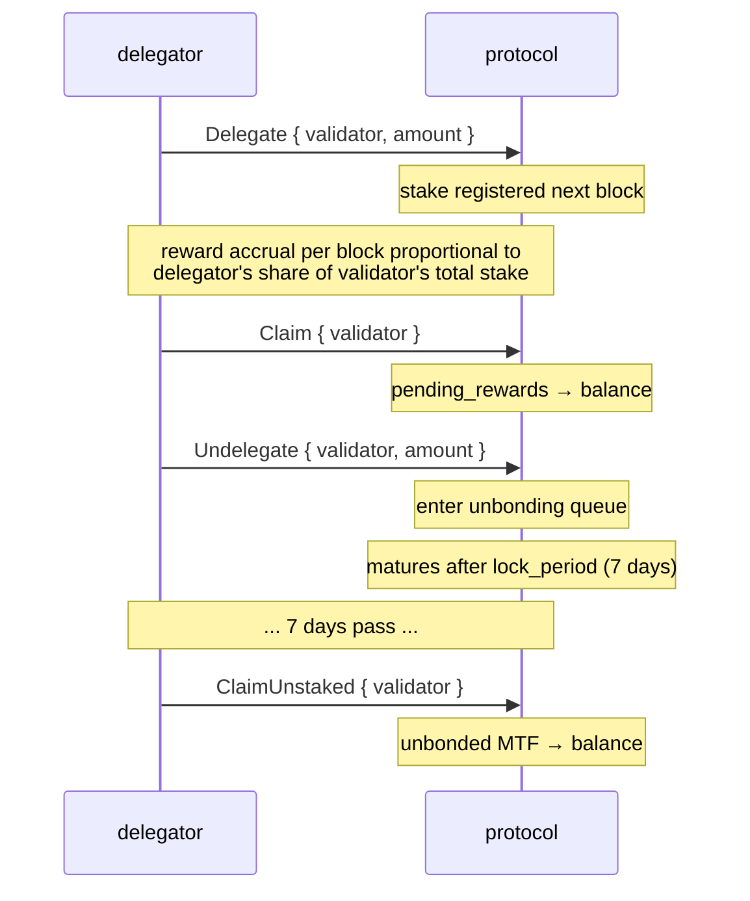
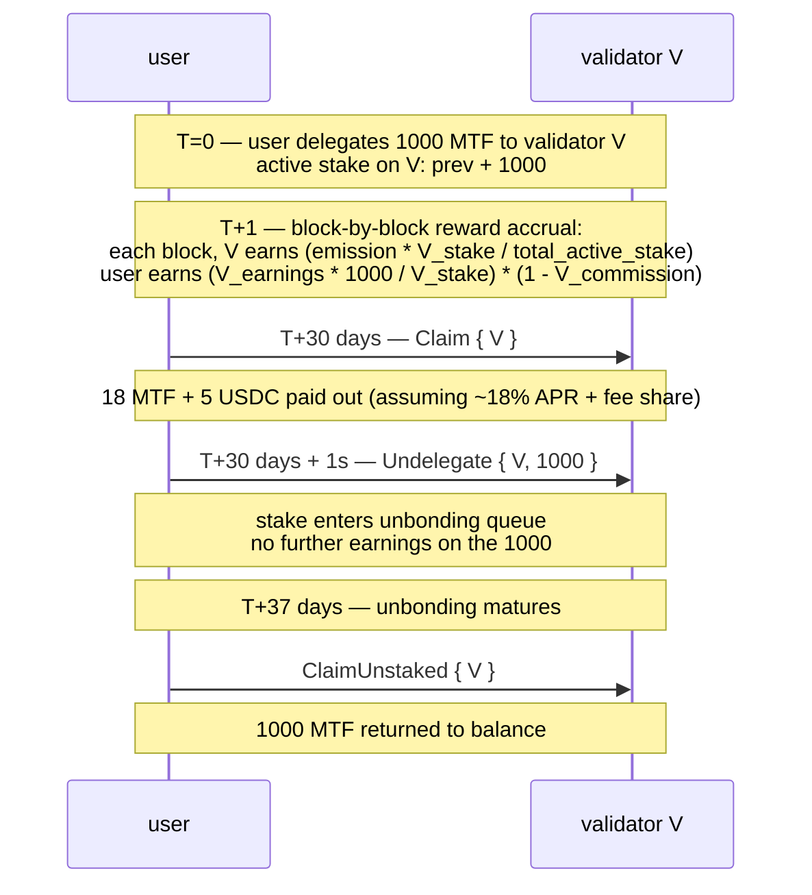

# Staking

:::info
**Activo en devnet.** La delegación, la desvinculación, la reclamación de recompensas y el registro de validadores están activos y verificados de extremo a extremo en el consenso de la devnet de 4 nodos.
:::

## TL;DR

Mantén MTF, delega a un validador y obtén emisiones del protocolo más una parte de los ingresos por comisiones. El stake es líquido hasta el `lock_period`; el unstake tarda `7 days` en liberarse por completo. El slashing se aplica a los validadores que incumplan las reglas; los delegadores asumen una exposición parcial al slash.

## Actores

| Rol | Descripción |
|------|-------------|
| **Validador** | Ejecuta un nodo de consenso, propone bloques y vota. Debe auto-vincular un monto superior a `min_self_bond` (por defecto 100k MTF). |
| **Delegador** | Mantiene MTF, elige un validador y obtiene recompensas descontando la comisión del validador. |
| **Protocolo** | Emite recompensas por bloque; las distribuye proporcionalmente al stake. |

## Flujo de staking



## Acciones

### `Delegate`

```json
{
  "type": "Delegate",
  "params": { "validator": "0x<val_addr>", "amount": "10000000000" }
}
```

Mueve MTF del saldo al pool de delegación del validador. Efectivo en el siguiente bloque. Comienza a generar recompensas a partir de entonces.

### `Undelegate`

```json
{
  "type": "Undelegate",
  "params": { "validator": "0x<val_addr>", "amount": "10000000000" }
}
```

Retira del stake activo; entra en la cola de desvinculación. No genera recompensas durante la desvinculación. Madura en `now + lock_period_ms`.

### `Redelegate`

```json
{
  "type": "Redelegate",
  "params": { "from": "0x<val1>", "to": "0x<val2>", "amount": "10000000000" }
}
```

Mueve el stake entre validadores **sin** entrar en la cola de desvinculación. Limitado a una redelegación por par `(from, to)` dentro de una ventana de 24 h (protección anti-cambios bruscos).

### `Claim`

```json
{
  "type": "Claim",
  "params": { "validator": "0x<val_addr>" }
}
```

Transfiere las recompensas acumuladas de `pending_rewards` al saldo de MTF del delegador. Sin efecto si el saldo pendiente es cero.

La reclamación automática **no** es automática — reclamar periódicamente (a diario o semanalmente) o antes de modificar la delegación.

### `ClaimUnstaked`

```json
{
  "type": "ClaimUnstaked",
  "params": { "validator": "0x<val_addr>" }
}
```

Transfiere las desvinculaciones que han madurado (cuyo período de bloqueo ha expirado) de vuelta al saldo de MTF. Es idempotente.

## Fuentes de recompensas

| Fuente | Cadencia | Parte |
|--------|---------|-------|
| Emisión del protocolo | Por bloque | `emission_per_block × stake_share × (1 - validator_commission)` |
| Ingresos por comisiones (tesorería → stakers) | Por época | `treasury_inflow × staker_share × stake_share × (1 - commission)` |

`emission_per_block`: definido por gobernanza; valor actual en la consulta `staking_state`.
`staker_share` de la tesorería: definido por gobernanza, valor predeterminado `50%`.
`validator_commission`: por validador, limitado al `20%` por gobernanza.

Las recompensas se calculan en MTF (emisiones) y USDC (ingresos por comisiones) — la reclamación devuelve ambas. `staking_state` muestra los importes pendientes en cada divisa.

## Período de bloqueo

Por defecto: **7 days** para el unstaking. Ajustable por gobernanza por pool de stake.

| Estado | Duración | ¿Genera recompensas? | ¿Sujeto a slash? |
|-------|----------|:--------------------:|:----------------:|
| Activo (delegado) | indefinida | sí | sí |
| En desvinculación | `lock_period_ms` | no | sí (hasta la maduración) |
| Desvinculado (en cola de reclamación) | hasta que se reclame | no | no |

La exposición al slash durante la desvinculación es el punto crítico — un validador que recibe un slash mientras hay desvinculaciones en curso arrastra a esos delegadores, aunque ya hayan señalado su salida.

## Slashing

Los validadores reciben slash por:

| Infracción | Slash | Penalización al delegador |
|---------|-------|--------------------------|
| Doble firma (firmó dos bloques conflictivos a la misma altura) | 5% del stake + encarcelamiento | 5% de la delegación perdido a prorrata |
| Tiempo de inactividad (perdió `downtime_blocks` turnos consecutivos de proponente) | 0.1% del stake + encarcelamiento | 0.1% perdido a prorrata |
| Voto en una bifurcación inválida | 5% + eliminación permanente | 5% a prorrata |

Los delegadores que sufren un slash ven reducido su `delegation.amount` en el bloque del slash. Sin previo aviso — el slashing es derivado del consenso.

Medidas de mitigación:
- Elegir validadores bien gestionados (historial de disponibilidad, estabilidad en la comisión).
- Diversificar entre validadores (un slash a un único validador solo afecta a esa porción).
- Evitar validadores cercanos a `min_self_bond` (mayor probabilidad de salida desordenada).

## Selección de validador

```bash
curl -X POST https://devnet-gateway.mtf.exchange/info -d '{"type":"validator_summaries"}'
```

Devuelve el conjunto activo de validadores (`{epoch, total_stake, n_active, validators[]}`);
cada entrada contiene:

```json
{
  "validator":          "0x<val>",
  "signer":             "0x<signer>",
  "validator_index":    3,
  "stake":              "10000000000000",
  "self_stake":         "100000000000",
  "commission_bps":     500,
  "is_active":          true,
  "is_jailed":          false,
  "first_active_epoch": 12
}
```

Criterios de selección:
- **Comisión** (`commission_bps`): menor → mayor APR neto. Atención a las tácticas de cebo y cambio (subidas de comisión).
- **Auto-stake** (`self_stake`): mayor → el operador tiene más en juego.
- **Estado de encarcelamiento** (`is_jailed`): un validador actualmente encarcelado no genera recompensas hasta que sea liberado.
- **Activo** (`is_active`): solo los validadores con `is_active: true` forman parte del conjunto de firmas en vivo.

## Estimación del APR

El tipo de consulta [`staking_apr`](../api/rest/info.md#staking_apr) de `/info` está **activo en tiempo real** —
devuelve el APR de emisión efectivo que aplica el efecto de recompensa del begin-block,
junto con sus valores de entrada confirmados:

```bash
curl -X POST https://devnet-gateway.mtf.exchange/info -d '{"type":"staking_apr"}'
```

```json
{
  "type": "staking_apr",
  "data": {
    "total_stake":             "1000000",
    "effective_apr":           "0.08",
    "effective_apr_bps":       "800",
    "governance_rate_bps":     800,
    "emission_floor_stake":    "50000000",
    "n_active_validators":     1,
    "current_epoch":           2,
    "is_gross_pre_commission": true
  }
}
```

`effective_apr` se deriva de la **curva de stake**, no de la tasa de gobernanza:

```text
effective_apr = 0.08 × √( 50M / max(total_stake, 50M) )
```

Es decir, un **8%** fijo en/por debajo de 50M MTF en stake, que decae ∝ 1/√stake por encima de ese umbral (más stake = menor participación por staker). `governance_rate_bps` está confirmado pero **NO** lo consume el efecto de recompensa — ambos valores se exponen para que la divergencia sea observable. El APR es **bruto**, antes de la comisión por validador (`is_gross_pre_commission: true`).

APR neto para un delegador:

```
net_apr  =  effective_apr  ×  (1 - validator_commission_bps/10_000)
```

## Casos límite

<details>
<summary>Mostrar casos límite</summary>

- **El validador sale mientras estás en desvinculación.** Tu stake en desvinculación se transfiere al siguiente validador en cola en el bloque del slash. Puedes redelegarlo tras la salida si prefieres un validador diferente; el período de bloqueo continúa sobre el nuevo validador.
- **Rotación del conjunto activo.** Si el validador abandona el conjunto activo (sus delegaciones caen por debajo del umbral), tu stake no genera recompensas mientras está fuera. Puedes redelegar a un validador activo.
- **Mínimo de auto-vinculación.** Un validador cuyo auto-stake cae por debajo de `min_self_bond` (por slashes o retiros) queda encarcelado; los delegadores no generan recompensas durante el encarcelamiento.

</details>

## Secuencia — ciclo completo



## Véase también

- [`POST /exchange Delegate / Undelegate / Claim`](../api/rest/exchange.md)  (variantes de acción admitidas en devnet)
- [`POST /info staking_state`](../api/rest/info.md#staking_state)
- [`POST /info staking_apr`](../api/rest/info.md#staking_apr) — APR de emisión efectivo + valores de entrada confirmados
- [`POST /info protocol_metrics`](../api/rest/info.md#protocol_metrics) — agregados de staking a nivel de protocolo (`staking.*`)
- [HL-compat `delegations`](../api/rest/hl-compat.md#delegations)
- [Comisiones](./fees.md) — los ingresos por comisiones son una de las fuentes de recompensas de staking

## FAQ

<details>
<summary>Mostrar FAQ</summary>

**P: ¿Puedo hacer staking y operar simultáneamente?**
R: Sí — el MTF en stake y los saldos de trading en USDC son sub-saldos separados de la misma cuenta.

**P: ¿Necesito una cartera de agente para hacer staking?**
R: No — aunque puedes usar una. Las carteras de agente pueden llamar a `Delegate` / `Undelegate` / `Claim` (no se requiere autorización de retiro para cambios de staking).

**P: ¿Puedo cancelar una desvinculación?**
R: No — una vez enviada, debes esperar el `lock_period` completo. Usa Redelegate si anticipas necesitar el stake en otro lugar.

**P: ¿De dónde provienen los tokens MTF al lanzamiento?**
R: Asignaciones de génesis + emisión por bloque. Consulta [la documentación de tokenomics] (próximamente) para la distribución. El protocolo no realiza airdrops arbitrarios — las emisiones son la única fuente continua.

</details>
