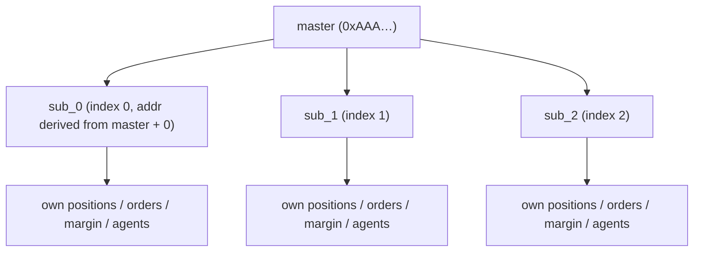
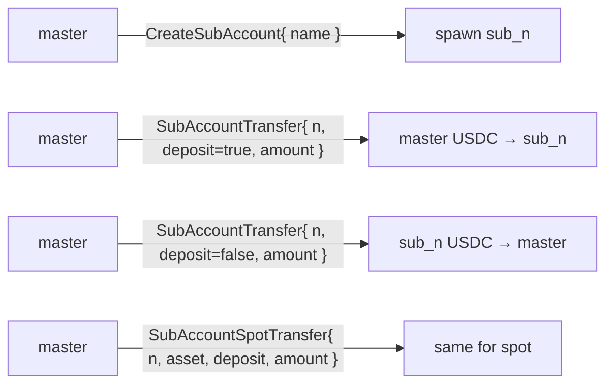
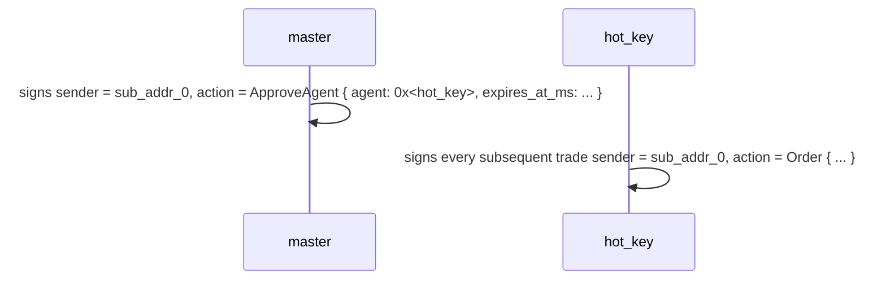
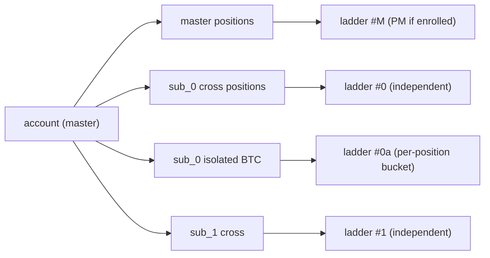
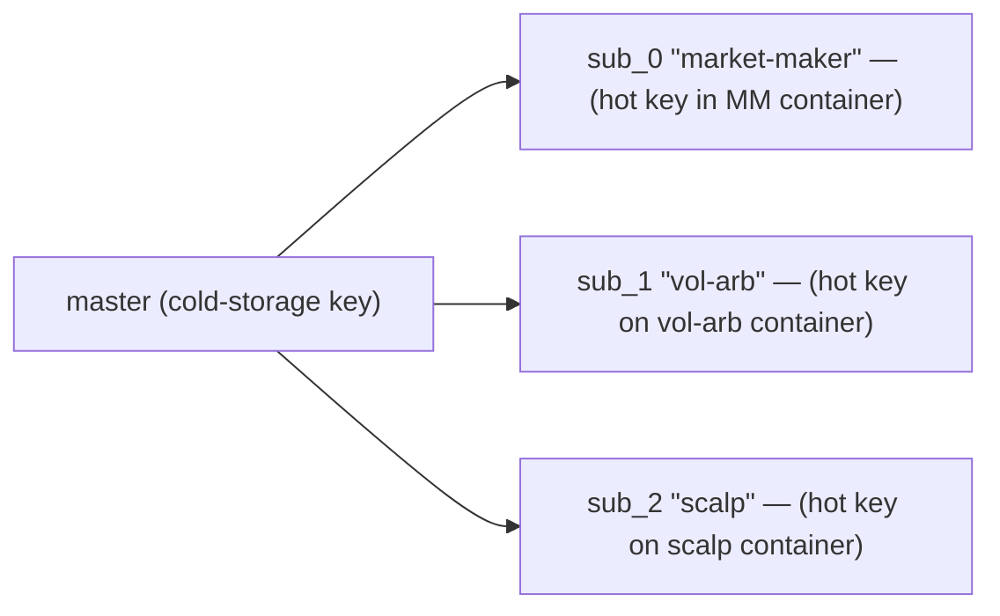
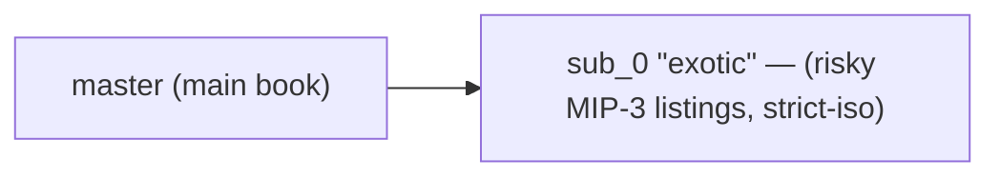
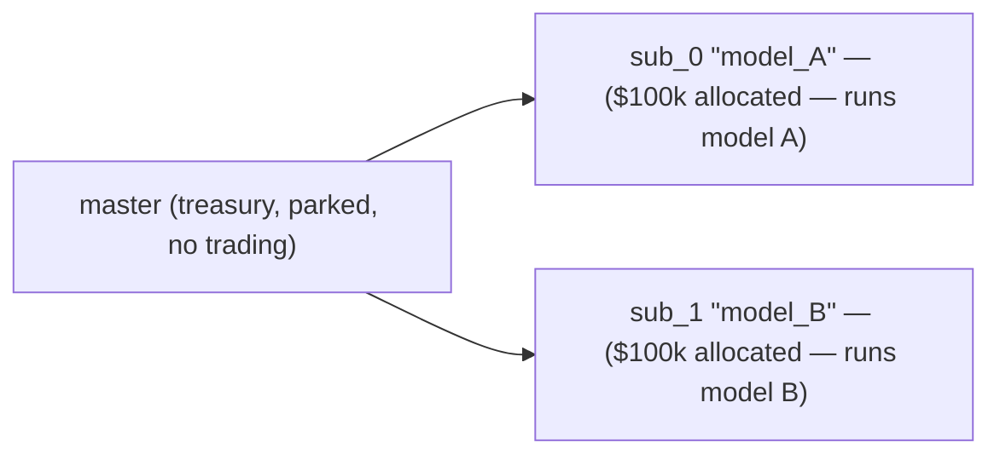
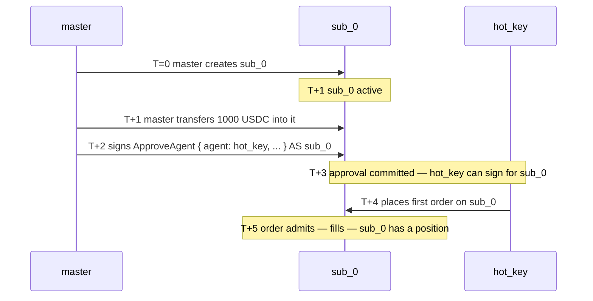

# Sub-cuentas

:::info
**Vista previa.** La API visible para el usuario es estable; el esquema de derivación de direcciones queda fijado antes del lanzamiento en mainnet.
:::

## Resumen

Una sub-cuenta es una dirección derivada vinculada a una cuenta maestra que tiene sus propias posiciones, margen y órdenes, pero que solo puede transferir fondos a través de la cuenta maestra. Se permiten hasta 32 sub-cuentas por maestra. Úsalas para aislar estrategias, separar mesas de operaciones o gestionar carteras A/B sin necesidad de un nuevo proceso de incorporación.

## Modelo conceptual



Cada sub-cuenta es una cuenta de primera clase dentro del motor de estado: tiene su propio saldo, sus propias posiciones, su propio umbral de liquidación y sus propias [carteras de agentes](./agent-wallets.md). La relación maestra-sub se registra en un mapa auxiliar.

Límite máximo: **32 sub-cuentas** por maestra (sujeto a ampliación en V2). Alcanzar ese límite devuelve `{"error":"sub_account_cap"}` al ejecutar `CreateSubAccount`.

## Transferencias

Solo entre maestra y sub-cuenta:



Los retiros externos (fuera de la cadena, a una tercera dirección) deben originarse desde la **cuenta maestra**. Las sub-cuentas no pueden retirar fondos directamente fuera de la cadena.

## Derivación de direcciones

Cada índice de sub-cuenta `n` se mapea de forma determinista a una dirección derivada a partir de los 20 bytes de la dirección maestra:

```
sub_addr_n = first_20_bytes( keccak256( master_addr || uint64_be(n) ) )
```

Cualquiera puede calcular la dirección de una sub-cuenta sin necesidad de consultar el estado en la cadena. La derivación queda fijada a nivel de consenso en el lanzamiento de V1; hasta entonces, las direcciones devueltas deben considerarse autoritativas.

## Garantías de segregación de fondos

| Garantía | Mecanismo |
|-----------|-----------|
| La pérdida de una sub no puede vaciar la maestra | La sub se liquida contra su propio saldo; la maestra solo ve el libro de transferencias |
| La pérdida de una sub no puede vaciar otras subs | Lo mismo: cada sub es un límite de aislamiento de primera clase |
| La maestra PUEDE elegir respaldar a una sub con pérdidas | Voluntariamente, a través de un depósito con `SubAccountTransfer` |
| La maestra NO PUEDE verse obligada a respaldar | La pérdida total de una sub recae únicamente sobre ella |
| La maestra puede retirar fondos **de** una sub | Mediante `SubAccountTransfer` (solo si la sub se mantiene en el nivel Safe tras la transferencia) |

## Creación

```json
{
  "type": "CreateSubAccount",
  "params": { "name": "scalping-desk", "explicit_index": null }
}
```

| Campo | Tipo | Descripción |
|-------|------|-------------|
| `name` | string ≤ 64 chars | Etiqueta contable |
| `explicit_index` | uint32 \| null | Ranura específica a reclamar; `null` → siguiente libre |

Respuesta:

```json
{
  "accepted": true,
  "data": {
    "sub_index":   0,
    "sub_address": "0x<derived>",
    "name":        "scalping-desk"
  }
}
```

**Los índices son monotónicos**: una vez asignados, nunca se reutilizan, aunque la sub-cuenta quede vacía o sea abandonada. Usa `explicit_index` con precaución.

## Fondeo

```json
{
  "type": "SubAccountTransfer",
  "params": { "sub_index": 0, "deposit": true, "amount": "1000000000" }
}
```

`amount` expresado en unidades base de USDC (6 decimales). `deposit: true` corresponde a maestra → sub; `false` a sub → maestra.

Para activos al contado (spot), usa `SubAccountSpotTransfer` (añade el campo `asset`).

**La transferencia debe dejar la sub-cuenta en el nivel Safe**: un retiro que empujara la sub a T0+ se rechaza con `{"error":"insufficient sub balance"}`. Incrementa primero el saldo y luego retira el excedente.

## Operativa desde una sub-cuenta

La sub-cuenta es una cuenta regular. Firma con la clave de la sub (o con un [agente autorizado](./agent-wallets.md)) y envía la orden con la dirección de la sub como `sender`.

Patrón habitual: la maestra firma `ApproveAgent` para cada sub desde la dirección de esa sub. La maestra posee la autoridad de delegación sobre sus subs, por lo que esto está permitido aunque `ApproveAgent` sea de uso exclusivo de la maestra en otros contextos. Cada sub tiene así su propio flujo de operativa con clave caliente (hot key).



El SDK expone cada sub-cuenta como una instancia `Client` independiente con su propio par de claves, apuntando a su dirección derivada.

## Aislamiento de liquidación

La [liquidación escalonada](./tiered-liquidation.md) de una sub-cuenta se calcula exclusivamente sobre el **valor de esa misma cuenta** y su margen de mantenimiento. Una pérdida total en `sub_0` no pone en riesgo a `sub_1` ni a la maestra.

También puedes configurar el modo de margen de una sub en `StrictIso` por activo, de modo que las posiciones de ese activo no contribuyan al margen de cartera (PM) entre activos, aunque la maestra esté inscrita en PM.



## Inscripción en PM por sub-cuenta

Cada sub-cuenta se inscribe de forma independiente en el [margen de cartera](./portfolio-margin.md) (con su propia verificación de patrimonio frente a `pm_min_equity`).

```json
{
  "sender": "0x<sub_0_addr>",
  "action": { "type": "UserPortfolioMargin", "params": { "enabled": true } }
}
```

Una maestra puede mantener el margen clásico mientras una sub opera con PM; esto resulta útil cuando una sub gestiona un libro cubierto y las demás ejecutan operaciones direccionales.

## Consulta

```bash
curl -X POST https://api.devnet.mtf.exchange/info \
  -d '{"type":"sub_accounts","address":"0x<master>"}'
```

Devuelve la lista de sub-cuentas con índices, direcciones derivadas, etiquetas y un snapshot del estado de la cámara de compensación de cada sub.

Cada sub-cuenta también puede consultarse como cuenta de primera clase a través de `account_state`, `open_orders`, `user_fills`, etc., pasando su dirección en el parámetro `address`.

## Límites

| Límite | Valor predeterminado | Notas |
|-------|---------|-------|
| Sub-cuentas por maestra | 32 | V2 podría ampliarlo |
| Longitud del nombre de sub-cuenta | 64 chars | UTF-8; sin validación más allá de la longitud |
| Transferencias en tránsito simultáneas | 8 por maestra | Límite del mempool |
| La maestra puede retirar de una sub | sí, si la sub se mantiene en Safe | De lo contrario, se rechaza |
| La sub puede retirar fuera de la cadena | no | Debe enrutar a través de la maestra |
| La sub puede tener agentes | sí | Configurado por sub |
| La sub puede ser multi-firma | no | En V1, solo la maestra puede ser multi-firma |

## Patrones de uso

### Separación de estrategias



Cada estrategia tiene su propia clave de agente, su propio límite de liquidación y su propia contabilidad de PnL.

### Cortafuegos de riesgo



El libro principal captura todo el potencial alcista; la pérdida total de sub_0 está limitada a su depósito.

### Carteras A/B



La comparación trimestral del NAV por sub-cuenta determina cuál recibe mayor asignación.

## Casos límite

<details>
<summary>Mostrar casos límite</summary>

- **Condición de carrera entre `CreateSubAccount` y el primer tráfico de agente.** La sub-cuenta entra en vigor en el siguiente bloque, como cualquier cambio de estado. Secuencia: crear → aprobar agente → esperar 1 bloque → operar.
- **La maestra intenta retirar de una sub durante la liquidación T1 de esa sub.** Se rechaza; el colateral de la sub se está usando en su defensa. La transferencia se permite una vez que la sub vuelve al nivel Safe.
- **La maestra elimina o abandona una sub.** No está disponible en V1. Las sub-cuentas permanecen en el índice indefinidamente. Las subs vacías tienen coste de estado cero; no supone un problema relevante.
- **La clave de agente de una sub queda comprometida.** Revócala a través de la maestra (que posee la autoridad de delegación sobre la sub). Usa el mismo `ApproveAgent` con `expires_at_ms` en el pasado.
- **Sub de una sub.** No está soportado. El `CreateSubAccount` emitido por una sub es rechazado.

</details>

## Secuencia — configuración completa



## Véase también

- [Carteras de agentes](./agent-wallets.md) — claves calientes por sub-cuenta
- [Margen de cartera](./portfolio-margin.md) — interacción con el PM entre activos
- [Modos de margen](./margin-modes.md) — Cruzado / Aislado / Strict-Iso por sub
- [`POST /info sub_accounts`](../api/rest/info.md#sub_accounts) — consulta nativa de MTF

## Preguntas frecuentes

<details>
<summary>Mostrar preguntas frecuentes</summary>

**P: ¿Las comisiones de las sub-cuentas se agregan a la maestra a efectos de nivel?**
R: Sí. El nivel por volumen de los últimos 30 días se consolida entre la maestra y todas sus subs. Las operaciones realizadas en sub-cuentas computan para el descuento de nivel de la maestra.

**P: ¿Puede una sub-cuenta recibir fondos directamente desde otra cuenta sin pasar por la maestra?**
R: Sí. Un `UsdcTransfer` a la dirección de una sub funciona igual que a cualquier otra cuenta. A partir de ese punto, los fondos no están restringidos a fluir a través de la maestra; son simplemente fondos en el saldo de la sub.

**P: ¿Las subs comparten el espacio de nonce con la maestra?**
R: No. Cada sub tiene su propia secuencia de nonces. Los nonces de la maestra son de la maestra; los de sub_0 son de sub_0; y así sucesivamente.

**P: ¿Puedo convertir una sub-cuenta en maestra o desvincularla?**
R: No en V1. Una sub-cuenta es permanentemente una sub-cuenta. Para "desvincularla", crea una cuenta nueva en una dirección diferente y transfiere los fondos.

</details>
