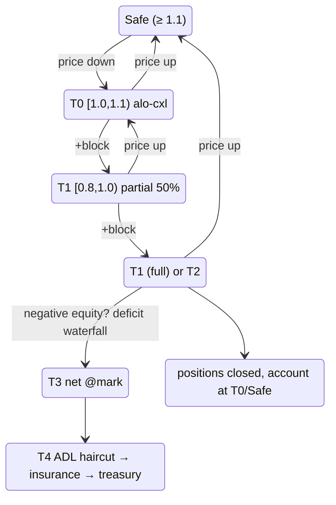

# Liquidación por niveles

:::tip
**Estable.**
:::

## Resumen

Una escalera de 5 niveles impulsada por `health = account_value / maint_margin`. Cada nivel define la acción del protocolo a medida que el ratio de salud desciende. La [tarjeta amarilla](#por-qué-una-tarjeta-amarilla) (T0) es el período de gracia con histéresis de MetaFlux — un bloque de advertencia antes de que se cierre cualquier posición. El [ADL](./adl.md) de T4 es la última línea de defensa para la mutualización de pérdidas.

| Nivel | Rango de salud | Acción | ¿Posición afectada? |
|-------|---------------|--------|---|
| (seguro) | `health ≥ 1.1` | Inactivo | — |
| **T0** | `1.0 ≤ health < 1.1` | **Tarjeta amarilla**: órdenes ALO canceladas a la fuerza, cartera notificada | No |
| **T1** | `0.8 ≤ health < 1.0` | Cierre parcial con [límite de precio mínimo](#cómo-se-ejecuta-un-cierre-forzado-el-límite-de-precio) (50%) — cierre completo si T1 se activó dentro del `cooldown_ms` | Sí (50%) o Sí (100%) |
| **T2** | `0.667 ≤ health < 0.8` | Cierre completo con [límite de precio mínimo](#cómo-se-ejecuta-un-cierre-forzado-el-límite-de-precio) | Sí (100%) |
| **T3** | `health < 0.667` | [Compensación al precio de marca](#t3-backstop--compensación-al-precio-de-marca) contra contrapartes rentables (los saldos de T1/T2 no ejecutados también escalan aquí) | Sí — compensado al precio de marca |
| **T4** | capital negativo tras T3 | [Cascada de déficit](#t4--la-cascada-de-déficit): recorte ADL → fondo de seguros → cola de tesorería | Recorte de ganancias realizadas de los ganadores |

`account_value` incluye el PnL no realizado. `maint_margin` se calcula como margen base por activo (clásico) o derivado de SPAN (para cuentas en margen de cartera).

## Cómo se calculan los niveles

Los rangos mostrados a continuación son las **constantes literales del código**, no aproximaciones.

`BoleEngine::decide(account, account_value: i128, maintenance_margin: u128, ts_ms)` es una **función pura** — lee el estado de enfriamiento pero nunca lo muta — y devuelve un `BoleDecision`:

```
if maintenance_margin == 0            → Idle
if account_value < 0                  → Backstop { deficit = maintenance_margin + |account_value| }

health = account_value / maintenance_margin            # Decimal division

if health ≥ 1.1   (yellow_card_threshold)              → Idle            (Safe)
if health ≥ 1.0                                        → YellowCard      (T0)
if health < 0.667 (full_market_floor)                 → Backstop { deficit = maintenance_margin − account_value }   (T3)
if health < 0.8   (partial_threshold)                 → FullMarket { size_to_close = maintenance_margin }           (T2)
# else 0.8 ≤ health < 1.0  (T1):
if partial_cooldown_active(account)                   → FullMarket { size_to_close = maintenance_margin }
else                                                  → PartialMarket50 { size_to_close = maintenance_margin / 2 }
```

| Constante | Valor | Símbolo |
|-----------|-------|---------|
| Umbral de tarjeta amarilla (techo de T0) | `1.1` | `default_yellow_card_threshold` |
| Umbral parcial (techo de T1) | `0.8` | `default_partial_threshold` |
| Límite inferior de mercado completo (entrada a T3) | `0.667` (≈ 2/3) | `full_market_floor` |
| Período de enfriamiento parcial→completo | `30_000 ms` | `DEFAULT_PARTIAL_COOLDOWN_MS` |

- Todas las comparaciones usan `rust_decimal::Decimal` (sin números de punto flotante). Cuando `account_value` supera `Decimal::MAX`, `decide` desplaza a la derecha ambos operandos por un número de bits común — esto preserva el ratio de salud, de modo que el nivel seleccionado no cambia en esas magnitudes.
- **Solo `PartialMarket50` activa el período de enfriamiento** (`record_attempt`); un `FullMarket` o `Backstop` no bloquea cierres parciales posteriores. Por tanto, la escalada de T1 de parcial→completo solo se activa cuando un *parcial previo* aún está dentro de su ventana de 30 s.
- `size_to_close` para un parcial es `maintenance_margin / 2` (truncado a entero). El `deficit` para el backstop es `maintenance_margin − account_value` cuando `account_value ≥ 0`, o `maintenance_margin + |account_value|` en caso contrario.
- El motor evalúa un **conjunto incremental de cuentas marcadas como sucias** en cada bloque (cuentas con eventos + una franja de auto-revisión rotativa), no un escaneo completo — se ha demostrado equivalente a un escaneo desde cero mediante pruebas de fuzzing. Las cuentas en T0 tienen su liquidez de órdenes ALO en reposo cancelada a la fuerza tras la clasificación.

## Cómo se ejecuta un cierre forzado (el límite de precio)

Un cierre forzado de T1/T2 **nunca es un barrido de mercado**. Se ejecuta como una orden IOC LIMIT acotada al precio de marca comprometido:

```
sell (long leg):      limit = mark × (1 − liq_floor)
buy-back (short leg): limit = mark × (1 + liq_floor)
```

- `liq_floor` es un parámetro de riesgo por mercado; **por defecto equivale a la mitad del ratio de mantenimiento del mercado** (un mercado con mantenimiento del 5% tiene un límite inferior de ejecución del 2,5% respecto al precio de marca). El ratio de mantenimiento está calibrado para cubrir el deslizamiento de liquidación más las comisiones, de modo que el límite inferior garantiza que un cierre forzado nunca incurra en más deslizamiento del que el margen fue diseñado para absorber.
- El tramo solo se completa a precios dentro del límite inferior o mejores. **Lo que no pueda ejecutarse por encima del límite inferior NO se vende en un libro de órdenes escaso** — escala directamente a la cola de backstop T3. Este es el mecanismo anticascada: un cierre forzado no puede deprimir el precio de marca más allá del límite inferior y, por tanto, no puede arrastrar otras cuentas a la liquidación.
- Las ejecuciones se liquidan a través de la **misma ruta de liquidación que una ejecución normal**: el PnL realizado impacta la cuenta, el interés abierto se actualiza y el lado maker de la contraparte se liquida con normalidad.
- Se cobra una **comisión de liquidación** (50 bps del nocional cerrado por defecto, configurable por mercado) sobre el capital positivo restante de la cuenta — nunca genera un déficit — y se acredita al fondo de seguros, que es exactamente el fondo que absorbe los déficits del backstop.
- Las **órdenes en reposo propias de la cuenta en el lado opuesto se cancelan, no se auto-ejecutan** (una auto-ejecución reabriría lo que el cierre acaba de cerrar).

El tamaño del parcial (T1) es el 50% del tramo objetivo en los mercados principales; los mercados desplegados por constructores pueden configurar una rampa con decaimiento según el ratio de salud (cerrar un pequeño tramo justo por debajo del límite de mantenimiento, tramos mayores solo a medida que el ratio desciende, con un tope por mercado) además del período de enfriamiento de 30 s entre tramos.

## La máquina de estados completa



`cooldown_ms` tiene un valor por defecto de `30 s`. Dentro de una ventana de enfriamiento, una reentrada a T1 escala al cierre completo.

## Por qué una tarjeta amarilla

La mayoría de las cadenas de derivados públicas pasan directamente de "saludable" a "cierre parcial". Un pico de volatilidad que lleva el ratio de salud de 1,5 a 0,95 en un tick desencadena una venta forzada, que deprime el precio de marca, que arrastra más cuentas al mismo nivel. La cascada es la principal causa de dolor por liquidación observada en estos eventos.

T0 es una **capa de histéresis de un bloque**. Entras en el rango; la cadena congela tus órdenes en reposo abiertas (solo ALO — ver más abajo) y notifica a tu cliente, pero nada de lo tuyo se vende. Tienes hasta el siguiente bloque de consenso para:

- recargar margen mediante `Deposit` (o `UpdateIsolatedMargin` para añadir a un compartimento),
- cerrar parte de la posición manualmente,
- o no hacer nada — en cuyo caso T1 se activa en la siguiente evaluación.

Con un tiempo de bloque de 100 ms, la ventana de gracia es corta pero determinista y suficientemente amplia para que un proceso de gestión de riesgo automatizado pueda reaccionar.

### Por qué solo se cancelan las órdenes ALO

| TIF de la orden | ¿Cancelada en T0? | Motivo |
|-----------------|:-----------------:|-------|
| `Alo` | sí | Solo en reposo, sin comisión devengada; el capital se aprovecha mejor defendiendo la posición |
| `Gtc` (límite activo) | no | Puede ser tu punto de descubrimiento de precio activo; cancelarla podría empeorar tu situación |
| `Ioc` (en vuelo) | n/a | Se resuelve al admitirse; nunca queda en reposo |
| Trigger (StopLoss / TakeProfit) | no | Frecuentemente son exactamente la defensa que deseas que se active |

La intención: liberar capital inmovilizado en órdenes pasivas en reposo, preservando tus decisiones activas de gestión de riesgo.

## Transición T1 parcial / completo

T1 comienza como un cierre parcial del 50%. Lógica de enfriamiento:

- **Primera activación de T1**: cierre del 50%. `cooldown_armed_at = now`.
- **Si el ratio de salud vuelve a T0/seguro** antes de `cooldown_armed_at + cooldown_ms`: el enfriamiento se desactiva de forma natural en cuanto salimos de T1.
- **Si el ratio de salud permanece en T1** durante `cooldown_ms`: la siguiente evaluación de T1 escala a cierre **completo** en lugar de otro parcial.
- El enfriamiento NO se reactiva en T2 o T3.

```
T = 0       T1 fire #1, 50% close, cooldown armed
T = 5s      mark slips further, still in T1
T = 20s     mark recovers slightly; in T0
T = 31s     cooldown elapsed (would have escalated, but we're not in T1)
            account considered T0/Safe; cooldown reset
```

Versus:

```
T = 0       T1 fire #1, 50% close
T = 5s      still T1
T = 30s     STILL T1 (cooldown elapses while in T1)
T = 30s+    T1 fire #2 → full close
```

El período de enfriamiento *no* es una zona de inactividad — T1 sigue disparando cierres parciales. El enfriamiento solo gobierna la actualización de parcial → completo.

### Ejemplo práctico

Cuenta: posición larga de 1 BTC a precio de entrada 100, compartimento USDC aislado = 20.

```
mark = 100   account_value = 20 + 0 = 20   maint = 5 (5% of 100)  health = 4.0  → Safe
mark = 90    account_value = 20 - 10 = 10  maint = 4.5            health = 2.2  → Safe
mark = 85    account_value = 20 - 15 = 5   maint = 4.25           health = 1.18 → T0 (alo cancel)
mark = 84.5  account_value = 20 - 15.5     maint = 4.225          health = 1.06 → T0
mark = 84    account_value = 20 - 16 = 4   maint = 4.2            health = 0.95 → T1
                  T1 fire: close 0.5 BTC at mark 84
                  realised PnL: -8 (closed 0.5 BTC, entry 100, exit 84)
                  bucket: 20 - 8 = 12
                  remaining position: 0.5 BTC long entry 100, mark 84
                  account_value = 12 - 8 = 4 (unrealised -8 on 0.5 BTC)
                  maint = 0.5 * 84 * 0.05 = 2.1
                  health = 4 / 2.1 = 1.9 → back to Safe
```

Un cierre parcial del 50% restauró el ratio de salud de 0,95 (T1) a 1,9 (seguro). El propósito del cierre parcial es redimensionar la posición para que el compartimento restante pueda soportar la exposición menor.

Si el cierre del 50% no restaura el ratio de salud (caída más profunda), una segunda activación de T1 dentro del período de enfriamiento escalaría:

```
mark = 84    T1 fire partial: 0.5 BTC closed, health → 1.9
mark = 82    health = 0.95 again (still in T1, cooldown active)
              T1 escalates to full close: remaining 0.5 BTC closed at 82
              realised PnL: -9
              bucket: 12 - 9 = 3
              position: 0
              account closed cleanly with 3 USDC remaining; insurance untouched
```

## T3 backstop — compensación al precio de marca

Por debajo de `health = 0.667` (≈2/3 del mantenimiento), la cadena deja de intentar ejecutar en el libro de órdenes. La posición — y cualquier lote de cierre forzado que el libro no pudo absorber dentro del [límite de precio](#cómo-se-ejecuta-un-cierre-forzado-el-límite-de-precio) — se **compensa al PRECIO DE MARCA comprometido** contra las posiciones del lado opuesto con mayor rentabilidad sobre el mismo instrumento (mayor PnL no realizado primero, con desempate determinista):

```
when account enters T3 (or parked un-fillable lots exist):
   match its position lots against profitable opposite-side holders
   close BOTH sides at MARK              # no book interaction, no price impact
   both sides realise PnL at that mark   # value-neutral: equity unchanged
                                         # by the netting itself
   lots with no profitable counterparty stay parked for the next block
```

Las contrapartes incorporadas a la compensación conservan **cada centavo de PnL** (realizado al precio de marca) — solo pierden la posición abierta. No se cobra comisión a ninguna de las partes. Una compensación sin un precio de marca utilizable, o sin ningún lado opuesto rentable, simplemente espera — la cadena nunca vende a la fuerza en un libro vacío.

## T4 — la cascada de déficit

Si la cuenta está plana en todos los mercados y su capital es **negativo**, esa deuda incobrable se socializa en un orden fijo (ADL **antes** que el fondo de seguros — las ganancias realizadas de los ganadores desapalancados absorben primero, lo que reserva el fondo para eventos de cola genuinos):

1. **Recorte ADL** — un controlador de severidad adaptativo recupera hasta las ganancias que las contrapartes de la compensación **acaban de realizar** (nunca más de lo que recibieron, y nunca PnL en papel no realizado).
2. **Fondo de seguros** — absorbe automáticamente el resto (este es el fondo que alimenta la [comisión de liquidación](#cómo-se-ejecuta-un-cierre-forzado-el-límite-de-precio)).
3. **Reserva de tesorería** — el saldo restante se encola para una extracción de tesorería autorizada por multifirma (intervención humana, último recurso).

El saldo negativo de la cuenta se pone a cero — la deuda queda en la cascada. Consulta [ADL](./adl.md) para las matemáticas del controlador.

## Verificación de margen en dos puntos

La elegibilidad para liquidación se comprueba en **dos puntos** durante cada bloque:

1. **Inicio de bloque**, tras la actualización de los precios de marca — detecta cuentas que acaban de caer a un nivel inferior por un movimiento de precio.
2. **Post-acción**, tras cada `Order` / `Cancel` / `Withdraw` de esta cuenta — detecta cuentas que se han llevado a sí mismas a un nivel inferior (por ejemplo, retirando demasiado colateral).

Esto impide la manipulación "gratuita" intra-bloque, en la que un usuario añade riesgo entre el inicio de bloque y el resto del bloque.

## Estrategias de recuperación

| Escenario | Estrategia |
|-----------|-----------|
| Dirigiéndose a T0 | Recarga mediante `UpdateIsolatedMargin` (Aislado) o `Deposit` (Cruzado). Configura órdenes de disparo antes de situaciones de estrés. |
| Ya en T0 | Lo mismo. Las órdenes ALO ya están canceladas; coloca nuevos límites en niveles de protección. |
| Entrando y saliendo de T0 | Ajusta las alertas internas a `health < 1.2`. Analiza qué lo provoca — ¿pago de financiación? ¿borde del rango de precio de marca? ¿interrupción del oráculo? |
| T1 parcial recién activado | Re-evalúa. La posición es un 50% menor; considera cerrar el resto voluntariamente antes de que el período de enfriamiento escale al cierre completo. |
| Trampas repetidas del período de enfriamiento en T1 | El tamaño de la posición es incorrecto para el compartimento. No recargues el compartimento sin redimensionar también la posición. |

## Cómo mantenerse fuera de peligro

- Monitoriza `health` mediante consultas [`account_state`](../api/rest/info.md#account_state).
- Configura alertas internas en `health < 1.2` — bien por encima de T0.
- Para estrategias automatizadas, registra un [bot de vigilancia de riesgo](../integration/risk-watcher.md) que deposite cuando el ratio de salud cruce un umbral.
- Monitoriza [`userEvents`](../api/ws/subscriptions.md#userevents) en el feed WebSocket para transiciones de nivel inmediatas (los eventos de margen y liquidación se transmiten por este canal).

## Casos límite

<details>
<summary>Mostrar casos límite</summary>

- **Rango de precio de marca activado.** Durante la activación del rango de precio de marca, las evaluaciones de liquidación siguen ejecutándose — pero contra el precio de marca acotado. El libro puede estar en un precio peor del que el protocolo puede reconocer. En la práctica: un pico adversarial que el rango amortigua NO te liquida al instante; tu ratio de salud se calcula contra el precio de marca acotado.
- **Pago de financiación cruza el límite de nivel.** Un pago de financiación reduce `account_value`. Si estás en `health = 1.05` y un cargo de financiación del 0,1% te lleva a 0,99, T1 se activa en el mismo bloque. Vigila la cadencia de financiación respecto a tu margen de seguridad.
- **Dos activaciones de T1 simultáneas en distintos activos (Cruzado).** Ambos cierres parciales ocurren en el mismo bloque. Orden: alfabético por nombre de activo (determinista entre validadores). La elegibilidad para el seguro y el ADL se aplica por activo.
- **Entrada en T0 y salida antes del siguiente bloque.** Posible si tu cliente recarga margen en el mismo bloque (T0 en inicio de bloque → `Deposit` por acción del usuario → verificación post-acción supera T0). Las órdenes ALO que fueron canceladas en el inicio de bloque permanecen canceladas; nada las recrea automáticamente.

</details>

## Ver también

- [Margen de cartera](./portfolio-margin.md) — el margen cruzado multi-activo opcional reduce el mantenimiento base
- [Algoritmo de asignación ADL](./adl.md) — matemáticas detrás de T4
- [Modos de margen](./margin-modes.md) — Cruzado / Aislado / Aislado-Estricto define el ámbito de la escalera
- [Precios de marca](./mark-prices.md) — qué impulsa el ratio de salud
- [Canal WS `userEvents`](../api/ws/subscriptions.md#userevents) — las transiciones de nivel se transmiten por este canal
- [Patrón de vigilancia de riesgo](../integration/risk-watcher.md) — recarga automática de margen

## Preguntas frecuentes

<details>
<summary>Mostrar preguntas frecuentes</summary>

**P: ¿Puedo activar T1 manualmente sobre la cuenta de otra persona?**
R: No. La liquidación se deriva del consenso contra el precio de marca comprometido y el estado de la cuenta. No existe ninguna acción "liquidar" que un usuario pueda enviar; el protocolo se activa desde su propia lógica en los puntos de verificación de inicio de bloque / post-acción.

**P: ¿Cuál es el ratio de salud más bajo con el que puedo entrar en una tarjeta amarilla y salir limpio?**
R: T0 se activa con `1.0 ≤ health < 1.1`. Si vuelves a "seguro" (`health ≥ 1.1`) antes de la siguiente evaluación, las órdenes ALO NO se recrean (debes reenviarlas) pero no se dispara ninguna otra acción de T0.

**P: ¿Hay forma de optar por no participar en T1 (forzar que salte de parcial → completo)?**
R: No. T1 siempre intenta el parcial primero. Envía un cierre manual en T0 si quieres cerrar completamente en tus propios términos.

**P: ¿Cómo se determina el precio de cierre en T1/T2?**
R: Una orden **límite** IOC al libro de órdenes vigente, con un límite inferior en `mark × (1 ∓ liq_floor)` — consulta [el límite de precio](#cómo-se-ejecuta-un-cierre-forzado-el-límite-de-precio). El deslizamiento realizado está acotado por el límite inferior (por defecto: la mitad del ratio de mantenimiento); todo lo que el libro no pueda absorber dentro del límite inferior escala al backstop en lugar de barrer niveles más profundos.

</details>
