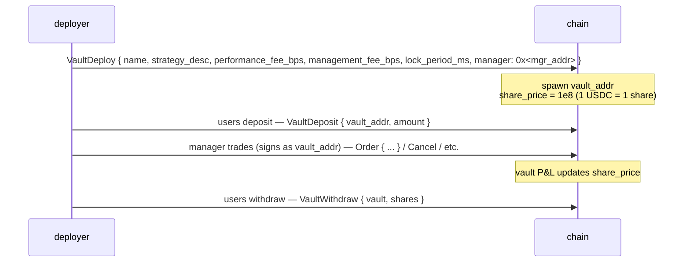
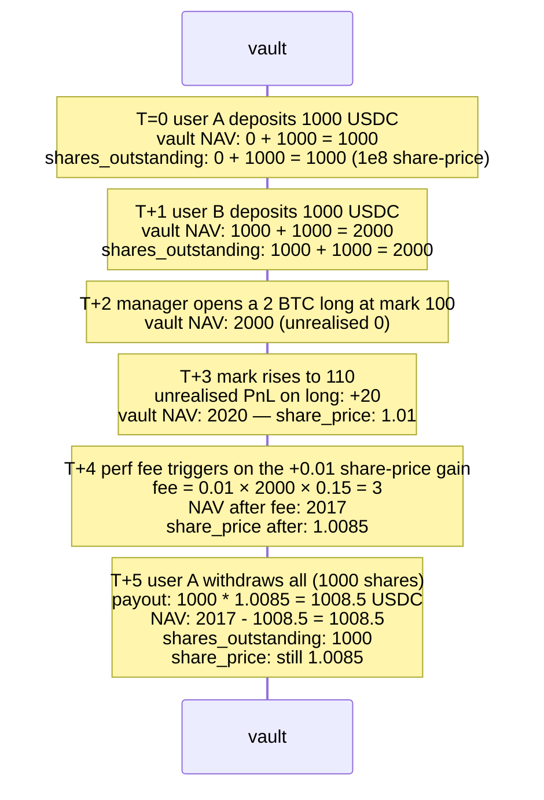

# Bóvedas

:::info
**En vivo en devnet.** El ciclo de vida completo de las bóvedas — creación, depósito, retiro, transferencia, distribución, modificación — está implementado y en funcionamiento en devnet. Aún se están añadiendo pruebas de consenso de extremo a extremo.
:::

## Resumen

Dos familias de bóvedas: la **MFlux Vault** operada por el protocolo (el fondo de seguro/respaldo), y las **bóvedas de usuario** (estrategias desplegadas por la comunidad en las que puedes depositar). Ambas comparten el mismo mecanismo de valoración de participaciones: los depósitos acuñan participaciones al `share_price` actual; los retiros queman participaciones al `share_price` actual.

## MFlux Vault

El fondo propio del protocolo. Desempeña tres funciones:

1. **Contraparte de respaldo**: cuando una liquidación T3 transfiere la posición al protocolo, MFlux Vault absorbe la posición y cualquier pérdida residual.
2. **Creación de mercado (planificada)**: el capital ocioso de MFlux puede desplegarse en estrategias de creación de mercado en mercados seleccionados.
3. **Seguro**: mantiene reservas para socializar pérdidas pequeñas sin activar el ADL de T4.

### Depósito en MFlux Vault

```json
{
  "type": "VaultDeposit",
  "params": {
    "vault":       "<mflux_vault_addr>",
    "amount":   "1000000000"
  }
}
```

Acuña `amount / share_price × 10^8` participaciones para el depositante en el siguiente bloque.

### Retiro

```json
{
  "type": "VaultWithdraw",
  "params": {
    "vault":       "<mflux_vault_addr>",
    "shares":   "100000000000"
  }
}
```

Quema `shares` participaciones; paga `shares × share_price / 10^8` USDC en el siguiente bloque.

### Período de bloqueo

MFlux Vault tiene un período de bloqueo predeterminado de `24 h` desde el depósito hasta el primer retiro habilitado. El bloqueo es por participación; los retiros de participaciones con más de 24 h de antigüedad no tienen restricciones.

Esto evita que el capital deposite justo antes de un evento T3 conocido y retire inmediatamente después de que la pérdida se haya socializado (el problema del «polizón»).

### Rendimiento y comisiones

MFlux Vault cobra:
- **Comisión de gestión**: 0 bps (sin gestor — operada por el protocolo).
- **Comisión de rendimiento**: 0 bps.
- **Comisión de retiro**: 0 bps.

Los retornos son netos de pérdidas del respaldo T3 más ganancias de creación de mercado T1/T2. El gráfico histórico del precio de participación está disponible en la consulta en tiempo real `vault_state` (véase [`/info`](../api/rest/info.md#vault_state)).

## Bóvedas de usuario

Cualquiera puede desplegar una bóveda que agrupe USDC y ejecute estrategias bajo la autoridad de firma de un gestor designado.

### Ciclo de vida



La dirección de la bóveda es una cuenta de primer nivel en la máquina de estados — tiene sus propias posiciones, saldo y órdenes. El gestor firma operaciones **en nombre de la bóveda** (la dirección de la bóveda es el `sender`, la clave del gestor firma; la admisión pasa por el mismo mecanismo de aprobación de agentes que las carteras de agentes regulares).

### Despliegue

```json
{
  "type": "VaultDeploy",
  "params": {
    "name":                 "Yield Arb Strategy",
    "description":          "Funding-rate arbitrage",
    "manager":              "0x<mgr>",
    "performance_fee_bps":  1500,
    "management_fee_bps":   100,
    "lock_period_ms":       86400000,
    "high_water_mark":      true
  }
}
```

| Campo | Rango | Notas |
|-------|-------|-------|
| `performance_fee_bps` | `[0, 3000]` | Comisión sobre retornos positivos por encima del máximo histórico anterior |
| `management_fee_bps` | `[0, 500]` anualizado | Se cobra independientemente de los retornos |
| `lock_period_ms` | `[0, 30 days]` | Bloqueo por depósito |
| `high_water_mark` | bool | Si es verdadero, la comisión de rendimiento solo aplica sobre nuevos máximos |

### Valoración

```
share_price(t) = vault_account_value(t) / total_shares(t) × 10^8
```

`vault_account_value` incluye las pérdidas y ganancias no realizadas en posiciones abiertas.

La valoración se actualiza en cada confirmación. Los depósitos se acuñan al precio de participación **posterior a la confirmación** (no se obtiene el precio del bloque anterior); los retiros se queman al precio de participación posterior a la confirmación.

### Mecánica de comisiones

La comisión de rendimiento se acumula en la dirección designada por el gestor en cada actualización del precio de participación que supere el máximo histórico anterior:

```
on every commit:
    if share_price > high_water_mark:
        gain     = (share_price - high_water_mark) * shares_outstanding
        perf_fee = gain * performance_fee_bps / 1e4
        accrue perf_fee to manager (paid as vault → manager USDC)
        high_water_mark = share_price
```

La comisión de gestión se paga de forma lineal por bloque:

```
mgmt_per_block = management_fee_bps / 1e4 / (blocks_per_year)
```

Ambas comisiones se deducen del NAV de la bóveda antes del cálculo del precio de participación — el precio de participación ya refleja la comisión pagada.

### Riesgo

Las bóvedas de usuario pueden generar pérdidas. Si el NAV de una bóveda es ≥ pasivos + 1 unidad base, los retiros se atienden al precio de participación vigente. Por debajo de ese umbral, la bóveda queda **pausada** y los retiros se encolan hasta que el NAV se recupere (potencialmente mediante el cierre de posiciones perdedoras por parte del gestor).

Una bóveda que entra en T3 (su propio nivel de liquidación) sigue la jerarquía de [liquidación por niveles](./tiered-liquidation.md). El ADL T4 sobre una bóveda revierte sobre los depositantes mediante una reducción del precio de participación.

La dirección de la bóveda permanece en la cadena de forma permanente; incluso una bóveda vacía persiste (el almacenamiento pagado con gas no es recuperable en V1).

### Consulta

```bash
curl -X POST https://api.devnet.mtf.exchange/info \
  -d '{"type":"vault_state","vault":"0x<vault>"}'
```

```json
{
  "type": "vault_state",
  "data": {
    "vault":              "0x<addr>",
    "name":               "Yield Arb Strategy",
    "manager":            "0x<mgr>",
    "tvl":             "10000000000",
    "share_price":     "11500000",
    "depositor_count":    142,
    "high_water_mark": "11500000",
    "performance_fee_bps":1500,
    "management_fee_bps": 100,
    "lock_period_ms":     86400000,
    "your_shares":     "5000000000",
    "your_position_value": "575000",
    "your_withdrawable_at_ts": 1735690000000
  }
}
```

## Fondo de seguro

Una parte de MFlux Vault es el **fondo de seguro** — una reserva designada que se utiliza durante los eventos de respaldo T3. Véase [liquidación por niveles](./tiered-liquidation.md#t3-backstop--netting-at-mark).

Cuando el fondo de seguro se agota, MFlux Vault lo repone automáticamente desde el fondo general (ratio fijado por gobernanza; por defecto el 10% del NAV de MFlux se reserva como seguro).

## Casos límite

<details>
<summary>Mostrar casos límite</summary>

- **Rotación del gestor.** El gestor de una bóveda puede ser reemplazado por el desplegador (o por un multi-sig si la bóveda fue desplegada como tal). El nuevo gestor hereda toda la autoridad de firma.
- **El gestor deja de responder.** Las posiciones existentes permanecen; no hay operaciones automáticas. Los depositantes aún pueden retirar al precio de participación vigente (que refleja la valoración a mercado de dichas posiciones). Si las posiciones se liquidan por movimientos del precio de referencia, eso impacta el NAV.
- **Depósito durante liquidación.** Una bóveda en T0/T1 sigue aceptando depósitos (favorable — el nuevo capital puede rescatarla), salvo que el gestor haya establecido `accept_deposits` en `false`.
- **Cálculo del período de bloqueo.** Un bloqueo de 24 h es por depósito. Dos depósitos realizados con 6 h de diferencia se desbloquean en momentos distintos; realiza el seguimiento por depósito si gestionas flujos de entrada.
- **Máximo histórico y retiros.** Retirar algunas participaciones no restablece el HWM; el gestor sigue devengando comisión de rendimiento sobre la próxima ganancia por encima del HWM, sobre las participaciones **restantes**.

</details>

## Secuencia — depósito, operaciones del gestor, retiro



## Véase también

- [Liquidación por niveles](./tiered-liquidation.md) — respaldo T3, fondo de seguro
- [`POST /info vault_state`](../api/rest/info.md#vault_state)
- [`userEvents` WS](../api/ws/subscriptions.md#userevents) — los eventos de depósito, retiro y comisión de bóveda se transmiten por este canal
- [Staking](./staking.md) — independiente de las bóvedas

## Preguntas frecuentes

<details>
<summary>Mostrar preguntas frecuentes</summary>

**P: ¿Los depósitos en MFlux Vault están asegurados?**
R: No. Generan rendimiento de la actividad de respaldo T1/T2 y absorben pérdidas T3. Los retornos netos son positivos en condiciones normales y pueden ser negativos durante situaciones de estrés severo.

**P: ¿Puede una bóveda mantener activos distintos de USDC?**
R: Las bóvedas de usuario en V1 solo están denominadas en USDC. Las bóvedas de activos spot pertenecen a V2.

**P: ¿Son transferibles las participaciones de la bóveda?**
R: No — las participaciones en V1 no son transferibles. El depositante debe retirar y el receptor debe depositar. V2 podría añadir tokens de participación transferibles.

**P: ¿Puede el gestor retirar el capital de la bóveda a su propia dirección?**
R: No. El gestor únicamente tiene autoridad de **negociación**, no de retiro. El retiro a no depositantes requiere una gobernanza explícita a nivel de bóveda (no disponible en V1).

</details>
