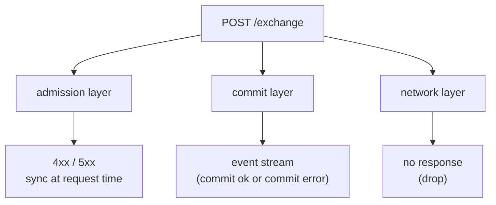
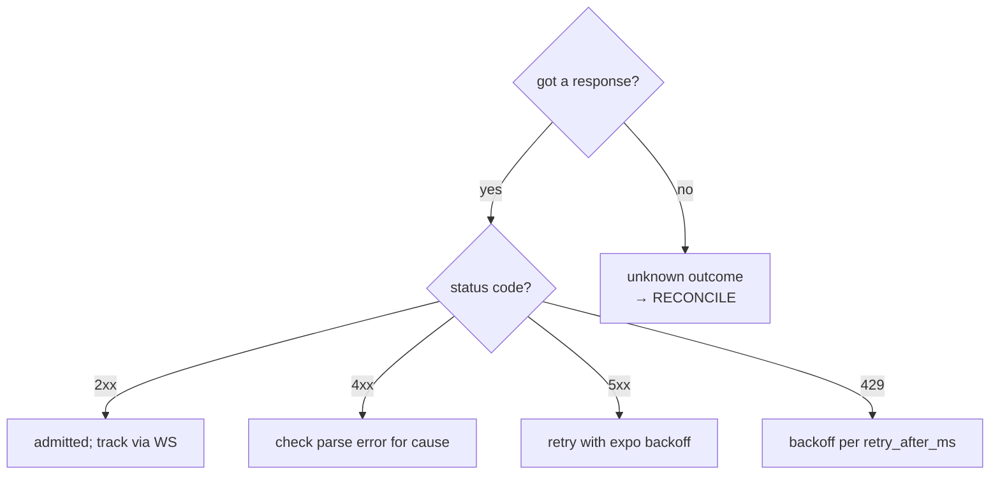
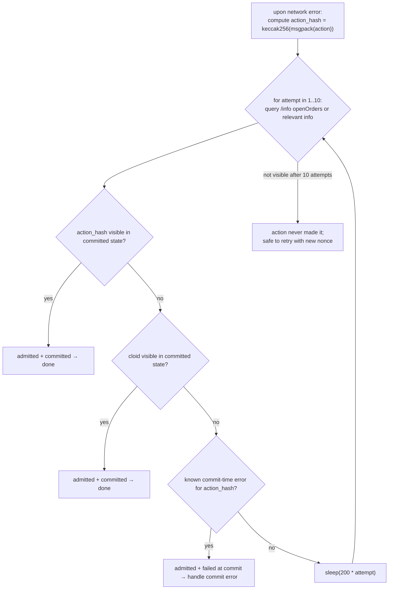

# Manejo de errores

:::tip
**Estable.**
:::

Un árbol de decisión para clientes en producción. El catálogo completo de cadenas de error está en [errores](../api/errors.md); esta página explica qué **hacer** ante cada clase de error.

## Tres capas de fallo



| Capa | Cuándo se activa | Cómo se expone |
|------|-----------------|----------------|
| Admisión | En la solicitud a `/exchange` | Estado HTTP + cuerpo |
| Commit | Al confirmar el bloque, tras la admisión | Push WS de `userEvents` / `orderEvents`, o visible en `userFills` / `openOrders` |
| Red | En cualquier punto | Error TCP, tiempo de espera agotado, respuesta parcial |

Cada capa tiene semántica diferente. Confundirlas es el error de producción más frecuente.

## Árbol de decisión



## Capa 1 — errores de admisión

La solicitud fue analizada pero rechazada en la admisión. Estado `400`, `401`, `404`, `405`, `422`.

| Clase | Ejemplos | Regla de reintento |
|-------|----------|--------------------|
| **Error de cliente** | `400 invalid_msgpack`, `400 unknown_action_variant`, `400 missing_field` | NO reintentar — corregir el código |
| **Error de firma** | `401 signer_not_sender`, `401 unknown_chainId` | NO reintentar — verificar chainId / clave / estado del agente |
| **Error de nonce** | `400 nonce_must_increase` | Incrementar el nonce; reintentar |
| **Lógico** | `422 price_not_tick_aligned`, `422 reduce_only_would_grow` | Calcular el valor correcto; reintentar |
| **Estado** | `422 liquidation_tier_blocks_action`, `422 insufficient_balance` | Recargar fondos / esperar transición de nivel; reintentar |
| **Estado de autenticación** | `401 agent_not_yet_effective` | Esperar un bloque; reintentar |
| **No encontrado** | `404 order_not_found`, `404 account_not_found` | No reintentar; verificar el recurso |

```typescript
async function handleAdmissionResponse(r: Response) {
  if (r.status === 202) return { admitted: true };

  const body = await r.json();
  switch (r.status) {
    case 400:
      // client bug — log loudly, do not retry
      throw new ClientBugError(body.error);

    case 401:
      // signing — depends on the cause
      if (body.error === 'agent not yet effective') {
        // wait + retry
        await sleep(200);
        return { admitted: false, retry: true };
      }
      throw new AuthError(body.error);

    case 422:
      // logical — caller can correct and retry
      throw new LogicalError(body.error);

    case 429:
      await sleep(body.retry_after_ms);
      return { admitted: false, retry: true };

    case 503:
      await sleep(body.retry_after_ms);
      return { admitted: false, retry: true };

    default:
      throw new UnknownError(`${r.status}: ${body.error}`);
  }
}
```

## Capa 2 — errores de commit

La acción fue admitida (`202`) pero falló al confirmar. Solo se notifica a través del flujo de eventos.

| Error | Causa | ¿Reintentar? |
|-------|-------|-------------|
| `reduce_only_violation_post_admit` | La posición cambió entre la admisión y el despacho | SÍ si la intención sigue vigente |
| `stp_rejected` | La prevención de autocruce eliminó la orden | NO — la otra orden del emisor se ejecutó primero |
| `mark_price_band_violation` | El precio de la orden estaba demasiado lejos del precio de marca al despacho | NO — revaluar el precio y recolocar |
| `evicted_under_cap_pressure` | Admitida pero expulsada del mempool antes del bloque | SÍ (con retardo exponencial) |
| `liquidation_pre_empted` | La cuenta pasó a T1+ entre la admisión y el despacho | NO — corregir el margen primero |

Suscríbase a [`userEvents` WS](../api/ws/subscriptions.md#userevents) (los eventos del ciclo de vida de las órdenes viajan por este canal) y despache según el tipo de evento:

```typescript
ws.subscribe('orderEvents', { user: address }, (event) => {
  switch (event.data.kind) {
    case 'resting':       /* order is on the book; track oid */            break;
    case 'partialFill':   /* size partially filled; cloid still on book */ break;
    case 'filled':        /* fully filled; remove from open-order set */   break;
    case 'cancelled':     /* terminal */                                   break;
    case 'error':         /* commit-time error; handle per table above */
      handleCommitError(event.data);
      break;
  }
});
```

## Capa 3 — errores de red

La clase más ambigua. ¿Recibió el servidor la solicitud? ¿Se confirmó la acción?

| Síntoma | Acción |
|---------|--------|
| TCP RST antes de la respuesta | Reconciliar: consultar el estado para determinar el resultado |
| Tiempo de espera de respuesta agotado (definido por usted) | Igual — reconciliar |
| Respuesta parcial o truncada | Igual — reconciliar |
| Conexión rechazada | El servidor no está disponible; reintentar con retardo exponencial |
| Fallo de DNS | Problema de red / DNS; reintentar con retardo exponencial |

### Patrón de reconciliación



El patrón cloid-en-órdenes (véase [idempotencia](./idempotency.md)) hace esto eficiente: consulte las órdenes abiertas y compruebe si su cloid está entre ellas.

Para acciones que no son órdenes, haga coincidir por `action_hash` (determinista a partir de su codificación msgpack local). El feed WS de `userEvents` incluye `action_hash` en cada evento.

## Recetas para producción

### Colocación de órdenes con reintento

```typescript
async function placeOrderSafely(client: Client, order: Order, maxAttempts = 3) {
  const cloid = '0x' + randomBytes(16).toString('hex');
  let lastNonce = Date.now();

  for (let attempt = 1; attempt <= maxAttempts; attempt++) {
    try {
      const res = await client.exchange.order({ ...order, cloid }, { nonce: lastNonce });
      return res;
    } catch (e) {
      if (e instanceof NetworkError) {
        // reconcile via cloid
        const placed = await client.info.findOpenOrderByCloid(client.address, cloid);
        if (placed) return placed;

        // bump nonce and retry
        lastNonce = Date.now();
        continue;
      }
      if (e instanceof RateLimitError) {
        await sleep(e.retryAfterMs);
        lastNonce = Date.now();
        continue;
      }
      throw e;  // client / signing / logical bug — propagate
    }
  }
  throw new Error('order failed after retries');
}
```

### Cancelación con seguridad idempotente

```typescript
async function cancelSafely(client: Client, asset: number, oid: number) {
  try {
    return await client.exchange.cancel({ asset, oid });
  } catch (e) {
    if (e.body?.error === 'order not found') return { alreadyDone: true };
    if (e instanceof NetworkError) {
      // re-query the order
      const orders = await client.info.openOrders(client.address);
      if (!orders.find(o => o.oid === oid)) return { alreadyDone: true };
      // it's still there — actually retry
      return cancelSafely(client, asset, oid);
    }
    throw e;
  }
}
```

### Reconciliación de commits por WS

```typescript
const pendingByHash = new Map<string, PendingAction>();

ws.subscribe('userEvents', { user: address }, (event) => {
  const hash = event.data.action_hash;
  const pending = pendingByHash.get(hash);
  if (!pending) return;

  if (event.data.kind === 'error') pending.reject(new CommitError(event.data));
  else                              pending.resolve(event.data);
  pendingByHash.delete(hash);
});

async function submit(action: Action) {
  const hash = keccak256(msgpack(action));
  const p = new Promise((resolve, reject) => pendingByHash.set(hash, { resolve, reject }));
  await client.exchange.submit(action);
  return Promise.race([p, timeout(5000)]);
}
```

## Casos límite

<details>
<summary>Mostrar casos límite</summary>

- **El gateway devuelve 5xx pero la acción sí se confirmó.** Puede ocurrir si la respuesta post-admisión del gateway se perdió. Trátelo como una caída de red: reconciliar mediante cloid/action_hash.
- **El feed WS está por detrás del estado real.** El búfer de reanudación puede haber descartado los eventos mientras se reconectaba. Vuelva a consultar `/info` al reanudar para anclar el estado; use WS para el seguimiento en tiempo real.
- **El mismo nonce se envía dos veces — uno tiene éxito.** El servidor impone la monotonicidad del nonce; el segundo intento recibe `nonce_too_small` y así confirma que el primero está activo. Use esta señal.
- **Errores lógicos de activación diferida.** Una orden `Trigger` que se admite hoy pero nunca se ejecuta porque su condición de disparo nunca se cumple. No hay error; simplemente es una orden en espera que permanece activa. Reconcilie periódicamente su conjunto de órdenes abiertas con el conjunto esperado por su bot.

</details>

## Véase también

- [Errores](../api/errors.md) — catálogo completo
- [Idempotencia](./idempotency.md) — mecánica de nonce y cloid
- [Suscripciones WS](../api/ws/subscriptions.md) — eventos en tiempo de commit
- [Límites de tasa](../api/rate-limits.md) — controlar el ritmo de los reintentos

## Preguntas frecuentes

<details>
<summary>Mostrar preguntas frecuentes</summary>

**P: ¿Debo tratar los errores de commit como excepciones o como datos?**
R: Como datos. Son resultados ordinarios de una orden: `cancelled` por STP, `error` por reduce-only post-admisión. Registre y gestione según la lógica de negocio; no deje que el sistema falle por ellos.

**P: ¿Hay algún caso en que sea válido ignorar un error de admisión?**
R: En flujos puramente idempotentes (cancelación de una orden inexistente), es aceptable ignorar el `404`. Para todo lo demás, registre en nivel INFO o superior y, o bien reintente, o bien notifique al operador.

**P: ¿Cómo limito los reintentos?**
R: Usando un presupuesto de tiempo de reloj por operación lógica. Para colocación de órdenes, 5 segundos es generoso; para cancelaciones, 2 segundos. Si se supera ese tiempo, notifique al operador o a su monitor de riesgo.

</details>
