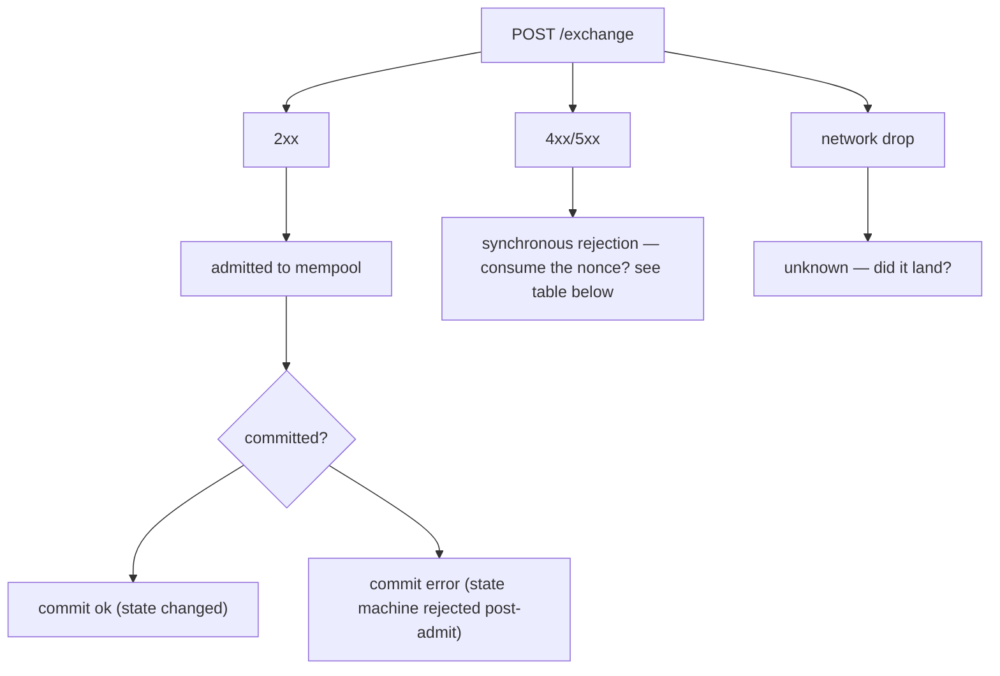
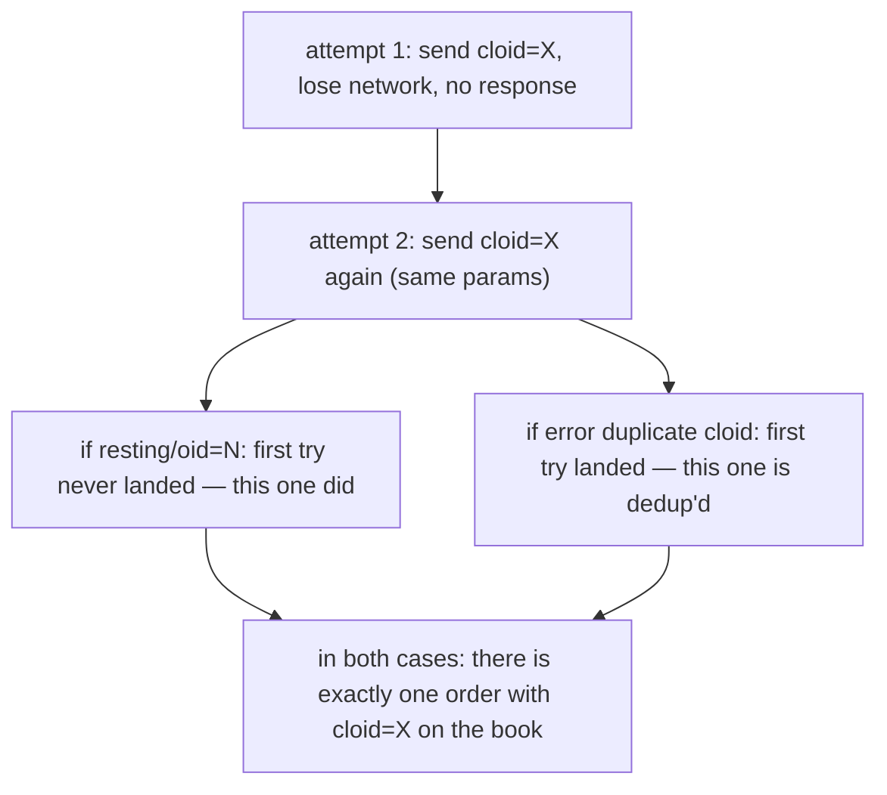
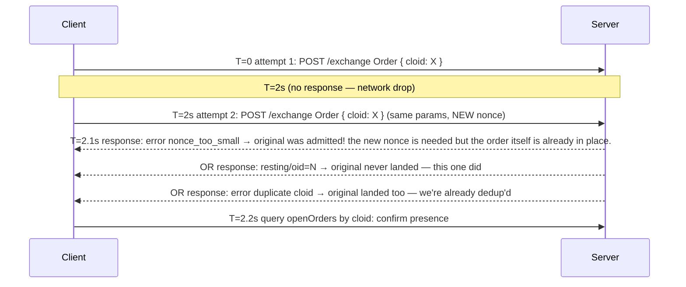

# Idempotencia

:::tip
**Estable.**
:::

Cómo reintentar operaciones de forma segura sin consumir nonces dos veces ni duplicar órdenes.

## Resumen

- Cada acción tiene un `nonce`. Reutilizarlo devuelve `400 nonce_must_increase`.
- Establece un `cloid` único en cada `Order` / `ModifyOrder`; el servidor rechaza `cloid` duplicados en la misma cuenta, por lo que el reintento es seguro.
- Para las acciones que no son órdenes, la **máquina de estados** es naturalmente idempotente (cancelar una orden inexistente es inofensivo; las transferencias están restringidas por la verificación de saldo).
- El modelo de errores de red se divide en tres clases — rechazo en admisión, error en tiempo de confirmación, pérdida de red — cada una con una regla de reintento distinta.

## Las tres clases de error



## Consumo del nonce

| Resultado | ¿Nonce consumido? | ¿Seguro para reintentar? |
|-----------|:-----------------:|:------------------------:|
| `202 admitted` | SÍ | NO — efecto duplicado |
| `400 nonce_must_increase` | NO (ya superado) | NO — enviar con un nonce mayor |
| `400 invalid_msgpack` / otros errores de análisis | NO | SÍ — corregir y reenviar con el mismo nonce |
| `401 signer_*` | NO | NO hasta que se resuelva el problema de firma; el nonce no se consume |
| `422 reduce_only_violation` y otros errores lógicos en tiempo de admisión | NO | SÍ una vez resuelto el problema lógico |
| `429 rate_limit` | NO | SÍ tras `retry_after_ms` |
| `503 mempool_full` | NO | SÍ tras `retry_after_ms` |
| Pérdida de red (sin respuesta) | DESCONOCIDO | RECONCILIAR — ver [reconciliación tras pérdida de red](#reconciliar-tras-pérdida-de-red) a continuación |

La regla: **si una solicitud recibe respuesta del servidor → la decisión sobre el nonce ya está tomada**. La pérdida de red es el único caso ambiguo.

## Estrategia: cloid

Para la colocación de órdenes, el identificador de orden del cliente es el mecanismo de deduplicación más sólido.

```typescript
const cloid = crypto.randomBytes(16);  // 16 bytes

await client.order({
  asset: 0, side: 'Buy', priceE8: '...', sizeE8: '...',
  tif: 'Gtc', cloid: '0x' + cloid.toString('hex'),
});
```

El servidor responde:

| Respuesta del servidor | Significado |
|------------------------|-------------|
| `{"resting":{"oid":N,"cloid":"0x..."}}` | Orden colocada, deduplicación confirmada |
| `{"error":"duplicate cloid"}` | Una solicitud anterior con el mismo cloid fue admitida; **la orden ya está en el libro**. Consúltala por cloid. |
| `{"error":"<other>"}` | Esta entrada falló; puedes reintentar con un cloid nuevo o el mismo |

Regla de reintento para órdenes: **mismo cloid + mismos parámetros** es idempotente de extremo a extremo. Si el primer intento tuvo éxito, el segundo recibe `duplicate cloid` y confirmas que la orden original está vigente.



La misma lógica aplica a `ModifyOrder` — establece un nuevo cloid para la modificación y deduplica la modificación.

## Estrategia: idempotencia de la máquina de estados

La mayoría de las acciones que no son órdenes son idempotentes a nivel de la máquina de estados:

| Acción | ¿Idempotente? | Por qué |
|--------|:-------------:|---------|
| `Cancel` | sí | Cancelar una orden inexistente o ya cancelada devuelve `{"error":"order not found"}` — inofensivo |
| `CancelByCloid` | sí | Igual |
| `UpdateLeverage` | sí | Establecer el apalancamiento al valor actual es una operación sin efecto |
| `UpdateMarginMode` | sí | Igual |
| `UserPortfolioMargin` | sí | Igual |
| `ApproveAgent` | sí | Los mismos datos de aprobación sobrescriben el registro existente |
| `UsdcTransfer` | NO | Transfiere un monto nuevo en cada llamada |
| `WithdrawUsdc` | NO | Igual |
| `Delegate` / `Undelegate` | NO | Agrega a la cola de acciones en cada llamada |

Para las acciones NO idempotentes, utiliza una de estas opciones:
- **El nonce como clave de deduplicación**: registra los nonces que ya has enviado y nunca los envíes dos veces con el mismo nonce. El servidor aplica esto independientemente.
- **Una tabla de deduplicación externa**: mantén un mapa `{request_id → nonce}`; si al reintentar encuentras un nonce existente para ese request_id, la solicitud ya fue enviada.

## Reconciliar tras pérdida de red

Cuando se pierde la respuesta (TCP cerrado, tiempo de espera agotado, etc.) no sabes si la acción fue confirmada. Reconcilia:

### Para órdenes

Consulta por cloid:

```bash
curl -X POST $BASE/info \
  -d '{"type":"openOrders","user":"0x..."}' | jq '.[] | select(.cloid == "0x<cloid>")'
```

Si está presente → fue admitida; trátala como exitosa.
Si está ausente → revisa `userFills` para ver si hubo una ejecución contra ese cloid.
Si aún está ausente → la admisión falló (o fue expulsada del mempool). Envía de nuevo con el mismo cloid.

### Para transferencias / retiros

Consulta el `userFills` de la cuenta (que incluye financiación y transferencias) o `block_info` alrededor del momento de la pérdida. Haz la coincidencia por el action_hash que calculaste localmente — cada acción tiene un hash determinista independientemente del resultado de admisión.

```typescript
const actionHash = keccak256(msgpack(action));
// search for events with this action_hash in WS history or info queries
```

Si no puedes determinar el resultado:
- **Para una acción idempotente**: reintenta de forma segura (usa un nonce nuevo, ya que el anterior podría haber sido consumido).
- **Para una acción no idempotente**: detente; consulta el estado de la cuenta para verificar si el efecto secundario ocurrió; reanuda solo cuando tengas certeza.

## Secuencia — reintento con cloid tras tiempo de espera agotado



El cloid junto con las verificaciones del lado del servidor hacen que el reintento sea seguro incluso cuando la red es inestable.

## Diagnóstico de problemas con el nonce

| Síntoma | Causa | Solución |
|---------|-------|----------|
| `nonce_must_increase` en cada solicitud | Desajuste del reloj local (usando `Date.now()`) | Sincronizar el reloj; o usar un contador monotónico |
| Dos scripts colisionan en el nonce | Comparten la misma cuenta | Usar un servicio de nonce compartido, o un script por cuenta |
| `nonce_too_small` tras reconexión | El contador de nonce local se reinició al valor anterior a la pérdida | Persistir el último nonce enviado entre reinicios |

## Véase también

- [`POST /exchange`](../api/rest/exchange.md) — sobre completo incluyendo `nonce`
- [Errores](../api/errors.md) — cada cadena de error y su remediación
- [Manejo de errores](./error-handling.md) — árbol de decisiones: admisión vs. confirmación vs. red
- [Límites de tasa](../api/rate-limits.md) — controla el ritmo de tus reintentos

## Preguntas frecuentes

<details>
<summary>Mostrar preguntas frecuentes</summary>

**P: ¿Debería usar `Date.now()` o un contador?**
R: `Date.now()` es adecuado para clientes de instancia única. Para clientes de múltiples instancias sobre una misma cuenta, usa un contador monotónico compartido (por ejemplo, `INCR` de Redis) para evitar colisiones entre instancias.

**P: ¿Qué hago si quiero reproducir deliberadamente una acción (flujo idempotente)?**
R: Usa el mismo `cloid` (para órdenes) y un `nonce` nuevo. El servidor aplica la deduplicación mediante el cloid; el nonce solo mantiene la integridad del mensaje en tránsito.

**P: ¿Los cloids son reutilizables después de que la orden original es cancelada o ejecutada?**
R: No. Los cloids son globalmente únicos por cuenta, de forma permanente. Usa uno nuevo para cada orden.

**P: ¿El feed de WebSocket me proporciona confirmación en tiempo de confirmación que pueda usar para reconciliar?**
R: Sí. Suscríbete a `userEvents` y haz la coincidencia por `action_hash` o `cloid`. El feed de WebSocket es la forma recomendada de confirmar el estado de confirmación durante el reintento.

</details>
