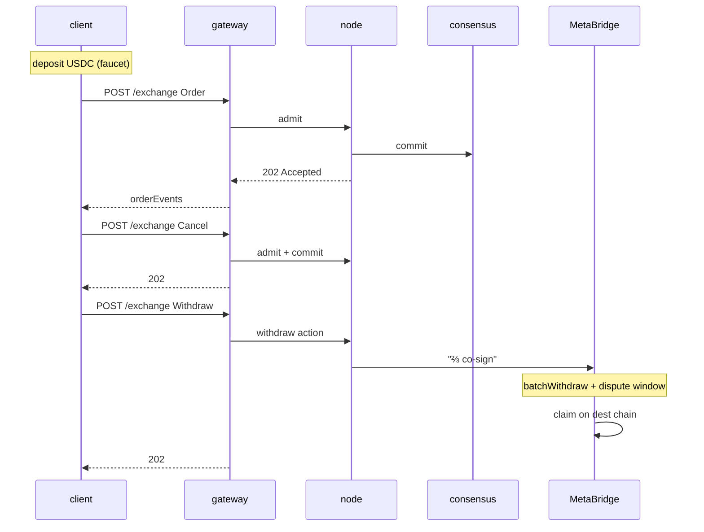

# Inicio rápido — recorrido completo en 5 minutos

:::info
**Estado.** Superficie de comunicación **estable**. Endpoints de Devnet, sin garantía en mainnet.
:::

Depositar, colocar una orden, cancelarla, retirar fondos. Al final de esta página tu sesión en TypeScript / Python / curl habrá completado un ciclo completo de ida y vuelta contra devnet.

## Requisitos previos

- Una clave privada EVM (cualquier hex de 32 bytes; para devnet, generar una nueva — no reutilices una clave de mainnet)
- USDC en una cadena de origen de MetaBridge (Base; Solana y Arbitrum en proceso de integración) — en devnet se puede usar la ruta del faucet en su lugar
- `curl` o cualquier cliente HTTP

## Endpoints

El gateway es la única puerta de entrada pública. MTF-native es la ruta por defecto;
HL-compat vive bajo `/hl/*`.

| Servicio | URL (devnet) |
|---------|--------------|
| Puerta de entrada del gateway | `https://devnet-gateway.mtf.exchange` |
| MTF-native (por defecto) | `POST /info` · `POST /exchange` · `GET /ws` |
| HL-compat | `POST /hl/info` · `POST /hl/exchange` · `GET /hl/ws` |
| CCXT-compat | `/ccxt/*` |
| EVM JSON-RPC | `POST /evm` |
| Faucet (devnet) | `POST /faucet` |
| Explorador | `https://devnet.mtf.exchange/explorer` |

> El faucet **no** es un servicio separado — es la ruta `POST /faucet` del
> gateway. ¿Ejecutas el nodo tú mismo? La misma superficie nativa
> (`/info` · `/exchange` · `/ws` · `/faucet`) se sirve directamente en
> `http://localhost:8080`. Consulta [`POST /faucet`](../api/rest/faucet.md).

Consulta [redes](../networks.md) para la lista completa, incluidas testnet y mainnet (tras el lanzamiento).

## Paso 1 — Obtener USDC en devnet

```bash
curl -X POST https://devnet-gateway.mtf.exchange/faucet \
  -H 'content-type: application/json' \
  -d '{"address":"0x<YOUR_ADDRESS>"}'
# -> {"address":"0x…","usdc":3000,"mtf":10,"status":"queued"}
```

Una reclamación otorga **3000 USDC** como colateral cruzado **y 10 MTF** en tokens spot —
**una única vez por dirección** (una segunda reclamación devuelve `429 address already funded`),
con límite de 1 solicitud / minuto / IP. El parámetro opcional `amount` solo reduce el monto de USDC
*hacia abajo* (≤ 3000); MTF es fijo. La concesión queda en estado `"queued"` — se confirma ~1 bloque
después, así que espera un momento antes de verificar el saldo:

Los curl directos que aparecen a continuación utilizan el formato **HL-compat** bajo `/hl/*` en el gateway
(tipos en camelCase como `clearinghouseState` / `openOrders`, envelopes firmados con msgpack)
— práctico si ya tienes un cliente HL. Los ejemplos con `@metaflux/sdk`
usan MTF-native en la ruta por defecto del gateway (`/info` · `/exchange`).
Elige una vía; ambas pasan por la misma puerta de entrada, solo difieren en la ruta.

```bash
curl -X POST https://devnet-gateway.mtf.exchange/hl/info \
  -H 'content-type: application/json' \
  -d '{"type":"clearinghouseState","user":"0x<YOUR_ADDRESS>"}'
```

Deberías ver `marginSummary.accountValue: "3000.0"`.

## Paso 2 — Colocar una orden límite

El flujo de firma completo se describe en [firma](./signing.md). Para este inicio rápido usa el SDK oficial de TypeScript (`@metaflux/sdk` — disponible antes del mainnet; consulta [SDK de TypeScript](./typescript-sdk.md)).

```typescript
import { MetaFluxClient } from '@metaflux/sdk';

const client = new MetaFluxClient({
  privateKey: process.env.PRIVATE_KEY!,
  baseUrl:    'https://devnet-gateway.mtf.exchange', // MTF-native is the gateway default path
  chainId:    31337,
});

const meta = await client.info.meta();
const btcId = meta.universe.findIndex(m => m.name === 'BTC');

const result = await client.exchange.order({
  asset:    btcId,
  isBuy:    true,
  price:    '50000',
  size:     '0.1',
  tif:      'Gtc',
  reduceOnly: false,
});

console.log('order id:', result.oid);
```

Curl directo (formato HL-compat — construyes la firma tú mismo; consulta [firma](./signing.md)):

```bash
curl -X POST https://devnet-gateway.mtf.exchange/hl/exchange \
  -H 'content-type: application/json' \
  -d @order.json
```

donde `order.json` es el envelope en formato HL que armaste.

### Ejemplo de trading spot

El mercado [spot](../products/spot.md) es un CLOB de token por token, separado de
los contratos perpetuos — sin apalancamiento, sin posiciones. Coloca una orden spot con la acción nativa
[`spot_order`](../api/rest/exchange.md#spot_order): recibe un **id de par spot**
(no un `market` de perpetuos), un `side`, un `limit_px`, un `size` y un `tif`. Una
orden en reposo `gtc`/`alo` bloquea el saldo reservado en depósito de garantía; `ioc` nunca queda en reposo.

```jsonc
// the `action` you sign and POST to /exchange (sender-authorized, no `owner`)
{
  "type": "spot_order",
  "order": {
    "pair":     200,           // spot pair id from /info, not a perp market id
    "side":     "bid",         // bid = buy base (pays quote); ask = sell base
    "size":     100000000,
    "limit_px": 200000000,     // a limit is required — market spot is not yet supported
    "tif":      "gtc",
    "stp_mode": "cancel_oldest"
  }
}
```

La respuesta sincrónica incluye el `oid` asignado con una entrada `resting` o `filled`
(la misma unión de estados que una orden de perpetuos). Consulta tus saldos spot y las
órdenes spot abiertas mediante [`POST /info`](../api/rest/info.md); cancela con
[`spot_cancel`](../api/rest/exchange.md#spot_cancel), que reembolsa el depósito de garantía.

## Paso 3 — Verificar que la orden está en el libro

```bash
curl -X POST https://devnet-gateway.mtf.exchange/hl/info \
  -H 'content-type: application/json' \
  -d '{"type":"openOrders","user":"0x<YOUR_ADDRESS>"}'
```

Deberías ver tu orden con el `oid` del paso 2.

O bien, suscríbete a actualizaciones en tiempo real (recomendado para cualquier uso no trivial):

```typescript
const ws = client.ws();
ws.subscribe('userEvents', { user: client.address }, (event) => {
  console.log('event:', event);
});
```

## Paso 4 — Cancelar

```typescript
await client.exchange.cancel({ asset: btcId, oid: result.oid });
```

```bash
# curl directo
curl -X POST https://devnet-gateway.mtf.exchange/hl/exchange \
  -d @cancel.json
```

## Paso 5 — Retirar fondos

```typescript
await client.exchange.withdrawUsdc({
  amount:           '100',
  destinationChain: 'Arbitrum',
  destinationAddr:  '0x<DESTINATION>',
});
```

Esto encola un retiro a través de MetaBridge. Una vez que el conjunto de validadores de MetaFlux lo co-firme alcanzando un quórum ponderado por stake de ⅔ y transcurra el período de disputa (unos minutos), podrás ejecutar `claim` en la cadena de destino (consulta [bridge](../bridge/)).

## ¿Qué acaba de ocurrir?



## Próximos pasos

- [Firma](./signing.md) — qué hay dentro del proceso de firma del SDK
- [Wallets de agente en la práctica](./agent-wallets-howto.md) — patrón de clave activa para producción
- [Tipos de órdenes](../concepts/order-types.md) — más allá de las órdenes límite simples
- [Manejo de errores](./error-handling.md) — admisión vs confirmación vs red
- [Suscripciones WS](../api/ws/subscriptions.md) — datos en tiempo real mediante push
- [Migración desde HL](./migrating-from-hl.md) — ¿ya tienes un bot de HL? empieza por esta página

## Solución de problemas

<details>
<summary>Mostrar solución de problemas</summary>

| Síntoma | Causa probable | Solución |
|---------|--------------|-----|
| `401 signer is not the sender` | `chainId` incorrecto | Usa `31337` para devnet |
| `400 invalid msgpack` | El codificador reordena las claves del mapa | Usa una librería msgpack que cumpla con el estándar |
| `404 unknown user` en info | La dirección aún no tiene estado on-chain | Deposita primero (faucet) |
| `429 rate limit` | Demasiadas solicitudes | Consulta [límites de tasa](../api/rate-limits.md); reduce la frecuencia |
| Retiro bloqueado en destino | Retiro de MetaBridge pendiente (período de disputa) | Espera la co-firma de ⅔ + el período de disputa; luego ejecuta `claim` en la cadena de destino (consulta [bridge](../bridge/)) |

</details>

## Véase también

- [Redes](../networks.md) — endpoints de devnet / testnet / mainnet + chainIds
- [Firma](./signing.md) — la especificación completa del envelope
- [`POST /exchange`](../api/rest/exchange.md)
- [`POST /info`](../api/rest/info.md)
- [WS](../api/ws/index.md)
