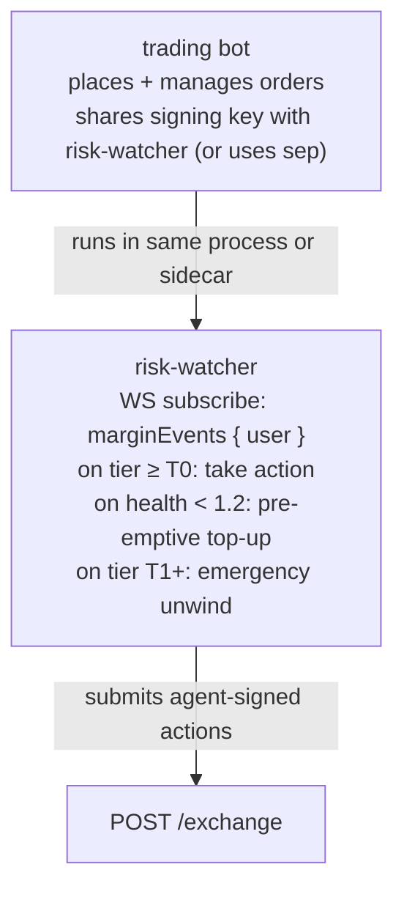

# Patrón de vigilancia de riesgo

:::tip
**Estable.**
:::

Un vigilante de riesgo es un proceso automatizado que monitorea la salud de tu cuenta e interviene —depositando margen, reduciendo posiciones o realizando operaciones defensivas— antes de que la escalera de [liquidación por niveles](../concepts/tiered-liquidation.md) del protocolo se active en tu contra.

Los bots de trading en producción que mantienen posiciones durante la noche deberían ejecutar uno. El aviso amarillo T0 del protocolo te da un bloque (~100 ms); un vigilante de riesgo aprovecha ese bloque de forma productiva.

## Resumen

Suscríbete a `marginEvents`, reacciona a las transiciones de nivel, y recarga mediante `UpdateIsolatedMargin` (aislado) o `Deposit` (cruzado) antes de que `maint_margin` se vuelva vinculante.

## Arquitectura



El vigilante es un proceso lógico independiente aunque esté co-localizado: sus decisiones son independientes de las decisiones de la estrategia de trading. Un fallo común es confundir "¿debo cerrar esta posición?" con "¿debo tomar esta operación?"; los vigilantes de riesgo responden únicamente la primera pregunta.

## Entradas

- Push WS `marginEvents`: `account_value`, `maint_margin`, `health` y `tier` en tiempo real.
- Push WS `mark` (por activo mantenido): para estimaciones prospectivas.
- Push WS `fundingTicks`: para anticipar los cargos de financiación por hora.

## Reglas de reacción

| Disparador | Acción | Fundamento |
|---------|--------|-----------|
| `health < 1.5` y cayendo durante 5 muestras consecutivas | Depósito preventivo para llevar la salud a 1.8 | Margen de seguridad antes de T0 |
| `transición de nivel a T0` | Depósito inmediato O cierre parcial | Un bloque para actuar antes de T1 |
| `transición de nivel a T1` | Emergencia: cierre total de la posición con mayor pérdida | Anticiparse al cierre parcial forzado a un precio peor |
| `pago de financiación en el próximo 1 minuto > 0.5 × free_collateral` | Depósito preventivo | El cargo de financiación puede llevarte a T0 |
| El mark se mueve > 3× la sigma reciente de 1h en 30s | Captura de posiciones + alerta al operador | Posible cambio de régimen |

Ajusta los umbrales a tu estrategia. Creadores de mercado agresivos: búferes más ajustados (piso de salud en 1.3). Libros conservadores: más holgados (piso de salud en 1.8).

## Esquema de implementación (TypeScript)

```typescript
import { MetaFluxClient } from '@metaflux/sdk';

const trader = new MetaFluxClient({ /* trading agent */ });
const watcher = new MetaFluxClient({ /* dedicated watcher agent */ });

const TARGET_HEALTH = 1.8;
const T0_DEPOSIT_USDC = 1000;  // tune to position size

let recentSamples: number[] = [];

watcher.ws().subscribe('marginEvents', { user: trader.address }, async (event) => {
  const { health, tier, account_value, maint_margin } = event.data;

  recentSamples.push(health);
  if (recentSamples.length > 5) recentSamples.shift();

  // Tier-based reactions
  if (tier === 'T1') {
    console.log('[ALERT] T1 — emergency unwind');
    await emergencyUnwind(trader);
    return;
  }
  if (tier === 'T0') {
    console.log('[WARN] T0 — top up');
    await deposit(watcher, T0_DEPOSIT_USDC);
    return;
  }

  // Pre-emptive
  const allFalling = recentSamples.length === 5
    && recentSamples.every((h, i) => i === 0 || h < recentSamples[i-1]);
  if (allFalling && health < 1.5) {
    console.log('[INFO] pre-emptive top-up');
    const needed = Math.ceil((TARGET_HEALTH * maint_margin - account_value) / 1e6);
    await deposit(watcher, needed);
  }
});

async function deposit(c: MetaFluxClient, usdc: number) {
  // For Cross: assume USDC already in the master's free balance
  // For Isolated: use UpdateIsolatedMargin to add to the bucket
  await c.exchange.updateIsolatedMargin({
    asset: 0,
    isIsolated: true,
    isolatedAmount: (usdc * 1e6).toString(),
  });
}

async function emergencyUnwind(c: MetaFluxClient) {
  const state = await c.info.clearinghouseState();
  for (const pos of state.assetPositions) {
    // close the largest-loss position first
    await c.exchange.order({
      asset: pos.coin,
      isBuy: pos.szi < 0,    // opposite side closes
      price: '0',            // market (extreme price)
      size:  Math.abs(pos.szi).toString(),
      tif:   'Ioc',
      reduceOnly: true,
    });
  }
}
```

## Decisiones clave

- **Agente separado para el vigilante.** El agente del trader realiza el trading; el agente del vigilante gestiona el margen. Si el host de trading se ve comprometido, esto no permite la manipulación del margen.
- **Autoridad del vigilante.** Los agentes pueden enviar `UpdateIsolatedMargin` y colocar/cancelar órdenes. Los agentes NO PUEDEN retirar fondos, por lo que el vigilante no puede mover fondos fuera de la cuenta —solo entre sub-buckets—. Esto es lo deseado.
- **Espacio de nonce del vigilante.** El vigilante y el trader comparten el espacio de nonce del maestro (según las [carteras de agente](../concepts/agent-wallets.md)). Utiliza `Date.now()` en ambos: el riesgo de colisión es de sub-milisegundo.

## Matemática del depósito previo

Para llevar la salud de H₀ al objetivo H₁:

```
needed_deposit = (H₁ - H₀) × maint_margin
```

Ejemplo: maint = 10 USDC, salud actual 1.0, objetivo 1.5.
needed = (1.5 - 1.0) × 10 = 5 USDC.

Limita el depósito por bloque de tu vigilante para evitar gastar demasiado en un régimen transitorio. Valor predeterminado agresivo: 1× el nocional de la posición reservado para recargas; una vez agotado, escalar al operador.

## Secuencia — recarga preventiva

```mermaid
sequenceDiagram
    Note over Watcher: T = 0  health = 1.6 (Safe)
    Note over Watcher: T = 1s  mark drops 1%; health = 1.4 → sample drop
    Note over Watcher: T = 2s  mark drops 0.5%; health = 1.3 → 2nd drop
    Note over Watcher: T = 3s  ... → 3rd
    Note over Watcher: T = 4s  ... → 4th
    Note over Watcher: T = 5s  health = 1.0 → 5 samples falling; pre-empt
    Note over Watcher: T = 5s  compute needed = (1.8 - 1.0) × maint = 0.8 × maint
    Watcher->>Exchange: T = 5.1s  submit UpdateIsolatedMargin deposit
    Exchange-->>Watcher: T = 5.2s  202 admitted
    Note over Exchange: T = 5.3s  commit; health = 1.8 → Safe
    Exchange-->>Watcher: T = 5.3s  marginEvents push: tier=Safe; reaction loop continues
```

## Modos de fallo

- **Carrera entre vigilante y trader.** El trader envía una nueva posición; el vigilante reacciona a la posición en vuelo. Solución: reaccionar solo después del commit (los eventos de margen se disparan al confirmar, por lo que esto ya es así).
- **El agente propio del vigilante ha expirado.** En medio de una situación de estrés, el vigilante no puede actuar. Mitigación: cadencia de rotación ajustada, monitoreo del vencimiento del agente, nunca con menos de 24h para el vencimiento.
- **Mempool lleno durante el estrés.** El depósito del vigilante recibe un 503. Reintenta con backoff exponencial con jitter; envía como máximo cada 100ms.
- **El depósito tiene éxito pero el oráculo sigue siendo desfavorable.** El depósito aumenta el `account_value`; si `maint` también subió (el mark se movió en tu contra), la salud puede no mejorar lo suficiente. Ciclo: reevalúa tras el commit; deposita nuevamente o deshaz la posición.

## Cuándo NO desplegar un vigilante de riesgo

- Posiciones de muy corta duración (abiertas y cerradas dentro de un solo bloque): la salud no es relevante.
- Trading puramente al contado sin margen: no aplica la escalera de liquidación.
- Bots de posición única totalmente aislada donde has aceptado explícitamente el límite de pérdida del bucket: automatizar las recargas anula el efecto de cortafuegos.

## Véase también

- [Liquidación por niveles](../concepts/tiered-liquidation.md) — la escalera contra la que te defiendes
- [WS `userEvents`](../api/ws/subscriptions.md#userevents) — las transiciones de margen/nivel viajan por este canal
- [`update_isolated_margin`](../api/rest/exchange.md#update_isolated_margin)
- [Carteras de agente](../concepts/agent-wallets.md) — el vigilante necesita su propio agente aprobado
- [Manejo de errores](./error-handling.md) — para la lógica de reintento del envío de depósitos
