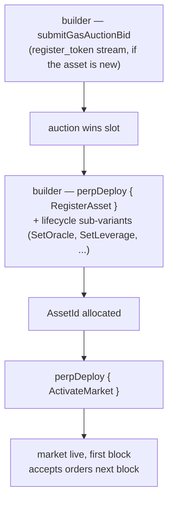

# MIP-3 — Despliegue de mercado de contratos perpetuos sin permisos

:::info
**Implementado.**
:::

Cualquier desarrollador puede desplegar un nuevo mercado de contratos perpetuos en MetaFlux pagando a través de una subasta de gas en cadena. No existe ninguna barrera impuesta por el equipo del protocolo, ningún comité de revisión ni lista de acceso permitido. El precio de la subasta más un depósito mínimo son las únicas barreras. (El despliegue de mercados **al contado** sin permisos es la propuesta hermana, [MIP-1](./mip-1.md).)

## Por qué existe esto

Es una capacidad fundamental del protocolo. Los exchanges centralizados seleccionan sus listados; MetaFlux convierte el propio proceso de listado en parte del protocolo. Los desarrolladores que deseen un mercado para un activo de nicho no necesitan permiso — necesitan ganar una subasta y proporcionar los parámetros iniciales.

Esta es la adaptación de MetaFlux del diseño de despliegue de mercados sin permisos que fue pionero en los principales venues de contratos perpetuos en cadena, con las siguientes equivalencias y ajustes preservados:

- Tres flujos distintos de subasta de gas (`perp_deploy_gas_auction`, `spot_pair_deploy_gas_auction`, `register_token_gas_auction`) — misma estructura que HL. El despliegue de perpetuos corresponde a MIP-3; los flujos al contado remiten a [MIP-1](./mip-1.md).
- Parámetros de subasta (decaimiento, ventana de reembolso, intervalo de slot) configurables por gobernanza
- Ratio de mantenimiento inicial, apalancamiento máximo y límite de financiamiento — enviados junto con la oferta de despliegue, acotados por rangos definidos por gobernanza

## Flujo de despliegue



El despliegue de perpetuos se realiza mediante la acción `perpDeploy`, despachada por una sub-variante de `PerpDeployKind` que cubre el ciclo de vida completo del mercado (8 sub-variantes):

1. **`RegisterAsset`** — registra un nuevo activo perpetuo; asigna un `AssetId`. (Requiere que el símbolo del token esté registrado primero, a través del flujo `register_token_gas_auction`, si aún no lo está.)
2. **`SetOracle`** — vincula o rota el subconjunto de fuentes de oráculo para el activo.
3. **`SetLeverage`** — establece el límite máximo de apalancamiento.
4. **`SetFeeTier`** — establece el nivel de comisión para el creador y el tomador de mercado (en bps, acotado por los límites por mercado).
5. **`SetMakerRebate`** — establece el reembolso para el creador de mercado (en bps, ≤ 2).
6. **`SetMinSize`** — establece el tamaño mínimo de orden para el mercado.
7. **`ActivateMarket`** — activa el mercado (habilita el trading; requiere configuración completa).
8. **`DeactivateMarket`** — cierra el mercado a nuevas órdenes (las posiciones existentes permanecen).

Ganar un slot de despliegue requiere pasar por la subasta de gas: el desarrollador llama a **`submitGasAuctionBid { auction_kind, bid_amount, ... }`** contra el flujo correspondiente. Cada oferta incluye:
- Un monto en USDC, depositado en garantía al enviar y reembolsado en caso de perder (menos una pequeña comisión).
- La especificación del mercado — apalancamiento inicial, ratio de margen de mantenimiento, parámetros de financiamiento y configuración de fuentes de oráculo.

Las subastas se resuelven en los límites de bloque — el mejor postor por slot gana; el monto pagado se quema (no se entrega a nadie), y los parámetros de la especificación se convierten en los parámetros del mercado desplegado.

## Garantía de oferta y reembolso

Las ofertas se mantienen en garantía mientras la subasta está en curso. En caso de perder, la oferta se devuelve a la cuenta del desarrollador menos una pequeña comisión de subasta. En caso de ganar, el monto ganador se quema al cierre del slot (no se entrega a nadie).

Las ofertas activas son visibles a través de:

```json
POST /info { "type": "mip3_active_bids" }
```

## Límites de parámetros

La gobernanza establece los rangos dentro de los cuales deben estar los parámetros de especificación de las ofertas:

- Apalancamiento inicial en `[1, max_leverage]` (valor predeterminado `max_leverage = 50`)
- Ratio de margen de mantenimiento ≥ `min_maintenance_ratio` (predeterminado 1%)
- Límite de financiamiento ≤ `max_funding_per_hour` (predeterminado 0,5%)
- Fuente de oráculo de la lista aprobada

Las ofertas con parámetros fuera de rango son rechazadas en el momento del envío.

## Parámetros de subasta

Por flujo (perpetuos / al contado / registro de token), la subasta tiene:

- **Intervalo de slot** — con qué frecuencia se liquida una nueva subasta (gobernanza, predeterminado 1 hora)
- **Decaimiento** — cómo declina la oferta mínima si un slot queda sin reclamar (gobernanza, predeterminado lineal a lo largo de 24 h)
- **Ventana de reembolso** — cuánto tiempo después del cierre del slot pueden los postores perdedores reclamar reembolsos (gobernanza, predeterminado 7 días)

Los tres son modificables por gobernanza a través de la acción `SetGlobal` (variables globales de gobernanza de desarrolladores MIP-3: `SetGasAuctionDuration`, `SetMinDeployStake`, `SetGasAuctionMinBid`, `SetDeployerFeeCap`, `SetPerMarketLimits`, `SetEnableMip3`).

## Después del despliegue

El nuevo mercado queda registrado en el registro canónico de activos a partir del siguiente bloque. La liquidez es responsabilidad del desarrollador; el protocolo no proporciona órdenes iniciales.

Los desarrolladores suelen inicializar la profundidad combinando un despliegue MIP-3 con una fuente de liquidez en el mismo mercado — [MIP-2 Metaliquidity](./mip-2.md), un creador de mercado externo atraído por los reembolsos de comisiones al desarrollador, o un vault creado por usuarios.

## MIP-4

Consulte [MIP-4 — agregador/internalizador de liquidez de perpetuos](mip-4.md) para conocer el agregador operado por MetaFlux que complementa el despliegue sin permisos.

## Véase también

- [MIP-1 — estándar de tokens al contado + despliegue de mercado](./mip-1.md) — el equivalente al contado del despliegue sin permisos
- [Liquidación escalonada](../concepts/tiered-liquidation.md) — se aplica a los mercados desplegados mediante MIP-3 igual que a los listados por el protocolo
- [Margen de cartera](../concepts/portfolio-margin.md) — los mercados MIP-3 se incorporan al margen de cartera (PM) a través de la inclusión estándar de escenarios
