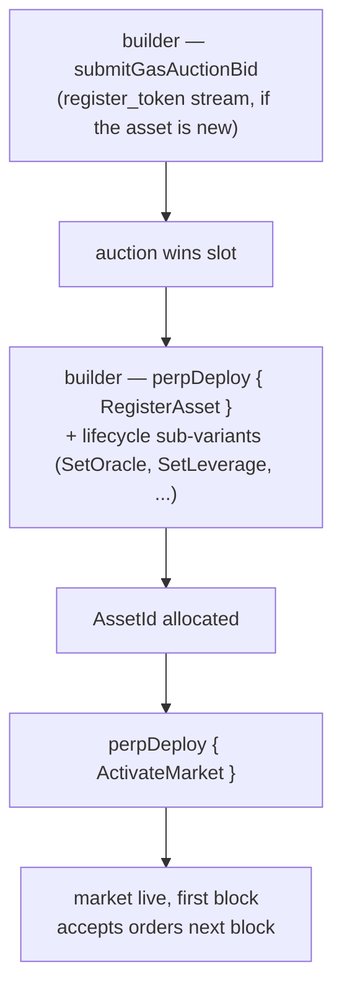

# MIP-3 — Despliegue de mercado de perpetuos sin permisos

:::info
**Implementado.**
:::

Cualquier desarrollador puede desplegar un nuevo mercado de contratos perpetuos en MetaFlux pagando a través de una subasta de gas on-chain. No existe ninguna restricción por parte del equipo del protocolo, ningún comité de revisión ni lista de acceso autorizado. El precio de la subasta más un depósito mínimo son las únicas barreras de entrada. (El despliegue de mercados **spot** sin permisos es la propuesta hermana, [MIP-1](./mip-1.md).)

## Por qué existe esto

Es un eje de diferenciación central. Los exchanges centralizados curan sus listados; MetaFlux convierte el propio proceso de listado en parte del protocolo. Los desarrolladores que quieran un mercado para un activo de nicho no necesitan ningún permiso — solo necesitan ganar una subasta y suministrar los parámetros iniciales.

Esta es la adaptación de MetaFlux del diseño de despliegue de mercados sin permisos que fue pionero en los principales venues de perpetuos on-chain, con las siguientes equivalencias y ajustes:

- Tres flujos de subasta de gas independientes (`perp_deploy_gas_auction`, `spot_pair_deploy_gas_auction`, `register_token_gas_auction`) — misma estructura que HL. El despliegue de perpetuos corresponde a MIP-3; los flujos spot remiten a [MIP-1](./mip-1.md).
- Los parámetros de la subasta (decaimiento, ventana de reembolso, intervalo de slot) son configurables mediante gobernanza
- El ratio de mantenimiento inicial, el apalancamiento máximo y el tope de financiación se envían junto con la oferta de despliegue, acotados por los rangos fijados por la gobernanza

## Flujo de despliegue



El despliegue de perpetuos se realiza mediante la acción `perpDeploy`, despachada por una sub-variante `PerpDeployKind` que cubre el ciclo de vida completo del mercado (8 sub-variantes):

1. **`RegisterAsset`** — registra un nuevo activo perpetuo; asigna un `AssetId`. (Requiere que el símbolo del token esté registrado previamente a través del flujo `register_token_gas_auction`, si aún no lo está.)
2. **`SetOracle`** — vincula o rota el subconjunto de fuentes de oráculo para el activo.
3. **`SetLeverage`** — establece el tope de apalancamiento máximo.
4. **`SetFeeTier`** — establece el nivel de comisiones para el creador/tomador de mercado (en bps, limitado por los topes por mercado).
5. **`SetMakerRebate`** — establece el rebate para el creador de mercado (en bps, ≤ 2).
6. **`SetMinSize`** — establece el tamaño mínimo de orden para el mercado.
7. **`ActivateMarket`** — activa el mercado (permite la negociación; requiere configuración completa).
8. **`DeactivateMarket`** — cierra el mercado a nuevas órdenes (las posiciones existentes permanecen abiertas).

Ganar un slot de despliegue requiere pasar por la subasta de gas: el desarrollador llama a **`submitGasAuctionBid { auction_kind, bid_amount, ... }`** contra el flujo correspondiente. Cada oferta incluye:
- Un importe en USDC, depositado en custodia al enviarse y reembolsado en caso de perder (menos una pequeña comisión).
- La especificación del mercado — apalancamiento inicial, ratio de margen de mantenimiento, parámetros de financiación y configuración de fuentes de oráculo.

Las subastas se resuelven en los límites de bloque — el mejor postor por slot gana, el importe pagado se quema (no se transfiere a nadie) y los parámetros de la especificación pasan a ser los parámetros del mercado desplegado.

## Custodia y reembolso de ofertas

Las ofertas se mantienen en custodia mientras la subasta está en curso. En caso de perder, la oferta se devuelve a la cuenta del desarrollador descontando una pequeña comisión de subasta. En caso de ganar, el importe ganador se quema al cierre del slot (no se transfiere a nadie).

Las ofertas activas son visibles mediante:

```json
POST /info { "type": "mip3_active_bids" }
```

## Límites de parámetros

La gobernanza establece los rangos dentro de los cuales deben estar los parámetros de la especificación de la oferta:

- Apalancamiento inicial en `[1, max_leverage]` (por defecto `max_leverage = 50`)
- Ratio de margen de mantenimiento ≥ `min_maintenance_ratio` (por defecto 1%)
- Tope de financiación ≤ `max_funding_per_hour` (por defecto 0,5%)
- Fuente de oráculo de la lista aprobada

Las ofertas con parámetros fuera de rango son rechazadas en el momento del envío.

## Parámetros de la subasta

Por cada flujo (perpetuos / spot / registro de token), la subasta tiene:

- **Intervalo de slot** — con qué frecuencia se liquida una nueva subasta (gobernanza, por defecto 1 hora)
- **Decaimiento** — cómo disminuye la oferta mínima si un slot queda sin reclamar (gobernanza, por defecto lineal en 24 h)
- **Ventana de reembolso** — cuánto tiempo después del cierre del slot pueden los postores perdedores reclamar sus reembolsos (gobernanza, por defecto 7 días)

Los tres son modificables mediante gobernanza a través de la acción `SetGlobal` (variables globales de gobernanza de desarrolladores MIP-3: `SetGasAuctionDuration`, `SetMinDeployStake`, `SetGasAuctionMinBid`, `SetDeployerFeeCap`, `SetPerMarketLimits`, `SetEnableMip3`).

## Tras el despliegue

El nuevo mercado queda registrado en el registro de activos canónico a partir del bloque siguiente. La liquidez es responsabilidad del desarrollador; el protocolo no proporciona órdenes iniciales de siembra.

Los desarrolladores suelen arrancar la profundidad de mercado combinando un despliegue MIP-3 con una fuente de liquidez en el mismo mercado — [MIP-2 Metaliquidity](./mip-2.md), un creador de mercado externo atraído por los rebates de comisiones del desarrollador, o un vault creado por usuarios.

## MIP-4

Consulta [MIP-4 — agregador/internalizador de liquidez de perpetuos](mip-4.md) para conocer el agregador operado por MetaFlux que complementa el despliegue sin permisos.

## Véase también

- [MIP-1 — estándar de token spot + despliegue de mercado](./mip-1.md) — el equivalente spot del despliegue sin permisos
- [Liquidación por niveles](../concepts/tiered-liquidation.md) — se aplica a los mercados desplegados con MIP-3 igual que a los listados por el protocolo
- [Margen de cartera](../concepts/portfolio-margin.md) — los mercados MIP-3 se incorporan al margen de cartera (PM) mediante la inclusión de escenarios estándar
