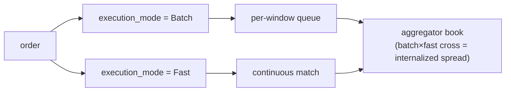

# MIP-4 — Agregador / Internalizador de Liquidez para Perpetuos

:::info
**Planificado.** Previsto para V2; fuera del alcance del mainnet v1.
:::

MIP-4 es un **agregador / internalizador de liquidez para contratos perpetuos** operado por MetaFlux — un intermediario mayorista que absorbe el flujo de órdenes entrantes contra su propio libro y retiene el diferencial de internalización. El modelo está tomado directamente de la estructura de mercado de renta variable, donde un único mayorista que gestiona una gran cuota del flujo minorista opera la línea de negocio más rentable del sector. MIP-4 lleva ese patrón a los perpetuos on-chain.

## Por qué existe

Un eje de diferenciación basado en capacidades: en lugar de competir en amplitud de listado (eso es [MIP-3](./mip-3.md)), MIP-4 compite en calidad de ejecución para el flujo minorista. Al internalizar el flujo contra su propio libro de órdenes en reposo, el agregador puede recuperar el diferencial que de otro modo se pagaría como comisiones de maker — y devolver parte de ese valor al usuario en forma de mejora de precio. Ese es el mismo argumento que hace un mayorista de corretaje minorista: "el mejor precio, a menudo mejor que el techo del libro".

Se combina de forma natural con una interfaz minorista al estilo Robinhood construida sobre los SDKs de cliente existentes — una solución de producto/frontend, no de protocolo.

## Qué es

Un nuevo modo de mercado y capa de protocolo que:

1. **Gestiona su propio libro de órdenes por activo** — `BTC-AGG`, `ETH-AGG`, `SOL-AGG`, etc. — junto a los mercados MIP-3 correspondientes (`BTC`, `ETH`, `SOL`). El libro del agregador es independiente del CLOB canónico, con su propia estructura de precio y profundidad.
2. **Ejecuta en dos niveles**, seleccionados por orden mediante el campo `execution_mode`:
   - **Batch** (comisión baja, ~1–2 bps de taker) — las órdenes se acumulan en una cola por ventana y se liquidan a un precio único cada `batch_window_ms` (por defecto 200–300 ms). Liquidación a precio uniforme al estilo FBA dentro del propio libro del agregador. Etiqueta en la interfaz: "Mejor Precio".
   - **Fast** (comisión más alta, ~5–8 bps de taker) — las órdenes se casan de forma continua contra el libro en reposo del agregador al mejor precio disponible. Etiqueta en la interfaz: "Instantáneo".
3. **Captura el diferencial de internalización** — cuando el flujo batch cruza contra el flujo fast (o dos órdenes batch se cruzan entre sí), el agregador se sitúa en el medio y captura el diferencial. Este es el verdadero motor de ingresos.

Para los mercados del agregador, el campo `execution_mode` es obligatorio; para los mercados Continuous/FBA canónicos se ignora.

## Dos niveles de ejecución — Batch vs Fast

Ambos niveles ejecutan contra el libro **propio** del agregador; el usuario elige el nivel por orden mediante el campo `execution_mode`. La internalización es lo que ocurre *dentro* del libro del agregador cuando los dos niveles se cruzan.

- **Batch** — las órdenes se acumulan en una cola por ventana y se liquidan a un precio uniforme único cada `batch_window_ms` (por defecto 200–300 ms), al estilo FBA.
- **Fast** — las órdenes se casan de forma continua contra el libro en reposo del agregador al mejor precio disponible.
- **Internalización** — cuando el flujo batch cruza el flujo fast (o dos órdenes batch se cruzan entre sí), el agregador se sitúa en el medio y captura el diferencial. Este es el motor de ingresos.

### Enrutamiento de residuos (fases posteriores)

Cuando el libro propio del agregador es demasiado poco profundo para absorber una orden, el **residuo** se enruta hacia afuera — primero al CLOB on-chain canónico (los mercados MIP-3), y, en una fase posterior, a venues externos una vez que MetaBridge madure. La alternativa a venues externos es una mejora de **V3+**; el objetivo de enrutamiento de V2 es únicamente el CLOB on-chain. La estructura deja espacio para ello, pero V2 no lo incorpora.

## Operado por MetaFlux, no desplegado por builders

A diferencia de [MIP-3](./mip-3.md) — donde cualquier builder puede desplegar un mercado de forma permissionless mediante una subasta de gas — el agregador es operado por **MetaFlux directamente**. Solo el multisig de gobernanza puede desplegar instancias del agregador, y existe una única instancia canónica por activo.

Esta es una elección de diseño deliberada y bloqueada:

- **Evita la selección adversa** derivada de múltiples agregadores en competencia que fragmentan el mismo flujo.
- **Evita la ambigüedad regulatoria** en torno a la creación de mercado permissionless.
- **Mantiene los ingresos en el protocolo** — los ingresos de internalización van al mismo cascada de distribución de comisiones que todo lo demás (ver más abajo), no al bolsillo de un operador tercero.

## Relación con MIP-3 — complementarios, no canibalizadores

MIP-3 y MIP-4 sirven a dos lados distintos del flujo:

- Los **mercados MIP-3** gestionan el **flujo profesional** y siguen siendo el venue para el **descubrimiento de precios**. Estos son los mercados de perpetuos/spot canónicos desplegados de forma permissionless.
- El **agregador MIP-4** gestiona el **flujo minorista** a través de un libro curado e internalizado.

El agregador no canibaliza MIP-3: los traders profesionales siguen operando en los libros MIP-3 (ahí es donde vive el precio de referencia), y el agregador incluso cubre su inventario de vuelta en esos libros. Bidireccional por diseño. Los mercados del agregador llevan el espacio de nombres `-AGG` precisamente para que los dos nunca colisionen.

## Economía de comisiones

Los ingresos de internalización alimentan la **misma cascada de distribución de comisiones que MIP-3** — no existe una economía separada para MIP-4. Según [el modelo de comisiones](../concepts/fees.md), los ingresos del agregador fluyen hacia:

- **80%** — recompra y quema (reduce la oferta efectiva)
- **10%** — validadores
- **10%** — Fundación / Tesorería

En el lado minorista, la comisión por código de builder (limitada a 8 bps) es el asiento económico natural para que una interfaz minorista cobre — el mismo lugar donde un broker minorista monetiza su flujo de órdenes.

## Outcomes → MIP-6, diferido a V3

El número "MIP-4" anteriormente esbozaba **Outcomes / mercados de predicción**. Ese mecanismo ha sido **renumerado como [MIP-6](./mip-6.md)** y diferido a **V3**. MIP-4 ahora significa el agregador y solo el agregador; no reutilizar MIP-4 para Outcomes.

## Véase también

- [MIP-3 — despliegue permissionless de mercado de perpetuos](./mip-3.md) — el lado complementario de flujo profesional / descubrimiento de precios
- [MIP-6 — Outcomes / mercados de predicción](./mip-6.md) — la propuesta de Outcomes renumerada, diferida a V3
- [Comisiones](../concepts/fees.md) — la cascada de comisiones compartida en la que se alimentan los ingresos de internalización
- [FBA](../concepts/fba.md) — la mecánica de liquidación por lotes sobre la que se construye el nivel Batch
