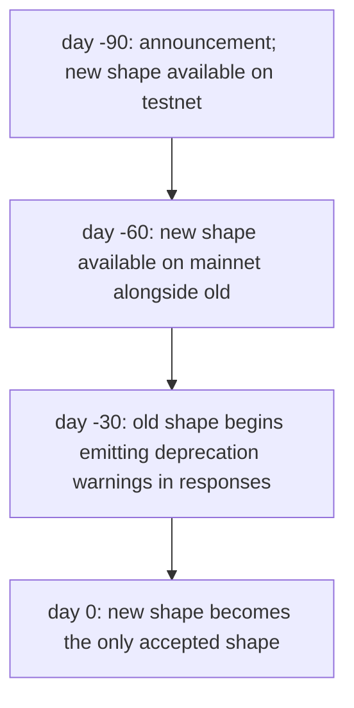
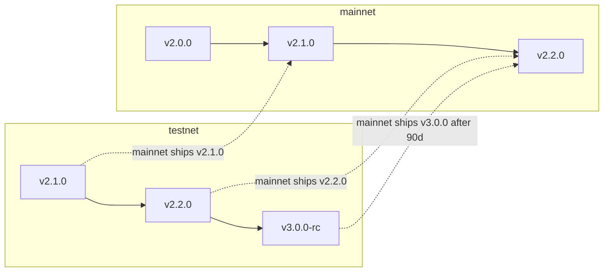

# Versionado y obsolescencia

:::info
**Estado.** Política **estable**. Las transiciones de versión específicas se encuentran en el registro de cambios.
:::

## Resumen rápido

- La versión del protocolo es un triplete con forma semver (`MAJOR.MINOR.PATCH`).
- Los cambios de interfaz de comunicación incompatibles van en `MAJOR`; las adiciones compatibles en `MINOR`; las correcciones en `PATCH`.
- Los cambios incompatibles en mainnet requieren un período de obsolescencia de 90 días durante el cual se aceptan tanto la forma antigua como la nueva.
- Testnet se ejecuta por delante de mainnet para detectar problemas de migración antes de llegar a producción.

## Componentes de la versión

El campo `protocol_version` del protocolo se expone a través de `/info node_info`:

```json
{
  "type": "node_info",
  "data": { "protocol_version": "1.2.0", ... }
}
```

| Componente | Significado | Ejemplos |
|-----------|---------|----------|
| MAJOR | Cambio de interfaz incompatible | Campos de `Order` renombrados; variante de acción eliminada; dominio de firma modificado; forma de URL RPC cambiada |
| MINOR | Adición compatible | Nueva variante de acción; nuevo tipo de info; nuevo canal WS; nueva cadena de error |
| PATCH | Corrección solo de comportamiento | Correcciones de errores que preservan la interfaz; rendimiento |

## Qué es la "interfaz de comunicación"

La interfaz de comunicación (wire shape) es todo aquello a lo que un cliente se compromete en su lógica de serialización y firma. En concreto:

| Interfaz de comunicación | Ejemplos |
|-----------|----------|
| Sí | Cadenas `type` de acción, nombres de campo, tipos de campo, valores de enumeración, forma de respuesta, códigos de estado, cadenas de error, dominio EIP-712 |
| Sí | Convenciones de escala numérica (enteros de punto fijo, unidades base de USDC) |
| Sí | Nombres de canales WS, formas de payload, formato de trama |
| No | Almacenamiento interno del servidor; implementación de consenso; pesos de fuente de marca/oráculo (controlados por gobernanza, no versionados por protocolo); umbrales de nivel de comisiones (gobernanza) |

Los parámetros mutables por gobernanza (niveles de comisiones, pesos de composición de marca, choques de escenario, umbrales de liquidación) **no** forman parte del compromiso de interfaz de comunicación. Su **forma** está comprometida; sus valores pueden cambiar en cualquier momento.

## Compromiso en mainnet

| Clase de cambio | Notificación | Período de gracia |
|--------------|--------------|--------------|
| MAJOR (incompatible) | 90 días antes de la activación | Se aceptan tanto la forma antigua como la nueva durante ≥ 90 días |
| MINOR (aditivo) | 0 días; anunciado en el registro de cambios | n/a |
| PATCH (corrección) | 0 días | n/a |

Un cambio MAJOR se despliega de la siguiente manera:



La ventana de 90 días coincide con los ciclos de gestión de cambios institucionales. Los operadores de bots tienen tiempo suficiente para migrar; los clientes pueden ejecutar código de interfaz dual durante el período de superposición.

## Avisos de obsolescencia

Durante la ventana de superposición, las respuestas a la forma antigua incluyen un aviso no fatal:

```json
{
  "accepted": true,
  "mempool_depth": 3,
  "_deprecation": {
    "field":      "params.price",
    "deprecated_at_version": "2.0.0",
    "removal_at_version":    "3.0.0",
    "migration": "use px (string, fixed-point 10^8)"
  }
}
```

El campo `_deprecation` siempre es opcional en su analizador — los clientes en la nueva forma nunca lo verán.

## Registro de cambios

El registro de cambios del protocolo se publica en `https://mtf.exchange/changelog` (URL por definir antes del lanzamiento) y se replica en este repositorio en `CHANGELOG.md`. Cada entrada contiene:

- Triplete de versión
- Fecha de activación
- Clase (MAJOR / MINOR / PATCH)
- Descripción por cambio con notas de migración para MAJOR / MINOR

Suscríbase mediante:
- RSS en `https://mtf.exchange/changelog.rss`
- GitHub Releases en este repositorio
- Notificación push WS en un canal `_meta` planificado (por definir)

## Testnet por delante de mainnet

Testnet suele ejecutarse entre 1 y 2 versiones menores por delante de mainnet. Los hallazgos de migración en testnet se resuelven antes de la fecha de despliegue en mainnet. Los operadores de bots con integración en testnet obtienen advertencia anticipada de cambios incompatibles.



## Qué puede cambiar la gobernanza sin versionado

La capa de protocolo está versionada por interfaz de comunicación. La gobernanza puede modificar:

- Parámetros por mercado (tamaño de tick, límite de apalancamiento, ratio de mantenimiento, composición de marca, límite de financiación)
- Umbrales y tasas de niveles de comisiones
- Magnitudes de choque de escenario PM y matriz de correlación
- Umbrales de nivel de liquidación y períodos de enfriamiento (dentro de límites — cambios sustanciales requieren MAJOR)
- Presupuestos de límite de tasa
- Ratios de reposición del fondo de seguro

Estos cambios NO incrementan la versión del protocolo. SÍ emiten eventos en el canal WS `_governance` planificado y son consultables a través de `/info` para sus valores actuales.

Los clientes que calculan contra valores de parámetros actuales (p. ej., calculando el margen PM del lado del cliente) deben leer los parámetros en tiempo real; nunca los codifique de forma fija.

## Versionado del SDK del cliente

Los SDKs (`@metaflux/sdk`, `metaflux-client` para Rust, `metaflux-client` para Python) siguen semver de forma independiente al protocolo:

- `0.x.y` — pre-mainnet; se permiten cambios incompatibles en cada incremento menor
- `1.x.y` — post-mainnet; semver estricto en la superficie de API

La superficie de API `1.x` de un SDK apunta a un MAJOR de protocolo específico. Cuando el protocolo incrementa MAJOR, el SDK incrementa MAJOR; el SDK 1.x soporta el protocolo 2.x, el SDK 2.x soporta el protocolo 3.x, con soporte de superposición durante la ventana de 90 días.

## Advertencias pre-mainnet

Hasta el lanzamiento en mainnet:
- Devnet puede romper la interfaz de comunicación con 24 horas de aviso.
- Testnet ejecuta el MINOR/MAJOR más reciente del protocolo por delante de la versión planificada de mainnet; los fallos en testnet son esperados.
- Los banners de estado en cada documento reflejan lo que es estable, vista previa o planificado.

## Véase también

- [Redes](./networks.md) — endpoints por red + chainIds
- [Seguridad](./security.md) — modelo de seguridad y política de divulgación
