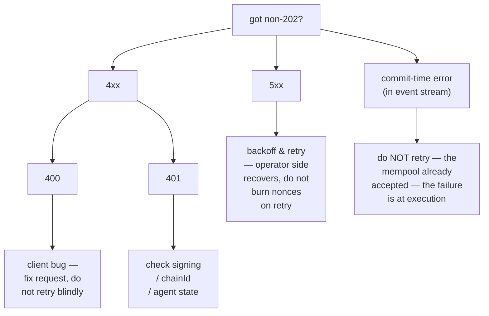

# Catalogue des erreurs

:::info
**Statut.** **Stable** pour les codes répertoriés. De nouvelles chaînes d'erreur pourront être ajoutées ; les chaînes existantes sont stables.
:::

Une énumération complète des codes de statut HTTP, des conventions de chaînes d'erreur, des causes profondes et des mesures correctives. En cas de doute sur la façon de traiter une réponse non-`202`, commencez par consulter cette page.

## Résumé {#tldr}

- **2xx** — succès. Les points de terminaison natifs MTF utilisent des codes de statut HTTP appropriés pour signaler les erreurs, et non des indicateurs d'erreur dans le corps.
- **400** — bogue côté client : requête malformée, format de signature invalide, variante d'action inconnue. Ne pas réessayer sans corriger.
- **401** — échec d'authentification de la signature. Récupérez l'adresse localement et vérifiez.
- **404** — ressource inexistante. Fréquent sur `/info` lorsque le compte, le marché ou le coffre interrogé n'a jamais été observé.
- **405** — méthode HTTP incorrecte (la plupart des points de terminaison sont en POST).
- **422** — requête bien formée mais logiquement invalide (ex. : taille nulle, effet de levier au-dessus du plafond). Ne pas réessayer ; corriger et soumettre à nouveau.
- **429** — limite de débit atteinte. Attendre et réessayer conformément à `retry_after_ms`.
- **5xx** — erreur côté serveur. Réessayer avec un backoff exponentiel ; des échecs persistants indiquent un incident côté opérateur.

## Structure du corps de réponse {#body-shape}

Toutes les réponses non-2xx sur les points de terminaison natifs MTF suivent ce format :

```json
{
  "error":          "<short_string>",
  "detail":         "<optional human-readable elaboration>",
  "retry_after_ms": 1200
}
```

`detail` et `retry_after_ms` ne sont présents que lorsqu'ils s'appliquent. Le champ `error` est l'identifiant stable — conservez votre gestionnaire d'erreurs indexé sur lui.

## Catalogue {#catalog}

### 400 — mauvaise requête {#400--bad-request}

| `error` | Déclenché lorsque | Mesure corrective |
|---------|-------------------|-------------------|
| `sender: expected 40 hex chars, got N` | La longueur du champ `sender` est incorrecte | Supprimer le préfixe `0x` ; vérifier l'adresse de 20 octets |
| `signature: expected 130 hex chars, got N` | Signature sans octet `v` | Ajouter l'octet de récupération |
| `invalid hex` | Caractères non hexadécimaux dans `sender` / `signature` | Assainir l'entrée |
| `unknown action variant: <X>` | `action.type` mal orthographié ou non pris en charge | Consulter le [catalogue des actions](./rest/exchange.md#action-catalog) |
| `missing field: params.<X>` | Champ obligatoire omis dans une variante | Vérifier le tableau de la variante |
| `invalid msgpack` | Erreur de sérialisation de l'action / msgpack hors spécification | Utiliser une bibliothèque msgpack avec les options par défaut |
| `nonce must increase` | `nonce` réutilisé ou dans le désordre | Utiliser un compteur monotone (ex. : `Date.now()`) |
| `duplicate cloid` | `Order`/`ModifyOrder` a réutilisé un identifiant d'ordre client | Utiliser un nouveau `cloid` |
| `empty batch` | `orders[]` ou `cancels[]` est vide | Envoyer au moins une entrée |
| `invalid numeric` | Champ à virgule fixe non analysable en tant que `u128` | Envoyer sous forme de chaîne JSON, base 10, sans `+` ni espace en tête |
| `unknown info type: <X>` | Le `type` de `/info` n'est pas reconnu | Consulter la [référence info](./rest/info.md) |
| `chain_id mismatch` | Le champ chainId d'un wrapper multi-sig ne correspond pas au réseau | Faire correspondre le `chainId` du réseau |

### 401 — non autorisé (échec de signature) {#401--unauthorized-signature-failed}

| `error` | Déclenché lorsque | Mesure corrective |
|---------|-------------------|-------------------|
| `signer is not the sender and not an approved agent` | L'adresse récupérée ≠ sender ET n'est pas dans l'ensemble des agents | Vérifier la clé privée + l'adresse ; confirmer que `ApproveAgent` est validé |
| `agent expired` | L'adresse récupérée est un agent du sender, mais `expires_at_ms` est dépassé | Ré-approuver ou faire tourner l'agent |
| `agent not yet effective` | `ApproveAgent` est encore en propagation (≤ 1 bloc) | Attendre un bloc, réessayer |
| `unknown chainId` | Mauvais `chainId` dans le domaine de signature → adresse récupérée fantôme | Faire correspondre le [chainId du réseau](../networks.md) |
| `signature parse failed` | Octets de signature malformés | Vérifier l'encodage `r ‖ s ‖ v` (65 octets) |
| `multisig threshold not met` | L'action interne a moins de `threshold` signatures valides | Collecter davantage de signatures |
| `multisig duplicate signer` | La même adresse signe deux fois dans un wrapper multi-sig | Chaque signataire doit être distinct |

### 404 — non trouvé {#404--not-found}

| `error` | Déclenché lorsque |
|---------|-------------------|
| `account not found` | `/info` interrogé avec une adresse qui n'a pas d'état on-chain |
| `market not found` | Symbole `coin` absent du registre |
| `vault not found` | `vault_id` non présent |
| `order not found` | `Cancel` appliqué à un oid déjà annulé / exécuté / inexistant |

Pour les requêtes `/info`, MTF-native renvoie `404` lorsque la ressource demandée est inconnue.

### 405 — méthode non autorisée {#405--method-not-allowed}

| `error` | Déclenché lorsque |
|---------|-------------------|
| (aucun corps) | Utilisation de `GET` sur un point de terminaison `POST` (ou vice versa) |

### 422 — entité non traitable {#422--unprocessable-entity}

La requête était bien formée et la signature valide, mais l'action elle-même est logiquement invalide.

| `error` | Déclenché lorsque | Mesure corrective |
|---------|-------------------|-------------------|
| `price not tick-aligned` | `px` n'est pas un multiple de la taille du tick du marché | Arrondir au tick valide le plus proche |
| `size below market minimum` | `size` < minimum du marché | Augmenter la taille ou cibler un autre marché |
| `reduce_only would grow position` | Réduction seule activée, mais l'ordre ouvrirait ou étendrait la position | Supprimer `reduce_only` ou vérifier la position actuelle |
| `leverage above asset cap` | L'effet de levier demandé > `max_leverage` pour l'actif | Utiliser `≤ max_leverage` (voir info `meta`) |
| `pm_min_equity_not_met` | `UserPortfolioMargin{enabled:true}` mais le compte est en dessous du seuil | Augmenter les fonds propres ou rester en mode classique |
| `liquidation tier blocks action` | Compte en T1+ ; les transactions supplémentaires sont bloquées | Alimenter la marge, sortir du palier en premier |
| `insufficient balance` | Le retrait / transfert dépasse le solde disponible | Vérifier `clearinghouseState` au préalable |
| `out of bounds: <param>` | Limite de gouvernance violée (ex. : plafond de financement sur `PerpDeployGasAuctionBid`) | Utiliser une valeur dans la limite publiée |

### 429 — limite de débit atteinte {#429--rate-limited}

```json
{ "error": "rate limit exceeded", "scope": "per_ip"|"per_account", "retry_after_ms": 1200 }
```

| `scope` | Signification |
|---------|---------------|
| `per_ip` | Budget de poids par IP épuisé au niveau de la passerelle |
| `per_account` | QPS par compte épuisé au niveau de la passerelle |
| `mempool_per_account` | Trop d'actions en attente dans le mempool depuis un même compte |

Voir [limites de débit](./rate-limits.md) pour les budgets et la gestion des rafales.

### 503 — service indisponible {#503--service-unavailable}

| `error` | Cause | Mesure corrective |
|---------|-------|-------------------|
| `mempool at capacity` | Congestion du réseau ; refus en fin de file d'attente | Backoff exponentiel (`retry_after_ms` commence à 200) |
| `gateway not ready` | La passerelle démarre / échoue aux vérifications de santé | Réessayer avec backoff ; vérifier le [statut](../networks.md#status) |
| `node downstream unreachable` | La passerelle a perdu la connexion au nœud | Côté opérateur ; backoff et surveiller le statut |

### Erreurs à l'exécution (hors HTTP, dans le flux d'événements) {#commit-time-errors-not-http-in-event-stream}

Certains échecs surviennent après `202 Accepted` car ils ne sont détectables qu'en contexte d'exécution de bloc. Ils apparaissent sur le canal WS `order_updates` / `user_events` sous la forme `{"error":"<reason>", "action_hash":"0x..."}`.

| `error` | Cause |
|---------|-------|
| `reduce_only_violation_post_admit` | La position a changé entre l'admission et la distribution (d'autres exécutions l'ont clôturée) |
| `stp_rejected` | La prévention des auto-transactions a annulé l'ordre à la distribution |
| `mark_price_band_violation` | Le prix de l'ordre est hors de la bande d'écart autorisée du marché lors de la correspondance |
| `evicted_under_cap_pressure` | Admis mais expulsé du mempool avant la proposition de bloc |
| `liquidation_pre_empted` | Le compte est passé en T1+ entre l'admission et la distribution |

## Arbre de décision {#decision-tree}



## Voir aussi {#see-also}

- [`POST /exchange`](./rest/exchange.md) — chemin d'écriture
- [`POST /info`](./rest/info.md) — chemin de lecture
- [Limites de débit](./rate-limits.md)
- [Idempotence](../integration/idempotency.md) — comment réessayer en toute sécurité
- [Guide de gestion des erreurs](../integration/error-handling.md) — modèles pour les clients en production
