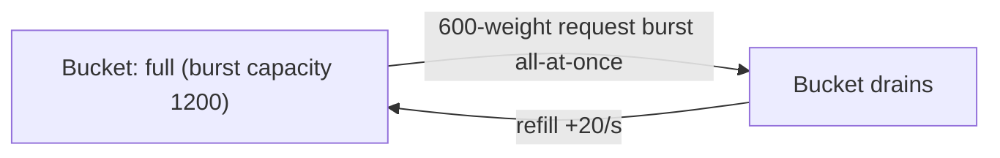
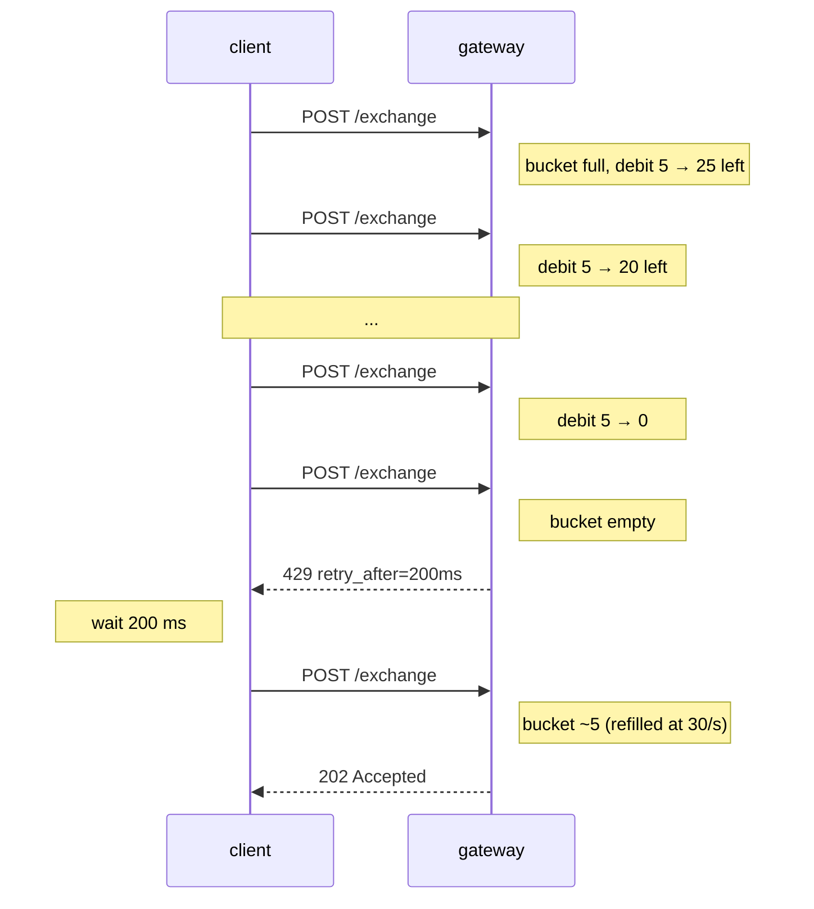

# Limites de débit

:::info
**Aperçu.** La passerelle applique les limites ci-dessous ; le nœud nu accepte un trafic illimité de la part des pairs mTLS authentifiés (réservé aux infrastructures de confiance — n'exposez pas `8080` sur l'internet public en production).
:::

## En bref

- Deux enveloppes : **poids par IP** (trafic anonyme) et **QPS par compte** (trafic signé).
- Les pics de trafic consomment un seau à jetons ; le trafic soutenu est limité par le taux de recharge.
- `429` contient toujours `retry_after_ms`. Respectez-le.
- Les requêtes `/info` sont légères (poids 1) ; les abonnements WS sont encore plus légers (poids 1 à l'abonnement, 0 par message). `/exchange` vaut 5 par requête.
- Le mempool dispose d'un plafond indépendant sur les actions en attente, par compte.

## Enveloppes

| Enveloppe | Limite (défaut) | Recharge | Pic |
|-----------|-----------------|----------|-----|
| Poids par IP | 1200 poids / minute | 20 poids / seconde | 1200 (seau plein) |
| QPS par compte | 30 req / seconde | 30 / s | 60 |
| Actions mempool par compte | 50 en attente | se vide à mesure que les actions sont confirmées | — |
| Abonnements WS par connexion | 256 | — | — |

Toutes les limites sont contrôlées par la gouvernance. Un instantané de l'enveloppe par compte est disponible
via la lecture native [`user_rate_limit`](./rest/info.md) sur le chemin par défaut de la passerelle
(la passerelle expose également ces données en tant que `userRateLimit` compatible HL sous
`/hl`) :

```bash
curl -X POST https://devnet-gateway.mtf.exchange/info \
  -H 'content-type: application/json' \
  -d '{"type":"user_rate_limit","address":"0x<addr>"}'
```

> **Lecture prévue.** Une route dédiée `GET /limits` publiant la configuration *statique*
> par IP / par compte ci-dessous **n'est pas encore implémentée** — les valeurs sont
> les paramètres par défaut, pas encore servis depuis un endpoint. Traitez le JSON ci-dessous
> comme valeurs de référence par défaut :

```json
{
  "per_ip": {
    "weight_per_minute": 1200,
    "burst":             1200,
    "refill_per_second": 20
  },
  "per_account": {
    "qps":          30,
    "burst":        60,
    "refill":       30
  },
  "mempool_per_account": 50,
  "ws_subs_per_conn":    256
}
```

## Poids par endpoint

| Endpoint | Poids |
|----------|-------|
| `POST /info` (la plupart des types) | 1 |
| `POST /info` `l2Book`, `metaAndAssetCtxs` | 2 |
| `POST /info` `userFills`, `historicalOrders` (paginé) | 2 |
| `POST /exchange` | 5 |
| `GET /ccxt/markets`, `GET /ccxt/ticker` | 1 |
| `GET /ccxt/orderbook`, `GET /ccxt/ohlcv` | 2 |
| `GET /ccxt/balance`, `/positions`, `/myTrades` | 2 |
| `POST /ccxt/orders`, `DELETE /ccxt/orders/{id}` | 5 |
| WS `subscribe` | 1 |
| Message publié WS | 0 |
| WS `unsubscribe` | 0 |

Un client passant un ordre par seconde et interrogeant `clearinghouseState` une fois par seconde dépense `5 + 1 = 6 poids/s = 360 poids/min` — bien en dessous de l'enveloppe.

## QPS par compte

Dès qu'une requête est signée, la passerelle authentifie le `sender` et l'impute sur l'enveloppe par compte plutôt que (ou en plus de) l'enveloppe par IP.

| État de l'émetteur | Imputé sur |
|--------------------|------------|
| Anonyme (sans signature, p. ex. `GET /ccxt/markets`) | par IP |
| Signé par le compte principal | par IP + par compte |
| Signé par un agent | par IP + par compte du compte principal |

Les requêtes signées sont doublement comptabilisées contre le budget par IP et par compte ; les clients qui martèlent depuis une seule IP pour un même compte atteindront l'enveloppe la plus restrictive en premier.

## Plafond du mempool

Indépendant des limites de débit. La machine d'état refuse d'admettre plus de 50 actions en attente (non encore confirmées) par `sender`. Cela empêche un compte de monopoliser l'espace du mempool.

Si vous soumettez une 51e action alors que 50 sont en attente :

```json
{ "error": "mempool_per_account_full", "retry_after_ms": 100 }
```

En pratique, ce cas ne survient qu'avec des clients mal configurés — un temps de bloc sain d'environ 100 ms écoule facilement 30 QPS. Si vous atteignez cette limite, vous êtes dans les normes côté QPS par compte mais vous envoyez plus vite que les blocs ne se confirment.

## Comportement lors des pics

Les seaux se remplissent jusqu'à `burst` et se rechargent à `refill` par seconde. Un pic de `N ≤ burst` requêtes passe immédiatement ; les requêtes suivantes sont ensuite limitées au taux de recharge.



Une réponse `429` avec `retry_after_ms` vous indique précisément quand le seau sera suffisamment rechargé pour une requête de poids 1. Pour les traitements par lots, privilégiez le contrôle du débit côté client ; pour les workloads interactifs, un backoff exponentiel guidé par l'indication est suffisant.

## Stratégies

### Bot de flux d'ordres

- Limitez le débit côté client à ~25 QPS pour conserver une marge de sécurité.
- Utilisez le groupement `Order` : une requête contenant 10 ordres coûte 5 poids (autant qu'un seul ordre) ; le QPS par compte compte les requêtes, pas les jambes.
- Utilisez `BatchModify` plutôt que N `ModifyOrder` distincts.
- Maintenez les données de marché sur le flux WS, et non en interrogeant `/info`.

### Consommateur de données de marché

- Abonnez-vous aux canaux WS (`l2Book`, `trades`, `userEvents`) ; n'interrogez pas par polling.
- Le poids d'un `subscribe` est 1, les messages en flux coûtent 0.
- Reconnectez-vous avec `resume_token` plutôt que de vous réabonner à tous les canaux depuis zéro (les abonnements consomment à nouveau du poids sur la nouvelle connexion).

### Liquidateur haute fréquence

- Exécutez depuis votre propre nœud auto-hébergé (authentifié mTLS, `localhost:8080`), en contournant les limites de la passerelle publique.
- Notez que cela nécessite d'exploiter une infrastructure appairée avec un validateur.
- L'accès à la passerelle publique suffit pour des workloads de dizaines d'ordres par seconde ; pas pour le trading haute fréquence (HFT).

## Séquence — être throttlé et récupérer



## Canaux d'exception

| Canal | Remarques |
|-------|-----------|
| Pair mTLS d'un validateur | Contourne les limites de la passerelle (vous êtes sur le chemin de confiance) |
| IP / compte sur liste blanche (côté opérateur) | Les opérateurs peuvent publier des enveloppes plus élevées pour les teneurs de marché désignés |
| Endpoints spéciaux (`/limits`, `/health`) | Non soumis aux limites de débit |

Les paramètres publics par défaut supposent qu'aucune exception ne s'applique.

## Voir aussi

- [Erreurs](./errors.md)
- [Abonnements WS](./ws/subscriptions.md)
- [Idempotence](../integration/idempotency.md) — comment réessayer dans l'enveloppe de débit

## FAQ

<details>
<summary>Afficher la FAQ</summary>

**Q : Les limites sont-elles par paire de clés ou par adresse ?**
R : Par `sender` (adresse). Tous les agents d'un même compte principal partagent l'enveloppe, car l'admission est comptabilisée sur le compte principal.

**Q : Puis-je grouper un ordre sur 10 marchés pour économiser du poids ?**
R : Oui. `Order { orders: [<10 legs>] }` coûte 5 poids, pas 50.

**Q : Les sondages `/info` et les abonnements WS partagent-ils une même enveloppe ?**
R : Oui — même seau par IP / par compte. Les abonnements WS coûtent 1 chacun, puis 0 par message ; pour les flux de données à fort débit, le WS est toujours moins coûteux que le polling.

**Q : Qu'en est-il du Devnet ?**
R : Le Devnet dispose d'enveloppes plus généreuses et n'a pas de plafond mempool. N'ajustez pas votre client en vous basant sur le Devnet ; recalculez les enveloppes depuis `/limits` sur le réseau sur lequel vous allez déployer.

</details>
