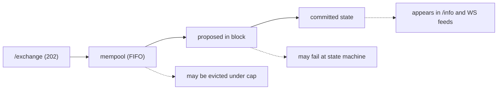
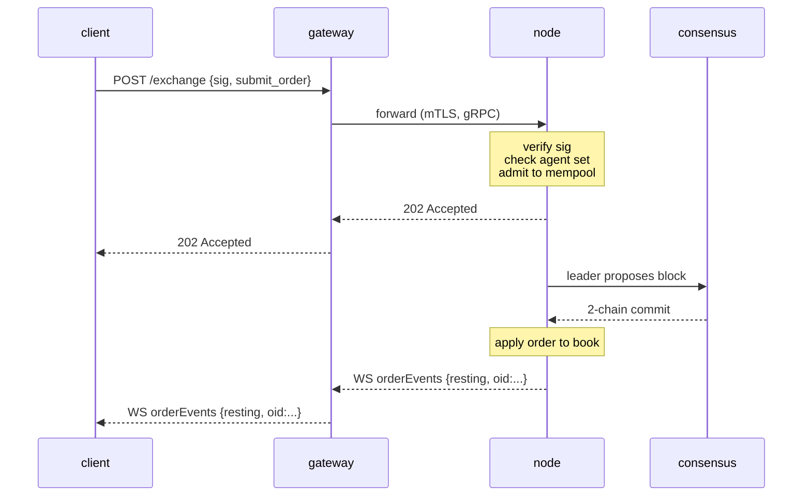

# `POST /exchange` — soumettre une action signée

:::info
**Statut.** **stable** pour les variantes d'action répertoriées. La forme de l'endpoint est figée pour la V1.
:::

## TL;DR

Toute action **utilisateur** modifiant l'état — passer un ordre, annuler, déposer dans un vault, approuver un agent, staker, etc. — est une enveloppe JSON signée EIP-712 envoyée à `POST /exchange`. La variante d'action est sélectionnée par le champ `type`. Un **ordre** renvoie `200 OK` avec l'`oid` synchrone attribué (le handler attend la confirmation) ; toute **autre** action renvoie `202 Accepted` à l'admission, la confirmation de commit arrivant via le [flux WS](../ws/subscriptions.md) ou par interrogation.

:::warning
**Actions utilisateur uniquement.** `/exchange` est le chemin d'écriture **utilisateur** public. Les écritures privilégiées / système — soumission de prix oracle, crédits de faucet, `SystemUserModify`, `SystemSpotSend`, votes de validateur — ne passent **jamais** par `/exchange`. Elles sont injectées via des files locales au nœud, contrôlées par l'autorité de validateur (voir le
[tableau des actions non bridgées](#non-bridged-actions) et le [faucet](./faucet.md#why-this-is-not-on-exchange)).
Soumettre le tag natif d'une action système renvoie `400 unsupported action`.
:::

## URL

```
POST  https://<net>-gateway.mtf.exchange/exchange
```

| Chemin | Format sur le fil |
|------|-----------|
| `POST /exchange` (gateway par défaut) | **MTF-natif** (ce document) |
| `POST /hl/exchange` (gateway, sous `/hl`) | **Compat HL** — voir [hl-compat.md](./hl-compat.md) |

Le format MTF-natif est le chemin par défaut de la gateway ; la compat HL est sous l'espace de noms `/hl/*`.
Si vous faites tourner le nœud vous-même, le même `/exchange` natif est servi directement sur
`http://localhost:8080`.

## Enveloppe de requête

```json
{
  "signature": "0xabcd...1b",
  "nonce":     1735689600001,
  "action": {
    "type": "submit_order",
    "order": { /* l'une des variantes ci-dessous */ }
  }
}
```

| Champ | Type | Requis | Description |
|-------|------|----------|-------------|
| `signature` | chaîne hex, 65 octets (130 chars hex ; `0x` optionnel) | oui | ECDSA secp256k1 sur le [condensé de données typées](#signing) EIP-712 des champs structurés de l'action + `nonce`. `r ‖ s ‖ v`. Les formes `v ∈ {27, 28}` (legacy) et `v ∈ {0, 1}` (EIP-2098) sont toutes deux acceptées. |
| `nonce` | uint64 | oui | Strictement monotone par acteur. Conventionnellement `Date.now()`. Intégré au condensé signé. Voir [idempotence](../../integration/idempotency.md). |
| `action` | objet | oui | Une variante taguée : `{ "type": "<snake_case_tag>", ... }`. Voir le [catalogue d'actions](#action-catalog) ci-dessous. |

:::info
**Pas de `sender` au niveau supérieur.** L'enveloppe ne comporte pas de champ `sender`. Le compte dont l'état est modifié est déterminé par action :
- **Actions avec propriétaire déclaré** (`submit_order`, `cancel_order`) portent le propriétaire
  *dans* le corps de l'action — `action.order.owner` / `action.cancel.owner`. Le
  serveur récupère le signataire depuis la signature et exige qu'il corresponde à cet
  `owner` **ou** à un [agent](../../concepts/agent-wallets.md) approuvé par celui-ci.
- **Actions autorisées par le signataire** (gouvernance, marge, vault-leader, staking, …)
  ne portent **aucun** champ propriétaire : le signataire récupéré *est* l'acteur, et
  l'autorisation au niveau de l'action (appartenance au validateur, vault-leader, etc.) s'exécute au
  dispatch.
:::

Le serveur reconstruit la structure typée EIP-712 depuis `action.type` +
`action.params` et récupère le signataire sur **ces valeurs de champs** — les
`action.params` envoyés doivent donc porter les **mêmes valeurs** (et les mêmes chaînes
décimales canoniques) que celles placées dans le message typé signé. Un écart récupère un
signataire différent et la requête est rejetée avec `401`. Voir
[signature de données typées](../../integration/typed-data-signing.md).

## Signature

La signature est une récupération ECDSA secp256k1 sur un condensé EIP-712 standard. Chaque
action est signée comme **données typées structurées EIP-712** (`eth_signTypedData_v4`)
avec, pour chaque action, un type primaire `MetaFluxTransaction:<Action>`, ce qui permet à un
portefeuille d'afficher chaque champ par son nom. Le serveur reconstruit la structure typée depuis `action.type` +
`action.params`, recalcule le condensé et récupère le signataire :

```
struct_hash = keccak256( typeHash(MetaFluxTransaction:<Action>) ‖ encodeData(fields) )
signed_hash = keccak256( 0x1901 ‖ domain_separator ‖ struct_hash )
```

où le séparateur de domaine est :

```
domain_separator = keccak256(
  keccak256("EIP712Domain(string name,string version,uint256 chainId,address verifyingContract)") ‖
  keccak256("MetaFlux") ‖
  keccak256("1") ‖
  chainId_as_uint256_be ‖
  address_zero_padded_to_32
)
```

Les chaînes de type par action, les règles atomiques d'`encodeData`, et des exemples
détaillés sont dans [signature de données typées](../../integration/typed-data-signing.md) — le schéma de
signature unique. Un test de réponse connue inter-implémentations fixe le condensé de chaque action.

:::info
**`sig_scheme` est vestigial.** Les versions antérieures portaient un sélecteur `sig_scheme` sur
l'enveloppe ; il n'est plus requis et le serveur l'ignore (la récupération par données typées
s'exécute inconditionnellement). **Omettez-le.** S'il est présent, la seule valeur acceptée
est `"typed"`.
:::

### Identifiants de chaîne

| Réseau | `chainId` |
|---------|-----------|
| Devnet (par défaut) | `31337` |
| Testnet | `114514` |
| Mainnet | `8964` |

Le `chainId` du domaine de signature **doit être égal au `chain_id` de consensus du nœud** —
interrogez-le via [`/info` `node_info`](./info.md#node_info) (`data.chain_id`) et utilisez
cette valeur exacte. Signer avec le mauvais `chainId` renvoie `401` car l'adresse
récupérée diffère de l'`owner` de l'action (ou, pour les actions autorisées par le signataire,
récupère une adresse fantôme qui ne passe aucune vérification d'autorisation). Voir
[réseaux](../../networks.md) pour les endpoints.

## Conventions numériques

| Type | Format sur le fil | Pourquoi |
|------|----------|-----|
| `uint64` ≤ 2^53 | nombre JSON | Sûr en IEEE-754 |
| `uint64` > 2^53, `u128`, entiers à l'échelle | chaîne JSON | Les nombres JSON natifs perdent silencieusement de la précision au-delà de 2^53 |
| Adresse | chaîne hex `"0x..."` | 20 octets, 40 chars hex (avec ou sans `0x`) |
| Booléens | `true` / `false` | JSON littéral |
| Champs optionnels | `null` ou omis | Les deux sont acceptés ; `null` est canonique |

**Champs à virgule fixe.** Les champs de prix et de taille sont des entiers à virgule fixe sur 8 décimales ; les montants USDC sont en unités de base sur 6 décimales. La valeur porte l'échelle, pas le nom du champ — p. ex. `px = "10050000000"` signifie `100.50`. Toujours envoyer sous forme de chaîne ; le serveur décode en `u128`.

## Sémantique du signataire

La plupart des actions peuvent être signées par **soit** le compte maître **soit** un [portefeuille agent](../../concepts/agent-wallets.md) actif. Un sous-ensemble est **réservé au maître** — les agents se voient explicitement refuser l'autorité de retrait et les privilèges de gestion de compte.

| Classe de capacité | Le maître peut signer ? | L'agent peut signer ? |
|------------------|:----------------:|:---------------:|
| Passer / annuler / modifier des ordres | oui | oui |
| Mettre à jour l'effet de levier / le mode de marge | oui | oui |
| Dépôt / retrait de vault | oui | oui |
| Création de sous-compte | oui | non |
| Transfert de sous-compte | oui | non |
| Approbation / révocation d'agent | oui | non |
| Retrait externe (USDC, spot) | oui | non |
| Conversion en multi-sig | oui | non |
| Enveloppe multi-sig | (spécial — voir [multi-sig](../../concepts/multi-sig.md)) | non |

L'entrée de chaque action dans le [catalogue](#action-catalog) indique explicitement sa règle de signataire.

---

## Catalogue d'actions

Chaque variante est un objet tagué `{ "type": "<snake_case_tag>", <corps plat> }`. Les
clés du corps sont **plates sous l'objet action** (il n'y a pas de `type` en PascalCase ni
d'enveloppe `params` universelle) — p. ex. `submit_order` porte un objet `order`,
`cancel_order` porte un objet `cancel`, et les actions autorisées par le signataire portent
un objet `params`. Cliquez pour accéder au tableau des champs détaillés. Les tableaux de vue d'ensemble
ci-dessous regroupent toutes les actions par catégorie ; **les définitions complètes au niveau des champs
qui suivent sont découpées par type de trading** — [Actions d'ordres perpétuels](#perpetual-order-actions),
[Actions de trading spot](#spot-trading-actions),
[Actions de marge spot & Earn](#spot-margin--earn-actions),
[Actions de marge & risque perpétuels](#perpetual-margin--risk-actions), et
[Actions de compte, staking, vaults & bridge](#account-staking-vaults--bridge-actions).

:::warning
**`px` / `size` sont des `u64` à virgule fixe non signés sur le fil natif**, envoyés comme
nombres JSON (le nœud les décode en `u64`, puis les élargit en interne). Cela diffère
du chemin compat HL (chaînes décimales). Les adresses sont en hex `0x` (40 chars) ;
`cloid` est `0x` + 32 chars hex (16 octets).
:::

### Placement & cycle de vie des ordres

| `type` | Finalité | Signataire | Idempotent |
|--------|---------|-----------|-----------|
| [`submit_order`](#submit_order) | Passer un ordre | propriétaire / agent | par `cloid` |
| [`batch_order`](#batch_order) | N ordres / une signature | propriétaire / agent | `cloid` par jambe |
| [`cancel_order`](#cancel_order) | Annuler par `oid` | propriétaire / agent | oui |
| [`batch_cancel`](#batch_cancel) | N annulations / une signature | propriétaire / agent | oui |
| [`cancel_by_cloid`](#cancel_by_cloid) | Annuler par identifiant client | signataire / agent | oui |
| [`cancel_all_orders`](#cancel_all_orders) | Annuler tous (filtre actif optionnel) | signataire / agent | oui |
| [`modify`](#modify) | Modifier le px / la taille d'un ordre au repos | signataire / agent | oui |
| [`batch_modify`](#batch_modify) | N modifications / une signature | signataire / agent | par entrée |
| [`schedule_cancel`](#schedule_cancel) | Déclencheur d'annulation totale à un bloc futur | signataire / agent | oui |
| [`twap_order`](#twap_order) | Planifier un ordre découpé (TWAP) | signataire / agent | par `twap_id` |
| [`twap_cancel`](#twap_cancel) | Annuler un ordre TWAP parent en cours | signataire / agent | oui |

### Trading spot

Le spot est un CLOB jeton-contre-jeton (sans effet de levier, sans positions) — carnets d'ordres et
soldes distincts des contrats perpétuels. Un ordre spot au repos bloque les fonds qu'il devrait
payer en cas d'exécution dans un **solde réservé** : un `bid` réserve la **quote** (sa valeur notionnelle au
prix limite), un `ask` réserve la **base** qu'il offre. La taille de l'ordre est **plafonnée
à l'admission** selon ce que votre solde permet de financer, et les frais sont prélevés sur la jambe
reçue par chaque côté. Les deux actions sont **autorisées par le signataire** (le signataire est le trader ;
il n'y a pas d'`owner`). Voir [trading spot](../../products/spot.md) pour le
modèle conceptuel complet.

| `type` | Finalité | Signataire | Idempotent |
|--------|---------|-----------|-----------|
| [`spot_order`](#spot_order) | Passer un ordre spot | signataire / agent | par `cloid` |
| [`spot_cancel`](#spot_cancel) | Annuler un ordre spot au repos par `oid` | signataire / agent | oui |

### Marge spot & Earn

:::info
**Disponible sur devnet (préversion).** Le spot à effet de levier ([marge spot](../../products/spot-margin.md)) et le côté prêteur ([Earn](../../concepts/earn.md)) fonctionnent de bout en bout sur **devnet aujourd'hui** : déposer du collatéral, emprunter dans le pool Earn, acheter la base en IOC avec effet de levier, et clôturer pour rembourser. Considérez cela comme une **préversion** — le règlement de liquidation forcée n'est pas encore câblé (une clôture forcée ne réalise pas le PnL ni ne décrémente l'intérêt ouvert), et les ratios de maintenance par paire sont des paramètres de gouvernance encore en cours de calibration. Ne présumez pas d'une sécurité en production à grande échelle.
:::

Une position spot à effet de levier est **isolée par `(compte, paire)`** : le collatéral quote déposé est un pur tampon contre les pertes, l'achat est financé à 100 % par un emprunt en quote tiré du pool Earn de la paire, et la base achetée est détenue **séparément** sur le compte de marge (jamais dans vos soldes disponibles). Earn est l'autre face — les fournisseurs déposent la quote prêtable contre des parts du pool, et les intérêts d'emprunt payés par les traders de marge spot valorisent chaque part. Les six actions sont **autorisées par le signataire** (le signataire est l'acteur ; il n'y a pas d'`owner`). `amount` / `shares` / `borrow` sont des décimaux envoyés comme chaînes JSON ; `size` / `limit_px` sont des `u64` sur les plans `1e8` / lots bruts comme pour un [`spot_order`](#spot_order). Chacune renvoie l'enveloppe d'admission [`202 Accepted`](#202-accepted--non-order-admission) (pas d'`oid` synchrone) ; observez le résultat commis via [`/info` `spot_margin_state`](./info.md#spot_margin_state) et [`earn_state`](./info.md#earn_state).

| `type` | Finalité | Signataire | Idempotent |
|--------|---------|-----------|-----------|
| [`spot_margin_deposit`](#spot_margin_deposit) | Déposer du collatéral quote pour une paire | signataire / agent | non |
| [`spot_margin_withdraw`](#spot_margin_withdraw) | Retirer le collatéral libre | signataire / agent | non |
| [`spot_margin_open`](#spot_margin_open) | Emprunter + acheter la base en IOC avec effet de levier | signataire / agent | non |
| [`spot_margin_close`](#spot_margin_close) | Vendre la base détenue, rembourser l'emprunt | signataire / agent | non |
| [`earn_deposit`](#earn_deposit) | Fournir de la quote dans le pool de prêt contre des parts | signataire / agent | non |
| [`earn_withdraw`](#earn_withdraw) | Racheter des parts du pool (limité par l'inactivité) | signataire / agent | non |

### Marge & risque

| `type` | Finalité | Signataire |
|--------|---------|-----------|
| [`update_leverage`](#update_leverage) | Modifier l'effet de levier / la bascule isolation sur un actif | signataire / agent |
| [`update_isolated_margin`](#update_isolated_margin) | Delta de marge isolée signé | signataire / agent |
| [`top_up_isolated_only_margin`](#top_up_isolated_only_margin) | Recharge de marge strictement isolée | signataire / agent |
| [`user_portfolio_margin`](#user_portfolio_margin) | Inscrire / désinscrire de la marge de portefeuille | signataire / agent |

### Gestion de compte

| `type` | Finalité | Signataire |
|--------|---------|-----------|
| [`approve_agent`](#approve_agent) | Approuver un portefeuille agent | signataire / agent |
| [`set_display_name`](#set_display_name) | Définir le pseudonyme du compte | signataire / agent |
| [`set_referrer`](#set_referrer) | Lier un parrain par adresse | signataire / agent |
| [`approve_builder_fee`](#approve_builder_fee) | Approuver un plafond de frais builder | signataire / agent |
| [`create_sub_account`](#create_sub_account) | Ouvrir un sous-compte sous le signataire | signataire / agent |
| [`sub_account_transfer`](#sub_account_transfer) | Déplacer le collatéral croisé perp parent ↔ sous | signataire / agent |
| [`sub_account_spot_transfer`](#sub_account_spot_transfer) | Déplacer un solde de jeton spot parent ↔ sous | signataire / agent |
| [`convert_to_multi_sig_user`](#convert_to_multi_sig_user) | Passer le compte en multi-sig | signataire / agent |
| [`set_position_mode`](#set_position_mode) | Basculer entre le mode position unidirectionnel / couverture | signataire / agent |

### Staking & abstraction

| `type` | Finalité | Signataire |
|--------|---------|-----------|
| [`c_deposit`](#c_deposit) | Déplacer du MTF spot vers le solde de staking libre | signataire / agent |
| [`c_withdraw`](#c_withdraw) | Rapatrier le solde de staking libre en MTF spot | signataire / agent |
| [`token_delegate`](#token_delegate) | Déléguer / désinstaller du stake | signataire / agent |
| [`claim_rewards`](#claim_rewards) | Réclamer les récompenses de staking | signataire / agent |
| [`link_staking_user`](#link_staking_user) | Alias d'une cible de staking | signataire / agent |
| [`user_dex_abstraction`](#user_dex_abstraction) | Activer / désactiver le flag d'abstraction DEX utilisateur | signataire / agent |
| [`user_set_abstraction`](#user_set_abstraction) | Configuration d'abstraction à portée utilisateur | signataire / agent |
| [`agent_set_abstraction`](#agent_set_abstraction) | Configuration d'abstraction à portée agent | signataire / agent |
| [`priority_bid`](#priority_bid) | Payer des frais de priorité pour un placement en tête de bloc | signataire / agent |

### Ordres chiffrés

| `type` | Finalité | Signataire |
|--------|---------|-----------|
| [`submit_encrypted_order`](#submit_encrypted_order) | Texte chiffré d'un ordre chiffré par seuil | signataire / agent |

### Vaults & Métaliquidité

| `type` | Finalité | Signataire |
|--------|---------|-----------|
| [`create_vault`](#create_vault) | Le leader crée un vault | signataire / agent |
| [`vault_transfer`](#vault_transfer) | Transfert d'amorçage par le leader | signataire / agent |
| [`vault_modify`](#vault_modify) | Mise à jour de la configuration du vault réservée au leader | signataire / agent |
| [`vault_withdraw`](#vault_withdraw) | Rachat de parts par un follower | signataire / agent |
| [`set_metaliquidity_whitelist`](#set_metaliquidity_whitelist) | Vote de liste blanche MLP | clé validateur |
| [`register_metaliquidity_operator`](#register_metaliquidity_operator) | Enregistrer / révoquer un opérateur de stratégie | vault leader |

### Retraits via bridge

Les retraits externes quittent la chaîne via [MetaBridge](../../bridge/index.md).
L'action est **autorisée par le signataire** : le signataire récupéré est le compte
débité, de sorte que l'autorité de retrait est effectivement **réservée au maître** — une
signature d'agent agirait sur le propre compte de l'agent (distinct), jamais sur celui du maître.

| `type` | Finalité | Signataire |
|--------|---------|-----------|
| [`core_evm_transfer`](#core_evm_transfer) | Déplacer des USDC du registre Core vers MetaFluxEVM | signataire (maître) |
| [`mb_withdraw`](#mb_withdraw) | Retirer des USDC en collatéral croisé vers une chaîne externe | signataire (maître) |

### Hors du chemin public `/exchange`

Ces noms d'action apparaissent dans les premières ébauches (et certains dans la surface compat HL),
mais ils ne sont **pas bridgés sur le handler MTF-natif `/exchange`**. Il s'agit soit
d'écritures privilégiées / système qui ne doivent jamais transiter par le chemin utilisateur public,
soit de stubs de schéma reconnus mais non mappés. Leur soumission renvoie
`400 unsupported action`. Voir [le tableau ci-dessous](#non-bridged-actions) pour la
disposition de chacun.

| Nom de l'ébauche | Tag natif (si reconnu) | Pourquoi non bridgé |
|-----------|----------------------------|-----------------|
| `ScaleOrder` | — | Pas d'action native ; décomposez côté client en `batch_order` |
| `UpdateMarginMode` | — | Pas d'action native ; l'isolation est le flag `is_isolated` sur `update_leverage` |
| `MultiSig` | — | L'enveloppe de collecte et d'exécution multi-sig n'est pas bridgée (préversion / non exécutée — le compte est *enregistré* via `convert_to_multi_sig_user`) |
| `RegisterReferrer` | — | Non bridgé (le parrain est lié par adresse via `set_referrer`) |
| `UsdcTransfer` / `SpotTransfer` | — | Les flux de transfert utilisateur à utilisateur ne sont pas bridgés |
| `WithdrawUsdc` | — | Nom d'ébauche ; le retrait externe est [`mb_withdraw`](#mb_withdraw) |
| `BorrowLend` | — | Non bridgé |
| `AppHashVote` | — | Action validateur/système ; passe par le chemin de consensus, jamais par `/exchange` |
| `RfqQuote` / `RfqAccept` | `rfq_request` / `rfq_accept` | Stub reconnu mais non mappé → `unsupported action` |
| `FbaOrder` | `fba_submit` | Stub reconnu mais non mappé → `unsupported action` |
| (distribution vault) | `vault_distribute` | Handler partiel/stub ; non bridgé sur `/exchange` |
| (cycle de vie PM) | `pm_enroll` / `pm_unenroll` / `pm_rebalance` | Stub reconnu mais non mappé → `unsupported action` |
| (inter-chaînes) | `cross_chain_send` | Stub reconnu mais non mappé → `unsupported action` |
| (variante submit chiffrée) | `encrypted_order_submit` | Stub ; utilisez [`submit_encrypted_order`](#submit_encrypted_order) à la place |

---

## Actions d'ordres perpétuels

Placement d'ordres et cycle de vie sur les marchés de **contrats perpétuels** (un identifiant de marché perp). Ces
actions utilisent le CLOB partagé ; les actions de trading [spot](#spot-trading-actions) et de
[marge spot](#spot-margin--earn-actions) sont dans des sections distinctes
ci-dessous. Les contrôles de levier et de marge perpétuels se trouvent dans les
[Actions de marge & risque perpétuels](#perpetual-margin--risk-actions).

### `submit_order`

Passer un ordre unique. Le corps de l'ordre est porté sous `action.order` ; `owner` est
le compte revendiqué (le serveur exige que le signataire récupéré lui soit égal ou soit un
agent approuvé). Pour passer plusieurs ordres sous une seule signature, utilisez
[`batch_order`](#batch_order).

```json
{
  "type": "submit_order",
  "order": {
    "owner":       "0x00000000000000000000000000000000000000aa",
    "market":       7,
    "side":         "bid",
    "kind":         "limit",
    "size":         100000000,
    "limit_px":     10050000000,
    "tif":          "gtc",
    "stp_mode":     "cancel_oldest",
    "reduce_only":  false,
    "cloid":        "0xabababababababababababababababab",
    "builder":      { "fee": 5, "user": "0x00000000000000000000000000000000000000ff" },
    "position_side": "long"
  }
}
```

| Champ | Type | Plage / valeurs | Description |
|-------|------|----------------|-------------|
| `owner` | adresse hex | 40 chars hex | Compte revendiqué ; doit correspondre au signataire récupéré ou à un agent approuvé par celui-ci. Uniquement sur le fil — supprimé à l'abaissement |
| `market` | uint32 | `[0, market_count)` | Identifiant d'actif/marché (mappé en identité sur `AssetId`) |
| `side` | enum | `"bid"` / `"ask"` | — |
| `kind` | enum | `"limit"` / `"market"` / `"stop_loss"` / `"take_profit"` | `limit` / `market` placent un ordre actif. `stop_loss` / `take_profit` sont acceptés **uniquement lorsqu'un bloc `trigger` est également présent** — cette paire gare une jambe reduce-only TP/SL unique (voir [ordres trigger](#trigger-orders-stop_loss--take_profit)) ; un `stop_loss` / `take_profit` *sans* bloc `trigger` est rejeté (`unsupported order kind`) |
| `trigger` | objet \| null | — | [Bloc trigger](#trigger-orders-stop_loss--take_profit) optionnel. Sa présence — sur **tout** `kind` — transforme ce `submit_order` en une jambe reduce-only TP/SL garée au lieu d'un ordre actif : `{ "trigger_px": <u64>, "is_market": <bool>, "tpsl": "tp" \| "sl" }` |
| `size` | uint64 | `> 0` | Unités de tick à virgule fixe (élargi en `u128`) |
| `limit_px` | uint64 | `> 0` | Unités de tick à virgule fixe (élargi en `i128`) |
| `tif` | enum | `"gtc"`, `"ioc"`, `"alo"` | `"aon"` est rejeté (`unsupported time-in-force` — pas d'équivalent core) |
| `stp_mode` | enum | `"cancel_oldest"`, `"cancel_newest"`, `"cancel_both"` | `"reject"` est rejeté (`unsupported stp_mode` — pas d'équivalent core) |
| `reduce_only` | bool | — | Si vrai, rejeté au commit si cela ferait croître la position |
| `cloid` | chaîne hex \| null | `0x` + 32 chars hex (16 octets) | Identifiant client optionnel de l'ordre ; permet `cancel_by_cloid` et la déduplication |
| `builder` | objet \| null | — | Part de frais builder optionnelle : `{ "fee": <bps u16>, "user": <adresse 0x-hex> }` |
| `position_side` | enum \| null | `"long"` / `"short"` | **[Mode couverture](../../concepts/hedge-mode.md) uniquement.** Jambe cible de l'ordre. **Omettre sur un compte unidirectionnel** (par défaut) et **l'envoyer sur un compte en couverture** — un compte unidirectionnel qui l'envoie, ou un compte en couverture qui l'omet, est rejeté. `reduce_only` est évalué uniquement contre la jambe nommée. Voir [mode couverture](#position_side-hedge-mode) ci-dessous |

**Idempotence** : un `cloid` dupliqué sur le même compte est rejeté à l'admission avec `error: "duplicate cloid"`. Utilisez `cloid` comme clé de déduplication côté client.

**Erreurs courantes** : `px` non aligné sur le tick, `size` sous le minimum du marché, `reduce_only` ferait croître la position, ordre rejeté par STP, compte en niveau de liquidation T1+.

**Entrées de statut de réponse** (par ordre, dans l'ordre — voir l'union complète sous
[Réponse → 200 OK](#200-ok--order-path-synchronous-oid)) :

```json
{"resting": {"oid": 12345, "cloid": "0x..."}}                       // posté au carnet
{"filled":  {"oid": 12345, "total_sz": "100000000", "avg_px": "10050000000"}}
{"error":   "<reason>"}                                             // commit/admission a rejeté cette entrée
{"pending": {"action_hash": "0x...", "nonce": 1735689600001}}       // admis, pas de commit dans la fenêtre d'attente
```

#### `position_side` (mode couverture)

Le champ optionnel `position_side` sur le corps de l'ordre sélectionne la jambe à laquelle un ordre
s'applique lorsque le compte est en [mode couverture](../../concepts/hedge-mode.md).

- **Compte unidirectionnel (par défaut) :** **omettre** `position_side`. L'envoyer sur un
  compte unidirectionnel est rejeté.
- **Compte en couverture :** `position_side` est **obligatoire** sur chaque ordre (`"long"`
  ou `"short"`). L'omettre sur un compte en couverture est rejeté.

La jambe est choisie explicitement — elle n'est **jamais inférée** depuis `side` — de sorte qu'un `bid`
destiné à *réduire un short* ne peut jamais accidentellement ouvrir ou agrandir un long. Lorsque
`reduce_only` est activé, il est évalué **uniquement contre la jambe nommée** : un ordre
`reduce_only` sur `short` ne peut jamais toucher la jambe `long`, et vice versa.
Il n'y a pas de retournement implicite — clôturer la jambe long n'ouvre jamais un short.

| `side` | `position_side` | `reduce_only` | Effet (compte en couverture) |
|--------|-----------------|---------------|------------------------|
| `bid` | `long` | false | Ouvrir / agrandir la jambe long |
| `ask` | `long` | true | Réduire / clôturer la jambe long |
| `ask` | `short` | false | Ouvrir / agrandir la jambe short |
| `bid` | `short` | true | Réduire / clôturer la jambe short |

Passez un compte en mode couverture (alors qu'il est à plat) avec
[`set_position_mode`](#set_position_mode).

#### Ordres trigger (`stop_loss` / `take_profit`)

Un trigger de protection sur une jambe unique (stop-loss ou take-profit) s'exprime comme un
`submit_order` dont le corps de l'`order` porte un bloc `trigger`. La **présence** du bloc
— et non le `kind` — est ce qui l'oriente : l'ordre est **garé** dans le
registre canonique des triggers au lieu d'aller au carnet, et se déclenche plus tard en tant que
**IOC reduce-only** lorsque le prix mark franchit `trigger_px`.

```json
{
  "type": "submit_order",
  "order": {
    "owner":       "0x00000000000000000000000000000000000000aa",
    "market":       7,
    "side":         "ask",
    "kind":         "take_profit",
    "size":         50000000,
    "limit_px":     0,
    "tif":          "ioc",
    "stp_mode":     "cancel_oldest",
    "reduce_only":  false,
    "trigger":     { "trigger_px": 4200000000000, "is_market": true, "tpsl": "tp" }
  }
}
```

| Champ | Type | Plage / valeurs | Description |
|-------|------|----------------|-------------|
| `trigger.trigger_px` | uint64 | `> 0` | Prix de déclenchement en unités de tick à virgule fixe (élargi en `i128`). La jambe garée est garée **à ce prix** — il est réutilisé comme prix de la jambe déclenchée (le `limit_px` propre à l'ordre est ignoré pour un trigger) |
| `trigger.is_market` | bool | — | Étiquette indicative (`true` = la jambe déclenchée est un market/IOC). Le chemin de gare déclenche toujours en IOC reduce-only quoi qu'il arrive ; porté pour la fidélité en lecture, pas pour le contrôle |
| `trigger.tpsl` | enum | `"tp"` / `"sl"` | Étiquette indicative take-profit / stop-loss. L'exécuteur déduit la direction de déclenchement depuis la jambe `side` par rapport au mark ; surfacé dans `/info`, pas pour le contrôle |

Sémantique :

- **Reduce-only est forcé.** Une jambe trigger clôture toujours — elle ne peut jamais ouvrir ou
  agrandir une position — quelle que soit la valeur `reduce_only` sur le fil de l'ordre.
- **Le `side` de la jambe détermine ce qui est protégé.** Un trigger `ask` clôture un long ;
  un trigger `bid` clôture un short. Sur un [compte en couverture](#position_side-hedge-mode),
  portez `position_side` pour nommer la jambe, exactement comme pour un ordre actif.
- **`trigger_px` est le prix garé**, pas le `limit_px` de l'ordre — envoyez
  `limit_px` comme vous voulez (`0` convient) ; c'est le prix du bloc trigger qui est utilisé.
- **OCO.** Les jambes trigger regroupées ensemble s'effondrent au déclenchement (une jambe déclenchée est retirée ;
  sa sœur est annulée).

L'admission renvoie la même union de statut par ordre qu'un `submit_order` actif. Un
trigger garé rend compte via le chemin d'ordre ; le déclenchement éventuel est un
effet commis observable sur le [flux WS](../ws/subscriptions.md) / `/info`.
Les paniers d'entrée plus protection multi-jambes utilisent [`batch_order`](#batch_order) avec
`grouping: "normalTpsl"` / `"positionTpsl"`.

---

### `batch_order`

N ordres portés par UNE seule enveloppe signée / un seul nonce. Chaque entrée est un corps d'ordre
[`submit_order`](#submit_order) complet (mêmes champs, y compris `owner` / `cloid` / `builder` par ordre).

```json
{
  "type": "batch_order",
  "params": {
    "orders": [
      { "owner": "0x...aa", "market": 1, "side": "bid", "kind": "limit",
        "size": 1000, "limit_px": 5000, "tif": "gtc",
        "stp_mode": "cancel_oldest", "reduce_only": false },
      { "owner": "0x...aa", "market": 2, "side": "ask", "kind": "limit",
        "size": 2000, "limit_px": 6000, "tif": "gtc",
        "stp_mode": "cancel_oldest", "reduce_only": false }
    ],
    "grouping": "na"
  }
}
```

| Champ | Type | Valeurs | Description |
|-------|------|--------|-------------|
| `orders[*]` | order | — | Chaque entrée respecte la structure complète d'ordre `submit_order` |
| `grouping` | enum | `"na"`, `"normalTpsl"`, `"positionTpsl"` | Regroupement de famille d'ordres ; vaut `"na"` par défaut si omis |

Renvoie un tableau de statuts par jambe (même union que `submit_order`).

---

### `cancel_order`

Annule un seul ordre par `oid`. Le corps d'annulation se trouve sous `action.cancel` ; `owner`
est le compte revendiqué (le signataire récupéré doit lui être égal ou être un agent autorisé).
Pour plusieurs annulations sous une seule signature, utiliser [`batch_cancel`](#batch_cancel).

```json
{
  "type": "cancel_order",
  "cancel": {
    "owner":  "0x00000000000000000000000000000000000000aa",
    "market": 3,
    "oid":    12345
  }
}
```

| Champ | Type | Description |
|-------|------|-------------|
| `owner` | adresse hex | Compte revendiqué ; transmis uniquement sur le fil |
| `market` | uint32 | Identifiant d'actif/marché |
| `oid` | uint64 | Identifiant d'ordre serveur (renvoyé dans la réponse `submit_order`). **Obligatoire** — une annulation ne comportant que `cloid` est rejetée (`cancel requires an oid`) ; utiliser [`cancel_by_cloid`](#cancel_by_cloid) à la place |
| `cloid` | hex string \| null | Accepté sur le fil mais **non** utilisé pour annuler ici |

**Idempotent** : l'annulation d'un ordre déjà annulé ou déjà exécuté renvoie `{"error":"order not found"}` et est sans effet.

---

### `batch_cancel`

N annulations portées par une seule enveloppe signée. Chaque entrée est un corps d'annulation
[`cancel_order`](#cancel_order) (un `oid` est requis par entrée ;
les entrées ne comportant que `cloid` sont rejetées).

```json
{
  "type": "batch_cancel",
  "params": {
    "cancels": [
      { "owner": "0x...aa", "market": 1, "oid": 10 },
      { "owner": "0x...aa", "market": 2, "oid": 11 }
    ]
  }
}
```

Même structure de réponse par entrée que `cancel_order`.

---

### `cancel_by_cloid`

Annulation par identifiant d'ordre client. Utile lorsque l'appelant n'a pas encore reçu l'`oid`
côté serveur (course entre la réponse `submit_order` et une décision d'annulation).
Il s'agit d'une action **autorisée par l'expéditeur** (pas de champ `owner` — le signataire récupéré est
l'acteur).

```json
{
  "type": "cancel_by_cloid",
  "params": {
    "asset": 7,
    "cloid": "0xabababababababababababababababab"
  }
}
```

| Champ | Type | Description |
|-------|------|-------------|
| `asset` | uint32 | Identifiant d'actif/marché |
| `cloid` | hex string | `0x` + 32 caractères hex (16 octets) |

Même structure de réponse que `cancel_order`.

---

### `cancel_all_orders`

Annule tous les ordres en attente de l'expéditeur, avec filtrage optionnel sur un seul actif.

```json
{
  "type": "cancel_all_orders",
  "params": { "asset": 3 }
}
```

| Champ | Type | Description |
|-------|------|-------------|
| `asset` | uint32 \| null | `null` / omis = tous les actifs ; `Some(a)` = uniquement l'actif `a` |

Renvoie un décompte des ordres annulés.

---

### `modify`

Modifie le prix et/ou la taille d'un ordre en attente sur place. Au moins l'un de `new_px` /
`new_size` doit être présent. L'ordre cible est adressé **par `oid`** ou **par
`cloid`** (l'identifiant d'ordre client utilisé à la passation) — envoyer l'un ou l'autre.

```json
{
  "type": "modify",
  "params": {
    "market":   3,
    "oid":      12345,
    "new_px":   10049000000,
    "new_size": 100000000
  }
}
```

Adresser par `cloid` plutôt que par `oid` (omettre `oid`, ou le laisser à `0`) :

```json
{
  "type": "modify",
  "params": {
    "market":       3,
    "cloid":        "0xabababababababababababababababab",
    "new_px":       10049000000,
    "always_place": true
  }
}
```

| Champ | Type | Description |
|-------|------|-------------|
| `market` | uint32 | Identifiant d'actif/marché |
| `oid` | uint64 | Identifiant de l'ordre cible. Vaut `0` par défaut (= adressage par `cloid`) si omis |
| `cloid` | hex string \| null | `0x` + 32 caractères hex (16 octets). Lorsqu'il est renseigné, la cible est résolue par identifiant d'ordre client (le même résolveur que celui utilisé par [`cancel_by_cloid`](#cancel_by_cloid)) plutôt que par `oid`. Un `cloid` malformé est rejeté à l'admission |
| `new_px` | uint64 \| null | Nouveau prix en unités de tick virgule fixe (`null` / omis = inchangé) |
| `new_size` | uint64 \| null | Nouvelle taille en unités de tick virgule fixe (`null` / omis = inchangé) |
| `always_place` | bool | Lorsque `true`, une cible qui n'est plus en attente est traitée comme une non-opération au mieux plutôt qu'un rejet. Vaut `false` par défaut |

Renvoie un statut de modification unique.

---

### `batch_modify`

Applique N `modify` sous une seule signature. Chaque entrée a la même structure que
`modify.params`.

```json
{
  "type": "batch_modify",
  "params": {
    "modifications": [
      { "market": 1, "oid": 5, "new_px": 100, "new_size": null },
      { "market": 2, "oid": 6, "new_px": null, "new_size": 7 }
    ]
  }
}
```

| Champ | Type | Description |
|-------|------|-------------|
| `modifications[*]` | modify | Chaque entrée respecte la structure complète de paramètres [`modify`](#modify) (`market`, `oid`, `new_px` / `new_size` optionnels) |

**Réponse.** Action hors ordre →
[enveloppe d'admission `202 Accepted`](#202-accepted--non-order-admission) :

```json
{ "accepted": true, "mempool_depth": 3, "nonce": 1735689600001, "action_hash": "0x..." }
```

**Au moment du commit**, les entrées sont appliquées **dans l'ordre de saisie** et **ne sont pas
tout-ou-rien** : chaque modification s'applique indépendamment ou échoue avec un motif
(le résultat du commit porte un statut par entrée, dans l'ordre de saisie, ainsi que le
décompte des modifications appliquées). La réponse HTTP ne contient pas de statuts par entrée — suivez le
commit via l'`action_hash` renvoyé. Un tableau `modifications` vide est
rejeté (`empty batch`) ; plus de **1000** entrées est rejeté (limitation) ;
une entrée avec `new_px` et `new_size` tous deux à null provoque une erreur (`nothing to modify`).

---

### `schedule_cancel`

Arme une annulation-tout future à un bloc donné : au bloc `cancel_at_block`, tous les ordres ouverts de l'expéditeur
sont annulés (interrupteur de sécurité).

```json
{
  "type": "schedule_cancel",
  "params": { "cancel_at_block": 999 }
}
```

| Champ | Type | Description |
|-------|------|-------------|
| `cancel_at_block` | uint64 | Hauteur de bloc à laquelle les ordres ouverts de l'expéditeur sont annulés |

---

### `twap_order`

Planifie un ordre découpé (pondéré dans le temps). L'ordre parent est découpé en `slice_count`
ordres enfants espacés de `delay_ms`.

```json
{
  "type": "twap_order",
  "params": {
    "market":      4,
    "side":        "ask",
    "total_size":  1000000000,
    "slice_count": 10,
    "delay_ms":    500,
    "reduce_only": true
  }
}
```

| Champ | Type | Description |
|-------|------|-------------|
| `market` | uint32 | Identifiant d'actif/marché |
| `side` | enum | `"bid"` / `"ask"` |
| `total_size` | uint64 | Taille totale en unités de tick virgule fixe (élargi à `u128`) |
| `slice_count` | uint32 | Nombre de tranches enfants (`> 0`) |
| `delay_ms` | uint64 | Délai inter-tranches en ms |
| `reduce_only` | bool | — |

**Réponse.** Action hors ordre →
[enveloppe d'admission `202 Accepted`](#202-accepted--non-order-admission) :

```json
{ "accepted": true, "mempool_depth": 1, "nonce": 1735689600001, "action_hash": "0x..." }
```

Le `twap_id` parent (uint64) est attribué **au moment du commit** à partir d'un compteur déterministe
par chaîne et porté dans le résultat du commit — il **n'est pas** dans la réponse HTTP.
Suivez le commit via l'`action_hash` renvoyé. Une `total_size` nulle
ou un `slice_count` nul génère une erreur au commit. Les événements de tranche transitent par le
[canal WS `user_events`](../ws/subscriptions.md) (un flux dédié `twap*` est
en feuille de route).

---

### `twap_cancel`

Annule un ordre TWAP parent en cours. Les tranches déjà exécutées restent exécutées ; les tranches futures s'arrêtent.

```json
{
  "type": "twap_cancel",
  "params": { "twap_id": 17 }
}
```

| Champ | Type | Description |
|-------|------|-------------|
| `twap_id` | uint64 | L'identifiant du parent TWAP renvoyé par `twap_order` |

---

## Actions de trading au comptant

Actions [au comptant](../../products/spot.md) jeton contre jeton — sans effet de levier, sans positions,
avec des carnets d'ordres et des soldes entièrement séparés des contrats perpétuels.

### `spot_order`

Passe un ordre unique sur un marché **au comptant**. Les trades au comptant sont des
échanges jeton contre jeton sans effet de levier et sans positions ; les carnets d'ordres et les soldes sont entièrement séparés
des contrats perpétuels. Le corps de l'ordre est porté sous `action.order`. Les ordres au comptant sont
**autorisés par l'expéditeur** — le signataire récupéré est le trader, il n'y a donc **pas
de champ `owner`**. `pair` est l'**identifiant de paire au comptant** (`SpotPairSpec.pair_id`), qui
est distinct d'un identifiant de `market` perpétuel et d'un identifiant de jeton.

```json
{
  "type": "spot_order",
  "order": {
    "pair":      200,
    "side":      "bid",
    "size":      100000000,
    "limit_px":  200000000,
    "tif":       "gtc",
    "stp_mode":  "cancel_oldest",
    "cloid":     "0xabababababababababababababababab"
  }
}
```

| Champ | Type | Plage / valeurs | Description |
|-------|------|----------------|-------------|
| `pair` | uint32 | une paire au comptant active | Identifiant de paire au comptant (`SpotPairSpec.pair_id`) — **pas** un identifiant de jeton |
| `side` | enum | `"bid"` / `"ask"` | `bid` achète la base (paie en devise de cotation) ; `ask` vend la base (reçoit de la devise de cotation) |
| `size` | uint64 | `> 0` | Taille en actif de base en lots bruts (`10^sz_decimals` par unité entière) ; élargi à `u128` |
| `limit_px` | uint64 | `> 0` | Prix limite dans le plan `1e8`. Un ordre au marché (`0`) **n'est pas encore supporté** — toujours envoyer un ordre limite |
| `tif` | enum | `"gtc"`, `"ioc"`, `"alo"` | Les résidus `gtc` / `alo` **restent en attente** (garantis par séquestre) ; `ioc` ne reste jamais en attente. `"aon"` est rejeté |
| `stp_mode` | enum | `"cancel_oldest"`, `"cancel_newest"`, `"cancel_both"` | Prévention des auto-transactions. `"reject"` est rejeté (pas d'équivalent en noyau) |
| `cloid` | hex string \| null | `0x` + 32 caractères hex (16 octets) | Identifiant d'ordre client optionnel |

**Séquestre.** Un ordre au comptant en attente (résidu `gtc` / `alo`) bloque les fonds qu'il devrait à l'exécution dans un solde réservé : un `bid` réserve de la **devise de cotation** (sa valeur notionnelle au prix limite), un `ask` réserve la **base** qu'il propose. Les fonds réservés ne sont pas dépensables ; ils sont versés à la contrepartie à l'exécution, ou remboursés lors d'une annulation, d'une prévention d'auto-transaction ou d'une désactivation du marché. Les soldes par jeton sont conservés à l'identique.

**Finançabilité.** La taille de l'ordre est plafonnée à l'admission à ce que vous pouvez financer
(un achat par `solde_cotation ÷ limit_px` ; une vente par la base que vous détenez). Un ordre
totalement non finançable est une non-opération acceptée (pas d'exécution, rien ne reste en attente).

**Frais et règlement.** Une exécution échange la base contre la devise de cotation au prix en attente du **teneur de marché**. Les frais de preneur sont prélevés sur la jambe que le preneur reçoit ; les frais de teneur sur la jambe que le teneur reçoit. Les frais s'accumulent sur le compte de frais au comptant.

**Limites.** Chaque compte peut avoir au maximum **1000** ordres en attente par paire au comptant ; un nouvel
ordre en attente dépassant ce plafond est rejeté (`spot resting-order cap reached` — annulez-en
d'abord). Les comptes de teneurs de marché reconnus sont exemptés. Lorsque le comptant est suspendu par
la gouvernance, les nouveaux ordres sont rejetés (`spot trading disabled`) — mais vous pouvez toujours
[`spot_cancel`](#spot_cancel) et récupérer le séquestre.

**Réponse.** Comme pour le [`submit_order`](#submit_order) perpétuel, un `spot_order`
renvoie un statut **synchrone** par ordre une fois l'ordre committé — l'`oid` réel
attribué avec une entrée `resting` ou `filled` (ou `error`), ou `pending` si
aucun commit n'arrive dans la fenêtre d'attente des ordres. L'union de statuts est identique à
[`submit_order`](#200-ok--order-path-synchronous-oid). Les soldes au comptant et les ordres ouverts
sont également consultables via [`/info`](./info.md) ; les exécutions au comptant ne sont pas encore poussées
vers les flux WebSocket de trades/chandeliers.

---

### `spot_cancel`

Annule l'un de **vos** ordres au comptant en attente par `oid` sur une paire, en remboursant le
séquestre qu'il avait bloqué. Autorisé par l'expéditeur ; **seul le propriétaire de l'ordre peut l'annuler** —
un tiers (ou un mauvais propriétaire) est rejeté (`not the order owner`). Un `oid` inconnu ou
non en attente est un échec typé (`order not found`). Les annulations **ne sont pas** bloquées
par la suspension au comptant, vous pouvez donc toujours sortir d'un ordre en attente et récupérer le séquestre.

```json
{
  "type": "spot_cancel",
  "cancel": { "pair": 200, "oid": 12345 }
}
```

| Champ | Type | Plage / valeurs | Description |
|-------|------|----------------|-------------|
| `pair` | uint32 | une paire au comptant active | Identifiant de paire au comptant sur laquelle l'ordre est en attente |
| `oid` | uint64 | un `oid` au comptant en attente | Identifiant d'ordre serveur à annuler (l'annulation par `cloid` n'est pas encore disponible pour le comptant) |

---

## Actions sur la marge au comptant & Earn

[Marge au comptant](../../products/spot-margin.md) avec effet de levier et
côté offre de prêt [Earn](../../concepts/earn.md). **Disponible sur Devnet
(aperçu).** Toutes les actions ici sont autorisées par l'expéditeur et retournent
l'enveloppe d'admission [`202 Accepted`](#202-accepted--non-order-admission).

### `spot_margin_deposit`

:::info
**Disponible sur Devnet (aperçu).** Consultez l'aperçu [Marge au comptant & Earn](#spot-margin--earn) pour les mises en garde de cette version préliminaire.
:::

Dépose du collatéral en quote (USDC) dans votre compte de marge `(account, pair)`, débité de votre solde au comptant disponible. Le collatéral est un pur **tampon de perte** — il ne finance pas l'achat (c'est l'emprunt [`spot_margin_open`](#spot_margin_open) qui s'en charge). Autorisé par l'expéditeur ; le corps est transmis sous `action.params`. `pair` est l'**identifiant de paire au comptant**. Le compte est créé au premier dépôt et s'accumule lors des dépôts ultérieurs.

```json
{
  "type": "spot_margin_deposit",
  "params": { "pair": 200, "amount": "100" }
}
```

| Champ | Type | Plage / valeurs | Description |
|-------|------|----------------|-------------|
| `pair` | uint32 | une paire au comptant active avec la marge activée | Identifiant de paire au comptant (`SpotPairSpec.pair_id`) — **pas** un identifiant de token |
| `amount` | chaîne décimale | `> 0` | Collatéral en quote à déposer (unités entières), sous forme de chaîne JSON |

**Conditions d'accès.** La marge doit être **activée pour la paire** — la paire doit disposer de paramètres de risque par paire, un paramètre de gouvernance encore en cours de calibrage. Un dépôt sur une paire sans ces paramètres est rejeté (`spot margin not enabled for pair`). Une paire inconnue, un `amount` non positif, ou un montant supérieur à votre solde en quote disponible sont tous rejetés à l'admission.

**Réponse.** Retourne l'enveloppe d'admission [`202 Accepted`](#202-accepted--non-order-admission) (pas un `oid` synchrone). Confirmez le collatéral crédité via [`/info` `spot_margin_state`](./info.md#spot_margin_state). Voir [marge au comptant](../../products/spot-margin.md).

---

### `spot_margin_withdraw`

:::info
**Disponible sur Devnet (aperçu).** Consultez l'aperçu [Marge au comptant & Earn](#spot-margin--earn) pour les mises en garde de cette version préliminaire.
:::

Déplace le collatéral libre de votre compte de marge `(account, pair)` vers votre solde en quote disponible. **Sans position ouverte**, la totalité du collatéral est retirable (le compte vidé est supprimé). **Avec une position ouverte**, le retrait est limité à l'exigence de marge initiale calculée sur la base détenue, valorisée au dernier prix de transaction de la paire au comptant — en l'absence de prix de référence, le retrait est rejeté (règle conservative déterministe). Autorisé par l'expéditeur ; corps sous `action.params`.

```json
{
  "type": "spot_margin_withdraw",
  "params": { "pair": 200, "amount": "50" }
}
```

| Champ | Type | Plage / valeurs | Description |
|-------|------|----------------|-------------|
| `pair` | uint32 | une paire au comptant active | Identifiant de paire au comptant associé au compte de marge |
| `amount` | chaîne décimale | `> 0`, `≤` collatéral déposé | Collatéral en quote à retirer (unités entières), sous forme de chaîne JSON |

**Conditions d'accès.** Rejeté si aucun compte de marge n'existe pour la paire, si `amount` dépasse le collatéral déposé, ou (avec une position ouverte) si le collatéral restant tomberait en dessous de l'exigence de marge initiale, ou s'il n'existe pas de prix de référence pour valoriser la base détenue.

**Réponse.** Retourne l'enveloppe d'admission [`202 Accepted`](#202-accepted--non-order-admission). Confirmez via [`/info` `spot_margin_state`](./info.md#spot_margin_state).

---

### `spot_margin_open`

:::info
**Disponible sur Devnet (aperçu).** Consultez l'aperçu [Marge au comptant & Earn](#spot-margin--earn) pour les mises en garde de cette version préliminaire. L'effet de levier fonctionne de bout en bout sur Devnet ; **le règlement par liquidation forcée n'est pas encore câblé**.
:::

Ouvre un long avec effet de levier : emprunte `borrow` en quote depuis le pool Earn de la paire et **achète en IOC** `size` de base jusqu'à `limit_px`. L'achat est financé à 100 % par l'emprunt ; votre collatéral déposé sert de tampon de perte (levier ≈ notionnel / collatéral). La base achetée est conservée **en ségrégation** sur le compte de marge — elle n'est pas créditée sur vos soldes disponibles. **Tout emprunt non dépensé est remboursé instantanément** après le règlement de l'IOC, de sorte que l'encours du prêt correspond uniquement à ce que l'achat a effectivement dépensé. Un IOC sans exécution est une opération acceptée sans effet (remboursement total, rien d'emprunté, compte laissé ouvert). La v1 n'autorise **qu'une seule position ouverte par `(account, pair)`** — sans ajout possible. Autorisé par l'expéditeur ; corps sous `action.params`.

```json
{
  "type": "spot_margin_open",
  "params": { "pair": 200, "size": 200, "limit_px": 200000000, "borrow": "400" }
}
```

| Champ | Type | Plage / valeurs | Description |
|-------|------|----------------|-------------|
| `pair` | uint32 | une paire au comptant active avec la marge activée | Identifiant de paire au comptant (`SpotPairSpec.pair_id`) |
| `size` | uint64 | `> 0` | Taille d'achat en lots bruts de base (`10^sz_decimals` par unité entière) ; élargi en `u128` |
| `limit_px` | uint64 | `> 0` | Prix limite dans le plan `1e8` |
| `borrow` | chaîne décimale | `> 0` | Principal en quote à prélever sur le pool Earn (unités entières), sous forme de chaîne JSON |

**Seuil de marge initiale.** L'ouverture est conditionnée en amont au **coût dans le pire des cas** (`limit_px × size`) : l'ouverture est rejetée sauf si `collateral ≥ init_ratio × worst_cost`, où `init_ratio` est le paramètre de marge initiale calibré pour la paire. Comme la vérification utilise le pire cas, une ouverture validée n'a jamais besoin d'être annulée — la dépense réalisée ne peut être que plus faible (prix maker `≤ limit_px`, taille plafonnée).

**Conditions d'accès.** Rejeté si la marge n'est pas activée pour la paire, s'il n'existe pas de compte de marge (déposez d'abord du collatéral), si une position est déjà ouverte sur la paire, si la liquidité disponible du pool Earn est inférieure à `borrow`, si le trading au comptant est suspendu, ou sur un `size` nul / un `borrow` non positif.

**Réponse.** Retourne l'enveloppe d'admission [`202 Accepted`](#202-accepted--non-order-admission) (pas un `oid` synchrone — l'exécution de l'IOC interne est un effet définitif). Observez les valeurs `borrowed` / `base_held` résultantes via [`/info` `spot_margin_state`](./info.md#spot_margin_state) ; le `total_borrowed` du pool Earn évolue sur [`earn_state`](./info.md#earn_state). Voir [marge au comptant](../../products/spot-margin.md).

---

### `spot_margin_close`

:::info
**Disponible sur Devnet (aperçu).** Consultez l'aperçu [Marge au comptant & Earn](#spot-margin--earn) pour les mises en garde de cette version préliminaire.
:::

Clôture la position : **vend en IOC** la base détenue à un prix minimum de `limit_px`, rembourse la dette accumulée (principal + intérêts) au pool Earn, et vous restitue le solde restant. Lors d'un **dénouement complet**, le collatéral rejoint le budget de remboursement, tout excédent vous revient, et le compte est supprimé. Un **remplissage partiel maintient le compte ouvert** : la base non vendue retourne dans la détention en ségrégation, seuls les produits réalisés remboursent (collatéral non touché), et le principal restant diminue en conséquence. La v1 est en intention de clôture totale uniquement (sans argument `size` — la totalité de la détention est proposée). Autorisé par l'expéditeur ; corps sous `action.params`.

```json
{
  "type": "spot_margin_close",
  "params": { "pair": 200, "limit_px": 200000000 }
}
```

| Champ | Type | Plage / valeurs | Description |
|-------|------|----------------|-------------|
| `pair` | uint32 | une paire au comptant active | Identifiant de paire au comptant sur laquelle se trouve la position |
| `limit_px` | uint64 | `> 0` | Prix plancher pour la vente de clôture, dans le plan `1e8` |

**Règlement.** Les intérêts s'accumulent en `O(1)` depuis l'index d'emprunt du pool à partir de l'ouverture. Lors d'une clôture où les produits + le collatéral ne peuvent pas couvrir la dette, la totalité du principal quitte quand même le registre des emprunts du pool et **le déficit est mutualisé entre les fournisseurs** (le total fourni du pool est réduit, plafonné à zéro). Le règlement forcé/par liquidation **n'est pas encore câblé** dans cet aperçu — une clôture est une action volontaire de l'utilisateur.

**Conditions d'accès.** Rejeté s'il n'existe pas de compte de marge, s'il n'y a pas de position ouverte (rien de détenu), ou si la position porte une dette mais que le pool Earn de la paire est manquant.

**Réponse.** Retourne l'enveloppe d'admission [`202 Accepted`](#202-accepted--non-order-admission). Confirmez la clôture totale ou partielle et le montant remboursé via [`/info` `spot_margin_state`](./info.md#spot_margin_state) (un compte supprimé n'apparaît plus) ; les effets côté fournisseur sont visibles sur [`earn_state`](./info.md#earn_state).

---

### `earn_deposit`

:::info
**Disponible sur Devnet (aperçu).** Consultez l'aperçu [Marge au comptant & Earn](#spot-margin--earn) pour les mises en garde de cette version préliminaire.
:::

Fournit de la quote dans un pool de prêt et reçoit des **parts de pool** valorisées sur la valeur nette d'inventaire du pool. Le premier fournisseur d'un pool mint des parts **1:1** ; les dépôts ultérieurs sont valorisés sur la VNI, de sorte qu'une fois que les intérêts emprunteurs ont augmenté le pool, un dépôt de même taille mint **proportionnellement moins** de parts. Le pool **se crée automatiquement au premier dépôt** pour tout actif constituant la quote d'une paire au comptant enregistrée. Autorisé par l'expéditeur ; corps sous `action.params`. `asset` est l'**identifiant de l'actif quote prêtable** (la clé du pool), pas un identifiant de paire.

```json
{
  "type": "earn_deposit",
  "params": { "asset": 100, "amount": "5000" }
}
```

| Champ | Type | Plage / valeurs | Description |
|-------|------|----------------|-------------|
| `asset` | uint32 | l'actif quote d'une paire au comptant enregistrée (ou un pool existant) | Identifiant de l'actif prêtable — la clé du pool |
| `amount` | chaîne décimale | `> 0` | Quote à fournir (unités entières), sous forme de chaîne JSON |

**Conditions d'accès.** Rejeté sur un `amount` non positif, si le solde disponible est inférieur à `amount`, ou si `asset` n'est pas prêtable (n'est la quote d'aucune paire et ne dispose d'aucun pool existant). Un dépôt si faible qu'il minterait zéro parts est rejeté.

**Réponse.** Retourne l'enveloppe d'admission [`202 Accepted`](#202-accepted--non-order-admission). Confirmez les parts mintées / votre participation via [`/info` `earn_state`](./info.md#earn_state) (passez `user` pour inclure vos `user_shares` / `user_value`). Voir [Earn](../../concepts/earn.md).

---

### `earn_withdraw`

:::info
**Disponible sur Devnet (aperçu).** Consultez l'aperçu [Marge au comptant & Earn](#spot-margin--earn) pour les mises en garde de cette version préliminaire.
:::

Rachète des parts de pool en quote, versée sur votre solde disponible. Le paiement est **limité à la liquidité disponible du pool** (`total_supplied − total_borrowed`) : un rachat supérieur à la liquidité disponible paie exactement la liquidité disponible et brûle proportionnellement moins de parts, ce qui permet à un fournisseur de sortir à hauteur de ce qui n'est pas prêté sans jamais bloquer le registre des emprunts. Il **n'y a pas d'étape de réclamation** — le rendement se capitalise dans la valeur des parts à mesure que les intérêts emprunteurs augmentent la VNI, et vous le réalisez au moment du retrait. Autorisé par l'expéditeur ; corps sous `action.params`.

```json
{
  "type": "earn_withdraw",
  "params": { "asset": 100, "shares": "1234.5" }
}
```

| Champ | Type | Plage / valeurs | Description |
|-------|------|----------------|-------------|
| `asset` | uint32 | un pool dans lequel vous détenez des parts | Identifiant de l'actif prêtable — la clé du pool |
| `shares` | chaîne décimale | `> 0`, `≤` parts que vous possédez | Parts de pool à racheter, sous forme de chaîne JSON |

**Conditions d'accès.** Rejeté si le pool n'existe pas, sur des `shares` non positifs, si `shares` dépasse ce que vous possédez, si le pool est insolvable (VNI nulle avec des parts en circulation), ou si le pool a **zéro liquidité disponible** (tout est actuellement prêté — attendez que les emprunteurs remboursent). Un rachat qui se quantifie à zéro est rejeté.

**Réponse.** Retourne l'enveloppe d'admission [`202 Accepted`](#202-accepted--non-order-admission) ; le nombre de parts brûlées peut être **inférieur à la demande** lorsque le paiement a été limité par la liquidité disponible. Confirmez la participation restante et les totaux du pool via [`/info` `earn_state`](./info.md#earn_state). Voir [Earn](../../concepts/earn.md).

---

## Actions sur la marge perpétuelle & la gestion du risque

Contrôles de l'effet de levier, de la marge isolée et de la marge de portefeuille pour les positions
**perpétuelles**. Voir [modes de marge](../../concepts/margin-modes.md) et
[marge de portefeuille](../../concepts/portfolio-margin.md) pour les modèles.

### `update_leverage`

Définit l'effet de levier par actif et, optionnellement, bascule l'actif en mode isolé.

```json
{
  "type": "update_leverage",
  "params": { "asset": 2, "leverage": 25, "is_isolated": true }
}
```

| Champ | Type | Plage | Description |
|-------|------|-------|-------------|
| `asset` | uint32 | — | Actif cible |
| `leverage` | uint32 | `[1, 100]` et ≤ plafond dynamique par actif | Nouveau levier |
| `is_isolated` | bool | — | `true` bascule également l'actif en mode isolé |

Il n'existe pas d'action de mode de marge distincte : l'isolation est le flag `is_isolated` ici.

---

### `update_isolated_margin`

Applique un delta de marge signé à une position isolée (`+` ajoute, `−` retire).

```json
{
  "type": "update_isolated_margin",
  "params": { "asset": 1, "delta": "-12.5" }
}
```

| Champ | Type | Description |
|-------|------|-------------|
| `asset` | uint32 | Actif cible |
| `delta` | décimal (chaîne ou nombre) | Delta de marge signé ; non nul |

---

### `top_up_isolated_only_margin`

Ajoute de la marge à une position en isolation stricte. Direction d'ajout uniquement (montant positif).

```json
{
  "type": "top_up_isolated_only_margin",
  "params": { "asset": 5, "amount": "3.0" }
}
```

| Champ | Type | Description |
|-------|------|-------------|
| `asset` | uint32 | Actif cible |
| `amount` | décimal (chaîne ou nombre) | Montant positif à ajouter |

---

### `user_portfolio_margin`

Inscrit ou désinscrit le compte à la marge de portefeuille.

```json
{
  "type": "user_portfolio_margin",
  "params": { "enroll": true }
}
```

| Champ | Type | Description |
|-------|------|-------------|
| `enroll` | bool | `true` = inscription, `false` = désinscription |

Nécessite une équité du compte ≥ `pm_min_equity` (paramètre de gouvernance). Voir [marge de portefeuille](../../concepts/portfolio-margin.md).

---

## Actions sur le compte, le staking, les vaults & le bridge

Actions transversales non spécifiques à un produit de trading — portefeuilles agents,
nom d'affichage, parrain, multi-sig, sous-comptes, mode de position, staking et
abstraction, ordres chiffrés, vaults / Metaliquidity, et retraits via le bridge.

### `approve_agent`

Approuve un portefeuille agent pour signer au nom du compte. Voir [portefeuilles agents](../../concepts/agent-wallets.md) pour le cycle de vie.

```json
{
  "type": "approve_agent",
  "params": {
    "agent":         "0x00000000000000000000000000000000000000aa",
    "name":          "trading-bot-1",
    "expires_at_ms": 1735689600000
  }
}
```

| Champ | Type | Description |
|-------|------|-------------|
| `agent` | adresse hexadécimale | Adresse 20 octets de la clé de signature de l'agent |
| `name` | string \| null | Libellé de suivi optionnel |
| `expires_at_ms` | uint64 \| null | Expiration en Unix-ms ; `null` = sans expiration |

**Réponse.** Action hors ordre →
[enveloppe d'admission `202 Accepted`](#202-accepted--non-order-admission) :

```json
{ "accepted": true, "mempool_depth": 1, "nonce": 1735689600001, "action_hash": "0x..." }
```

Il n'y a pas de confirmation d'approbation synchrone dans le corps HTTP — suivez le
commit via le `action_hash` retourné.

**Erreurs courantes** (au commit) : `cannot approve self` (l'adresse de l'agent est identique à
celle de l'expéditeur), `zero address`. Ré-approuver un agent déjà approuvé
**écrase** son entrée (`name` + `expires_at_ms`) plutôt que de retourner une erreur.

Prend effet **un bloc après le commit**. Soumettre une action signée par un agent avant ce délai retourne `401`.

---

### `set_display_name`

Définit le pseudonyme lisible du compte.

```json
{
  "type": "set_display_name",
  "params": { "display_name": "alice.mtf" }
}
```

| Champ | Type | Description |
|-------|------|-------------|
| `display_name` | string | Le pseudonyme (ex. `alice.mtf`) |

---

### `set_referrer`

Associe le compte à une **adresse** de parrain (pas un code).

```json
{
  "type": "set_referrer",
  "params": { "referrer": "0x00000000000000000000000000000000000000bb" }
}
```

| Champ | Type | Description |
|-------|------|-------------|
| `referrer` | adresse hexadécimale | Adresse 20 octets du parrain |

Définissable **une seule fois** par compte ; les tentatives suivantes retournent `{"error":"referrer already set"}`.

---

### `approve_builder_fee`

Approuve une adresse de builder jusqu'à un plafond de frais (bps). `0` révoque ; le gestionnaire central plafonne à 8 bps.

```json
{
  "type": "approve_builder_fee",
  "params": {
    "builder": "0x00000000000000000000000000000000000000aa",
    "max_bps": 7
  }
}
```

| Champ | Type | Description |
|-------|------|-------------|
| `builder` | adresse hexadécimale | Adresse 20 octets du builder |
| `max_bps` | uint16 | Frais maximum approuvés en bps (`0` révoque ; plafonné à 8) |

---

### `convert_to_multi_sig_user`

Convertit le compte en liste multi-sig. **Irréversible**.

```json
{
  "type": "convert_to_multi_sig_user",
  "params": {
    "signers": [
      "0x00000000000000000000000000000000000000aa",
      "0x00000000000000000000000000000000000000bb"
    ],
    "threshold": 2
  }
}
```

| Champ | Type | Description |
|-------|------|-------------|
| `signers` | tableau d'adresses hexadécimales | L'ensemble des signataires multi-sig |
| `threshold` | uint32 | Seuil M-parmi-N (`1 ≤ threshold ≤ signers.len()` ; validé par le gestionnaire central) |

:::warning
**La conversion fonctionne ; l'enveloppe de collecte et d'exécution est un aperçu.**
`convert_to_multi_sig_user` **enregistre** la liste (seuil + ensemble de signataires) sur
le compte et prend effet immédiatement. L'enveloppe `multi_sig` complémentaire qui
**collecterait les signatures et exécuterait une action interne encapsulée** **n'est pas encore
opérationnelle** : elle valide la liste, le seuil, et que chaque signataire nommé
figure dans l'ensemble configuré, mais elle **ne vérifie pas** les signatures des membres et
**n'exécute pas** l'action interne. Elle **n'est pas non plus bridgée sur le chemin public
`/exchange`** (voir le [tableau des actions non bridgées](#non-bridged-actions)). Considérez
le multi-sig comme **registre uniquement / aperçu** pour l'instant — ne vous y fiez pas pour
conditionner des changements d'état en production.
:::

Voir [multi-sig](../../concepts/multi-sig.md).

---

### `create_sub_account`

Ouvre un sous-compte appartenant à l'émetteur (le signataire récupéré devient le
maître exclusif). Le sous-compte reçoit une adresse dérivée en chaîne portant ses
propres soldes. **Autorisé par l'émetteur** — pas de champ `owner`.

```json
{
  "type": "create_sub_account",
  "params": {
    "name":             "trading-bot-1",
    "explicit_index":   null,
    "shared_stp_group": true
  }
}
```

| Champ | Type | Description |
|-------|------|-------------|
| `name` | string | Libellé lisible du sous-compte (non vide) |
| `explicit_index` | uint32 \| null | Index explicite facultatif du sous-compte ; `null` = utiliser le prochain index libre. Un index explicite déjà utilisé est rejeté à la validation (`index in use`) |
| `shared_stp_group` | bool | Indique si le sous-compte partage le groupe de prévention des auto-trades du compte parent |

**Réponse.** Action hors ordre →
[`202 Accepted` enveloppe d'admission](#202-accepted--non-order-admission). Le
`sub_id` attribué et l'adresse dérivée du sous-compte sont renvoyés dans le **résultat
de validation**, et non dans le corps HTTP — suivez la validation via le `action_hash` retourné.

**Erreurs courantes** (à la validation) : `empty name`, `index in use`.

---

### `sub_account_transfer`

Déplace des garanties USDC en marge croisée perpétuelle entre le compte maître et l'un de ses
sous-comptes. **Autorisé par l'émetteur** — pas de champ `owner` ; le signataire est le maître.

```json
{
  "type": "sub_account_transfer",
  "params": {
    "sub_index": 0,
    "deposit":   true,
    "amount":    "150.5"
  }
}
```

| Champ | Type | Description |
|-------|------|-------------|
| `sub_index` | uint32 | Index du sous-compte de l'émetteur (tel qu'assigné lors de la création) |
| `deposit` | bool | `true` = maître → sous-compte ; `false` = sous-compte → maître |
| `amount` | decimal string | USDC en marge croisée à déplacer (`> 0`), sous forme de chaîne JSON |

La source doit disposer d'au moins `amount` de garanties croisées libres ; le débit et le crédit
sont égaux, de sorte que le total parent-plus-sous-comptes est conservé.

**Réponse.** Action hors ordre →
[`202 Accepted` enveloppe d'admission](#202-accepted--non-order-admission).

**Erreurs courantes** (à la validation) : `amount must be positive`, `sub account not
found` (`sub_index` inconnu ou non détenu), `insufficient cross collateral`.

---

### `sub_account_spot_transfer`

Déplace un solde de **jeton spot** entre le compte maître et l'un de ses
sous-comptes. **Autorisé par l'émetteur** — pas de champ `owner`.

```json
{
  "type": "sub_account_spot_transfer",
  "params": {
    "sub_index": 0,
    "token":     101,
    "deposit":   false,
    "amount":    "42"
  }
}
```

| Champ | Type | Description |
|-------|------|-------------|
| `sub_index` | uint32 | Index du sous-compte de l'émetteur |
| `token` | uint32 | Identifiant du jeton spot à déplacer |
| `deposit` | bool | `true` = maître → sous-compte ; `false` = sous-compte → maître |
| `amount` | decimal string | Montant du jeton à déplacer (`> 0`), sous forme de chaîne JSON |

La source doit détenir au moins `amount` du jeton ; le total par jeton parent-plus-sous-compte
est conservé.

**Réponse.** Action hors ordre →
[`202 Accepted` enveloppe d'admission](#202-accepted--non-order-admission).

**Erreurs courantes** (à la validation) : `amount must be positive`, `sub account not
found`, `insufficient spot balance`.

---

### `set_position_mode`

Bascule le compte de l'émetteur entre le mode unidirectionnel (une seule position nette par marché) et le
[mode hedge](../../concepts/hedge-mode.md) (une jambe longue et une jambe courte distinctes par
marché). Il s'agit d'une action **autorisée par l'émetteur** — pas de champ `owner` ; le signataire
récupéré est l'acteur.

```json
{
  "type": "set_position_mode",
  "params": { "hedge": true }
}
```

| Champ | Type | Valeurs | Description |
|-------|------|--------|-------------|
| `hedge` | bool | `true` / `false` | `true` = mode hedge (bidirectionnel), `false` = mode unidirectionnel (par défaut) |

**Précondition — aucune position ouverte sur tous les marchés.** Le basculement n'est autorisé que lorsque l'émetteur
ne détient **aucune position ouverte sur aucun marché** (toutes les jambes sont à plat). Si une position est
ouverte, l'action est rejetée comme une **no-op propre** (l'état reste identique octet par octet) :
cela évite qu'une position nette existante soit silencieusement réinterprétée comme une jambe isolée.
Définir le mode sur la valeur qu'il a déjà, alors que le compte est à plat, est une no-op réussie.

**Erreurs courantes** : `precondition failed: cannot change position mode with an
open position` (le compte n'est pas à plat).

:::info
Une fois un compte en mode hedge, **chaque ordre doit porter un
`position_side` explicite** (`"long"` / `"short"`) — voir
[`position_side` sur `submit_order`](#position_side-hedge-mode). La gestion de la marge / liquidation
par jambe et le reporting des positions à double jambe sont encore en cours de déploiement ; voir
[mode hedge](../../concepts/hedge-mode.md) pour la disponibilité actuelle.
:::

---

### `c_deposit`

Transfère des MTF entiers depuis le **solde spot MTF** de l'émetteur vers son **solde de staking libre**
(le pool non délégué sur lequel [`token_delegate`](#token_delegate) s'appuie). Simple transfert de valeur entre deux registres — pas de frappe, pas de destruction — et cela ne
**touche pas** aux délégations, au pouvoir de vote, ni à l'ensemble des validateurs. **Autorisé par l'émetteur**
— pas de champ `owner`.

```json
{
  "type": "c_deposit",
  "params": { "amount": "1000" }
}
```

| Champ | Type | Description |
|-------|------|-------------|
| `amount` | decimal string | MTF à déplacer du spot vers le solde de staking libre (`> 0`), sous forme de chaîne JSON |

**Réponse.** Action hors ordre →
[`202 Accepted` enveloppe d'admission](#202-accepted--non-order-admission). Confirmez
les soldes résultants via [`/info`](./info.md).

**Erreurs courantes** (à la validation) : `amount must be positive`, `insufficient spot MTF
balance`, actif spot MTF non configuré sur cette chaîne.

---

### `c_withdraw`

L'exact inverse de [`c_deposit`](#c_deposit) : déplace des MTF entiers depuis le **solde de staking libre**
de l'émetteur vers son **solde spot MTF**. Aucune période de déblocage ne s'applique —
il s'agit du solde *libre* (non délégué) ; le stake **délégué** dispose de sa propre
fenêtre de délégation via [`token_delegate`](#token_delegate), que cela ne touche pas. **Autorisé par l'émetteur** — pas de champ `owner`.

```json
{
  "type": "c_withdraw",
  "params": { "amount": "250.25" }
}
```

| Champ | Type | Description |
|-------|------|-------------|
| `amount` | decimal string | MTF à déplacer du solde de staking libre → spot (`> 0`), sous forme de chaîne JSON |

**Réponse.** Action hors ordre →
[`202 Accepted` enveloppe d'admission](#202-accepted--non-order-admission).

**Erreurs courantes** (à la validation) : `amount must be positive`, `insufficient staking
balance`, actif spot MTF non configuré sur cette chaîne.

---

### `token_delegate`

Délègue ou annule la délégation de stake à un validateur. Le côté délégation puise dans le
**solde de staking libre** (alimenté par [`c_deposit`](#c_deposit)) ; l'annulation de délégation
entre dans une fenêtre de déblocage soumise au slashing avant que le stake ne retourne dans ce solde.

```json
{
  "type": "token_delegate",
  "params": {
    "validator":     "0x00000000000000000000000000000000000000aa",
    "amount":        "100.5",
    "is_undelegate": false
  }
}
```

| Champ | Type | Description |
|-------|------|-------------|
| `validator` | hex address | Adresse du validateur sur 20 octets |
| `amount` | decimal (string or number) | Montant du stake |
| `is_undelegate` | bool | `true` = retirer le stake / mettre en file d'attente l'annulation de délégation ; `false` = déléguer |

---

### `claim_rewards`

Réclame les récompenses de staking, éventuellement limitées à un seul validateur.

```json
{
  "type": "claim_rewards",
  "params": { "validator": "0x00000000000000000000000000000000000000bb" }
}
```

| Champ | Type | Description |
|-------|------|-------------|
| `validator` | hex address \| null | `null` / omis = réclamer sur toutes les délégations |

---

### `link_staking_user`

Alias une adresse cible de staking à l'émetteur.

```json
{
  "type": "link_staking_user",
  "params": { "target": "0x00000000000000000000000000000000000000aa" }
}
```

| Champ | Type | Description |
|-------|------|-------------|
| `target` | hex address | Adresse cible de staking sur 20 octets |

---

### `user_dex_abstraction`

Active ou désactive le drapeau global d'abstraction DEX pour l'émetteur.

```json
{
  "type": "user_dex_abstraction",
  "params": { "enabled": true }
}
```

| Champ | Type | Description |
|-------|------|-------------|
| `enabled` | bool | `true` = activation, `false` = désactivation |

---

### `user_set_abstraction`

Configuration d'abstraction à portée personnelle. `kind` est un tag de dispatch opaque ; `value` est le paramètre.

```json
{
  "type": "user_set_abstraction",
  "params": { "kind": 3, "value": "42" }
}
```

| Champ | Type | Description |
|-------|------|-------------|
| `kind` | uint8 | Tag de sous-type (0–255) |
| `value` | decimal (string or number) | Valeur du paramètre (interprétation selon `kind`) |

---

### `agent_set_abstraction`

Configuration d'abstraction à portée agent : un agent signe pour mettre à jour la configuration d'un autre utilisateur.
Le gestionnaire principal vérifie l'approbation de l'agent par rapport à `user` lors du dispatch.

```json
{
  "type": "agent_set_abstraction",
  "params": {
    "user":  "0x00000000000000000000000000000000000000bb",
    "kind":  1,
    "value": "9.9"
  }
}
```

| Champ | Type | Description |
|-------|------|-------------|
| `user` | hex address | L'utilisateur dont la configuration est mise à jour par l'agent |
| `kind` | uint8 | Tag de sous-type |
| `value` | decimal (string or number) | Valeur du paramètre |

---

### `priority_bid`

Paye des frais de priorité (bps) pour pousser le flux de l'émetteur vers le début du prochain bloc.

```json
{
  "type": "priority_bid",
  "params": { "asset": 8, "bid_bps": 6 }
}
```

| Champ | Type | Description |
|-------|------|-------------|
| `asset` | uint32 | Actif auquel cette offre est liée |
| `bid_bps` | uint16 | Offre en bps (plafonnée à 8 par le gestionnaire principal) |

---

### `submit_encrypted_order`

**Statut : disponible sur devnet (aperçu).** L'action est acceptée et les
mécanismes du pool en attente décrits ci-dessous s'appliquent, mais le pipeline d'ordres
chiffrés par seuil est encore une surface d'aperçu — des changements sont à prévoir avant
qu'il soit prêt pour la production.

Publie un texte chiffré d'ordre à chiffrement par seuil dans le pool en attente. Le texte en clair
est masqué jusqu'au `target_block` et à l'obtention d'un seuil de parts de déchiffrement.

```json
{
  "type": "submit_encrypted_order",
  "params": {
    "ciphertext":         [1, 2, 3],
    "commitment":         [0, 0, /* … 32 bytes … */ 0],
    "threshold":          2,
    "target_block":       100,
    "reveal_deadline_ms": 5000
  }
}
```

| Champ | Type | Description |
|-------|------|-------------|
| `ciphertext` | byte array | Octets de l'ordre chiffré (borné) |
| `commitment` | 32-byte array | Engagement `keccak(plaintext‖salt)` |
| `threshold` | uint8 | Parts requises pour révéler (`≥ 1`) |
| `target_block` | uint64 | Bloc à partir duquel le déchiffrement peut procéder |
| `reveal_deadline_ms` | uint64 | Temps de consensus (ms) après lequel la révélation est interdite |

**Réponse.** Action hors ordre →
[`202 Accepted` enveloppe d'admission](#202-accepted--non-order-admission). La
profondeur du pool en attente après l'insertion est renvoyée dans le **résultat de validation**, et non dans le
corps HTTP. Un texte chiffré vide ou trop volumineux, un `threshold` nul, ou un pool en attente plein génèrent une erreur à la validation.

---

### `create_vault`

Le leader crée un coffre.

```json
{
  "type": "create_vault",
  "params": {
    "name":             "mlp",
    "lock_period_secs": 604800,
    "parent":           null,
    "kind":             "Metaliquidity"
  }
}
```

| Champ | Type | Valeurs | Description |
|-------|------|--------|-------------|
| `name` | string | — | Nom d'affichage |
| `lock_period_secs` | uint64 | — | Période de verrouillage (actuellement fixée par le protocole ; conservée pour la stabilité de l'API) |
| `parent` | uint64 \| null | — | Doit être `null` (les coffres utilisateur n'ont pas de parent) |
| `kind` | enum | `"User"` (par défaut), `"Metaliquidity"` | `Metaliquidity` exige que le leader soit dans la liste blanche MLP |

Retourne le nouveau `vault_id` et l'adresse `vault_address` dérivée.

---

### `vault_transfer`

Transfert de fonds d'amorçage entre le compte principal du leader et le sous-compte du coffre.

```json
{
  "type": "vault_transfer",
  "params": { "vault_id": 4, "deposit": true, "amount": "500" }
}
```

| Champ | Type | Description |
|-------|------|-------------|
| `vault_id` | uint64 | Identifiant du coffre cible |
| `deposit` | bool | `true` = leader → coffre ; `false` = coffre → leader |
| `amount` | decimal (string or number) | Montant en USD |

---

### `vault_modify`

Mise à jour de la configuration du coffre, réservée au leader. Chaque champ `new_*` est optionnel (`null` =
inchangé).

```json
{
  "type": "vault_modify",
  "params": {
    "vault_id":               4,
    "new_name":               "v2",
    "new_lock_period_secs":   null,
    "new_management_fee_bps":  100,
    "new_paused":              true
  }
}
```

| Champ | Type | Description |
|-------|------|-------------|
| `vault_id` | uint64 | Identifiant du coffre cible |
| `new_name` | string \| null | Nouveau nom d'affichage |
| `new_lock_period_secs` | uint64 \| null | **Toujours rejeté si `Some` et différent** (protection anti-rug : la période de verrouillage ne peut pas être réduite) |
| `new_management_fee_bps` | uint16 \| null | Nouveaux frais de gestion en bps (plafonné à 2000 = 20 %) |
| `new_paused` | bool \| null | Nouvel état de suspension |

---

### `vault_withdraw`

Rachat de parts par un suiveur.

```json
{
  "type": "vault_withdraw",
  "params": { "vault_id": 4, "shares": "250" }
}
```

| Champ | Type | Description |
|-------|------|-------------|
| `vault_id` | uint64 | Identifiant du coffre |
| `shares` | decimal (string or number) | Nombre de parts à racheter (nombre entier de parts = `shares.trunc()`) |

Renvoie le montant versé en centimes USD ainsi que les parts brûlées.

---

### `set_metaliquidity_whitelist`

Vote de gouvernance des validateurs MIP-2 : définit l'appartenance d'une adresse à la liste blanche MLP. **Autorisé aux validateurs** — le signataire récupéré doit être un validateur ; la modification prend effet une fois que le quorum de mise des validateurs est atteint.

```json
{
  "type": "set_metaliquidity_whitelist",
  "params": {
    "address": "0x00000000000000000000000000000000000000aa",
    "allowed": true
  }
}
```

| Champ | Type | Description |
|-------|------|-------------|
| `address` | hex address | Adresse MLP dont l'appartenance est modifiée |
| `allowed` | bool | `true` = ajouter à la liste blanche ; `false` = retirer |

---

### `register_metaliquidity_operator`

Action MIP-2 réservée au leader du coffre : enregistre ou révoque un opérateur de stratégie hors chaîne en tant qu'agent approuvé d'un coffre Metaliquidity. **Autorisé au leader du coffre** lors de la soumission ; l'opérateur doit figurer dans la liste blanche MLP.

```json
{
  "type": "register_metaliquidity_operator",
  "params": {
    "vault_id":      4,
    "operator":      "0x00000000000000000000000000000000000000bb",
    "allowed":       true,
    "expires_at_ms": null
  }
}
```

| Champ | Type | Description |
|-------|------|-------------|
| `vault_id` | uint64 | Identifiant du coffre Metaliquidity cible |
| `operator` | hex address | Clé de stratégie hors chaîne (doit être dans la liste blanche MLP) |
| `allowed` | bool | `true` = enregistrer comme agent approuvé ; `false` = révoquer |
| `expires_at_ms` | uint64 \| null | Expiration optionnelle de l'approbation ; `null` = sans expiration |

---

### `core_evm_transfer`

Déplace des USDC du **registre de compensation Core** vers le côté **MetaFluxEVM** : débite la garantie croisée USDC de l'expéditeur sur Core et frappe les USDC EVM à 6 décimales (après conversion d'échelle) à l'adresse `destination` lors du prochain bloc EVM. L'équivalent MTF d'un transfert d'actif Core → EVM. **Autorisé par l'expéditeur** — pas de champ `owner` ; le signataire récupéré est le compte débité. Une signature d'agent agit donc sur le **propre compte de l'agent**, jamais sur celui du maître, ce qui en fait une opération effectivement réservée au maître (cohérent avec le [tableau des signataires](#signed-by-semantics)).

Le type primaire EIP-712 [typed-data](#signing) est
`MetaFluxTransaction:CoreEvmTransfer`.

```json
{
  "type": "core_evm_transfer",
  "params": {
    "amount":      "250.5",
    "to_evm":      true,
    "destination": "0xabababababababababababababababababababab"
  }
}
```

| Champ | Type | Plage / valeurs | Description |
|-------|------|----------------|-------------|
| `amount` | decimal string | `> 0` | Montant dans le plan **USDC entier** (unité de garantie croisée Core), sous forme de chaîne JSON. Transmis tel quel dans le condensé signé, puis analysé. Le côté EVM reçoit `amount × 1e6` unités de base FiatToken (échelle à 6 décimales) |
| `to_evm` | bool | `true` uniquement | Direction. `true` = **Core → EVM** (seule direction prise en charge sur ce chemin). `false` (**EVM → Core**) est **rejeté** — voir ci-dessous |
| `destination` | hex address | 40 caractères hex (`0x` optionnel) | Destinataire côté EVM (20 octets). Adresse EVM propre à l'expéditeur pour un auto-pont ; tout autre compte EVM sinon (le crédit EVM est un mint à cette adresse, sans vérification de propriétaire) |

**Direction (Core → EVM uniquement).** Seul `to_evm: true` est accepté ici. Un
déplacement **EVM → Core** (`to_evm: false`) est **rejeté à la validation** (`EVM->Core
transfer must originate as an EVM burn tx, not /exchange`) : le débit USDC côté EVM est un **burn** FiatToken que seul l'exécuteur EVM du nœud peut effectuer, et créditer Core sans burn confirmé créerait de la valeur de toutes pièces. Pour déplacer des USDC EVM → Core, envoyez une transaction EVM qui brûle les USDC EVM vers le puits de retrait système ; le nœud répercute le burn sur le registre Core.

**Échelle.** Les USDC Core correspondent au plan décimal de garantie croisée en USDC entiers ; les USDC EVM sont des entiers FiatToken à 6 décimales. La conversion est `evm_units = whole_usdc ×
1e6`. Le montant en USDC entiers est débité de Core au moment où l'action est validée, de sorte que le crédit EVM en attente est toujours intégralement couvert (somme nulle).

**Vérification de la couverture.** Le déplacement est conditionné à la **garantie libre** (fonds propres moins marge immobilisée par les positions ouvertes), et non aux fonds propres bruts — la garantie adossant des positions ouvertes n'est pas transférable, à l'image du portail de garantie disponible de [`mb_withdraw`](#mb_withdraw). Un transfert insuffisamment couvert génère une erreur à la validation (`insufficient free collateral for core->evm transfer`).

**Ce que la validation effectue.** Le débit et la mise en file d'attente du mint EVM sont atomiques à la validation : `amount` quitte le solde de garantie croisée Core de l'expéditeur, et une entrée de transfert L1 → EVM est mise en file pour que le nœud frappe les USDC EVM à 6 décimales (après conversion d'échelle) à l'adresse `destination` lors du prochain bloc EVM. Core étant débité à la validation, le crédit en attente est intégralement couvert.

**Réponse.** Action hors ordre →
[enveloppe d'admission `202 Accepted`](#202-accepted--non-order-admission) :

```json
{ "accepted": true, "mempool_depth": 1, "nonce": 1735689600001, "action_hash": "0x..." }
```

Le mint côté EVM est asynchrone : le débit Core est immédiat à la validation, le crédit EVM intervient lors du prochain bloc EVM.

**Erreurs courantes** (à la validation) : `amount must be positive`, `zero destination`,
`evm disabled` (le côté EVM n'est pas activé sur cette chaîne), `EVM->Core transfer
must originate as an EVM burn tx, not /exchange`, `insufficient free collateral
for core->evm transfer`.

**Points de vigilance.**
- `destination` est le destinataire **côté EVM** et **n'est pas** soumis à vérification de propriétaire — le crédit EVM est un mint à cette adresse. Vérifiez-la soigneusement ; un transfert vers une adresse incorrecte mais syntaxiquement valide est irrécupérable.
- Définissez `to_evm: true`. La direction inverse n'est pas une action `/exchange` — utilisez une transaction EVM de burn (voir ci-dessus).

---

### `mb_withdraw`

Retrait externe via [MetaBridge](../../bridge/index.md) : débite la
garantie croisée USDC de l'expéditeur et met en file d'attente un message de pont **Sortant** pour co-signature par les validateurs (⅔ de la mise active), après quoi les fonds sont libérés à `dst_addr` sur la chaîne de destination. **Autorisé par l'expéditeur** — pas de champ `owner` ; le signataire récupéré est le compte débité. Une signature d'agent agit donc sur le **propre compte de l'agent**, jamais sur celui du maître, ce qui fait que l'autorité de retrait est effectivement réservée au maître (cohérent avec le [tableau des signataires](#signed-by-semantics)).

```json
{
  "type": "mb_withdraw",
  "params": {
    "chain":    "Base",
    "asset":    0,
    "amount":   1000000,
    "dst_addr": "0xabababababababababababababababababababab"
  }
}
```

| Champ | Type | Plage / valeurs | Description |
|-------|------|----------------|-------------|
| `chain` | enum | `"Base"`, `"Arbitrum"`, `"Solana"` | Chaîne de destination. Elle doit disposer d'un contrat MetaBridge enregistré et ne pas être suspendue, sinon l'action génère une erreur à la validation |
| `asset` | uint32 | `0` | Identifiant d'actif MetaFlux. Seul `0` (garantie croisée USDC) est ponté à ce jour ; tout autre identifiant génère une erreur à la validation (`only USDC cross-collateral is bridgeable`) |
| `amount` | uint64 | `> 0` | Montant en unités de base USDC à 6 décimales (`1000000` = 1 USDC) ; élargi à `u128` en interne |
| `dst_addr` | hex string | 40 ou 64 caractères hex (`0x` optionnel) | Destination : adresse EVM de 20 octets pour Base / Arbitrum (complétée à gauche à 32 octets en interne), ou destinataire complet de 32 octets pour Solana. Toute autre longueur est rejetée à l'admission (`400`) |

**Vérification de la couverture.** Le retrait est conditionné à la **garantie libre** (fonds propres moins marge immobilisée par les positions ouvertes), et non aux fonds propres bruts — la garantie adossant des positions ouvertes n'est pas retirable, à l'image du portail pré-transaction. Un retrait insuffisamment couvert génère une erreur à la validation (`insufficient free collateral for withdrawal`).

**Ce que la validation effectue.** Le débit et la mise en file d'attente sont atomiques à la validation : le montant quitte le solde de garantie croisée, une entrée de retrait en attente est enregistrée (le résultat de la validation porte son `withdrawal_id`, un compteur par compte), et un message MetaBridge Sortant est mis en file pour co-signature par les validateurs. Une fois ⅔ de la mise active co-signée, un relayeur soumet la libération sur la chaîne de destination — voir [la page du pont](../../bridge/index.md) pour le pipeline de libération et sa fenêtre de contestation.

**Réponse.** Action hors ordre →
[enveloppe d'admission `202 Accepted`](#202-accepted--non-order-admission) :

```json
{ "accepted": true, "mempool_depth": 2, "nonce": 1735689600001, "action_hash": "0x..." }
```

La réponse HTTP ne contient **pas** le `withdrawal_id` ; suivez la validation via le `action_hash` retourné. La libération sur la chaîne de destination est asynchrone (inter-chaînes) : le débit L1 est immédiat à la validation, le paiement intervient après la co-signature, la soumission par le relayeur et la fenêtre de contestation on-chain.

**Erreurs courantes** (à la validation) : `amount must be positive`, `chain paused
(per-chain or global)`, `chain not deployed (no registered MetaBridge
contract)`, `only USDC cross-collateral is bridgeable`, `insufficient free
collateral for withdrawal`.

**Points de vigilance.**
- `dst_addr` est validé **uniquement sur la longueur** — aucune vérification de somme de contrôle ni de propriétaire. Les fonds libérés vers une adresse incorrecte mais syntaxiquement valide sont irrécupérables ; vérifiez soigneusement la destination, en particulier le format Solana sur 32 octets.
- Envoyez le format EVM (40 caractères hex) pour Base / Arbitrum et le format 32 octets (64 caractères hex) pour Solana. Le serveur ne peut pas distinguer un remplissage EVM de 64 caractères mal saisi d'une vraie clé Solana.
- Une soumission en double constitue un **second retrait**, pas une nouvelle tentative — l'idempotence est par nonce, et chaque `mb_withdraw` validé débite à nouveau.

---

<a id="non-bridged-actions"></a>

### Actions non pontées

Les noms d'action provisoires suivants **ne sont pas** câblés sur le gestionnaire `/exchange` natif MTF. Leur envoi retourne `400 unsupported action` (stubs reconnus mais non mappés) ou `400 action: unknown type` (aucun tag natif). Ils sont documentés ici uniquement pour rediriger les intégrateurs vers le chemin pris en charge.

| Nom provisoire | Tag natif | Disposition | Utiliser à la place |
|-----------|-----------|-------------|-------------|
| `Order` (multi) / `Cancel` (multi) | — | Ordre unique et par lot sont des tags distincts | [`submit_order`](#submit_order) + [`batch_order`](#batch_order) ; [`cancel_order`](#cancel_order) + [`batch_cancel`](#batch_cancel) |
| `ScaleOrder` | — | Pas d'action native | Décomposer en échelle côté client dans [`batch_order`](#batch_order) |
| `UpdateMarginMode` | — | Pas d'action native | Indicateur `is_isolated` sur [`update_leverage`](#update_leverage) |
| `MultiSig` | — | Wrapper collect-et-exécute non ponté (aperçu / non exécuté) | [`convert_to_multi_sig_user`](#convert_to_multi_sig_user) *enregistre* le registre |
| `RegisterReferrer` | — | Non ponté | [`set_referrer`](#set_referrer) lie par adresse |
| `UsdcTransfer` / `SpotTransfer` | — | Flux de transfert pair-à-pair non pontés | — |
| `WithdrawUsdc` | — | Nom provisoire ; pas un tag natif | [`mb_withdraw`](#mb_withdraw) retire la garantie croisée USDC en externe |
| `BorrowLend` | — | Non ponté | — |
| `AppHashVote` | — | Action validateur/système ; chemin de consensus uniquement | — |
| `RfqQuote` / `RfqAccept` | `rfq_request` / `rfq_accept` | Stub reconnu mais non mappé → `unsupported action` | — |
| `FbaOrder` | `fba_submit` | Stub reconnu mais non mappé → `unsupported action` | — |
| (distribution de coffre) | `vault_distribute` | Gestionnaire partiel/stub ; non ponté sur `/exchange` | — |
| (cycle de vie PM) | `pm_enroll` / `pm_unenroll` / `pm_rebalance` | Stub reconnu mais non mappé → `unsupported action` | [`user_portfolio_margin`](#user_portfolio_margin) pour enrôlement/désenrôlement |
| (inter-chaînes) | `cross_chain_send` | Stub reconnu mais non mappé → `unsupported action` | — |
| (variante soumission chiffrée) | `encrypted_order_submit` | Stub | [`submit_encrypted_order`](#submit_encrypted_order) |

---

## Réponse

La forme de la réponse dépend de la classe d'action :

- **Actions de type ordre** (`submit_order`) → `200 OK` avec un tableau `statuses` (le
  gestionnaire **attend** la validation et la diffusion, puis retourne le vrai `oid` attribué).
- **Toutes les autres actions** → `202 Accepted` avec l'enveloppe d'admission.
- **Tout rejet au moment de l'admission** → l'enveloppe de rejet (`accepted:false`),
  avec le statut HTTP documenté.

### `200 OK` — chemin des ordres (oid synchrone)

`submit_order` bloque jusqu'à la fenêtre d'attente d'ordre du nœud (par défaut ~5 s ; le Devnet valide en ~250 ms), de sorte que la réponse porte le vrai `oid` + statut en attente/exécuté. En cas d'expiration, une entrée `pending` est retournée — **jamais un `oid` fabriqué**.

```json
{ "statuses": [ { "resting": { "oid": 12345, "cloid": "0x..." } } ] }
```

Union de statut par ordre (une entrée, dans l'ordre) :

```json
{ "resting": { "oid": 12345, "cloid": "0x..." } }                       // posté dans le carnet (cloid renvoyé en écho uniquement ici, uniquement si envoyé)
{ "filled":  { "oid": 12345, "total_sz": "100000000", "avg_px": "10050000000" } }  // exécuté
{ "error":   "<reason>" }                                               // cette entrée rejetée à la validation ou à l'admission
{ "pending": { "action_hash": "0x<keccak>", "nonce": 1735689600001 } }  // admis mais aucune validation vue dans la fenêtre d'attente
```

Une entrée `pending` signifie que l'action a été admise et peut encore être validée ultérieurement —
suivez-la via le [flux WS](../ws/subscriptions.md) ou en interrogeant `/info` avec le
`action_hash` retourné.

### `202 Accepted` — admission hors ordre

Toute action hors ordre (annulation, marge, coffre, staking, gouvernance, …) retourne
l'enveloppe d'admission :

```json
{
  "accepted":      true,
  "mempool_depth": 3,
  "nonce":         1735689600001,
  "action_hash":   "0x<keccak256_of_action_json>"
}
```

`mempool_depth` est informatif au moment de l'admission. `action_hash` est l'identifiant déterministe (`0x` + keccak256 des octets JSON exacts du `action` signé) que vous pouvez associer aux événements de validation.

### Enveloppe de rejet

Tout rejet au moment de l'admission (4xx) renvoie le même corps plat — `accepted:false`,
la raison de l'`error` et le `mempool_depth` au moment du rejet :

```json
{ "accepted": false, "error": "signature: expected 130 hex chars, got 4", "mempool_depth": 0 }
```

### `400 Bad Request` — requête malformée

| Valeur de `error` | Cause | Remédiation |
|---------------|-------|-------------|
| `signature: expected 130 hex chars, got N` | Longueur de signature incorrecte / octet de récupération (`v`) oublié | Envoyer 65 octets `r‖s‖v` |
| `owner: expected 40 hex chars, got N` | Longueur du champ `owner` dans l'action incorrecte | Retirer le `0x`, compter les caractères hex |
| `action: <parse error>` | `action` n'est pas un JSON valide / `type` inconnu (l'analyse intervient **après** la récupération de la signature — une mauvaise signature génère d'abord une 401) | Vérifier le catalogue ci-dessus ; envoyer un JSON valide |
| `unsupported action: <Variant>` | Variante d'action reconnue mais non pontée sur `/exchange` | Voir le [tableau des actions non pontées](#non-bridged-actions) |
| `unsupported time-in-force` / `unsupported stp_mode` | L'ordre comportait `aon` (pas de tout-ou-rien natif) / `reject` (pas d'équivalent STP natif) | Utiliser une valeur prise en charge |
| `unsupported order kind` | `stop_loss` / `take_profit` **sans** bloc `trigger` | Ajouter un bloc [`trigger`](#trigger-orders-stop_loss--take_profit), ou utiliser `limit` / `market` |
| `action carries no owner` | Action sans owner qui n'est pas autorisée par l'expéditeur | Utiliser une action prise en charge |
| `duplicate cloid` | `submit_order` a réutilisé un identifiant d'ordre client sur le même compte | Utiliser un nouveau `cloid` |

### `401 Unauthorized` — échec de signature / autorisation

| Valeur de `error` | Cause |
|---------------|-------|
| `recover: <detail>` | La signature n'a pas pu être récupérée (octets malformés, mauvais identifiant de récupération `v`, mauvais `chainId` → adresse fantôme) |
| `signer is neither the owner nor an approved agent` | L'adresse récupérée ≠ l'`owner` de l'action ET n'est pas un agent approuvé actif de celui-ci |

:::info
**La récupération s'effectue en premier.** Le gestionnaire récupère le signataire sur les octets bruts de l'`action` **avant** d'analyser l'action typée. Ainsi, une requête comportant à la fois une mauvaise signature et un type d'action inconnu retourne l'erreur `401 recover:`, et non un `400`.
La protection contre la relecture (unicité du nonce) est appliquée dans l'**état validé** (fenêtre glissante de 64 entrées par compte), et non à l'admission — un nonce réutilisé est admis au niveau HTTP et rejeté à la validation ; il n'y a donc pas de rejet synchrone de `nonce` ici.
:::

### `429 Too Many Requests` — limite de débit atteinte

```json
{ "error": "rate limit exceeded", "retry_after_ms": 1200 }
```

Voir [limites de débit](../rate-limits.md).

### `503 Service Unavailable` — mempool saturé

```json
{ "error": "mempool at capacity", "retry_after_ms": 200 }
```

Patienter et réessayer. Des erreurs 503 persistantes indiquent une congestion réseau ; le keep-alive WS bidirectionnel reflètera cet état.

---

## Admission ≠ validation

`202` signifie que l'action a été acceptée dans le mempool. Cela ne signifie **pas** :

- Incluse dans un bloc (les actions admises peuvent être évincées en cas de pression sur la capacité avant que le prochain responsable ne propose).
- Réussie au niveau de la machine d'état (ex. : un ordre avec violation de reduce-only passe l'admission mais échoue à la validation).



Suivez le statut de validation via le [flux WS](../ws/subscriptions.md) (`orderEvents` / `userEvents`) ou interrogez `/info` pour `openOrders` / `userFills`. L'`action_hash` retourné à l'admission apparaît inchangé dans les événements de validation.

## Diagramme de séquence — placer un ordre et le voir dans le carnet



## Cas limites

<details>
<summary>Afficher les cas limites</summary>

- **Concurrence entre `ApproveAgent` et le premier ordre signé par l'agent.** Soumettez `ApproveAgent`, attendez la validation via `orderEvents`, puis démarrez le trafic de l'agent. Ou acceptez que les 1 à 2 premières requêtes retournent `401` et réessayez avec un backoff linéaire pendant ≤2 blocs (~200 ms).
- **Annulation reçue après la validation d'un remplissage.** Retourne `"order not found"`. Sans conséquence. Surveillez d'abord les remplissages si la précision est importante.
- **Ordre admis mais échouant à la validation** (ex. : violation de reduce-only découverte après l'admission en raison de remplissages intervenus entre-temps). L'événement de validation contient `{"error":"<reason>"}`; l'ordre n'est pas dans le carnet.
- **Dépassement numérique sur les champs à virgule fixe.** Tout ce qui tient dans un `u128` est accepté. Le serveur rejette avec `400 invalid numeric` si votre chaîne encodée dépasse `2^128 - 1`.
- **`batch_order.orders` / `batch_cancel.cancels` vide.** Rejeté à l'admission avec `400 empty batch`.
- **Atomicité inter-blocs.** Un `batch_order` avec plusieurs composantes est **atomique au niveau du bloc** — toutes les composantes voient le même état en début de bloc. Elles ne sont PAS atomiques entre plusieurs blocs (une deuxième action d'ordre dans un bloc ultérieur voit le résultat de la première).

</details>

## Voir aussi

- [`POST /info`](./info.md) — chemin de lecture (natif MTF)
- [HL-compat `/exchange`](./hl-compat.md) — format de message alternatif pour les clients HL
- [Portefeuilles agents](../../concepts/agent-wallets.md)
- [Procédure de signature](../../integration/signing.md)
- [Signature de données typées](../../integration/typed-data-signing.md) — le schéma de signature EIP-712
- [Types d'ordres](../../concepts/order-types.md)
- [Idempotence](../../integration/idempotency.md)
- [Erreurs](../errors.md)
- [Limites de débit](../rate-limits.md)

## FAQ

<details>
<summary>Afficher la FAQ</summary>

**Q : Comment les actions sont-elles signées ?**
R : Sous forme de données structurées typées EIP-712 (`eth_signTypedData_v4`), un type primaire par action (`MetaFluxTransaction:<Action>`), ce qui permet aux portefeuilles (MetaMask, Rabby, Ledger) d'afficher chaque champ par son nom plutôt qu'un blob opaque. Le serveur reconstruit la structure typée à partir de `action.type` + `action.params`, recalcule le condensé et récupère le signataire — ainsi, `action.params` doit contenir les mêmes valeurs de champs (et les mêmes chaînes décimales canoniques) que celles que vous avez signées. Un test de réponse connue inter-implémentations fixe le condensé de chaque action. Spécification complète : [signature de données typées](../../integration/typed-data-signing.md).

**Q : Puis-je regrouper des actions non liées dans une seule requête ?**
R : Non. Chaque requête correspond à une `action`. Pour le traitement par lots de plusieurs ordres, utilisez `batch_order` (un tableau `orders: []` sous une seule signature) ; pour les annulations multiples, utilisez `batch_cancel` (un tableau `cancels: []`), etc.

**Q : Quelle est la requête la plus petite possible ?**
R : L'annulation d'un seul oid : ~250 octets, incluant la signature de 65 octets et l'expéditeur de 40 caractères. La plupart des ordres font entre 350 et 500 octets.

**Q : Comment gérer les erreurs `429` ?**
R : Backoff linéaire avec `retry_after_ms`. Les bots de flux d'ordres devraient limiter proactivement le débit côté client pour rester en dessous de `per_account_qps` — voir [limites de débit](../rate-limits.md).

**Q : Le `nonce` doit-il être un horodatage ?**
R : Non. Il doit simplement être strictement croissant par `sender`. La convention est `Date.now()` car c'est monotone et lisible dans les journaux, mais tout uint64 monotone convient.

</details>
