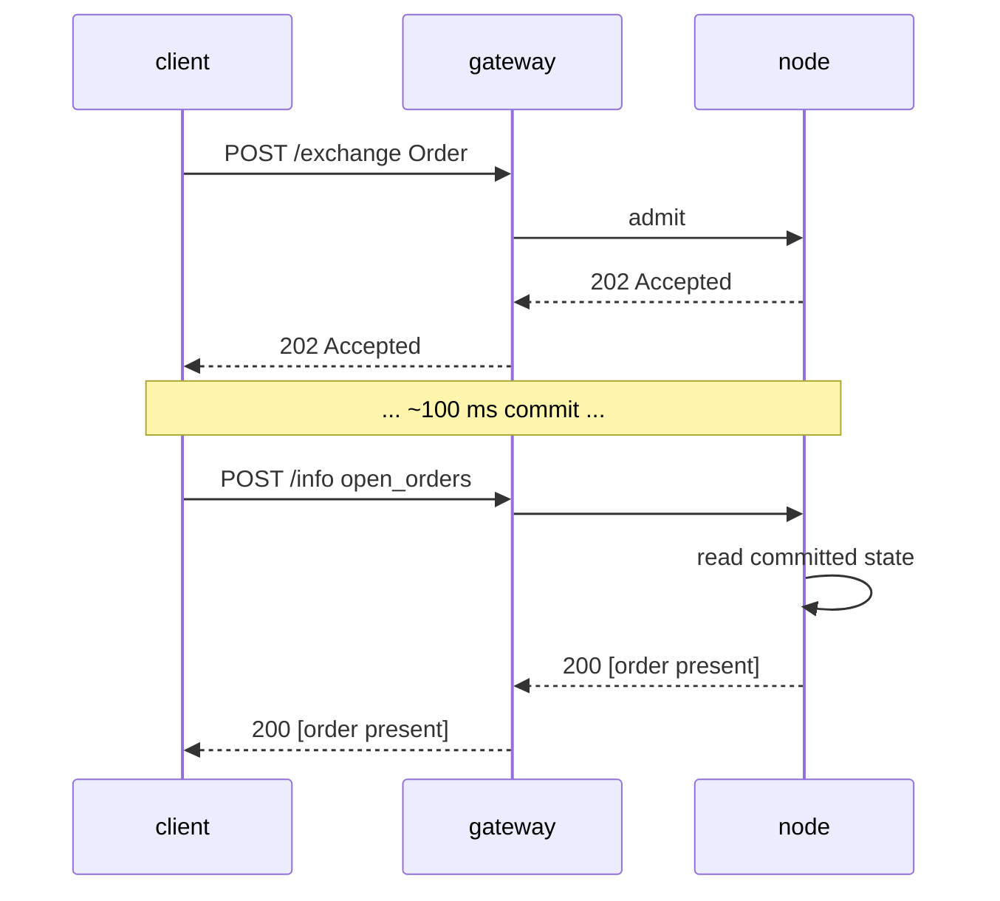

# `POST /info` — chemin de lecture (natif MTF)

:::info
**Statut.** Forme **stable**. De nouveaux types de requêtes sont ajoutés au fil du temps ; l'enveloppe est figée.
:::

## En résumé

Un seul point d'entrée, multi-type. Le dispatch s'effectue sur le champ `type` du corps de la requête. Lecture seule — ne modifie jamais l'état, ne nécessite aucune signature.

## URL

```
POST  https://<net>-gateway.mtf.exchange/info
```

| Chemin | Format wire |
|------|-----------|
| `POST /info` (gateway par défaut) | Natif MTF (ce document) |
| `POST /hl/info` (gateway, sous `/hl`) | **Compatible HL** — voir [hl-compat.md](./hl-compat.md) |

Le format natif MTF est le chemin par défaut du gateway ; le format compatible HL est accessible sous `/hl/*`.
Si vous opérez le nœud vous-même, le même `/info` natif est exposé directement à
`http://localhost:8080`.

## Enveloppe

Requête :

```json
{ "type": "<query_type>", /* args spécifiques au type */ }
```

Réponse :

```json
{ "type": "<query_type>", "data": { /* spécifique au type */ } }
```

En cas de `type` inconnu : `400 Bad Request` avec `{"error":"unknown info type: <X>"}`.
En cas de ressource inconnue (ex. identifiant de coffre inconnu) : `404 Not Found` avec `{"error":"<resource> not found"}`.

## Types de requêtes

### `node_info`

Identité statique du nœud + version du protocole. Aucun paramètre.

```json
{ "type": "node_info" }
```

Réponse :

```json
{
  "type": "node_info",
  "data": {
    "network":           "testnet",
    "chain_id":          114514,
    "protocol_version":  "1.0.0",
    "validator_index":   null,
    "build_commit":      "unknown",
    "version":           "0.0.1",
    "freeze_halt_supported": true,
    "uptime_seconds":    0
  }
}
```

| Champ | Type | Description |
|-------|------|-------------|
| `network` | `"devnet" \| "testnet" \| "mainnet"` | Variante du réseau, déduite du `chain_id` (`31337`=devnet, `114514`=testnet, `8964`=mainnet) |
| `chain_id` | uint64 | Identifiant de chaîne EIP-712 — valeur identique à celle que le domaine de signature `/exchange` doit utiliser |
| `protocol_version` | chaîne semver | Version du protocole wire |
| `validator_index` | uint32 \| null | Index de ce nœud dans l'ensemble de validateurs actifs ; **MARQUÉ :** `null` tant que le runtime n'a pas appelé `set_validator_index` |
| `build_commit` | chaîne hex | Identifiant de build publié par l'opérateur ; **MARQUÉ :** `"unknown"` tant qu'il n'est pas publié |
| `version` | chaîne semver | Version logicielle du nœud, inscrite à la compilation. Une version partage un même `version` entre ses binaires — `build_commit` est le discriminant par build |
| `freeze_halt_supported` | bool | Toujours `true` pour ce binaire — indicateur de capacité : le nœud respecte [`exchange_status.scheduled_freeze_height`](#exchange_status) et s'arrête proprement avec le code de sortie `77` dès que la hauteur de gel est validée, permettant au superviseur de déployer la version suivante |
| `uptime_seconds` | uint64 | Durée de fonctionnement du processus ; **MARQUÉ :** `0` tant que le runtime n'a pas appelé `set_uptime_seconds` |

Ces champs sont **propres au nœud** (identité / runtime), et non à l'état du consensus ; ils peuvent donc légitimement différer d'un nœud à l'autre.

### `account_state`

Instantané par compte.

```json
{ "type": "account_state", "address": "0x<addr>" }
```

| Arg | Type | Requis |
|-----|------|----------|
| `address` | adresse hex | oui |

Une **adresse inconnue** (jamais vue on-chain) renvoie un **200** avec un enregistrement entièrement à zéro
(`account_value:"0"`, `positions` / `balances.spot` vides), et non un `404`.

Réponse (compte alimenté par un faucet, sans position) :

```json
{
  "type": "account_state",
  "data": {
    "address":         "0x00000000000000000000000000000000000ca11e",
    "account_value":   "3000",
    "free_collateral": "3000",
    "maint_margin":    "0",
    "init_margin":     "0",
    "health":          "3000",
    "tier":            "Safe",
    "mode":            "Cross",
    "pm_enabled":      false,
    "positions": [],
    "balances": {
      "usdc": "3000",
      "spot": { "MTF": { "total": "10", "hold": "0" } }
    }
  }
}
```

Chaque jeton dans `balances.spot` est un objet `{total, hold}` (parité HL) : `hold` est
le montant bloqué par un ordre spot en attente (séquestre), `total` est le solde complet ;
le montant disponible est `total − hold`. Un jeton entièrement séquestré
apparaît quand même. Pour une lecture **légère** des scalaires de marge uniquement (sans parcours de `positions`, sans
scan des soldes — l'appel approprié pour une vérification périodique de la santé de liquidation), utilisez
[`margin_summary`](#margin_summary).

Un compte positionné ajoute des entrées sous `positions` :

```json
{
  "asset":             0,
  "size":              "100000000",
  "entry":             "67000.00",
  "upnl":              "5.00",
  "isolated":          false,
  "lev":               10,
  "liq":               "61000.00",
  "roe":               "0.0075",
  "funding":           "-0.12",
  "margin":            "201.00",
  "notional":          "6705.00"
}
```

| Champ | Type | Description |
|-------|------|-------------|
| `account_value` | Chaîne décimale | Capitaux propres incluant le PnL réglé, **plan USDC entier** (`"3000"` = 3000 USDC, NOT en unités de base) |
| `free_collateral` | Chaîne décimale | Capitaux propres moins la marge initiale retenue par les positions ouvertes |
| `maint_margin` | Chaîne décimale | Σ de la marge de maintenance utilisée par actif |
| `init_margin` | Chaîne décimale | Exigence de marge initiale retenue |
| `health` | Chaîne décimale | `account_value − maint_margin` (signé ; peut être négatif) |
| `tier` | enum | `"Safe"`, `"T0"`, `"T1"`, `"T2"`, `"T3"` (tranche BOLE du ratio `account_value / maint_margin` ; `"Safe"` en l'absence de marge de maintenance) — voir [liquidation par paliers](../../concepts/tiered-liquidation.md) |
| `mode` | enum | `"Cross"`, `"Isolated"`, `"StrictIso"` (déduit des positions ouvertes du compte) |
| `pm_enabled` | bool | État d'activation de la marge de portefeuille |
| `positions[*].asset` | uint32 | Identifiant d'actif |
| `positions[*].size` | chaîne i128 | Taille de position signée en **lots bruts** — `size / 10^sz_decimals` = unités entières (`sz_decimals` est la précision de taille du marché, ex. 5 pour BTC). Il s'agit du plan TAILLE, orthogonal au plan prix 1e8. |
| `positions[*].entry` | Chaîne décimale | Prix d'entrée par unité entière = `\|entry_notional\| / \|real size\|`, **plan USDC entier** |
| `positions[*].upnl` | Chaîne décimale | PnL mark-to-market = `real size × mark − signed entry_notional`, **plan USDC entier** (signé) |
| `positions[*].isolated` | bool | `true` sauf si la position est en marge croisée |
| `positions[*].lev` | uint8 | Levier maximum de la position |
| `positions[*].liq` | Chaîne décimale | Prix (USDC entier) auquel cette position seule amènerait le compte à la maintenance — approximation croisée à position unique ; `"0"` lorsque la taille / le levier est nul (pas de prix de liquidation fini) |
| `positions[*].roe` | Chaîne décimale | `upnl / initial_margin` en fraction décimale (`initial_margin = \|entry_notional\| / leverage`) ; `"0"` à levier / notionnel nul |
| `positions[*].funding` | Chaîne décimale | Financement accumulé non réglé pour la jambe, **USDC entier** (signé) ; `real_size × (cumulative_funding − funding_entry)` — même forme que le règlement du financement |
| `positions[*].margin` | Chaîne décimale | Marge de maintenance apportée par la jambe, **USDC entier** : `\|entry_notional\| × maint_margin_ratio` |
| `positions[*].notional` | Chaîne décimale | Notionnel de la position au mark, **USDC entier** (signé) : `real_size × mark_px` |
| `positions[*].side` | enum \| absent | **[Mode couverture](../../concepts/hedge-mode.md) uniquement** — `"long"` / `"short"`, la jambe que décrit cet objet. **Absent sur un compte unidirectionnel** (une seule position *nette* dont `size` peut être négative). Un compte en couverture détenant les deux jambes sur un actif renvoie **deux** objets, un par côté. |
| `balances.usdc` | Chaîne décimale | **Miroir de `account_value`** (le collatéral USDC croisé), et NON un solde USDC spot distinct |
| `balances.spot` | objet | Soldes de jetons spot hors USDC, indexés par **nom de jeton** (ex. `"MTF"`) ; chaque valeur est un objet `{total, hold}` (`hold` = séquestre bloqué par des ordres spot en attente ; disponible = `total − hold`) ; vide si inexistant |

### `margin_summary`

Les **scalaires de marge uniquement** — `account_state` sans le parcours de `positions[]` ni
le scan des soldes spot. L'appel approprié pour une vérification fréquente de la santé de liquidation (un
bot de surveillance du risque, un rechargement automatique de marge) lorsque le détail des positions et des soldes
n'est pas nécessaire. Requis : `address` (hex 0x).

```json
{ "type": "margin_summary", "address": "0x<addr>" }
```

Réponse (`data`) : `address`, `account_value`, `free_collateral`,
`maint_margin`, `init_margin`, `health`, `tier`, `mode`, `pm_enabled` —
sémantique de champ identique aux champs homonymes de
[`account_state`](#account_state) (calculés par le même utilitaire partagé, donc les deux
ne divergent jamais).

### `market_info`

Métadonnées par marché.

```json
{ "type": "market_info", "asset_id": 0 }
```

Ou par nom :

```json
{ "type": "market_info", "coin": "BTC" }
```

Réponse :

```json
{
  "type": "market_info",
  "data": {
    "asset_id":        0,
    "name":            "BTC",
    "kind":            "perp",
    "sz_decimals":     5,
    "mark_px":         "67079.265",
    "oracle_px":       "67073.35",
    "mid_px":          "67079.27",
    "premium":         "0.0015",
    "tick_size":       "1000000",
    "step_size":       "1",
    "min_order":       "1",
    "max_leverage":    50,
    "maint_margin_ratio": "300",
    "init_margin_ratio":  "200",
    "funding": {
      "rate_per_hr":  "0",
      "cap_per_hr":   "400",
      "interval_ms":     3600000,
      "next_payment_ts": 0
    },
    "mark_source": "MedianOfOraclesAndMid",
    "fba_enabled": false,
    "open_interest": "0"
  }
}
```

:::info
**Plan de reporting des prix.** Dans cette lecture, `mark_px` et `oracle_px` sont dans le
**plan décimal USDC entier** (dollars lisibles — `"67079.265"` / `"67073.35"`), la même
unité que le mark des positions de compte. `mark_px` est le mark sur carnet ramené depuis
la représentation interne en virgule fixe 1e8 du moteur, avec repli sur le prix oracle
si le carnet n'a pas encore de mark ; `oracle_px` est le dernier prix d'index validé.
L'un ou l'autre vaut `"0"` s'il n'est pas défini. Notez que **le plan de soumission des ordres/carnets reste en virgule fixe 1e8** — les niveaux de prix dans `l2_book` et les `limit_px` des ordres ne sont PAS en USDC entier ; MTF maintient ces deux plans d'échelle distincts, et seules les lectures orientées utilisateur (`market_info`,
`markets`, positions) reportent les prix en USDC entier. La sémantique des champs pour le reste de
l'enregistrement se trouve dans le tableau [`markets`](#markets) ci-dessous.
:::

:::info
**Précision des prix vs `sz_decimals`.** `mark_px` et `oracle_px` sont **arrrondis au tick de prix
du marché** (`tick_size`, tronqué vers zéro), de sorte qu'une lecture ne montre jamais de bruit sous le tick — avec un tick à `$0.01` (`tick_size: "1000000"` dans le plan 1e8),
`66735.255` est reporté comme `"66735.25"`. Notez que `sz_decimals` est la précision de la **TAILLE**
(granularité de la quantité des ordres — `5` ⇒ `0.00001` unités), il ne régit **pas** les décimales de prix ; c'est le tick de prix qui les régit. Les deux axes sont indépendants (même séparation qu'utilise HL).
:::

### `markets`

Tous les marchés à contrat perpétuel MIP-3 enregistrés, en un seul appel. Aucun paramètre.

```json
{ "type": "markets" }
```

Le contenu `data` est un **tableau** du même enregistrement riche par marché que
[`market_info`](#market_info) renvoie pour un actif unique. Les enregistrements sont ordonnés
de façon déterministe par `asset_id` croissant (le nœud itère le
`BTreeMap` `mip3_market_specs`). Un univers vide renvoie `"data": []`.

Réponse :

```json
{
  "type": "markets",
  "data": [
    {
      "asset_id":        0,
      "name":            "BTC",
      "kind":            "perp",
      "sz_decimals":     5,
      "mark_px":         "67042.335",
      "oracle_px":       "67042.335",
      "mid_px":          "67042.33",
      "premium":         "0.0015",
      "tick_size":       "1000000",
      "step_size":       "1",
      "min_order":       "1",
      "max_leverage":    50,
      "maint_margin_ratio": "300",
      "init_margin_ratio":  "200",
      "funding": {
        "rate_per_hr":  "0",
        "cap_per_hr":   "400",
        "interval_ms":     3600000,
        "next_payment_ts": 0
      },
      "mark_source": "MedianOfOraclesAndMid",
      "fba_enabled": false,
      "open_interest": "0"
    }
  ]
}
```

| Champ | Type | Description |
|-------|------|-------------|
| `asset_id` | uint32 | Identifiant d'actif canonique (clé de tri) |
| `name` | string | Symbole du marché, ex. `"BTC"` |
| `kind` | `"perp"` | Type de marché (minuscules) |
| `sz_decimals` | uint8 | Décimales d'affichage de la taille (issues du registre de jetons spot sous-jacent ; `0` si aucune spécification de jeton) |
| `mark_px` | Chaîne décimale | Mark sur carnet, **plan USDC entier** (mark du carnet ramené depuis 1e8, repli oracle ; `"0"` si non défini) |
| `oracle_px` | Chaîne décimale | Prix d'index, **plan USDC entier** (`"0"` si non défini) |
| `mid_px` | Chaîne décimale \| null | Milieu réel du carnet d'ordres `(meilleur bid + meilleur ask) / 2`, **plan USDC entier** (arrondi au tick) ; `null` si le carnet est unilatéral / vide |
| `premium` | Chaîne décimale \| null | Dernier échantillon de prime de financement validé (signé) ; `null` si aucun échantillon n'existe |
| `tick_size` | chaîne i128 | Incrément de prix minimum, **virgule fixe 1e8** (plan de soumission des ordres/carnets) |
| `step_size` | chaîne u128 | Incrément de taille minimum (taille de lot), en virgule fixe |
| `min_order` | chaîne u128 | Taille minimale d'un ordre |
| `max_leverage` | uint8 | Levier maximum |
| `maint_margin_ratio` | chaîne bps | Ratio de marge de maintenance, en bps décimaux |
| `init_margin_ratio` | chaîne bps | Ratio de marge initiale (`1 / max_leverage`), en bps décimaux |
| `funding.rate_per_hr` | chaîne bps | Dernier échantillon de prime de financement, en bps décimaux |
| `funding.cap_per_hr` | chaîne bps | Plafond du taux de financement par heure, en bps décimaux |
| `funding.interval_ms` | uint64 | Cadence du financement (1h = `3600000`) |
| `funding.next_payment_ts` | uint64 | Horodatage du prochain paiement de financement (`0` tant qu'aucun échantillon n'existe) |
| `mark_source` | string | Descripteur du prix mark (`"MedianOfOraclesAndMid"`) |
| `fba_enabled` | bool | Enchère par lot fréquente activée pour ce marché |
| `open_interest` | chaîne u128 | Intérêt ouvert actuel, en virgule fixe |

Chaque élément est identique octet pour octet à l'objet `data` de la réponse `market_info` pour l'actif unique correspondant — les deux sont construits à partir du même constructeur d'enregistrement par marché, de sorte que les formes unitaire et groupée ne divergent jamais. Voir [`market_info`](#market_info) pour
la sémantique au niveau des champs et les notes sur les proxies MARQUÉS (`mark_source`,
`next_payment_ts`).

### `vault_state`

Instantané par coffre.

```json
{ "type": "vault_state", "vault": "0x<vault_addr>" }
```

Réponse :

```json
{
  "type": "vault_state",
  "data": {
    "vault":              "0x<addr>",
    "name":               "MFlux Conservative",
    "tvl":             "10000000000",
    "share_price":     "10500000",
    "depositor_count":    142,
    "high_water_mark": "10500000",
    "performance_fee_bps":1000,
    "lock_period_ms":     86400000,
    "strategy":           "MarketNeutral"
  }
}
```

### `staking_state`

```json
{ "type": "staking_state", "address": "0x<addr>" }
```

Réponse :

```json
{
  "type": "staking_state",
  "data": {
    "address":         "0x<addr>",
    "total_staked": "1000000000",
    "delegations": [
      {
        "validator":         "0x<val_addr>",
        "amount":         "500000000",
        "since_ts":          1735000000000,
        "pending_rewards":"1000000"
      }
    ],
    "pending_unstakes": [
      { "amount": "200000000", "matures_at_ts": 1735780000000 }
    ]
  }
}
```

### `fee_schedule`

```json
{ "type": "fee_schedule" }
```

Réponse :

```json
{
  "type": "fee_schedule",
  "data": {
    "tiers": [
      { "volume_30d": "0",         "maker_bps": "2.0", "taker_bps": "5.0" },
      { "volume_30d": "100000000", "maker_bps": "1.5", "taker_bps": "4.5" },
      { "volume_30d": "1000000000","maker_bps": "1.0", "taker_bps": "4.0" }
    ],
    "builder_rebate_bps": "0.2",
    "burn_ratio":         "0.30",
    "referrer_share_bps": "1.0"
  }
}
```

Les taux de frais sont exprimés en **points de base** décimaux sous forme de chaînes (`"2.0"` = 2 pbs = 0,02 %). `burn_ratio` est une fraction décimale (`"0.30"` = 30 % des frais brûlés). Voir [frais](../../concepts/fees.md).

### `open_orders`

Ordres en attente associés à un compte, sur l'ensemble des carnets de perps.

```json
{ "type": "open_orders", "account_id": 42 }
```

| Argument | Type | Requis |
|-----|------|----------|
| `account_id` | uint64 | l'un des deux : `account_id` / `address` |
| `address` | adresse hex | l'un des deux : `account_id` / `address` |

`account_id` (u64) ou `address` (hex préfixé 0x) identifient le compte. Lorsque la
requête fournit `account_id`, celui-ci est renvoyé dans `data.account_id`.

Réponse :

```json
{
  "type": "open_orders",
  "data": {
    "address":    "0x<addr>",
    "account_id": 42,
    "orders": [
      {
        "oid":          12345,
        "market_id":    0,
        "side":         "bid",
        "px":        "99000",
        "size":      "700",
        "cloid":        "0x000000000000000000000000cafef00d",
        "inserted_at_ms": 1700000000000
      }
    ]
  }
}
```

| Champ | Type | Description |
|-------|------|-------------|
| `address` | adresse hex | Adresse du compte résolue |
| `account_id` | uint64 | Renvoyé uniquement si la requête utilisait `account_id` |
| `orders[*].oid` | uint64 | Identifiant d'ordre côté serveur |
| `orders[*].market_id` | uint32 | Identifiant d'actif / de marché sur lequel l'ordre repose |
| `orders[*].side` | `"bid"` / `"ask"` | Côté de l'ordre |
| `orders[*].px` | chaîne i128 | Prix en attente, chaîne décimale à virgule fixe |
| `orders[*].size` | chaîne u128 | Taille résiduelle, chaîne décimale à virgule fixe |
| `orders[*].cloid` | chaîne hex \| null | Identifiant d'ordre client utilisé lors du placement (`0x` + 32 caractères hex) ; `null` si aucun n'a été fourni |
| `orders[*].inserted_at_ms` | uint64 | Horodatage de placement / d'insertion (ms consensus) |

### `l2_book`

Niveaux bid/ask agrégés pour un marché donné.

```json
{ "type": "l2_book", "market_id": 0 }
```

| Argument | Type | Requis |
|-----|------|----------|
| `market_id` | uint32 | oui |

Réponse :

```json
{
  "type": "l2_book",
  "data": {
    "market_id": 0,
    "bids": [ { "px": "99000", "size": "700", "n_orders": 1 } ],
    "asks": [ { "px": "101000", "size": "750", "n_orders": 2 } ]
  }
}
```

Les bids sont triés du meilleur au moins bon (prix décroissant), les asks en ordre croissant. Chaque niveau agrège la `size` cumulée et le nombre d'ordres en attente `n_orders`. Un marché inconnu ou vide renvoie des tableaux `bids` / `asks` vides.

| Champ | Type | Description |
|-------|------|-------------|
| `market_id` | uint32 | Identifiant de marché renvoyé |
| `bids[*].px` / `asks[*].px` | chaîne i128 | Prix du niveau, chaîne décimale à virgule fixe |
| `bids[*].size` / `asks[*].size` | chaîne u128 | Taille cumulée au niveau |
| `bids[*].n_orders` / `asks[*].n_orders` | uint64 | Ordres en attente au niveau |

### `recent_trades`

Historique public des transactions pour un marché, servi directement depuis l'état engagé du nœud
(un anneau de transactions par marché borné, intégré dans l'AppHash — sans indexeur externe).

```json
{ "type": "recent_trades", "market_id": 0 }
```

| Argument | Type | Requis | Description |
|-----|------|----------|-------------|
| `market_id` | uint32 | oui | Identifiant d'actif / de marché |
| `limit` | uint32 | non | Limite le nombre d'enregistrements **les plus récents** retournés ; absent / `0` ⇒ anneau complet |

Réponse :

```json
{
  "type": "recent_trades",
  "data": {
    "market_id":      0,
    "last_trade_ms":  1700000000555,
    "trades": [
      {
        "coin":  0,
        "side":  "B",
        "px":    "67042.50",
        "sz":    "0.125",
        "time":  1700000000555,
        "tid":   90123,
        "block": 562,
        "hash":  "0x2315b79b9e82c2deb279a59448bf7841f3767d30d874e5b544d75bb9fd1e9b0c"
      }
    ]
  }
}
```

Les enregistrements sont triés du plus ancien au plus récent. L'anneau étant borné, il s'agit d'une
fenêtre récente, et non de l'historique complet. Un marché inconnu ou sans transactions renvoie
`"trades": []` et `last_trade_ms: 0`.

| Champ | Type | Description |
|-------|------|-------------|
| `market_id` | uint32 | Identifiant de marché renvoyé |
| `last_trade_ms` | uint64 | Horodatage de la dernière transaction (`0` si aucune) |
| `trades[*].coin` | uint32 | Identifiant d'actif / de marché sur lequel la transaction a été exécutée |
| `trades[*].side` | `"B"` / `"A"` | Jeton de côté de l'aggresseur — `"B"` = achat, `"A"` = vente |
| `trades[*].px` | Chaîne décimale | Prix d'exécution, **USDC décimal** (lisible par l'humain) |
| `trades[*].sz` | Chaîne décimale | Taille exécutée, **unités de base** (entières) |
| `trades[*].time` | uint64 | Horodatage de la transaction (ms consensus) |
| `trades[*].tid` | uint64 | Identifiant de transaction déterministe (partagé par les deux jambes du print) |
| `trades[*].block` | uint64 | Hauteur de bloc engagé dans lequel la transaction a été réglée (localisateur on-chain) |
| `trades[*].hash` | chaîne hex | Hash de la transaction de l'ordre d'origine, hex préfixé `0x` — permet de retracer un print on-chain |

### `candle`

Bougies OHLCV historiques pour `(coin, interval)` sur une fenêtre temporelle. Équivalent REST
du canal WS live [`candles`](../ws/subscriptions.md#candles) — le WS pousse la bougie en cours
de formation au fil des transactions, cette lecture renvoie l'historique des bougies clôturées.

```json
{ "type": "candle", "coin": "BTC", "interval": "1m" }
```

| Argument | Type | Requis | Description |
|-----|------|----------|-------------|
| `coin` | string | oui | Symbole de marché, ex. `"BTC"` |
| `interval` | string | oui | Jeton de bucket — l'un des suivants : `1m`, `5m`, `15m`, `1h`, `4h`, `1d` |
| `start_time` | uint64 | non | Début de la fenêtre (ms) ; filtre sur l'ouverture de la bougie. Défaut `0` |
| `end_time` | uint64 | non | Fin de la fenêtre (ms) ; filtre sur l'ouverture de la bougie. Défaut non borné |

Les arguments peuvent être passés à plat (ci-dessus) ou imbriqués sous un objet `req` ; `start_time` /
`end_time` acceptent aussi l'orthographe camelCase `startTime` / `endTime`. `coin` ou `interval` manquant → `400 {"error":"missing field <name>"}`.

Réponse :

```json
{
  "type": "candle",
  "data": [
    {
      "t": 1700000040000,
      "T": 1700000099999,
      "s": "BTC",
      "i": "1m",
      "o": "67000.00",
      "c": "67042.50",
      "h": "67080.00",
      "l": "66990.00",
      "v": "12.5",
      "q": "837843.75",
      "n": 37
    }
  ]
}
```

Les bougies sont triées de la plus ancienne à la plus récente par `t` (heure d'ouverture) ; le dernier élément est la bougie en cours de formation. Un tableau vide est la réponse honnête pour un jeton `interval` non supporté, un marché sans transactions indexées, ou un déploiement sans indexeur configuré.

| Champ | Type | Description |
|-------|------|-------------|
| `t` | uint64 | Horodatage d'**ouverture** de la bougie (ms, aligné sur le bucket) |
| `T` | uint64 | Horodatage de **clôture** de la bougie (ms) — `t + interval − 1` |
| `s` | string | Symbole de coin / de marché |
| `i` | string | Jeton de bucket d'intervalle |
| `o` / `c` / `h` / `l` | Chaîne décimale | Prix d'**o**uverture / de **c**lôture / **h**aut / **b**as, **USDC décimal** (en dollars, ex. `"67042.50"`) |
| `v` | Chaîne décimale | **Volume en actif de base** — Σ taille échangée dans la bougie (taille en coin, PAS en notionnel) |
| `q` | Chaîne décimale | **Volume en quote (USD)** — `Σ prix × taille` sur les exécutions de la bougie |
| `n` | uint64 | Nombre de transactions (exécutions) dans la bougie |

:::info
**La série est sans lacunes.** Un intervalle **sans transactions** émet quand même une bougie plate
reprenant la clôture de la bougie précédente : `o = h = l = c = clôture précédente`, et
`v = q = 0`, `n = 0`. Les consommateurs obtiennent une série continue de bougies par intervalle, sans
trous à interpoler. **Aucune bougie n'est émise avant la première transaction du marché** — la
série commence au bucket de la première exécution ; un tableau vide signifie que le marché
n'a jamais été échangé (ou qu'aucun historique n'est configuré), et non que les premiers buckets ont été supprimés.
:::

:::info
**Ce type est servi par la passerelle, pas par le nœud.** Les bougies sont des données d'affichage
dérivées du flux de transactions public — elles ne constituent **pas** un état de chaîne engagé,
n'entrent jamais dans l'app-hash et ne bénéficient d'aucune garantie de consensus. La
passerelle répond aux requêtes `candle` depuis son propre store en mémoire ; un nœud nu interrogé
directement renvoie `unknown info type: candle`. Réponse honnêtement vide (`"data": []`) si
la passerelle ne possède pas encore d'historique de transactions pour ce marché.
:::

### `user_fills`

Historique des exécutions d'un compte, servi directement depuis l'état engagé du nœud (un
anneau d'exécutions par compte borné, intégré dans l'AppHash — sans indexeur externe).

```json
{ "type": "user_fills", "account_id": 42 }
```

| Argument | Type | Requis | Description |
|-----|------|----------|-------------|
| `account_id` | uint64 | l'un des deux : `account_id` / `address` | Identifiant interne du compte |
| `address` | adresse hex | l'un des deux : `account_id` / `address` | Adresse du compte |
| `limit` | uint32 | non | Limite le nombre d'enregistrements **les plus récents** retournés ; absent / `0` ⇒ anneau complet |

`account_id` (u64) ou `address` (hex préfixé 0x) identifient le compte. Lorsque la
requête fournit `account_id`, celui-ci est renvoyé dans `data.account_id`.

Réponse :

```json
{
  "type": "user_fills",
  "data": {
    "address":    "0x<addr>",
    "account_id": 42,
    "fills": [
      {
        "coin":           0,
        "side":           "B",
        "px":             "67042.50",
        "sz":             "0.125",
        "time":           1700000000555,
        "oid":            12345,
        "tid":            90123,
        "fee":            "4.19",
        "closed_pnl":     "0",
        "dir":            "Open Long",
        "start_position": "0",
        "block":          562,
        "hash":           "0x2315b79b9e82c2deb279a59448bf7841f3767d30d874e5b544d75bb9fd1e9b0c"
      }
    ]
  }
}
```

Les enregistrements sont triés du plus ancien au plus récent. L'anneau étant borné, il s'agit d'une
fenêtre récente, et non de l'historique complet. Un compte sans exécutions renvoie
`"fills": []`.

| Champ | Type | Description |
|-------|------|-------------|
| `address` | adresse hex | Adresse du compte résolue |
| `account_id` | uint64 | Renvoyé uniquement si la requête utilisait `account_id` |
| `fills[*].coin` | uint32 | Identifiant d'actif / de marché sur lequel l'exécution a eu lieu |
| `fills[*].side` | `"B"` / `"A"` | Jeton de côté de cette jambe — `"B"` = achat/bid, `"A"` = vente/ask |
| `fills[*].px` | Chaîne décimale | Prix d'exécution, **USDC décimal** (lisible par l'humain) |
| `fills[*].sz` | Chaîne décimale | Taille exécutée, **unités de base** (entières) |
| `fills[*].time` | uint64 | Horodatage de l'exécution (ms consensus) |
| `fills[*].oid` | uint64 | Identifiant d'ordre de cette partie |
| `fills[*].tid` | uint64 | Identifiant de transaction déterministe (partagé par les deux jambes du print) |
| `fills[*].fee` | Chaîne décimale | Frais payés par cette partie, **USDC décimal** |
| `fills[*].closed_pnl` | Chaîne décimale | PnL réalisé sur la portion clôturée, **USDC décimal** (signé) |
| `fills[*].dir` | string | Libellé de direction, ex. `"Open Long"`, `"Close Short"`, `"Open Short"`, `"Close Long"` |
| `fills[*].start_position` | Chaîne décimale | Taille signée de la jambe AVANT l'exécution, **unités de base** (entières, signée) |
| `fills[*].block` | uint64 | Hauteur de bloc engagé dans lequel l'exécution a été réglée (localisateur on-chain) |
| `fills[*].hash` | chaîne hex | Hash de la transaction de l'ordre d'origine, hex préfixé `0x` — permet de retracer l'exécution on-chain |

### `user_fills_by_time`

Similaire à [`user_fills`](#user_fills), mais filtré sur une fenêtre temporelle basée sur le
`time` consensus de chaque enregistrement. Même structure d'enregistrement d'exécution.

```json
{ "type": "user_fills_by_time", "address": "0x<addr>", "start_time": 1700000000000, "end_time": 1700003600000 }
```

| Argument | Type | Requis | Description |
|-----|------|----------|-------------|
| `account_id` | uint64 | l'un des deux : `account_id` / `address` | Identifiant interne du compte |
| `address` | adresse hex | l'un des deux : `account_id` / `address` | Adresse du compte |
| `start_time` | uint64 | non | Début de la fenêtre (ms, inclusif) ; filtre sur le `time` de l'exécution. Absent ⇒ borne inférieure ouverte |
| `end_time` | uint64 | non | Fin de la fenêtre (ms, inclusif). Absent ⇒ borne supérieure ouverte |

Réponse :

```json
{
  "type": "user_fills_by_time",
  "data": {
    "address":    "0x<addr>",
    "account_id": 42,
    "start_time": 1700000000000,
    "end_time":   1700003600000,
    "fills": [ /* même structure d'enregistrement que user_fills */ ]
  }
}
```

| Champ | Type | Description |
|-------|------|-------------|
| `address` | adresse hex | Adresse du compte résolue |
| `account_id` | uint64 | Renvoyé uniquement si la requête utilisait `account_id` |
| `start_time` | uint64 \| null | Début de fenêtre renvoyé (`null` si omis) |
| `end_time` | uint64 \| null | Fin de fenêtre renvoyée (`null` si omis) |
| `fills` | array | Enregistrements d'exécution dans la fenêtre (même structure par exécution que [`user_fills`](#user_fills)), du plus ancien au plus récent |

### `order_status`

Recherche du cycle de vie d'un ordre unique par `oid` (identifiant d'ordre serveur) **ou** `cloid` (identifiant
d'ordre client). Consulte les carnets en cours, le registre des triggers et l'anneau d'exécutions engagé —
tout en état engagé sur le nœud.

```json
{ "type": "order_status", "oid": 12345 }
```

Ou par identifiant d'ordre client :

```json
{ "type": "order_status", "cloid": "0x000000000000000000000000cafef00d" }
```

| Argument | Type | Requis | Description |
|-----|------|----------|-------------|
| `oid` | uint64 | l'un des deux : `oid` / `cloid` | Identifiant d'ordre serveur |
| `cloid` | chaîne hex | l'un des deux : `oid` / `cloid` | Identifiant d'ordre client — `0x` + 32 caractères hex |

Aucun des deux présent → `400 {"error":"missing field oid or cloid"}`. Un
`cloid` malformé → `400`. La résolution s'arrête au premier résultat, dans cet ordre : ordre en attente actif → trigger en attente → exécution terminale → inconnu.

`data.status` discrimine la branche :

`"resting"` — un ordre actif ouvert dans un carnet perp ou spot :

```json
{
  "type": "order_status",
  "data": {
    "status": "resting",
    "order": {
      "oid":            12345,
      "market_id":      0,
      "side":           "bid",
      "px":             "67000",
      "size":           "700",
      "inserted_at_ms": 1700000000000,
      "cloid":          "0x000000000000000000000000cafef00d"
    }
  }
}
```

`"triggered"` — un TP/SL/ordre stop en attente, attendant le franchissement du prix mark :

```json
{
  "type": "order_status",
  "data": {
    "status": "triggered",
    "trigger": {
      "oid":              12345,
      "market_id":        0,
      "side":             "ask",
      "trigger_px":       "66000",
      "trigger_above":    false,
      "size":             "700",
      "registered_at_ms": 1700000000000,
      "fired":            false
    }
  }
}
```

`"filled"` — l'exécution la plus récente correspondante dans l'anneau par compte (l'objet `fill`
a la même structure qu'un enregistrement [`user_fills`](#user_fills)) :

```json
{
  "type": "order_status",
  "data": {
    "status": "filled",
    "fill": { /* même structure qu'un enregistrement d'exécution user_fills */ }
  }
}
```

`"unknown"` — jamais vu, ou expulsé de l'anneau borné (une requête uniquement par `cloid`
ne correspondant à aucun ordre en attente ou triggeré arrive aussi ici, car le registre des triggers
et l'anneau d'exécutions sont indexés par `oid`) :

```json
{ "type": "order_status", "data": { "status": "unknown" } }
```

| Champ | Type | Description |
|-------|------|-------------|
| `status` | `"resting" \| "triggered" \| "filled" \| "unknown"` | État du cycle de vie résolu |
| `order` | object | Présent pour `"resting"` — `oid`, `market_id`, `side` (`"bid"`/`"ask"`), `px` / `size` (chaînes décimales à virgule fixe), `inserted_at_ms`, `cloid` (hex \| null) |
| `trigger` | object | Présent pour `"triggered"` — `oid`, `market_id`, `side`, `trigger_px` / `size` (chaînes décimales à virgule fixe), `trigger_above` (bool : déclenchement quand le mark dépasse ce seuil), `registered_at_ms`, `fired` (bool) |
| `fill` | object | Présent pour `"filled"` — l'enregistrement d'exécution correspondant (voir [`user_fills`](#user_fills)) |

### `funding_history`

Échantillons de prime de financement par marché.

```json
{ "type": "funding_history", "market_id": 0 }
```

| Arg | Type | Requis |
|-----|------|----------|
| `market_id` | uint32 | oui |

Réponse :

```json
{
  "type": "funding_history",
  "data": {
    "market_id": 0,
    "samples": [
      { "ts_ms": 1700000000000, "premium": "0.0015", "funding_rate": "0.0015" },
      { "ts_ms": 1700000008000, "premium": "-0.0007", "funding_rate": "-0.0007" }
    ]
  }
}
```

Les échantillons constituent l'anneau ordonné d'instantanés de prime issus du suivi du financement.
`premium` est la valeur exacte `Decimal` avant plafonnement, rendue sous forme de chaîne (signée, précision
complète) ; `funding_rate` est cette prime passée à travers le plafond de financement par actif
(`±funding_rate_cap`, le seuil de risque dynamique ou le taux de base de `0.04`/h)
— c'est-à-dire le taux effectivement appliqué. Lorsque la prime est
dans les limites du plafond, `funding_rate == premium` ; au-delà, `funding_rate` est tronqué au
plafond signé. Un marché inconnu ou vide retourne `"samples": []`.

| Champ | Type | Description |
|-------|------|-------------|
| `market_id` | uint32 | Identifiant de marché renvoyé en écho |
| `samples[*].ts_ms` | uint64 | Horodatage de l'échantillon (ms consensus) |
| `samples[*].premium` | decimal string | Échantillon brut de prime de financement, avant plafonnement (signé) |
| `samples[*].funding_rate` | decimal string | Taux effectif = `premium` tronqué au plafond par actif (signé) |

### `predicted_fundings`

Taux de financement prédit par marché + heure du prochain paiement, pour chaque marché
perpétuel enregistré. Aucun paramètre.

```json
{ "type": "predicted_fundings" }
```

Le contenu `data` est un **tableau**, ordonné de façon déterministe par `asset` croissant
(le nœud itère la `BTreeMap` des spécifications de marché). Un univers vide retourne
`"data": []`.

Réponse :

```json
{
  "type": "predicted_fundings",
  "data": [
    { "asset": 0, "predicted_rate": "0.0015", "next_funding_time": 1700003600000 }
  ]
}
```

`predicted_rate` est le dernier échantillon de prime (proxy du taux par heure, chaîne décimale)
— `"0"` avant le premier échantillon. `next_funding_time` est l'horodatage du prochain
paiement dérivé (`last_sample_ts + 1h`), `0` avant le premier échantillon.

| Champ | Type | Description |
|-------|------|-------------|
| `asset` | uint32 | Identifiant de l'actif / du marché |
| `predicted_rate` | decimal string | Dernier échantillon de prime (proxy du taux par heure) ; `"0"` avant le premier échantillon |
| `next_funding_time` | uint64 | Horodatage du prochain paiement de financement (ms consensus) ; `0` avant le premier échantillon |

### `block_info`

Métadonnées du bloc validé. Aucun argument requis (`height` est accepté mais ignoré —
l'état de lecture ne conserve que le dernier contexte validé).

```json
{ "type": "block_info" }
```

Réponse :

```json
{
  "type": "block_info",
  "data": {
    "height":       562,
    "round":        562,
    "epoch":        0,
    "timestamp_ms": 1780475491562,
    "block_hash":   "0x2315b79b9e82c2deb279a59448bf7841f3767d30d874e5b544d75bb9fd1e9b0c"
  }
}
```

| Champ | Type | Description |
|-------|------|-------------|
| `height` | uint64 | Hauteur du dernier bloc validé |
| `round` | uint64 | Tour de consensus de ce bloc |
| `epoch` | uint64 | Époque actuelle |
| `timestamp_ms` | uint64 | Horodatage du bloc (ms consensus) |
| `block_hash` | hex string (32 bytes) | Hash réel du bloc validé (désormais intégré à l'état de lecture — plus de valeur fictive à zéro) |

### `agents`

Portefeuilles agents / API approuvés pour un compte.

```json
{ "type": "agents", "account_id": 42 }
```

| Arg | Type | Requis |
|-----|------|----------|
| `account_id` | uint64 | l'un de `account_id` / `address` |
| `address` | hex address | l'un de `account_id` / `address` |

Réponse :

```json
{
  "type": "agents",
  "data": {
    "address":    "0x<master>",
    "account_id": 42,
    "agents": [
      { "agent": "0x<agent_addr>", "name": "trading-bot", "expires_at_ms": 1700000500000 }
    ]
  }
}
```

| Champ | Type | Description |
|-------|------|-------------|
| `address` | hex address | Adresse principale résolue |
| `account_id` | uint64 | Renvoyé en écho uniquement si la requête utilisait `account_id` |
| `agents[*].agent` | hex address | Adresse du portefeuille agent approuvé |
| `agents[*].name` | string \| null | Libellé de l'agent défini lors de l'approbation ; `null` si non renseigné |
| `agents[*].expires_at_ms` | uint64 \| null | Expiration de l'approbation de l'agent (ms consensus) ; `null` pour une approbation sans expiration |

### `sub_accounts`

Sous-comptes d'un compte.

```json
{ "type": "sub_accounts", "account_id": 42 }
```

| Arg | Type | Requis |
|-----|------|----------|
| `account_id` | uint64 | l'un de `account_id` / `address` |
| `address` | hex address | l'un de `account_id` / `address` |

Réponse :

```json
{
  "type": "sub_accounts",
  "data": {
    "address":    "0x<parent>",
    "account_id": 42,
    "sub_accounts": [
      { "index": 0, "address": "0x<sub_addr>" }
    ]
  }
}
```

| Champ | Type | Description |
|-------|------|-------------|
| `address` | hex address | Adresse parente résolue |
| `account_id` | uint64 | Renvoyé en écho uniquement si la requête utilisait `account_id` |
| `sub_accounts[*].index` | uint32 | Index du sous-compte sous le compte parent |
| `sub_accounts[*].address` | hex address | Adresse du sous-compte |

### `mip3_active_bids`

Instantané de l'enchère de gaz pour le déploiement permissionless de contrats perpétuels MIP-3. Aucun paramètre.

```json
{ "type": "mip3_active_bids" }
```

Réponse :

```json
{
  "type": "mip3_active_bids",
  "data": {
    "auction_round":   2,
    "current_bid":     "12345",
    "current_winner":  "0x<bidder>",
    "auction_end_ms":  1700086400000,
    "started_at_ms":   1700000000000,
    "bids": [
      {
        "bidder":          "0x<bidder>",
        "amount":          "12345",
        "submitted_at_ms": 1700000000500,
        "tag":             "ETH-PERP"
      }
    ]
  }
}
```

| Champ | Type | Description |
|-------|------|-------------|
| `auction_round` | uint64 | Tour d'enchère actuel |
| `current_bid` | decimal string | Montant de l'offre en tête |
| `current_winner` | hex address \| null | Enchérisseur actuellement gagnant, `null` si aucun |
| `auction_end_ms` | uint64 | Horodatage de clôture de l'enchère (ms consensus) |
| `started_at_ms` | uint64 | Horodatage de début de l'enchère (ms consensus) |
| `bids[*].bidder` | hex address | Adresse de l'enchérisseur |
| `bids[*].amount` | decimal string | Montant de l'offre |
| `bids[*].submitted_at_ms` | uint64 | Horodatage de soumission de l'offre (ms consensus) |
| `bids[*].tag` | string | Étiquette de l'offre (ex. le nom de marché proposé) |

### `protocol_metrics`

Accumulateurs / compteurs validés à l'échelle du protocole. Aucun paramètre. Chaque champ est
lu directement depuis l'état `Exchange` validé (compteurs, pools de frais, réserves BOLE,
staking) — rien n'est calculé à partir du moteur de correspondance ou de l'oracle, donc une
relecture reproduit les valeurs exactement.

```json
{ "type": "protocol_metrics" }
```

Réponse :

```json
{
  "type": "protocol_metrics",
  "data": {
    "counters": {
      "total_orders":               1000,
      "total_fills":                750,
      "total_liquidations":         3,
      "total_deposits":             40,
      "total_withdrawals":          12,
      "total_vault_transfers":      0,
      "total_sub_account_transfers":0
    },
    "fee_pools": {
      "burned":         "8000",
      "mflux_vault":    "0",
      "validator_pool": "1000",
      "treasury":       "1000",
      "burned_mtf":     "55"
    },
    "insurance_fund_total":    "750",
    "treasury_backstop_total": "9000",
    "bole_pool": {
      "total_deposits":  "20000",
      "shortfall_total": "7"
    },
    "open_interest_total_1e8": "1500000",
    "staking": {
      "total_stake":   "100",
      "n_validators":  1,
      "n_active":      1,
      "n_jailed":      0,
      "current_epoch": 4
    },
    "counts": {
      "n_markets":             1,
      "n_spot_pairs":          5,
      "n_user_vaults":         0,
      "n_accounts_with_state": 12
    }
  }
}
```

| Champ | Type | Description |
|-------|------|-------------|
| `counters.total_orders` | uint64 | Ordres admis sur la durée de vie |
| `counters.total_fills` | uint64 | Exécutions sur la durée de vie (seul signal d'échange détaillé — un **nombre**, pas un notionnel) |
| `counters.total_liquidations` | uint64 | Liquidations sur la durée de vie |
| `counters.total_deposits` / `total_withdrawals` | uint64 | Nombre de dépôts / retraits sur la durée de vie |
| `counters.total_vault_transfers` | uint64 | Transferts vers/depuis les coffres sur la durée de vie |
| `counters.total_sub_account_transfers` | uint64 | Transferts entre sous-comptes sur la durée de vie |
| `fee_pools.burned` | Decimal string | USDC cumulatif acheminé vers le rachat et la destruction (USDC entier) |
| `fee_pools.mflux_vault` | Decimal string | Accumulation cumulée de frais du coffre MFlux (`"0"` — part du coffre nulle) |
| `fee_pools.validator_pool` | Decimal string | Accumulation cumulée de frais du pool de validateurs (USDC entier) |
| `fee_pools.treasury` | Decimal string | Accumulation cumulée de frais de la trésorerie (USDC entier) |
| `fee_pools.burned_mtf` | Decimal string | MTF cumulatif retiré de la circulation par l'exécuteur de rachat |
| `insurance_fund_total` | Decimal string | Σ réserves `bole_pool.insurance_fund` par actif (USDC entier) |
| `treasury_backstop_total` | Decimal string | Σ réserves `bole_pool.treasury_backstop` par actif (USDC entier) |
| `bole_pool.total_deposits` | Decimal string | Total des dépôts dans le pool de prêt BOLE (USDC entier) |
| `bole_pool.shortfall_total` | Decimal string | Σ créances irrécouvrables résiduelles après la cascade ADL → assurance → trésorerie |
| `open_interest_total_1e8` | u128 string | Σ positions ouvertes par marché, **plan comptable 1e8** (libellé `_1e8`, PAS en USDC entier) |
| `staking.total_stake` | Decimal string | MTF total mis en staking (MTF entier) |
| `staking.n_validators` | uint64 | Validateurs dans l'ensemble validé |
| `staking.n_active` | uint64 | Validateurs actifs cette époque |
| `staking.n_jailed` | uint64 | Validateurs actuellement emprisonnés |
| `staking.current_epoch` | uint64 | Époque de staking actuelle |
| `counts.n_markets` | uint64 | Marchés perpétuels MIP-3 enregistrés (`mip3_market_specs`) |
| `counts.n_spot_pairs` | uint64 | Paires spot enregistrées (`mip3_spot_pair_specs`) |
| `counts.n_user_vaults` | uint64 | Coffres utilisateur enregistrés |
| `counts.n_accounts_with_state` | uint64 | Comptes disposant d'un état utilisateur validé |

:::info
**Aucun chiffre cumulatif de volume échangé.** Le moteur suit le **volume de frais sur 30 jours** par utilisateur
(voir [`user_fees`](#user_fees)) et un **nombre** cumulatif d'exécutions
(`counters.total_fills`) — il n'existe **aucun accumulateur validé de volume USD échangé à l'échelle du protocole**,
aussi cette lecture omet délibérément cette valeur plutôt que d'insinuer qu'un total de volume existe. Les compteurs sont des totaux d'activité monotones, pas de l'argent.
:::

Source d'état : `locus.{counters, fee_tracker.fee_distribution, bole_pool}` + `c_staking` + tailles de registre.

### `user_fees`

Palier de frais / volume par compte. Requis : `account_id` (u64) **OU** `address` (hex 0x).

```json
{ "type": "user_fees", "account_id": 42 }
```

| Arg | Type | Requis |
|-----|------|----------|
| `account_id` | uint64 | l'un de `account_id` / `address` |
| `address` | hex address | l'un de `account_id` / `address` |

Si aucun n'est fourni → `400`. Un compte sans état de frais retourne un **200** avec
des volumes à zéro et le bps du palier de base — l'idiome de valeur nulle établi.

Réponse :

```json
{
  "type": "user_fees",
  "data": {
    "address":          "0x<addr>",
    "account_id":       42,
    "taker_volume_30d": "1250000",
    "maker_volume_30d": "800000",
    "vip_tier":         2,
    "mm_tier":          1,
    "referrer":         "0x<referrer>",
    "referrer_credit":  "420",
    "maker_bps":        1,
    "taker_bps":        3
  }
}
```

| Champ | Type | Description |
|-------|------|-------------|
| `address` | hex address | Adresse du compte résolue |
| `account_id` | uint64 | Renvoyé en écho uniquement si la requête utilisait `account_id` |
| `taker_volume_30d` | Decimal string | Volume preneur glissant sur 30 jours (USDC entier) |
| `maker_volume_30d` | Decimal string | Volume apporteur glissant sur 30 jours (USDC entier) |
| `vip_tier` | uint | Indice de palier VIP validé par utilisateur ; `0` si non suivi |
| `mm_tier` | uint | Indice de palier teneur de marché validé par utilisateur ; `0` si non suivi |
| `referrer` | hex address \| null | Référent de ce compte s'il est défini, sinon `null` |
| `referrer_credit` | Decimal string | Σ remise accumulée *en faveur* de cette adresse agissant comme référent (USDC entier) |
| `maker_bps` | uint | Bps de frais apporteur **effectifs**, résolus depuis la grille par palier de volume validée [`fee_schedule`](#fee_schedule) au volume apporteur sur 30 jours de ce compte |
| `taker_bps` | uint | Bps de frais preneur **effectifs**, résolus depuis la grille validée au volume preneur sur 30 jours de ce compte |

Les `maker_bps` / `taker_bps` effectifs sont résolus par sens depuis la grille par palier de volume
validée ([`fee_schedule`](#fee_schedule)) — le taux apporteur au volume apporteur du
compte, le taux preneur à son volume preneur — en utilisant la même
routine que celle utilisée par le chemin de règlement pour facturer, de sorte que les bps reportés
correspondent à ce qui est facturé au compte. Une surcharge de spécification par marché MIP-3 **n'est pas** reflétée ici :
il s'agit du taux de base inter-marchés. `vip_tier` / `mm_tier` restent les indices de palier validés
par utilisateur et constituent un signal distinct, présenté aux côtés des bps effectifs.

Source d'état : `locus.fee_tracker.{user_to_taker_volume_30d, user_to_maker_volume_30d, user_to_vip_tier, user_to_mm_tier, referee_to_referrer, referrer_credit}` + la grille par palier de volume validée.

### `staking_apr`

Taux d'émission de staking annuel effectif + ses paramètres validés. Aucun paramètre.

```json
{ "type": "staking_apr" }
```

Réponse :

```json
{
  "type": "staking_apr",
  "data": {
    "total_stake":             "1000000",
    "effective_apr":           "0.08",
    "effective_apr_bps":       "800",
    "governance_rate_bps":     800,
    "emission_floor_stake":    "50000000",
    "n_active_validators":     1,
    "current_epoch":           2,
    "is_gross_pre_commission": true
  }
}
```

| Champ | Type | Description |
|-------|------|-------------|
| `total_stake` | Decimal string | MTF total mis en staking (MTF entier) |
| `effective_apr` | Decimal string | Taux d'émission annuel effectivement appliqué par l'effet de récompense début de bloc (fraction) |
| `effective_apr_bps` | Decimal string | `effective_apr × 10_000`, tronqué |
| `governance_rate_bps` | uint | `reward_rate_bps` fixé par la gouvernance (validé) — voir indicateur |
| `emission_floor_stake` | uint string | Stake plancher (`50M` MTF) en dessous duquel le taux est fixe |
| `n_active_validators` | uint64 | Validateurs actifs cette époque |
| `current_epoch` | uint64 | Époque de staking actuelle |
| `is_gross_pre_commission` | bool | Toujours `true` — le TAP est brut, avant commission par validateur |

`effective_apr` est la courbe dont l'effet de récompense début de bloc est dérivé :

```text
effective_apr = 0.08 × √( 50M / max(total_stake, 50M) )
```

c'est-à-dire un **taux fixe de 8%** à/en dessous de 50M MTF mis en staking, décroissant ∝ 1/√stake
au-delà (ex. stake total = 200M ⇒ 4× le plancher ⇒ ratio 1/4 ⇒ √ = 1/2 ⇒ 4% / 400 bps).

:::warning
**`governance_rate_bps` est validé mais NON consommé par l'effet de récompense.** L'effet
de récompense dérive le taux de paiement depuis la **courbe de stake** ci-dessus, et non depuis
`reward_rate_bps`. Les deux sont exposés afin que la divergence soit observable plutôt que
cachée — le TAP de paiement effectif est `effective_apr`, pas `governance_rate_bps`.
Et `effective_apr` est un taux d'**émission brut** (`is_gross_pre_commission: true`) :
le TAP net d'un délégant individuel est `effective_apr × (1 − commission)`.
:::

Source d'état : `c_staking.{total_stake, reward_rate_bps, current_epoch, validators}` + la courbe d'émission.

### `oracle_sources`

Le sous-ensemble de sources d'oracle par marché validé sur la chaîne. Résout le marché par `asset_id`
(u32) **OU** `coin` (symbole).

```json
{ "type": "oracle_sources", "asset_id": 0 }
```

Ou par nom :

```json
{ "type": "oracle_sources", "coin": "BTC" }
```

| Arg | Type | Requis |
|-----|------|----------|
| `asset_id` | uint32 | l'un des deux : `asset_id` / `coin` |
| `coin` | symbol | l'un des deux : `asset_id` / `coin` |

Les deux absents → `400` ; marché inconnu → `404 {"error":"market not found"}`.

Réponse :

```json
{
  "type": "oracle_sources",
  "data": {
    "asset_id":          0,
    "name":              "BTC",
    "oracle_set":        true,
    "source_count":      3,
    "num_sources":       10,
    "enabled_sources":   [0, 2, 5],
    "subset_mask":       37,
    "weights_committed": false
  }
}
```

| Champ | Type | Description |
|-------|------|-------------|
| `asset_id` | uint32 | Identifiant d'actif renvoyé / résolu |
| `name` | string | Symbole du marché |
| `oracle_set` | bool | Indique si le déployeur a explicitement confirmé le sous-ensemble via `SetOracle` |
| `source_count` | uint64 | Nombre de sources activées (popcount du masque) |
| `num_sources` | uint8 | Nombre total d'emplacements de source (`NUM_ORACLE_SOURCES = 10`) |
| `enabled_sources` | uint8[] | Indices de bits activés du masque de sous-ensemble (les emplacements de source activés) |
| `subset_mask` | uint16 | `oracle_source_subset_mask` sur 10 bits validé (bit `i` activé ⇒ la source `i` alimente la médiane) |
| `weights_committed` | bool | Toujours `false` — les pondérations par source NE SONT PAS validées (voir le drapeau) |

:::warning
**Seul le masque de bits numérique est sur la chaîne — les NOMS et PONDÉRATIONS des sources NE SONT PAS
validés** (`weights_committed: false`). Les 10 identités de source sont
fixes hors chaîne au niveau du protocole et leurs pondérations sont
fixées par le protocole ; l'état validé ne contient donc que le masque de bits de sous-ensemble. Cette lecture
expose `enabled_sources` sous forme d'**indices de bits**, non de noms de plateformes, et n'émet aucune
liste de pondérations par plateforme plutôt que d'en fabriquer une.
:::

Source d'état : `mip3_market_specs[asset].{oracle_source_subset_mask, oracle_set}`.

## Types de requête de gouvernance

La surface de gouvernance on-chain : la machinerie de vote en direct (`gov_state`), la vue
inter-catégories des propositions en attente avec distance au quorum (`gov_proposals`), et
la piste d'audit des paramètres adoptés (`gov_history`). Toutes lisent l'état `Exchange`
validé ; même enveloppe `{type, data}`. Le quorum de participation est de ⅔
(pondéré par la mise) ; les validateurs **emprisonnés** sont exclus du dénominateur de mise active
et de chaque décompte, conformément à la vérification d'adoption on-chain.

### `gov_state`

La surface de gouvernance en direct — contexte de quorum de mise, tours `voteGlobal` en attente,
propositions `govPropose` ouvertes, et la valeur ACTUELLE de chaque paramètre gouverné.
Aucun paramètre.

```json
{ "type": "gov_state" }
```

Réponse :

```json
{
  "type": "gov_state",
  "data": {
    "total_stake":  "150000",
    "quorum_bps":   6667,
    "quorum_stake": "100005",
    "pending_vote_global": [
      {
        "kind":          "set_reward_rate_bps",
        "kind_id":       3,
        "votes": [
          { "validator": "0x<val>", "value": "900", "stake": "60000", "submitted_at_ms": 1700000000000 }
        ],
        "leading_stake": "60000"
      }
    ],
    "open_proposals": [
      { "proposal_id": 5, "voters": 2, "aye_stake": "90000", "nay_stake": "30000" }
    ],
    "params": {
      "reward_rate_bps":   800,
      "default_taker_bps": 5,
      "default_maker_bps": 2,
      "burn_bps":          8000
    },
    "oracle_weight_overrides": [
      { "asset_id": 0, "weights": [1000, 1000, 1000] }
    ]
  }
}
```

| Champ | Type | Description |
|-------|------|-------------|
| `total_stake` | chaîne décimale | Σ mise sur l'ensemble des validateurs |
| `quorum_bps` | uint | Seuil de quorum ⅔ en bps (`6667`) |
| `quorum_stake` | chaîne décimale | Mise nécessaire pour adopter (`total_stake × quorum_bps / 10000`) |
| `pending_vote_global[*].kind` | string | Nom du paramètre gouverné (snake_case), ex. `"set_reward_rate_bps"` |
| `pending_vote_global[*].kind_id` | uint | Identifiant numérique du type |
| `pending_vote_global[*].votes[*].validator` | adresse hex | Validateur votant |
| `pending_vote_global[*].votes[*].value` | chaîne décimale | Valeur proposée décodée (hex `0x…` si la charge utile est opaque) |
| `pending_vote_global[*].votes[*].stake` | chaîne décimale | Mise du votant |
| `pending_vote_global[*].votes[*].submitted_at_ms` | uint64 | Horodatage de soumission du vote (ms consensus) |
| `pending_vote_global[*].leading_stake` | chaîne décimale | Mise la plus élevée regroupée derrière une seule charge utile dans ce tour |
| `open_proposals[*].proposal_id` | uint64 | Identifiant de tour govPropose |
| `open_proposals[*].voters` | uint64 | Nombre de votes exprimés |
| `open_proposals[*].aye_stake` / `nay_stake` | chaîne décimale | Mise votant pour / contre |
| `params` | object | Valeur actuelle de chaque paramètre gouverné (chacun un scalaire validé) |
| `oracle_weight_overrides[*].asset_id` | uint32 | Actif avec une pondération d'oracle par actif remplacée |
| `oracle_weight_overrides[*].weights` | uint[] | Pondérations par source validées pour l'actif |

L'objet `params` contient l'ensemble complet des paramètres gouvernés que la machinerie de vote
peut modifier (répartition de la distribution des frais, réglages du staking, limites MIP-3, plafonds de risque, indicateurs spot /
EVM / bridge, …) ; chacun représente la valeur validée en vigueur.

### `gov_proposals`

Toutes les propositions de gouvernance ACTIVES dans TOUTES les catégories de vote (pas seulement
`voteGlobal`), chacune avec son décompte de mise par charge utile en direct et sa distance au quorum ⅔.
La vue inter-catégories « ce qui est en cours de vote en ce moment, et à quel point c'est proche ». Aucun paramètre.

```json
{ "type": "gov_proposals" }
```

Réponse :

```json
{
  "type": "gov_proposals",
  "data": {
    "total_active_stake":  "120000",
    "quorum_bps":          6667,
    "quorum_needed_stake": "80004",
    "proposals": [
      {
        "round":         1000003,
        "category":      "vote_global",
        "sub_id":        3,
        "proposer":      "0x<val>",
        "created_at_ms": 1700000000000,
        "voter_count":   1,
        "leading_stake": "60000",
        "meets_quorum":  false,
        "payloads": [
          { "payload_hex": "0392…", "stake": "60000", "meets_quorum": false }
        ],
        "proposal": {
          "kind":         3,
          "kind_name":    "set_reward_rate_bps",
          "value":        "900",
          "title":        "Raise staking rewards",
          "proposer":     "0x<val>",
          "opened_at_ms": 1700000000000
        }
      }
    ]
  }
}
```

| Champ | Type | Description |
|-------|------|-------------|
| `total_active_stake` | chaîne décimale | Σ mise des validateurs non emprisonnés (le dénominateur du quorum) |
| `quorum_bps` | uint | Seuil de quorum ⅔ en bps (`6667`) |
| `quorum_needed_stake` | chaîne décimale | Mise qu'une seule charge utile doit atteindre pour être adoptée |
| `proposals[*].round` | uint64 | Identifiant de tour de vote synthétique |
| `proposals[*].category` | string | Catégorie de vote, ex. `"gov_propose"`, `"vote_global"`, `"dynamic_risk"`, `"treasury"`, `"metaliquidity"`, `"oracle_weights"`, `"funding_formula"`, `"spot_margin"` |
| `proposals[*].sub_id` | uint64 | Identifiant relatif à la catégorie (le tour moins la base de plage de la catégorie) |
| `proposals[*].proposer` | adresse hex \| null | Premier votant (mandataire du proposant) |
| `proposals[*].created_at_ms` | uint64 | Horodatage du premier vote (ms consensus) |
| `proposals[*].voter_count` | uint64 | Nombre de votes exprimés sur le tour |
| `proposals[*].leading_stake` | chaîne décimale | Mise la plus élevée regroupée derrière une charge utile |
| `proposals[*].meets_quorum` | bool | Indique si la mise de la charge utile en tête atteint le quorum ⅔ |
| `proposals[*].payloads[*].payload_hex` | chaîne hex | Une charge utile votée distincte (sans préfixe `0x`) |
| `proposals[*].payloads[*].stake` | chaîne décimale | Mise active regroupée derrière cette charge utile |
| `proposals[*].payloads[*].meets_quorum` | bool | Indique si cette charge utile seule atteint le quorum |
| `proposals[*].proposal` | object \| null | L'enregistrement govPropose typé lorsque le tour a été ouvert via `govPropose`, sinon `null` |
| `proposals[*].proposal.kind` | uint | Identifiant du type de paramètre gouverné |
| `proposals[*].proposal.kind_name` | string \| null | Nom du type décodé (snake_case), `null` si inconnu |
| `proposals[*].proposal.value` | chaîne décimale | Valeur proposée |
| `proposals[*].proposal.title` | string | Titre de la proposition en langage naturel |
| `proposals[*].proposal.proposer` | adresse hex | Compte ayant ouvert la proposition |
| `proposals[*].proposal.opened_at_ms` | uint64 | Horodatage d'ouverture de la proposition (ms consensus) |

### `gov_history`

La piste d'audit de la gouvernance adoptée (anneau borné, du plus ancien au plus récent) — chaque entrée
prouve qu'un paramètre A ÉTÉ MODIFIÉ par la gouvernance on-chain par rapport à sa valeur génèse. Aucun
paramètre. Complète `gov_proposals` (le volet EN ATTENTE).

```json
{ "type": "gov_history" }
```

Réponse :

```json
{
  "type": "gov_history",
  "data": {
    "count": 1,
    "enacted": [
      {
        "round":         1000003,
        "kind":          3,
        "kind_name":     "set_reward_rate_bps",
        "value":         "900",
        "via":           "vote_global",
        "enacted_at_ms": 1700000900000,
        "description":   "reward_rate_bps -> 900"
      }
    ]
  }
}
```

| Champ | Type | Description |
|-------|------|-------------|
| `count` | uint | Nombre d'entrées dans l'anneau |
| `enacted[*].round` | uint64 | Tour de vote synthétique ayant adopté la décision |
| `enacted[*].kind` | uint | Identifiant du type de paramètre gouverné |
| `enacted[*].kind_name` | string \| null | Nom du type décodé (snake_case), `null` si inconnu |
| `enacted[*].value` | chaîne décimale | Valeur adoptée |
| `enacted[*].via` | `"proposal" \| "vote_global" \| "other"` | Filière source — `govPropose`/`govVote` vs `voteGlobal` direct |
| `enacted[*].enacted_at_ms` | uint64 | Horodatage d'adoption (ms consensus) |
| `enacted[*].description` | string | Résumé de la modification en langage naturel |

L'anneau est plafonné à la limite du journal des adoptions on-chain ; il s'agit donc d'une fenêtre récente, non de
l'historique complet.

## Types de requête différenciateurs (RFQ / FBA / marge de portefeuille)

Ces requêtes lisent l'état en direct des moteurs différenciateurs MTF — elles complètent
les indicateurs `market_info.fba_enabled` / `account_state.pm_enabled` avec l'état du moteur
lui-même. Même enveloppe `{type, data}` et conventions natives MTF. **Plan prix :**
les prix / tailles RFQ + FBA sont des chaînes entières en **virgule fixe 1e8** brutes (le
plan carnet / ordre, identique à [`open_orders`](#open_orders) / [`l2_book`](#l2_book)),
**non** en USDC entiers ; les montants de marge de portefeuille sont des chaînes entières en **cents USD**.

### `rfq_open`

Toutes les demandes RFQ ouvertes ainsi que les cotations des teneurs de marché. Aucun paramètre. Voir le [concept RFQ](../../concepts/rfq.md).

```json
{ "type": "rfq_open" }
```

Réponse :

```json
{
  "type": "rfq_open",
  "data": {
    "rfqs": [
      {
        "rfq_id":              1,
        "market_id":           7,
        "side":                "bid",
        "size":                "1000",
        "requester":           "0x<addr>",
        "requester_stp_group": 42,
        "expiry_ms":           5000,
        "limit_px":            "105",
        "created_at_ms":       10,
        "quotes": [
          {
            "maker":           "0x<addr>",
            "maker_stp_group": null,
            "price":           "104",
            "max_size":        "800",
            "valid_until_ms":  4000,
            "submitted_at_ms": 20
          }
        ]
      }
    ]
  }
}
```

`rfqs` itère de manière déterministe par `rfq_id`. Un moteur vide renvoie `"rfqs": []`.

| Champ | Type | Description |
|-------|------|-------------|
| `rfqs[*].rfq_id` | uint64 | Identifiant de la demande RFQ |
| `rfqs[*].market_id` | uint32 | Identifiant d'actif / de marché concerné par la RFQ |
| `rfqs[*].side` | `"bid"` / `"ask"` | Côté que le demandeur souhaite prendre |
| `rfqs[*].size` | u128 string | Taille demandée, virgule fixe 1e8 |
| `rfqs[*].requester` | adresse hex | Compte demandeur |
| `rfqs[*].requester_stp_group` | uint \| null | Groupe de prévention des auto-transactions du demandeur ; `null` si non défini |
| `rfqs[*].expiry_ms` | uint64 | Horodatage d'expiration de la RFQ (ms consensus) |
| `rfqs[*].limit_px` | i128 string \| null | Prix limite du demandeur, virgule fixe 1e8 ; `null` si non défini |
| `rfqs[*].created_at_ms` | uint64 | Horodatage de création (ms consensus) |
| `rfqs[*].quotes[*].maker` | adresse hex | Teneur de marché cotant |
| `rfqs[*].quotes[*].maker_stp_group` | uint \| null | Groupe STP du teneur de marché ; `null` si non défini |
| `rfqs[*].quotes[*].price` | i128 string | Prix de la cotation, virgule fixe 1e8 |
| `rfqs[*].quotes[*].max_size` | u128 string | Taille maximale que le teneur de marché honorera, virgule fixe 1e8 |
| `rfqs[*].quotes[*].valid_until_ms` | uint64 | Date limite de validité de la cotation (ms consensus) |
| `rfqs[*].quotes[*].submitted_at_ms` | uint64 | Horodatage de soumission de la cotation (ms consensus) |

### `rfq_user`

Les RFQ auxquelles un compte est partie — réparties entre celles qu'il a ouvertes et celles sur lesquelles il a coté. Voir le [concept RFQ](../../concepts/rfq.md).

```json
{ "type": "rfq_user", "account_id": 42 }
```

| Arg | Type | Requis |
|-----|------|----------|
| `account_id` | uint64 | l'un des deux : `account_id` / `address` |
| `address` | hex address | l'un des deux : `account_id` / `address` |

`account_id` (u64) ou `address` (hex 0x) identifient le compte ; lorsque la requête
fournit `account_id`, il est renvoyé dans `data.account_id`. Aucun des deux présent → `400` ; `address` mal formée → `400 {"error":"invalid hex"}`.

Réponse :

```json
{
  "type": "rfq_user",
  "data": {
    "address":    "0x<addr>",
    "account_id": 42,
    "requested": [ /* <rfq>, même structure par RFQ que rfq_open */ ],
    "quoted":    [ /* <rfq> */ ]
  }
}
```

| Champ | Type | Description |
|-------|------|-------------|
| `address` | adresse hex | Adresse du compte résolu |
| `account_id` | uint64 | Renvoyé uniquement si la requête utilisait `account_id` |
| `requested` | array&lt;rfq&gt; | RFQ ouvertes par ce compte (demandeur) ; même structure par RFQ que [`rfq_open`](#rfq_open) |
| `quoted` | array&lt;rfq&gt; | RFQ sur lesquelles ce compte a coté (apparaît en tant que `maker`) ; même structure par RFQ |

Chaque liste itère de manière déterministe par `rfq_id`. Un compte ne participant à rien
renvoie un **200** avec les deux listes vides (comportement idiomatique à zéro établi).

### `fba_batch_state`

Pool FBA en direct et liquidation indicative pour un marché. Voir le [concept FBA](../../concepts/fba.md).

```json
{ "type": "fba_batch_state", "market_id": 3 }
```

| Arg | Type | Requis |
|-----|------|----------|
| `market_id` | uint32 | oui |

`market_id` absent → `400`. Il n'y a **pas de 404** pour un marché non enregistré : le FBA
est opt-in par marché ; un marché sans pool renvoie un **200** avec des champs à zéro
(`enabled:false`, `period_ms:0`, `orders` vide, `indicative:null`).

Réponse :

```json
{
  "type": "fba_batch_state",
  "data": {
    "market_id":      3,
    "enabled":        true,
    "period_ms":      200,
    "min_lot":        "1",
    "last_settle_ms": 500,
    "next_settle_ms": 700,
    "order_count":    2,
    "bid_count":      1,
    "ask_count":      1,
    "bid_size":       "10",
    "ask_size":       "6",
    "orders": [
      {
        "oid":             1,
        "owner":           "0x<addr>",
        "side":            "bid",
        "price":           "105",
        "size":            "10",
        "stp_group":       null,
        "submitted_at_ms": 1
      }
    ],
    "indicative": { "clearing_px": "100", "matched_size": "6" }
  }
}
```

| Champ | Type | Description |
|-------|------|-------------|
| `market_id` | uint32 | Identifiant de marché renvoyé |
| `enabled` | bool | Indique si le FBA est activé pour ce marché |
| `period_ms` | uint32 | Période de lot |
| `min_lot` | u128 string | Taille de lot minimale, virgule fixe 1e8 |
| `last_settle_ms` | uint64 | Horodatage du dernier règlement de lot (ms consensus) |
| `next_settle_ms` | uint64 | **Dérivé** `last_settle_ms + period_ms` — la prochaine limite due utilisée par la vérification `is_due` du bloc de début (non stockée explicitement) ; `0` quand `period_ms == 0` |
| `order_count` | uint64 | Ordres dans la fenêtre courante |
| `bid_count` / `ask_count` | uint64 | Nombre d'ordres par côté dans la fenêtre |
| `bid_size` / `ask_size` | u128 string | Taille cumulée par côté, virgule fixe 1e8 |
| `orders[*].oid` | uint64 | Identifiant serveur de l'ordre |
| `orders[*].owner` | adresse hex | Propriétaire de l'ordre |
| `orders[*].side` | `"bid"` / `"ask"` | Côté de l'ordre |
| `orders[*].price` | i128 string | Prix de l'ordre, virgule fixe 1e8 |
| `orders[*].size` | u128 string | Taille de l'ordre, virgule fixe 1e8 |
| `orders[*].stp_group` | uint \| null | Groupe de prévention des auto-transactions ; `null` si non défini |
| `orders[*].submitted_at_ms` | uint64 | Horodatage de soumission de l'ordre (ms consensus) |
| `indicative` | object \| null | Le prix uniforme maximisant le volume + la taille appariée que le **prochain** lot *liquiderait* compte tenu de la fenêtre courante — calculé en lecture seule, **pas encore réglé / validé**. `null` quand il n'y a pas de croisement (fenêtre unilatérale ou vide) |
| `indicative.clearing_px` | i128 string | Prix de liquidation uniforme indicatif, virgule fixe 1e8 |
| `indicative.matched_size` | u128 string | Taille qui serait liquidée à `clearing_px`, virgule fixe 1e8 |

### `pm_summary`

Inscription à la marge de portefeuille + derniers chiffres de scénario calculés pour un compte. Voir [Marge de portefeuille](../../concepts/portfolio-margin.md).

```json
{ "type": "pm_summary", "account_id": 42 }
```

| Arg | Type | Requis |
|-----|------|----------|
| `account_id` | uint64 | l'un de `account_id` / `address` |
| `address` | hex address | l'un de `account_id` / `address` |

Soit `account_id` (u64), soit `address` (hex en 0x) ; si aucun n'est présent → `400`. Un compte non inscrit renvoie un **200** avec `enrolled:false` et des chiffres à zéro.

Réponse :

```json
{
  "type": "pm_summary",
  "data": {
    "address":                     "0x<addr>",
    "account_id":                  42,
    "enrolled":                    true,
    "enrolled_at_ms":              1000,
    "last_computed_block":         77,
    "pm_maint_margin_cents":       "250000",
    "net_value_cents":             "9000000",
    "concentration_penalty_cents": "1500"
  }
}
```

| Champ | Type | Description |
|-------|------|-------------|
| `address` | hex address | Adresse du compte résolue |
| `account_id` | uint64 | Renvoyé uniquement lorsque la requête utilisait `account_id` |
| `enrolled` | bool | Indique si le compte est inscrit à la marge de portefeuille |
| `enrolled_at_ms` | uint64 | Horodatage d'inscription (ms consensus) ; `0` si non inscrit |
| `last_computed_block` | uint64 | Hauteur de bloc du dernier calcul de scénario PM |
| `pm_maint_margin_cents` | u128 string | Exigence de marge de maintien PM calculée en dernier lieu, **centimes USD** |
| `net_value_cents` | i128 string | Valeur nette du compte calculée en dernier lieu, **centimes USD** |
| `concentration_penalty_cents` | u128 string | Pénalité de concentration calculée en dernier lieu, **centimes USD** |

La perte dans le pire scénario est intentionnellement **omise** : elle n'est pas persistée dans l'état validé, et la recalculer nécessiterait de relancer le balayage de scénarios, ce qui n'est pas une opération en lecture seule.

## Types de requête de snapshot de nœud

Les types de requête suivants exposent la surface de snapshot de l'état validé du nœud. Chacun lit le `core_state::Exchange` validé et utilise la même enveloppe `{type, data}` ainsi que les conventions natives MTF (montants en chaîne décimale, adresses en hex `0x`, ids d'actifs en `u32`, ordre `BTreeMap`). Les recherches par clé (par adresse / actif) ne sont pas des scans O(N), sauf lorsque l'ensemble est intrinsèquement petit (marchés / vaults / validateurs) ou déjà indexé (`liquidatable` via l'index BOLE). Ils sont répartis ci-dessous par type de trading — les lectures [spot / spot-margin / Earn](#spot-spot-margin--earn-query-types) d'abord, puis les lectures de snapshot [générales](#general-node-snapshot-query-types) (contrats perpétuels et transversales). Les lectures de marchés perpétuels se trouvent dans la section principale [Types de requête](#query-types) ci-dessus, où les perpétuels sont la valeur par défaut.

## Types de requête Spot, spot-margin & Earn

Surface de lecture pour les marchés [spot](../../products/spot.md), le
[spot margin](../../products/spot-margin.md) à effet de levier, et le
pool de prêt [Earn](../../concepts/earn.md).

### `spot_meta`

Univers des paires spot + registre par jeton. Aucun paramètre.

```json
{ "type": "spot_meta" }
```

Réponse :

```json
{
  "type": "spot_meta",
  "data": {
    "pairs": [
      { "id": 100, "name": "USDC", "base": 100, "quote": 100, "taker_fee_bps": 0, "min_notional": "0", "active": true },
      { "id": 101, "name": "BTC",  "base": 101, "quote": 101, "taker_fee_bps": 0, "min_notional": "0", "active": false },
      { "id": 104, "name": "MTF",  "base": 104, "quote": 104, "taker_fee_bps": 0, "min_notional": "0", "active": false },
      { "id": 110, "name": "BTC/USDC", "base": 101, "quote": 100, "taker_fee_bps": 5, "min_notional": "100", "active": true },
      { "id": 113, "name": "MTF/USDC", "base": 104, "quote": 100, "taker_fee_bps": 5, "min_notional": "100", "active": true }
    ],
    "tokens": [
      { "id": 100, "name": "USDC", "sz_decimals": 2, "wei_decimals": 6 },
      { "id": 101, "name": "BTC",  "sz_decimals": 5, "wei_decimals": 8 },
      { "id": 102, "name": "ETH",  "sz_decimals": 4, "wei_decimals": 18 },
      { "id": 103, "name": "SOL",  "sz_decimals": 2, "wei_decimals": 9 },
      { "id": 104, "name": "MTF",  "sz_decimals": 2, "wei_decimals": 8 }
    ]
  }
}
```

:::info
**`pairs` contient deux types d'entrée.** Les « paires auto-référentes » par jeton (`id` =
id du jeton, `base == quote`, ex. `100`/USDC, `101`/BTC, …, `104`/MTF) sont le
registre des jetons projeté sous forme de paires ; les **vraies paires négociables** ont des ids `110+`
(`BTC/USDC`=110, `ETH/USDC`=111, `SOL/USDC`=112, `MTF/USDC`=113) avec des
`base`/`quote` distincts et `active:true`. Le champ `active` d'une paire auto-référente indique si le carnet d'ordres autonome de ce jeton est actif (seul USDC l'est, sur le devnet).
:::

| Champ | Type | Description |
|-------|------|-------------|
| `pairs[*].id` | uint32 | Id de la paire (`SpotPairSpec.pair_id`) ; `110+` = vraies paires `BASE/USDC` |
| `pairs[*].name` | string | Nom de la paire (ex. `"BTC/USDC"`) |
| `pairs[*].base` / `quote` | uint32 | Id d'actif de base / de cotation (identiques pour les paires auto-référentes) |
| `pairs[*].taker_fee_bps` | uint16 | Frais preneur (bps) ; `0` si non défini |
| `pairs[*].min_notional` | decimal string | Montant notionnel minimum (centimes USDC) ; `"0"` si non défini |
| `pairs[*].active` | bool | Indique si la paire est active pour le trading |
| `tokens[*].id` | uint32 | Id d'actif spot du jeton (`100`=USDC, `101`=BTC, `102`=ETH, `103`=SOL, `104`=MTF) |
| `tokens[*].name` | string | Nom du jeton (ex. `"USDC"`, `"MTF"`) |
| `tokens[*].sz_decimals` | uint8 | Précision d'affichage / de taille |
| `tokens[*].wei_decimals` | uint8 | Décimales natives du jeton (style ERC-20) (USDC=6, BTC=8, ETH=18, SOL=9, MTF=8) |

`tokens` et `pairs` sont dans l'ordre `BTreeMap` validé (par id d'actif / de paire).

Source d'état : `Exchange.mip3_spot_pair_specs` (paires) + `Exchange.mip3_spot_token_specs` (jetons).

### `spot_clearinghouse_state`

Soldes des jetons spot par compte. Requis : `address` (hex en 0x).

```json
{ "type": "spot_clearinghouse_state", "address": "0x<addr>" }
```

Réponse :

```json
{
  "type": "spot_clearinghouse_state",
  "data": {
    "address": "0x<addr>",
    "balances": [ { "asset": 104, "name": "MTF", "total": "10", "hold": "0" } ]
  }
}
```

| Champ | Type | Description |
|-------|------|-------------|
| `balances[*].asset` | uint32 | Id d'actif spot (`104` = MTF) |
| `balances[*].name` | string | Nom du jeton / de la paire, sinon `asset:<id>` |
| `balances[*].total` | decimal string | Solde total, tronqué vers zéro |
| `balances[*].hold` | decimal string | Bloqué en garantie des ordres spot au repos (séquestre) ; disponible = `total − hold` |

L'ensemble des jetons est l'union des clés de solde et de séquestre (`reserved`) du compte —
un jeton entièrement bloqué avec un solde disponible nul apparaît quand même. Analyse par plage
par compte (sans parcours de table complète). Source d'état :
`locus.spot_clearinghouse.{balances, reserved}` (tous deux indexés par `(owner, asset)`).

### `spot_margin_state`

:::info
**Disponible sur le devnet (aperçu).** Surface de lecture pour le [spot margin](../../products/spot-margin.md) à effet de levier ; voir la page de concept pour les mises en garde de l'aperçu.
:::

Toutes les positions de spot-margin détenues par un compte. Requis : `user` (hex en 0x).

```json
{ "type": "spot_margin_state", "user": "0x<addr>" }
```

Réponse :

```json
{
  "type": "spot_margin_state",
  "data": {
    "user": "0x<addr>",
    "accounts": [
      {
        "pair": 200,
        "collateral": "5",
        "borrowed": "20",
        "borrow_index_snapshot": "1",
        "base_held": "9.99",
        "current_debt": "22",
        "params": { "init_bps": 2000, "maint_bps": 1000 }
      }
    ]
  }
}
```

| Champ | Type | Description |
|-------|------|-------------|
| `accounts[*].pair` | uint32 | Id de la paire spot sur laquelle la position est ouverte |
| `accounts[*].collateral` | decimal string | Garantie en cotation déposée (tampon contre les pertes) |
| `accounts[*].borrowed` | decimal string | **Principal** du prêt en cours (à l'index snapshot) |
| `accounts[*].borrow_index_snapshot` | decimal string | Index d'emprunt du pool capturé à l'ouverture (base d'accumulation de la dette) |
| `accounts[*].base_held` | decimal string | Actif de base ségrégué acheté avec effet de levier (non inclus dans les soldes disponibles) |
| `accounts[*].current_debt` | decimal string | Dette accumulée à ce jour : `borrowed × (pool_index / snapshot)` |
| `accounts[*].params` | object \| null | `{ init_bps, maint_bps }` par paire ; `null` = marge non activée / non calibrée pour la paire |

Les positions sont listées par ordre d'id de paire. Un compte sans position renvoie un tableau `accounts` vide.

### `earn_state`

:::info
**Disponible sur le devnet (aperçu).** Surface de lecture pour les pools de prêt [Earn](../../concepts/earn.md) ; voir la page de concept pour les mises en garde de l'aperçu.
:::

Chaque pool de prêt Earn, ainsi que la mise d'un compte lorsque `user` est fourni. Facultatif : `user` (hex en 0x).

```json
{ "type": "earn_state", "user": "0x<addr>" }
```

Réponse :

```json
{
  "type": "earn_state",
  "data": {
    "pools": [
      {
        "asset": 100,
        "total_supplied": "1000",
        "total_borrowed": "20",
        "idle": "980",
        "shares_total": "1000",
        "share_value": "1",
        "borrow_index": "1",
        "reserve_factor_bps": 1000,
        "borrow_rate_bps_annual": 0,
        "reserve_accrued": "0",
        "user_shares": "100",
        "user_value": "100"
      }
    ]
  }
}
```

| Champ | Type | Description |
|-------|------|-------------|
| `pools[*].asset` | uint32 | Id de l'actif de cotation prêtable (clé du pool) |
| `pools[*].total_supplied` | decimal string | VNI du pool — principal apporté plus intérêts remboursés intégrés |
| `pools[*].total_borrowed` | decimal string | Cotation actuellement prêtée aux emprunteurs spot-margin |
| `pools[*].idle` | decimal string | `total_supplied − total_borrowed` — la limite retirable instantanément |
| `pools[*].shares_total` | decimal string | Total des parts en circulation |
| `pools[*].share_value` | decimal string | `total_supplied / shares_total` (`0` quand il n'y a pas de parts) |
| `pools[*].borrow_index` | decimal string | Index d'emprunt cumulatif (base d'accumulation de la dette) |
| `pools[*].reserve_factor_bps` | uint16 | Part protocolaire des intérêts d'emprunt (bps) |
| `pools[*].borrow_rate_bps_annual` | uint32 | Taux d'emprunt annualisé (bps) |
| `pools[*].reserve_accrued` | decimal string | Réserve protocolaire accumulée sur les intérêts |
| `pools[*].user_shares` | decimal string | **Uniquement avec `user`** — parts détenues par le compte dans le pool |
| `pools[*].user_value` | decimal string | **Uniquement avec `user`** — `user_shares × share_value` |

Les pools sont listés par ordre d'id d'actif. Omettre `user` supprime les champs `user_shares` / `user_value`.

## Types de requête de snapshot de nœud généraux

Lectures de snapshot de nœud non spécifiques à un produit de trading — statut de l'exchange,
helpers frontend / ordres ouverts, liquidation, limites de débit, vaults, validateurs,
multi-signature et le `web_data2` agrégé.

### `exchange_status`

Statut global du trading. Aucun paramètre.

```json
{ "type": "exchange_status" }
```

Réponse :

```json
{
  "type": "exchange_status",
  "data": {
    "spot_disabled": false,
    "post_only_until_time_ms": 0,
    "post_only_until_height": 0,
    "scheduled_freeze_height": null,
    "mip3_enabled": true
  }
}
```

| Champ | Type | Description |
|-------|------|-------------|
| `spot_disabled` | bool | Trading spot désactivé globalement |
| `post_only_until_time_ms` | uint64 | Fin de la fenêtre post-only (ms consensus) ; `0` = aucune |
| `post_only_until_height` | uint64 | Fin de la fenêtre post-only (hauteur) ; `0` = aucune |
| `scheduled_freeze_height` | uint64 \| null | Hauteur de gel programmée pour une mise à niveau, `null` si aucune |
| `mip3_enabled` | bool | `true` dès qu'une spec de marché/paire MIP-3 est enregistrée |

Source d'état : `spot_disabled`, `post_only_until_*`, `scheduled_freeze_height`, `mip3_market_specs` / `mip3_spot_pair_specs`.

### `frontend_open_orders`

Similaire à `open_orders`, avec en plus le détail `tif` / `cloid` / `trigger` de chaque ordre. Requis : `address` (hex en 0x).

```json
{ "type": "frontend_open_orders", "address": "0x<addr>" }
```

Réponse :

```json
{
  "type": "frontend_open_orders",
  "data": {
    "address": "0x<addr>",
    "orders": [
      {
        "oid": 7, "market_id": 0, "side": "bid", "px": "50000", "size": "20000",
        "tif": "gtc", "cloid": "0x000…cafe",
        "trigger": { "trigger_px": "49000", "trigger_above": false },
        "inserted_at_ms": 1700000000000
      }
    ]
  }
}
```

| Champ | Type | Description |
|-------|------|-------------|
| `orders[*].oid` | uint64 | Id d'ordre on-chain |
| `orders[*].market_id` | uint32 | Id d'actif |
| `orders[*].side` | `"bid" \| "ask"` | Sens de l'ordre |
| `orders[*].px` / `size` | decimal string | Prix au repos / taille restante |
| `orders[*].tif` | `"alo" \| "ioc" \| "gtc"` | Durée de validité |
| `orders[*].cloid` | hex string \| null | Id d'ordre client, `null` si aucun |
| `orders[*].trigger` | object \| null | `{trigger_px, trigger_above}` si un déclencheur est enregistré pour l'oid, sinon `null` |
| `orders[*].inserted_at_ms` | uint64 | Horodatage d'insertion (ms consensus) |

Source d'état : ordres au repos par carnet + `Exchange.trigger_registry`.

### `liquidatable`

Comptes actuellement signalés pour liquidation. Aucun paramètre.

```json
{ "type": "liquidatable" }
```

Réponse :

```json
{
  "type": "liquidatable",
  "data": { "accounts": [ { "address": "0x<addr>", "tier": "PartialMarket50" } ] }
}
```

| Champ | Type | Description |
|-------|------|-------------|
| `accounts[*].address` | hex address | Compte nécessitant une action |
| `accounts[*].tier` | `"YellowCard" \| "PartialMarket50" \| "FullMarket" \| "BackstopTakeover"` | Niveau BOLE |

Source d'état : `Exchange.bole_index.tier` (l'index BOLE des comptes nécessitant une action — **pas** un rescan complet des comptes).

> **ATTENTION.** `bole_index` est `#[serde(skip)]` — état dérivé non canonique, reconstruit par un scan complet lors de la première utilisation / après le chargement d'un snapshot. Sur un snapshot fraîchement publié, il est vide tant que le runtime n'a pas exécuté au moins une fois le processus BOLE.

### `active_asset_data`

Levier / mode de marge / taille maximale de trade par actif pour un utilisateur. Requis : `address` (hex en 0x) + `asset_id` (u32).

```json
{ "type": "active_asset_data", "address": "0x<addr>", "asset_id": 0 }
```

Réponse :

```json
{
  "type": "active_asset_data",
  "data": {
    "address": "0x<addr>", "asset_id": 0, "leverage": 7,
    "margin_mode": "isolated", "max_trade_size": "5000000000", "has_position": true
  }
}
```

| Champ | Type | Description |
|-------|------|-------------|
| `leverage` | uint32 | Levier de la position si ouverte, sinon valeur par défaut du compte, sinon maximum du marché |
| `margin_mode` | `"cross" \| "isolated" \| "strict_iso"` | Mode de marge effectif |
| `max_trade_size` | decimal string | Plafond d'ordre maximal par actif (voir `max_market_order_ntls`) |
| `has_position` | bool | Indique si l'utilisateur a une position non nulle sur cet actif |

Source d'état : `locus.clearinghouses[asset].positions[addr]`, `locus.user_account_configs[addr]`, spec de marché / risque dynamique.

### `max_market_order_ntls`

Valeur notionnelle maximale des ordres au marché par actif. Aucun paramètre.

```json
{ "type": "max_market_order_ntls" }
```

Réponse :

```json
{
  "type": "max_market_order_ntls",
  "data": { "ntls": [ { "asset_id": 0, "max_market_order_ntl": "5000000000" } ] }
}
```

| Champ | Type | Description |
|-------|------|-------------|
| `ntls[*].asset_id` | uint32 | Identifiant de l'actif |
| `ntls[*].max_market_order_ntl` | decimal string | Plafond de taille dérivé du cap d'intérêt ouvert |

Source d'état : `PerpAnnotation.oi_cap` par marché, sinon `default_mip3_limits.max_oi_per_market`.

> **SIGNALÉ.** Aucun champ dédié « valeur notionnelle maximale d'un ordre au marché » par actif n'existe dans l'état validé ; le cap d'intérêt ouvert constitue le plafond de risque validé le plus proche, exprimé en unités de **taille** (la couche de correspondance le convertit en notionnel au mark live).

### `vault_summaries`

Résumé de tous les coffres. Aucun paramètre.

```json
{ "type": "vault_summaries" }
```

Réponse :

```json
{
  "type": "vault_summaries",
  "data": {
    "vaults": [
      { "id": 7, "address": "0x<vault>", "leader": "0x<leader>", "tvl": "10000000000", "follower_count": 2, "kind": "user" }
    ]
  }
}
```

| Champ | Type | Description |
|-------|------|-------------|
| `vaults[*].id` | uint64 | Identifiant du coffre |
| `vaults[*].address` / `leader` | hex address | Adresse on-chain du coffre / leader |
| `vaults[*].tvl` | decimal string | Proxy de la VNL (plus-haut historique, en centimes USD) |
| `vaults[*].follower_count` | uint64 | Nombre de détenteurs de parts |
| `vaults[*].kind` | `"user" \| "metaliquidity"` | Type de coffre |

Source d'état : `Exchange.user_vaults`.

> **SIGNALÉ.** `tvl` utilise le plus-haut historique comme proxy de la VNL ; la VNL complète nécessite le moteur de correspondance et l'oracle.

### `user_vault_equities`

Coffres dans lesquels un utilisateur a déposé des fonds, avec parts et équité. Paramètre requis : `address` (hex 0x).

```json
{ "type": "user_vault_equities", "address": "0x<addr>" }
```

Réponse :

```json
{
  "type": "user_vault_equities",
  "data": {
    "address": "0x<addr>",
    "equities": [ { "vault_id": 7, "vault_address": "0x<vault>", "shares": "1000000000000000000", "equity": "5000000000" } ]
  }
}
```

| Champ | Type | Description |
|-------|------|-------------|
| `equities[*].vault_id` | uint64 | Identifiant du coffre |
| `equities[*].vault_address` | hex address | Adresse du coffre |
| `equities[*].shares` | decimal string | Nombre de parts de l'appelant (18 décimales) |
| `equities[*].equity` | decimal string | `parts × prix_de_part(plus_haut_historique)`, tronqué |

Source d'état : `user_vaults[*].follower_shares[addr]` (indexé par coffre).

### `leading_vaults`

Coffres dirigés par l'utilisateur. Paramètre requis : `address` (hex 0x). Retourne la même structure de ligne que `vault_summaries`.

```json
{ "type": "leading_vaults", "address": "0x<addr>" }
```

Réponse :

```json
{ "type": "leading_vaults", "data": { "address": "0x<addr>", "vaults": [ /* <vault_summaries row> */ ] } }
```

Source d'état : `Exchange.user_vaults` filtré par `leader == addr`.

### `user_rate_limit`

Statistiques d'actions et budget de limite de débit d'un utilisateur. Paramètre requis : `address` (hex 0x).

```json
{ "type": "user_rate_limit", "address": "0x<addr>" }
```

Réponse :

```json
{
  "type": "user_rate_limit",
  "data": { "address": "0x<addr>", "last_nonce": 9, "pending_count": 2, "lifetime_count": 123 }
}
```

| Champ | Type | Description |
|-------|------|-------------|
| `last_nonce` | uint64 | Dernier nonce d'action accepté |
| `pending_count` | uint32 | Nombre d'actions en attente (en vol) |
| `lifetime_count` | uint64 | Total des actions soumises depuis la création |

Source d'état : `locus.user_action_registry[addr]` (`UserActionStats`) ; compte absent → valeurs nulles.

### `spot_deploy_state`

État de l'enchère au gaz pour le déploiement de paires spot MIP-1. Aucun paramètre.

```json
{ "type": "spot_deploy_state" }
```

Réponse :

```json
{
  "type": "spot_deploy_state",
  "data": {
    "auction_round": 3, "current_bid": "999", "current_winner": "0x<bidder>",
    "auction_end_ms": 0, "started_at_ms": 0, "total_burned": "4200", "deposit": "0"
  }
}
```

| Champ | Type | Description |
|-------|------|-------------|
| `auction_round` | uint64 | Tour en cours |
| `current_bid` | decimal string | Offre en tête |
| `current_winner` | hex address \| null | Enchérisseur actuellement en tête |
| `auction_end_ms` / `started_at_ms` | uint64 | Fenêtre d'enchère (ms consensus) |
| `total_burned` | decimal string | Notionnel cumulé des offres gagnantes brûlées |
| `deposit` | decimal string | Total du dépôt en séquestre (unités de base) |

Source d'état : `Exchange.spot_pair_deploy_gas_auction`.

### `delegator_summary`

Résumé de staking pour une adresse. Paramètre requis : `address` (hex 0x).

```json
{ "type": "delegator_summary", "address": "0x<addr>" }
```

Réponse :

```json
{
  "type": "delegator_summary",
  "data": {
    "address": "0x<addr>", "total_delegated": "500", "pending_withdrawal": "50",
    "claimable_rewards": "7", "n_delegations": 2
  }
}
```

| Champ | Type | Description |
|-------|------|-------------|
| `total_delegated` | decimal string | Somme des délégations actives |
| `pending_withdrawal` | decimal string | Somme des undélégations en attente |
| `claimable_rewards` | decimal string | Récompenses de délégateur accumulées |
| `n_delegations` | uint64 | Nombre de délégations actives |

Source d'état : `c_staking.{delegations, pending_undelegations, delegator_rewards}`.

### `max_builder_fee`

Plafond de frais builder approuvé pour `(address, builder)`. Paramètres requis : `address` (hex 0x) + `builder` (hex 0x).

```json
{ "type": "max_builder_fee", "address": "0x<addr>", "builder": "0x<builder>" }
```

Réponse :

```json
{
  "type": "max_builder_fee",
  "data": { "address": "0x<addr>", "builder": "0x<builder>", "max_fee_bps": 8, "approved": true }
}
```

| Champ | Type | Description |
|-------|------|-------------|
| `max_fee_bps` | uint32 | Plafond en bps approuvé ; `0` si non approuvé |
| `approved` | bool | Indique si `(address, builder)` est une paire approuvée |

Source d'état : `locus.fee_tracker.approved_builders[addr][builder]` (indexé).

### `user_to_multi_sig_signers`

Configuration multisig pour une adresse. Paramètre requis : `address` (hex 0x).

```json
{ "type": "user_to_multi_sig_signers", "address": "0x<addr>" }
```

Réponse :

```json
{
  "type": "user_to_multi_sig_signers",
  "data": { "address": "0x<addr>", "is_multi_sig": true, "threshold": 2, "signers": ["0x…", "0x…"] }
}
```

| Champ | Type | Description |
|-------|------|-------------|
| `is_multi_sig` | bool | Indique si le compte est multisig |
| `threshold` | uint32 | Seuil M-sur-N ; `0` si non multisig |
| `signers` | hex address[] | Ensemble des signataires ; vide si non multisig |

Source d'état : `multi_sig_tracker.configs[addr]` (`MultiSigConfig`).

### `user_role`

Rôle de compte dérivé. Paramètre requis : `address` (hex 0x).

```json
{ "type": "user_role", "address": "0x<addr>" }
```

Réponse :

```json
{ "type": "user_role", "data": { "address": "0x<addr>", "role": "user" } }
```

| Champ | Type | Description |
|-------|------|-------------|
| `role` | `"missing" \| "user" \| "agent" \| "vault" \| "sub_account"` | Rôle dérivé |

Priorité : `vault` (une `user_vaults[*].vault_address`) → `sub_account` (`sub_account_tracker.sub_to_parent`) → `agent` (agent approuvé d'un compte maître) → `user` (possède un état utilisateur / config / entrée spot) → `missing`.

### `perps_at_open_interest_cap`

Actifs dont l'intérêt ouvert atteint ou dépasse le plafond. Aucun paramètre.

```json
{ "type": "perps_at_open_interest_cap" }
```

Réponse :

```json
{ "type": "perps_at_open_interest_cap", "data": { "assets": [0] } }
```

| Champ | Type | Description |
|-------|------|-------------|
| `assets` | uint32[] | Identifiants d'actifs à ou au-dessus de leur `oi_cap`, ordre croissant |

Source d'état : `open_interest` par carnet d'ordres vs `PerpAnnotation.oi_cap` (les carnets sans cap positif sont ignorés).

### `validator_l1_votes`

Votes L1 actuels des validateurs. Aucun paramètre.

```json
{ "type": "validator_l1_votes" }
```

Réponse :

```json
{
  "type": "validator_l1_votes",
  "data": {
    "latest_round": 5,
    "votes": [ { "round": 5, "validator": "0x<validator>", "submitted_at_ms": 1700000000000 } ]
  }
}
```

| Champ | Type | Description |
|-------|------|-------------|
| `latest_round` | uint64 | Dernier tour de vote accepté |
| `votes[*].round` | uint64 | Tour du vote |
| `votes[*].validator` | hex address | Validateur ayant soumis le vote |
| `votes[*].submitted_at_ms` | uint64 | Horodatage de soumission (ms consensus) |

Source d'état : `validator_l1_vote_tracker.round_to_votes`. La charge utile du vote est constituée d'octets oracle opaques (décodés par le Module H) — la surface de lecture rapporte les métadonnées, non la charge brute.

### `margin_table`

Table des paliers de marge (levier → ratios de maintien / initial). Aucun paramètre.

```json
{ "type": "margin_table" }
```

Réponse :

```json
{
  "type": "margin_table",
  "data": { "tiers": [ { "asset_id": 0, "max_leverage": 50, "maint_margin_ratio": "300", "init_margin_ratio": "200" } ] }
}
```

| Champ | Type | Description |
|-------|------|-------------|
| `tiers[*].asset_id` | uint32 | Identifiant de l'actif |
| `tiers[*].max_leverage` | uint8 | Levier maximal effectif (priorité aux valeurs de remplacement, sinon valeur statique) |
| `tiers[*].maint_margin_ratio` | bps string | Ratio de marge de maintien (priorité aux valeurs de remplacement, sinon plancher statique de 3 %) |
| `tiers[*].init_margin_ratio` | bps string | `1 / max_leverage` |

Source d'état : `dynamic_risk_overrides[asset]`, sinon la base de référence statique.

> **SIGNALÉ.** L'état validé stocke un seul palier de risque effectif par marché (valeur de remplacement ou statique), et non l'échelle de levier multi-lignes servie par HL. Le proxy correspond à un palier par marché — la ligne appliquée par le moteur aujourd'hui.

### `perp_dexs`

Lister le ou les DEX de perpétuels. Aucun paramètre.

```json
{ "type": "perp_dexs" }
```

Réponse :

```json
{ "type": "perp_dexs", "data": { "dexs": [ { "index": 0, "n_assets": 1, "assets": [0] } ] } }
```

| Champ | Type | Description |
|-------|------|-------------|
| `dexs[*].index` | uint64 | Indice du DEX dans `Exchange.perp_dexs` |
| `dexs[*].n_assets` | uint64 | Nombre de carnets d'actifs dans le DEX |
| `dexs[*].assets` | uint32[] | Identifiants d'actifs dans le DEX |

Source d'état : `Exchange.perp_dexs`.

### `validator_summaries`

Instantané par validateur (HL `validatorSummaries`). Aucun paramètre. Liste chaque validateur dans `c_staking.validators` validé (ensemble petit et borné) selon l'ordre `BTreeMap` validé.

```json
{ "type": "validator_summaries" }
```

Réponse :

```json
{
  "type": "validator_summaries",
  "data": {
    "epoch": 3,
    "total_stake": "1400",
    "n_active": 1,
    "validators": [
      {
        "validator": "0x1111…", "signer": "0xa1a1…", "validator_index": 0,
        "stake": "1000", "self_stake": "100", "commission_bps": 500,
        "is_active": true, "is_jailed": false, "jailed_at_ms": null,
        "unjail_at_ms": null, "first_active_epoch": 2
      }
    ]
  }
}
```

| Champ | Type | Description |
|-------|------|-------------|
| `epoch` | uint64 | Époque de staking actuelle (`c_staking.current_epoch`) |
| `total_stake` | decimal string | Σ mise de l'ensemble des validateurs |
| `n_active` | uint64 | Taille de l'ensemble actif |
| `validators[*].validator` | 0x address | Adresse principale du validateur |
| `validators[*].signer` | 0x address | Signataire opérationnel (clé chaude) |
| `validators[*].validator_index` | uint32 | Indice de consensus |
| `validators[*].stake` | decimal string | Mise totale déléguée |
| `validators[*].self_stake` | decimal string | Contribution propre du validateur |
| `validators[*].commission_bps` | uint32 | Commission (points de base) |
| `validators[*].is_active` | bool | Dans l'ensemble actif cette époque |
| `validators[*].is_jailed` | bool | Actuellement emprisonné |
| `validators[*].jailed_at_ms` | uint64 \| null | Horodatage de début d'emprisonnement (null si non emprisonné) |
| `validators[*].unjail_at_ms` | uint64 \| null | Horodatage d'emprisonnement le plus tôt possible (null si non emprisonné) |
| `validators[*].first_active_epoch` | uint64 | Première époque où le validateur était actif |

Source d'état : `c_staking.{validators, jailed, validator_index, active_set, current_epoch, total_stake}`. `name` / `n_recent_blocks` ne sont pas suivis on-chain — omis plutôt que fabriqués.

### `gossip_root_ips`

Points de terminaison pairs gossip racine/graine configurés (HL `gossipRootIps`). Aucun paramètre. Topologie réseau, **non** engagée dans l'état : au démarrage, le nœud publie ses propres points de terminaison `network.peers[].gossip` dans la couche de lecture. Un nœud isolé n'a aucun pair → vide (comportement honnête).

```json
{ "type": "gossip_root_ips" }
```

Réponse :

```json
{ "type": "gossip_root_ips", "data": { "root_ips": ["seed-a.example:4001", "seed-b.example:4001"] } }
```

| Champ | Type | Description |
|-------|------|-------------|
| `root_ips` | string[] | Points de terminaison pairs gossip configurés (`host:port`) ; vide sur un nœud isolé |

Source d'état : configuration du nœud `network.peers[].gossip` (publiée dans `NodeReadState` au démarrage ; PAS un état engagé, PAS intégré dans AppHash).

### `web_data2`

Instantané composite « tout pour le frontend » pour une adresse. Requis : `address` (hex 0x). Composé à partir des autres lecteurs afin que les structures ne divergent jamais.

```json
{ "type": "web_data2", "address": "0x<addr>" }
```

Réponse :

```json
{
  "type": "web_data2",
  "data": {
    "address": "0x<addr>",
    "clearinghouse": {
      "account_value": "1000000", "margin_used": "100000",
      "positions": [ { "asset": 0, "size": "50", "entry_ntl": "2500", "mode": "cross", "lev": 10 } ]
    },
    "spot_balances": [ /* <spot_clearinghouse_state.balances> */ ],
    "open_orders": [ /* <frontend_open_orders.orders> */ ],
    "vault_equities": [ /* <user_vault_equities.equities> */ ],
    "exchange_status": { /* <exchange_status.data> */ }
  }
}
```

| Champ | Type | Description |
|-------|------|-------------|
| `clearinghouse.account_value` | decimal string | Valeur du compte en mode croisé |
| `clearinghouse.margin_used` | decimal string | Σ marge utilisée par actif |
| `clearinghouse.positions` | object[] | Positions ouvertes par actif |
| `spot_balances` | object[] | Réutilise `spot_clearinghouse_state.balances` |
| `open_orders` | object[] | Réutilise `frontend_open_orders.orders` |
| `vault_equities` | object[] | Réutilise `user_vault_equities.equities` |
| `exchange_status` | object | Réutilise `exchange_status.data` |

Source d'état : composite sur les lecteurs ci-dessus.

## Alias hl-compat → type natif MTF (tableau de parité)

La surface [hl-compat](./hl-compat.md) de la passerelle expose chaque type d'instantané de nœud sous un alias camelCase pour les clients en remplacement direct. La colonne de gauche est cet alias ; la colonne centrale est le type de nœud natif MTF auquel il correspond ; ✅ = servi, ⚠️ = servi avec un proxy signalé (pas de correspondance exacte dans l'état engagé).

| Alias hl-compat | Type natif MTF | Statut | Notes |
|----------------------------|------------------------------|--------|-------|
| `meta` | `markets` | ✅ | déjà servi (S6) |
| `spotMeta` | `spot_meta` | ✅ | `mip3_spot_pair_specs` + `mip3_spot_token_specs` |
| `clearinghouseState` | `account_state` | ✅ | déjà servi (S6) |
| `spotClearinghouseState` | `spot_clearinghouse_state` | ✅ | indexé par `(owner, asset)` |
| `exchangeStatus` | `exchange_status` | ✅ | indicateurs scalaires |
| `openOrders` | `open_orders` | ✅ | déjà servi (S6) |
| `frontendOpenOrders` | `frontend_open_orders` | ✅ | + trigger / tif / cloid |
| `liquidatable` | `liquidatable` | ✅ | index BOLE (⚠️ vide jusqu'au premier passage BOLE) |
| `activeAssetData` | `active_asset_data` | ✅ | position / configuration / marché |
| `maxMarketOrderNtls` | `max_market_order_ntls` | ⚠️ | plafond OI utilisé comme proxy de plafond de taille |
| `vaultSummaries` | `vault_summaries` | ✅ | ⚠️ `tvl` = proxy NAV au plus-haut historique |
| `userVaultEquities` | `user_vault_equities` | ✅ | indexé par coffre |
| `leadingVaults` | `leading_vaults` | ✅ | filtré par responsable |
| `userRateLimit` | `user_rate_limit` | ✅ | `UserActionStats` |
| `spotDeployState` | `spot_deploy_state` | ✅ | enchère de gaz spot |
| `delegatorSummary` | `delegator_summary` | ✅ | agrégat de staking |
| `maxBuilderFee` | `max_builder_fee` | ✅ | `approved_builders` |
| `userToMultiSigSigners` | `user_to_multi_sig_signers` | ✅ | `MultiSigConfig` |
| `userRole` | `user_role` | ✅ | dérivé des registres |
| `perpsAtOpenInterestCap` | `perps_at_open_interest_cap` | ✅ | OI vs `oi_cap` |
| `validatorL1Votes` | `validator_l1_votes` | ✅ | métadonnées (charge utile opaque) |
| `validatorSummaries` | `validator_summaries` | ✅ | mise / commission / indicateurs actif+pénalisé |
| `gossipRootIps` | `gossip_root_ips` | ✅ | points de terminaison pairs configurés (vide sur nœud isolé) |
| `marginTable` | `margin_table` | ⚠️ | un niveau effectif par marché (pas de grille multi-lignes) |
| `perpDexs` | `perp_dexs` | ✅ | index + nombre d'actifs |
| `webData2` | `web_data2` | ✅ | composite |
| `userFees` | `fee_schedule` | ✅ | déjà servi (S6) |
| `delegations` | `staking_state` | ✅ | déjà servi (S6) |
| `perpDeployAuctionStatus` | `mip3_active_bids` | ✅ | déjà servi (S6) |
| `subAccounts` | `sub_accounts` | ✅ | déjà servi (S6) |

## Erreurs

| HTTP | Corps | Cause |
|------|------|-------|
| 200 | réponse normale | succès (une **adresse inconnue** sur `account_state` etc. renvoie un **200** avec un enregistrement à zéro, PAS un 404) |
| 400 | `{"error":"missing field \`type\`"}` | Pas de discriminant `type` |
| 400 | `{"error":"unknown info type: <X>"}` | `type` mal orthographié ou non pris en charge |
| 400 | `{"error":"missing field: address"}` / `{"error":"missing field market_id"}` | Argument requis spécifique au type omis (la casse varie selon le lecteur) |
| 400 | `{"error":"invalid hex"}` | Argument d'adresse malformé |
| 404 | `{"error":"market not found"}` | Identifiant d'actif / nom de devise inconnu (uniquement `market_info`) |
| 404 | `{"error":"vault not found"}` | Adresse de coffre inconnue (uniquement `vault_state`) |
| 405 | (pas de corps) | Méthode non POST |
| 429 | `{"error":"rate limit exceeded","retry_after_ms":N}` | Voir [limites de débit](../rate-limits.md) |

:::warning
Il n'existe **pas d'erreur `account not found`** : les lecteurs indexés par compte (`account_state`,
`open_orders`, `user_rate_limit`, `staking_state`, …) retournent un enregistrement **200** à zéro
pour une adresse n'ayant jamais figuré on-chain — ils ne renvoient jamais de 404.
:::

## Cohérence lecture après écriture

`/info` lit depuis le bloc engagé le plus récent. Un `POST /exchange` admis à l'instant `T` n'est pas visible dans `/info` tant que le leader n'a pas engagé le bloc le contenant (typiquement <200 ms au tick par défaut).

Pour une sémantique de lecture après écriture, abonnez-vous au [canal WS `userEvents`](../ws/subscriptions.md#userevents) ; les événements admis puis engagés arrivent dans l'ordre, éliminant le besoin d'interrogation.

## Séquence — interroger un compte, voir son propre ordre



## Voir aussi

- [`POST /exchange`](./exchange.md) — chemin d'écriture
- [`POST /faucet`](./faucet.md) — attribution de fonds de test devnet/testnet (USDC + MTF)
- [HL-compat `/info`](./hl-compat.md) — structure camelCase, types de requêtes supplémentaires
- [Abonnements WS](../ws/subscriptions.md) — équivalents en mode push

## FAQ

<details>
<summary>Afficher la FAQ</summary>

**Q : Pourquoi `asset_id` et `coin` sont-ils tous deux acceptés sur `market_info` ?**
R : `asset_id` est canonique ; `coin` est une commodité pour les appelants humains. Les deux résolvent le même enregistrement.

**Q : `user_fills` / `recent_trades` nécessitent-ils un indexeur externe ?**
R : Non. Les deux lisent une bande engagée sur le nœud (un anneau de remplissage borné par compte et un anneau de transactions borné par marché, intégrés dans l'AppHash), de sorte que tout nœud sert directement des enregistrements réels — aucun indexeur externe n'est requis. Les anneaux étant bornés, ils conservent une fenêtre récente ; pour un flux en direct ininterrompu, abonnez-vous aux [canaux WS](../ws/subscriptions.md).

**Q : La réponse est-elle déterministe entre les nœuds ?**
R : Oui. Tout nœud honnête renvoie des réponses identiques pour la même requête à la même hauteur engagée. Des nœuds ayant des hauteurs d'engagement différentes peuvent différer. Les champs d'identité propres à chaque nœud (`node_info.validator_index` / `uptime_seconds`, `gossip_root_ips`) ne font PAS partie de l'état de consensus et diffèrent légitimement. Utilisez [`block_info`](#block_info) pour connaître la hauteur qu'un nœud a engagée.

</details>
