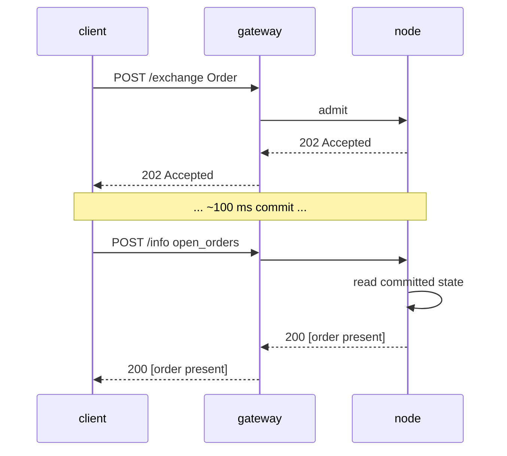

# `POST /info` — point de terminaison de lecture et de requête

:::info
**Statut.** Forme **stable**. Des types de requêtes sont ajoutés progressivement ; l'enveloppe est figée.
:::

## En bref {#tldr}

Un seul point de terminaison, multi-type. Le routage s'effectue sur le champ `type` du corps de la requête. Lecture seule — ne modifie jamais l'état, ne nécessite jamais de signature.

:::tip
**Séparation par produit.** Les requêtes de lecture sur les marchés perpétuels se trouvent sur [requêtes perpétuelles](./info/perpetuals.md) ; les requêtes de lecture sur le comptant, le comptant sur marge et Earn se trouvent sur [requêtes comptant & marge](./info/spot.md). Cette page couvre l'enveloppe, les conventions, et les lectures compte/gouvernance/coffre/validateur.
:::

## URL {#url}

```
POST  https://api.<net>.mtf.exchange/info
```

| Chemin | Format wire |
|------|-----------|
| `POST /info` (gateway) | MTF natif (ce document) |

Le gateway sert le `/info` natif MTF. Si vous exploitez le nœud vous-même, le même
`/info` natif est servi directement à l'adresse `http://localhost:8080`.

## Enveloppe {#envelope}

Requête :

```json
{ "type": "<query_type>", /* args spécifiques au type */ }
```

Réponse :

```json
{ "type": "<query_type>", "data": { /* spécifique au type */ } }
```

En cas de `type` inconnu : `400 Bad Request` avec `{"error":"unknown info type: <X>"}`.
En cas de ressource inconnue (par ex. identifiant de coffre inconnu) : `404 Not Found` avec `{"error":"<resource> not found"}`.

## Types de requêtes {#query-types}

### Identité statique du nœud et version du protocole {#node_info}

Identité statique du nœud et version du protocole. Aucun paramètre.

```json
{ "type": "node_info" }
```

Réponse :

```json
{
  "type": "node_info",
  "data": {
    "network":           "testnet",
    "chain_id":          114514,
    "protocol_version":  "1.0.0",
    "validator_index":   null,
    "build_commit":      "unknown",
    "version":           "0.0.1",
    "freeze_halt_supported": true,
    "uptime_seconds":    0
  }
}
```

| Champ | Type | Description |
|-------|------|-------------|
| `network` | `"devnet" \| "testnet" \| "mainnet"` | Variante réseau, déduite du `chain_id` (`31337`=devnet, `114514`=testnet, `8964`=mainnet) |
| `chain_id` | uint64 | Identifiant de chaîne EIP-712 — la MÊME valeur que doit utiliser le domaine de signature `/exchange` |
| `protocol_version` | chaîne semver | Version du protocole wire |
| `validator_index` | uint32 \| null | Indice de ce nœud dans l'ensemble de validateurs actifs ; **INDICATEUR :** `null` tant que le runtime n'a pas appelé `set_validator_index` |
| `build_commit` | chaîne hex | Identifiant de build publié par l'opérateur ; **INDICATEUR :** `"unknown"` jusqu'à publication |
| `version` | chaîne semver | Version de publication du logiciel nœud, intégrée à la compilation. Une release partage un même `version` entre ses binaires — `build_commit` est le discriminant par build |
| `freeze_halt_supported` | bool | Toujours `true` pour ce binaire — indicateur de capacité : le nœud respecte [`exchange_status.scheduled_freeze_height`](#exchange_status), s'arrêtant proprement avec le code de sortie `77` dès que la hauteur de gel est validée, afin qu'un superviseur de nœud puisse charger la release suivante |
| `uptime_seconds` | uint64 | Temps de fonctionnement du processus ; **INDICATEUR :** `0` tant que le runtime n'a pas appelé `set_uptime_seconds` |

Ces champs sont **par nœud** (identité du nœud / runtime), PAS de l'état de consensus, et peuvent donc légitimement différer d'un nœud à l'autre.

### Marge, positions et soldes par compte {#account_state}

Instantané par compte.

```json
{ "type": "account_state", "address": "0x<addr>" }
```

| Argument | Type | Requis |
|-----|------|----------|
| `address` | adresse hex | oui |

Une **adresse inconnue** (jamais vue on-chain) retourne **200** avec un enregistrement entièrement nul
(`account_value:"0"`, `positions` / `balances.spot` vides), et NON un `404`.

Réponse (un compte alimenté par le faucet, sans positions) :

```json
{
  "type": "account_state",
  "data": {
    "address":         "0x00000000000000000000000000000000000ca11e",
    "account_value":   "3000",
    "free_collateral": "3000",
    "maint_margin":    "0",
    "init_margin":     "0",
    "health":          "3000",
    "tier":            "Safe",
    "mode":            "Cross",
    "pm_enabled":      false,
    "positions": [],
    "balances": {
      "usdc": "3000",
      "spot": { "MTF": { "total": "10", "hold": "0" } }
    }
  }
}
```

Chaque token de `balances.spot` est un objet `{total, hold}` (parité HL) : `hold` est
le montant bloqué en garantie derrière un ordre spot en attente (séquestre), `total` est le solde
complet ; le montant disponible est `total − hold`. Un token entièrement bloqué
apparaît quand même. Pour une
lecture **légère** portant uniquement sur les scalaires de marge (sans parcours de `positions`, sans
analyse des soldes — l'appel approprié pour un sondage de santé de liquidation), utilisez
[`margin_summary`](#margin_summary).

Un compte avec des positions ajoute des entrées sous `positions` :

```json
{
  "asset":             0,
  "size":              "100000000",
  "entry":             "67000.00",
  "upnl":              "5.00",
  "isolated":          false,
  "lev":               10,
  "liq":               "61000.00",
  "roe":               "0.0075",
  "funding":           "-0.12",
  "margin":            "201.00",
  "notional":          "6705.00"
}
```

| Champ | Type | Description |
|-------|------|-------------|
| `account_value` | Chaîne décimale | Capitaux propres incl. PnL réalisé, **plan USDC entier** (`"3000"` = 3000 USDC, PAS en unités de base) |
| `free_collateral` | Chaîne décimale | Capitaux propres moins la marge initiale immobilisée par les positions ouvertes |
| `maint_margin` | Chaîne décimale | Σ marge de maintenance utilisée par actif |
| `init_margin` | Chaîne décimale | Exigence de marge initiale immobilisée |
| `health` | Chaîne décimale | `account_value − maint_margin` (signé ; peut être négatif) |
| `tier` | enum | `"Safe"`, `"T0"`, `"T1"`, `"T2"`, `"T3"` (bande BOLE de `account_value / maint_margin` ; `"Safe"` en l'absence de marge de maintenance) — voir [liquidation par paliers](../../concepts/tiered-liquidation.md) |
| `mode` | enum | `"Cross"`, `"Isolated"`, `"StrictIso"` (déduit des positions ouvertes du compte) |
| `pm_enabled` | bool | État d'activation de la marge de portefeuille |
| `positions[*].asset` | uint32 | Identifiant d'actif |
| `positions[*].size` | chaîne i128 | Taille de position signée en **lots bruts** — `size / 10^sz_decimals` = unités entières (`sz_decimals` est la précision de taille du marché, ex. 5 pour BTC). Il s'agit du plan SIZE, orthogonal au plan de prix 1e8. |
| `positions[*].entry` | Chaîne décimale | Prix d'entrée par unité entière = `\|entry_notional\| / \|taille réelle\|`, **plan USDC entier** |
| `positions[*].upnl` | Chaîne décimale | PnL mark-to-market = `taille réelle × mark − entry_notional signé`, **plan USDC entier** (signé) |
| `positions[*].isolated` | bool | `true` sauf si la position est en marge croisée |
| `positions[*].lev` | uint8 | Effet de levier maximum de la position |
| `positions[*].liq` | Chaîne décimale | Prix (USDC entier) auquel cette position seule amènerait le compte à la maintenance — approximation croisée mono-position ; `"0"` quand la taille / le levier est nul (aucun prix de liquidation fini) |
| `positions[*].roe` | Chaîne décimale | `upnl / marge_initiale` en fraction décimale (`marge_initiale = \|entry_notional\| / levier`) ; `"0"` à levier / notionnel nul |
| `positions[*].funding` | Chaîne décimale | Financement couru non réglé pour la jambe, **USDC entier** (signé) ; `taille_réelle × (cumulative_funding − funding_entry)` — la même formule que le règlement de financement applique |
| `positions[*].margin` | Chaîne décimale | Marge de maintenance que la jambe contribue, **USDC entier** : `\|entry_notional\| × taux_marge_maintenance` |
| `positions[*].notional` | Chaîne décimale | Notionnel de la position au mark, **USDC entier** (signé) : `taille_réelle × mark_px` |
| `positions[*].side` | enum \| absent | **[Mode couverture](../../concepts/hedge-mode.md) uniquement** — `"long"` / `"short"`, la jambe que cet objet décrit. **Absent sur un compte unidirectionnel** (une seule position *nette* dont `size` peut être négative). Un compte en couverture détenant les deux jambes sur un actif retourne **deux** objets, un par côté. |
| `balances.usdc` | Chaîne décimale | **Reflète `account_value`** (la garantie USDC croisée), PAS un solde USDC comptant distinct |
| `balances.spot` | objet | Soldes de tokens comptant non-USDC, indexés par **nom de token** (ex. `"MTF"`) ; chaque valeur est un objet `{total, hold}` (`hold` = séquestre bloqué derrière des ordres comptant en attente ; disponible = `total − hold`) ; vide si aucun |

### Résumé de compte léger, marge uniquement {#margin_summary}

Les **scalaires de marge uniquement** — `account_state` sans le parcours de `positions[]` ni
l'analyse des soldes comptant. L'appel approprié pour un sondage fréquent de santé de liquidation (un
bot de surveillance du risque, un rechargement automatique de marge) quand le détail des positions/soldes
n'est pas nécessaire. Requis : `address` (hex 0x).

```json
{ "type": "margin_summary", "address": "0x<addr>" }
```

Réponse (`data`) : `address`, `account_value`, `free_collateral`,
`maint_margin`, `init_margin`, `health`, `tier`, `mode`, `pm_enabled` —
sémantique de champ identique aux champs de même nom sur
[`account_state`](#account_state) (calculés par le même helper partagé, de sorte que les deux
ne divergent jamais).

### TVL, prix de part et stratégie par coffre {#vault_state}

Instantané par coffre.

```json
{ "type": "vault_state", "vault": "0x<vault_addr>" }
```

Réponse :

```json
{
  "type": "vault_state",
  "data": {
    "vault":              "0x<addr>",
    "name":               "MFlux Conservative",
    "tvl":             "10000000000",
    "share_price":     "10500000",
    "depositor_count":    142,
    "high_water_mark": "10500000",
    "performance_fee_bps":1000,
    "lock_period_ms":     86400000,
    "strategy":           "MarketNeutral"
  }
}
```

### État de staking et de délégation par compte {#staking_state}

```json
{ "type": "staking_state", "address": "0x<addr>" }
```

Réponse :

```json
{
  "type": "staking_state",
  "data": {
    "address":         "0x<addr>",
    "total_staked": "1000000000",
    "delegations": [
      {
        "validator":         "0x<val_addr>",
        "amount":         "500000000",
        "since_ts":          1735000000000,
        "pending_rewards":"1000000"
      }
    ],
    "pending_unstakes": [
      { "amount": "200000000", "matures_at_ts": 1735780000000 }
    ]
  }
}
```

### Frais maker et taker par palier de volume {#fee_schedule}

```json
{ "type": "fee_schedule" }
```

Réponse :

```json
{
  "type": "fee_schedule",
  "data": {
    "tiers": [
      { "volume_30d": "0",         "maker_bps": "2.0", "taker_bps": "5.0" },
      { "volume_30d": "100000000", "maker_bps": "1.5", "taker_bps": "4.5" },
      { "volume_30d": "1000000000","maker_bps": "1.0", "taker_bps": "4.0" }
    ],
    "builder_rebate_bps": "0.2",
    "burn_ratio":         "0.30",
    "referrer_share_bps": "1.0"
  }
}
```

Les taux de frais sont exprimés en **points de base** décimaux sous forme de chaînes avec une décimale (par ex. `"2.0"` = 2 pdb = 0,02 %, `"0.5"` = 0,5 pdb = 0,005 %), ce qui permet une précision fine, inférieure au point de base. `burn_ratio` est une fraction décimale (`"0.30"` = 30 % des frais brûlés). Voir [frais](../../concepts/fees.md).

### Ordres au repos d'un compte sur tous les carnets perpétuels {#open_orders}

Ordres au repos d'un compte, sur tous les carnets perpétuels.

```json
{ "type": "open_orders", "address": "0x<addr>" }
```

| Arg | Type | Requis |
|-----|------|----------|
| `address` | adresse hex | oui |

Le compte est identifié par `address` (hex 0x). `address` absente →
`400 {"error":"missing field address"}`.

Réponse :

```json
{
  "type": "open_orders",
  "data": {
    "address":    "0x<addr>",
    "orders": [
      {
        "oid":          12345,
        "market_id":    0,
        "side":         "bid",
        "px":        "99000",
        "size":      "700",
        "cloid":        "0x000000000000000000000000cafef00d",
        "inserted_at_ms": 1700000000000
      }
    ]
  }
}
```

| Champ | Type | Description |
|-------|------|-------------|
| `address` | adresse hex | Adresse de compte résolue |
| `orders[*].oid` | uint64 | Identifiant d'ordre serveur |
| `orders[*].market_id` | uint32 | Identifiant d'actif / marché sur lequel l'ordre est en attente |
| `orders[*].side` | `"bid"` / `"ask"` | Côté de l'ordre |
| `orders[*].px` | chaîne i128 | Prix en attente, chaîne décimale en virgule fixe |
| `orders[*].size` | chaîne u128 | Taille restante, chaîne décimale en virgule fixe |
| `orders[*].cloid` | chaîne hex \| null | Identifiant d'ordre client avec lequel l'ordre a été passé (`0x` + 32 caractères hex) ; `null` si l'ordre n'en avait pas |
| `orders[*].inserted_at_ms` | uint64 | Horodatage de placement / insertion (ms consensus) |

### Historique récent des exécutions d'un compte {#user_fills}

Historique des exécutions par compte, servi directement depuis l'état on-node validé (un
anneau d'exécutions borné par compte, intégré dans l'AppHash — pas d'indexeur externe).

```json
{ "type": "user_fills", "address": "0x<addr>" }
```

| Arg | Type | Requis | Description |
|-----|------|----------|-------------|
| `address` | adresse hex | oui | Adresse du compte |
| `limit` | uint32 | non | Limite le nombre d'enregistrements **les plus récents** retournés ; absent / `0` ⇒ l'anneau complet |

Le compte est identifié par `address` (hex 0x). `address` absente →
`400 {"error":"missing field address"}`.

Réponse :

```json
{
  "type": "user_fills",
  "data": {
    "address":    "0x<addr>",
    "fills": [
      {
        "coin":           "BTC",
        "side":           "B",
        "px":             "67042.50",
        "sz":             "0.125",
        "time":           1700000000555,
        "oid":            12345,
        "tid":            90123,
        "fee":            "4.19",
        "closed_pnl":     "0",
        "dir":            "Open Long",
        "start_position": "0",
        "block":          562,
        "hash":           "0x2315b79b9e82c2deb279a59448bf7841f3767d30d874e5b544d75bb9fd1e9b0c"
      }
    ]
  }
}
```

Les enregistrements sont triés du plus ancien au plus récent (le plus récent en dernier). L'anneau est borné, il s'agit donc d'une fenêtre récente et non de l'historique complet. Un compte sans exécution retourne
`"fills": []`.

| Champ | Type | Description |
|-------|------|-------------|
| `address` | adresse hex | Adresse de compte résolue |
| `fills[*].coin` | string | Symbole du marché sur lequel l'exécution a eu lieu |
| `fills[*].side` | `"B"` / `"A"` | Côté de cette jambe — `"B"` = achat/bid, `"A"` = vente/ask |
| `fills[*].px` | Chaîne décimale | Prix d'exécution, **USDC décimal** (lisible par l'humain) |
| `fills[*].sz` | Chaîne décimale | Taille exécutée, **unités de base** (unité entière) |
| `fills[*].time` | uint64 | Horodatage de l'exécution (ms consensus) |
| `fills[*].oid` | uint64 | Identifiant d'ordre de cette partie |
| `fills[*].tid` | uint64 | Identifiant de trade déterministe (partagé par les deux jambes de la transaction) |
| `fills[*].fee` | Chaîne décimale | Frais payés par cette partie, **USDC décimal** |
| `fills[*].closed_pnl` | Chaîne décimale | PnL réalisé sur la portion clôturée, **USDC décimal** (signé) |
| `fills[*].dir` | chaîne | Libellé de direction, ex. `"Open Long"`, `"Close Short"`, `"Open Short"`, `"Close Long"` |
| `fills[*].start_position` | Chaîne décimale | Taille de jambe signée AVANT l'exécution, **unités de base** (unité entière, signée) |
| `fills[*].block` | uint64 | Hauteur de bloc validée dans laquelle l'exécution a été réglée (localisateur on-chain) |
| `fills[*].hash` | chaîne hex | Hash de transaction de l'ordre d'origine, hex préfixé `0x` — permet de tracer l'exécution on-chain |

### Historique d'exécutions filtré par fenêtre temporelle {#user_fills_by_time}

Identique à [`user_fills`](#user_fills), mais filtré sur une fenêtre temporelle appliquée au champ consensus `time` de chaque enregistrement. La structure des enregistrements de transaction est identique.

```json
{ "type": "user_fills_by_time", "address": "0x<addr>", "start_time": 1700000000000, "end_time": 1700003600000 }
```

| Arg | Type | Requis | Description |
|-----|------|----------|-------------|
| `address` | adresse hex | oui | Adresse du compte |
| `start_time` | uint64 | non | Début de la fenêtre (ms, inclusif) ; filtre sur le champ `time` de la transaction. Absent ⇒ borne inférieure ouverte |
| `end_time` | uint64 | non | Fin de la fenêtre (ms, inclusif). Absent ⇒ borne supérieure ouverte |

Réponse :

```json
{
  "type": "user_fills_by_time",
  "data": {
    "address":    "0x<addr>",
    "start_time": 1700000000000,
    "end_time":   1700003600000,
    "fills": [ /* same record shape as user_fills */ ]
  }
}
```

| Champ | Type | Description |
|-------|------|-------------|
| `address` | adresse hex | Adresse du compte résolue |
| `start_time` | uint64 \| null | Début de fenêtre renvoyé en écho (`null` si omis) |
| `end_time` | uint64 \| null | Fin de fenêtre renvoyée en écho (`null` si omis) |
| `fills` | array | Enregistrements de transactions dans la fenêtre (même structure par transaction que [`user_fills`](#user_fills)), triés du plus ancien au plus récent |

### Recherche du cycle de vie d'un ordre {#order_status}

Recherche du cycle de vie d'un ordre unique par `oid` (identifiant serveur) **ou** `cloid` (identifiant client). Consulte les carnets d'ordres actifs, le registre des ordres déclencheurs et l'anneau de transactions validées — tout cela en état engagé sur le nœud.

```json
{ "type": "order_status", "oid": 12345 }
```

Ou par identifiant client :

```json
{ "type": "order_status", "cloid": "0x000000000000000000000000cafef00d" }
```

| Arg | Type | Requis | Description |
|-----|------|----------|-------------|
| `oid` | uint64 | l'un de `oid` / `cloid` | Identifiant serveur de l'ordre |
| `cloid` | hex string | l'un de `oid` / `cloid` | Identifiant client — `0x` + 32 caractères hexadécimaux |

Aucun des deux présent → `400 {"error":"missing field oid or cloid"}`. Un `cloid` malformé → `400`. La résolution s'arrête au premier résultat trouvé, dans cet ordre : ordre actif en attente → déclencheur en file → transaction terminale → inconnu.

Le champ `data.status` distingue les branches :

`"resting"` — un ordre actif ouvert dans un carnet perpétuel ou au comptant :

```json
{
  "type": "order_status",
  "data": {
    "status": "resting",
    "order": {
      "oid":            12345,
      "market_id":      0,
      "side":           "bid",
      "px":             "67000",
      "size":           "700",
      "inserted_at_ms": 1700000000000,
      "cloid":          "0x000000000000000000000000cafef00d"
    }
  }
}
```

`"triggered"` — un ordre TP/SL/stop en file d'attente d'un franchissement du prix mark :

```json
{
  "type": "order_status",
  "data": {
    "status": "triggered",
    "trigger": {
      "oid":              12345,
      "market_id":        0,
      "side":             "ask",
      "trigger_px":       "66000",
      "trigger_above":    false,
      "size":             "700",
      "registered_at_ms": 1700000000000,
      "fired":            false
    }
  }
}
```

`"filled"` — la transaction la plus récente correspondante dans l'anneau par compte (l'objet `fill` a la même structure qu'un enregistrement [`user_fills`](#user_fills)) :

```json
{
  "type": "order_status",
  "data": {
    "status": "filled",
    "fill": { /* same shape as a user_fills fill record */ }
  }
}
```

`"unknown"` — jamais rencontré, ou évincé de l'anneau borné (une requête par `cloid` uniquement sans correspondance dans les ordres actifs ou déclencheurs aboutit ici également, car le registre des déclencheurs et l'anneau de transactions sont indexés par `oid`) :

```json
{ "type": "order_status", "data": { "status": "unknown" } }
```

| Field | Type | Description |
|-------|------|-------------|
| `status` | `"resting" \| "triggered" \| "filled" \| "unknown"` | État du cycle de vie résolu |
| `order` | object | Présent pour `"resting"` — `oid`, `market_id`, `side` (`"bid"`/`"ask"`), `px` / `size` (chaînes décimales à virgule fixe), `inserted_at_ms`, `cloid` (hex \| null) |
| `trigger` | object | Présent pour `"triggered"` — `oid`, `market_id`, `side`, `trigger_px` / `size` (chaînes décimales à virgule fixe), `trigger_above` (bool : déclencher quand le prix mark passe au-dessus), `registered_at_ms`, `fired` (bool) |
| `fill` | object | Présent pour `"filled"` — l'enregistrement de transaction correspondant (voir [`user_fills`](#user_fills)) |

### Métadonnées du dernier bloc validé {#block_info}

Métadonnées du bloc validé. Aucun argument requis (`height` est accepté mais ignoré — l'état lu conserve uniquement le dernier contexte engagé).

```json
{ "type": "block_info" }
```

Réponse :

```json
{
  "type": "block_info",
  "data": {
    "height":       562,
    "round":        562,
    "epoch":        0,
    "timestamp_ms": 1780475491562,
    "block_hash":   "0x2315b79b9e82c2deb279a59448bf7841f3767d30d874e5b544d75bb9fd1e9b0c"
  }
}
```

| Field | Type | Description |
|-------|------|-------------|
| `height` | uint64 | Hauteur du dernier bloc validé |
| `round` | uint64 | Tour de consensus de ce bloc |
| `epoch` | uint64 | Époque en cours |
| `timestamp_ms` | uint64 | Horodatage du bloc (ms consensus) |
| `block_hash` | hex string (32 bytes) | Hachage réel du bloc validé (désormais intégré à l'état lu — ce n'est plus le placeholder tout à zéro) |

### Portefeuilles agents approuvés pour un compte {#agents}

Agents approuvés / portefeuilles API pour un compte.

```json
{ "type": "agents", "address": "0x<addr>" }
```

| Arg | Type | Requis |
|-----|------|----------|
| `address` | adresse hex | oui |

`address` absente → `400 {"error":"missing field address"}`.

Réponse :

```json
{
  "type": "agents",
  "data": {
    "address":    "0x<master>",
    "agents": [
      { "agent": "0x<agent_addr>", "name": "trading-bot", "expires_at_ms": 1700000500000 }
    ]
  }
}
```

| Champ | Type | Description |
|-------|------|-------------|
| `address` | adresse hex | Adresse principale résolue |
| `agents[*].agent` | adresse hex | Adresse du portefeuille agent approuvé |
| `agents[*].name` | string \| null | Libellé de l'agent défini lors de l'approbation ; `null` si non défini |
| `agents[*].expires_at_ms` | uint64 \| null | Expiration de l'approbation de l'agent (ms consensus) ; `null` pour une approbation sans expiration |

### Liste des sous-comptes d'un compte {#sub_accounts}

Sous-comptes d'un compte.

```json
{ "type": "sub_accounts", "address": "0x<addr>" }
```

| Arg | Type | Requis |
|-----|------|----------|
| `address` | adresse hex | oui |

`address` absente → `400 {"error":"missing field address"}`.

Réponse :

```json
{
  "type": "sub_accounts",
  "data": {
    "address":    "0x<parent>",
    "sub_accounts": [
      { "index": 0, "address": "0x<sub_addr>" }
    ]
  }
}
```

| Champ | Type | Description |
|-------|------|-------------|
| `address` | adresse hex | Adresse parente résolue |
| `sub_accounts[*].index` | uint32 | Index du sous-compte rattaché au parent |
| `sub_accounts[*].address` | adresse hex | Adresse du sous-compte |

### Compteurs et accumulateurs à l'échelle du protocole {#protocol_metrics}

Accumulateurs et compteurs validés à l'échelle du protocole. Aucun paramètre. Chaque champ est lu directement depuis l'état `Exchange` engagé (compteurs, pools de frais, réserves BOLE, staking) — rien n'est calculé à partir du moteur de correspondance ni de l'oracle, ce qui garantit une reproduction exacte lors d'un rejeu.

```json
{ "type": "protocol_metrics" }
```

Réponse :

```json
{
  "type": "protocol_metrics",
  "data": {
    "counters": {
      "total_orders":               1000,
      "total_fills":                750,
      "total_liquidations":         3,
      "total_deposits":             40,
      "total_withdrawals":          12,
      "total_vault_transfers":      0,
      "total_sub_account_transfers":0
    },
    "fee_pools": {
      "burned":         "8000",
      "mflux_vault":    "0",
      "validator_pool": "1000",
      "treasury":       "1000",
      "burned_mtf":     "55"
    },
    "insurance_fund_total":    "750",
    "treasury_backstop_total": "9000",
    "bole_pool": {
      "total_deposits":  "20000",
      "shortfall_total": "7"
    },
    "open_interest_total_1e8": "1500000",
    "staking": {
      "total_stake":   "100",
      "n_validators":  1,
      "n_active":      1,
      "n_jailed":      0,
      "current_epoch": 4
    },
    "counts": {
      "n_markets":             1,
      "n_spot_pairs":          5,
      "n_user_vaults":         0,
      "n_accounts_with_state": 12
    }
  }
}
```

| Field | Type | Description |
|-------|------|-------------|
| `counters.total_orders` | uint64 | Nombre cumulé d'ordres admis depuis la genèse |
| `counters.total_fills` | uint64 | Nombre cumulé de transactions (seul signal de transaction détaillé — un **comptage**, pas un notionnel) |
| `counters.total_liquidations` | uint64 | Nombre cumulé de liquidations |
| `counters.total_deposits` / `total_withdrawals` | uint64 | Nombre cumulé de dépôts / retraits |
| `counters.total_vault_transfers` | uint64 | Nombre cumulé de transferts de dépôt/retrait sur coffre |
| `counters.total_sub_account_transfers` | uint64 | Nombre cumulé de transferts entre sous-comptes |
| `fee_pools.burned` | Decimal string | USDC cumulé acheminé vers le rachat et la destruction (en USDC entiers) |
| `fee_pools.mflux_vault` | Decimal string | Accumulation cumulée des frais sur le coffre MFlux (`"0"` — part du coffre annulée) |
| `fee_pools.validator_pool` | Decimal string | Accumulation cumulée des frais dans le pool validateur (en USDC entiers) |
| `fee_pools.treasury` | Decimal string | Accumulation cumulée des frais dans la trésorerie (en USDC entiers) |
| `fee_pools.burned_mtf` | Decimal string | MTF cumulé retiré de la circulation par l'exécuteur de rachat |
| `insurance_fund_total` | Decimal string | Σ réserves `bole_pool.insurance_fund` par actif (en USDC entiers) |
| `treasury_backstop_total` | Decimal string | Σ réserves `bole_pool.treasury_backstop` par actif (en USDC entiers) |
| `bole_pool.total_deposits` | Decimal string | Total des dépôts dans le pool de prêt BOLE (en USDC entiers) |
| `bole_pool.shortfall_total` | Decimal string | Σ créances irrécouvrables résiduelles après la cascade ADL → assurance → trésorerie |
| `open_interest_total_1e8` | u128 string | Σ des intérêts ouverts par marché, **plan de carnet 1e8** (étiqueté `_1e8`, PAS en USDC entiers) |
| `staking.total_stake` | Decimal string | Total des MTF mis en staking (en MTF entiers) |
| `staking.n_validators` | uint64 | Validateurs dans l'ensemble engagé |
| `staking.n_active` | uint64 | Validateurs actifs cette époque |
| `staking.n_jailed` | uint64 | Validateurs actuellement emprisonnés |
| `staking.current_epoch` | uint64 | Époque de staking en cours |
| `counts.n_markets` | uint64 | Marchés perpétuels MIP-3 enregistrés (`mip3_market_specs`) |
| `counts.n_spot_pairs` | uint64 | Paires au comptant enregistrées (`mip3_spot_pair_specs`) |
| `counts.n_user_vaults` | uint64 | Coffres utilisateur enregistrés |
| `counts.n_accounts_with_state` | uint64 | Comptes disposant d'un état utilisateur engagé |

:::info
**Aucun notionnel cumulé échangé.** Le moteur suit le **volume de frais sur 30 jours** par utilisateur (voir [`user_fees`](#user_fees)) et un **comptage** cumulé de transactions (`counters.total_fills`) — il n'existe **pas d'accumulateur engagé de volume USD échangé à l'échelle du protocole**, aussi cette lecture l'omet intentionnellement plutôt que de laisser supposer qu'un tel total de volume existerait. Les compteurs sont des relevés d'activité monotones, pas des montants en devises.
:::

Source d'état : `locus.{counters, fee_tracker.fee_distribution, bole_pool}` + `c_staking` + tailles des registres.

### Palier de frais et volume par compte {#user_fees}

Palier de frais / volume par compte. Requis : `account_id` (u64) **OU** `address` (hex 0x).

```json
{ "type": "user_fees", "account_id": 42 }
```

| Arg | Type | Requis |
|-----|------|----------|
| `account_id` | uint64 | l'un de `account_id` / `address` |
| `address` | hex address | l'un de `account_id` / `address` |

Aucun des deux présent → `400`. Un compte sans état de frais retourne un **200** avec des volumes à zéro et les bps du palier de base — l'idiome habituel de zeroing.

Réponse :

```json
{
  "type": "user_fees",
  "data": {
    "address":          "0x<addr>",
    "account_id":       42,
    "taker_volume_30d": "1250000",
    "maker_volume_30d": "800000",
    "vip_tier":         2,
    "mm_tier":          1,
    "referrer":         "0x<referrer>",
    "referrer_credit":  "420",
    "maker_bps":        1,
    "taker_bps":        3
  }
}
```

| Field | Type | Description |
|-------|------|-------------|
| `address` | hex address | Adresse du compte résolue |
| `account_id` | uint64 | Renvoyé en écho uniquement si la requête utilisait `account_id` |
| `taker_volume_30d` | Decimal string | Volume preneur glissant sur 30 jours (en USDC entiers) |
| `maker_volume_30d` | Decimal string | Volume faiseur glissant sur 30 jours (en USDC entiers) |
| `vip_tier` | uint | Indice de palier VIP par utilisateur engagé ; `0` si non suivi |
| `mm_tier` | uint | Indice de palier market maker par utilisateur engagé ; `0` si non suivi |
| `referrer` | hex address \| null | Référent de ce compte s'il est défini, sinon `null` |
| `referrer_credit` | Decimal string | Σ des remises accumulées *par* cette adresse en qualité de référent (en USDC entiers) |
| `maker_bps` | uint | Bps de frais faiseur **effectifs**, résolus à partir du barème de volume engagé [`fee_schedule`](#fee_schedule) au volume maker sur 30 jours de ce compte |
| `taker_bps` | uint | Bps de frais preneur **effectifs**, résolus à partir du barème engagé au volume preneur sur 30 jours de ce compte |

Les `maker_bps` / `taker_bps` effectifs sont résolus par côté à partir du barème de paliers de volume engagé ([`fee_schedule`](#fee_schedule)) — le taux faiseur au volume maker du compte, le taux preneur à son volume preneur — en utilisant la même routine que celle appliquée lors du règlement, de sorte que les bps rapportés correspondent à ce qui est facturé au compte. Un éventuel écrasement MIP-3 par marché **n'est pas** reflété ici : il s'agit du taux de base inter-marchés. `vip_tier` / `mm_tier` restent les indices de palier par utilisateur engagés et constituent un signal distinct, affiché conjointement aux bps effectifs.

Source d'état : `locus.fee_tracker.{user_to_taker_volume_30d, user_to_maker_volume_30d, user_to_vip_tier, user_to_mm_tier, referee_to_referrer, referrer_credit}` + le barème de paliers de volume engagé.

### Taux d'émission de staking effectif et ses paramètres {#staking_apr}

Taux d'émission de staking annuel effectif et ses paramètres engagés. Aucun paramètre.

```json
{ "type": "staking_apr" }
```

Réponse :

```json
{
  "type": "staking_apr",
  "data": {
    "total_stake":             "1000000",
    "effective_apr":           "0.08",
    "effective_apr_bps":       "800",
    "governance_rate_bps":     800,
    "emission_floor_stake":    "50000000",
    "n_active_validators":     1,
    "current_epoch":           2,
    "is_gross_pre_commission": true
  }
}
```

| Field | Type | Description |
|-------|------|-------------|
| `total_stake` | Decimal string | Total de MTF mis en staking (MTF entiers) |
| `effective_apr` | Decimal string | Taux d'émission annuel effectivement appliqué par la récompense begin-block (fraction) |
| `effective_apr_bps` | Decimal string | `effective_apr × 10_000`, tronqué |
| `governance_rate_bps` | uint | `reward_rate_bps` fixé par la gouvernance (engagé) — voir le flag |
| `emission_floor_stake` | uint string | Seuil plancher de stake (`50M` MTF) en dessous duquel le taux est fixe |
| `n_active_validators` | uint64 | Validateurs actifs durant cet epoch |
| `current_epoch` | uint64 | Epoch de staking en cours |
| `is_gross_pre_commission` | bool | Toujours `true` — le TAP est brut, avant commission par validateur |

`effective_apr` est la courbe dont dérive la récompense begin-block :

```text
effective_apr = 0.08 × √( 50M / max(total_stake, 50M) )
```

soit un **taux fixe de 8%** pour un stake inférieur ou égal à 50M MTF, décroissant selon 1/√stake au-delà (ex. :
total stake = 200M ⇒ 4× le plancher ⇒ ratio 1/4 ⇒ √ = 1/2 ⇒ 4% / 400 bps).

:::warning
**`governance_rate_bps` est engagé mais N'EST PAS consommé par la récompense.** La
récompense dérive le taux de distribution à partir de la **courbe de stake** ci-dessus, et non de
`reward_rate_bps`. Les deux sont exposés afin que l'écart soit observable plutôt que
dissimulé — le TAP de distribution effectif est `effective_apr`, et non `governance_rate_bps`.
De plus, `effective_apr` est un taux d'**émission brut** (`is_gross_pre_commission: true`) :
le TAP net d'un délégateur individuel est `effective_apr × (1 − commission)`.
:::

Source d'état : `c_staking.{total_stake, reward_rate_bps, current_epoch, validators}` + la courbe d'émission.

### Sous-ensemble de sources oracle par marché {#oracle_sources}

Le sous-ensemble de sources oracle engagé par marché. Résout le marché par `coin` (symbole).

```json
{ "type": "oracle_sources", "coin": "BTC" }
```

| Arg | Type | Requis |
|-----|------|----------|
| `coin` | symbole | oui |

`coin` absent → `400 {"error":"missing field coin"}` ; marché inconnu →
`404 {"error":"market not found"}`.

Réponse :

```json
{
  "type": "oracle_sources",
  "data": {
    "coin":              "BTC",
    "oracle_set":        true,
    "source_count":      10,
    "num_sources":       10,
    "enabled_sources":   [0, 1, 2, 3, 4, 5, 6, 7, 8, 9],
    "subset_mask":       1023,
    "weights_committed": false
  }
}
```

| Champ | Type | Description |
|-------|------|-------------|
| `coin` | string | Symbole du marché renvoyé / résolu en écho |
| `oracle_set` | bool | Indique si le déployeur a explicitement confirmé le sous-ensemble via `SetOracle` |
| `source_count` | uint64 | Nombre de sources activées (nombre de bits à 1 dans le masque) |
| `num_sources` | uint8 | Total des emplacements sources (`NUM_ORACLE_SOURCES = 10`) |
| `enabled_sources` | uint8[] | Indices des bits activés dans le masque de sous-ensemble (emplacements sources activés) |
| `subset_mask` | uint16 | `oracle_source_subset_mask` à 10 bits engagé (bit `i` activé ⇒ la source `i` alimente la médiane) |
| `weights_committed` | bool | Toujours `false` — les pondérations par source ne sont PAS engagées (voir le flag) |

:::warning
**Seul le masque binaire numérique est on-chain — les NOMS et POIDS des sources ne sont PAS
engagés** (`weights_committed: false`). Les 10 identités de sources sont fixées hors-chaîne par le
protocole, et leurs pondérations sont également fixées par le protocole ; l'état engagé ne
comporte donc que le masque de sous-ensemble. Cette lecture expose `enabled_sources` sous forme
d'**indices de bits**, non de noms de sources, et n'émet aucune liste de pondérations par source
plutôt que d'en fabriquer une.
:::

Source d'état : `mip3_market_specs[asset].{oracle_source_subset_mask, oracle_set}`.

## Types de requêtes de gouvernance {#governance-query-types}

La surface de gouvernance on-chain : la mécanique de vote en temps réel (`gov_state`),
la vue des propositions en attente toutes catégories confondues avec la distance au quorum (`gov_proposals`), et
l'historique d'audit des paramètres adoptés (`gov_history`). Toutes lisent l'état
`Exchange` engagé ; même enveloppe `{type, data}`. Le quorum de stake est de ⅔
(pondéré par stake) ; les validateurs **mis en prison** sont exclus du dénominateur de
stake actif et de chaque décompte, conformément à la vérification d'adoption on-chain.

### État de gouvernance en temps réel et paramètres actuels {#gov_state}

La surface de gouvernance en temps réel — contexte de quorum de stake, rounds de vote de
changement de paramètre en attente, propositions ouvertes, et la valeur ACTUELLE de chaque
paramètre gouverné. Aucun paramètre.

```json
{ "type": "gov_state" }
```

Réponse :

```json
{
  "type": "gov_state",
  "data": {
    "total_stake":  "150000",
    "quorum_bps":   6667,
    "quorum_stake": "100005",
    "pending_vote_global": [
      {
        "kind":          "set_reward_rate_bps",
        "kind_id":       3,
        "votes": [
          { "validator": "0x<val>", "value": "900", "stake": "60000", "submitted_at_ms": 1700000000000 }
        ],
        "leading_stake": "60000"
      }
    ],
    "open_proposals": [
      { "proposal_id": 5, "voters": 2, "aye_stake": "90000", "nay_stake": "30000" }
    ],
    "params": {
      "reward_rate_bps":   800,
      "default_taker_bps": 5,
      "default_maker_bps": 2,
      "burn_bps":          8000
    },
    "oracle_weight_overrides": [
      { "asset_id": 0, "weights": [1000, 1000, 1000] }
    ]
  }
}
```

| Field | Type | Description |
|-------|------|-------------|
| `total_stake` | decimal string | Σ stake de l'ensemble des validateurs |
| `quorum_bps` | uint | Seuil de quorum ⅔ en bps (`6667`) |
| `quorum_stake` | decimal string | Stake requis pour l'adoption (`total_stake × quorum_bps / 10000`) |
| `pending_vote_global[*].kind` | string | Nom du paramètre gouverné (snake_case), ex. `"set_reward_rate_bps"` |
| `pending_vote_global[*].kind_id` | uint | Identifiant numérique du type |
| `pending_vote_global[*].votes[*].validator` | hex address | Validateur votant |
| `pending_vote_global[*].votes[*].value` | decimal string | Valeur proposée décodée (hex `0x…` si la charge utile est opaque) |
| `pending_vote_global[*].votes[*].stake` | decimal string | Stake du votant |
| `pending_vote_global[*].votes[*].submitted_at_ms` | uint64 | Horodatage de soumission du vote (ms consensus) |
| `pending_vote_global[*].leading_stake` | decimal string | Stake le plus élevé regroupé derrière une seule charge utile dans ce round |
| `open_proposals[*].proposal_id` | uint64 | Identifiant du round de proposition |
| `open_proposals[*].voters` | uint64 | Nombre de votes exprimés |
| `open_proposals[*].aye_stake` / `nay_stake` | decimal string | Stake votant pour / contre |
| `params` | object | Valeur actuelle de chaque paramètre gouverné (chacun un scalaire engagé) |
| `oracle_weight_overrides[*].asset_id` | uint32 | Actif disposant d'une dérogation de pondération oracle par actif |
| `oracle_weight_overrides[*].weights` | uint[] | Pondérations par source engagées pour l'actif |

L'objet `params` porte l'ensemble complet des paramètres gouvernés que la mécanique de vote
peut modifier (répartition de la distribution des frais, paramètres de staking, limites MIP-3, plafonds de risque,
flags spot / EVM / bridge, …) ; chacun est la valeur engagée en vigueur.

### Propositions de gouvernance actives et statut de quorum {#gov_proposals}

Toutes les propositions de gouvernance ACTIVES dans TOUTES les catégories de vote (pas
seulement les votes de paramètre directs), chacune avec son décompte de stake par charge utile
en temps réel et sa distance au quorum ⅔. Vue transversale « ce sur quoi on vote actuellement,
et à quelle distance du quorum ». Aucun paramètre.

```json
{ "type": "gov_proposals" }
```

Réponse :

```json
{
  "type": "gov_proposals",
  "data": {
    "total_active_stake":  "120000",
    "quorum_bps":          6667,
    "quorum_needed_stake": "80004",
    "proposals": [
      {
        "round":         1000003,
        "category":      "vote_global",
        "sub_id":        3,
        "proposer":      "0x<val>",
        "created_at_ms": 1700000000000,
        "voter_count":   1,
        "leading_stake": "60000",
        "meets_quorum":  false,
        "payloads": [
          { "payload_hex": "0392…", "stake": "60000", "meets_quorum": false }
        ],
        "proposal": {
          "kind":         3,
          "kind_name":    "set_reward_rate_bps",
          "value":        "900",
          "title":        "Raise staking rewards",
          "proposer":     "0x<val>",
          "opened_at_ms": 1700000000000
        }
      }
    ]
  }
}
```

| Field | Type | Description |
|-------|------|-------------|
| `total_active_stake` | decimal string | Σ stake des validateurs non mis en prison (le dénominateur du quorum) |
| `quorum_bps` | uint | Seuil de quorum ⅔ en bps (`6667`) |
| `quorum_needed_stake` | decimal string | Stake qu'une seule charge utile doit atteindre pour être adoptée |
| `proposals[*].round` | uint64 | Identifiant synthétique du round de vote |
| `proposals[*].category` | string | Catégorie de vote, ex. `"gov_propose"`, `"vote_global"`, `"dynamic_risk"`, `"treasury"`, `"metaliquidity"`, `"oracle_weights"`, `"funding_formula"`, `"spot_margin"` |
| `proposals[*].sub_id` | uint64 | Identifiant relatif à la catégorie (le round moins la base de plage de la catégorie) |
| `proposals[*].proposer` | hex address \| null | Premier votant (mandataire proposant) |
| `proposals[*].created_at_ms` | uint64 | Horodatage du premier vote (ms consensus) |
| `proposals[*].voter_count` | uint64 | Nombre de votes exprimés sur le round |
| `proposals[*].leading_stake` | decimal string | Stake le plus élevé regroupé derrière une seule charge utile |
| `proposals[*].meets_quorum` | bool | Indique si le stake de la charge utile dominante atteint le quorum ⅔ |
| `proposals[*].payloads[*].payload_hex` | hex string | Une charge utile votée distincte (sans préfixe `0x`) |
| `proposals[*].payloads[*].stake` | decimal string | Stake actif regroupé derrière cette charge utile |
| `proposals[*].payloads[*].meets_quorum` | bool | Indique si cette charge utile seule atteint le quorum |
| `proposals[*].proposal` | object \| null | L'enregistrement de proposition typé lorsque le round a été ouvert via une proposition, sinon `null` |
| `proposals[*].proposal.kind` | uint | Identifiant numérique du type de paramètre gouverné |
| `proposals[*].proposal.kind_name` | string \| null | Nom de type décodé (snake_case), `null` si inconnu |
| `proposals[*].proposal.value` | decimal string | Valeur proposée |
| `proposals[*].proposal.title` | string | Titre de la proposition lisible par un humain |
| `proposals[*].proposal.proposer` | hex address | Compte ayant ouvert la proposition |
| `proposals[*].proposal.opened_at_ms` | uint64 | Horodatage d'ouverture de la proposition (ms consensus) |

### Historique des changements de paramètres de gouvernance adoptés {#gov_history}

L'historique d'audit de la gouvernance adoptée (anneau borné, du plus ancien au plus récent) — chaque entrée
atteste qu'un paramètre a ÉVOLUÉ par voie de gouvernance on-chain par rapport à sa valeur de genèse. Aucun
paramètre. Complète `gov_proposals` (le volet PENDING).

```json
{ "type": "gov_history" }
```

Réponse :

```json
{
  "type": "gov_history",
  "data": {
    "count": 1,
    "enacted": [
      {
        "round":         1000003,
        "kind":          3,
        "kind_name":     "set_reward_rate_bps",
        "value":         "900",
        "via":           "vote_global",
        "enacted_at_ms": 1700000900000,
        "description":   "reward_rate_bps -> 900"
      }
    ]
  }
}
```

| Field | Type | Description |
|-------|------|-------------|
| `count` | uint | Nombre d'entrées dans l'anneau |
| `enacted[*].round` | uint64 | Round de vote synthétique ayant procédé à l'adoption |
| `enacted[*].kind` | uint | Identifiant numérique du type de paramètre gouverné |
| `enacted[*].kind_name` | string \| null | Nom de type décodé (snake_case), `null` si inconnu |
| `enacted[*].value` | decimal string | Valeur adoptée |
| `enacted[*].via` | `"proposal" \| "vote_global" \| "other"` | Piste source — suivi via proposition vs vote de paramètre direct |
| `enacted[*].enacted_at_ms` | uint64 | Horodatage d'adoption (ms consensus) |
| `enacted[*].description` | string | Résumé lisible par un humain de la modification |

L'anneau est plafonné par la borne du journal d'adoption on-chain ; il s'agit donc d'une fenêtre récente, et non de l'intégralité de l'historique.

## Types de requêtes avancées (RFQ / FBA / marge de portefeuille) {#advanced-query-types-rfq--fba--portfolio-margin}

Ces requêtes lisent l'état en temps réel des moteurs RFQ, FBA et de marge de portefeuille — elles complètent
les flags `market_info.fba_enabled` / `account_state.pm_enabled` avec l'état du moteur
lui-même. Même enveloppe `{type, data}` et conventions natives MTF. **Plan des prix :**
les prix / tailles RFQ + FBA sont des chaînes entières en **virgule fixe 1e8** brutes (le
plan carnet / ordres, identique à [`open_orders`](#open_orders) / [`l2_book`](./info/perpetuals.md#l2_book)),
**et non** des USDC entiers ; les montants de marge de portefeuille sont des chaînes entières en **cents USD**.

### Demandes RFQ ouvertes et cotations maker {#rfq_open}

Toutes les demandes RFQ ouvertes et leurs cotations maker. Aucun paramètre. Voir le [concept RFQ](../../concepts/rfq.md).

```json
{ "type": "rfq_open" }
```

Réponse :

```json
{
  "type": "rfq_open",
  "data": {
    "rfqs": [
      {
        "rfq_id":              1,
        "market_id":           7,
        "side":                "bid",
        "size":                "1000",
        "requester":           "0x<addr>",
        "requester_stp_group": 42,
        "expiry_ms":           5000,
        "limit_px":            "105",
        "created_at_ms":       10,
        "quotes": [
          {
            "maker":           "0x<addr>",
            "maker_stp_group": null,
            "price":           "104",
            "max_size":        "800",
            "valid_until_ms":  4000,
            "submitted_at_ms": 20
          }
        ]
      }
    ]
  }
}
```

`rfqs` itère de manière déterministe par `rfq_id`. Un moteur vide retourne `"rfqs": []`.

| Field | Type | Description |
|-------|------|-------------|
| `rfqs[*].rfq_id` | uint64 | Identifiant de la demande RFQ |
| `rfqs[*].market_id` | uint32 | Identifiant d'actif / marché concerné par le RFQ |
| `rfqs[*].side` | `"bid"` / `"ask"` | Côté que le demandeur souhaite prendre |
| `rfqs[*].size` | u128 string | Taille demandée, virgule fixe 1e8 |
| `rfqs[*].requester` | hex address | Compte demandeur |
| `rfqs[*].requester_stp_group` | uint \| null | Groupe de prévention des auto-transactions du demandeur ; `null` si non défini |
| `rfqs[*].expiry_ms` | uint64 | Horodatage d'expiration du RFQ (ms consensus) |
| `rfqs[*].limit_px` | i128 string \| null | Prix limite du demandeur, virgule fixe 1e8 ; `null` si non défini |
| `rfqs[*].created_at_ms` | uint64 | Horodatage de création (ms consensus) |
| `rfqs[*].quotes[*].maker` | hex address | Maker cotant |
| `rfqs[*].quotes[*].maker_stp_group` | uint \| null | Groupe STP du maker ; `null` si non défini |
| `rfqs[*].quotes[*].price` | i128 string | Prix de la cotation, virgule fixe 1e8 |
| `rfqs[*].quotes[*].max_size` | u128 string | Taille maximale que le maker est prêt à exécuter, virgule fixe 1e8 |
| `rfqs[*].quotes[*].valid_until_ms` | uint64 | Échéance de validité de la cotation (ms consensus) |
| `rfqs[*].quotes[*].submitted_at_ms` | uint64 | Horodatage de soumission de la cotation (ms consensus) |

### RFQ demandées ou cotées par un compte {#rfq_user}

RFQ auxquelles un compte est partie prenante — réparties entre celles qu'il a initiées et celles sur lesquelles il a soumis une cotation. Voir le [concept RFQ](../../concepts/rfq.md).

```json
{ "type": "rfq_user", "address": "0x<addr>" }
```

| Arg | Type | Requis |
|-----|------|----------|
| `address` | adresse hex | oui |

Le compte est identifié par `address` (hex 0x). `address` absente →
`400 {"error":"missing field address"}` ; `address` malformée →
`400 {"error":"invalid hex"}`.

Réponse :

```json
{
  "type": "rfq_user",
  "data": {
    "address":    "0x<addr>",
    "requested": [ /* <rfq>, same per-RFQ shape as rfq_open */ ],
    "quoted":    [ /* <rfq> */ ]
  }
}
```

| Champ | Type | Description |
|-------|------|-------------|
| `address` | adresse hex | Adresse de compte résolue |
| `requested` | array&lt;rfq&gt; | RFQ initiées par ce compte (demandeur) ; même structure par RFQ que [`rfq_open`](#rfq_open) |
| `quoted` | array&lt;rfq&gt; | RFQ sur lesquelles ce compte a soumis une cotation (apparaît en tant que `maker`) ; même structure par RFQ |

Chaque liste est itérée de façon déterministe par `rfq_id`. Un compte ne participant
à aucune RFQ renvoie un **200** avec les deux listes vides (idiome zéro établi).

### Pool FBA actif et compensation indicative {#fba_batch_state}

Pool FBA actif et compensation indicative pour un marché donné. Voir le [concept FBA](../../concepts/fba.md).

```json
{ "type": "fba_batch_state", "coin": "BTC" }
```

| Arg | Type | Requis |
|-----|------|----------|
| `coin` | symbole | oui |

`coin` absent → `400 {"error":"missing field coin"}`. Il n'y a **pas de 404** pour un marché non enregistré : le FBA
est optionnel par marché, donc un marché sans pool renvoie un **200** avec des champs
à zéro (`enabled:false`, `period_ms:0`, `orders` vide, `indicative:null`).

Réponse :

```json
{
  "type": "fba_batch_state",
  "data": {
    "coin":           "BTC",
    "enabled":        true,
    "period_ms":      200,
    "min_lot":        "1",
    "last_settle_ms": 500,
    "next_settle_ms": 700,
    "order_count":    2,
    "bid_count":      1,
    "ask_count":      1,
    "bid_size":       "10",
    "ask_size":       "6",
    "orders": [
      {
        "oid":             1,
        "owner":           "0x<addr>",
        "side":            "bid",
        "price":           "105",
        "size":            "10",
        "stp_group":       null,
        "submitted_at_ms": 1
      }
    ],
    "indicative": { "clearing_px": "100", "matched_size": "6" }
  }
}
```

| Champ | Type | Description |
|-------|------|-------------|
| `coin` | string | Symbole du marché renvoyé en écho |
| `enabled` | bool | Indique si le FBA est actif pour ce marché |
| `period_ms` | uint32 | Période du lot |
| `min_lot` | u128 string | Taille minimale du lot, virgule fixe 1e8 |
| `last_settle_ms` | uint64 | Horodatage du dernier règlement de lot (ms consensus) |
| `next_settle_ms` | uint64 | **Dérivé** `last_settle_ms + period_ms` — prochaine échéance utilisée par la vérification `is_due` du begin-block (non stockée explicitement) ; `0` si `period_ms == 0` |
| `order_count` | uint64 | Ordres dans la fenêtre courante |
| `bid_count` / `ask_count` | uint64 | Nombre d'ordres par côté dans la fenêtre |
| `bid_size` / `ask_size` | u128 string | Taille cumulée par côté, virgule fixe 1e8 |
| `orders[*].oid` | uint64 | Identifiant d'ordre côté serveur |
| `orders[*].owner` | hex address | Propriétaire de l'ordre |
| `orders[*].side` | `"bid"` / `"ask"` | Côté de l'ordre |
| `orders[*].price` | i128 string | Prix de l'ordre, virgule fixe 1e8 |
| `orders[*].size` | u128 string | Taille de l'ordre, virgule fixe 1e8 |
| `orders[*].stp_group` | uint \| null | Groupe de protection contre l'auto-négociation ; `null` si non défini |
| `orders[*].submitted_at_ms` | uint64 | Horodatage de soumission de l'ordre (ms consensus) |
| `indicative` | object \| null | Prix uniforme maximisant le volume + taille appariée que le **prochain** lot *clôturerait* compte tenu de la fenêtre actuelle — calculé en lecture seule, **pas encore réglé / validé**. `null` si aucun croisement (fenêtre unilatérale ou vide) |
| `indicative.clearing_px` | i128 string | Prix de compensation uniforme indicatif, virgule fixe 1e8 |
| `indicative.matched_size` | u128 string | Taille qui serait compensée au `clearing_px`, virgule fixe 1e8 |

### Inscription à la marge de portefeuille et chiffres de scénario {#pm_summary}

Inscription à la marge de portefeuille et derniers résultats de scénarios calculés pour un compte. Voir [Marge de portefeuille](../../concepts/portfolio-margin.md).

```json
{ "type": "pm_summary", "address": "0x<addr>" }
```

| Arg | Type | Requis |
|-----|------|----------|
| `address` | adresse hex | oui |

Le compte est identifié par `address` (hex 0x). `address` absente →
`400 {"error":"missing field address"}`. Un compte non inscrit renvoie un **200**
avec `enrolled:false` et des chiffres à zéro.

Réponse :

```json
{
  "type": "pm_summary",
  "data": {
    "address":                     "0x<addr>",
    "enrolled":                    true,
    "enrolled_at_ms":              1000,
    "last_computed_block":         77,
    "pm_maint_margin_cents":       "250000",
    "net_value_cents":             "9000000",
    "concentration_penalty_cents": "1500"
  }
}
```

| Champ | Type | Description |
|-------|------|-------------|
| `address` | adresse hex | Adresse de compte résolue |
| `enrolled` | bool | Indique si le compte est inscrit à la marge de portefeuille |
| `enrolled_at_ms` | uint64 | Horodatage d'inscription (ms consensus) ; `0` si non inscrit |
| `last_computed_block` | uint64 | Hauteur de bloc du dernier calcul de scénario PM |
| `pm_maint_margin_cents` | u128 string | Exigence de marge de maintenance PM calculée en dernier, **centimes USD** |
| `net_value_cents` | i128 string | Valeur nette du compte calculée en dernier, **centimes USD** |
| `concentration_penalty_cents` | u128 string | Pénalité de concentration calculée en dernier, **centimes USD** |

La perte en scénario pessimiste est intentionnellement **omise** : elle n'est pas
persistée dans l'état validé, et la recalculer nécessiterait de rejouer le balayage
de scénarios, ce qui n'est pas une opération en lecture seule.

## Types de requêtes sur le snapshot de nœud {#node-snapshot-query-types}

Les types de requêtes suivants exposent la surface de snapshot de l'état validé du nœud. Chacun lit le `core_state::Exchange` validé et utilise la même enveloppe `{type, data}` ainsi que les conventions natives MTF (montants en chaîne décimale, adresses hex `0x`, identifiants d'actifs `u32`, ordre `BTreeMap`). Les recherches sont indexées (par adresse / actif), sans balayages O(N), sauf lorsque l'ensemble est intrinsèquement petit (marchés / coffres / validateurs) ou déjà indexé (`liquidatable` via l'index BOLE). Les lectures de snapshots spot / marge spot / Earn disposent de leur propre page ([requêtes spot & marge](./info/spot.md)) ; les lectures de marchés perpétuels se trouvent sur la page [requêtes perpétuels](./info/perpetuals.md). Les lectures de snapshots générales (transversales) sont présentées ci-dessous.

## Types de requêtes générales sur le snapshot de nœud {#general-node-snapshot-query-types}

Lectures de snapshots de nœud non spécifiques à un produit de trading — statut des échanges,
aide au frontend / ordres ouverts, liquidation, limites de débit, coffres, validateurs et
multi-signatures.

### Statut global des échanges {#exchange_status}

Statut global des échanges. Aucun paramètre.

```json
{ "type": "exchange_status" }
```

Réponse :

```json
{
  "type": "exchange_status",
  "data": {
    "spot_disabled": false,
    "post_only_until_time_ms": 0,
    "post_only_until_height": 0,
    "scheduled_freeze_height": null,
    "mip3_enabled": true
  }
}
```

| Field | Type | Description |
|-------|------|-------------|
| `spot_disabled` | bool | Trading spot globalement désactivé |
| `post_only_until_time_ms` | uint64 | Fin de la fenêtre post-only (ms consensus) ; `0` = aucune |
| `post_only_until_height` | uint64 | Fin de la fenêtre post-only (hauteur) ; `0` = aucune |
| `scheduled_freeze_height` | uint64 \| null | Hauteur de gel programmée pour une mise à niveau, `null` si aucune |
| `mip3_enabled` | bool | `true` dès qu'une spécification de marché/paire MIP-3 est enregistrée |

Source d'état : `spot_disabled`, `post_only_until_*`, `scheduled_freeze_height`, `mip3_market_specs` / `mip3_spot_pair_specs`.

### Ordres ouverts avec détail TIF et déclencheur {#frontend_open_orders}

Similaire à `open_orders`, avec en plus le détail `tif` / `cloid` / `trigger` de chaque ordre. Requis : `address` (hex 0x).

```json
{ "type": "frontend_open_orders", "address": "0x<addr>" }
```

Réponse :

```json
{
  "type": "frontend_open_orders",
  "data": {
    "address": "0x<addr>",
    "orders": [
      {
        "oid": 7, "market_id": 0, "side": "bid", "px": "50000", "size": "20000",
        "tif": "gtc", "cloid": "0x000…cafe",
        "trigger": { "trigger_px": "49000", "trigger_above": false },
        "inserted_at_ms": 1700000000000
      }
    ]
  }
}
```

| Field | Type | Description |
|-------|------|-------------|
| `orders[*].oid` | uint64 | Identifiant d'ordre on-chain |
| `orders[*].market_id` | uint32 | Identifiant d'actif |
| `orders[*].side` | `"bid" \| "ask"` | Côté de l'ordre |
| `orders[*].px` / `size` | decimal string | Prix au repos / taille restante |
| `orders[*].tif` | `"alo" \| "ioc" \| "gtc"` | Durée de validité |
| `orders[*].cloid` | hex string \| null | Identifiant d'ordre client, `null` si aucun |
| `orders[*].trigger` | object \| null | `{trigger_px, trigger_above}` si un déclencheur est enregistré pour l'oid, sinon `null` |
| `orders[*].inserted_at_ms` | uint64 | Horodatage d'insertion (ms consensus) |

Source d'état : ordres au repos par carnet + `Exchange.trigger_registry`.

### Récapitulatif de tous les coffres {#vault_summaries}

Récapitulatif de tous les coffres. Aucun paramètre.

```json
{ "type": "vault_summaries" }
```

Réponse :

```json
{
  "type": "vault_summaries",
  "data": {
    "vaults": [
      { "id": 7, "address": "0x<vault>", "leader": "0x<leader>", "tvl": "10000000000", "follower_count": 2, "kind": "user" }
    ]
  }
}
```

| Field | Type | Description |
|-------|------|-------------|
| `vaults[*].id` | uint64 | Identifiant du coffre |
| `vaults[*].address` / `leader` | hex address | Adresse on-chain du coffre / responsable |
| `vaults[*].tvl` | decimal string | Approximation de la VL (seuil historique haut, centimes USD) |
| `vaults[*].follower_count` | uint64 | Nombre de détenteurs de parts |
| `vaults[*].kind` | `"user" \| "metaliquidity"` | Type de coffre |

Source d'état : `Exchange.user_vaults`.

> **SIGNALÉ.** `tvl` utilise le seuil historique haut comme approximation de la VL ; la VL complète nécessite le moteur de correspondance + l'oracle.

### Coffres dans lesquels un utilisateur a déposé des fonds {#user_vault_equities}

Coffres dans lesquels un utilisateur a déposé des fonds, avec ses parts / capitaux propres. Requis : `address` (hex 0x).

```json
{ "type": "user_vault_equities", "address": "0x<addr>" }
```

Réponse :

```json
{
  "type": "user_vault_equities",
  "data": {
    "address": "0x<addr>",
    "equities": [ { "vault_id": 7, "vault_address": "0x<vault>", "shares": "1000000000000000000", "equity": "5000000000" } ]
  }
}
```

| Field | Type | Description |
|-------|------|-------------|
| `equities[*].vault_id` | uint64 | Identifiant du coffre |
| `equities[*].vault_address` | hex address | Adresse du coffre |
| `equities[*].shares` | decimal string | Nombre de parts de l'appelant (18 décimales) |
| `equities[*].equity` | decimal string | `parts × prix_de_part(seuil_historique_haut)`, tronqué |

Source d'état : `user_vaults[*].follower_shares[addr]` (indexé par coffre).

### Coffres dirigés par l'utilisateur {#leading_vaults}

Coffres dont l'utilisateur est responsable. Requis : `address` (hex 0x). Renvoie la même structure de ligne que `vault_summaries`.

```json
{ "type": "leading_vaults", "address": "0x<addr>" }
```

Réponse :

```json
{ "type": "leading_vaults", "data": { "address": "0x<addr>", "vaults": [ /* <vault_summaries row> */ ] } }
```

Source d'état : `Exchange.user_vaults` filtré par `leader == addr`.

### Statistiques d'action et budget de limite de débit d'un utilisateur {#user_rate_limit}

Statistiques d'actions d'un utilisateur / budget de limite de débit. Requis : `address` (hex 0x).

```json
{ "type": "user_rate_limit", "address": "0x<addr>" }
```

Réponse :

```json
{
  "type": "user_rate_limit",
  "data": { "address": "0x<addr>", "last_nonce": 9, "pending_count": 2, "lifetime_count": 123 }
}
```

| Field | Type | Description |
|-------|------|-------------|
| `last_nonce` | uint64 | Dernier nonce d'action accepté |
| `pending_count` | uint32 | Nombre d'actions en attente (en transit) |
| `lifetime_count` | uint64 | Total des actions soumises depuis la création |

Source d'état : `locus.user_action_registry[addr]` (`UserActionStats`) ; compte absent → valeurs à zéro.

### Récapitulatif de staking pour une adresse {#delegator_summary}

Récapitulatif de staking pour une adresse. Requis : `address` (hex 0x).

```json
{ "type": "delegator_summary", "address": "0x<addr>" }
```

Réponse :

```json
{
  "type": "delegator_summary",
  "data": {
    "address": "0x<addr>", "total_delegated": "500", "pending_withdrawal": "50",
    "claimable_rewards": "7", "n_delegations": 2
  }
}
```

| Field | Type | Description |
|-------|------|-------------|
| `total_delegated` | decimal string | Somme des délégations actives |
| `pending_withdrawal` | decimal string | Somme des dé-délégations en attente |
| `claimable_rewards` | decimal string | Récompenses de délégation accumulées |
| `n_delegations` | uint64 | Nombre de délégations actives |

Source d'état : `c_staking.{delegations, pending_undelegations, delegator_rewards}`.

### Plafond de frais de constructeur approuvé {#max_builder_fee}

Plafond de frais de constructeur approuvé pour `(address, builder)`. Requis : `address` (hex 0x) + `builder` (hex 0x).

```json
{ "type": "max_builder_fee", "address": "0x<addr>", "builder": "0x<builder>" }
```

Réponse :

```json
{
  "type": "max_builder_fee",
  "data": { "address": "0x<addr>", "builder": "0x<builder>", "max_fee_bps": 8, "approved": true }
}
```

| Field | Type | Description |
|-------|------|-------------|
| `max_fee_bps` | uint32 | Plafond en bps approuvé ; `0` si non approuvé |
| `approved` | bool | Indique si la paire `(address, builder)` est approuvée |

Source d'état : `locus.fee_tracker.approved_builders[addr][builder]` (indexé).

### Configuration multisig pour une adresse {#user_to_multi_sig_signers}

Configuration multisig pour une adresse. Paramètre requis : `address` (hex 0x).

```json
{ "type": "user_to_multi_sig_signers", "address": "0x<addr>" }
```

Réponse :

```json
{
  "type": "user_to_multi_sig_signers",
  "data": { "address": "0x<addr>", "is_multi_sig": true, "threshold": 2, "signers": ["0x…", "0x…"] }
}
```

| Field | Type | Description |
|-------|------|-------------|
| `is_multi_sig` | bool | Indique si le compte est multisig |
| `threshold` | uint32 | Seuil M-parmi-N ; `0` si non multisig |
| `signers` | hex address[] | Ensemble des signataires ; vide si non multisig |

Source d'état : `multi_sig_tracker.configs[addr]` (`MultiSigConfig`).

### Rôle dérivé d'un compte {#user_role}

Rôle dérivé du compte. Paramètre requis : `address` (hex 0x).

```json
{ "type": "user_role", "address": "0x<addr>" }
```

Réponse :

```json
{ "type": "user_role", "data": { "address": "0x<addr>", "role": "user" } }
```

| Field | Type | Description |
|-------|------|-------------|
| `role` | `"missing" \| "user" \| "agent" \| "vault" \| "sub_account"` | Rôle dérivé |

Priorité : `vault` (une `user_vaults[*].vault_address`) → `sub_account` (`sub_account_tracker.sub_to_parent`) → `agent` (un agent approuvé d'un compte maître) → `user` (possède un état utilisateur / une config / une entrée spot) → `missing`.

### Métadonnées actuelles des votes oracle par validateur {#validator_l1_votes}

Votes L1 actuels des validateurs. Aucun paramètre.

```json
{ "type": "validator_l1_votes" }
```

Réponse :

```json
{
  "type": "validator_l1_votes",
  "data": {
    "latest_round": 5,
    "votes": [ { "round": 5, "validator": "0x<validator>", "submitted_at_ms": 1700000000000 } ]
  }
}
```

| Field | Type | Description |
|-------|------|-------------|
| `latest_round` | uint64 | Dernier tour de vote accepté |
| `votes[*].round` | uint64 | Tour du vote |
| `votes[*].validator` | hex address | Validateur ayant soumis le vote |
| `votes[*].submitted_at_ms` | uint64 | Horodatage de soumission (ms consensus) |

Source d'état : `validator_l1_vote_tracker.round_to_votes`. Le contenu du vote est une donnée oracle opaque (décodée par le Module H) — la surface de lecture rapporte uniquement les métadonnées, pas la charge brute.

### Instantané de mise et de statut par validateur {#validator_summaries}

Instantané par validateur (HL `validatorSummaries`). Aucun paramètre. Répertorie chaque validateur dans `c_staking.validators` engagé (un ensemble restreint et borné) dans l'ordre `BTreeMap` engagé.

```json
{ "type": "validator_summaries" }
```

Réponse :

```json
{
  "type": "validator_summaries",
  "data": {
    "epoch": 3,
    "total_stake": "1400",
    "n_active": 1,
    "validators": [
      {
        "validator": "0x1111…", "signer": "0xa1a1…", "validator_index": 0,
        "stake": "1000", "self_stake": "100", "commission_bps": 500,
        "is_active": true, "is_jailed": false, "jailed_at_ms": null,
        "unjail_at_ms": null, "first_active_epoch": 2
      }
    ]
  }
}
```

| Field | Type | Description |
|-------|------|-------------|
| `epoch` | uint64 | Époque de staking actuelle (`c_staking.current_epoch`) |
| `total_stake` | decimal string | Σ mise de l'ensemble des validateurs |
| `n_active` | uint64 | Taille de l'ensemble actif |
| `validators[*].validator` | 0x address | Adresse principale du validateur |
| `validators[*].signer` | 0x address | Signataire opérationnel (clé chaude) |
| `validators[*].validator_index` | uint32 | Index de consensus |
| `validators[*].stake` | decimal string | Mise totale déléguée |
| `validators[*].self_stake` | decimal string | Contribution propre du validateur |
| `validators[*].commission_bps` | uint32 | Commission (points de base) |
| `validators[*].is_active` | bool | Présent dans l'ensemble actif pour cette époque |
| `validators[*].is_jailed` | bool | Actuellement emprisonné (jailed) |
| `validators[*].jailed_at_ms` | uint64 \| null | Horodatage de début d'emprisonnement (null si non jailed) |
| `validators[*].unjail_at_ms` | uint64 \| null | Horodatage de libération au plus tôt (null si non jailed) |
| `validators[*].first_active_epoch` | uint64 | Première époque d'activité du validateur |

Source d'état : `c_staking.{validators, jailed, validator_index, active_set, current_epoch, total_stake}`. `name` / `n_recent_blocks` ne sont pas suivis on-chain — omis plutôt que fabriqués.

### Points d'accès des pairs d'amorçage gossip configurés {#gossip_root_ips}

Points d'accès des pairs racines/d'amorçage du gossip configurés (HL `gossipRootIps`). Aucun paramètre. Topologie réseau, **non** état engagé : le runtime publie les points d'accès `network.peers[].gossip` de ce nœud vers la couche de lecture au démarrage. Un nœud isolé n'a aucun pair → résultat honnêtement vide.

```json
{ "type": "gossip_root_ips" }
```

Réponse :

```json
{ "type": "gossip_root_ips", "data": { "root_ips": ["seed-a.example:4001", "seed-b.example:4001"] } }
```

| Field | Type | Description |
|-------|------|-------------|
| `root_ips` | string[] | Points d'accès des pairs gossip configurés (`host:port`) ; vide sur un nœud isolé |

Source d'état : configuration du nœud `network.peers[].gossip` (publiée dans `NodeReadState` au démarrage ; PAS un état engagé, PAS intégré à l'AppHash).

### `web_data2` — supprimé {#web_data2--removed}

:::warning
**`web_data2` a été SUPPRIMÉ** (à la fois le type REST `/info` et le canal WS).
Une requête retourne désormais `400 {"error":"unknown info type: web_data2"}` ;
l'abonnement WS retourne `{"channel":"error","data":{"error":"unknown channel: web_data2"}}`.

Composez plutôt la vue équivalente à partir des lectures ciblées — elles portent les
mêmes données avec des structures stables et versionnées indépendamment :

| Ancienne section `web_data2` | Utiliser à la place |
|-------------------------|-------------|
| `clearinghouse` (marge + positions) | [`account_state`](#account_state) (REST) / canal WS `account_state` |
| `spot_balances` | [`spot_clearinghouse_state`](./info/spot.md#spot_clearinghouse_state) (REST) / canal WS `spot_state` |
| `open_orders` | [`frontend_open_orders`](#frontend_open_orders) |
| `vault_equities` | [`user_vault_equities`](#user_vault_equities) |
| `exchange_status` | [`exchange_status`](#exchange_status) |
:::

## Erreurs {#errors}

| HTTP | Corps | Cause |
|------|------|-------|
| 200 | réponse normale | succès (une **adresse inconnue** sur `account_state` etc. renvoie un **200** avec un enregistrement à zéro, PAS un 404) |
| 400 | `{"error":"missing field \`type\`"}` | Aucun discriminateur `type` |
| 400 | `{"error":"unknown info type: <X>"}` | `type` mal orthographié ou non pris en charge |
| 400 | `{"error":"missing field: address"}` / `{"error":"missing field coin"}` | Argument requis spécifique au type omis (la casse varie selon le lecteur) |
| 400 | `{"error":"invalid hex"}` | Argument d'adresse malformé |
| 404 | `{"error":"market not found"}` | Symbole `coin` inconnu (`market_info` etc.) |
| 404 | `{"error":"vault not found"}` | Adresse de coffre inconnue (uniquement `vault_state`) |
| 405 | (sans corps) | Méthode non POST |
| 429 | `{"error":"rate limit exceeded","retry_after_ms":N}` | Voir [limites de débit](../rate-limits.md) |

:::warning
Il n'existe **aucune erreur `account not found`** : les lecteurs indexés par compte (`account_state`,
`open_orders`, `user_rate_limit`, `staking_state`, …) retournent un enregistrement à zéro en **200**
pour une adresse qui n'est jamais apparue on-chain — ils ne renvoient jamais de 404.
:::

## Cohérence lecture après écriture {#read-after-write-consistency}

`/info` lit depuis le dernier bloc engagé. Un `POST /exchange` admis à l'instant `T` n'est pas visible dans `/info` tant que le leader n'a pas engagé le bloc qui le contient (typiquement <200 ms au tick par défaut).

Pour une sémantique de lecture après écriture, abonnez-vous au [canal WS `userEvents`](../ws/subscriptions.md#userevents) ; les événements admis puis engagés arrivent dans l'ordre, supprimant le besoin d'interrogation périodique.

## Séquence — interroger un compte, voir son propre ordre {#sequence--query-an-account-see-your-own-order}



## Voir aussi {#see-also}

- [`POST /exchange`](./exchange.md) — chemin d'écriture
- [`POST /faucet`](./faucet.md) — attribution de fonds de test devnet/testnet (USDC + MTF)
- [Abonnements WS](../ws/subscriptions.md) — équivalents en mode push

## FAQ {#faq}

<details>
<summary>Afficher la FAQ</summary>

**Q : Comment identifier un marché — par identifiant ou par nom ?**
R : Par le symbole `coin` (`"BTC"`). Les anciens arguments numériques `asset_id` / `market_id`
ont été supprimés ; seul `coin` est accepté, et les réponses affichent des symboles `coin`
partout. (Le chemin d'écriture signé `/exchange` utilise toujours le champ numérique `asset` —
ce champ est figé par le consensus et sans rapport avec ces arguments de lecture.)

**Q : `user_fills` / `recent_trades` nécessitent-ils un indexeur externe ?**
R : Non. Les deux lisent une bande engagée sur le nœud (un anneau de remplissage borné par compte et un anneau de trades par marché intégrés dans l'AppHash), de sorte que n'importe quel nœud sert directement de vrais enregistrements — aucun indexeur externe n'est nécessaire. Les anneaux étant bornés, ils conservent une fenêtre récente ; pour un flux en direct ininterrompu, abonnez-vous aux [canaux WS](../ws/subscriptions.md).

**Q : La réponse est-elle déterministe entre les nœuds ?**
R : Oui. Tout nœud honnête retourne des réponses identiques pour la même requête à la même hauteur engagée. Des nœuds à des hauteurs d'engagement différentes peuvent diverger. Les champs d'identité propres à chaque nœud (`node_info.validator_index` / `uptime_seconds`, `gossip_root_ips`) NE sont PAS des états de consensus et diffèrent légitimement. Utilisez [`block_info`](#block_info) pour connaître la hauteur à laquelle un nœud a engagé.

</details>
