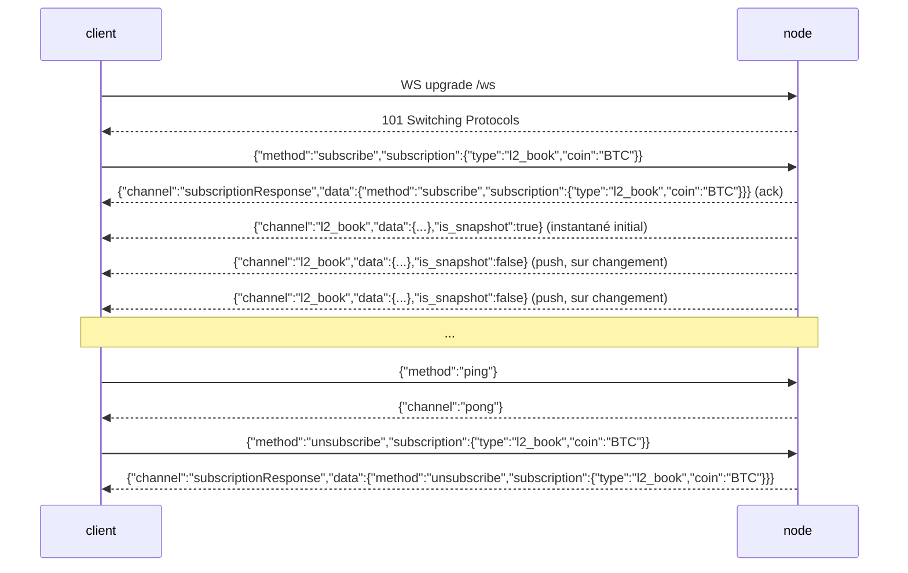

# API WebSocket

:::info
**Statut.** Disponible dès aujourd'hui sur le nœud pour `l2_book`, `bbo` (carnet/meilleure offre), `trades`, `active_asset_ctx` (mark/oracle/financement/intérêt ouvert par marché), `all_mids`, `fills`, `user_events` et `candles` (bougies OHLCV glissantes, par `(coin, interval)`) — toutes publient des données réellement engagées (committed), pilotées par les changements (un canal n'émet une trame que si son état a changé depuis le dernier commit) — plus `post` (requête/réponse via WS) et `ping`/`pong`. Voir [subscriptions](./subscriptions.md) pour les formats par canal.
:::

:::info
**Les noms de canaux sont en snake_case (natif MTF).** La surface `/ws` du nœud est native MTF, donc les noms de canaux sur le fil sont en snake_case : `l2_book`, `bbo`, `trades`, `active_asset_ctx`, `fills`, `candles`, `user_events`. La passerelle dessert ce même WS natif sur `api.<net>.mtf.exchange/ws`.
:::

## En bref

Une seule connexion WS multiplexe les abonnements à de nombreux canaux. Le protocole de trames reflète celui de HL (`{"method":"subscribe","subscription":{"type":...}}`), mais les **noms de canaux sont en snake_case natif MTF** (`l2_book`, `user_events`, …) : vous envoyez un abonnement, le serveur répond par un accusé de réception `subscriptionResponse` suivi d'un instantané initial, puis pousse des trames `{"channel":...,"data":...}` à chaque commit d'état. Les canaux de carnet d'ordres (`l2_book`, `bbo`) sont **par marché** et requièrent un `coin`. Consultez cette page pour le cycle de vie de la connexion ; voir [subscriptions](./subscriptions.md) pour le catalogue des canaux.

## URL

```
wss://api.<net>.mtf.exchange/ws
```

Le WS natif MTF (canaux en snake_case) est desservi par la passerelle sur `/ws`. La porte d'entrée de la passerelle termine le TLS (`wss://`). Si vous opérez votre propre nœud, le même WS natif est servi en clair sur `ws://localhost:8080/ws` — le protocole de trames est identique dans les deux cas.

## Cycle de vie de la connexion



## Trames

Toutes les trames sont des trames texte JSON. Les trames binaires sont rejetées par une trame d'erreur (la connexion reste ouverte). Les trames entrantes sont identifiées par `method` ; les trames sortantes sont identifiées par `channel`.

### `subscribe`

```json
{
  "method": "subscribe",
  "subscription": { "type": "<channel>", "coin": "<coin>" }
}
```

- `subscription.type` (obligatoire) — le nom du canal (snake_case, ex. `l2_book`). Les noms inconnus produisent une trame d'erreur.
- `subscription.coin` (obligatoire pour les canaux par marché `l2_book` / `bbo` / `trades` / `active_asset_ctx` ; omis pour `user_events`) — voir [Paramètre coin](#coin-parameter).

Le serveur répond par **deux** trames, dans l'ordre :

1. L'accusé de réception :

```json
{
  "channel": "subscriptionResponse",
  "data": { "method": "subscribe", "subscription": { "type": "l2_book", "coin": "BTC" } }
}
```

2. Une trame d'instantané initial sur le canal souscrit (voir chaque canal dans [subscriptions](./subscriptions.md)). Pour `l2_book` / `bbo`, il s'agit d'un vrai instantané du dernier carnet engagé ; pour les canaux sans source live active, il s'agit d'un corps vide mais valide.

Un abonnement en double au même `(type, coin)` est **silencieusement ignoré** (pas de second accusé, pas d'erreur) — conformément au comportement de HL.

### `unsubscribe`

```json
{ "method": "unsubscribe", "subscription": { "type": "l2_book", "coin": "BTC" } }
```

Accusé de réception (reflète l'accusé de `subscribe` avec `method: "unsubscribe"`) :

```json
{
  "channel": "subscriptionResponse",
  "data": { "method": "unsubscribe", "subscription": { "type": "l2_book", "coin": "BTC" } }
}
```

Après l'accusé, plus aucune trame n'arrive pour ce `(type, coin)` jusqu'à un nouvel abonnement. Se désabonner d'un `(type, coin)` auquel vous n'étiez pas abonné est une opération sans effet (vous recevez quand même l'accusé).

### `ping` / `pong`

```json
{ "method": "ping" }
```

```json
{ "channel": "pong" }
```

Un simple `{"method":"ping"}` (sans `subscription`) constitue le battement de cœur applicatif ; le serveur répond `{"channel":"pong"}`. Le nœud répond également aux pings WebSocket bas niveau (trames de contrôle RFC 6455 `Ping`) avec un `Pong` automatique — les deux mécanismes de heartbeat fonctionnent.

### Trame d'erreur

Toute trame entrante malformée ou non reconnue produit une trame d'erreur **sans fermer la connexion** :

```json
{ "channel": "error", "data": { "error": "<reason>" } }
```

Les causes incluent : JSON malformé, `method` absent, `subscription` / `subscription.type` manquant, nom de canal inconnu (`"unknown channel: <name>"`), trame binaire, ou méthode inconnue. Le client peut corriger et réessayer sur le même socket.

### Messages push

Les trames de données live partagent une même enveloppe :

```json
{ "channel": "<channel>", "data": { /* spécifique au canal */ }, "is_snapshot": false }
```

- `is_snapshot` est un booléen : `true` sur la trame initiale reçue à l'abonnement (l'instantané complet), `false` sur les pushs ultérieurs pilotés par les changements. **Chaque corps de trame est un instantané complet** (ex. `l2_book` contient les 20 meilleurs niveaux complets, `all_mids` la map complète, `account_state` l'état complet du compte) — `is_snapshot` est informatif, ce n'est pas un indicateur « diff ». Un client qui remplace simplement son état local à chaque trame reste cohérent et peut ignorer ce champ.
- Il n'y a **pas** de champ `seq`, `ts` ou `sub_id` sur la trame. Le démultiplexage s'effectue sur `channel` (et, pour les canaux par marché, le `coin` à l'intérieur de `data`).

Les mises à jour sont **pilotées par les changements** : après chaque commit, le nœud publie une trame pour un canal souscrit **uniquement si l'état engagé de ce canal a réellement changé** depuis le commit précédent. Un commit qui ne modifie pas un canal surveillé n'émet rien pour lui — vous recevez ainsi moins de trames qu'il n'y a de blocs, sans jamais recevoir de re-push redondant de données inchangées (voir [Push par abonné](#per-subscriber-push)).

### `post` (requête/réponse via WS)

Un `post` vous permet d'effectuer un appel requête/réponse unique sur le même socket sans ouvrir une connexion REST. Le corps `request` utilise la même enveloppe `{type, payload}` qu'acceptent les routes REST et est dispatché via les **mêmes handlers exacts** que `POST /info` et `POST /exchange` — vérification de signature des actions incluse.

Requête :

```json
{
  "method": "post",
  "id": 42,
  "request": { "type": "info", "payload": { "type": "node_info" } }
}
```

Réponse (à corréler via `id`) :

```json
{
  "channel": "post",
  "data": {
    "id": 42,
    "response": { "type": "info", "payload": { /* même corps que POST /info */ } }
  }
}
```

- `request.type` vaut `"info"` ou `"action"`.
- Pour `"action"`, `payload` doit être une enveloppe d'échange signée complète (`signature` / `nonce` / `action`), identique à [`POST /exchange`](../rest/exchange.md). L'action est signée sur la **sérialisation `serde_json` compacte de l'objet `action`** — la forme canonique déterministe que le SDK fixe.
- Les erreurs sont retournées comme une trame `post` normale avec `response.type: "error"` et un `payload` de type chaîne (jamais une fermeture de connexion) :

```json
{ "channel": "post", "data": { "id": 42, "response": { "type": "error", "payload": "<message>" } } }
```

Une action bien formée mais échouée (ex. signature invalide) est retournée comme une réponse `action` normale avec `payload.accepted: false` et une chaîne `error`, et non comme une réponse de type `error`.

## Paramètre coin

Le hub de diffusion est indexé par `(channel, coin)`. Pour les canaux par marché `l2_book` et `bbo`, cela signifie :

- **`coin` est obligatoire.** Sans lui, vous atterrissez dans le compartiment `(channel, None)` sans coin, que le diffuseur de carnet par marché n'écrit jamais — vous ne recevrez que l'instantané initial vide et aucune mise à jour live.
- **Un abonné `BTC` ne reçoit que des trames `BTC`.** Les commits ETH n'atteignent jamais un abonnement BTC, et vice-versa.

`coin` est normalisé en une **chaîne d'identifiant d'actif** avant l'indexation, de sorte que deux formes pointent vers le même compartiment :

- Un **identifiant d'actif numérique** — ex. `"0"`, `"7"` — correspond directement à ce marché (la clé canonique native MTF).
- Un **symbole** — ex. `"BTC"` — est résolu via l'univers engagé (`mip3_market_specs`, avec correspondance sur `symbol` ou `asset_name`) vers son identifiant d'actif.

Un abonné indexé par `"BTC"` et un autre indexé par l'identifiant numérique `"0"` (si BTC est l'actif 0) partagent donc le **même** compartiment de routage lors de la publication par commit. Un coin qui n'est ni numérique ni un symbole d'univers connu est conservé tel quel dans son propre compartiment — vous recevez l'accusé et l'instantané vide, mais jamais de trames live (comportement honnête « marché inconnu » plutôt qu'une correspondance fabriquée).

## Push par abonné

Les pushs sont **filtrés par abonné, par marché, et pilotés par les changements**. Après chaque bloc engagé, le nœud, pour chaque marché, vérifie `has_receivers(channel, coin)` — une recherche O(1) — et n'agrège le carnet de ce marché que si nécessaire, le diffusant **uniquement s'il a changé** depuis le commit précédent. Conséquences :

- Un marché que personne ne surveille ne coûte que la vérification O(1) ; aucun carnet n'est construit.
- Un abonné `BTC` ne déclenche jamais la construction d'un carnet `ETH`.
- Un marché dont le carnet est inchangé lors d'un commit ne diffuse rien pour ce commit — pas de re-push redondant.
- Les trames sont livrées à **tous** les abonnés actuels de ce compartiment `(channel, coin)`.

## Contre-pression et retard

Chaque abonnement est soutenu par un tampon circulaire de diffusion borné (capacité **256** trames). Un consommateur qui accuse plus de 256 trames de retard est **déconnecté** : le serveur envoie une trame d'erreur finale décrivant le retard, puis cesse de transmettre sur cet abonnement.

```json
{ "channel": "error", "data": { "error": "lagged behind broadcast by <n> messages" } }
```

Sur ce signal, réabonnez-vous (vous recevrez un nouvel instantané). Le nœud **ne saute pas silencieusement en avant** — sur une chaîne de produits dérivés, un trou dans l'état du carnet est pire qu'une déconnexion explicite.

## Authentification

Les canaux de marché publics (`l2_book`, `bbo`, `trades`, `all_mids`) ne nécessitent **aucune authentification**.

Les canaux par compte (`fills`, `user_events`) sont live et routés par adresse `user` en 0x, mais il n'existe **pas encore de porte d'authentification** — toute connexion peut s'abonner au flux de n'importe quelle adresse (les données sont les mêmes fills publics engagés, indexés par compte). Une enveloppe d'authentification dédiée à l'abonnement (pour qu'une connexion ne voie que son propre compte) est dans la feuille de route. Pour les lectures/écritures authentifiées aujourd'hui, utilisez le canal `post` (lectures info, et actions signées via la même vérification EIP-712 que `POST /exchange`). Voir [subscriptions](./subscriptions.md).

## Multiplexage

Une seule connexion peut maintenir de nombreux abonnements ; chacun est démultiplexé par son `(channel, coin)`. Chaque abonnement possède son propre récepteur de diffusion et sa propre tâche de transfert ; la connexion entrelace leurs trames sur l'unique socket. Routez les trames entrantes par `channel` ainsi que le `coin` à l'intérieur de `data`.

```
l2_book  coin "0" (BTC)
l2_book  coin "1" (ETH)
bbo      coin "0" (BTC)
```

## Comportement à la fermeture

- Une trame `close` côté client (ou EOF) démonte la connexion et interrompt toutes les tâches de transfert.
- Une erreur de lecture est journalisée et entraîne la fermeture.
- Un abonnement en retard est abandonné individuellement (trame d'erreur), mais la **connexion reste ouverte** — les autres abonnements continuent de fonctionner.

Il n'existe pas de table de codes de fermeture personnalisée aujourd'hui ; les codes de fermeture WebSocket standard s'appliquent.

## Stratégie de reconnexion

1. En cas de déconnexion, reconnectez-vous avec un backoff exponentiel (suggestion : base 200 ms, max 30 s, gigue ±20 %).
2. Réabonnez-vous à chaque `(type, coin)` depuis le début. La première trame après chaque abonnement est un nouvel instantané — il n'y a pas de jeton de reprise à gérer : jetez l'état local du carnet et reconstruisez-le depuis l'instantané.
3. Sur une trame d'erreur `lagged`, traitez-la comme une déconnexion pour cet abonnement et réabonnez-vous.

:::warning
Il n'existe **aucun** mécanisme `seq` / `resume` / `resume_token` aujourd'hui. Tout (ré)abonnement repart d'un nouvel instantané. Les tampons de reprise sont dans la feuille de route, pas encore implémentés.
:::

## Voir aussi

- [Catalogue des abonnements WS](./subscriptions.md)
- [`POST /exchange`](../rest/exchange.md) — même enveloppe EIP-712 utilisée par le chemin d'action `post`
- [`POST /info`](../rest/info.md) — équivalents REST pour les lectures ponctuelles (également accessibles via `post`)
