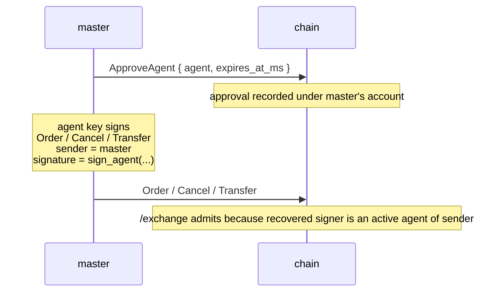

# Portefeuilles d'agent

:::tip
**Stable.**
:::

Un **portefeuille d'agent** (aussi appelé « portefeuille API ») est une clé qui signe des actions de trading au nom d'un compte maître sans jamais détenir d'autorité de retrait. C'est ainsi que fonctionnent tous les teneurs de marché sérieux : la clé maître reste en stockage à froid, une clé chaude fait tourner les bots.

Même primitive que les portefeuilles API du DEX de contrats perpétuels on-chain dominant. Compatible en remplacement direct au niveau du protocole.

## Pourquoi en utiliser un

- **Maître en stockage à froid.** Approuvez une seule fois depuis le froid, et ne signez plus jamais depuis la clé de haute valeur.
- **Périmètre par bot.** Des agents différents par stratégie ou par machine ; révoquez celui qui est compromis sans toucher aux autres.
- **Expiration.** Approuvez avec un horodatage d'expiration ; la clé s'éteint d'elle-même même si vous oubliez de la révoquer.
- **Audit.** Chaque action est signée par un agent spécifique, ce qui rend le journal on-chain propre sur le plan forensique.

## Le cycle de vie



Le maître signe `ApproveAgent` une seule fois. Une fois ce bloc validé, l'agent peut signer n'importe quelle action avec `sender = master_addr` et la chaîne la traite comme si le maître l'avait signée. Les approbations peuvent comporter une expiration explicite, ce qui permet aux clés chaudes de se retirer automatiquement même si vous ne les révoquez jamais explicitement.

## La vérification d'autorisation

Chaque requête vers [`POST /exchange`](../api/rest/exchange.md) contient trois éléments :

```
sender    = "0x<claimed master address>"
signature = secp256k1 ECDSA over the EIP-712 envelope
action    = the state-mutating action
```

La chaîne effectue cette vérification à chaque admission :

```
recovered_addr = ecrecover(eip712_envelope(action), signature)

if recovered_addr == sender:
    admit                                # master signed
else if recovered_addr is an active agent of sender (not expired):
    admit                                # an active agent of sender signed
else:
    return 401
```

Deux conséquences à souligner :

1. **Ni jetons porteurs, ni clés API.** La signature elle-même EST l'authentification. La possession de la clé privée d'un agent est ce qui prouve l'autorité ; rien dans l'URL de la requête ou les en-têtes n'accorde l'accès.
2. **`sender` n'est approuvé par le serveur qu'en raison de la signature.** Indiquer `sender = anyone` ne prouve rien tant que le signataire récupéré ne correspond pas à l'ensemble approuvé de ce compte.

## L'enveloppe EIP-712, en détail

La charge utile signée pour toute action est :

```
message_hash  = keccak256( msgpack(action) )
signed_hash   = keccak256( 0x1901 ‖ domain_separator ‖ message_hash )
signature     = secp256k1_sign( signed_hash, agent_private_key )
```

où :

```
domain_separator = keccak256(
    keccak256("EIP712Domain(string name,string version,uint256 chainId,address verifyingContract)") ‖
    keccak256("MetaFlux") ‖
    keccak256("1") ‖
    chain_id_as_uint256_be ‖
    address(0).padded_to_32
)
```

Cette composition respecte la sémantique d'enveloppe standard EIP-712 ; les clients de la pile EVM qui parlent déjà EIP-712 (MetaMask, Rabby, Ledger, WalletConnect) peuvent être configurés sur ce domaine sans modification.

`action` est signé en tant que **données typées structurées EIP-712** — un type primaire par variante d'action (`MetaFluxTransaction:<Action>`), ce qui permet aux portefeuilles d'afficher chaque champ par nom. Consultez la page [signature de données typées](../integration/typed-data-signing.md) pour les chaînes de types par action. La récupération de signature et la compatibilité EVM sont inchangées que ce soit le maître ou un agent approuvé qui signe.

## Ce que la chaîne stocke

Par compte maître, un ensemble d'agents approuvés :

```
approval = {
  agent          : address (20 bytes),
  approved_at_ms : u64 (block time at approval),
  expires_at_ms  : u64 or null (null = no expiry),
  name           : optional label for bookkeeping
}
```

Tous les champs temporels sont dérivés du temps de bloc de consensus, et non de l'horloge murale. Déterminisme : chaque validateur s'accorde sur le statut de l'agent à la même hauteur de bloc.

## Approuver un agent

Le maître soumet une action `ApproveAgent` via [`POST /exchange`](../api/rest/exchange.md) :

```json
{
  "sender":    "0x<master_addr>",
  "signature": "0x<master_signature>",
  "action": {
    "type": "ApproveAgent",
    "params": {
      "agent":          "0x<agent_addr>",
      "expires_at_ms":  1735689600000,
      "name":           "trading-bot-1"
    }
  }
}
```

`expires_at_ms` :
- `null` → pas d'expiration (actif jusqu'à révocation explicite)
- un entier positif → millisecondes Unix après lesquelles la chaîne rejette les requêtes signées par l'agent

`name` est uniquement un libellé pour votre propre comptabilité — il est renvoyé dans les requêtes d'information `userState` / `subAccounts`.

## Trader depuis l'agent

Une fois le bloc d'approbation validé, signez tout avec la clé de **l'agent** mais soumettez avec l'adresse du **maître** comme `sender`. Votre SDK gère l'enveloppe EIP-712 et soumet le lot signé. La chaîne récupère l'adresse de l'agent depuis la signature, constate la divergence avec `sender`, consulte l'ensemble d'approbations, et admet la requête.

## Délai de propagation

Après la validation de `ApproveAgent` à la hauteur de bloc `H` :
- les requêtes au bloc `H+1` et au-delà voient la nouvelle approbation

En pratique, cela signifie : attendez un cycle de consensus après l'envoi de `ApproveAgent` avant de démarrer le trafic signé par l'agent. La politique de réessai du SDK avec backoff linéaire gère proprement cette limite.

Le resserrement d'une expiration (ce qui revient à retirer un agent) suit le même délai d'un bloc.

## Rotation et expiration

Deux façons pour un agent de cesser d'être actif :

- **L'expiration** est définie au moment de l'approbation et s'applique automatiquement — une fois que `now > expires_at_ms`, les requêtes échouent. Vous n'avez rien d'autre à envoyer.
- **La ré-approbation** avec une expiration resserrée. Soumettre un nouveau `ApproveAgent` pour la même adresse d'agent écrase l'enregistrement précédent ; définir `expires_at_ms` dans le passé retire effectivement la clé.

Pour une rotation de routine, préférez l'expiration. Les SDK gèrent le calendrier de renouvellement de façon transparente.

## Protection contre la rediffusion

La chaîne applique des nonces par utilisateur :

- Chaque action porte un `nonce`
- La réutilisation d'un nonce pour le même utilisateur est rejetée même si la signature est par ailleurs valide

Implication pratique : le même agent peut soumettre des actions concurrentes en toute sécurité, à condition que chacune porte un nonce unique. Les SDK utilisent typiquement l'unix-ms avec gigue.

Pour les requêtes signées par un agent, l'espace de nonces est indexé sur le **maître** (`sender`), et non sur l'agent. Deux agents différents du même maître partagent l'espace de nonces.

## Liste de contrôle pour la production

Pratiques éprouvées pour gérer une flotte de clés d'agent en production :

| Élément | Raison |
|---------|--------|
| Maître en stockage à froid (portefeuille matériel / HSM) | Le maître ne signe que `ApproveAgent` (et `WithdrawUsdc` pour les retraits) — des événements rares |
| Un agent par hôte / conteneur | Si un hôte est compromis, seule l'autorité de cet agent est exposée ; révocation sans toucher aux autres |
| `expires_at_ms` défini à ≤ 30 jours à partir de l'approbation | Impose un calendrier de renouvellement ; les renouvellements manqués constituent une révocation automatique |
| Le nom de l'agent encode l'hôte et l'heure de démarrage | Rend l'audit forensique trivial : `mm-host-3 / 2026-Q2` |
| Script de rotation : pré-enregistrer le nouvel agent avant l'expiration de l'ancien | Soumettre `ApproveAgent` pour la nouvelle clé 24h avant l'expiration de l'ancienne ; basculer le trafic ; laisser l'ancienne expirer |
| Exercice de compromission : runbook de révocation + rotation testé trimestriellement | Quand une clé fuit réellement, l'exécution mécanique est primordiale |
| Surveiller `userEvents` pour les événements `agentApproved` / `agentExpired` | Confirmer que l'état côté chaîne correspond à votre attente |
| Utiliser un agent différent pour l'annulation seule ou le trading complet | Les clés d'annulation seule sont plus sûres dans les environnements semi-fiables |

### Modèle de rotation

```
jour -1   submit ApproveAgent { agent: new_key, expires_at_ms: NOW + 30d }
          wait 1 block (consensus tick); confirm via /info agents
jour 0    flip traffic in your bot: stop using old_key, start using new_key
jour 0    submit ApproveAgent { agent: old_key, expires_at_ms: NOW + 1h }
          to bound the old key's remaining authority window
jour +1h  old_key expires automatically
```

Le pré-enregistrement évite toute fenêtre où les deux clés pourraient être utilisées en parallèle
(ce qui est également acceptable — les agents concurrents partagent l'espace de nonces du maître).

## Ce qu'un agent ne peut pas faire

Par conception, les agents n'ont **aucune autorité de retrait**. Tout ce qui transfère des fonds hors du compte maître (retraits vers des chaînes externes, transferts vers d'autres adresses) doit être signé par la clé maître. La gestion des agents elle-même (création ou extension d'approbations) est également réservée au maître — aucune récursion agent-d'agent.

Les agents *peuvent* trader, annuler, modifier le mode de marge dans les limites autorisées, placer / annuler des ordres TWAP, et réaliser la plupart des opérations de trading habituelles.

## Cas d'échec

| Symptôme | Cause | Solution |
|----------|-------|----------|
| `401` sur chaque requête signée par l'agent | L'approbation n'a pas encore été validée | Attendez un bloc après `ApproveAgent` |
| `401` après une période connue comme fonctionnelle | L'agent a expiré | Approuvez à nouveau (nouvelle expiration) ou faites une rotation vers un agent neuf |
| `401` uniquement sur les actions de retrait | Les agents ne peuvent pas effectuer de retraits (par conception) | Signez avec la clé maître pour les retraits |
| `401` immédiatement sur un maître tout neuf | `sender` déclaré comme maître mais le signataire était quelqu'un d'autre et aucune approbation n'existe | Vérifiez que vous signez bien avec la bonne clé |

## Voir aussi

- [`POST /exchange`](../api/rest/exchange.md) — le chemin d'admission
- [Tutoriel de signature](../integration/signing.md) — exemple EIP-712 concret de bout en bout
- [Migration depuis HL](../integration/migrating-from-hl.md) — modèles de remplacement direct pour les bots HL
