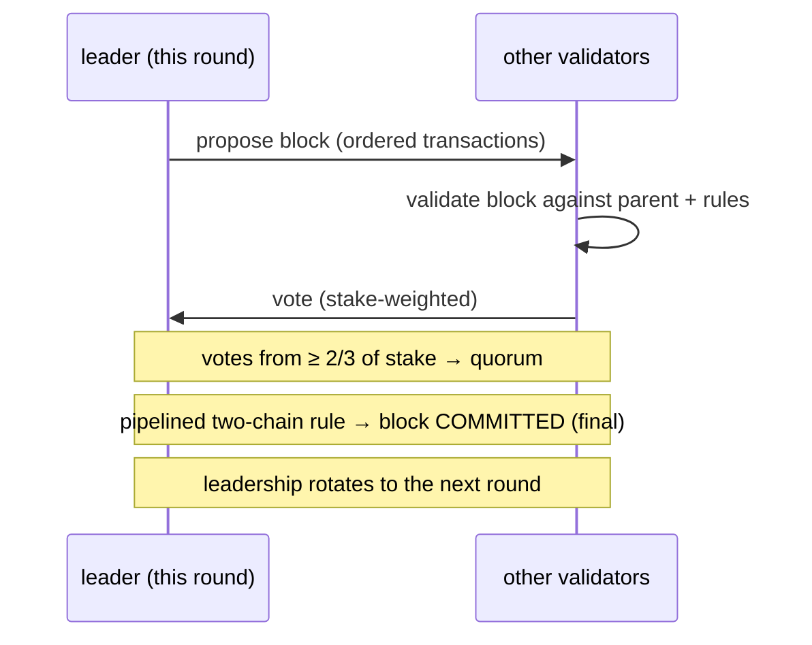
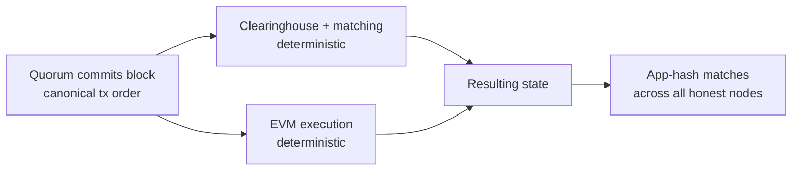

# Consensus (MetaFluxBFT)

:::info
**En production.** MetaFluxBFT est le moteur de consensus en production qui sécurise la L1 MetaFlux. Il ordonne chaque transaction — ordres, annulations, liquidations, transferts, appels EVM — en une seule chaîne canonique avec une finalité déterministe et instantanée.
:::

## En bref

**MetaFluxBFT** est le moteur de consensus Proof-of-Stake tolérant aux fautes byzantines (BFT) de MetaFlux. Un ensemble de validateurs pondérés par leur mise s'accorde, bloc par bloc, sur un ordre canonique unique pour chaque transaction. Une fois qu'un bloc est validé par un quorum, il est **définitif immédiatement** — pas de confirmations probabilistes, pas d'attente de N blocs, pas de réorganisations. Cet ordonnancement total et instantané est précisément ce qui permet à MetaFlux de faire fonctionner un carnet d'ordres et une chambre de compensation entièrement on-chain : chaque correspondance, exécution, paiement de financement et liquidation se règle par rapport à un ordre sur lequel l'ensemble du réseau est déjà d'accord.

## Pourquoi une bourse en a besoin

Une plateforme de trading n'est équitable que si tout le monde voit le même carnet dans le même ordre. MetaFluxBFT offre deux propriétés qui comptent directement pour les traders et les développeurs :

| Propriété | Ce que cela signifie pour vous |
|----------|------------------------|
| **Ordonnancement total** | Chaque transaction occupe une position unique et convenue dans la séquence. Le moteur de correspondance traite les ordres dans cet ordre exact — il n'existe aucun canal privilégié qui pourrait réordonner les transactions à votre détriment. |
| **Finalité instantanée** | Un bloc validé ne peut pas être annulé. Une exécution ou un règlement est définitif dès l'instant où le bloc est validé — vous n'avez jamais à tenir compte d'un risque de réorganisation. |

Ces deux propriétés combinées garantissent une **correspondance résistante au front-running** et un **règlement immédiat** : la même séquence canonique qui sécurise la chaîne est celle contre laquelle le carnet d'ordres effectue ses correspondances.

## Filiation conceptuelle

MetaFluxBFT est une implémentation **native à MetaFlux** dans la lignée académique de la famille de protocoles BFT pipelinés **HotStuff / Jolteon** (la ligne de recherche qui inclut également DiemBFT). Cette famille est :

- **Basée sur un leader** — à chaque tour, un validateur propose le bloc suivant et les autres votent pour l'accepter.
- **Partiellement synchrone** — elle reste *sûre* (ne produit jamais d'historiques finalisés contradictoires) en permanence, et progresse dès que le réseau délivre les messages en temps voulu.
- **Validation à deux chaînes** — la finalité est atteinte via une courte chaîne de votes pipelinés plutôt qu'un tour unique tout-ou-rien, ce qui maintient la latence de confirmation basse tout en préservant la sûreté BFT.

MetaFlux développe son propre moteur sur ces bases de recherche publiques plutôt que de forker une base de code existante, afin que le protocole puisse être ajusté aux besoins d'une bourse on-chain (exécution déterministe, EVM intégré, ensemble de validateurs dérivé du staking).

## Validateurs et staking

L'ensemble des validateurs est dérivé directement de la **mise on-chain** — MetaFluxBFT est un protocole Proof-of-Stake. Quiconque répond aux exigences de mise peut exploiter un validateur ; les délégateurs soutiennent des validateurs avec des MTF (voir [Staking](./staking.md)).

- **Vote pondéré par la mise.** L'influence d'un validateur sur le consensus est proportionnelle à la mise qui le soutient, et non à raison d'une voix par nœud.
- **Quorum = deux tiers de la mise.** Un bloc n'est validé que lorsque des validateurs représentant **au moins deux tiers du pouvoir de vote total mis en jeu** votent pour lui. Ce quorum des deux tiers est au cœur de la garantie BFT.
- **Rotation du leadership.** Le droit de proposer un bloc est transmis à tour de rôle à tous les validateurs, de sorte qu'aucun validateur unique ne contrôle la production de blocs.

### Époques

L'ensemble des validateurs est fixe au sein d'une **époque** et ne peut changer qu'aux frontières d'époque. Maintenir cet ensemble stable pendant toute la durée d'une époque assure un consensus déterministe et prévisible, tout en permettant à l'ensemble d'évoluer au fil du temps à mesure que la mise se déplace, que des validateurs rejoignent le réseau ou le quittent. Lorsqu'une époque se termine, le protocole adopte le nouvel ensemble dérivé du staking pour l'époque suivante.

## Sûreté et vivacité

Deux garanties définissent ce que MetaFluxBFT promet, au sens classique du BFT :

:::tip Sûreté
**La chaîne ne finalise jamais deux historiques contradictoires**, tant que **plus des deux tiers** du pouvoir de vote mis en jeu est honnête. Autrement dit, MetaFluxBFT tolère jusqu'à **un tiers** du pouvoir de vote byzantin (défaillant de manière arbitraire) sans jamais valider des blocs contradictoires. La sûreté est maintenue même lorsque le réseau est lent ou que les messages sont retardés.
:::

:::tip Vivacité
**La chaîne continue de progresser** — en validant de nouveaux blocs — dès que le réseau est suffisamment synchrone pour délivrer les messages en temps voulu. Comme le leadership est tournant, un leader bloqué ou non réactif ne peut pas stopper la chaîne : le protocole fait avancer le leadership et continue.
:::

C'est la séparation classique dans le BFT partiellement synchrone : *sûreté toujours*, *vivacité sous synchronie*.

## Finalité et exécution déterministe

La finalité dans MetaFluxBFT est **immédiate et absolue**. Dès qu'un quorum valide un bloc, ce bloc — et l'ordre exact des transactions qu'il contient — est permanent. Il n'y a ni période de règlement probabiliste ni risque de réorganisation.

L'exécution repose sur cet ordonnancement validé, et elle est **entièrement déterministe** :

1. Le consensus fixe l'ordre canonique des transactions dans un bloc.
2. Chaque nœud exécute la **même** transition d'état sur cet ordre — la chambre de compensation et le moteur de correspondance pour les trades, et l'EVM pour les transactions de smart contracts.
3. Comme les entrées (transactions ordonnées) et la fonction de transition sont identiques, chaque nœud honnête parvient indépendamment au **même état résultant**.

Les nœuds confirment leur accord en comparant une empreinte compacte de l'état résultant (un « app-hash »). Un ordonnancement identique combiné à une exécution déterministe signifie que l'app-hash de chaque nœud honnête correspond — le réseau reste en accord parfait sans faire confiance au calcul d'un seul nœud.

## Responsabilisation

Les validateurs sont économiquement responsables de leur participation. Un validateur qui **se comporte de manière manifestement incorrecte** peut être **mis en prison** (exclu de la participation active) et **slashé** (perdre une partie de sa mise). Une indisponibilité prolongée peut également conduire à une mise en prison. Cela lie la position économique d'un validateur à un comportement honnête et adosse les garanties de consensus à une mise réelle exposée au risque. Les délégateurs devraient évaluer les antécédents opérationnels d'un validateur ; voir [Staking](./staking.md) pour comprendre comment le slashing et la mise en prison se répercutent sur la mise déléguée.

## Vue d'ensemble

MetaFluxBFT est le fondement sur lequel repose le reste du protocole :

- Le **carnet d'ordres et la chambre de compensation** effectuent leurs correspondances et règlements par rapport à l'ordonnancement canonique unique — c'est ce qui rend la correspondance on-chain équitable.
- Les **liquidations** et le **financement** sont appliqués à des points dérivés du consensus dans ce même ordonnancement, de sorte que chaque nœud liquide et finance de manière identique.
- La **sidechain EVM** s'exécute également sur l'ordonnancement validé, partageant la même finalité.
- Le **staking** et la **gouvernance** se répercutent sur le consensus : la mise détermine l'ensemble des validateurs, et les paramètres définis par la gouvernance sont eux-mêmes validés via la chaîne.

## Voir aussi

- [Staking](./staking.md) — déléguer des MTF, soutenir des validateurs, percevoir des récompenses, et les règles de slashing/mise en prison qui sécurisent le consensus
- [Prix mark](./mark-prices.md) — prix dérivés du consensus qui pilotent la marge et la liquidation
- [Liquidation progressive](./tiered-liquidation.md) — comment les liquidations sont appliquées sur l'ordonnancement validé
- [Modèle d'exécution EVM](../evm/execution-model.md) — comment l'EVM s'exécute sur l'ordonnancement de blocs validé

## FAQ

Afficher la FAQ

**Q : Combien de confirmations dois-je attendre ?**
R : Aucune. La finalité est instantanée — une fois qu'un bloc est validé, il est définitif et ne peut pas être réorganisé. Une exécution est réglée dès l'instant où son bloc est validé.

**Q : La chaîne peut-elle annuler un trade ?**
R : Non. Il n'y a pas de réorganisations. L'historique validé est permanent.

**Q : Que se passe-t-il si le leader actuel se déconnecte ?**
R : Le leadership est transmis au suivant. Un leader bloqué ne peut pas stopper la chaîne ; le protocole fait avancer le leadership et continue de valider des blocs dès que le réseau délivre les messages en temps voulu.

**Q : Quelle quantité de mise défaillante le réseau peut-il tolérer ?**
R : Jusqu'à un tiers du pouvoir de vote total mis en jeu peut être byzantin sans que la chaîne ne finalise jamais d'historiques contradictoires. La sûreté exige que plus des deux tiers du pouvoir de vote soit honnête.

**Q : Est-ce du Proof-of-Work ?**
R : Non. MetaFluxBFT est du Proof-of-Stake — l'ensemble des validateurs et le pouvoir de vote sont dérivés de la mise MTF on-chain, et non du minage.

