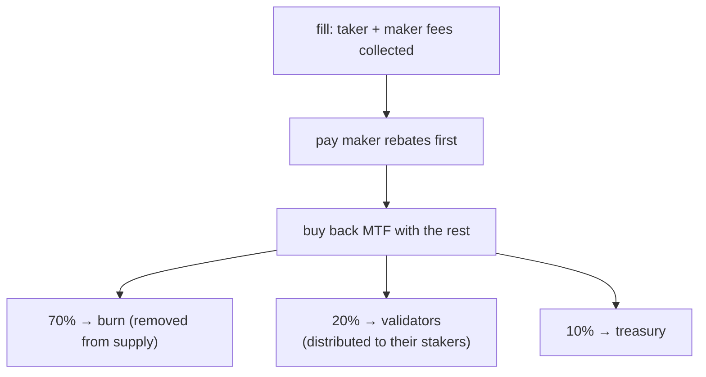

# Frais

:::info
**Page conceptuelle.** Cette page explique comment les frais de trading sont calculés par exécution, les crédits builder et referrer, les frais sur le marché au comptant et les frais de liquidation, ainsi que la destination des frais collectés. Pour les taux effectifs — paliers de frais par volume, paliers de remboursement maker et paliers de réduction au staking — consultez le [Barème des frais](./fee-schedule.md). Les valeurs de frais sont des paramètres réseau et peuvent être mis à jour par gouvernance.
:::

## En bref

Chaque exécution génère des frais maker et taker, définis par le [Barème des frais](./fee-schedule.md). Un crédit builder peut reverser une part à l'origine du flux d'ordres, et un crédit referrer peut reverser une part des frais taker à un parrain. Après versement des remboursements maker, le protocole utilise le reste des revenus de frais pour **racheter des MTF**, puis répartit les MTF rachetés **à 70 % en destruction / 20 % aux validateurs / 10 % à la trésorerie**. Les frais sont déduits de votre solde au moment de l'exécution et apparaissent dans [`userFills`](../api/rest/info.md#user_fills).

## Calcul des frais

Les frais sont réglés en USDC entiers : le notionnel est le produit prix × taille, tronqué vers zéro.

### Par exécution

```text
notional    = |price × size|
taker_fee   = notional × taker_rate
maker_fee   = notional × maker_rate
builder_fee = notional × builder_rate    # additive, taker-only, capped
```

Les taux taker et maker sont déterminés par votre palier dans le [Barème des frais](./fee-schedule.md) : votre taux de base selon le volume sur 30 jours, un remboursement maker supplémentaire selon votre part de volume maker, et une réduction taker selon le montant de MTF que vous stakez. Un taux maker effectif négatif constitue un remboursement versé **au** maker, financé sur les frais taker collectés sur le même flux — le protocole ne verse jamais plus qu'il ne perçoit.

Les frais par exécution apparaissent dans chaque entrée [`userFills`](../api/rest/info.md#user_fills) dans le champ `fee` (unités de base USDC ; positif = payé, négatif = remboursement reçu).

## Crédit builder

Un opérateur de flux d'ordres peut revendiquer une part des frais taker en définissant une adresse builder sur l'ordre. Le crédit est versé à cette adresse à chaque exécution. Usages typiques :

- une interface frontale ou un agrégateur ayant acheminé le flux,
- une API de données de marché intégrant l'exécution,
- un service de gestion du risque automatisé ayant placé des ordres de protection.

Le builder doit être une adresse enregistrée (voir [`approve_builder_fee`](../api/rest/exchange.md#approve_builder_fee)). Les builders non enregistrés sont silencieusement ignorés. Le crédit builder est additif et réservé au taker, avec un plafond par ordre ; il ne modifie pas le côté maker.

## Crédit referrer

Lorsqu'un compte dispose d'un referrer, une part de ses **frais taker** est reversée au referrer **avant** la distribution du reste — elle est prélevée sur la part du protocole, sans frais supplémentaires pour le taker. Les frais maker ne donnent pas lieu à un crédit referrer.

Les parrainages sont à un seul niveau (pas de chaîne multi-niveaux — anti-Ponzi). Un referrer est défini une seule fois via [`set_referrer`](../api/rest/exchange.md#set_referrer) et est immuable par la suite ; se définir soi-même comme son propre referrer est rejeté.

Un crédit builder et un crédit referrer peuvent s'appliquer simultanément à la même exécution — ils sont versés indépendamment l'un de l'autre.

## Destination des frais

Les frais collectés transitent par un pipeline unique de création de valeur :



1. **Les remboursements maker sont versés en priorité.** Les taux maker nets négatifs (voir le [Barème des frais](./fee-schedule.md)) sont réglés sur les frais collectés sur le même flux.
2. **Le solde restant sert à racheter des MTF.** Tous les revenus de frais restants après remboursements sont utilisés pour acheter des MTF au cours de marché du protocole. Cela crée une pression acheteuse et convertit les revenus de frais en MTF avant leur distribution.
3. **Les MTF rachetés se répartissent à 70 / 20 / 10 :**
   - **70 % sont détruits** — retirés définitivement de la circulation (déflationniste).
   - **20 % vont aux validateurs**, qui les redistribuent à leurs stakers. Il s'agit du **dividende staker** — les revenus de frais parviennent aux stakers via la part de leur validateur.
   - **10 % vont à la trésorerie** (et absorbent les arrondis résiduels pour que la répartition soit sans fuite).

Les totaux cumulatifs des pools (MTF rachetés et détruits, pool validateurs, trésorerie) sont suivis dans l'état engagé et exposés en lecture via [`protocol_metrics`](../api/rest/info.md#protocol_metrics) :

```bash
curl -X POST https://devnet-gateway.mtf.exchange/info -d '{"type":"protocol_metrics"}'
```

Le dividende staker étant versé via la part validateur, staker davantage de MTF (ou déléguer à un validateur) permet d'en recevoir une part plus importante — voir [Staking](./staking.md).

## Frais sur le marché au comptant

La même structure maker/taker s'applique aux exécutions au comptant, mais les frais spot sont prélevés sur un **compte de frais distinct** de celui des contrats perpétuels, et ils sont déduits **de la jambe reçue par chaque partie** — pas systématiquement du solde en devise de cotation :

- les frais **taker** sont prélevés sur la jambe reçue par le taker,
- les frais **maker** sont prélevés sur la jambe reçue par le maker.

Ainsi, un **acheteur** au comptant (recevant l'actif de base) paie ses frais en **actif de base**, et un **vendeur** (recevant la devise de cotation) paie ses frais en **devise de cotation**. Chaque paire spot peut définir ses propres taux maker/taker ; si une paire ne les définit pas, le taux spot global par défaut s'applique. Consultez les paliers spot dans la réponse [`/info fee_schedule`](../api/rest/info.md#fee_schedule) et [trading au comptant](../products/spot.md#matching-fills-and-fees) pour le modèle de règlement.

## Frais sur les exécutions de liquidation

Les clôtures par liquidation transitent par le chemin standard des frais taker décrit ci-dessus. Des frais de liquidation discrets — une charge supplémentaire répartie entre le pool d'assurance et la trésorerie pour maintenir la solvabilité de l'assurance et rémunérer les makers qui absorbent les flux forcés — constituent une intention de conception qui n'est pas encore active. Lorsqu'ils entreront en vigueur, les comptes liquidés les acquitteront dans le cadre de la perte réglée à la clôture, signalée dans les exécutions de liquidation dans [`userFills`](../api/rest/info.md#user_fills). Voir [liquidation par paliers](./tiered-liquidation.md) pour les mécaniques de clôture.

## Interrogation

```bash
# tier overview (MTF-native — gateway default path; running the node yourself: localhost:8080)
curl -X POST https://devnet-gateway.mtf.exchange/info -d '{"type":"fee_schedule"}'

# your personal tier and recent volume — MTF-native (gateway default path)
curl -X POST https://devnet-gateway.mtf.exchange/info \
  -d '{"type":"user_fees","address":"0x<addr>"}'

# or the HL-compat shape under /hl on the gateway
curl -X POST https://devnet-gateway.mtf.exchange/hl/info \
  -d '{"type":"userFees","user":"0x<addr>"}'
```

## Cas limites

<details>
<summary>Afficher les cas limites</summary>

- **Volume agrégé entre sous-comptes.** Un compte maître et tous ses sous-comptes partagent un seul palier de volume. Un desk qui gère de nombreuses stratégies sous un même compte maître bénéficie du palier agrégé.
- **Cadence d'évaluation des paliers.** Les paliers sont réévalués en continu sur la fenêtre glissante des 30 derniers jours — il n'y a pas de capture périodique. Une transaction qui vous fait franchir un nouveau palier s'applique dès la prochaine exécution.
- **Crédit builder ≠ crédit referrer.** Les deux peuvent s'appliquer à la même exécution — le compte d'un utilisateur a un referrer et l'ordre de cette exécution a spécifié un builder. Les deux versements sont effectués indépendamment.
- **Palier maker à frais négatifs.** Lorsque le taux maker net est inférieur à zéro, le maker est rémunéré sur les frais taker collectés sur le même flux (et sur l'ensemble des exécutions dans le même bloc) ; le protocole ne verse jamais plus qu'il ne perçoit.

</details>

## Voir aussi

- [Barème des frais](./fee-schedule.md) — le tarif : paliers de frais par volume, paliers de remboursement maker et paliers de réduction au staking, et leur combinaison
- [Staking](./staking.md) — staker des MTF pour le dividende de la part validateur et la réduction taker
- [`POST /info fee_schedule`](../api/rest/info.md#fee_schedule)
- [`POST /info user_fees`](../api/rest/info.md#user_fees) — palier par utilisateur MTF-natif / volume sur 30 jours
- [`POST /info protocol_metrics`](../api/rest/info.md#protocol_metrics) — pools de frais cumulatifs (destruction / trésorerie / validateurs)
- [`POST /info userFees`](../api/rest/hl-compat.md#userfees) — compatible HL
- [Liquidation par paliers](./tiered-liquidation.md) — mécaniques de liquidation

## FAQ

<details>
<summary>Afficher la FAQ</summary>

**Q : Les frais s'appliquent-ils par exécution ou par ordre ?**
R : Par exécution. Un ordre partiellement exécuté accumule des frais proportionnels à la taille exécutée à chaque événement d'exécution.

**Q : Les frais sont-ils payés en USDC ou en MTF ?**
R : Vous payez dans la devise d'exécution (USDC pour les perpétuels ; la jambe reçue pour le spot). Le protocole utilise ensuite les revenus de frais pour racheter des MTF, et c'est ce MTF racheté qui est détruit et distribué.

**Q : Y a-t-il un montant minimum de frais ?**
R : Aucun plancher. Une exécution minime génère des frais inférieurs à un centime (arrondi à la baisse à l'affichage, prélevé à pleine précision en interne).

**Q : Chaque tranche TWAP paie-t-elle des frais taker ?**
R : Oui — chaque tranche est un IOC à la discrétion du protocole. Le total des frais TWAP = somme des frais de chaque tranche.

**Q : Le crédit builder peut-il être nul ?**
R : Oui. Si vous ne définissez pas de builder sur un ordre, aucun crédit n'est alloué ; la totalité de la part du protocole transite par le pipeline de rachat et de distribution.

**Q : Comment les stakers tirent-ils profit des frais ?**
R : Via la part validateur. Après le rachat, 20 % des MTF rachetés vont aux validateurs, qui les redistribuent à leurs stakers — ainsi, staker (ou déléguer) vous permet de recevoir une part des revenus de frais. Voir [Staking](./staking.md).

</details>
