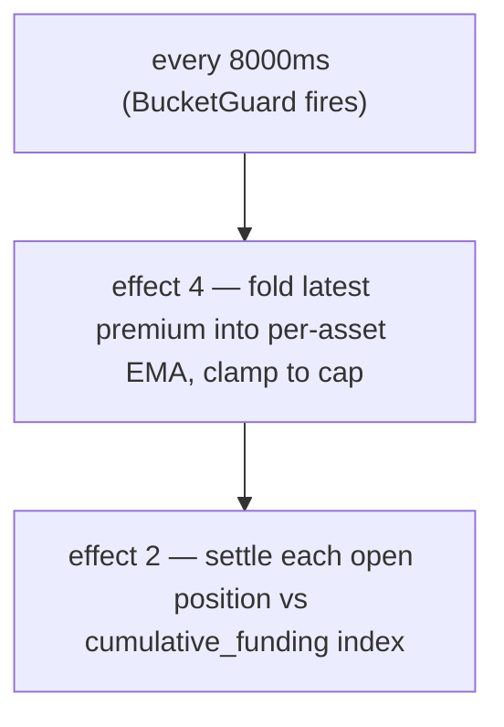

# Taux de financement

:::tip
**Stable.**
:::

## En bref

Les positions perpétuelles accumulent un paiement de financement continu (réglé toutes les **8 s** on-chain) proportionnel à la **prime du contrat perpétuel par rapport à l'oracle** — mesurée à partir du **prix d'impact** pondéré par la profondeur de carnet, et non à partir d'une seule transaction — plus un terme d'**intérêt** de référence. Les positions longues paient les positions courtes lorsque le perpétuel s'échange au-dessus de l'oracle ; les courtes paient les longues lorsqu'il s'échange en dessous. Le résultat est plafonné à une valeur par défaut de **`±4 % / heure`** par marché, et le règlement s'effectue contre **l'oracle**.

## Pourquoi le financement existe

Les contrats perpétuels n'ont pas de date d'expiration, il n'existe donc pas de force d'arbitrage naturelle pour les ancrer au sous-jacent. Le financement joue ce rôle : lorsque le prix du perpétuel dérive au-dessus du comptant, les longs paient, ce qui incite à ouvrir des positions courtes et décourage les longues jusqu'à ce que le perpétuel revienne à la parité. Le protocole ne prend jamais l'un des deux côtés — c'est un mécanisme d'utilisateur à utilisateur.

## Formule

> La section ci-dessus présente le modèle conceptuel. Les chiffres ci-dessous sont les valeurs **implémentées**. En cas de divergence entre la description textuelle et le code, c'est le code qui fait foi ; les écarts sont signalés en ligne.

### Méthode de calcul

Le financement repose sur une **EMA déterministe** de la prime (prix d'impact − oracle), réglée toutes les **8 secondes**, et non à l'heure. Le plafond est de **4 % / heure**, et non de 0,05 %.

Deux effets en début de bloc pilotent le cycle, chacun derrière un `BucketGuard` de 8 000 ms :

- **effet 4 `update_funding_rates`** — intègre le dernier échantillon de prime dans l'EMA par actif, puis applique le plafond.
- **effet 2 `distribute_funding`** — règle chaque position ouverte par rapport à l'index de financement cumulatif.

#### 0. Base de prime — le prix d'impact (et non la dernière transaction)

L'**échantillon de prime** par bloc est l'écart entre le **prix d'impact** du perpétuel et l'oracle :

```
premium = (impact_mid − oracle) / oracle
impact_mid = mid( impact_bid, impact_ask )
impact_bid/ask = VWAP du carnet d'ordres consommé pour exécuter un notionnel fixe (~10 k$ par défaut)
```

Utiliser le prix *d'impact* — le prix pondéré par le volume pour exécuter un vrai clip — plutôt que la dernière transaction ou la meilleure cotation garantit qu'une seule exécution, ou un ordre unitaire à un prix aberrant, **ne peut pas** influencer le financement : il faut véritablement déplacer de la profondeur. Cela reproduit le design de référence des perpétuels. (Un mode hérité par marché échantillonne à la place `premium = (mark − oracle)/oracle` ; les marchés nouveaux et migrés utilisent la base d'impact ci-dessus.)

#### 1. EMA de l'index de prime (par marché)

La prime est lissée par une **EMA déterministe** (l'*index de prime*). L'accumulateur stocke une fraction en virgule fixe `(num, denom)` — pas de nombres flottants, arithmétique exacte `rust_decimal::Decimal` afin que l'état soit identique bit à bit entre les nœuds. Chaque échantillon est intégré ainsi :

```
num'   = num   * decay + sample
denom' = denom * decay + 1
value  = num / denom
```

- `sample` = dernière prime pour l'actif × le `funding_rate_multiplier` par actif (par défaut `1.0` ; piloté automatiquement par le moteur de risque dynamique).
- `decay = 0.5` (valeur par défaut proposée → ≈ 7 s de demi-vie à une cadence d'échantillonnage de 5 s). Limité à `[0, 1]` lors de la mise à jour.
- Cadence d'échantillonnage : **5 s** ; cadence d'intégration EMA + règlement : **8 000 ms** (`funding_update_guard` / `funding_distribute_guard`).

> **Statut :** la boucle de financement complète est **active** de bout en bout. Chaque période de 8 s, le pilote de taux échantillonne la prime depuis l'état committed (la prime impact-vs-oracle ci-dessus, un échantillon par marché de perpétuels), l'intègre dans l'EMA de l'index de prime par actif, dérive le taux (intérêt + plafond), applique le plafond, puis le règlement avance l'index de financement cumulatif et déplace `size × Δindex` entre les soldes des détenteurs de positions (jeu à somme nulle : les longs paient les courts ou vice versa, sans émission ni destruction de tokens) — tout depuis l'état de marché committed, sans alimentation externe de prime. Conservation- et déterminisme-fuzzés, avec un e2e à 4 nœuds prouvant divergence → prime → EMA → index → transfert de solde.

#### 2. Taux issu de l'index de prime (intérêt + plafond)

Le taux de financement **n'est pas** l'index de prime brut. L'index lissé `premium_idx` est combiné à un terme d'**intérêt** de référence via un plafonnement par étape :

```
interest = 0.0000125 / h        # = 0.01% / 8h — le portage de référence
clamp    = ±0.0005              # borne par étape

funding = premium_idx + clamp( interest − premium_idx, −clamp, +clamp )
```

Lorsque l'index de prime est faible, le financement dérive vers la ligne de base `interest` ; lorsque la prime est élevée, le terme `premium_idx` domine, et le plafonnement borne la force de rappel des intérêts à chaque étape. `interest` et `clamp` sont tous deux des paramètres modifiables par la gouvernance par actif. (Le mode hérité par marché lit directement la valeur de l'EMA comme taux, sans transformation intérêt/plafond.)

#### 3. Plafond global

`funding` est enfin limité au plafond horaire :

```
cap_per_hour = 0.04          # 4 %/h par défaut
funding = clamp(funding, −cap_per_hour, +cap_per_hour)
```

Le plafond est un paramètre de gouvernance par marché : un `dynamic_risk_overrides[asset].funding_rate_cap` remplace la valeur par défaut `0.04` lorsqu'il est défini.

#### 4. Paiement (par position, par règlement)

Le financement s'accumule dans un index cumulatif par marché (`clearinghouse.cumulative_funding`) ; chaque position conserve son dernier index réglé (`funding_entry`). Au moment du règlement :

```
payment = size_signed * oracle_px * (cum_global - funding_entry) * funding_rate_multiplier[asset]
funding_entry := cum_global      # avancement
```

(L'arithmétique est câblée et verrouillée en déterminisme ; le transfert de solde effectif est réalisé avec le règlement BOLE complet.)

| Symbole | Signification / plan |
|--------|-----------------|
| `size_signed` | Taille de position signée ; `i128`. Long > 0, court < 0. |
| `oracle_px` | Prix oracle composé — plan `Decimal` en USDC entier (voir [prix mark](./mark-prices.md)). |
| `cum_global − funding_entry` | Financement cumulatif accumulé pour ce marché depuis le dernier règlement de la position. |
| `decay` | Décroissance EMA 0.5. |
| `cap_per_hour` | Par défaut `0.04` (4 %/h) ; remplacement par marché via le risque dynamique. |
| `funding_rate_multiplier` | Multiplicateur par actif, par défaut `1.0`, piloté automatiquement par le risque dynamique. |

`funding_rate` (la valeur EMA) est signée : positif → les longs paient les courts ; négatif → les courts paient les longs.

**Intérêt de référence :** `0.0000125/h` (= `0.01%/8h`) — le portage de référence auquel l'EMA de prime est ajoutée.

> ⚠️ **Correction par rapport au texte précédent.** L'ancienne description mentionnait « toutes les heures », « fenêtre EMA de 60 minutes » et « plafond de 0,05 %/heure ». L'implémentation règle toutes les **8 s**, le `decay` de l'EMA est **0,5** (≈ 7 s de demi-vie), et le plafond est **4 %/heure**. Le modèle mental horaire reste valable pour un calcul de portage approximatif, mais la cadence et le plafond on-chain sont ceux indiqués ci-dessus.

## Cadence de paiement

Le financement est réglé **toutes les 8 secondes** (intervalle `funding_distribute_guard`), piloté par les horodatages de blocs dérivés du consensus — non par les heures d'horloge murale. Les positions sont réglées par rapport à l'index de financement cumulatif ; une position ouverte en cours d'intervalle ne paie donc que l'accumulation depuis son ouverture (pas d'effet de « snapshot à l'heure pile »).



Les paiements sont réglés sous forme d'ajustements de solde — pas de transaction on-chain, pas de frais. Ils apparaissent dans l'historique de l'utilisateur avec `kind: "funding"`.

## Blocage en cas d'oracle non fiable

Le financement **est réglé par rapport à l'oracle** ; un prix que le protocole ne juge pas fiable ne doit pas déclencher de paiement. À chaque période, l'échantillon de prime est *bloqué* : il est ignoré (échantillonné à **0**) lorsque

- l'**oracle est absent ou ≤ 0** pour le marché, ou
- l'**oracle est obsolète** au-delà de `funding_oracle_staleness_ms` (par défaut **60 s**), ou
- le **carnet est trop peu profond** pour remplir le notionnel d'impact des deux côtés (pas de prix d'impact disponible).

Un échantillon ignoré est intégré comme 0, de sorte que l'EMA de l'index de prime **décroît vers 0** et que le taux de financement s'estompe plutôt que de se régler sur une base obsolète ou manipulable. (Voir aussi [cas limites](#cas-limites).)

:::info
**C'est pourquoi vous pouvez observer un écart mark↔oracle important avec un financement ≈ 0.** Si le flux oracle d'un marché est défaillant ou non fiable, le financement est bloqué et décroît vers 0 — même si le [mark](./mark-prices.md#mark-vs-oracle--why-they-diverge) (construit à partir du carnet et des perpétuels externes) s'éloigne du dernier oracle valide. Un grand écart avec un financement ~0 signifie que le protocole *refuse d'appliquer le financement sur un oracle défaillant*, et non qu'il y a un bug de financement.
:::

## Exemple concret

Marché : perpétuel BTC, état actuel (plan oracle en USDC entier) :

```
mark         = 100.50
oracle       = 100.00
premium      = mark - oracle = 0.50
EMA(premium) converge vers 0.50 avec decay 0.5 sur quelques échantillons de 5s
funding cap  = 4% / hour (default)
```

Supposons que la valeur EMA donne un taux de financement de `+0.0005` (0,05 %) pour l'intervalle (bien en dessous du plafond de 4 %/h). Positions du compte :

```
long 1 BTC      → paie le financement
short 0.5 BTC   → reçoit le financement
```

```
funding_rate = clamp(ema_value, -0.04, +0.04) = +0.0005   (not capped — far below 4%/h)

long 1 BTC:
  payment = +1   * oracle_px * Δcum  ≈ +1   * 100.00 * 0.0005 = +0.0500 USDC  (long pays)

short 0.5 BTC:
  payment = -0.5 * oracle_px * Δcum  ≈ -0.5 * 100.00 * 0.0005 = -0.0250 USDC  (short receives 0.0250)
```

(Le paiement utilise `size_signed * oracle_px * (cum_global - funding_entry)` ; ici `Δcum` est le financement accumulé depuis le dernier règlement de la position.) Réglé toutes les 8 s, le montant par intervalle est infime ; le plafond n'est significatif qu'en cas de déséquilibre unilatéral soutenu, où 4 %/h constitue le maximum.

## Plafonds de financement et limites dynamiques

| Paramètre | Défaut | Source / remplacement |
|-----------|---------|-------------------|
| plafond de financement (par heure) | `0.04` (`4 %/h`) | `dynamic_risk_overrides[asset].funding_rate_cap` (vote de gouvernance) |
| EMA `decay` | `0.5` (≈ 7 s de demi-vie) | Proposé ; la calibration peut ajuster à 0,3/0,7 |
| cadence d'échantillonnage | `5 s` | fixé par le protocole |
| intervalle de règlement / mise à jour | `8000 ms` | BucketGuards `funding_distribute_guard` / `funding_update_guard` |
| intérêt de référence | `0.0000125/h` (`0.01 %/8h`) | fixé par le protocole |
| `funding_rate_multiplier` | `1.0` | par actif, piloté automatiquement par le risque dynamique |

Le `funding_rate_multiplier` par actif est la différenciation de MTF par rapport à la valeur statique définie par la gouvernance de HL : il est piloté automatiquement à partir de la volatilité réalisée sur 30 jours par le moteur de risque dynamique, en mettant à l'échelle l'échantillon de prime avant son entrée dans l'EMA.

## Historique de financement

Historique par compte via [`POST /info userFills`](../api/rest/info.md) ou [HL-compat `userFills`](../api/rest/hl-compat.md) — les paiements de financement apparaissent avec `kind: "funding"` et l'actif concerné.

Historique par marché :

```bash
curl -X POST https://devnet-gateway.mtf.exchange/info \
  -H 'content-type: application/json' \
  -d '{"type":"funding_history","market_id":0}'
```

Renvoie l'anneau ordonné d'échantillons `(ts_ms, premium)` (voir
[`funding_history`](../api/rest/info.md#funding_history)) :

```json
{
  "type": "funding_history",
  "data": {
    "market_id": 0,
    "samples": [
      { "ts_ms": 1700000000000, "premium": "0.0015" },
      { "ts_ms": 1700000008000, "premium": "-0.0007" }
    ]
  }
}
```

Un canal WS dédié `fundingTicks` figure dans la [feuille de route WS](../api/ws/subscriptions.md#roadmap--not-yet-available) ; en attendant, interrogez [`funding_history`](../api/rest/info.md#funding_history).

## Ce que le financement ne fait pas

- **Aucun lien avec les frais.** Le financement est de l'utilisateur à l'utilisateur ; les frais sont des remises maker/taker à la plateforme. Voir [frais](./fees.md).
- **Pas d'intérêts sur le collatéral.** Le solde USDC ne génère pas d'intérêts via le financement. Le financement sert uniquement à réduire l'écart mark-oracle.
- **Non prédictible sur de longues fenêtres.** Le financement peut changer de signe d'une heure à l'autre. Ne le modélisez pas comme un portage constant.

## Cas limites

<details>
<summary>Afficher les cas limites</summary>

- **Position ouverte en cours d'intervalle.** Il n'y a **pas de snapshot horaire** — le financement s'accumule dans un index cumulatif, et une position ne paie jamais que le mouvement d'index depuis son dernier règlement. Ouvrir juste après un règlement entraîne un paiement quasi nul pour cette période ; il n'y a pas d'effet de seuil « dans le snapshot / hors du snapshot ».
- **Position fermée en cours d'intervalle.** Identique — la position règle son accumulation à ce jour à la fermeture ; pas d'arrondi sur la période partielle dans un sens ou dans l'autre.
- **Régime négatif.** Un marché où le perpétuel est durablement sous l'oracle (les courts paient les longs) voit `funding_rate` négatif sur des périodes prolongées ; les longs reçoivent le financement.
- **Oracle obsolète / carnet peu profond.** L'échantillon de prime est bloqué à 0 et le taux décroît vers 0 — voir [Blocage](#blocage-en-cas-doracle-non-fiable). Le financement ne se règle pas sur un oracle non fiable.

</details>

## Voir aussi

- [Prix mark](./mark-prices.md) — comment `oracle` est dérivé
- [Liquidation par paliers](./tiered-liquidation.md) — les paiements de financement ajustent `account_value`, ce qui affecte `health`
- [Canal WS `fundingTicks` (feuille de route)](../api/ws/subscriptions.md#roadmap--not-yet-available)
- [Frais](./fees.md) — distincts du financement

## FAQ

<details>
<summary>Afficher la FAQ</summary>

**Q : Le financement est-il identique à celui d'un CEX ?**
R : Le modèle mental est le même. La plupart des CEX paient toutes les 8 heures ; MetaFlux règle toutes les 8 secondes (intervalle `funding_distribute_guard`), de sorte que l'impact par paiement est infime et le portage plus régulier. Le plafond de 4 %/h est ce qui borne un taux unilatéral soutenu.

**Q : Le financement peut-il me forcer à une liquidation ?**
R : Oui — un paiement de financement réduit `account_value`. Les règlements interviennent toutes les 8 s en petits incréments (pas de débit horaire important), mais un taux unilatéral soutenu proche du plafond érode progressivement `account_value` et peut vous faire passer de la bande T0 à T1. Surveillez `health` si votre position est grande et que le taux vous est durablement défavorable.

**Q : Le financement s'applique-t-il aux positions au comptant ?**
R : Non. Le financement est un mécanisme propre aux perpétuels. Les positions au comptant n'accumulent pas de portage.

**Q : Les paiements de financement reçus sont-ils imposables ?**
R : Ce n'est pas une question qui relève du protocole. Consultez les experts comptables de votre juridiction.

</details>
