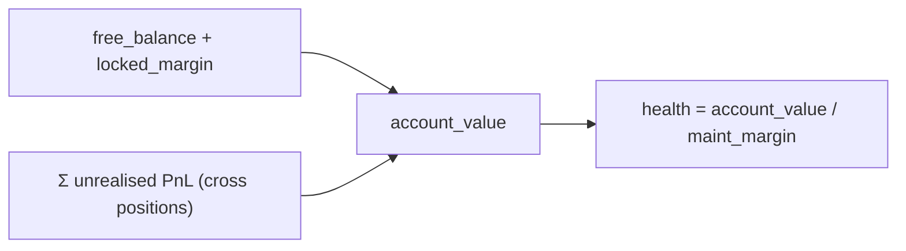
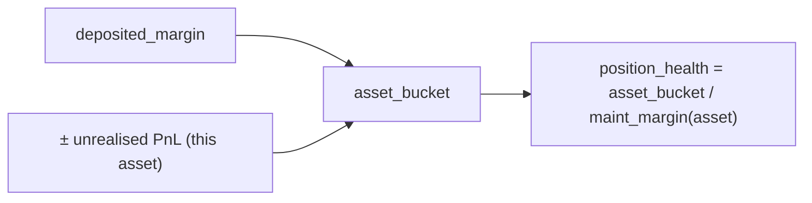
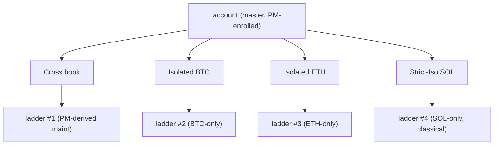
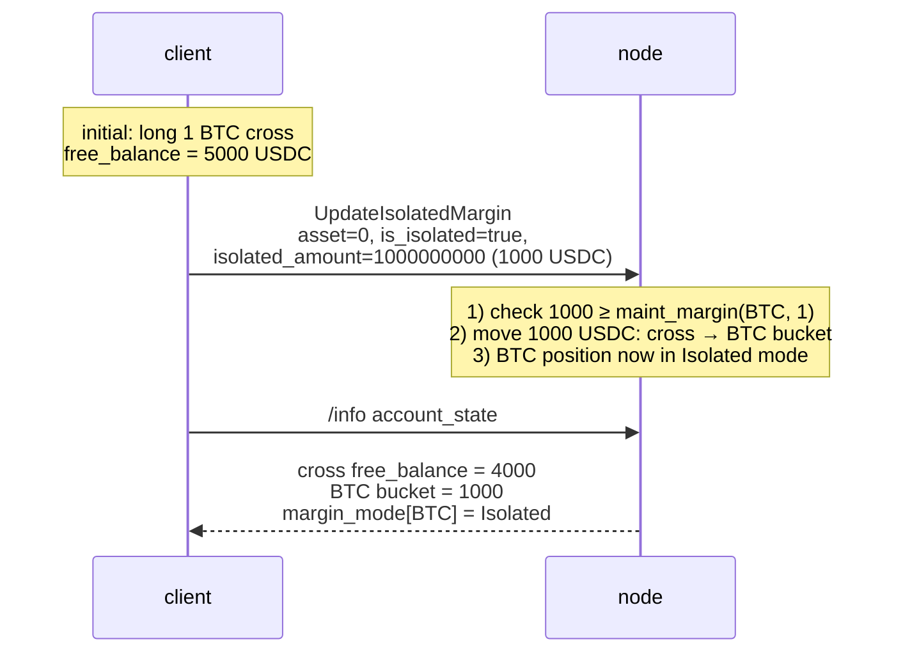

# Modes de marge

:::tip
**Stable.**
:::

## En résumé

Trois modes par actif : **Cross**, **Isolé**, **Strict-Iso**. Le mode Cross mutualise la garantie sur l'ensemble de vos positions ; le mode Isolé cloisonne la marge par actif ; le mode Strict-Iso exclut en outre cet actif de tout calcul de compensation de la [marge de portefeuille](./portfolio-margin.md).

## Comparaison

| Mode | Source de garantie | Les pertes peuvent épuiser | Éligible PM | Isolation à la liquidation |
|------|-------------------|----------------|-------------|----------------------|
| **Cross** | Solde libre, à l'échelle du compte | Les autres positions | Oui | Échelle au niveau du compte entier |
| **Isolé** | Compartiment pré-alloué par actif | Ce compartiment uniquement | Non | Échelle par actif ; perte maximale = compartiment |
| **Strict-Iso** | Compartiment pré-alloué par actif | Ce compartiment uniquement | Non (exclu même si le compte principal est inscrit en PM) | Échelle par actif |

En mode Cross, les positions bénéficiaires peuvent soutenir les positions moins saines — votre solde libre est fongible à l'échelle du compte. En mode Isolé, la perte totale d'un actif est contenue dans le compartiment de cet actif.

## Calcul de la marge

> Tous les montants sont exprimés sur le **plan `Decimal` en USDC entiers** (notionnel, garantie, marge), et non sur le plan du carnet d'ordres à 1e8 — voir [prix de référence : deux plans de prix](./mark-prices.md#two-price-planes-read-this-before-reading-any-number).

### Marge initiale (contrôle pré-ordre)

Un ordre ouvrant une nouvelle exposition doit déposer une marge initiale :

```
notional        = |px × size|                         # raw integer product, Decimal scale-0
effective_lev   = dynamic_risk_override.max_leverage   # if set, else position cap, else MAX_LEVERAGE_CAP (50)
required_init    = ceil( notional / effective_lev )    # rounded UP — conservative
free_collateral  = cross_account_value − Σ held_initial_margin
reject  iff  required_init > free_collateral            # InsufficientMargin
```

Ainsi `init_margin = notional / max_leverage` — le ratio classique `1 / max_leverage`. `effective_lev` vaut `max(1, …)` ; le plafond global est `MAX_LEVERAGE_CAP = 50`, avec un plafond absolu `UpdateLeverage` de **100×** et des paramètres de risque dynamiques par actif qui peuvent l'abaisser. L'arrondi est vers le **haut** (`Decimal::ceil`), si bien que tout reste resserre le contrôle. Les ordres `reduce_only` contournent ce contrôle (ils ne font que réduire l'exposition).

`held_initial_margin` cumule `ceil(|entry_notional| / effective_lev(asset))` pour chaque position **cross** ouverte (les positions isolées sont exclues — leur garantie est le compartiment déposé séparément).

### Marge de maintenance et santé du compte

```
health = account_value / maint_margin
```

- `account_value` = `cross_account_value` (solde libre ± PnL latent), signé `i128`.
- `maint_margin` = somme, sur chaque jambe de position détenue, de `|entry_notional| × maint_margin_ratio` (calculé en temps réel à partir des positions), **ou** la valeur PM lorsque la [marge de portefeuille](./portfolio-margin.md) est activée (`last_computed_pm_cents / 100`).

Le ratio de maintenance par actif correspond à la dérogation de risque dynamique du marché lorsqu'elle a été définie par la gouvernance, sinon au seuil de protocole de **300 bps = 3 %**. Le plancher de glissement de fermeture forcée dérivé est la moitié du ratio effectif (1,5 % pour un marché de référence), sauf dérogation explicite.

La maintenance est inférieure à l'exigence initiale (`notional / max_leverage`), de sorte qu'une position peut être ouverte puis descendre jusqu'au plancher de maintenance avant liquidation. Une santé < 1,0 déclenche l'[échelle de liquidation](./tiered-liquidation.md) aux niveaux de bande (1,1 / 1,0 / 0,8 / 0,667).

> L'arithmétique utilise `Decimal` / `i128` tout au long du calcul (sans virgule flottante) ; la décision de niveau effectue même un décalage binaire des deux opérandes d'une même quantité avant la division `Decimal` lorsque la valeur du compte dépasserait `Decimal::MAX`, préservant ainsi le ratio de santé sans affecter la décision de niveau.

## Cross — le mode par défaut



`maint_margin` est la somme des exigences de maintenance par position (ou la valeur PM si la [marge de portefeuille](./portfolio-margin.md) est activée).

Conséquence : un mouvement adverse de 10 % sur le BTC réduit la santé globale du compte, même si votre position ETH est saine. Vous pouvez soutenir la position BTC en clôturant la position ETH gagnante.

## Isolé

:::warning
**Écart d'implémentation.** Le modèle conceptuel ci-dessous correspond au **comportement cible**.
Le contrôle de marge pré-ordre implémente actuellement uniquement le **chemin Cross / garantie mutualisée** — le chemin de trading ouvre chaque position en mode cross. Le champ `margin_mode` de la position (0 = cross, 1 = isolé) est déjà lu pour *exclure* les positions isolées de la somme de marge détenue en cross, mais un contrôle pré-ordre dédié à la marge isolée (vérifiant la `isolated_margin` publiée par l'ordre par rapport à son notionnel) n'est pas encore connecté.
:::

Lorsque vous activez `is_isolated: true` pour un actif, le protocole transfère `isolated_amount` USDC du solde cross vers un compartiment par position. Le gain/la perte de cette position est réglé(e) uniquement dans le compartiment :



Si `position_health` tombe dans un niveau de liquidation, l'échelle **par position** se déclenche. Le reste du compte n'est pas affecté.

Vous pouvez déposer/retirer dans le compartiment pendant que la position est ouverte :

```json
// add 500 USDC to the isolated bucket on asset 0
{ "type":"UpdateIsolatedMargin", "params": {
  "asset": 0, "is_isolated": true, "isolated_amount": "500000000"
}}
```

`isolated_amount` peut être **positif** (transfert cross → compartiment) ou **négatif** (retrait compartiment → cross). Un retrait qui ferait passer la position à un niveau moins favorable est rejeté.

## Strict-Iso

Même cloisonnement que le mode Isolé, avec en plus une exclusion explicite des scénarios PM. Même si votre compte principal est inscrit en marge de portefeuille, une position Strict-Iso :

- ne contribue PAS au moteur de scénarios cross ;
- ne bénéficie PAS du crédit de compensation ;
- est marginée selon le modèle **classique** (seuil de référence par actif).

Utilisez le mode Strict-Iso pour :
- les actifs nouveaux ou peu liquides pour lesquels les hypothèses de corrélation du PM ne s'appliquent pas ;
- un budget spéculatif que vous souhaitez isoler de votre livre core couvert ;
- les cotations (MIP-3) dont le ratio de maintenance est conservateur jusqu'à ce que la liquidité se construise.

## Quand utiliser chaque mode

| Objectif | Mode |
|------|------|
| Maximiser l'efficacité du capital sur un livre cohérent | Cross (+ PM) |
| Gérer plusieurs stratégies non corrélées sous un même compte | Isolé par stratégie, OU sous-comptes |
| Contenir une position risquée pour protéger le reste | Isolé ou Strict-Iso |
| Couvrir entre actifs, bénéficier du crédit de compensation | Cross + PM |
| Trader une cotation de longue traîne avec un régime de volatilité inconnu | Strict-Iso |

Pour l'isolation multi-stratégie, les [sous-comptes](./sub-accounts.md) sont généralement plus adaptés que le mode Isolé — ils isolent l'ensemble du compte, y compris les clés d'agent et l'espace d'ordres, pas uniquement la marge.

## Transitions

Le changement de mode s'effectue via l'action [`update_isolated_margin`](../api/rest/exchange.md#update_isolated_margin) (le drapeau `is_isolated` — il n'existe pas d'action dédiée au mode de marge) et n'est autorisé que lorsque :

| De → Vers | Autorisé lorsque |
|-----------|--------------|
| Cross → Isolé | Vous spécifiez un `isolated_amount` couvrant au moins la marge de maintenance |
| Isolé → Cross | Le compartiment fusionne avec le solde cross ; autorisé à tout moment si le compte fusionné reste au niveau `Safe` |
| Isolé → Strict-Iso | Toujours (aucun mouvement de marge) |
| Strict-Iso → Isolé | Toujours |
| Strict-Iso/Isolé → Cross (sous un compte principal inscrit en PM) | La position doit s'inscrire dans le jeu de scénarios PM |

Changer de mode en cours de position **ne ferme pas et ne rouvre pas** la position — elle reste ouverte, seule la comptabilité de la marge change.

## Comportement à la liquidation

L'échelle de [liquidation par niveaux](./tiered-liquidation.md) s'applique indépendamment par périmètre :

- **Cross** : une seule échelle pour l'ensemble du compte
- **Isolé** : une échelle par actif isolé
- **Strict-Iso** : une échelle par actif strict-iso

Un T1 Cross clôture les positions du livre cross proportionnellement à leur contribution à la maintenance. Un T1 Isolé clôture uniquement la position isolée. Le filet de sécurité T3 et l'ADL T4 sont par périmètre — un éclatement d'une position isolée ne récupère pas sur les gains cross.



## Séquence — basculement cross → isolé



## Cas limites

<details>
<summary>Afficher les cas limites</summary>

- **Dépôt automatique lors d'un ajout de marge.** Les positions isolées couvrent le déficit de maintenance uniquement depuis le compartiment — une fois celui-ci épuisé, la position est liquidée. Le mode Cross ne couvre PAS automatiquement un compartiment Isolé ; vous devez manuellement effectuer un `UpdateIsolatedMargin` avec un `isolated_amount` positif pour le renflouer.
- **Clôture d'une position isolée.** La clôture totale de la position libère le compartiment vers le solde cross.
- **Mode d'un nouvel actif.** Les nouvelles positions sont en mode Cross par défaut, sauf si le drapeau `meta` de l'actif `onlyIsolated: true` force le mode Isolé (défini par marché au déploiement via [MIP-3](../mip/mip-3.md)).
- **Position isolée sous un compte principal PM.** Le crédit de compensation PM s'applique uniquement aux positions Cross. Les positions isolées sont calculées selon la méthode classique. Un compte principal inscrit en PM avec une grande position Isolée et un petit livre Cross ne bénéficie pratiquement d'aucun avantage PM.

</details>

## Voir aussi

- [Marge de portefeuille](./portfolio-margin.md) — calcul PM vs classique
- [Liquidation par niveaux](./tiered-liquidation.md) — échelles par périmètre
- [Sous-comptes](./sub-accounts.md) — isolation au niveau du compte entier
- [`update_isolated_margin`](../api/rest/exchange.md#update_isolated_margin) — le mode de marge correspond au drapeau `is_isolated` ; il n'existe pas d'action dédiée au mode de marge

## FAQ

<details>
<summary>Afficher la FAQ</summary>

**Q : Un actif peut-il avoir à la fois des compartiments Isolé et Strict-Iso ?**
R : Non. Le mode est par actif, valeur unique : `Cross | Isolated | StrictIso`.

**Q : Le changement de mode entraîne-t-il une transaction ?**
R : Aucun frais, aucune exécution. C'est une pure transition d'état.

**Q : Que se passe-t-il si je vide un compartiment isolé sous le seuil de maintenance ?**
R : L'échelle de liquidation de cet actif se déclenche. Le reste de votre compte n'est pas affecté.

**Q : La désolidarisation automatique (ADL) est-elle à l'échelle du compte ou par périmètre ?**
R : Par périmètre. L'ADL sur une position isolée ne récupère que sur les contreparties de *cet* actif, pas sur votre livre Cross ni sur vos autres positions isolées.

</details>
