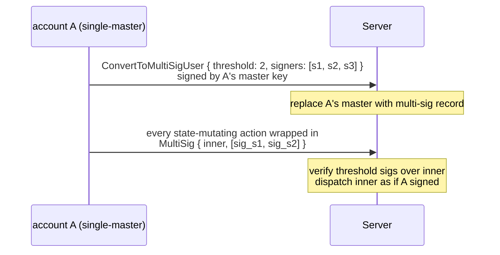
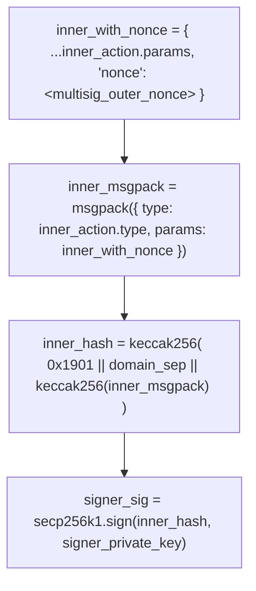

# Comptes multi-signatures

:::info
**Aperçu.**
:::

## En bref

Convertissez un compte ordinaire en multi-signature M-parmi-N : la clé maîtresse est remplacée par un ensemble de signataires, chaque action modifiant l'état doit recueillir `threshold` signatures de la part des `signers`, et la conversion est **irréversible**. Conçu pour la garde institutionnelle, les trésors DAO et les desks de trading à contrôle partagé.

## Pourquoi le multi-signature

Les comptes ordinaires ne disposent que d'une seule clé maîtresse. Sa perte entraîne une perte totale. Le multi-signature répartit le risque de garde entre les signataires :

- 2-parmi-3 : deux des trois signataires suffisent pour agir ; l'un peut être perdu sans bloquer le compte.
- 3-parmi-5 : 3 signatures requises ; jusqu'à 2 clés perdues sont tolérées ; jusqu'à 2 clés compromises ne peuvent pas déplacer de fonds.

Il s'agit du même mécanisme de base que celui qui sous-tend tout dispositif Gnosis Safe ou de garde institutionnelle en propre, implémenté nativement au niveau du protocole plutôt que via un contrat intelligent.

## Cycle de vie



## Conversion

```json
{
  "type": "ConvertToMultiSigUser",
  "params": {
    "threshold": 2,
    "signers": [ "0x...s1", "0x...s2", "0x...s3" ]
  }
}
```

Signé par la clé maîtresse **actuelle** (signature individuelle, la dernière qu'effectuera jamais ce compte seul).

| Contrainte | Valeur |
|------------|--------|
| `threshold` | `[1, len(signers)]` |
| `len(signers)` | `[2, 16]` |
| `signers[*]` | adresses distinctes |

Après validation :
- Le compte stocke `is_multisig: true` et `multisig_set: { threshold, signers }`.
- Les actions directes (non encapsulées) signées par quiconque (y compris l'ancienne clé maîtresse) sont rejetées avec `{"error":"account is multisig"}`.

**Irréversible** : il n'existe pas de `RevertFromMultiSig`. L'ensemble de signataires peut être **mis à jour** via un `UpdateMultiSig` encapsulé en multi-signature (voir ci-dessous), mais il n'est pas possible de revenir à une clé maîtresse unique.

## Agir en tant que compte multi-signature

Encapsulez chaque action dans `MultiSig` :

```json
{
  "sender":    "0x<multisig_addr>",
  "signature": "0x<any_signer_sig>",   ← outer envelope signed by any one signer
  "action": {
    "type": "MultiSig",
    "params": {
      "inner_action": {
        "type": "Order",
        "params": { ... }
      },
      "signatures": [
        { "signer": "0x...s1", "signature": "0x<sig over inner>" },
        { "signer": "0x...s2", "signature": "0x<sig over inner>" }
      ],
      "nonce": 1735689600099
    }
  }
}
```

Vérifications effectuées par le serveur :

1. La signature de l'enveloppe externe est attribuée à l'un des `signers` (n'importe laquelle des signatures individuelles de l'ensemble).
2. Chaque `signatures[*].signature` est attribuée à `signatures[*].signer`.
3. Les signataires récupérés font tous partie de `signers`, sont distincts et sont en nombre ≥ `threshold`.
4. Chaque signature interne porte sur le **msgpack canonique de `inner_action` accompagné du `nonce` de l'enveloppe externe**, encapsulé dans l'enveloppe EIP-712 identique à celle d'une action ordinaire.

En cas d'échec d'une vérification : `{"error":"multisig threshold not met"}`, `{"error":"multisig duplicate signer"}` ou `{"error":"signer not in set"}`.

Si toutes les vérifications réussissent, l'action interne est traitée comme si `sender` l'avait signée directement.

### Signer l'action interne

Chaque signataire calcule :



Le paquet d'enveloppe est ensuite constitué hors chaîne (un coordinateur rassemble les signatures) et soumis par n'importe quel signataire.

## Mise à jour de l'ensemble de signataires

```json
{
  "type": "UpdateMultiSig",
  "params": {
    "threshold": 3,
    "signers":   [ "0x...s1", "0x...s2", "0x...s4", "0x...s5", "0x...s6" ]
  }
}
```

Encapsulée dans `MultiSig`, cette action nécessite `threshold` signatures de l'ensemble **actuel**. Effective au bloc suivant ; à partir de ce moment, le nouvel ensemble est en vigueur.

Cas d'usage :
- Rotation de clés compromises
- Ajout ou suppression de signataires
- Modification du `threshold` (par exemple, passer de 2-parmi-3 à 3-parmi-5 à mesure que le desk se développe)

## Coordination hors chaîne

Le protocole ne gère pas le flux multi-signature — les signataires ont besoin d'un canal hors bande pour partager le message à signer et collecter les signatures. Schémas courants :

| Schéma | Mécanisme |
|--------|-----------|
| Service coordinateur interne | Le portefeuille de chaque signataire interroge une boîte de réception partagée ; sérialise l'action interne ; signe ; envoie la signature ; le coordinateur soumet une fois le seuil atteint |
| Canal privé partagé | Messagerie chiffrée en groupe ou e-mail ; chaque signataire colle sa signature ; un signataire agrège et soumet |
| SDK multi-signature (prévu) | Le SDK officiel intégrera un flux de collecte de signatures masquant la couche de coordination |

En attendant le SDK, les intégrateurs implémentent leur propre coordinateur. Le fonctionnement on-chain reste inchangé — seules les signatures comptent.

## Compatibilité avec les sous-comptes et les agents

| Question | Réponse |
|----------|---------|
| Un compte multi-signature peut-il avoir des sous-comptes ? | Oui. `CreateSubAccount` est lui-même une action encapsulée en multi-signature. Chaque sous-compte hérite de l'exigence de signature multi-sig. |
| Un compte multi-signature peut-il approuver des portefeuilles agents ? | Oui. `ApproveAgent` est encapsulé en multi-signature. Une fois approuvé, l'agent peut signer normalement **sans** collecte multi-signature supplémentaire — la seule signature de l'agent suffit pour les actions qu'il est autorisé à effectuer. C'est la configuration institutionnelle habituelle : le multi-sig détient l'autorité de retrait et la gestion des agents ; un agent gère le flux de trading quotidien. |
| Le compte multi-signature peut-il lui-même agir comme agent pour un autre compte ? | Oui — les comptes multi-signatures peuvent être approuvés comme agents. Les autres comptes qui les approuvent appellent `ApproveAgent { agent: <multisig_addr> }`. L'ensemble de signataires multi-sig signe alors selon les besoins. |

## Cas limites

<details>
<summary>Afficher les cas limites</summary>

- **Clés perdues** : M-parmi-N tolère jusqu'à `N - M` pertes. Planifiez la garde des clés de manière à répartir la surface de risque (différentes juridictions, différents HSM, différentes personnes).
- **Clé compromise** : M-parmi-N tolère jusqu'à `M - 1` compromissions avant que des fonds puissent être déplacés. Détectez-le tôt — configurez des alertes de surveillance du débit sur `userEvents` pour le compte multi-signature.
- **Collisions de nonce** : le nonce du multi-sig est par compte, monotone, identique au mode mono-signature. Deux processus de signature parallèles choisissant le même nonce : un seul est validé ; l'autre renvoie `{"error":"nonce_too_small"}`. Le coordinateur doit attribuer les nonces.
- **Expiration des signatures** : les signatures n'expirent pas d'elles-mêmes — une signature collectée aujourd'hui reste valide jusqu'à la soumission du paquet. Certains intégrateurs ajoutent leur propre TTL hors chaîne.

</details>

## Interrogation

```bash
curl -X POST https://devnet-gateway.mtf.exchange/info \
  -d '{"type":"user_to_multi_sig_signers","user":"0x<multisig>"}'
```

```json
{
  "type": "user_to_multi_sig_signers",
  "data": {
    "address":      "0x<multisig>",
    "is_multi_sig": true,
    "threshold":    2,
    "signers":      ["0x...", "0x...", "0x..."]
  }
}
```

`is_multi_sig` vaut `false` (et `signers` est vide) pour un compte ordinaire. L'ensemble de signataires et le seuil proviennent directement de la configuration `multi_sig_tracker` validée.

## Séquence — ordre multi-signature

```mermaid
sequenceDiagram
    participant S1 as signer s1
    participant S2 as signer s2
    participant C as coordinator
    participant Chain as chain
    Note over S1: T-1 prepares inner_action = Order{...}<br/>computes inner_hash; signs → sig_s1
    S1->>C: sends inner_action + sig_s1 to coordinator
    Note over S2: T-2 receives inner_action via coordinator<br/>verifies inner_hash; signs → sig_s2
    S2->>C: sends sig_s2 to coordinator
    Note over C: T-3 coordinator (any signer or service):<br/>assembles MultiSig{ inner_action, signatures: [sig_s1, sig_s2], nonce }<br/>wraps in outer envelope; signs outer with own key
    C->>Chain: POST /exchange
    Note over Chain: T-4 chain admits:<br/>verify outer sig<br/>verify both inner sigs ≥ threshold(2)<br/>dispatch Order → admit to mempool
    Chain-->>C: return 202
    Note over Chain: T+commit inner Order applied; orderEvents fires;<br/>multi-sig account now has the new resting order
```

## Voir aussi

- [`POST /exchange convert_to_multi_sig_user`](../api/rest/exchange.md#convert_to_multi_sig_user)
- [Sémantique de signature `/exchange`](../api/rest/exchange.md#signed-by-semantics) — enveloppe d'encapsulation multi-signature
- [Portefeuilles agents](./agent-wallets.md) — combiner le multi-signature avec la délégation d'agents
- [Sous-comptes](./sub-accounts.md) — les comptes multi-signatures peuvent avoir des sous-comptes

## FAQ

<details>
<summary>Afficher la FAQ</summary>

**Q : Peut-on faire du 1-parmi-N (signature « quelconque ») ?**
R : Oui — `threshold: 1`. Utile pour la redondance sans coordination. Fonctionnellement équivalent à N comptes distincts partageant l'autorité de retrait, mais moins coûteux on-chain.

**Q : Les signatures d'action interne sont-elles réutilisables pour différentes actions internes ?**
R : Non. Chaque signature porte sur une action interne et un nonce spécifiques. Tenter de réutiliser une signature sur une autre action interne renvoie `{"error":"multisig threshold not met"}`.

**Q : L'encapsulation multi-signature est-elle récursive ?**
R : Non. `MultiSig { inner_action: MultiSig { ... } }` est rejeté. Une seule couche est autorisée.

**Q : Peut-on encapsuler un `MultiSig` dans un `MultiSig` ? (Méta-question.)**
R : Comme ci-dessus — la récursion est bloquée. Pour agir en tant que multi-sig pour le compte d'un autre multi-sig, le compte externe approuve le multi-sig interne comme agent.

</details>
