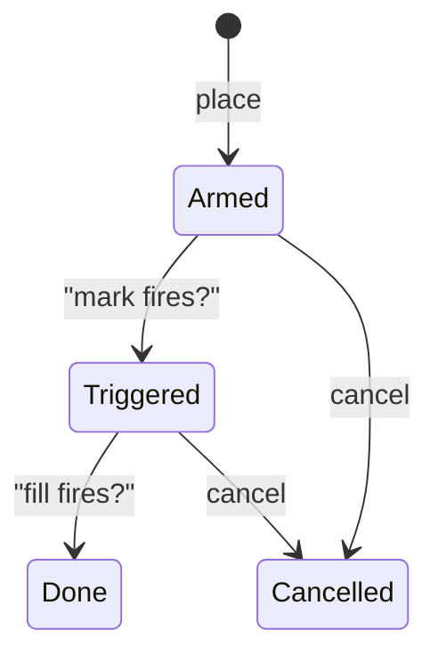
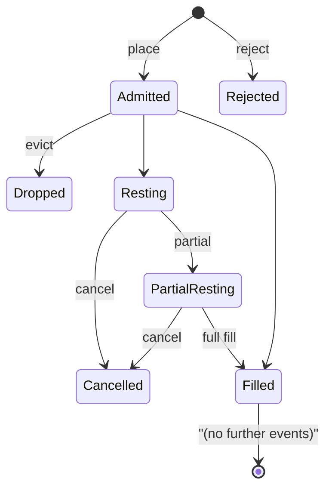

# Types d'ordres

:::tip
**Stable.**
:::

## En résumé

MetaFlux prend en charge une gamme complète de primitives d'ordres — limite, IOC, ALO, FOK, marché, stop-loss, take-profit, limites déclenchées, TWAP, échelonnés et reduce-only — ainsi que des modes de prévention des auto-transactions (STP) qui contrôlent l'appariement avec vos propres ordres. Chaque variante utilise la structure `POST /exchange { type: "Order", ... }` ; les flux spécialisés comme TWAP et Scale disposent de leurs propres variantes d'action.

## Durée de validité (TIF)

| TIF | Comportement | À utiliser quand |
|-----|-----------|----------|
| `Gtc` | Valable jusqu'à annulation. Reste dans le carnet jusqu'à exécution ou annulation. | Par défaut ; cotation passive au marché, inscription persistante |
| `Ioc` | Immédiat ou annulé. Exécute ce qui est disponible, annule le solde non rempli. | Prise de liquidité immédiate ; ne pas figurer dans le carnet |
| `Alo` | Add-limit-only (« post-only »). Si une partie quelconque croise le carnet, l'ordre entier est annulé. | Maker strict ; garantit de ne jamais payer de frais taker |
| `Fok` | Fill-or-kill. Soit l'intégralité de la quantité est exécutée immédiatement, soit tout est annulé. | Exécution atomique à un seul niveau de prix |

```
Buy 1 BTC @ 100.5 Gtc      →  rests on book, fills as ask reaches 100.5 or lower
Buy 1 BTC @ 100.5 Ioc      →  immediately matches asks ≤ 100.5; cancels rest
Buy 1 BTC @ 100.5 Alo      →  IF any ask ≤ 100.5  THEN reject  ELSE rest
Buy 1 BTC @ 100.5 Fok      →  IF total ≥ 1.0 @ ≤ 100.5  THEN fill  ELSE reject
```

## Reduce-only

`reduce_only: true` rejette l'ordre à l'admission s'il augmenterait la taille absolue de la position. Utile pour les sorties de protection — un stop-loss reduce-only ne peut pas accidentellement retourner votre position de long en short.

```
position: long 1 BTC
sell 0.5 reduce_only=true   →  ok (closes 0.5 of long)
sell 2.0 reduce_only=true   →  rejected: would flip to short 1
buy  0.5 reduce_only=true   →  rejected: would grow long to 1.5
```

Le reduce-only est évalué **au moment du commit**, et non à l'admission, lorsque la position est lue depuis le dernier état validé. Un remplissage concurrent qui ferme votre position entre l'admission et la distribution peut provoquer une erreur `reduce_only_violation_post_admit` au moment du commit (voir [erreurs](../api/errors.md#commit-time-errors-not-http-in-event-stream)).

## Prévention des auto-transactions (STP)

Si un nouvel ordre s'apprête à s'apparier avec un ordre existant du même `sender`, le STP s'active.

| Mode STP | Quand le nouvel ordre croise l'ancien | Quand les deux sont au même prix et restent en attente |
|----------|---------------------|-----------------------------|
| `None` | Transaction autorisée | Les deux restent en attente |
| `CancelNewest` | Le nouvel ordre est annulé | Le nouvel ordre est annulé |
| `CancelOldest` | L'ancien est annulé, le nouveau peut s'apparier ailleurs | L'ancien est annulé, le nouveau reste en attente |
| `CancelBoth` | Les deux sont annulés | Les deux sont annulés |
| `DecrementAndCancel` | Exécution pour `min(nouveau, ancien)` ; annulation du plus petit ; le plus grand conserve le solde restant | Identique — exécution puis annulation du plus petit |

Exemple pratique — `DecrementAndCancel` :

```
your resting bid:  buy 1 BTC @ 100.5  (oid 1)
you place sell:    sell 0.4 BTC @ 100.5  (oid 2)  with stp=DecrementAndCancel

result:
  - oid 1 is decremented to 0.6 BTC remaining
  - oid 2 is cancelled (smaller order)
  - no trade fires (no fee, no fill event)
  - your position is unchanged
```

Le STP est appliqué à l'étape d'appariement, ce qui le rend effectif quelle que soit la paire d'actifs, le prix ou le moment. Le STP ne considère que les ordres signés par le même `sender` — les ordres émanant d'agents sous le même compte maître sont pris en compte.

## Ordres déclenchés

Un **ordre déclenché** est une condition en attente qui, lorsqu'elle est satisfaite, envoie un ordre interne dans le carnet.

| Type de déclencheur | Se déclenche quand | Ordre interne |
|--------------|-----------|-------------|
| `StopLoss` | Le prix mark franchit `trigger_px` dans le sens « sûr » → « perte » | Marché ou limite ; reduce-only en général |
| `TakeProfit` | Le prix mark franchit `trigger_px` dans le sens « perte » → « profit » | Marché ou limite ; reduce-only en général |
| `StopLimit` | Idem que `StopLoss` | Limite uniquement |
| `TakeProfitLimit` | Idem que `TakeProfit` | Limite uniquement |

Pour une position longue :
- `StopLoss` se déclenche quand `mark ≤ trigger_px` (la baisse du prix coupe le long)
- `TakeProfit` se déclenche quand `mark ≥ trigger_px` (la hausse du prix prend le profit)

Pour une position courte, les inégalités s'inversent.

`limit_px` :
- `null` → émet un ordre de marché (`Ioc`) au déclenchement
- présent → émet un ordre limite à `limit_px`

Automate à états du déclencheur :



Les déclencheurs sont évalués à chaque mise à jour du prix mark (à chaque commit). Ils persistent à travers les blocs et les redémarrages.

## Regroupement

`Order { grouping: ... }` regroupe des ordres en famille.

| Regroupement | Signification |
|----------|---------|
| `Na` | Ordres indépendants |
| `NormalTpsl` | Deux ordres : une entrée + l'un des {StopLoss, TakeProfit}. L'exécution de l'un annule l'autre (OCO). |
| `PositionTpsl` | Deux ordres déclenchés attachés à la **position**, et non à l'ordre d'entrée. Ils survivent aux modifications de position (ex. : moyennage à la baisse) et ne s'annulent qu'à la clôture de la position. |

Utilisez `PositionTpsl` pour « vouloir toujours un stop sur ma position nette » — les mêmes TPSL restent armés lorsque vous ajoutez ou réduisez votre position.

## Ordres échelonnés (Scale)

`ScaleOrder` place un échelon d'ordres limites.

```json
{
  "type": "ScaleOrder",
  "params": {
    "asset": 0, "side": "Buy",
    "total_size": "1000000000",
    "start_price": "9900000000",
    "end_price":   "9800000000",
    "n_levels": 10,
    "shape": "Flat"
  }
}
```

Formes :

| Forme | Répartition de la taille entre les paliers |
|-------|------------------------------|
| `Flat` | Égale par palier |
| `Linear` | Rampe linéaire d'un bout à l'autre |
| `Geometric` | Rampe géométrique (plus petite près du spread, plus grande en s'éloignant) |

Chaque palier reçoit un `cloid` attribué automatiquement, dérivé de `cloid_prefix + leg_index`. Annulez l'échelon entier en annulant chaque palier, ou utilisez [`cancel_by_cloid`](../api/rest/exchange.md#cancel_by_cloid) avec le développement du préfixe.

## TWAP

`TwapOrder` programme des tranches sur `duration_ms`.

```
duration = 1 hour = 3,600,000 ms
slices   = duration / SLICE_INTERVAL  (default 60s slice; 60 slices per hour)
sz_per_slice = size / slices

slice  1: send IOC near mid at t = randomize(0, SLICE_INTERVAL * (1 + jitter%))
slice  2: send IOC at t = slice_1_t + SLICE_INTERVAL * (1 + jitter%)
...
slice 60: send last IOC just before t = duration
```

`randomize_pct` ∈ `[0, 50]` décale les horaires des tranches de ±`randomize_pct/100 × slice_interval`. Une valeur élevée rend l'ordre plus difficile à détecter ; une valeur basse offre un contrôle temporel plus précis.

Les tranches sont soumises par le protocole ; aucune action n'est requise du côté client après la soumission du `TwapOrder`. Les événements de tranche transitent par le [canal WS `userEvents`](../api/ws/subscriptions.md#userevents) (un flux dédié `twap*` est prévu dans la feuille de route).

Le TWAP peut être annulé en cours d'exécution via `TwapCancel` ; les tranches déjà exécutées restent remplies, les tranches futures sont stoppées.

## Ordres de marché

Il n'existe pas d'action « marché » distincte — un « ordre de marché » est un ordre limite `Ioc` à un prix extrême (`MAX_PRICE` pour les achats, `0` pour les ventes). Les SDK s'en chargent automatiquement lorsque vous appelez `marketBuy(...)`. Le carnet s'exécute sur toute la liquidité disponible ; le solde non croisé est annulé.

Remarque : TOUS les ordres de marché sont soumis à la **bande du prix mark** — si la meilleure demande dépasse le prix mark de 5 %, votre achat de marché exécutera la liquidité disponible jusqu'à `mark × (1 + band_pct)` et annulera le solde. Voir [prix mark](./mark-prices.md).

## Automate à états du cycle de vie d'un ordre



Chaque transition d'état émet un événement correspondant sur [`userEvents`](../api/ws/subscriptions.md#userevents) (les événements de cycle de vie des ordres transitent par ce canal).

## Cas limites

<details>
<summary>Afficher les cas limites</summary>

- **Course entre reduce-only et exécution.** Un stop est reduce-only ; une exécution clôture la position ; le stop se déclenche ; la vérification au moment du commit échoue avec `reduce_only_violation_post_admit`. Solution : branchez les événements `userFills` dans votre bot pour annuler les TPSL à la clôture complète.
- **STP à l'admission vs à l'appariement.** Le STP n'est appliqué qu'à l'étape d'appariement. Deux ordres de sens opposés qui ne se croisent pas resteront tous deux en attente. Le STP ne se déclenche que lorsqu'ils s'apprêtent à s'exécuter.
- **TWAP en période de forte volatilité.** Chaque tranche est un IOC proche du mid — si la liquidité se tarit entre les tranches, elles peuvent revenir entièrement non exécutées. Surveillez les événements de tranche.
- **ALO + carnet croisé.** Un ALO qui croiserait *n'importe quel* niveau est rejeté en totalité, pas partiellement. Pour entrer dans le carnet à un prix serré, utilisez un ordre limite non croisé un tick moins favorable que le meilleur prix opposé.
- **Déclencheur et TIF.** Un `StopLoss` avec `limit_px` défini repose comme un ordre limite Gtc au déclenchement. Ajoutez manuellement une dispersion de type TWAP si vous souhaitez une sortie échelonnée.

</details>

## Exemples — TypeScript

```typescript
// limit buy, GTC, post-only
await client.order({
  asset: 0, side: 'Buy', priceE8: '10050000000', sizeE8: '100000000',
  tif: 'Alo', reduceOnly: false, stpMode: 'CancelNewest'
});

// stop-loss attached to a long position
await client.trigger({
  asset: 0, side: 'Sell', sizeE8: '100000000',
  triggerPxE8: '9500000000', limitPxE8: null,
  triggerKind: 'StopLoss', reduceOnly: true
});

// 1-hour TWAP buy
await client.twap({
  asset: 0, side: 'Buy', sizeE8: '1000000000',
  durationMs: 3_600_000, randomizePct: 20, reduceOnly: false
});

// 10-level scale buy
await client.scale({
  asset: 0, side: 'Buy',
  totalSizeE8: '1000000000',
  startPriceE8: '9900000000',
  endPriceE8: '9800000000',
  nLevels: 10, shape: 'Linear'
});
```

## Voir aussi

- [`POST /exchange`](../api/rest/exchange.md) — schémas complets par variante
- [Modes de marge](./margin-modes.md)
- [Prix mark](./mark-prices.md) — comment les déclencheurs s'activent
- [Liquidation par paliers](./tiered-liquidation.md) — comment les positions sont gérées sous stress

## FAQ

<details>
<summary>Afficher la FAQ</summary>

**Q : Un ordre ALO paie-t-il jamais des frais taker ?**
R : Jamais. S'il devait croiser, l'ordre entier est rejeté à l'admission — aucun taker partiel.

**Q : Une seule action `Order` peut-elle mélanger des TIF ?**
R : Oui. `orders: []` est hétérogène ; chaque entrée possède son propre `tif`.

**Q : Comment le moteur d'appariement départage-t-il les ordres au même prix ?**
R : Strict FIFO — le `oid` le plus ancien l'emporte. Les ordres ALO prennent de l'avance en étant inscrits en premier dans le carnet ; c'est leur avantage naturel en termes de remise de frais.

**Q : Les tranches TWAP comptent-elles contre ma limite de débit ?**
R : Non — elles sont soumises en interne par le protocole, pas par votre client. La soumission du `TwapOrder` représente une seule charge de limite de débit.

</details>
