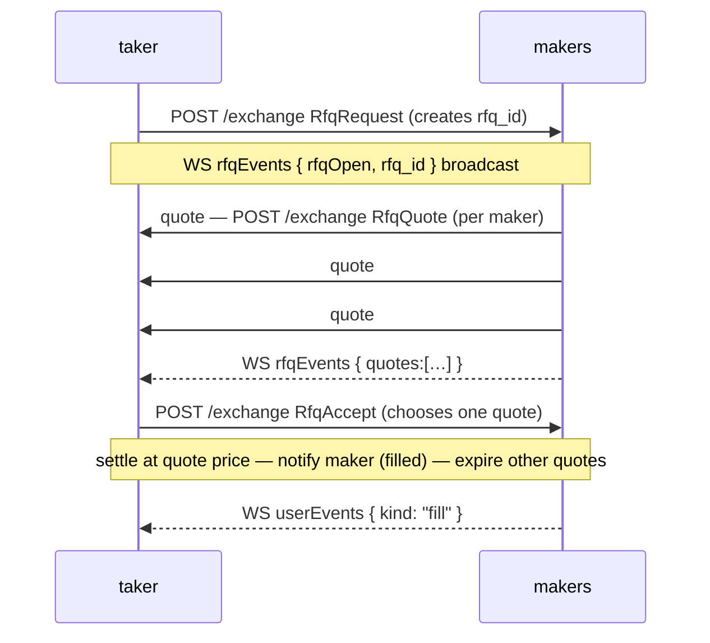
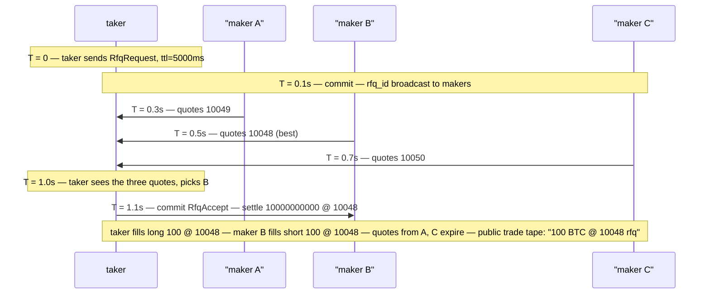

# Demande de cotation (RFQ)

:::info
**Aperçu.**
:::

## En bref

Le RFQ permet à un preneur d'adresser une demande de cotation privée sur une taille précise à un ensemble de teneurs de marché enregistrés, d'accepter la meilleure offre et de régler à ce prix — sans exposer la taille sur le carnet public au préalable. Particulièrement utile pour des tailles susceptibles de déplacer le carnet visible.

## Pourquoi le RFQ

L'exécution sur le CLOB public révèle l'intention. Un ordre de 5 M$ sur un actif peu liquide signale tout avant que le premier remplissage ne s'exécute. Le RFQ inverse le modèle :

- Le **preneur** publie un RFQ pour un actif, un sens, une taille et éventuellement un prix de référence.
- Les **teneurs** (enregistrés + ayant opté pour l'actif) répondent avec des cotations dans un délai imparti (typiquement 1 à 5 secondes).
- Le **preneur** accepte la meilleure cotation → règlement atomique à ce prix ; les autres cotations expirent.

Les cotations ne sont visibles que par le preneur (elles ne figurent pas dans le carnet public). Les autres participants voient la transaction ex-post dans le [flux WS `trades`](../api/ws/subscriptions.md#trades), accompagnée d'un tag `kind: "rfq"`.

## Cycle de vie



## Flux d'actions

### Preneur — demander un RFQ

`RfqRequest` (variante d'action ; reprend la structure de [`submit_order`](../api/rest/exchange.md#submit_order)) :

```json
{
  "type": "RfqRequest",
  "params": {
    "asset":          0,
    "side":           "Buy",
    "size":        "10000000000",
    "reference_px":"10050000000",
    "max_slippage_bps": 50,
    "ttl_ms":         5000
  }
}
```

| Champ | Signification |
|-------|---------------|
| `reference_px` | Le prix indicatif du preneur (souvent le mark public) ; utilisé par les teneurs comme ancrage pour leurs cotations |
| `max_slippage_bps` | Écart de prix maximal autorisé par rapport à la référence ; les cotations hors limite sont rejetées |
| `ttl_ms` | Durée pendant laquelle le RFQ reste ouvert avant expiration automatique |

Réponse :

```json
{ "accepted": true, "rfq_id": "0x<16 bytes>" }
```

Le RFQ est diffusé aux teneurs ayant opté via le [canal WS `userEvents`](../api/ws/subscriptions.md#userevents) (un flux d'événements `rfq*` dédié est prévu dans la feuille de route).

### Teneur — soumettre une cotation

`RfqQuote` :

```json
{
  "type": "RfqQuote",
  "params": {
    "rfq_id":       "0x<...>",
    "px":     "10049000000",
    "size":      "10000000000",
    "expires_at_ms":1735690000000
  }
}
```

Un teneur peut soumettre plusieurs cotations (par exemple, des remplissages partiels à des prix différents) pendant la durée de vie du RFQ. Chaque `RfqQuote` est une action distincte et reçoit son propre `quote_id`.

### Preneur — accepter

`RfqAccept` :

```json
{
  "type": "RfqAccept",
  "params": { "rfq_id": "0x<...>", "quote_id": "0x<...>" }
}
```

Le règlement est atomique dans le bloc suivant :
- La position du preneur augmente de `size` au prix `px`.
- La position du teneur augmente de `size` dans le sens opposé au même prix.
- Les autres cotations pour ce `rfq_id` expirent.
- Structure de frais : mêmes paliers teneur/preneur que pour un remplissage sur le carnet public ([frais](./fees.md)).

### Expiration automatique

Lorsque `ttl_ms` s'écoule sans acceptation :

```json
{ "kind": "rfqExpired", "rfq_id": "0x<...>" }
```

Aucun frais n'est prélevé ; toutes les cotations soumises sont rejetées.

## Enregistrement des teneurs

Pour être éligible à la cotation sur un actif, un teneur s'enregistre via `RfqRegister` :

```json
{
  "type": "RfqRegister",
  "params": { "asset": 0, "active": true, "min_size": "1000000000" }
}
```

`min_size` permet aux teneurs d'ignorer les petits RFQ pour lesquels ils ne souhaitent pas être sollicités. Pour se désinscrire, utiliser `active: false`.

Les teneurs enregistrés reçoivent les diffusions RFQ sur `rfqEvents`. Ils ne sont PAS tenus de coter — la participation est optionnelle pour chaque RFQ.

## Sémantique du règlement

| Propriété | Remplissage RFQ |
|-----------|-----------------|
| Prix | Le `px` de la cotation, indépendamment du carnet public |
| Contrepartie | Un seul teneur (le signataire de la cotation sélectionnée) |
| Impact sur le carnet | Aucun — la transaction ne matche pas contre des ordres au repos |
| Visibilité publique | Le flux de transactions affiche le remplissage ex-post, avec le tag `rfq` |
| Frais | Paliers teneur/preneur standard selon le barème en vigueur |
| Marge | Identique à un remplissage ordinaire (`init_margin` débitée des deux côtés) |
| Liquidation | Identique — la position devient une position ordinaire après le règlement |

## Ce que le RFQ ne fait pas

- **Ne contourne pas la marge.** Le preneur doit disposer de la marge nécessaire pour la position ; une insuffisance de marge renvoie un `422` standard.
- **Ne masque pas ex-post.** La transaction est publiée dans le flux public après le règlement, avec le tag `rfq`.
- **N'est pas une enchère hollandaise.** Les cotations ne se dégradent pas dans le temps ; les teneurs soumettent des cotations à prix fixe ; le preneur en choisit une.
- **Ne permet pas de remplissage multi-teneur.** Une seule acceptation de RFQ matche intégralement la cotation d'un seul teneur. Pour répartir entre plusieurs teneurs, il faut lancer plusieurs RFQ.

## Interroger les RFQ ouverts

L'état du moteur RFQ est exposé sur le chemin de lecture `/info` du nœud via deux types de requête — voir [`rfq_open`](../api/rest/info.md#rfq_open) et [`rfq_user`](../api/rest/info.md#rfq_user) pour les structures de réponse complètes et les tableaux de champs. Les champs `size` / `price` / `max_size` / `limit_px` sont des chaînes entières en **virgule fixe 1e8** (plan carnet / ordres).

`rfq_open` ne prend **aucun paramètre** et retourne tous les RFQ ouverts avec leurs cotations de teneurs associées :

```bash
curl -X POST https://devnet-gateway.mtf.exchange/info \
  -H 'content-type: application/json' \
  -d '{"type":"rfq_open"}'
```

Pour les RFQ auxquels un compte spécifique est partie, `rfq_user` prend un `account_id` (u64) ou une `address` (hex 0x) et divise le résultat en `requested` (RFQ ouverts par le compte) et `quoted` (RFQ sur lesquels il a coté) :

```bash
curl -X POST https://devnet-gateway.mtf.exchange/info \
  -H 'content-type: application/json' \
  -d '{"type":"rfq_user","address":"0x..."}'
```

Un compte sans activité renvoie un 200 avec les deux listes vides.

## Cas limites

<details>
<summary>Afficher les cas limites</summary>

- **Plusieurs cotations du même teneur.** Autorisé ; le preneur choisit la meilleure.
- **Cotation d'un teneur reçue après l'acceptation du preneur.** La cotation est silencieusement ignorée ; aucune erreur.
- **Expiration du RFQ pendant la signature de l'acceptation par le preneur.** L'acceptation retourne `{"error":"rfq expired"}`. Recommencer avec un nouveau `RfqRequest`.
- **Compte du preneur inéligible au moment de l'acceptation.** Si le compte du preneur passe en T1+ entre la demande et l'acceptation, l'acceptation est rejetée. Le teneur conserve le droit de coter sur de futurs RFQ.
- **Marge insuffisante du teneur au moment de l'acceptation.** Acceptation rejetée avec `{"error":"maker margin"}`. Le preneur peut tenter une autre cotation du même RFQ.

</details>

## Séquence — RFQ accepté



## Voir aussi

- [Types d'ordres](./order-types.md) — alternatives sur le carnet public
- [Catalogue d'actions `/exchange`](../api/rest/exchange.md#action-catalog) — `RfqQuote` / `RfqAccept` (stubs actuellement reconnus mais non mappés)
- [WS `userEvents`](../api/ws/subscriptions.md#userevents) — les événements RFQ transitent par ce canal
- [Frais](./fees.md) — les remplissages RFQ sont soumis aux paliers standard

## FAQ

<details>
<summary>Afficher la FAQ</summary>

**Q : Pourquoi ne pas simplement placer un ordre caché sur le carnet ?**
R : Les ordres cachés révèlent quand même l'intention à travers les remplissages. Le RFQ ne publie rien — la taille reste invisible jusqu'au règlement.

**Q : Les cotations RFQ peuvent-elles être annulées ?**
R : Oui — `RfqCancelQuote { quote_id }`. Utile lorsque le risque du teneur évolue en cours de RFQ.

**Q : Existe-t-il un algorithme de matching propre aux remplissages RFQ dont il faut tenir compte ?**
R : Non — dès que le preneur accepte, le règlement est direct entre le preneur et le teneur sélectionné. Le moteur CLOB n'est pas impliqué.

**Q : Un marché peu liquide au niveau du CLOB peut-il disposer d'un marché RFQ ?**
R : Oui — les teneurs enregistrés peuvent coter sur n'importe quel marché, quelle que soit la profondeur du carnet. Le RFQ est particulièrement adapté aux actifs peu liquides ou de longue traîne, pour lesquels le carnet public ne peut pas absorber des volumes importants.

</details>
