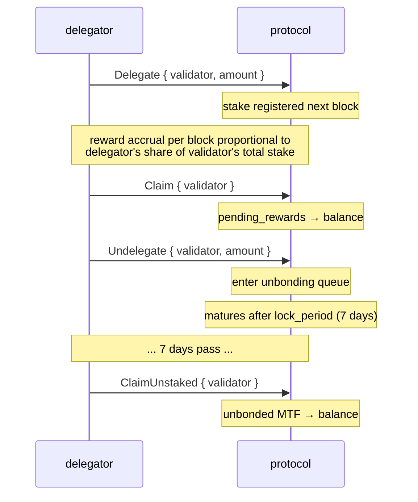
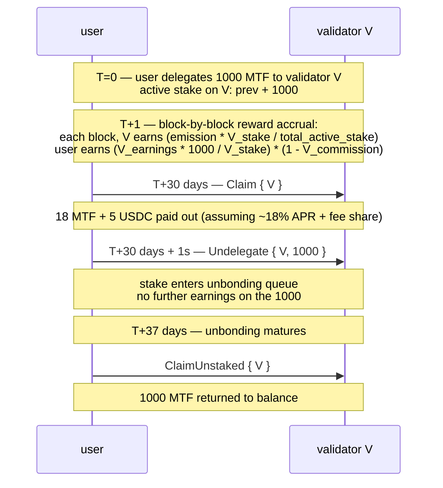

# Staking

:::info
**Actif sur le devnet.** La délégation, la révocation de délégation, la réclamation des récompenses et l'enregistrement des validateurs sont actifs et vérifiés de bout en bout sur le consensus du devnet à 4 nœuds.
:::

## En bref

Détenez des MTF, déléguez à un validateur, percevez les émissions du protocole ainsi qu'une part des revenus de frais. Le stake est liquide jusqu'au `lock_period` ; le retrait du stake prend `7 days` pour être entièrement libéré. Le slashing s'applique aux validateurs qui se comportent mal ; les délégateurs subissent une exposition partielle au slash.

## Acteurs

| Rôle | Description |
|------|-------------|
| **Validateur** | Exploite un nœud de consensus, propose des blocs, vote. Doit se lier soi-même au-dessus du `min_self_bond` (100 000 MTF par défaut). |
| **Délégateur** | Détient des MTF, choisit un validateur, perçoit des récompenses déduction faite de la commission du validateur. |
| **Protocole** | Émet des récompenses par bloc ; les distribue proportionnellement au stake. |

## Flux de staking



## Actions

### `Delegate`

```json
{
  "type": "Delegate",
  "params": { "validator": "0x<val_addr>", "amount": "10000000000" }
}
```

Transfère des MTF depuis le solde vers le pool de délégation du validateur. Effectif au bloc suivant. Les récompenses s'accumulent dès lors.

### `Undelegate`

```json
{
  "type": "Undelegate",
  "params": { "validator": "0x<val_addr>", "amount": "10000000000" }
}
```

Retire du stake actif ; entre dans la file d'attente de déblocage. N'accumule pas de récompenses pendant le déblocage. Arrive à maturité à `now + lock_period_ms`.

### `Redelegate`

```json
{
  "type": "Redelegate",
  "params": { "from": "0x<val1>", "to": "0x<val2>", "amount": "10000000000" }
}
```

Déplace le stake entre validateurs **sans** entrer dans la file d'attente de déblocage. Limité à une redélégation par paire `(from, to)` dans une fenêtre de 24 h (protection anti-oscillation).

### `Claim`

```json
{
  "type": "Claim",
  "params": { "validator": "0x<val_addr>" }
}
```

Transfère les récompenses accumulées depuis `pending_rewards` vers le solde MTF du délégateur. Sans effet si le solde en attente est nul.

La réclamation automatique **n'est pas** automatique — réclamez selon une périodicité (quotidienne / hebdomadaire) ou avant de modifier votre délégation.

### `ClaimUnstaked`

```json
{
  "type": "ClaimUnstaked",
  "params": { "validator": "0x<val_addr>" }
}
```

Transfère les délégations arrivées à maturité (dont la période de blocage est écoulée) vers le solde MTF. Idempotent.

## Sources de récompenses

| Source | Périodicité | Part |
|--------|-------------|------|
| Émission du protocole | Par bloc | `emission_per_block × stake_share × (1 - validator_commission)` |
| Revenus de frais (trésorerie → stakers) | Par époque | `treasury_inflow × staker_share × stake_share × (1 - commission)` |

`emission_per_block` : défini par la gouvernance ; valeur actuelle dans la requête `staking_state`.
`staker_share` de la trésorerie : définie par la gouvernance, par défaut `50%`.
`validator_commission` : par validateur, plafonnée à `20%` par la gouvernance.

Les récompenses sont calculées en MTF (émissions) et en USDC (revenus de frais) — la réclamation retourne les deux. `staking_state` indique le montant en attente dans chaque devise.

## Période de blocage

Par défaut : **7 jours** pour le retrait du stake. Modifiable par la gouvernance par pool de stake.

| État | Durée | Accumule des récompenses ? | Soumis au slash ? |
|------|-------|:--------------------------:|:-----------------:|
| Actif (délégué) | indéfinie | oui | oui |
| En déblocage | `lock_period_ms` | non | oui (jusqu'à maturité) |
| Débloqué (en attente de réclamation) | jusqu'à réclamation | non | non |

L'exposition au slash pendant le déblocage est le piège à éviter — un validateur qui subit un slash en cours de déblocage entraîne également les délégateurs en cours de déblocage, même s'ils ont signalé leur sortie.

## Slashing

Les validateurs sont slashés pour :

| Infraction | Slash | Conséquence pour le délégateur |
|------------|-------|--------------------------------|
| Double signature (deux blocs contradictoires signés à la même hauteur) | 5 % du stake + emprisonnement | 5 % de la délégation perdu au prorata |
| Temps d'arrêt (absence de `downtime_blocks` slots de proposant consécutifs) | 0,1 % du stake + emprisonnement | 0,1 % perdu au prorata |
| Vote sur un fork invalide | 5 % + retrait permanent | 5 % au prorata |

Les délégateurs slashés voient leur `delegation.amount` réduit au bloc du slash. Sans préavis — le slashing est déterminé par le consensus.

Mesures d'atténuation :
- Choisir des validateurs bien opérés (historique de disponibilité, stabilité de la commission).
- Diversifier entre plusieurs validateurs (un slash sur un validateur unique n'affecte que cette portion).
- Éviter les validateurs proches du `min_self_bond` (plus susceptibles de sortir de manière non maîtrisée).

## Sélection du validateur

```bash
curl -X POST https://devnet-gateway.mtf.exchange/info -d '{"type":"validator_summaries"}'
```

Retourne l'ensemble de validateurs actifs (`{epoch, total_stake, n_active, validators[]}`);
chaque entrée contient :

```json
{
  "validator":          "0x<val>",
  "signer":             "0x<signer>",
  "validator_index":    3,
  "stake":              "10000000000000",
  "self_stake":         "100000000000",
  "commission_bps":     500,
  "is_active":          true,
  "is_jailed":          false,
  "first_active_epoch": 12
}
```

Critères de sélection :
- **Commission** (`commission_bps`) : plus basse → APR net plus élevé. Attention néanmoins aux hausses de plafond dissimulées.
- **Auto-stake** (`self_stake`) : plus élevé → l'opérateur a des intérêts en jeu.
- **Statut d'emprisonnement** (`is_jailed`) : un validateur actuellement emprisonné ne génère aucune récompense tant qu'il n'est pas libéré.
- **Actif** (`is_active`) : seuls les validateurs avec `is_active: true` font partie du jeu de signature en production.

## Estimation de l'APR

Le type de requête `/info` [`staking_apr`](../api/rest/info.md#staking_apr) est **en temps réel** —
il retourne l'APR d'émission effectif réellement appliqué par l'effet de récompense begin-block,
ainsi que ses entrées validées :

```bash
curl -X POST https://devnet-gateway.mtf.exchange/info -d '{"type":"staking_apr"}'
```

```json
{
  "type": "staking_apr",
  "data": {
    "total_stake":             "1000000",
    "effective_apr":           "0.08",
    "effective_apr_bps":       "800",
    "governance_rate_bps":     800,
    "emission_floor_stake":    "50000000",
    "n_active_validators":     1,
    "current_epoch":           2,
    "is_gross_pre_commission": true
  }
}
```

`effective_apr` est dérivé de la **courbe de stake**, et non du taux de gouvernance :

```text
effective_apr = 0.08 × √( 50M / max(total_stake, 50M) )
```

Soit un taux fixe de **8%** à ou en-dessous de 50 M MTF stakés, décroissant ∝ 1/√stake au-delà (plus de stake = part par staker plus faible). `governance_rate_bps` est validé mais **NON** consommé par l'effet de récompense — les deux sont exposés afin que l'écart soit observable. L'APR est **brut**, avant commission par validateur (`is_gross_pre_commission: true`).

APR net pour un délégateur :

```
net_apr  =  effective_apr  ×  (1 - validator_commission_bps/10_000)
```

## Cas limites

<details>
<summary>Afficher les cas limites</summary>

- **Le validateur quitte pendant votre déblocage.** Votre stake en déblocage est transféré au validateur suivant en file d'attente au bloc du slash. Vous pouvez redéléguer après la sortie si vous préférez un autre validateur ; le blocage se poursuit contre le nouveau validateur.
- **Renouvellement du jeu actif.** Si le validateur sort du jeu actif (ses délégations passent sous le seuil), votre stake ne génère aucune récompense pendant son absence. Vous pouvez redéléguer vers un validateur actif.
- **Minimum d'auto-bond.** Un validateur dont l'auto-bond tombe sous `min_self_bond` (via des slashes ou des retraits) est emprisonné ; les délégateurs ne perçoivent aucune récompense pendant l'emprisonnement.

</details>

## Séquence — cycle complet



## Voir aussi

- [`POST /exchange Delegate / Undelegate / Claim`](../api/rest/exchange.md) (variantes d'action supportées sur le devnet)
- [`POST /info staking_state`](../api/rest/info.md#staking_state)
- [`POST /info staking_apr`](../api/rest/info.md#staking_apr) — APR d'émission effectif + entrées validées
- [`POST /info protocol_metrics`](../api/rest/info.md#protocol_metrics) — agrégats de staking à l'échelle du protocole (`staking.*`)
- [Frais](./fees.md) — les revenus de frais constituent l'une des sources de récompenses de staking

## FAQ

<details>
<summary>Afficher la FAQ</summary>

**Q : Puis-je staker et trader simultanément ?**
R : Oui — les MTF stakés et les soldes de trading USDC sont des sous-soldes distincts du même compte.

**Q : Ai-je besoin d'un portefeuille agent pour staker ?**
R : Non — mais vous pouvez en utiliser un. Les portefeuilles agents peuvent appeler `Delegate` / `Undelegate` / `Claim` (aucune autorité de retrait n'est requise pour les modifications de staking).

**Q : Puis-je annuler un déblocage ?**
R : Non — une fois soumis, vous attendez la durée complète du `lock_period`. Utilisez plutôt la redélégation si vous aviez anticipé avoir besoin du stake ailleurs.

**Q : D'où proviennent les tokens MTF au lancement ?**
R : Allocations de genèse + émission par bloc. Consultez la [documentation sur la tokenomique] (à venir) pour la distribution. Le protocole n'effectue pas d'airdrop arbitraire — les émissions sont la seule source continue.

</details>
