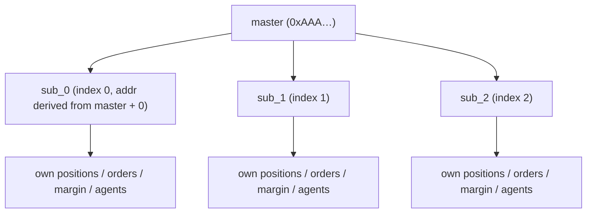
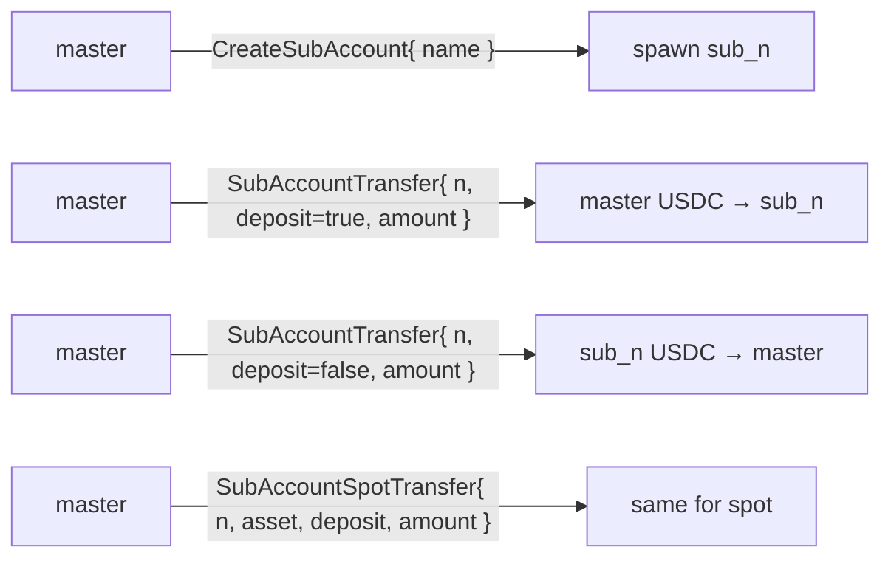
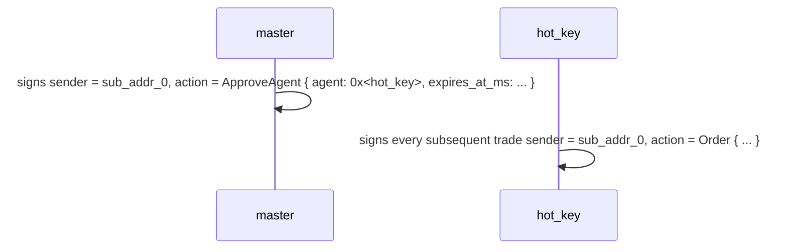
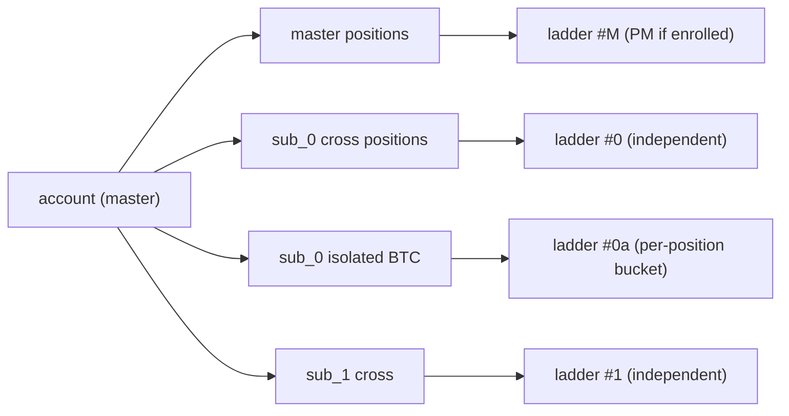
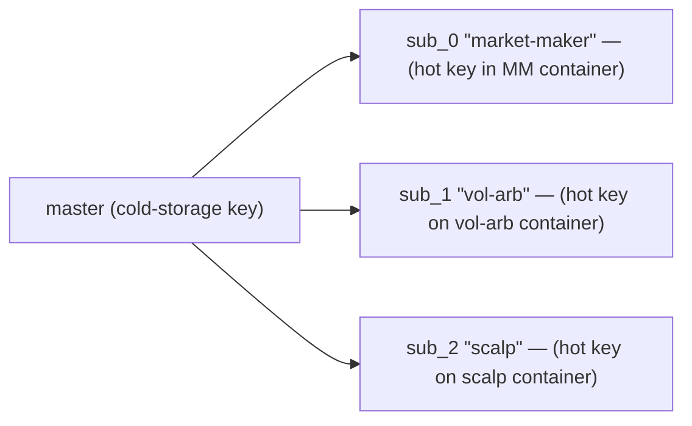
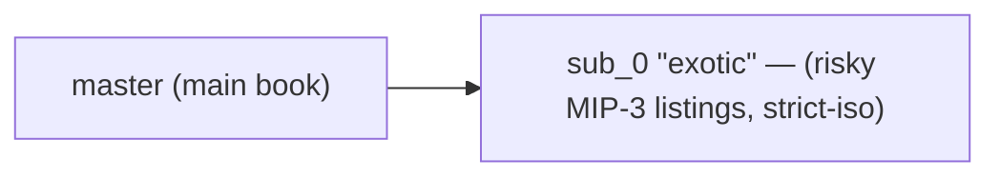
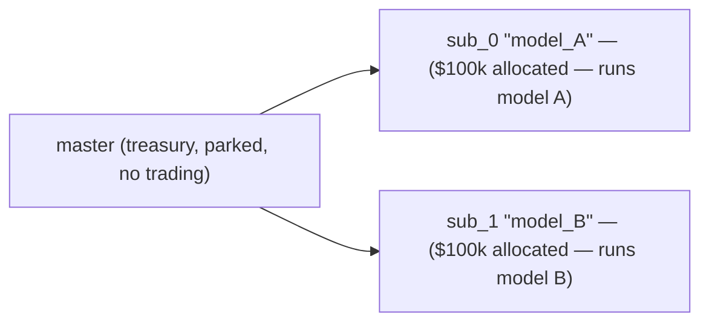
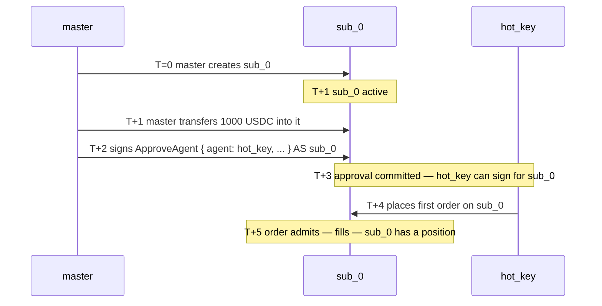

# Sous-comptes

:::info
**Aperçu.** L'API visible par l'utilisateur est stable ; le schéma de dérivation d'adresse est finalisé avant le lancement sur le réseau principal.
:::

## En bref

Un sous-compte est une adresse dérivée rattachée à un compte maître, qui dispose de ses propres positions, marge et ordres, mais ne transfère des fonds qu'à travers le maître. Maximum 32 sous-comptes par maître. Utilisez-les pour isoler des stratégies, séparer des desks de trading ou tester des portefeuilles A/B sans repasser par l'intégration.

## Modèle conceptuel



Chaque sous-compte est un compte à part entière dans la machine d'état — solde propre, positions propres, seuil de liquidation propre, [portefeuilles d'agents](./agent-wallets.md) propres. La relation maître-sous-compte est enregistrée dans une table de correspondance auxiliaire.

Limite maximale : **32 sous-comptes** par maître (susceptible d'être étendue en V2). Atteindre cette limite renvoie `{"error":"sub_account_cap"}` lors de l'appel à `CreateSubAccount`.

## Transferts

Uniquement entre maître et sous-compte :



Les retraits externes (hors chaîne, vers une adresse tierce) doivent obligatoirement passer par le **maître**. Les sous-comptes ne peuvent pas effectuer de retraits directement hors chaîne.

## Dérivation d'adresse

Chaque index de sous-compte `n` est mappé de manière déterministe à une adresse dérivée de l'adresse 20 octets du maître :

```
sub_addr_n = first_20_bytes( keccak256( master_addr || uint64_be(n) ) )
```

N'importe qui peut calculer l'adresse d'un sous-compte sans consulter l'état on-chain. La dérivation est fixée par consensus au lancement de la V1 ; considérez les adresses retournées comme faisant autorité jusqu'à cette date.

## Garanties d'isolation des fonds

| Garantie | Mécanisme |
|-----------|-----------|
| La perte d'un sous-compte ne peut pas vider le maître | Le sous-compte se liquide sur son propre solde ; le maître ne voit que le registre de transferts |
| La perte d'un sous-compte ne peut pas vider les autres sous-comptes | Idem — chaque sous-compte est une frontière d'isolation à part entière |
| Le maître PEUT choisir de renflouer un sous-compte déficitaire | Volontairement, via `SubAccountTransfer` deposit |
| Le maître NE PEUT PAS être contraint de renflouer | La liquidation d'un sous-compte reste strictement cantonnée à ce sous-compte |
| Le maître peut retirer des fonds d'un sous-compte | Via `SubAccountTransfer` (uniquement si le sous-compte reste en niveau Safe après le transfert) |

## Création

```json
{
  "type": "CreateSubAccount",
  "params": { "name": "scalping-desk", "explicit_index": null }
}
```

| Champ | Type | Description |
|-------|------|-------------|
| `name` | string ≤ 64 chars | Libellé de gestion interne |
| `explicit_index` | uint32 \| null | Slot spécifique à réserver ; `null` → prochain slot libre |

Réponse :

```json
{
  "accepted": true,
  "data": {
    "sub_index":   0,
    "sub_address": "0x<derived>",
    "name":        "scalping-desk"
  }
}
```

**Les indices sont monotones** — une fois alloués, ils ne sont jamais réutilisés, même si le sous-compte est vidé et abandonné. Utilisez `explicit_index` avec précaution.

## Alimentation

```json
{
  "type": "SubAccountTransfer",
  "params": { "sub_index": 0, "deposit": true, "amount": "1000000000" }
}
```

`amount` en unités de base USDC (6 décimales). `deposit: true` signifie maître → sous-compte ; `false` signifie sous-compte → maître.

Pour les actifs spot, utilisez `SubAccountSpotTransfer` (ajoute le champ `asset`).

**Le transfert doit laisser le sous-compte en niveau Safe** — un retrait qui ferait passer le sous-compte en T0+ est rejeté avec `{"error":"insufficient sub balance"}`. Approvisionnez d'abord, puis retirez l'excédent.

## Trading depuis un sous-compte

Le sous-compte est un compte ordinaire. Signez avec la clé du sous-compte (ou un [agent approuvé](./agent-wallets.md)) et soumettez en indiquant l'adresse du sous-compte comme `sender`.

Schéma courant : le maître signe `ApproveAgent` pour chaque sous-compte depuis l'adresse du sous-compte — le maître détient l'autorité de délégation sur ses sous-comptes, ce qui est autorisé même si `ApproveAgent` est par ailleurs réservé au maître. Chaque sous-compte dispose alors de son propre flux de trading avec clé de signature chaude.



Le SDK expose chaque sous-compte comme une instance `Client` distincte avec son propre jeu de clés, pointant vers son adresse dérivée.

## Isolation des liquidations

La [liquidation par paliers](./tiered-liquidation.md) d'un sous-compte est calculée sur la **valeur de son propre** compte et sa marge de maintenance. Une liquidation dans `sub_0` n'expose ni `sub_1` ni le maître.

Vous pouvez également configurer le mode de marge d'un sous-compte en `StrictIso` par actif, de sorte que les positions sur cet actif ne contribuent pas au PM multi-actifs, même si le maître est inscrit au PM.



## Inscription au PM par sous-compte

Chaque sous-compte s'inscrit indépendamment à la [marge de portefeuille](./portfolio-margin.md) (avec son propre contrôle de fonds propres par rapport à `pm_min_equity`).

```json
{
  "sender": "0x<sub_0_addr>",
  "action": { "type": "UserPortfolioMargin", "params": { "enabled": true } }
}
```

Un maître peut conserver la marge classique pendant qu'un sous-compte passe en PM ; utile lorsqu'un sous-compte gère un portefeuille couvert et que d'autres effectuent des opérations directionnelles.

## Interrogation

```bash
curl -X POST https://api.devnet.mtf.exchange/info \
  -d '{"type":"sub_accounts","address":"0x<master>"}'
```

Retourne la liste des sous-comptes avec leurs indices, adresses dérivées, libellés et un instantané de l'état de chaque sous-compte dans la chambre de compensation.

Chaque sous-compte peut également être interrogé comme un compte à part entière via `account_state`, `open_orders`, `user_fills`, etc., en passant son adresse comme paramètre `address`.

## Limites

| Limite | Valeur par défaut | Remarques |
|-------|---------|-------|
| Sous-comptes par maître | 32 | La V2 pourrait étendre cette limite |
| Longueur du nom du sous-compte | 64 chars | UTF-8 ; aucune validation au-delà de la longueur |
| Transferts simultanés en cours | 8 par maître | Limite du mempool |
| Le maître peut retirer d'un sous-compte | oui, si le sous-compte reste en Safe | Sinon rejeté |
| Le sous-compte peut retirer hors chaîne | non | Doit passer par le maître |
| Le sous-compte peut avoir des agents | oui | Configuré par sous-compte |
| Le sous-compte peut être multi-sig | non | En V1, seul le maître peut être multi-sig |

## Cas d'usage

### Séparation des stratégies



Chaque stratégie dispose de sa propre clé d'agent, de sa propre enveloppe de liquidation et de son propre reporting PnL.

### Cloisonnement du risque



Le carnet principal bénéficie du potentiel de hausse intégral ; la liquidation de sub_0 est plafonnée à son dépôt.

### Portefeuilles A/B



La comparaison trimestrielle de la VNI par sous-compte détermine lequel reçoit une allocation plus importante.

## Cas limites

<details>
<summary>Afficher les cas limites</summary>

- **Concurrence entre `CreateSubAccount` et le premier trafic d'agent.** Le sous-compte devient effectif au bloc suivant, comme tout changement d'état. Séquence : création → approbation de l'agent → attente de 1 bloc → trading.
- **Le maître tente de transférer depuis un sous-compte pendant la liquidation T1 de ce sous-compte.** Rejeté ; le collatéral du sous-compte est utilisé pour se défendre. Le transfert est autorisé une fois que le sous-compte repasse en niveau Safe.
- **Le maître supprime / abandonne un sous-compte.** Non disponible en V1. Les sous-comptes restent indéfiniment dans l'index. Les sous-comptes vides ont un coût d'état nul ; ce n'est pas un sujet de préoccupation.
- **La clé d'agent d'un sous-compte est compromise.** Révoquez-la via le maître (qui détient l'autorité de délégation sur ses sous-comptes). Utilisez le même `ApproveAgent` avec un `expires_at_ms` dans le passé.
- **Sous-compte d'un sous-compte.** Non pris en charge. L'appel à `CreateSubAccount` depuis un sous-compte est rejeté.

</details>

## Séquence — configuration complète



## Voir aussi

- [Portefeuilles d'agents](./agent-wallets.md) — clés de signature chaudes par sous-compte
- [Marge de portefeuille](./portfolio-margin.md) — interaction avec le PM multi-actifs
- [Modes de marge](./margin-modes.md) — Croisée / Isolée / Strict-Iso par sous-compte
- [`POST /info sub_accounts`](../api/rest/info.md#sub_accounts) — requête native MTF

## FAQ

<details>
<summary>Afficher la FAQ</summary>

**Q : Les frais des sous-comptes sont-ils agrégés avec ceux du maître pour le calcul du palier ?**
R : Oui. Le volume sur 30 jours est consolidé sur le maître et l'ensemble des sous-comptes. Le trading réalisé dans les sous-comptes compte pour la remise de palier du maître.

**Q : Un sous-compte peut-il recevoir des fonds directement depuis un autre compte (sans passer par le maître) ?**
R : Oui — un `UsdcTransfer` vers l'adresse d'un sous-compte fonctionne comme pour n'importe quel compte. Les fonds ne sont pas contraints de transiter par le maître après réception ; ils sont simplement crédités sur le solde du sous-compte.

**Q : Les sous-comptes partagent-ils l'espace de nonce avec le maître ?**
R : Non. Chaque sous-compte a sa propre séquence de nonces. Les nonces du maître appartiennent au maître ; ceux de sub_0 appartiennent à sub_0 ; etc.

**Q : Puis-je convertir un sous-compte en maître / le détacher ?**
R : Pas en V1. Un sous-compte reste définitivement un sous-compte. Pour le « détacher », créez un nouveau compte à une adresse différente et effectuez un transfert.

</details>
