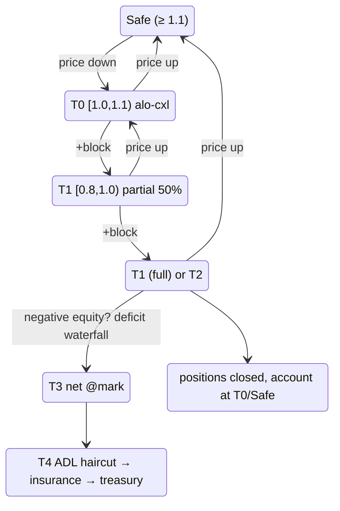

# Liquidation par paliers

:::tip
**Stable.**
:::

## En bref

Un escalier à 5 paliers piloté par `health = account_value / maint_margin`. Chaque palier définit l'action du protocole à mesure que la santé du compte baisse. Le [carton jaune](#pourquoi-un-carton-jaune) (T0) est la période de grâce par hystérésis de MetaFlux — un bloc d'avertissement avant qu'une position soit vendue. L'[ADL](./adl.md) T4 est la mutualisation des pertes en dernier recours.

| Palier | Plage de santé | Action | Position concernée ? |
|------|-------------|--------|---|
| (sûr) | `health ≥ 1.1` | Inactif | — |
| **T0** | `1.0 ≤ health < 1.1` | **Carton jaune** : ordres ALO annulés de force, portefeuille notifié | Non |
| **T1** | `0.8 ≤ health < 1.0` | Clôture partielle [à plancher limité](#comment-sexécute-une-clôture-forcée-le-plancher-de-prix) (50 %) — clôture totale si T1 s'est déclenché dans la fenêtre `cooldown_ms` | Oui (50 %) ou Oui (100 %) |
| **T2** | `0.667 ≤ health < 0.8` | Clôture totale [à plancher limité](#comment-sexécute-une-clôture-forcée-le-plancher-de-prix) | Oui (100 %) |
| **T3** | `health < 0.667` | [Compensation au mark](#t3-filet-de-sécurité--compensation-au-mark) contre les contreparties bénéficiaires (les reliquats non exécutables de T1/T2 remontent ici également) | Oui — compensé au mark |
| **T4** | capitaux propres négatifs après T3 | [Cascade de déficit](#t4--la-cascade-de-déficit) : décote ADL → fonds d'assurance → file de trésorerie | Décote sur les gains réalisés des gagnants |

`account_value` inclut les PnL latents. `maint_margin` est la marge de maintien de base par actif (méthode classique) ou dérivée de SPAN (pour les comptes en marge de portefeuille).

## Calcul des paliers

Les seuils ci-dessous correspondent aux **constantes exactes du code**, non à des approximations.

`BoleEngine::decide(account, account_value: i128, maintenance_margin: u128, ts_ms)` est une **fonction pure** — elle lit l'état du délai de recharge mais ne le modifie jamais — et retourne un `BoleDecision` :

```
if maintenance_margin == 0            → Idle
if account_value < 0                  → Backstop { deficit = maintenance_margin + |account_value| }

health = account_value / maintenance_margin            # Division décimale

if health ≥ 1.1   (yellow_card_threshold)              → Idle            (Sûr)
if health ≥ 1.0                                        → YellowCard      (T0)
if health < 0.667 (full_market_floor)                 → Backstop { deficit = maintenance_margin − account_value }   (T3)
if health < 0.8   (partial_threshold)                 → FullMarket { size_to_close = maintenance_margin }           (T2)
# sinon 0.8 ≤ health < 1.0  (T1) :
if partial_cooldown_active(account)                   → FullMarket { size_to_close = maintenance_margin }
else                                                  → PartialMarket50 { size_to_close = maintenance_margin / 2 }
```

| Constante | Valeur | Symbole |
|----------|-------|--------|
| Seuil carton jaune (plafond T0) | `1.1` | `default_yellow_card_threshold` |
| Seuil partiel (plafond T1) | `0.8` | `default_partial_threshold` |
| Plancher marché total (entrée T3) | `0.667` (≈ 2/3) | `full_market_floor` |
| Délai partiel→total | `30_000 ms` | `DEFAULT_PARTIAL_COOLDOWN_MS` |

- Toutes les comparaisons utilisent `rust_decimal::Decimal` (pas de flottants). Si `account_value` dépasse `Decimal::MAX`, `decide` décale à droite les deux opérandes d'un même nombre de bits — ce qui préserve le ratio de santé et maintient le palier choisi pour ces magnitudes.
- **Seul `PartialMarket50` arme le délai de recharge** (`record_attempt`) ; un `FullMarket` ou un `Backstop` ne bloque pas les partiels suivants. L'escalade T1 partiel→total ne se déclenche donc que lorsqu'un *partial précédent* est encore dans sa fenêtre de 30 s.
- `size_to_close` pour un partiel vaut `maintenance_margin / 2` (troncature entière). Le `deficit` du filet de sécurité est `maintenance_margin − account_value` si `account_value ≥ 0`, sinon `maintenance_margin + |account_value|`.
- Le moteur évalue un **ensemble modifié incrémental** à chaque bloc (comptes marqués par événements + une tranche de remise en état glissante), et non un balayage complet — prouvé équivalent à un balayage from-scratch par test de fuzzing. Les comptes T0 voient leur liquidité ALO au repos annulée de force après classification.

## Comment s'exécute une clôture forcée (le plancher de prix)

Une clôture forcée T1/T2 n'est **jamais un balayage de marché**. Elle s'exécute comme un ordre LIMITE IOC borné par le mark engagé :

```
vente (jambe longue) :       limit = mark × (1 − liq_floor)
rachat (jambe courte) :      limit = mark × (1 + liq_floor)
```

- `liq_floor` est un paramètre de risque par marché ; **par défaut, il correspond à la moitié du ratio de maintenance du marché** (un marché à 5 % de maintenance plafonne l'exécution à 2,5 % en deçà du mark). Le ratio de maintenance est calibré pour couvrir le glissement de liquidation plus les frais, de sorte que le plancher garantit qu'une clôture forcée ne peut jamais subir plus de glissement que le tampon prévu.
- La tranche ne s'exécute qu'à des prix à l'intérieur ou en deçà du plancher. **Ce qui ne peut pas être exécuté au-dessus du plancher N'EST PAS vendu dans un carnet clairsemé** — cela remonte immédiatement à la file T3. C'est le garde-fou anti-cascade : une clôture forcée ne peut pas déprimer le mark au-delà du plancher et ne peut donc pas entraîner d'autres comptes en liquidation.
- Les exécutions se règlent via le **même chemin de règlement qu'un fill normal** : le PnL réalisé impacte le compte, l'intérêt ouvert évolue, la contrepartie côté maker se règle normalement.
- Des **frais de liquidation** (par défaut 50 bps du notionnel clôturé, configurables par marché) sont prélevés sur les capitaux propres positifs restants du compte — ils ne créent jamais de déficit — et sont crédités au fonds d'assurance, qui est précisément le pool absorbant les insuffisances du filet de sécurité.
- Les **ordres au repos de l'utilisateur côté opposé sont annulés, non auto-exécutés** (une auto-exécution rouvrirait ce que la clôture vient de fermer).

Le dimensionnement partiel (T1) est à 50 % de la jambe ciblée sur les marchés de base ; les marchés déployés par les constructeurs peuvent configurer une rampe décroissante en fonction de la santé (clôturer une petite tranche juste en dessous de la ligne de maintenance, des tranches plus importantes seulement au fur et à mesure que la santé diminue, plafonnées par marché) ainsi que le délai de recharge de 30 s entre les tranches.

## La machine à états complète



`cooldown_ms` est par défaut à `30 s`. Dans une fenêtre de délai de recharge, un retour en T1 escalade vers une clôture totale.

## Pourquoi un carton jaune

La plupart des blockchains de produits dérivés passent directement de « sain » à « clôture partielle ». Un pic de volatilité qui fait chuter la santé de 1,5 à 0,95 en un tick déclenche une vente forcée, qui déprime le mark, qui entraîne d'autres comptes dans le même palier. La cascade est la principale source de douleur lors des événements de liquidation observés.

T0 est une **couche d'hystérésis d'un bloc**. Vous entrez dans la plage ; la blockchain gèle vos ordres au repos ouverts (ALO uniquement — voir ci-dessous) et notifie votre client, mais rien ne vous est vendu. Vous avez jusqu'au prochain bloc de consensus pour :

- approvisionner la marge via `Deposit` (ou `UpdateIsolatedMargin` pour ajouter à un compartiment),
- clôturer une partie de la position manuellement,
- ou ne rien faire — auquel cas T1 se déclenche à la prochaine évaluation.

Avec un temps de bloc de 100 ms, la fenêtre de grâce est courte mais déterministe et suffisamment grande pour qu'un processus de gestion du risque automatisé puisse réagir.

### Pourquoi seuls les ordres ALO sont annulés

| TIF de l'ordre | Annulé à T0 ? | Raison |
|-----------|:----------------:|-------|
| `Alo` | oui | Repos pur, pas de frais perçus ; le capital est mieux déployé à défendre la position |
| `Gtc` (limite active) | non | Peut être votre découverte de prix active ; l'annuler pourrait dégrader davantage votre situation |
| `Ioc` (en cours) | n/a | Se résout à l'admission ; ne reste jamais en attente |
| Trigger (StopLoss / TakeProfit) | non | Correspond souvent exactement à la défense que vous souhaitez déclencher |

L'intention : libérer le capital immobilisé dans le repos passif, tout en préservant vos décisions de risque actives.

## Transition T1 partiel / total

T1 commence par une clôture partielle à 50 %. Logique du délai de recharge :

- **Premier déclenchement T1** : clôture à 50 %. `cooldown_armed_at = maintenant`.
- **Si la santé repasse en T0/Sûr** avant `cooldown_armed_at + cooldown_ms` : le délai se désarme naturellement dès que l'on quitte T1.
- **Si la santé reste en T1** pendant `cooldown_ms` : la prochaine évaluation T1 escalade vers une clôture **totale** au lieu d'un nouveau partiel.
- Le délai de recharge ne se réarme PAS sur T2 ou T3.

```
T = 0       T1 déclenchement #1, clôture 50 %, délai armé
T = 5s      le mark glisse davantage, toujours en T1
T = 20s     le mark se redresse légèrement ; en T0
T = 31s     délai écoulé (aurait escaladé, mais on n'est pas en T1)
            compte considéré T0/Sûr ; délai réinitialisé
```

Par opposition à :

```
T = 0       T1 déclenchement #1, clôture 50 %
T = 5s      toujours T1
T = 30s     TOUJOURS T1 (délai écoulé pendant T1)
T = 30s+    T1 déclenchement #2 → clôture totale
```

Le délai de recharge n'est *pas* une zone inactive — T1 continue de déclencher des partiels. Le délai ne gouverne que la bascule partiel → total.

### Exemple illustré

Compte : long 1 BTC à l'entrée 100, compartiment isolé USDC = 20.

```
mark = 100   account_value = 20 + 0 = 20   maint = 5 (5% de 100)  health = 4.0  → Sûr
mark = 90    account_value = 20 - 10 = 10  maint = 4.5            health = 2.2  → Sûr
mark = 85    account_value = 20 - 15 = 5   maint = 4.25           health = 1.18 → T0 (annulation alo)
mark = 84.5  account_value = 20 - 15.5     maint = 4.225          health = 1.06 → T0
mark = 84    account_value = 20 - 16 = 4   maint = 4.2            health = 0.95 → T1
                  Déclenchement T1 : clôture 0.5 BTC au mark 84
                  PnL réalisé : -8 (clôture 0.5 BTC, entrée 100, sortie 84)
                  compartiment : 20 - 8 = 12
                  position restante : 0.5 BTC long entrée 100, mark 84
                  account_value = 12 - 8 = 4 (PnL latent -8 sur 0.5 BTC)
                  maint = 0.5 * 84 * 0.05 = 2.1
                  health = 4 / 2.1 = 1.9 → retour en Sûr
```

Une clôture partielle à 50 % a restauré la santé de 0,95 (T1) à 1,9 (Sûr). L'objectif de la clôture partielle est de redimensionner la position afin que le compartiment restant puisse supporter l'exposition réduite.

Si la clôture à 50 % ne restaure pas la santé (baisse plus prononcée), un second déclenchement T1 dans le délai de recharge escaladerait :

```
mark = 84    Déclenchement T1 partiel : 0.5 BTC clôturé, health → 1.9
mark = 82    health = 0.95 à nouveau (toujours en T1, délai actif)
              T1 escalade vers clôture totale : 0.5 BTC restant clôturé à 82
              PnL réalisé : -9
              compartiment : 12 - 9 = 3
              position : 0
              compte clôturé proprement avec 3 USDC restants ; fonds d'assurance non sollicité
```

## T3 filet de sécurité — compensation au mark

En dessous de `health = 0.667` (≈ 2/3 de la maintenance), la blockchain cesse d'essayer le carnet d'ordres. La position — ainsi que les lots de clôture forcée que le carnet n'a pas pu absorber dans le [plancher de prix](#comment-sexécute-une-clôture-forcée-le-plancher-de-prix) — est **compensée au MARK engagé** contre les positions côté opposé les plus bénéficiaires sur le même instrument (PnL latent le plus élevé en premier, départage déterministe) :

```
lorsque le compte entre en T3 (ou que des lots non exécutables sont en attente) :
   associer ses lots de position aux détenteurs bénéficiaires du côté opposé
   clôturer LES DEUX côtés au MARK              # pas d'interaction avec le carnet, pas d'impact sur le prix
   les deux côtés réalisent leur PnL à ce mark  # neutre en valeur : les capitaux propres ne sont pas modifiés
                                                # par la compensation elle-même
   les lots sans contrepartie bénéficiaire restent en attente pour le prochain bloc
```

Les contreparties intégrées à la compensation conservent **chaque centime de PnL** (réalisé au mark) — elles ne perdent que la position ouverte. Aucun frais n'est prélevé d'aucun côté. Une compensation sans prix mark utilisable, ou sans côté opposé bénéficiaire, se met simplement en attente — la blockchain ne vend jamais de force dans un carnet vide.

## T4 — la cascade de déficit

Si le compte est entièrement à plat et que ses capitaux propres sont **négatifs**, cette créance irrécouvrable est mutualisée dans un ordre fixe (ADL **avant** le fonds d'assurance — les gains réalisés des gagnants désendettés absorbent en premier, ce qui préserve le fonds pour les événements de queue extrêmes) :

1. **Décote ADL** — un contrôleur de sévérité adaptatif récupère jusqu'aux gains que les contreparties de la compensation **viennent de réaliser** (jamais plus que ce qu'elles ont reçu, et jamais un PnL latent non réalisé).
2. **Fonds d'assurance** — absorbe automatiquement le solde (c'est le pool alimenté par les [frais de liquidation](#comment-sexécute-une-clôture-forcée-le-plancher-de-prix)).
3. **Réserve de trésorerie** — le reste est mis en file d'attente pour un prélèvement de trésorerie autorisé par multisig (intervention humaine, dernier recours).

Le solde négatif du compte est ensuite ramené à zéro — la créance est portée par la cascade. Voir [ADL](./adl.md) pour les détails mathématiques du contrôleur.

## Vérification de marge en deux points

L'éligibilité à la liquidation est vérifiée à **deux moments** durant chaque bloc :

1. **Début de bloc**, après la mise à jour des prix mark — détecte les comptes qui viennent de glisser vers un palier inférieur du seul fait d'un mouvement de prix.
2. **Post-action**, après chaque `Order` / `Cancel` / `Withdraw` du compte — détecte les comptes qui se sont eux-mêmes placés dans un palier inférieur (par exemple, en retirant trop de garantie).

Cela empêche toute manipulation intra-bloc « gratuite » par laquelle un utilisateur augmenterait son risque entre le début de bloc et le reste du bloc.

## Stratégies de redressement

| Situation | Stratégie |
|----------|----------|
| En direction de T0 | Approvisionner via `UpdateIsolatedMargin` (Isolé) ou `Deposit` (Croisé). Pré-positionner des ordres trigger avant la tension. |
| Déjà en T0 | Même chose. Les ordres ALO sont déjà annulés ; placer de nouvelles limites à des niveaux de protection. |
| Oscillation en T0 | Resserrer les alertes internes à `health < 1.2`. Identifier la cause — paiement de funding ? limite de bande mark ? panne d'oracle ? |
| Partiel T1 vient de se déclencher | Réévaluer. La position est réduite de 50 % ; envisager de clôturer volontairement le reste avant que le délai de recharge ne déclenche la clôture totale. |
| Pièges répétés au délai de recharge T1 | La taille de position est inadaptée au compartiment. Ne pas réapprovisionner le compartiment sans redimensionner également. |

## Comment rester dans la zone sûre

- Surveiller `health` via les requêtes `userState` (compatible HL) ou [`account_state`](../api/rest/info.md#account_state).
- Configurer des alertes internes à `health < 1.2` — bien au-dessus de T0.
- Pour les stratégies automatisées, enregistrer un [bot de surveillance du risque](../integration/risk-watcher.md) pour déposer lorsque la santé franchit un seuil.
- Surveiller [`userEvents`](../api/ws/subscriptions.md#userevents) sur le flux WS pour les transitions de palier immédiates (les événements de marge et de liquidation transitent par ce canal).

## Cas limites

<details>
<summary>Afficher les cas limites</summary>

- **Bande de prix mark activée.** Lors de l'activation de la bande mark, les évaluations de liquidation se déclenchent quand même — mais sur le mark balisé. Le carnet peut être à un prix moins favorable que celui que le protocole peut reconnaître via le mark. En pratique : un pic adverse que la bande clamp ne vous liquide PAS immédiatement ; votre santé est calculée par rapport au mark clampé.
- **Un paiement de funding fait franchir une limite de palier.** Un paiement de funding réduit `account_value`. Si vous êtes à `health = 1.05` et qu'une charge de funding de 0,1 % vous amène à 0,99, T1 se déclenche dans le même bloc. Surveillez la cadence de funding par rapport à votre tampon.
- **Deux déclenchements T1 simultanés sur plusieurs actifs (Croisé).** Les deux partiels se produisent dans le même bloc. Ordre : alphabétique par nom d'actif (déterministe entre validateurs). L'éligibilité à l'assurance et à l'ADL s'applique par actif.
- **Entrée en T0 puis sortie avant le bloc suivant.** Possible si votre client approvisionne la marge dans le même bloc (T0 début de bloc → action utilisateur `Deposit` → vérification post-action passe T0). Les ordres ALO annulés au début de bloc restent annulés ; rien ne les recrée automatiquement.

</details>

## Voir aussi

- [Marge de portefeuille](./portfolio-margin.md) — la marge croisée multi-actifs optionnelle réduit la maintenance de base
- [Algorithme d'allocation ADL](./adl.md) — les mathématiques derrière T4
- [Modes de marge](./margin-modes.md) — Croisé / Isolé / Strict-Iso définit le périmètre de l'escalier
- [Prix mark](./mark-prices.md) — ce qui détermine la santé
- [Canal WS `userEvents`](../api/ws/subscriptions.md#userevents) — les transitions de palier transitent par ce canal
- [Modèle de bot de surveillance du risque](../integration/risk-watcher.md) — approvisionnement automatique de la marge

## FAQ

<details>
<summary>Afficher la FAQ</summary>

**Q : Puis-je déclencher manuellement T1 sur le compte de quelqu'un d'autre ?**
R : Non. La liquidation est dérivée du consensus sur la base du mark engagé + l'état du compte. Il n'existe pas d'action « liquider » qu'un utilisateur puisse soumettre ; le protocole se déclenche de sa propre logique aux points de contrôle début de bloc / post-action.

**Q : Quelle est la santé la plus basse à laquelle je peux arriver en carton jaune et en ressortir sans dommage ?**
R : T0 se déclenche à `1.0 ≤ health < 1.1`. Si vous repassez en Sûr (`health ≥ 1.1`) avant la prochaine évaluation, les ordres ALO ne sont PAS recréés (vous devez les resoumettre), mais aucune autre action T0 ne se déclenche.

**Q : Est-il possible de désactiver T1 (le forcer à sauter partiel → total) ?**
R : Non. T1 essaie toujours d'abord le partiel. Soumettez une clôture manuelle en T0 si vous souhaitez un dénouement total à vos propres conditions.

**Q : Comment le prix de clôture est-il déterminé en T1/T2 ?**
R : Un ordre **limite** IOC au carnet en vigueur, borné par `mark × (1 ∓ liq_floor)` — voir [le plancher de prix](#comment-sexécute-une-clôture-forcée-le-plancher-de-prix). Le glissement réalisé est borné par le plancher (par défaut : la moitié du ratio de maintenance) ; tout ce que le carnet ne peut pas absorber dans ce plancher remonte au filet de sécurité au lieu de balayer des niveaux plus profonds.

</details>
