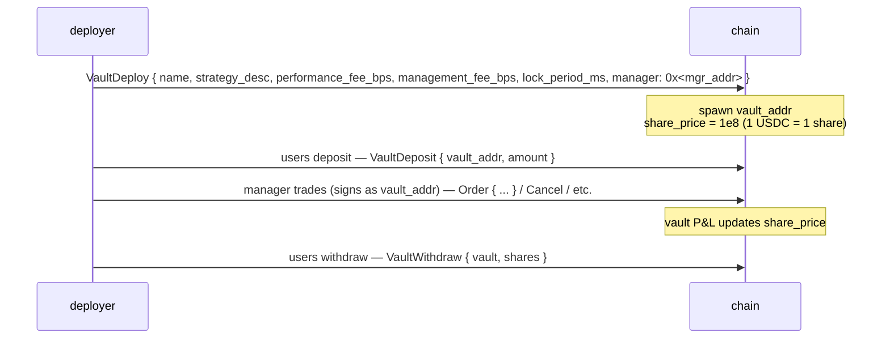
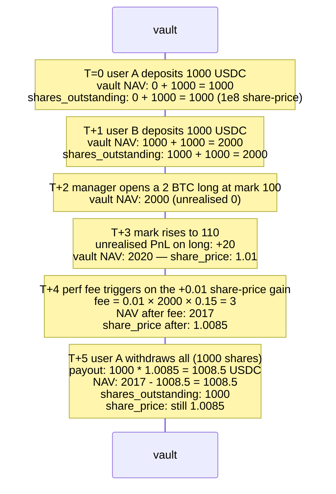

# Coffres (Vaults)

:::info
**Disponible sur devnet.** Le cycle de vie complet d'un coffre — création, dépôt, retrait,
transfert, distribution, modification — est implémenté et testé sur devnet.
Les tests de consensus de bout en bout sont encore en cours d'ajout.
:::

## En bref

Deux familles de coffres : le **MFlux Vault** opéré par le protocole (le fonds d'assurance et de garantie de dernier recours), et les **coffres utilisateur** (des stratégies déployées par la communauté dans lesquelles vous pouvez déposer des fonds). Les deux partagent le même mécanisme de valorisation des parts : les dépôts émettent des parts au `share_price` courant ; les retraits brûlent des parts au `share_price` courant.

## MFlux Vault

Le fonds propre du protocole. Il remplit trois rôles :

1. **Contrepartie de garantie de dernier recours** : lorsqu'une liquidation T3 transfère la position au protocole, le MFlux Vault absorbe la position ainsi que toute perte résiduelle.
2. **Tenue de marché (prévu)** : les capitaux inactifs du MFlux peuvent être déployés dans des stratégies de tenue de marché sur certains marchés.
3. **Assurance** : détient des réserves pour mutualiser les petites pertes sans déclencher d'ADL T4.

### Déposer dans le MFlux Vault

```json
{
  "type": "VaultDeposit",
  "params": {
    "vault":       "<mflux_vault_addr>",
    "amount":   "1000000000"
  }
}
```

Émet `amount / share_price × 10^8` parts au déposant au bloc suivant.

### Retirer

```json
{
  "type": "VaultWithdraw",
  "params": {
    "vault":       "<mflux_vault_addr>",
    "shares":   "100000000000"
  }
}
```

Brûle `shares` parts ; verse `shares × share_price / 10^8` USDC au bloc suivant.

### Période de blocage

Le MFlux Vault applique par défaut une période de blocage de `24 h` entre le dépôt et le premier retrait éligible. Le blocage est par part ; les retraits portant sur des parts de plus de 24 h sont sans restriction.

Cela empêche des capitaux de déposer juste avant un événement T3 connu et de retirer immédiatement après que la perte a été mutualisée (le problème du « passager clandestin »).

### Performance et frais

Le MFlux Vault facture :
- **Frais de gestion** : 0 bps (pas de gérant — opéré par le protocole).
- **Commission de performance** : 0 bps.
- **Frais de retrait** : 0 bps.

Les rendements sont nets des pertes de garantie T3 et des profits des teneurs de marché T1/T2. L'historique du prix des parts est disponible via la requête `vault_state` en temps réel (voir [`/info`](../api/rest/info.md#vault_state)).

## Coffres utilisateur

N'importe qui peut déployer un coffre qui mutualise des USDC et exécute des stratégies sous l'autorité de signature d'un gérant désigné.

### Cycle de vie



L'adresse du coffre est un compte de première classe dans la machine d'état — elle possède ses propres positions, solde et ordres. Le gérant signe les transactions **au nom du coffre** (l'adresse du coffre est le `sender`, la clé du gérant signe ; l'admission suit le même mécanisme d'approbation d'agent que pour les portefeuilles agent ordinaires).

### Déployer

```json
{
  "type": "VaultDeploy",
  "params": {
    "name":                 "Yield Arb Strategy",
    "description":          "Funding-rate arbitrage",
    "manager":              "0x<mgr>",
    "performance_fee_bps":  1500,
    "management_fee_bps":   100,
    "lock_period_ms":       86400000,
    "high_water_mark":      true
  }
}
```

| Champ | Plage | Notes |
|-------|-------|-------|
| `performance_fee_bps` | `[0, 3000]` | Commission sur les rendements positifs au-delà du précédent plus haut |
| `management_fee_bps` | `[0, 500]` annualisé | Prélevés indépendamment des rendements |
| `lock_period_ms` | `[0, 30 days]` | Blocage par dépôt |
| `high_water_mark` | bool | Si vrai, la commission de performance n'est due que sur les nouveaux plus hauts |

### Valorisation

```
share_price(t) = vault_account_value(t) / total_shares(t) × 10^8
```

`vault_account_value` inclut les PnL latents sur les positions ouvertes.

La valorisation est mise à jour à chaque validation. Les dépôts émettent des parts au prix **post-validation** (le prix du bloc précédent ne s'applique pas) ; les retraits brûlent des parts au prix post-validation.

### Mécanisme des frais

La commission de performance s'accumule sur l'adresse désignée par le gérant à chaque tick de prix des parts au-dessus du précédent plus haut :

```
on every commit:
    if share_price > high_water_mark:
        gain     = (share_price - high_water_mark) * shares_outstanding
        perf_fee = gain * performance_fee_bps / 1e4
        accrue perf_fee to manager (paid as vault → manager USDC)
        high_water_mark = share_price
```

Les frais de gestion sont versés par bloc de façon linéaire :

```
mgmt_per_block = management_fee_bps / 1e4 / (blocks_per_year)
```

Les deux types de frais sont déduits de la VNI du coffre avant le calcul du prix des parts — le prix des parts reflète déjà les frais prélevés.

### Risques

Les coffres utilisateur peuvent perdre de l'argent. Si la VNI d'un coffre est ≥ aux engagements + 1 unité de base, les retraits sont honorés au prix des parts en vigueur. En dessous de ce seuil, le coffre est **suspendu** et les retraits sont mis en file d'attente jusqu'à ce que la VNI se redresse (potentiellement grâce au gérant qui dénoue les positions perdantes).

Un coffre qui atteint le niveau T3 (son propre niveau de liquidation) suit l'échelle de [liquidation par paliers](./tiered-liquidation.md). L'ADL T4 appliqué à un coffre pénalise les déposants via une décote du prix des parts.

L'adresse du coffre est permanente en chaîne ; même un coffre vide persiste (le stockage payé en gas n'est pas récupérable en V1).

### Consulter

```bash
curl -X POST https://devnet-gateway.mtf.exchange/info \
  -d '{"type":"vault_state","vault":"0x<vault>"}'
```

```json
{
  "type": "vault_state",
  "data": {
    "vault":              "0x<addr>",
    "name":               "Yield Arb Strategy",
    "manager":            "0x<mgr>",
    "tvl":             "10000000000",
    "share_price":     "11500000",
    "depositor_count":    142,
    "high_water_mark": "11500000",
    "performance_fee_bps":1500,
    "management_fee_bps": 100,
    "lock_period_ms":     86400000,
    "your_shares":     "5000000000",
    "your_position_value": "575000",
    "your_withdrawable_at_ts": 1735690000000
  }
}
```

## Fonds d'assurance

Une fraction du MFlux Vault constitue le **fonds d'assurance** — une réserve dédiée qui est prélevée lors des événements de garantie T3. Voir [liquidation par paliers](./tiered-liquidation.md#t3-backstop--netting-at-mark).

Lorsque le fonds d'assurance est bas, le MFlux Vault le renfloue automatiquement à partir du fonds principal (ratio fixé par la gouvernance, 10 % de la VNI MFlux réservés en assurance par défaut).

## Cas limites

<details>
<summary>Afficher les cas limites</summary>

- **Rotation du gérant.** Le gérant d'un coffre peut être remplacé par le déployeur (ou par un multi-sig si le coffre a été déployé en tant que déploiement multi-sig). Le nouveau gérant hérite de toute l'autorité de signature.
- **Gérant inactif.** Les positions existantes restent en place ; aucun échange automatique. Les déposants peuvent toujours retirer au prix des parts (qui reflète la valorisation au marché de ces positions). Si des positions sont liquidées en raison de mouvements du prix de marque, cela impacte la VNI.
- **Dépôt pendant une liquidation.** Un coffre en T0/T1 continue d'accepter des dépôts (utile — un nouveau capital peut le sauver), sauf si `accept_deposits` est défini sur `false` par le gérant.
- **Calcul du blocage.** Un blocage de 24 h est par dépôt. Deux dépôts effectués à 6 h d'intervalle se débloquent à des moments différents ; suivez les dépôts individuellement si vous gérez des flux entrants.
- **Plus haut et retraits.** Retirer une partie des parts ne réinitialise pas le plus haut (HWM) ; le gérant continue de percevoir la commission de performance sur le prochain gain au-dessus du HWM, sur les parts **restantes**.

</details>

## Séquence — dépôt, transactions du gérant, retrait



## Voir aussi

- [Liquidation par paliers](./tiered-liquidation.md) — garantie T3, fonds d'assurance
- [`POST /info vault_state`](../api/rest/info.md#vault_state)
- [`vaultDetails` HL-compat](../api/rest/hl-compat.md#vaultdetails)
- [`userEvents` WS](../api/ws/subscriptions.md#userevents) — les événements de dépôt / retrait / frais des coffres transitent par ce canal
- [Staking](./staking.md) — distinct des coffres

## FAQ

<details>
<summary>Afficher la FAQ</summary>

**Q : Les dépôts dans le MFlux Vault sont-ils assurés ?**
R : Non. Ils bénéficient des activités de garantie T1/T2 et absorbent les pertes T3. Les rendements nets sont positifs en conditions normales, et peuvent être négatifs en cas de forte tension.

**Q : Un coffre peut-il détenir des actifs autres que des USDC ?**
R : En V1, les coffres utilisateur sont libellés en USDC uniquement. Les coffres d'actifs au comptant sont prévus pour la V2.

**Q : Les parts de coffre sont-elles cessibles ?**
R : Non — en V1, les parts ne sont pas cessibles. Un déposant doit retirer ses fonds et le bénéficiaire doit effectuer un nouveau dépôt. La V2 pourrait introduire des jetons de parts cessibles.

**Q : Le gérant peut-il retirer les capitaux du coffre vers sa propre adresse ?**
R : Non. Le gérant dispose uniquement d'une autorité de **négociation**, et non d'une autorité de retrait. Le retrait vers des non-déposants nécessite une gouvernance explicite au niveau du coffre (non disponible en V1).

</details>
