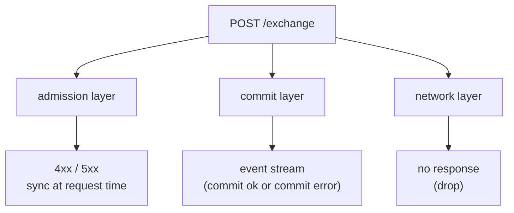
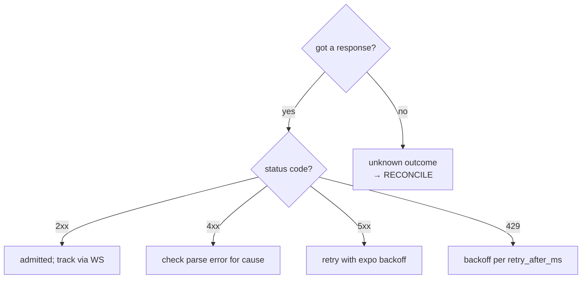
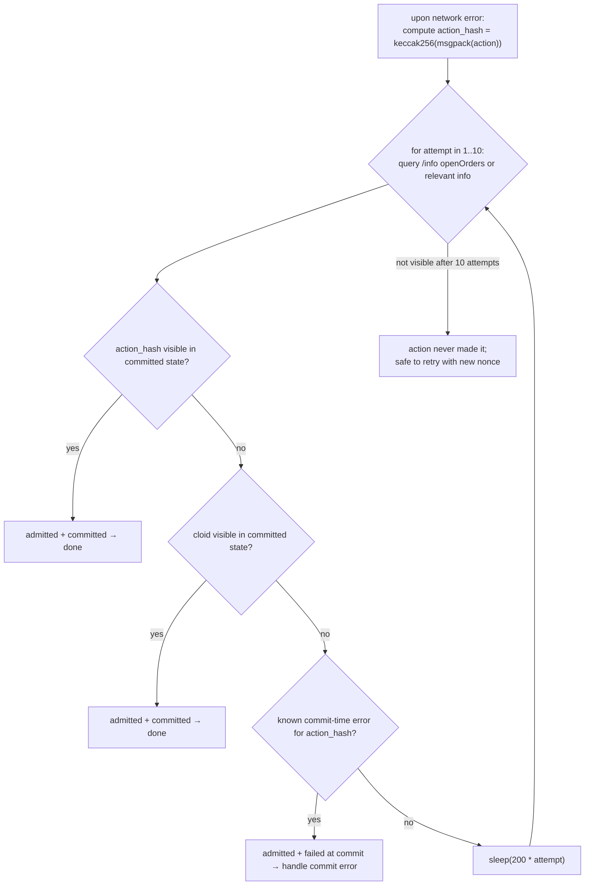

# Gestion des erreurs

:::tip
**Stable.**
:::

Un arbre de décision pour les clients en production. Le catalogue complet des chaînes d'erreur se trouve dans [errors](../api/errors.md) ; cette page vous indique quoi **faire** pour chaque catégorie.

## Trois couches d'échec



| Couche | Moment de déclenchement | Mode de signalement |
|--------|------------------------|---------------------|
| Admission | Lors de la requête `/exchange` | Statut HTTP + corps de réponse |
| Commit | Au moment du commit de bloc, après l'admission | Push WS `userEvents` / `orderEvents`, ou visible dans `userFills` / `openOrders` |
| Réseau | À tout moment | Erreur TCP, délai d'attente, réponse partielle |

Chaque couche a une sémantique différente. Les confondre est le bug de production le plus courant.

## Arbre de décision



## Couche 1 — erreurs d'admission

La requête a été analysée, mais rejetée à l'admission. Statut `400`, `401`, `404`, `405`, `422`.

| Classe | Exemples | Règle de relance |
|--------|----------|------------------|
| **Bug client** | `400 invalid_msgpack`, `400 unknown_action_variant`, `400 missing_field` | NE PAS relancer — corriger le code |
| **Bug de signature** | `401 signer_not_sender`, `401 unknown_chainId` | NE PAS relancer — vérifier le chainId / la clé / l'état de l'agent |
| **Bug de nonce** | `400 nonce_must_increase` | Incrémenter le nonce ; relancer |
| **Logique** | `422 price_not_tick_aligned`, `422 reduce_only_would_grow` | Calculer la bonne valeur ; relancer |
| **État** | `422 liquidation_tier_blocks_action`, `422 insufficient_balance` | Renflouer / attendre la transition de niveau ; relancer |
| **État d'authentification** | `401 agent_not_yet_effective` | Attendre un bloc ; relancer |
| **Non trouvé** | `404 order_not_found`, `404 account_not_found` | Ne pas relancer ; vérifier la ressource |

```typescript
async function handleAdmissionResponse(r: Response) {
  if (r.status === 202) return { admitted: true };

  const body = await r.json();
  switch (r.status) {
    case 400:
      // client bug — log loudly, do not retry
      throw new ClientBugError(body.error);

    case 401:
      // signing — depends on the cause
      if (body.error === 'agent not yet effective') {
        // wait + retry
        await sleep(200);
        return { admitted: false, retry: true };
      }
      throw new AuthError(body.error);

    case 422:
      // logical — caller can correct and retry
      throw new LogicalError(body.error);

    case 429:
      await sleep(body.retry_after_ms);
      return { admitted: false, retry: true };

    case 503:
      await sleep(body.retry_after_ms);
      return { admitted: false, retry: true };

    default:
      throw new UnknownError(`${r.status}: ${body.error}`);
  }
}
```

## Couche 2 — erreurs de commit

L'action a été admise (`202`) mais a échoué lors du commit. Vous n'en êtes informé que via le flux d'événements.

| Erreur | Cause | Relancer ? |
|--------|-------|------------|
| `reduce_only_violation_post_admit` | La position a changé entre l'admission et la distribution | OUI si l'intention s'applique toujours |
| `stp_rejected` | La prévention des auto-transactions a annulé l'ordre | NON — l'autre ordre de l'appelant a été exécuté en premier |
| `mark_price_band_violation` | Prix de l'ordre trop éloigné du prix mark lors de la distribution | NON — réévaluer le prix et replacer l'ordre |
| `evicted_under_cap_pressure` | Admis mais évincé du mempool avant le bloc | OUI (avec recul exponentiel) |
| `liquidation_pre_empted` | Le compte est passé au niveau T1+ entre l'admission et la distribution | NON — corriger la marge en premier |

Abonnez-vous au flux [`userEvents` WS](../api/ws/subscriptions.md#userevents) (les événements du cycle de vie des ordres transitent par ce canal) et traitez chaque type d'événement :

```typescript
ws.subscribe('orderEvents', { user: address }, (event) => {
  switch (event.data.kind) {
    case 'resting':       /* order is on the book; track oid */            break;
    case 'partialFill':   /* size partially filled; cloid still on book */ break;
    case 'filled':        /* fully filled; remove from open-order set */   break;
    case 'cancelled':     /* terminal */                                   break;
    case 'error':         /* commit-time error; handle per table above */
      handleCommitError(event.data);
      break;
  }
});
```

## Couche 3 — erreurs réseau

La catégorie la plus ambiguë. Le serveur a-t-il reçu la requête ? L'action a-t-elle été commitée ?

| Symptôme | Action |
|----------|--------|
| TCP RST avant la réponse | Réconcilier : interroger l'état pour déterminer l'issue |
| Délai de réponse dépassé (défini par vous) | Idem — réconcilier |
| Réponse partielle / tronquée | Idem — réconcilier |
| Connexion refusée | Côté serveur indisponible ; relancer avec recul exponentiel |
| Échec DNS | Problème réseau / DNS ; relancer avec recul exponentiel |

### Schéma de réconciliation



Le schéma cloid-sur-ordres (voir [idempotency](./idempotency.md)) rend cette opération peu coûteuse : interrogez les ordres ouverts et vérifiez si votre cloid y figure.

Pour les actions autres que les ordres, faites correspondre sur `action_hash` (déterministe à partir de votre encodage msgpack local). Le flux WS `userEvents` inclut `action_hash` dans chaque événement.

## Recettes de production

### Placement d'ordre avec relance

```typescript
async function placeOrderSafely(client: Client, order: Order, maxAttempts = 3) {
  const cloid = '0x' + randomBytes(16).toString('hex');
  let lastNonce = Date.now();

  for (let attempt = 1; attempt <= maxAttempts; attempt++) {
    try {
      const res = await client.exchange.order({ ...order, cloid }, { nonce: lastNonce });
      return res;
    } catch (e) {
      if (e instanceof NetworkError) {
        // reconcile via cloid
        const placed = await client.info.findOpenOrderByCloid(client.address, cloid);
        if (placed) return placed;

        // bump nonce and retry
        lastNonce = Date.now();
        continue;
      }
      if (e instanceof RateLimitError) {
        await sleep(e.retryAfterMs);
        lastNonce = Date.now();
        continue;
      }
      throw e;  // client / signing / logical bug — propagate
    }
  }
  throw new Error('order failed after retries');
}
```

### Annulation avec sécurité idempotente

```typescript
async function cancelSafely(client: Client, asset: number, oid: number) {
  try {
    return await client.exchange.cancel({ asset, oid });
  } catch (e) {
    if (e.body?.error === 'order not found') return { alreadyDone: true };
    if (e instanceof NetworkError) {
      // re-query the order
      const orders = await client.info.openOrders(client.address);
      if (!orders.find(o => o.oid === oid)) return { alreadyDone: true };
      // it's still there — actually retry
      return cancelSafely(client, asset, oid);
    }
    throw e;
  }
}
```

### Réconciliation des commits via WS

```typescript
const pendingByHash = new Map<string, PendingAction>();

ws.subscribe('userEvents', { user: address }, (event) => {
  const hash = event.data.action_hash;
  const pending = pendingByHash.get(hash);
  if (!pending) return;

  if (event.data.kind === 'error') pending.reject(new CommitError(event.data));
  else                              pending.resolve(event.data);
  pendingByHash.delete(hash);
});

async function submit(action: Action) {
  const hash = keccak256(msgpack(action));
  const p = new Promise((resolve, reject) => pendingByHash.set(hash, { resolve, reject }));
  await client.exchange.submit(action);
  return Promise.race([p, timeout(5000)]);
}
```

## Cas limites

<details>
<summary>Afficher les cas limites</summary>

- **La passerelle renvoie un 5xx mais l'action a bien été commitée.** Peut survenir si la réponse post-admission de la passerelle a été perdue. Traitez-le comme une perte réseau : réconciliez via cloid/action_hash.
- **Le flux WS est en retard sur l'état réel.** Le tampon de reprise a peut-être éliminé les événements pendant la reconnexion. Ré-interrogez `/info` à la reprise pour ancrer l'état ; basculez sur le WS pour le suivi en direct.
- **Le même nonce soumis deux fois — l'un réussit.** Le serveur impose la monotonicité des nonces ; la deuxième tentative reçoit `nonce_too_small` et vous apprenez que la première est en vie. Utilisez ce signal.
- **Erreurs logiques à retardement.** Un ordre `Trigger` admis aujourd'hui mais qui ne se déclenche jamais car sa condition de déclenchement n'est jamais remplie. Pas d'erreur ; juste un ordre en attente qui persiste. Réconciliez périodiquement votre ensemble d'ordres ouverts avec l'ensemble attendu par votre bot.

</details>

## Voir aussi

- [Erreurs](../api/errors.md) — catalogue complet
- [Idempotency](./idempotency.md) — mécanique nonce + cloid
- [Abonnements WS](../api/ws/subscriptions.md) — événements au moment du commit
- [Limites de débit](../api/rate-limits.md) — cadencer les relances

## FAQ

<details>
<summary>Afficher la FAQ</summary>

**Q : Dois-je traiter les erreurs au moment du commit comme des exceptions ou comme des données ?**
R : Comme des données. Ce sont des résultats d'ordre ordinaires — `cancelled` à cause du STP, `error` à cause d'un reduce-only post-admission. Journalisez-les et traitez-les selon la logique métier ; ne les laissez pas provoquer un crash.

**Q : Y a-t-il une raison d'ignorer une erreur d'admission ?**
R : Pour les flux purement idempotents (annulation d'un ordre inexistant), absorber un `404` est acceptable. Pour tout le reste, journalisez au niveau INFO+ et relancez ou remontez l'information à l'opérateur.

**Q : Comment limiter les relances ?**
R : Budget en temps horloge par opération logique. Pour le placement d'ordre, 5 secondes est généreux ; pour les annulations, 2 secondes. Au-delà, remontez l'information à l'opérateur ou à votre superviseur de risques.

</details>
