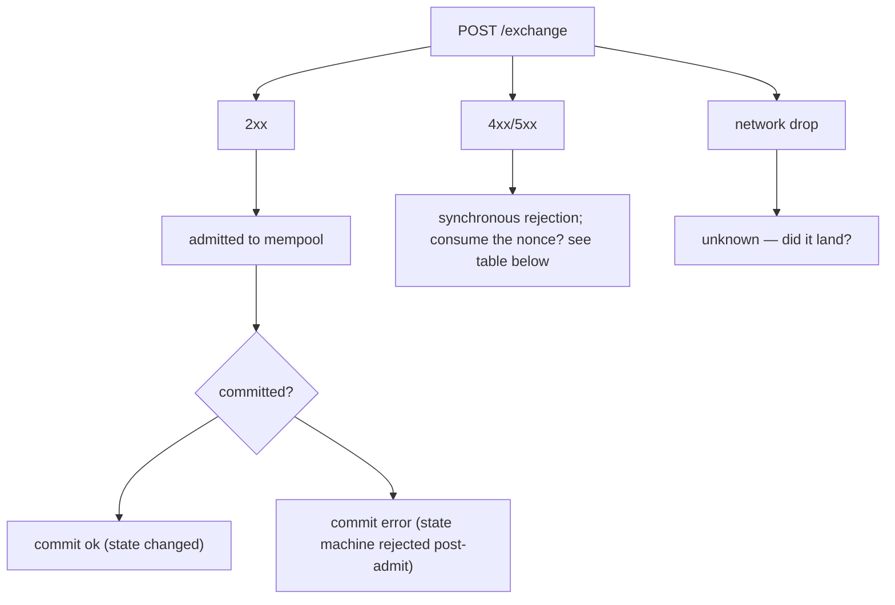
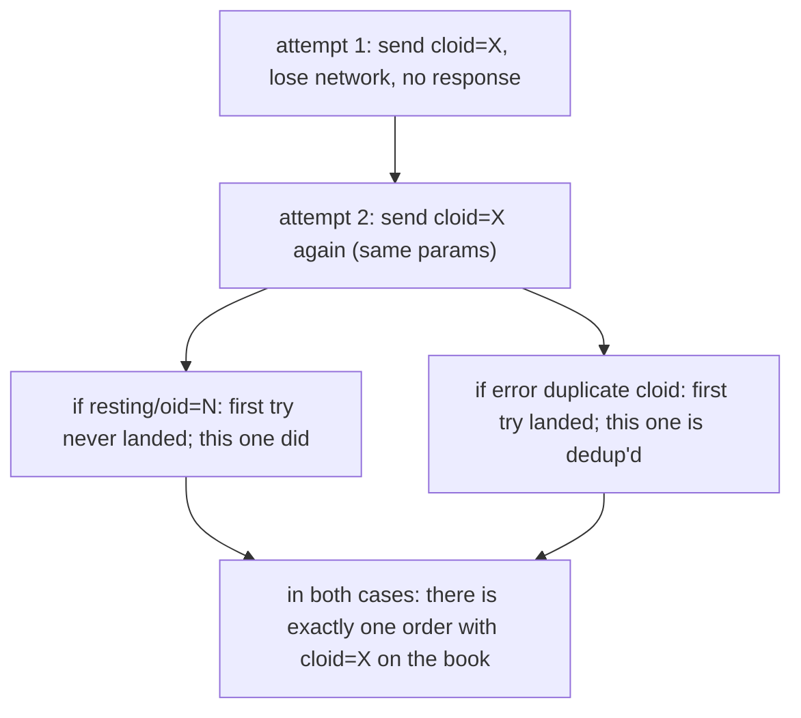

# Idempotence

:::tip
**Stable.**
:::

Comment effectuer des nouvelles tentatives en toute sécurité sans consommer les nonces en double ni dupliquer les ordres.

## En résumé

- Chaque action possède un `nonce`. Le réutiliser retourne `400 nonce_must_increase`.
- Définissez un `cloid` unique sur chaque `Order` / `ModifyOrder` ; le serveur rejette les `cloid` en double sur le même compte, ce qui rend les nouvelles tentatives sûres.
- Pour les actions sans ordre, la **machine d'état** est naturellement idempotente (annuler un ordre inexistant est sans conséquence ; un transfert est contraint par la vérification du solde).
- Le modèle d'erreurs réseau se divise en trois classes — rejet à l'admission, erreur au moment du commit, perte réseau — chacune avec une règle de nouvelle tentative différente.

## Trois classes d'erreurs



## Consommation du nonce

| Résultat | Nonce consommé ? | Nouvelle tentative sûre ? |
|---------|:---------------:|:--------------:|
| `202 admitted` | OUI | NON — effet en double |
| `400 nonce_must_increase` | NON (déjà dépassé) | NON — soumettre avec un nonce plus élevé |
| `400 invalid_msgpack` / autres erreurs d'analyse | NON | OUI — corriger et resoumettre avec le même nonce |
| `401 signer_*` | NON | NON tant que le problème de signature n'est pas résolu ; le nonce n'est pas consommé |
| `422 reduce_only_violation` et autres erreurs logiques à l'admission | NON | OUI une fois le problème logique corrigé |
| `429 rate_limit` | NON | OUI après `retry_after_ms` |
| `503 mempool_full` | NON | OUI après `retry_after_ms` |
| Perte réseau (aucune réponse) | INCONNU | RÉCONCILIER — voir [réconcilier après perte](#reconcile-after-network-drop) ci-dessous |

La règle : **si une requête reçoit une réponse du serveur → la décision concernant le nonce est prise**. Une perte réseau est le seul cas ambigu.

## Stratégie : cloid

Pour la passation d'ordres, l'identifiant d'ordre client est le mécanisme de déduplication le plus robuste.

```typescript
const cloid = crypto.randomBytes(16);  // 16 bytes

await client.order({
  asset: 0, side: 'Buy', priceE8: '...', sizeE8: '...',
  tif: 'Gtc', cloid: '0x' + cloid.toString('hex'),
});
```

Le serveur retourne :

| Réponse du serveur | Signification |
|-----------------|---------------|
| `{"resting":{"oid":N,"cloid":"0x..."}}` | Ordre passé, déduplication confirmée |
| `{"error":"duplicate cloid"}` | Une requête précédente avec le même cloid a été admise ; **l'ordre est déjà dans le carnet**. Recherchez-le par cloid. |
| `{"error":"<other>"}` | Cette entrée a échoué ; vous pouvez réessayer avec un nouveau cloid ou le même |

Règle de nouvelle tentative pour les ordres : **même cloid + mêmes paramètres** est idempotent de bout en bout. Si la première tentative a abouti, la seconde retourne `duplicate cloid` et vous savez que l'ordre original est en place.



La même logique s'applique à `ModifyOrder` — définissez un nouveau cloid pour la modification, dédupliquez la modification.

## Stratégie : idempotence par machine d'état

La plupart des actions sans ordre sont idempotentes au niveau de la machine d'état :

| Action | Idempotente ? | Pourquoi |
|--------|:-----------:|-----|
| `Cancel` | oui | Annuler un ordre inexistant ou déjà annulé retourne `{"error":"order not found"}` — sans conséquence |
| `CancelByCloid` | oui | Idem |
| `UpdateLeverage` | oui | Définir l'effet de levier à la valeur actuelle est une opération nulle |
| `UpdateMarginMode` | oui | Idem |
| `UserPortfolioMargin` | oui | Idem |
| `ApproveAgent` | oui | Les mêmes données d'approbation écrasent l'enregistrement existant |
| `UsdcTransfer` | NON | Transfère un nouveau montant à chaque appel |
| `WithdrawUsdc` | NON | Idem |
| `Delegate` / `Undelegate` | NON | Ajoute à la file d'actions à chaque appel |

Pour les actions NON idempotentes, utilisez l'une des approches suivantes :
- **Le nonce comme clé de déduplication** : suivez les nonces soumis, ne soumettez jamais deux fois le même nonce. Le serveur l'impose dans tous les cas.
- **Une table de déduplication externe** : tenez une correspondance `{request_id → nonce}` ; si une nouvelle tentative trouve un nonce existant pour ce request_id, la soumission a déjà eu lieu.

## Réconcilier après une perte réseau

Lorsque la réponse est perdue (TCP fermé, délai d'attente dépassé, etc.), vous ne savez pas si l'action a été validée. Procédez à une réconciliation :

### Pour les ordres

Interrogez par cloid :

```bash
curl -X POST $BASE/info \
  -d '{"type":"openOrders","user":"0x..."}' | jq '.[] | select(.cloid == "0x<cloid>")'
```

Si présent → admis ; traitez comme un succès.
Si absent → vérifiez `userFills` pour une exécution associée à ce cloid.
Si toujours absent → l'admission a échoué (ou l'ordre a été évincé du mempool). Soumettez à nouveau avec le même cloid.

### Pour les transferts / retraits

Interrogez les `userFills` du compte (qui incluent les financements et transferts) ou `block_info` autour de l'heure de la perte. Associez par l'action_hash calculé localement — chaque action possède un hash déterministe, indépendamment du résultat de l'admission.

```typescript
const actionHash = keccak256(msgpack(action));
// search for events with this action_hash in WS history or info queries
```

Si vous ne parvenez pas à déterminer le résultat :
- **Pour une action idempotente** : réessayez en toute sécurité (utilisez un nouveau nonce, car l'ancien est peut-être déjà consommé).
- **Pour une action non idempotente** : mettez en pause ; interrogez l'état du compte pour vérifier si l'effet secondaire s'est produit ; reprenez uniquement avec certitude.

## Séquence — nouvelle tentative avec cloid après délai d'attente dépassé

```mermaid
sequenceDiagram
    participant C as Client
    participant S as Server
    C->>S: T=0 attempt 1: POST /exchange Order { cloid: X }
    Note over C,S: T=2s (no response — network drop)
    C->>S: T=2s attempt 2: POST /exchange Order { cloid: X } (same params, NEW nonce)
    S-->>C: T=2.1s response: error nonce_too_small → original was admitted! the new nonce is needed but the order itself is already in place.
    S-->>C: OR response: resting/oid=N → original never landed; this one did
    S-->>C: OR response: error duplicate cloid → original landed too; we're already dedup'd
    C->>S: T=2.2s query openOrders by cloid: confirm presence
```

Le cloid associé aux vérifications côté serveur rend la nouvelle tentative sûre même en cas de réseau peu fiable.

## Dépannage des problèmes de nonce

| Symptôme | Cause | Solution |
|---------|-------|-----|
| `nonce_must_increase` à chaque requête | Dérive de l'horloge locale (utilisation de `Date.now()`) | Synchronisez l'horloge ; ou utilisez un compteur monotone |
| Deux scripts entrent en collision sur le nonce | Partage du même compte | Utilisez un service de nonce partagé, ou un script par compte |
| `nonce_too_small` après une reconnexion | Compteur de nonce local réinitialisé à la valeur d'avant la perte | Persistez le dernier nonce soumis entre les redémarrages |

## Voir aussi

- [`POST /exchange`](../api/rest/exchange.md) — enveloppe complète incluant le `nonce`
- [Erreurs](../api/errors.md) — chaque chaîne d'erreur et sa remédiation
- [Gestion des erreurs](./error-handling.md) — arbre de décision admission / commit / réseau
- [Limites de débit](../api/rate-limits.md) — réglez le rythme de vos nouvelles tentatives

## FAQ

<details>
<summary>Afficher la FAQ</summary>

**Q : Dois-je utiliser `Date.now()` ou un compteur ?**
R : `Date.now()` convient pour les clients à instance unique. Pour les clients multi-instances sur un seul compte, utilisez un compteur monotone partagé (Redis `INCR`, par exemple) afin que deux instances n'entrent pas en collision.

**Q : Et si je veux rejouer délibérément une action (flux idempotent) ?**
R : Utilisez le même `cloid` (pour les ordres) et un nouveau `nonce`. Le serveur impose la déduplication via le cloid ; le nonce sert uniquement à maintenir l'intégrité de la communication.

**Q : Les cloids sont-ils réutilisables après l'annulation ou l'exécution de l'ordre original ?**
R : Non. Les cloids sont uniques par compte, de façon permanente. Utilisez-en un nouveau pour chaque ordre.

**Q : Le flux WS me fournit-il une confirmation au moment du commit utilisable pour la réconciliation ?**
R : Oui. Abonnez-vous à `userEvents` et associez par `action_hash` ou `cloid`. Le flux WS est la méthode recommandée pour confirmer l'état de commit lors d'une nouvelle tentative.

</details>
