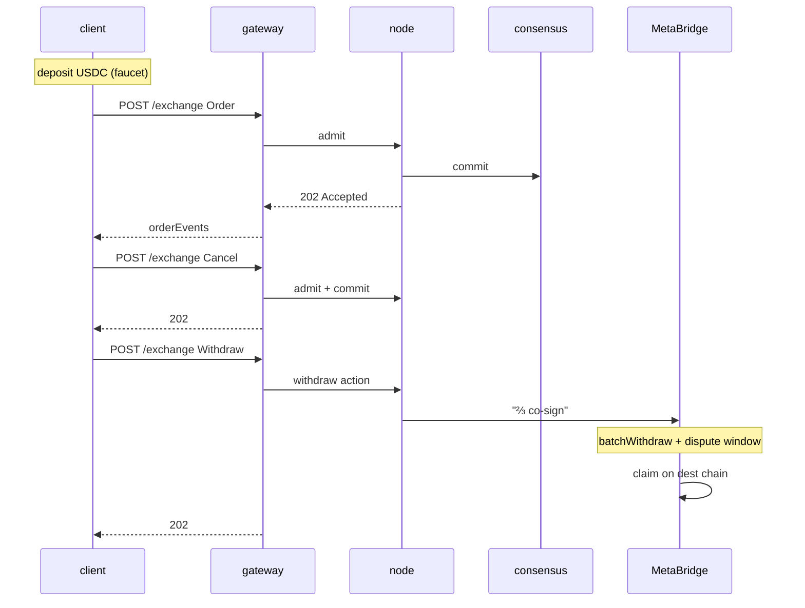

# Démarrage rapide — bout en bout en 5 minutes

:::info
**Statut.** Surface filaire **stable**. Points d'accès Devnet, sans garantie mainnet.
:::

Dépôt, placement d'un ordre, annulation, retrait. À la fin de cette page, votre session TypeScript / Python / curl aura effectué un aller-retour complet sur le devnet.

## Prérequis

- Une clé privée EVM (n'importe quel hex 32 octets ; pour le devnet, générez-en une fraîche — ne réutilisez pas une clé mainnet)
- USDC sur une chaîne source MetaBridge (Base ; Solana et Arbitrum en cours de déploiement) — le devnet accepte également la route faucet
- `curl` ou tout client HTTP

## Points d'accès

La passerelle est l'unique point d'entrée public. Le mode MTF-natif est le chemin par défaut ;
la compatibilité HL est disponible sous `/hl/*`.

| Service | URL (devnet) |
|---------|--------------|
| Porte d'entrée de la passerelle | `https://devnet-gateway.mtf.exchange` |
| MTF-natif (défaut) | `POST /info` · `POST /exchange` · `GET /ws` |
| Compatibilité HL | `POST /hl/info` · `POST /hl/exchange` · `GET /hl/ws` |
| Compatibilité CCXT | `/ccxt/*` |
| EVM JSON-RPC | `POST /evm` |
| Faucet (devnet) | `POST /faucet` |
| Explorateur | `https://devnet.mtf.exchange/explorer` |

> Le faucet **n'est pas** un service séparé — il s'agit de la route `POST /faucet` sur la
> porte d'entrée de la passerelle. Vous faites tourner le nœud vous-même ? La même surface native
> (`/info` · `/exchange` · `/ws` · `/faucet`) est accessible directement à
> `http://localhost:8080`. Voir [`POST /faucet`](../api/rest/faucet.md).

Consultez [réseaux](../networks.md) pour la liste complète incluant le testnet et (après le lancement) le mainnet.

## Étape 1 — Obtenir des USDC devnet

```bash
curl -X POST https://devnet-gateway.mtf.exchange/faucet \
  -H 'content-type: application/json' \
  -d '{"address":"0x<YOUR_ADDRESS>"}'
# -> {"address":"0x…","usdc":3000,"mtf":10,"status":"queued"}
```

Une demande accorde **3 000 USDC** en collatéral croisé **et 10 MTF** en tokens spot —
**une seule fois par adresse** (une seconde demande renvoie `429 address already funded`),
avec une limite de débit de 1 / minute / IP. Le paramètre optionnel `amount` ne peut que
réduire le montant d'USDC accordé *à la baisse* (≤ 3 000) ; le MTF est fixe. L'attribution est à l'état `"queued"` — elle arrive environ 1 bloc plus tard, attendez donc un moment avant de confirmer le solde :

Les appels curl bruts ci-dessous utilisent le format **compatibilité HL** sous `/hl/*` sur la passerelle
(types camelCase comme `clearinghouseState` / `openOrders`, enveloppes signées msgpack) —
pratique si vous disposez déjà d'un client HL. Les exemples `@metaflux/sdk`
communiquent quant à eux en MTF-natif sur le chemin par défaut de la passerelle (`/info` · `/exchange`).
Choisissez une voie ; les deux passent par la même porte d'entrée, avec des chemins différents.

```bash
curl -X POST https://devnet-gateway.mtf.exchange/hl/info \
  -H 'content-type: application/json' \
  -d '{"type":"clearinghouseState","user":"0x<YOUR_ADDRESS>"}'
```

Vous devriez voir `marginSummary.accountValue: "3000.0"`.

## Étape 2 — Placer un ordre à cours limité

Le flux de signature complet est décrit dans [signature](./signing.md). Pour ce démarrage rapide, utilisez le SDK TypeScript officiel (`@metaflux/sdk` — disponible avant le mainnet ; voir [SDK TypeScript](./typescript-sdk.md)).

```typescript
import { MetaFluxClient } from '@metaflux/sdk';

const client = new MetaFluxClient({
  privateKey: process.env.PRIVATE_KEY!,
  baseUrl:    'https://devnet-gateway.mtf.exchange', // MTF-native is the gateway default path
  chainId:    31337,
});

const meta = await client.info.meta();
const btcId = meta.universe.findIndex(m => m.name === 'BTC');

const result = await client.exchange.order({
  asset:    btcId,
  isBuy:    true,
  price:    '50000',
  size:     '0.1',
  tif:      'Gtc',
  reduceOnly: false,
});

console.log('order id:', result.oid);
```

Curl brut (format compatibilité HL — vous construisez la signature vous-même ; voir [signature](./signing.md)) :

```bash
curl -X POST https://devnet-gateway.mtf.exchange/hl/exchange \
  -H 'content-type: application/json' \
  -d @order.json
```

où `order.json` est l'enveloppe au format HL que vous avez assemblée.

### Exemple de trading spot

Le [marché spot](../products/spot.md) est un CLOB token-à-token, distinct des
contrats perpétuels — sans effet de levier, sans positions. Passez un ordre spot avec l'action native
[`spot_order`](../api/rest/exchange.md#spot_order) : elle prend un **identifiant de paire spot**
(et non un `market` de perpétuel), un `side`, un `limit_px`, une `size` et un `tif`. Un ordre
resting `gtc`/`alo` bloque un solde réservé en séquestre ; `ioc` ne reste jamais en carnet.

```jsonc
// the `action` you sign and POST to /exchange (sender-authorized, no `owner`)
{
  "type": "spot_order",
  "order": {
    "pair":     200,           // spot pair id from /info, not a perp market id
    "side":     "bid",         // bid = buy base (pays quote); ask = sell base
    "size":     100000000,
    "limit_px": 200000000,     // a limit is required — market spot is not yet supported
    "tif":      "gtc",
    "stp_mode": "cancel_oldest"
  }
}
```

La réponse synchrone contient l'`oid` attribué avec une entrée `resting` ou `filled`
(la même union de statuts que pour un ordre perpétuel). Consultez vos soldes spot et vos ordres
spot ouverts via [`POST /info`](../api/rest/info.md) ; annulez avec
[`spot_cancel`](../api/rest/exchange.md#spot_cancel), qui rembourse le séquestre.

## Étape 3 — Vérifier que l'ordre est dans le carnet

```bash
curl -X POST https://devnet-gateway.mtf.exchange/hl/info \
  -H 'content-type: application/json' \
  -d '{"type":"openOrders","user":"0x<YOUR_ADDRESS>"}'
```

Vous devriez voir votre ordre avec l'`oid` de l'étape 2.

Vous pouvez également vous abonner aux mises à jour en temps réel (recommandé pour tout usage non trivial) :

```typescript
const ws = client.ws();
ws.subscribe('userEvents', { user: client.address }, (event) => {
  console.log('event:', event);
});
```

## Étape 4 — Annuler

```typescript
await client.exchange.cancel({ asset: btcId, oid: result.oid });
```

```bash
# raw curl
curl -X POST https://devnet-gateway.mtf.exchange/hl/exchange \
  -d @cancel.json
```

## Étape 5 — Retirer

```typescript
await client.exchange.withdrawUsdc({
  amount:           '100',
  destinationChain: 'Arbitrum',
  destinationAddr:  '0x<DESTINATION>',
});
```

Cette opération met en file d'attente un retrait MetaBridge. Une fois que l'ensemble des validateurs MetaFlux l'a co-signé jusqu'à atteindre un quorum pondéré par les enjeux de ⅔ et que la fenêtre de contestation s'est écoulée (quelques minutes), vous pouvez effectuer le `claim` sur la chaîne de destination (voir [bridge](../bridge/)).

## Ce qui vient de se passer



## Prochaines étapes

- [Signature](./signing.md) — ce qui se passe à l'intérieur de la signature du SDK
- [Portefeuilles agents en pratique](./agent-wallets-howto.md) — modèle de clé chaude en production
- [Types d'ordres](../concepts/order-types.md) — au-delà des simples ordres à cours limité
- [Gestion des erreurs](./error-handling.md) — admission vs commit vs réseau
- [Abonnements WS](../api/ws/subscriptions.md) — flux pour les données en temps réel
- [Migration depuis HL](./migrating-from-hl.md) — vous avez déjà un bot HL ? Commencez par cette page

## Dépannage

<details>
<summary>Afficher le dépannage</summary>

| Symptôme | Cause probable | Correction |
|---------|--------------|-----|
| `401 signer is not the sender` | `chainId` incorrect | Utilisez `31337` pour le devnet |
| `400 invalid msgpack` | L'encodeur réordonne les clés de la map | Utilisez une bibliothèque msgpack conforme aux standards |
| `404 unknown user` sur info | L'adresse n'a pas encore d'état on-chain | Effectuez d'abord un dépôt (faucet) |
| `429 rate limit` | Trop de requêtes | Voir [limites de débit](../api/rate-limits.md) ; attendez avant de réessayer |
| Retrait bloqué sur la destination | Retrait MetaBridge en attente (fenêtre de contestation) | Attendez la co-signature ⅔ + la fenêtre de contestation ; puis effectuez le `claim` sur la chaîne de destination (voir [bridge](../bridge/)) |

</details>

## Voir aussi

- [Réseaux](../networks.md) — points d'accès devnet / testnet / mainnet + chainIds
- [Signature](./signing.md) — la spécification complète de l'enveloppe
- [`POST /exchange`](../api/rest/exchange.md)
- [`POST /info`](../api/rest/info.md)
- [WS](../api/ws/index.md)
