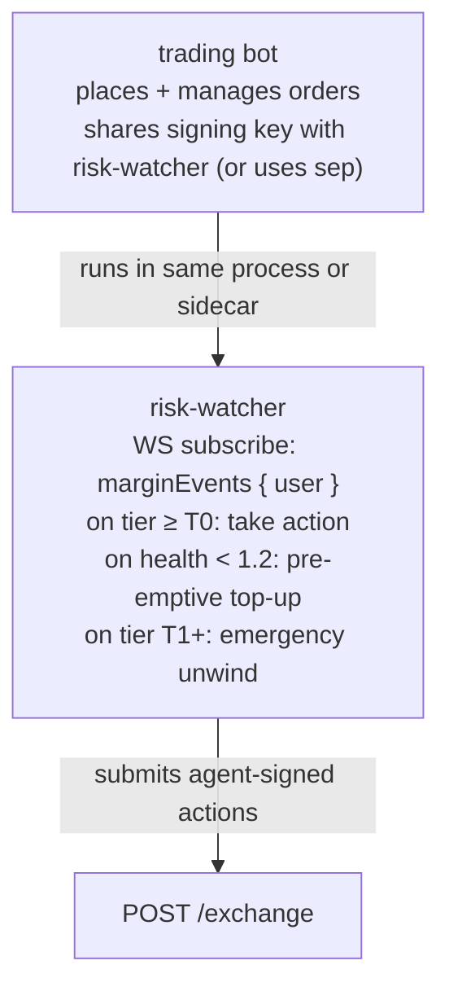

# Modèle de surveillance des risques

:::tip
**Stable.**
:::

Un surveillant de risques est un processus automatisé qui surveille la santé de votre compte et intervient — en déposant de la marge, en réduisant une position ou en négociant défensivement — avant que la [liquidation par paliers](../concepts/tiered-liquidation.md) du protocole ne s'applique à vous.

Les bots de trading en production qui conservent des positions pendant la nuit doivent en faire fonctionner un. Le carton jaune T0 du protocole vous accorde un bloc (~100 ms) ; un surveillant de risques met ce bloc à profit.

## En résumé

Abonnez-vous à `marginEvents`, réagissez aux transitions de palier, rechargez via `UpdateIsolatedMargin` (Isolé) ou `Deposit` (Croisé) avant que `maint_margin` ne devienne contraignante.

## Architecture



Le surveillant est un processus logique distinct même lorsqu'il est colocalisé — ses décisions sont indépendantes de celles de la stratégie de trading. Un mode d'échec courant consiste à confondre « dois-je clôturer cette position ? » avec « dois-je prendre ce trade ? » ; les surveillants de risques ne répondent qu'à la première question.

## Entrées

- Push WS `marginEvents` : `account_value`, `maint_margin`, `health`, `tier` en temps réel.
- Push WS `mark` (par actif détenu) : pour l'estimation prospective.
- Push WS `fundingTicks` : pour anticiper les frais de financement horaires.

## Règles de réaction

| Déclencheur | Action | Justification |
|---------|--------|-----------|
| `health < 1.5` en baisse sur 5 échantillons consécutifs | Dépôt préventif pour porter la santé à 1,8 | Tampon avant T0 |
| `tier transition to T0` | Dépôt immédiat OU clôture partielle | Un bloc pour agir avant T1 |
| `tier transition to T1` | Urgence : clôture complète de la position la plus déficitaire | Devancer la clôture partielle à un prix moins favorable |
| Paiement de financement dans la prochaine minute > 0,5 × `free_collateral` | Dépôt anticipé | Un frais de financement peut vous faire basculer en T0 |
| Mark évolue de plus de 3× sigma récent sur 1h en 30s | Instantané des positions + alerte opérateur | Possible changement de régime |

Ajustez les seuils à votre stratégie. Teneurs de marché agressifs : tampons plus serrés (plancher de santé à 1,3). Livres conservateurs : plus souples (plancher de santé à 1,8).

## Esquisse d'implémentation (TypeScript)

```typescript
import { MetaFluxClient } from '@metaflux/sdk';

const trader = new MetaFluxClient({ /* trading agent */ });
const watcher = new MetaFluxClient({ /* dedicated watcher agent */ });

const TARGET_HEALTH = 1.8;
const T0_DEPOSIT_USDC = 1000;  // tune to position size

let recentSamples: number[] = [];

watcher.ws().subscribe('marginEvents', { user: trader.address }, async (event) => {
  const { health, tier, account_value, maint_margin } = event.data;

  recentSamples.push(health);
  if (recentSamples.length > 5) recentSamples.shift();

  // Tier-based reactions
  if (tier === 'T1') {
    console.log('[ALERT] T1 — emergency unwind');
    await emergencyUnwind(trader);
    return;
  }
  if (tier === 'T0') {
    console.log('[WARN] T0 — top up');
    await deposit(watcher, T0_DEPOSIT_USDC);
    return;
  }

  // Pre-emptive
  const allFalling = recentSamples.length === 5
    && recentSamples.every((h, i) => i === 0 || h < recentSamples[i-1]);
  if (allFalling && health < 1.5) {
    console.log('[INFO] pre-emptive top-up');
    const needed = Math.ceil((TARGET_HEALTH * maint_margin - account_value) / 1e6);
    await deposit(watcher, needed);
  }
});

async function deposit(c: MetaFluxClient, usdc: number) {
  // For Cross: assume USDC already in the master's free balance
  // For Isolated: use UpdateIsolatedMargin to add to the bucket
  await c.exchange.updateIsolatedMargin({
    asset: 0,
    isIsolated: true,
    isolatedAmount: (usdc * 1e6).toString(),
  });
}

async function emergencyUnwind(c: MetaFluxClient) {
  const state = await c.info.clearinghouseState();
  for (const pos of state.assetPositions) {
    // close the largest-loss position first
    await c.exchange.order({
      asset: pos.coin,
      isBuy: pos.szi < 0,    // opposite side closes
      price: '0',            // market (extreme price)
      size:  Math.abs(pos.szi).toString(),
      tif:   'Ioc',
      reduceOnly: true,
    });
  }
}
```

## Choix clés

- **Agent distinct pour le surveillant.** L'agent du trader s'occupe du trading ; l'agent du surveillant gère la marge. La compromission de l'hôte de trading ne permet pas la manipulation de la marge.
- **Autorité du surveillant.** Les agents peuvent soumettre `UpdateIsolatedMargin` et passer / annuler des ordres. Les agents NE PEUVENT PAS effectuer de retraits, de sorte que le surveillant ne peut pas déplacer des fonds hors du compte — uniquement entre les sous-compartiments. C'est le comportement souhaité.
- **Espace de nonce du surveillant.** Le surveillant et le trader partagent l'espace de nonce du compte maître (voir [portefeuilles agents](../concepts/agent-wallets.md)). Utilisez `Date.now()` sur les deux — le risque de collision est inférieur à la milliseconde.

## Calcul du pré-dépôt

Pour porter la santé de H₀ à la cible H₁ :

```
needed_deposit = (H₁ - H₀) × maint_margin
```

Exemple : maint = 10 USDC, santé actuelle 1,0, cible 1,5.
Nécessaire = (1,5 - 1,0) × 10 = 5 USDC.

Plafonnez le dépôt par bloc de votre surveillant pour éviter de dépenser trop lors d'un régime transitoire. Défaut agressif : 1× le notionnel de la position en réserve pour les rechargements ; une fois épuisé, escalader vers l'opérateur.

## Séquence — rechargement préventif

```mermaid
sequenceDiagram
    Note over Watcher: T = 0  health = 1.6 (Safe)
    Note over Watcher: T = 1s  mark drops 1%; health = 1.4 → sample drop
    Note over Watcher: T = 2s  mark drops 0.5%; health = 1.3 → 2nd drop
    Note over Watcher: T = 3s  ... → 3rd
    Note over Watcher: T = 4s  ... → 4th
    Note over Watcher: T = 5s  health = 1.0 → 5 samples falling; pre-empt
    Note over Watcher: T = 5s  compute needed = (1.8 - 1.0) × maint = 0.8 × maint
    Watcher->>Exchange: T = 5.1s  submit UpdateIsolatedMargin deposit
    Exchange-->>Watcher: T = 5.2s  202 admitted
    Note over Exchange: T = 5.3s  commit; health = 1.8 → Safe
    Exchange-->>Watcher: T = 5.3s  marginEvents push: tier=Safe; reaction loop continues
```

## Modes d'échec

- **Course entre surveillant et trader.** Le trader soumet une nouvelle position ; le surveillant réagit à la position en transit. Résolution : ne réagir qu'après le commit (les événements de marge se déclenchent au commit, donc c'est déjà le cas).
- **Agent propre du surveillant expiré.** En plein stress, le surveillant ne peut pas agir. Atténuation : cadence de rotation serrée, surveillance de l'expiration des agents, jamais moins de 24h avant expiration.
- **Mempool saturé en période de stress.** Le dépôt du surveillant reçoit un 503. Relance avec jitter exponentiel ; soumettre au maximum toutes les 100 ms.
- **Le dépôt réussit mais l'oracle reste défavorable.** Le dépôt augmente `account_value` ; si `maint` a aussi augmenté (le mark a évolué contre vous), la santé peut ne pas s'améliorer suffisamment. Boucle : réévaluer après le commit ; déposer à nouveau ou dénouer.

## Quand NE PAS déployer un surveillant de risques

- Positions très éphémères (ouverture et clôture dans un même bloc) — la santé n'a pas d'importance.
- Trading au comptant pur sans marge — aucune échelle de liquidation ne s'applique.
- Bots à position isolée unique où vous avez explicitement accepté la limite de perte du compartiment — automatiser les rechargements annule le cloisonnement.

## Voir aussi

- [Liquidation par paliers](../concepts/tiered-liquidation.md) — l'échelle contre laquelle vous vous défendez
- [`userEvents` WS](../api/ws/subscriptions.md#userevents) — les transitions de marge / palier transitent par ce canal
- [`update_isolated_margin`](../api/rest/exchange.md#update_isolated_margin)
- [Portefeuilles agents](../concepts/agent-wallets.md) — le surveillant a besoin de son propre agent approuvé
- [Gestion des erreurs](./error-handling.md) — pour la logique de nouvelle tentative de soumission de dépôt
