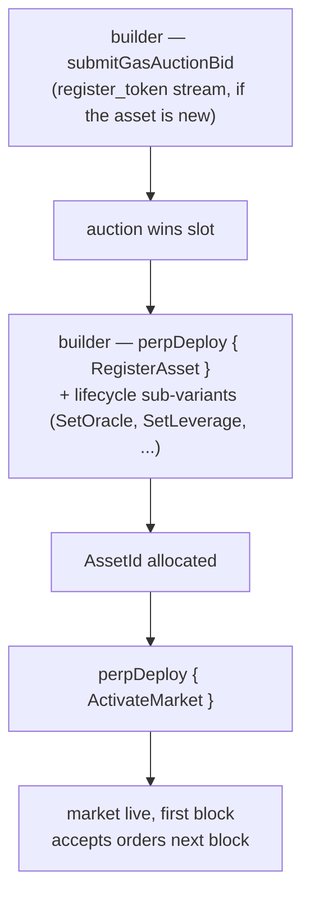

# MIP-3 — Déploiement de marché perpétuel sans permission

:::info
**Implémenté.**
:::

N'importe quel développeur peut déployer un nouveau marché de contrats perpétuels sur MetaFlux en passant par une enchère de gas on-chain. Il n'y a ni validation de la part de l'équipe du protocole, ni comité de révision, ni liste blanche. Le prix de l'enchère et un dépôt minimum constituent les seules barrières. (Le déploiement de marché **au comptant** sans permission est la proposition sœur, [MIP-1](./mip-1.md).)

## Pourquoi cette fonctionnalité existe

C'est une capacité fondamentale du protocole. Les exchanges centralisés sélectionnent manuellement leurs listings ; MetaFlux fait du processus de listing lui-même une composante du protocole. Les développeurs qui souhaitent ouvrir un marché pour un actif de niche n'ont besoin d'aucune autorisation — il leur suffit de remporter une enchère et de fournir des paramètres initiaux.

Il s'agit de l'adaptation par MetaFlux du modèle de déploiement de marché sans permission, pionnier des principales plateformes de contrats perpétuels on-chain, avec les équivalences et ajustements suivants :

- Trois flux d'enchères de gas distincts (`perp_deploy_gas_auction`, `spot_pair_deploy_gas_auction`, `register_token_gas_auction`) — même structure que HL. Le déploiement perp relève du MIP-3 ; les flux au comptant renvoient au [MIP-1](./mip-1.md).
- Paramètres d'enchère (décroissance, fenêtre de remboursement, intervalle de slot) configurables par la gouvernance
- Ratio de maintenance initial, effet de levier maximal, plafond de funding — soumis avec l'offre de déploiement, encadrés par des plages définies par la gouvernance

## Flux de déploiement



Le déploiement d'un contrat perpétuel s'effectue via l'action `perpDeploy`, dispatchée par un sous-variant `PerpDeployKind` couvrant le cycle de vie complet du marché (8 sous-variants) :

1. **`RegisterAsset`** — enregistre un nouvel actif perpétuel et lui alloue un `AssetId`. (Nécessite que le symbole du token soit enregistré au préalable via le flux `register_token_gas_auction`, s'il ne l'est pas déjà.)
2. **`SetOracle`** — associe ou fait pivoter le sous-ensemble de sources oracle pour l'actif.
3. **`SetLeverage`** — définit le plafond d'effet de levier maximal.
4. **`SetFeeTier`** — définit le palier de frais maker / taker (en bps, plafonné par les limites par marché).
5. **`SetMakerRebate`** — définit le rabais maker (en bps, ≤ 2).
6. **`SetMinSize`** — définit la taille minimale d'ordre pour le marché.
7. **`ActivateMarket`** — active le marché (autorise les échanges ; nécessite une configuration complète).
8. **`DeactivateMarket`** — ferme le marché aux nouveaux ordres (les positions existantes sont maintenues).

L'obtention d'un slot de déploiement passe par l'enchère de gas : un développeur appelle **`submitGasAuctionBid { auction_kind, bid_amount, ... }`** sur le flux concerné. Chaque offre comprend :
- Un montant en USDC, mis sous séquestre à la soumission et remboursé en cas de perte (déduction faite d'une petite commission).
- Les spécifications du marché — effet de levier initial, ratio de marge de maintenance, paramètres de funding, configuration des sources oracle.

Les enchères sont résolues aux limites des blocs — le plus offrant par slot remporte l'enchère, le montant payé est brûlé (non attribué à quiconque), et les paramètres de spécification deviennent les paramètres du marché déployé.

## Séquestre et remboursement des offres

Les offres sont conservées en séquestre pendant toute la durée de l'enchère. En cas de perte, l'offre est restituée sur le compte du développeur, déduction faite d'une petite commission d'enchère. En cas de victoire, le montant gagnant est brûlé à la clôture du slot (non attribué à quiconque).

Les offres actives sont consultables via :

```json
POST /info { "type": "mip3_active_bids" }
```

## Limites des paramètres

La gouvernance définit les bornes dans lesquelles les paramètres de spécification des offres doivent s'inscrire :

- Effet de levier initial dans `[1, max_leverage]` (valeur par défaut `max_leverage = 50`)
- Ratio de marge de maintenance ≥ `min_maintenance_ratio` (valeur par défaut 1 %)
- Plafond de funding ≤ `max_funding_per_hour` (valeur par défaut 0,5 %)
- Source oracle issue de la liste approuvée

Les offres dont les paramètres sont hors limites sont rejetées à la soumission.

## Paramètres des enchères

Par flux (perp / au comptant / enregistrement de token), l'enchère dispose des éléments suivants :

- **Intervalle de slot** — fréquence à laquelle une nouvelle enchère se règle (gouvernance, valeur par défaut 1 heure)
- **Décroissance** — rythme de baisse de l'offre minimale si un slot n'est pas attribué (gouvernance, valeur par défaut linéaire sur 24 h)
- **Fenêtre de remboursement** — durée après la clôture du slot pendant laquelle les soumissionnaires perdants peuvent réclamer leur remboursement (gouvernance, valeur par défaut 7 jours)

Ces trois paramètres sont modifiables par la gouvernance (variables globales de gouvernance des développeurs MIP-3).

## Après le déploiement

Le nouveau marché figure dans le registre d'actifs canonique dès le bloc suivant. La liquidité est à la charge du développeur ; le protocole ne fournit aucun ordre initial.

Les développeurs amorcent généralement la profondeur de marché en combinant un déploiement MIP-3 avec une source de liquidité sur le même marché — [MIP-2 Metaliquidity](./mip-2.md), un market maker externe attiré par les rabais de frais accordés aux développeurs, ou un vault créé par l'utilisateur.

## MIP-4

Voir [MIP-4 — agrégateur / internaliseur de liquidité pour les perps](mip-4.md) pour l'agrégateur opéré par MetaFlux qui complète le déploiement sans permission.

## Voir aussi

- [MIP-1 — standard de token au comptant + déploiement de marché](./mip-1.md) — la proposition sœur au comptant du déploiement sans permission
- [Liquidation étagée](../concepts/tiered-liquidation.md) — s'applique aux marchés déployés via MIP-3 de la même façon qu'aux marchés listés par le protocole
- [Marge de portefeuille](../concepts/portfolio-margin.md) — les marchés MIP-3 optent pour la PM via l'inclusion de scénarios standard
