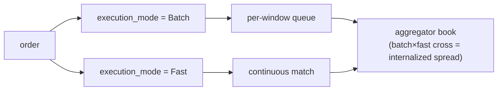

# MIP-4 — Agrégateur / Internaliseur de Liquidité Perps

:::info
**Planifié.** Ciblé pour la V2 ; hors périmètre du mainnet v1.
:::

MIP-4 est un **agrégateur / internaliseur de liquidité perps** opéré par MetaFlux — un grossiste qui absorbe le flux d'ordres entrant contre son propre carnet et empoche le spread d'internalisation. Le modèle est directement emprunté à la structure des marchés actions, où un unique grossiste traitant une large part du flux de détail gère la ligne la plus rentable du secteur. MIP-4 transpose ce modèle aux contrats perpétuels on-chain.

## Pourquoi ce mécanisme existe

Une approche guidée par les capacités : plutôt que de concurrencer sur l'étendue des cotations (c'est l'objet de [MIP-3](./mip-3.md)), MIP-4 concurrence sur la qualité d'exécution pour le flux de détail. En internalisant le flux contre son propre carnet à cours limites, l'agrégateur peut récupérer le spread qui serait autrement reversé sous forme de frais maker — et en restituer une partie à l'utilisateur sous forme d'amélioration de prix. C'est le même argument qu'un grossiste de courtage de détail : « meilleur prix, souvent supérieur au meilleur carnet. »

Ce mécanisme s'associe naturellement à une interface de détail de style Robinhood construite au-dessus des SDK clients existants — c'est du produit / front-end, pas du protocole.

## En quoi cela consiste

Un nouveau mode de marché et une couche protocolaire qui :

1. **Tient son propre carnet d'ordres par actif** — `BTC-AGG`, `ETH-AGG`, `SOL-AGG`, etc. — en parallèle des marchés MIP-3 correspondants (`BTC`, `ETH`, `SOL`). Le carnet agrégateur est distinct du CLOB canonique, avec sa propre structure de prix et de profondeur.
2. **Exécute sur deux niveaux**, sélectionnés par ordre via un champ `execution_mode` :
   - **Batch** (frais réduits, ~1–2 bps taker) — les ordres s'accumulent dans une file d'attente par fenêtre temporelle et se compensent à un prix unique toutes les `batch_window_ms` (défaut 200–300 ms). Compensation à prix uniforme de type FBA au sein du propre carnet de l'agrégateur. Libellé UI : « Meilleur Prix ».
   - **Fast** (frais plus élevés, ~5–8 bps taker) — les ordres se matchent en continu contre le carnet à cours limites de l'agrégateur au meilleur prix disponible. Libellé UI : « Instantané ».
3. **Capture le spread d'internalisation** — lorsque le flux Batch croise le flux Fast (ou que deux ordres Batch se croisent), l'agrégateur se place au milieu et capture le spread. C'est le véritable moteur de revenus.

Pour les marchés agrégateur, le champ `execution_mode` est obligatoire ; pour les marchés Continu/FBA canoniques, il est ignoré.

## Deux niveaux d'exécution — Batch vs Fast

Les deux niveaux s'exécutent contre le **propre** carnet de l'agrégateur ; l'utilisateur choisit le niveau par ordre via le champ `execution_mode`. L'internalisation est ce qui se produit *à l'intérieur* du carnet de l'agrégateur lorsque les deux niveaux se croisent.

- **Batch** — les ordres s'accumulent dans une file d'attente par fenêtre et se compensent à un prix uniforme unique toutes les `batch_window_ms` (défaut 200–300 ms), à la manière FBA.
- **Fast** — les ordres se matchent en continu contre le carnet à cours limites de l'agrégateur au meilleur prix disponible.
- **Internalisation** — lorsque le flux Batch croise le flux Fast (ou que deux ordres Batch se croisent), l'agrégateur se place au milieu et capture le spread. C'est le moteur de revenus.

### Routage résiduel (phases ultérieures)

Lorsque le carnet propre de l'agrégateur est trop mince pour absorber un ordre, le **résiduel** est routé vers l'extérieur — d'abord vers le CLOB on-chain canonique (les marchés MIP-3), puis, dans une phase ultérieure, vers des venues externes une fois que MetaBridge aura atteint sa maturité. Le recours aux venues externes est une mise à niveau **V3+** ; la cible de routage V2 est uniquement le CLOB on-chain. La structure ménage cette possibilité, mais la V2 ne l'embarque pas.

## Opéré par MetaFlux, non déployé par les builders

Contrairement à [MIP-3](./mip-3.md) — où tout builder peut déployer un marché sans permission via une enchère de gaz — l'agrégateur est opéré par **MetaFlux lui-même**. Seul le multisig de gouvernance peut déployer des instances d'agrégateur, et il n'existe qu'une instance canonique par actif.

Il s'agit d'un choix de conception délibéré et verrouillé :

- **Évite la sélection adverse** qu'entraînerait la fragmentation du même flux par plusieurs agrégateurs en concurrence.
- **Évite l'ambiguïté réglementaire** autour du market making sans permission.
- **Maintient le flux de revenus vers le protocole** — les revenus d'internalisation rejoignent la même cascade de frais que tout le reste (ci-dessous), et non la poche d'un opérateur tiers.

## Relation avec MIP-3 — complémentaire, non cannibaliste

MIP-3 et MIP-4 desservent deux côtés différents du flux :

- **Les marchés MIP-3** portent le **flux professionnel** et restent la venue de **découverte des prix**. Ce sont les marchés perp/spot canoniques déployés sans permission.
- **L'agrégateur MIP-4** porte le **flux de détail** via un carnet curé et internalisé.

L'agrégateur ne cannibalise pas MIP-3 : les traders professionnels continuent de trader les carnets MIP-3 (c'est là que vit le prix de référence), et l'agrégateur couvre même son inventaire en retour sur ces carnets. Bilatéral par conception. Les marchés agrégateur sont distingués par leur espace de nommage (`-AGG`) précisément pour que les deux ne se heurtent jamais.

## Économie des frais

Les revenus d'internalisation alimentent la **même cascade de distribution des frais que MIP-3** — il n'existe pas d'économie MIP-4 séparée. Conformément au [modèle de frais](../concepts/fees.md), les revenus de l'agrégateur s'écoulent comme suit :

- **70 %** — rachat et destruction (réduit l'offre effective)
- **20 %** — validateurs, qui le distribuent à leurs stakers sous forme de dividende
- **10 %** — Fondation / Trésorerie

Du côté de la clientèle de détail, les frais de code builder (plafonnés à 8 bps) constituent le siège économique naturel pour qu'une interface de détail monétise son flux d'ordres — le même mécanisme qu'un courtier de détail.

## Outcomes → MIP-6, reporté à la V3

Le numéro « MIP-4 » décrivait auparavant les **Outcomes / marchés de prédiction**. Ce mécanisme a été **renuméroté en [MIP-6](./mip-6.md)** et reporté à la **V3**. MIP-4 désigne désormais l'agrégateur et uniquement l'agrégateur ; ne pas réutiliser MIP-4 pour les Outcomes.

## Voir aussi

- [MIP-3 — déploiement de marché perp sans permission](./mip-3.md) — le côté complémentaire flux professionnel / découverte de prix
- [MIP-6 — Outcomes / marchés de prédiction](./mip-6.md) — la proposition Outcomes renumérotée, reportée à la V3
- [Frais](../concepts/fees.md) — la cascade de frais partagée que les revenus d'internalisation alimentent
- [FBA](../concepts/fba.md) — la mécanique de compensation par lots sur laquelle le niveau Batch s'appuie
