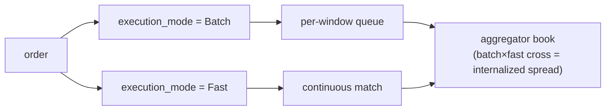

# MIP-4 — Agrégateur / Internaliseur de liquidité pour les perpétuels

:::info
**Planifié.** Ciblé pour V2 ; hors du périmètre du mainnet v1.
:::

MIP-4 est un **agrégateur / internaliseur de liquidité pour les contrats perpétuels** opéré par MetaFlux — un grossiste qui absorbe les flux d'ordres entrants contre son propre carnet et empoche le spread d'internalisation. Le modèle est directement emprunté à la structure des marchés actions, où un unique grossiste gérant une large part du flux de détail exploite la ligne d'activité la plus rentable du secteur. MIP-4 transpose ce schéma aux perpétuels on-chain.

## Pourquoi ce mécanisme existe

Un axe de différenciation fondé sur les capacités : plutôt que de concurrencer sur l'étendue des listings (c'est le rôle de [MIP-3](./mip-3.md)), MIP-4 se distingue par la qualité d'exécution pour le flux de détail. En internalisant le flux contre son propre carnet, l'agrégateur peut récupérer le spread qui serait autrement reversé sous forme de frais de maker — et en restituer une partie à l'utilisateur sous forme d'amélioration du prix. C'est le même argument qu'un grossiste pour courtier de détail : « meilleur prix, souvent supérieur au meilleur offre/demande ».

Ce mécanisme se couple naturellement à une interface utilisateur retail de style Robinhood construite au-dessus des SDK clients existants — c'est un sujet produit/front-end, pas protocolaire.

## Fonctionnement

Un nouveau mode de marché et une nouvelle couche protocolaire qui :

1. **Tient son propre carnet d'ordres par actif** — `BTC-AGG`, `ETH-AGG`, `SOL-AGG`, etc. — en parallèle des marchés MIP-3 correspondants (`BTC`, `ETH`, `SOL`). Le carnet de l'agrégateur est distinct du CLOB canonique, avec sa propre structure de prix et de profondeur.
2. **Exécute selon deux niveaux**, sélectionnés par ordre via un champ `execution_mode` :
   - **Batch** (frais faibles, ~1–2 bps preneur) — les ordres s'accumulent dans une file d'attente par fenêtre temporelle et se compensent à un prix unique toutes les `batch_window_ms` (200–300 ms par défaut). Compensation à prix uniforme de type FBA au sein du carnet de l'agrégateur. Libellé dans l'interface : « Meilleur prix ».
   - **Fast** (frais plus élevés, ~5–8 bps preneur) — les ordres se correspondent en continu contre le carnet au repos de l'agrégateur au meilleur niveau de carnet. Libellé dans l'interface : « Instantané ».
3. **Capture le spread d'internalisation** — lorsque le flux Batch croise le flux Fast (ou que deux ordres Batch se croisent), l'agrégateur s'interpose et capture le spread. C'est le véritable moteur de revenus.

Pour les marchés agrégateurs, le champ `execution_mode` est obligatoire ; pour les marchés Continu/FBA canoniques, il est ignoré.

## Deux niveaux d'exécution — Batch et Fast

Les deux niveaux s'exécutent contre le carnet **propre** de l'agrégateur ; l'utilisateur choisit le niveau par ordre via le champ `execution_mode`. L'internalisation désigne ce qui se produit *à l'intérieur* du carnet de l'agrégateur lorsque les deux niveaux se croisent.

- **Batch** — les ordres s'accumulent dans une file d'attente par fenêtre temporelle et se compensent à un prix uniforme unique toutes les `batch_window_ms` (200–300 ms par défaut), selon le mode FBA.
- **Fast** — les ordres se correspondent en continu contre le carnet au repos de l'agrégateur au meilleur niveau de carnet.
- **Internalisation** — lorsque le flux Batch croise le flux Fast (ou que deux ordres Batch se croisent), l'agrégateur s'interpose et capture le spread. C'est le moteur de revenus.

### Routage du résidu (phases ultérieures)

Lorsque le carnet propre de l'agrégateur est trop peu profond pour absorber un ordre, le **résidu** est rerouté — d'abord vers le CLOB on-chain canonique (les marchés MIP-3), puis, dans une phase ultérieure, vers des venues externes une fois MetaBridge arrivé à maturité. Le repli vers des venues externes est une évolution **V3+** ; la cible de routage V2 est le CLOB on-chain uniquement. La structure ménage cette possibilité, mais V2 ne l'embarque pas.

## Opéré par MetaFlux, non déployé par les builders

Contrairement à [MIP-3](./mip-3.md) — où n'importe quel builder peut déployer un marché de façon permissionless via une enchère de gas — l'agrégateur est opéré par **MetaFlux lui-même**. Seul le multisig de gouvernance peut déployer des instances d'agrégateur, et il n'existe qu'une instance canonique par actif.

Il s'agit d'un choix de conception délibéré et figé :

- **Évite la sélection adverse** liée à plusieurs agrégateurs concurrents fragmentant le même flux.
- **Évite l'ambiguïté réglementaire** autour du market-making permissionless.
- **Maintient les revenus dans le protocole** — les revenus d'internalisation alimentent la même cascade de frais que tout le reste (voir ci-dessous), et ne vont pas dans la poche d'un opérateur tiers.

## Relation avec MIP-3 — complémentaires, non cannibales

MIP-3 et MIP-4 servent deux types de flux distincts :

- **Les marchés MIP-3** accueillent le **flux professionnel** et restent le lieu de **découverte des prix**. Ce sont les marchés perp/spot canoniques, déployables de façon permissionless.
- **L'agrégateur MIP-4** accueille le **flux de détail** via un carnet internalisé et sélectionné.

L'agrégateur ne cannibalise pas MIP-3 : les traders professionnels continuent de trader sur les carnets MIP-3 (c'est là que vit le prix de référence), et l'agrégateur couvre même ses positions en retournant sur ces carnets. Bilatéral par conception. Les marchés agrégateurs sont distingués par l'espace de nommage (`-AGG`) précisément pour que les deux ne se télescopent jamais.

## Économie des frais

Les revenus d'internalisation alimentent la **même cascade de distribution des frais que MIP-3** — il n'y a pas d'économie spécifique à MIP-4. Conformément au [modèle de frais](../concepts/fees.md), les revenus de l'agrégateur se répartissent ainsi :

- **80 %** — rachat et destruction (réduit l'offre effective)
- **10 %** — validateurs
- **10 %** — Fondation / Trésorerie

Du côté retail, les frais de code builder (plafonnés à 8 bps) constituent le siège économique naturel pour une interface retail — le même mécanisme qu'un courtier retail pour monétiser son flux d'ordres.

## Outcomes → MIP-6, reporté à V3

Le numéro « MIP-4 » désignait précédemment les **Outcomes / marchés de prédiction**. Ce mécanisme a été **renuméroté en [MIP-6](./mip-6.md)** et reporté à **V3**. MIP-4 désigne désormais l'agrégateur et uniquement l'agrégateur ; ne pas réutiliser MIP-4 pour les Outcomes.

## Voir aussi

- [MIP-3 — déploiement permissionless de marché perp](./mip-3.md) — le côté complémentaire : flux professionnel / découverte des prix
- [MIP-6 — Outcomes / marchés de prédiction](./mip-6.md) — la proposition Outcomes renumérotée, reportée à V3
- [Frais](../concepts/fees.md) — la cascade de frais partagée que les revenus d'internalisation alimentent
- [FBA](../concepts/fba.md) — la mécanique de compensation par lots sur laquelle s'appuie le niveau Batch
