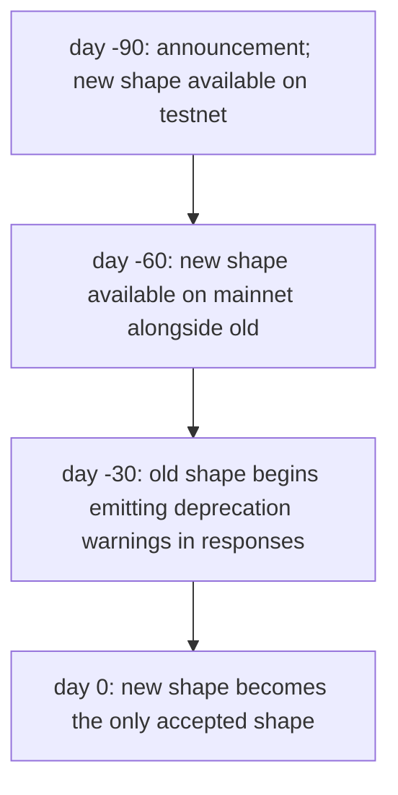
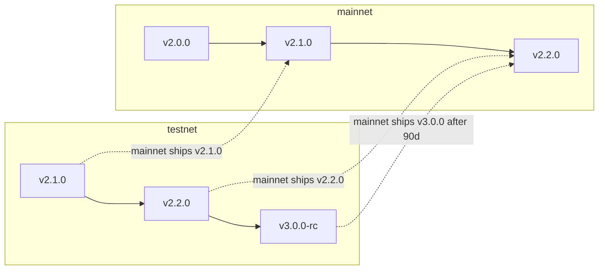

# Versioning & dépréciation

:::info
**Statut.** Politique **stable**. Les transitions de version spécifiques figurent dans le journal des modifications.
:::

## En bref

- La version du protocole est un triplet au format semver (`MAJOR.MINOR.PATCH`).
- Les changements incompatibles au niveau du format réseau vont dans `MAJOR` ; les ajouts rétrocompatibles dans `MINOR` ; les correctifs dans `PATCH`.
- Les changements incompatibles sur le mainnet nécessitent une fenêtre de dépréciation de 90 jours pendant laquelle les deux formats (ancien et nouveau) sont acceptés simultanément.
- Le testnet avance sur le mainnet afin de mettre en évidence les problèmes de migration avant la mise en production.

## Composants de version

La `protocol_version` du protocole est exposée via `/info node_info` :

```json
{
  "type": "node_info",
  "data": { "protocol_version": "1.2.0", ... }
}
```

| Composant | Signification | Exemples |
|-----------|---------------|----------|
| MAJOR | Changement incompatible du format réseau | Renommage de champs dans `Order` ; suppression d'une variante d'action ; modification du domaine de signature ; modification de la structure des URL RPC |
| MINOR | Ajout rétrocompatible | Nouvelle variante d'action ; nouveau type d'info ; nouveau canal WS ; nouvelle chaîne d'erreur |
| PATCH | Correctif sans impact sur le format | Corrections de bugs sans altération du format réseau ; améliorations de performance |

## Qu'est-ce que le « format réseau » ?

Le format réseau englobe tout ce à quoi un client s'engage dans sa logique de sérialisation et de signature. Plus précisément :

| Format réseau | Exemples |
|--------------|----------|
| Oui | Chaînes `type` des actions, noms de champs, types de champs, valeurs d'enum, structure des réponses, codes de statut, chaînes d'erreur, domaine EIP-712 |
| Oui | Conventions d'échelle numérique (entiers en virgule fixe, unités de base USDC) |
| Oui | Noms des canaux WS, structures des charges utiles, format des trames |
| Non | Stockage interne au serveur ; implémentation du consensus ; pondérations des sources mark/oracle (contrôlées par gouvernance, non versionnées dans le protocole) ; seuils des tranches de frais (gouvernance) |

Les paramètres modifiables par la gouvernance (tranches de frais, pondérations de composition du mark, chocs de scénarios, seuils de liquidation) ne font **pas** partie de l'engagement sur le format réseau. Leur **structure** est engagée ; leurs valeurs peuvent évoluer à tout moment.

## Engagement sur le mainnet

| Classe de changement | Notification | Période de grâce |
|----------------------|--------------|------------------|
| MAJOR (incompatible) | 90 jours avant l'activation | Ancien + nouveau format acceptés pendant ≥ 90 jours |
| MINOR (additif) | 0 jour ; annoncé dans le journal des modifications | s.o. |
| PATCH (correctif) | 0 jour | s.o. |

Un changement MAJOR est déployé selon le calendrier suivant :



La fenêtre de 90 jours correspond aux cycles de gestion des changements des institutions. Les opérateurs de bots ont largement le temps de migrer ; les clients peuvent exécuter un code compatible avec les deux formats pendant la période de chevauchement.

## Avertissements de dépréciation

Pendant la fenêtre de chevauchement, les réponses à l'ancien format incluent un avertissement non bloquant :

```json
{
  "accepted": true,
  "mempool_depth": 3,
  "_deprecation": {
    "field":      "params.price",
    "deprecated_at_version": "2.0.0",
    "removal_at_version":    "3.0.0",
    "migration": "use px (string, fixed-point 10^8)"
  }
}
```

Le champ `_deprecation` est toujours optionnel dans votre parseur — les clients utilisant le nouveau format ne le verront jamais.

## Journal des modifications

Le journal des modifications du protocole est publié sur `https://mtf.exchange/changelog` (URL provisoire avant le lancement) et mis en miroir dans ce dépôt sous `CHANGELOG.md`. Chaque entrée contient :

- Le triplet de version
- La date d'activation
- La classe (MAJOR / MINOR / PATCH)
- Une description par changement accompagnée de notes de migration pour les changements MAJOR / MINOR

Pour s'abonner :
- RSS sur `https://mtf.exchange/changelog.rss`
- GitHub Releases sur ce dépôt
- Notifications WS sur un canal `_meta` prévu (à venir)

## Le testnet en avance sur le mainnet

Le testnet tourne typiquement 1 à 2 versions mineures en avance sur le mainnet. Les problèmes de migration découverts sur le testnet sont résolus avant la date de déploiement sur le mainnet. Les opérateurs de bots disposant d'une intégration testnet reçoivent un avertissement anticipé des changements incompatibles.



## Ce que la gouvernance peut modifier sans versionnage

La couche protocole est versionnée au niveau du format réseau. La gouvernance peut modifier :

- Les paramètres par marché (pas de cotation, plafond d'effet de levier, ratio de maintenance, composition du mark, plafond de financement)
- Les seuils et taux des tranches de frais
- Les magnitudes des chocs de scénarios PM et la matrice de corrélation
- Les seuils des tranches de liquidation et les délais de refroidissement (dans certaines limites — les changements substantiels nécessitent une version MAJOR)
- Les budgets de limitation de débit
- Les ratios de réapprovisionnement du fonds d'assurance

Ces changements ne font **pas** évoluer la version du protocole. Ils émettent en revanche des événements sur le canal WS `_governance` prévu et sont interrogeables via `/info` pour leurs valeurs courantes.

Les clients qui effectuent des calculs à partir des valeurs de paramètres actuelles (par exemple, le calcul de la marge PM côté client) doivent lire les paramètres en temps réel ; ne jamais les coder en dur.

## Versionnage des SDK clients

Les SDK (`@metaflux/sdk`, `metaflux-client` pour Rust, `metaflux-client` pour Python) suivent le semver indépendamment du protocole :

- `0.x.y` — avant le mainnet ; changements incompatibles autorisés à chaque incrément de version mineure
- `1.x.y` — après le mainnet ; semver strict sur la surface d'API

La surface d'API `1.x` d'un SDK cible un MAJOR de protocole spécifique. Lorsque le protocole passe à un nouveau MAJOR, le SDK passe également à un nouveau MAJOR ; le SDK 1.x prend en charge le protocole 2.x, le SDK 2.x prend en charge le protocole 3.x, avec un support de chevauchement pendant la fenêtre de 90 jours.

## Mises en garde avant le mainnet

Jusqu'au lancement du mainnet :
- Le Devnet peut modifier le format réseau avec un préavis de 24 heures.
- Le testnet exécute la dernière version MINOR/MAJOR du protocole en avance sur la version prévue du mainnet ; des ruptures sur le testnet sont à prévoir.
- Les bandeaux de statut dans chaque page de documentation indiquent ce qui est stable, en préversion ou planifié.

## Voir aussi

- [Réseaux](./networks.md) — points de terminaison et chainIds par réseau
- [Sécurité](./security.md) — modèle de sécurité et politique de divulgation
